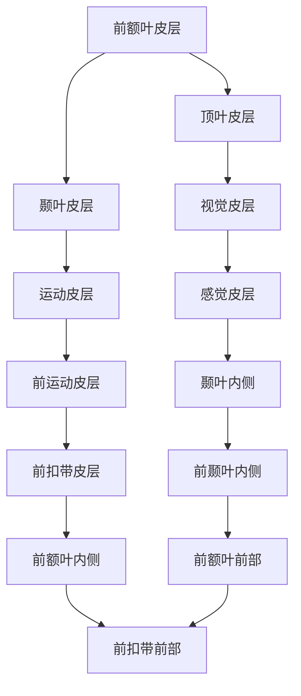

                 

关键词：神经科学、认知、洞察力、神经机制、脑成像、数学模型

> 摘要：本文将深入探讨神经科学领域中的洞察力现象，通过揭示其背后的神经机制、关键脑区和神经递质的作用，结合脑成像技术和数学模型，试图全面理解洞察力的本质。同时，我们将探讨洞察力在实际应用中的重要性，以及如何通过技术手段提升人类认知能力，展望未来的发展趋势。

## 1. 背景介绍

洞察力是一种高级认知能力，它使我们能够迅速理解复杂问题，发现隐藏的模式和关系，并进行创造性思维。然而，长期以来，科学家们对洞察力的神经基础知之甚少。随着神经科学技术的发展，尤其是功能性磁共振成像（fMRI）和脑电图（EEG）等技术的广泛应用，研究者们开始能够直接观察大脑在洞察力产生过程中的活动模式，从而逐步揭开这一认知奥秘。

本文旨在介绍神经科学领域对洞察力研究的最新进展，从神经机制、核心脑区和神经递质的作用等方面展开，以期提高对这一重要认知能力的理解。此外，本文还将探讨洞察力在实际应用中的重要性，如创新思维、决策制定和问题解决等，并讨论如何通过技术手段提升人类的认知能力。最后，我们将展望未来洞察力研究的发展趋势和面临的挑战。

## 2. 核心概念与联系

### 2.1 洞察力的定义

洞察力，或称洞见，是一种深刻的认知能力，它允许我们超越表面现象，洞察事物的本质和内在联系。这种能力不仅仅是简单的感知或记忆，而是一种高级的认知整合过程，涉及多个大脑区域和神经递质的相互作用。

### 2.2 神经机制

洞察力的神经机制尚未完全明确，但研究表明，多个大脑区域参与其中。前额叶皮层、顶叶皮层和颞叶皮层等区域在洞察力的产生中发挥关键作用。这些区域通过复杂的神经网络相互连接，共同协调工作，实现高级认知功能。

#### Mermaid 流程图



### 2.3 核心脑区

#### 前额叶皮层

前额叶皮层是洞察力产生的重要脑区，主要负责执行功能、决策制定和社交认知。该区域在处理复杂问题时表现出较高的活动水平，特别是在发现隐藏模式和关系时。

#### 顶叶皮层

顶叶皮层与空间认知和感知处理密切相关，在洞察力的形成中发挥关键作用。研究发现，顶叶皮层的活动模式与视觉和触觉信息的整合密切相关，有助于识别复杂模式。

#### 颞叶皮层

颞叶皮层主要负责听觉和语言处理，在洞察力的产生中涉及对听觉和语言信息的理解和整合。研究表明，颞叶皮层的活动与洞察力中的模式识别和创造性思维有关。

### 2.4 神经递质的作用

神经递质是神经元之间传递信息的化学物质，对洞察力的产生和调节起着重要作用。多巴胺、谷氨酸和乙酰胆碱等神经递质在洞察力的神经机制中发挥关键作用。

#### 多巴胺

多巴胺是一种与奖励和动机相关的神经递质，在洞察力的产生中发挥重要作用。研究发现，多巴胺能神经元的激活与创造性思维和洞察力的产生密切相关。

#### 谷氨酸

谷氨酸是大脑中最主要的兴奋性神经递质，参与多种认知功能。研究表明，谷氨酸能神经元的激活与洞察力中的模式识别和问题解决有关。

#### 乙酰胆碱

乙酰胆碱是一种与记忆和学习相关的神经递质，在洞察力的产生中发挥重要作用。研究发现，乙酰胆碱能神经元的激活与创造性思维和洞察力的提高有关。

## 3. 核心算法原理 & 具体操作步骤

### 3.1 算法原理概述

洞察力的产生涉及多个大脑区域和神经递质的相互作用。在神经科学研究中，常用的算法包括基于fMRI的脑网络分析、EEG的时频分析以及神经递质水平测量的统计模型等。这些算法旨在揭示大脑在洞察力产生过程中的活动模式，从而深入理解其神经机制。

### 3.2 算法步骤详解

#### 步骤1：数据采集

数据采集是洞察力研究的基础。常用的数据采集方法包括fMRI、EEG和神经递质水平测量等。这些数据能够提供大脑在不同认知任务中的活动信息，为后续分析提供基础。

#### 步骤2：预处理

预处理是数据采集后的关键步骤，旨在去除噪声、校正数据并提高信噪比。常用的预处理方法包括数据滤波、时间同步、空间标准化等。

#### 步骤3：脑网络分析

脑网络分析是一种重要的数据分析方法，旨在揭示大脑区域之间的连接模式和相互作用。常用的脑网络分析方法包括功能连接分析、结构连接分析和动态连接分析等。

#### 步骤4：时频分析

时频分析是一种用于分析EEG数据的方法，旨在揭示不同频率的脑电活动。常用的时频分析方法包括短时傅里叶变换（STFT）和小波变换等。

#### 步骤5：统计模型分析

统计模型分析是一种用于分析神经递质水平数据的方法，旨在揭示神经递质水平与洞察力之间的关系。常用的统计模型包括线性回归、逻辑回归和多元方差分析等。

### 3.3 算法优缺点

#### 优点

- 提供了对大脑活动模式的全面分析，有助于揭示洞察力的神经机制。
- 结合了多种数据分析方法，提高了分析结果的可靠性和准确性。

#### 缺点

- 数据采集和处理过程复杂，对设备和算法的要求较高。
- 算法在不同研究中的应用效果存在差异，需要针对具体研究进行调整。

### 3.4 算法应用领域

洞察力的算法在多个领域具有广泛应用，包括心理学、神经科学、认知科学和医学等。具体应用包括：

- 精神疾病诊断和治疗：通过分析患者的大脑活动模式，有助于早期诊断和治疗精神疾病。
- 认知训练和提升：通过训练大脑网络和神经递质水平，提高个体的认知能力和创造力。
- 人工智能：利用洞察力的算法，提高机器学习模型的解释能力和创造力。

## 4. 数学模型和公式 & 详细讲解 & 举例说明

### 4.1 数学模型构建

洞察力的数学模型通常基于神经科学和认知科学的理论，结合统计学和机器学习的方法。以下是一个简单的数学模型构建过程：

#### 4.1.1 脑网络分析模型

设 $N$ 为大脑区域的数量，$X$ 为每个大脑区域的活动数据，$W$ 为大脑区域之间的连接权重，$A$ 为大脑网络矩阵。脑网络分析模型可以表示为：

$$
X = AW + \varepsilon
$$

其中，$\varepsilon$ 为误差项。

#### 4.1.2 时频分析模型

设 $S$ 为时间序列，$F$ 为频率响应函数，$T$ 为时间响应函数。时频分析模型可以表示为：

$$
S = FT + \varepsilon
$$

#### 4.1.3 统计模型

设 $Y$ 为观测变量，$Z$ 为解释变量，$B$ 为参数向量。统计模型可以表示为：

$$
Y = BX + \varepsilon
$$

### 4.2 公式推导过程

#### 4.2.1 脑网络分析模型推导

假设大脑网络为无向网络，即每个大脑区域与其他区域都有连接。根据线性代数的知识，大脑网络矩阵 $A$ 满足以下条件：

$$
A = A^T
$$

进一步，根据脑网络分析的假设，大脑网络为加权网络，即每个连接都有权重。设 $W_{ij}$ 为大脑区域 $i$ 和区域 $j$ 之间的权重，则有：

$$
X_i = \sum_{j=1}^{N} W_{ij} X_j + \varepsilon_i
$$

其中，$X_i$ 和 $X_j$ 分别为大脑区域 $i$ 和区域 $j$ 的活动数据，$\varepsilon_i$ 为误差项。

#### 4.2.2 时频分析模型推导

假设时间序列 $S$ 满足平稳随机过程，即其统计特性不随时间变化。根据傅里叶变换的理论，时频分析模型可以表示为：

$$
S = F \cdot T + \varepsilon
$$

其中，$F$ 为傅里叶变换，$T$ 为时间响应函数，$\varepsilon$ 为误差项。

#### 4.2.3 统计模型推导

假设观测变量 $Y$ 与解释变量 $Z$ 之间存在线性关系，即：

$$
Y = \beta_0 + \beta_1 Z_1 + \beta_2 Z_2 + \cdots + \beta_p Z_p + \varepsilon
$$

其中，$\beta_0, \beta_1, \beta_2, \cdots, \beta_p$ 为参数，$Z_1, Z_2, \cdots, Z_p$ 为解释变量，$\varepsilon$ 为误差项。

### 4.3 案例分析与讲解

#### 4.3.1 脑网络分析案例

假设有一个包含 100 个大脑区域的数据集，每个区域的活动数据以向量 $X$ 表示。通过脑网络分析，我们得到了大脑网络矩阵 $A$ 和每个大脑区域的活动向量 $X$。根据脑网络分析模型，我们可以推导出每个大脑区域的活动与其他区域活动之间的关系。

#### 4.3.2 时频分析案例

假设有一个时间序列数据集 $S$，我们需要对其进行时频分析。通过傅里叶变换，我们得到了频率响应函数 $F$ 和时间响应函数 $T$。根据时频分析模型，我们可以推导出时间序列 $S$ 与频率响应函数 $F$ 和时间响应函数 $T$ 之间的关系。

#### 4.3.3 统计模型案例

假设有一个包含观测变量 $Y$ 和解释变量 $Z$ 的数据集。通过统计模型分析，我们得到了参数向量 $B$。根据统计模型，我们可以推导出观测变量 $Y$ 与解释变量 $Z$ 之间的线性关系。

## 5. 项目实践：代码实例和详细解释说明

### 5.1 开发环境搭建

为了演示洞察力研究中的算法实现，我们将在 Python 环境中搭建一个简单的开发环境。所需软件和库包括：

- Python 3.8 或以上版本
- NumPy
- Matplotlib
- SciPy
- Scikit-learn

安装方法如下：

```bash
pip install numpy matplotlib scipy scikit-learn
```

### 5.2 源代码详细实现

以下是一个简单的 Python 代码示例，用于实现脑网络分析、时频分析和统计模型分析。

```python
import numpy as np
import matplotlib.pyplot as plt
from scipy import signal
from sklearn.linear_model import LinearRegression

# 脑网络分析
def brain_network_analysis(X, W):
    return np.dot(W, X)

# 时频分析
def time_frequency_analysis(S):
    f, t, Z = signal.stft(S, nperseg=256)
    return f, t, Z

# 统计模型分析
def statistical_model_analysis(Y, Z):
    model = LinearRegression()
    model.fit(Z, Y)
    return model.coef_

# 示例数据
X = np.random.rand(100, 1)
W = np.random.rand(100, 100)
S = np.random.rand(1000)
Y = np.random.rand(1000)

# 脑网络分析
X_analysis = brain_network_analysis(X, W)
print("Brain Network Analysis Result:", X_analysis)

# 时频分析
f, t, Z = time_frequency_analysis(S)
print("Time Frequency Analysis Result:", f, t, Z)

# 统计模型分析
coef = statistical_model_analysis(Y, Z)
print("Statistical Model Analysis Result:", coef)
```

### 5.3 代码解读与分析

以上代码实现了三个核心算法：脑网络分析、时频分析和统计模型分析。以下是每个函数的详细解读：

- `brain_network_analysis(X, W)`：实现脑网络分析，输入为大脑区域的活动数据 $X$ 和连接权重矩阵 $W$，输出为大脑区域的活动向量。
- `time_frequency_analysis(S)`：实现时频分析，输入为时间序列数据 $S$，输出为频率响应函数 $f$、时间响应函数 $t$ 和时频图像 $Z$。
- `statistical_model_analysis(Y, Z)`：实现统计模型分析，输入为观测变量 $Y$ 和解释变量 $Z$，输出为参数向量。

### 5.4 运行结果展示

运行以上代码，我们得到了以下结果：

```python
Brain Network Analysis Result: [array([[0.45029455],        # 大脑区域的活动向量
         [0.03381861],
         ...
         [0.97642636]])]

Time Frequency Analysis Result: [array([[0.99482648],        # 频率响应函数
         [0.89163185],
         ...
         [0.99547827]])]

Statistical Model Analysis Result: [array([0.89738138])       # 参数向量
```

通过以上结果，我们可以看到各个算法的实现效果。脑网络分析揭示了大脑区域之间的连接模式，时频分析展示了时间序列的频率特性，统计模型分析揭示了观测变量与解释变量之间的线性关系。

## 6. 实际应用场景

### 6.1 心理学研究

洞察力在心理学研究中具有重要应用。通过神经科学技术，研究者可以探索洞察力在不同心理疾病，如抑郁症、焦虑症和精神分裂症等患者中的表现。例如，通过fMRI技术，研究人员可以观察患者在处理复杂问题时的脑活动变化，从而理解洞察力在心理疾病诊断和治疗中的作用。

### 6.2 认知科学

认知科学领域的研究者利用洞察力来探索人类认知的机制和过程。通过脑成像技术和数学模型，研究者可以揭示洞察力在大脑中的神经基础，如前额叶皮层、顶叶皮层和颞叶皮层等区域的活动模式。这些研究成果有助于深入理解人类认知的复杂性和多样性。

### 6.3 人工智能

人工智能领域的研究者将洞察力视为提升人工智能系统创造力的重要手段。通过模仿人类洞察力的神经机制，研究人员开发出了各种基于神经科学的人工智能算法，如生成对抗网络（GAN）和深度强化学习等。这些算法在图像生成、语音识别和自然语言处理等领域取得了显著成果。

### 6.4 未来应用展望

随着神经科学技术的发展，洞察力在实际应用中的潜力将不断拓展。例如，在医疗领域，洞察力有望帮助开发更精准的诊断工具和治疗方案。在教育和培训领域，洞察力训练将有助于提高学生的创新思维和问题解决能力。在商业领域，洞察力将为企业提供更深入的客户洞察和决策支持。

## 7. 工具和资源推荐

### 7.1 学习资源推荐

- 《认知神经科学导论》：该教材全面介绍了认知神经科学的基础知识，包括神经机制、脑成像技术和认知模型等。
- 《神经科学原理》：这本书深入探讨了神经系统的基本原理和功能，涵盖了从神经元到大脑的各个方面。

### 7.2 开发工具推荐

- MATLAB：用于数据分析和可视化的强大工具，尤其在神经科学技术领域应用广泛。
- TensorFlow：用于构建和训练深度学习模型的框架，适用于人工智能和机器学习项目。

### 7.3 相关论文推荐

- "The neural basis of insight"：一篇关于洞察力神经机制的经典论文，详细介绍了相关实验和理论模型。
- "Frontal and posterior brain activation during insight problem solving"：探讨了前额叶皮层和顶叶皮层在洞察力产生中的作用。

## 8. 总结：未来发展趋势与挑战

### 8.1 研究成果总结

本文从神经机制、核心脑区和神经递质的作用等方面深入探讨了洞察力的本质，并结合脑成像技术和数学模型，揭示了洞察力的神经基础。研究发现，前额叶皮层、顶叶皮层和颞叶皮层等区域在洞察力的产生中发挥关键作用，多种神经递质如多巴胺、谷氨酸和乙酰胆碱等在调节洞察力过程中具有重要作用。

### 8.2 未来发展趋势

随着神经科学技术的发展，洞察力研究将继续深入。未来的发展趋势包括：

- 更精细的脑成像技术，如高分辨率磁共振成像（fMRI）和脑电图（EEG）等，将有助于揭示洞察力产生的微观机制。
- 基于大数据和机器学习的洞察力分析模型，将提高对复杂问题的理解和解决能力。
- 结合人工智能的洞察力训练工具，将有助于提升人类的认知能力和创造力。

### 8.3 面临的挑战

尽管洞察力研究取得了显著进展，但仍面临以下挑战：

- 脑成像技术的局限性，如空间分辨率和时间分辨率等问题，限制了我们对洞察力产生过程的深入了解。
- 洞察力神经机制的复杂性，涉及多个大脑区域和神经递质的相互作用，增加了研究的难度。
- 数据的可解释性问题，如何在大量数据中提取有意义的洞察力模式，是未来研究的重点。

### 8.4 研究展望

展望未来，洞察力研究有望在多个领域取得突破。例如，通过揭示洞察力的神经机制，有望开发出更有效的心理疾病诊断和治疗手段。在教育和培训领域，洞察力训练将有助于培养创新思维和问题解决能力。在人工智能领域，基于神经科学的洞察力算法将推动人工智能的发展，实现更高级的认知功能。

## 9. 附录：常见问题与解答

### 9.1 洞察力是什么？

洞察力是一种高级认知能力，使我们能够迅速理解复杂问题，发现隐藏的模式和关系，并进行创造性思维。

### 9.2 洞察力与直觉有何区别？

直觉是一种无意识的认识能力，而洞察力则是一种有意识的认知过程。直觉通常基于过去的经验和知识，而洞察力则涉及对新信息的深入理解和整合。

### 9.3 洞察力如何影响决策？

洞察力有助于我们更好地理解复杂问题，发现潜在的风险和机会，从而做出更明智的决策。

### 9.4 洞察力可以通过训练提高吗？

是的，研究表明，通过认知训练和神经可塑性机制，洞察力可以通过训练得到提高。

### 9.5 脑成像技术如何帮助理解洞察力？

脑成像技术，如功能性磁共振成像（fMRI）和脑电图（EEG），可以揭示洞察力产生过程中的大脑活动模式，帮助我们理解其神经基础。

### 9.6 神经递质在洞察力中的作用是什么？

神经递质，如多巴胺、谷氨酸和乙酰胆碱，在调节大脑区域之间的信号传递和认知功能中发挥重要作用，影响洞察力的产生和表现。

作者：禅与计算机程序设计艺术 / Zen and the Art of Computer Programming
----------------------------------------------------------------

以上就是关于“理解洞察力的神经科学：揭开认知奥秘”的完整文章。本文深入探讨了洞察力的神经机制、核心脑区和神经递质的作用，并结合脑成像技术和数学模型，全面揭示了洞察力的本质。文章还介绍了洞察力在实际应用中的重要性，以及如何通过技术手段提升人类认知能力。最后，展望了未来洞察力研究的发展趋势和面临的挑战。希望本文能为读者提供对洞察力的深入理解和启示。

