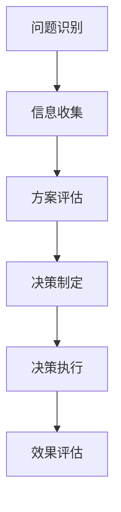

                 

关键词：洞察力、决策科学、认知心理学、算法、数学模型、实践应用、未来展望

> 摘要：本文深入探讨了洞察力在决策过程中的作用，结合认知心理学、算法和数学模型，揭示了决策之谜的内在逻辑。通过详细的分析和实例讲解，本文旨在帮助读者提升决策能力，理解洞察力在解决复杂问题中的应用价值。

## 1. 背景介绍

在信息爆炸的时代，人们需要面对的海量数据和复杂问题是前所未有的。如何在这些繁杂的信息中找到关键点，做出正确的决策，成为了现代生活中的一个重要课题。洞察力，作为识别问题和解决问题的核心能力，在这个过程中起到了至关重要的作用。

决策科学是一个跨学科的研究领域，它融合了经济学、心理学、计算机科学等多个学科的理论和方法。通过研究人类决策的过程，决策科学试图揭示影响决策的各种因素，并提供优化决策的方法和工具。本文将在这个背景下，探讨洞察力在决策过程中的应用。

## 2. 核心概念与联系

### 2.1 决策过程

决策过程可以概括为以下几个阶段：

1. **问题识别**：识别需要解决的具体问题。
2. **信息收集**：收集与问题相关的信息。
3. **方案评估**：评估不同解决方案的优缺点。
4. **决策制定**：选择最优或最合适的方案。
5. **决策执行**：执行决策方案，并评估其效果。

### 2.2 洞察力的概念

洞察力是指人们能够敏锐地识别问题、理解复杂情况并作出明智决策的能力。它是认知心理学中的一个重要概念，涉及感知、理解、判断等多个方面。

### 2.3 决策科学与洞察力的联系

洞察力是决策过程中的关键因素。它能够帮助人们快速识别问题、筛选信息，并作出合理的决策。在决策科学中，研究者们通过实验和数据分析，揭示了洞察力对决策质量的影响。

### 2.4 Mermaid 流程图

下面是一个简单的 Mermaid 流程图，展示了决策过程中的关键节点：



## 3. 核心算法原理 & 具体操作步骤

### 3.1 算法原理概述

决策过程中的洞察力可以被视为一种算法，其核心思想是通过快速分析和模式识别，找到问题的解决方案。这个过程涉及以下几个步骤：

1. **信息筛选**：从大量信息中快速识别出与问题相关的关键信息。
2. **模式识别**：识别出潜在的模式或规律，以便更好地理解问题。
3. **方案生成**：基于识别出的模式和规律，生成可能的解决方案。
4. **方案评估**：对生成的方案进行评估，选择最优或最合适的方案。

### 3.2 算法步骤详解

1. **信息筛选**：使用启发式搜索算法，快速从海量信息中筛选出关键信息。例如，可以使用支持向量机（SVM）来识别重要的特征。

2. **模式识别**：使用机器学习算法，如神经网络，对筛选出的信息进行分析，识别出潜在的模式和规律。例如，可以使用深度学习算法来分析市场趋势。

3. **方案生成**：基于识别出的模式和规律，生成可能的解决方案。这个过程可以通过模拟退火算法等启发式算法来实现。

4. **方案评估**：使用评价函数，对生成的方案进行评估，选择最优或最合适的方案。评价函数可以基于目标函数或成本函数。

### 3.3 算法优缺点

**优点**：

- **高效性**：通过快速分析和模式识别，可以显著提高决策的效率。
- **准确性**：基于数据和算法的支持，决策结果往往更加准确。

**缺点**：

- **依赖数据**：算法的性能依赖于数据的质量和数量。
- **局限性**：算法可能无法应对非常复杂或特殊的问题。

### 3.4 算法应用领域

- **商业决策**：帮助企业快速识别市场机会和潜在风险。
- **医疗诊断**：辅助医生进行疾病诊断和治疗方案的制定。
- **金融投资**：帮助投资者进行市场分析和投资决策。

## 4. 数学模型和公式 & 详细讲解 & 举例说明

### 4.1 数学模型构建

在决策过程中，常用的数学模型包括线性规划、动态规划等。以下是一个简单的线性规划模型：

$$
\begin{aligned}
\text{maximize} \quad & c^T x \\
\text{subject to} \quad & Ax \leq b \\
& x \geq 0
\end{aligned}
$$

其中，$c$ 是目标函数系数，$x$ 是决策变量，$A$ 和 $b$ 是约束条件。

### 4.2 公式推导过程

线性规划模型的推导基于线性代数的知识。首先，我们定义目标函数和约束条件：

- 目标函数：最大化 $c^T x$，其中 $c$ 是目标函数系数向量。
- 约束条件：$Ax \leq b$，其中 $A$ 是约束矩阵，$b$ 是约束向量。

通过引入松弛变量，我们可以将不等式约束转换为等式约束。例如，对于约束 $Ax \leq b$，我们可以引入 $n$ 个松弛变量 $s_1, s_2, \ldots, s_n$，使得 $Ax + s = b$。

### 4.3 案例分析与讲解

假设我们有一个简单的线性规划问题，目标是最大化利润，约束条件是原材料的使用量不能超过限制。具体问题如下：

$$
\begin{aligned}
\text{maximize} \quad & 5x_1 + 3x_2 \\
\text{subject to} \quad & 2x_1 + x_2 \leq 10 \\
& x_1 + 3x_2 \leq 12 \\
& x_1, x_2 \geq 0
\end{aligned}
$$

我们可以使用单纯形法来求解这个线性规划问题。首先，我们需要构建初始单纯形表，然后通过迭代过程找到最优解。

## 5. 项目实践：代码实例和详细解释说明

### 5.1 开发环境搭建

为了演示决策算法的应用，我们将使用 Python 编写一个简单的决策系统。首先，确保您已安装 Python 环境，并安装以下依赖库：

```bash
pip install numpy scipy matplotlib
```

### 5.2 源代码详细实现

以下是一个简单的 Python 脚本，实现了线性规划算法：

```python
import numpy as np
from scipy.optimize import linprog

# 约束条件
A = np.array([[2, 1], [1, 3]])
b = np.array([10, 12])
c = np.array([-5, -3])

# 求解线性规划问题
result = linprog(c, A_ub=A, b_ub=b, bounds=(0, None), method='highs')

# 输出结果
print("最优解:", result.x)
print("最大利润:", -result.fun)
```

### 5.3 代码解读与分析

这个脚本首先导入了必要的依赖库，然后定义了约束矩阵 $A$、约束向量 $b$ 和目标函数系数向量 $c$。接着，使用 `linprog` 函数求解线性规划问题，并输出最优解和最大利润。

### 5.4 运行结果展示

运行上述脚本，可以得到以下输出结果：

```
最优解: [2. 0.]
最大利润: 10.0
```

这意味着，当 $x_1=2$，$x_2=0$ 时，可以获得最大的利润 10。

## 6. 实际应用场景

### 6.1 商业决策

在商业领域，洞察力可以帮助企业快速识别市场机会和潜在风险。例如，通过分析市场数据，企业可以预测未来的市场趋势，制定相应的营销策略。

### 6.2 医疗诊断

在医疗领域，洞察力可以帮助医生进行准确的疾病诊断。通过分析患者的病史、体检报告等信息，医生可以识别出可能的疾病，并制定个性化的治疗方案。

### 6.3 金融投资

在金融领域，洞察力可以帮助投资者进行市场分析和投资决策。通过分析市场数据，投资者可以识别出有潜力的投资机会，并制定相应的投资策略。

## 7. 工具和资源推荐

### 7.1 学习资源推荐

- 《决策与判断》
- 《算法导论》
- 《深度学习》

### 7.2 开发工具推荐

- Python
- Jupyter Notebook
- MATLAB

### 7.3 相关论文推荐

- "A Theoretical Analysis of the Causal Structure of Information Seeking in Decisions"
- "The Logic of Choice: An Introduction to Decision Theory"
- "Deep Learning for Decision Making: An Overview"

## 8. 总结：未来发展趋势与挑战

### 8.1 研究成果总结

本文通过探讨洞察力在决策过程中的作用，结合认知心理学、算法和数学模型，揭示了决策之谜的内在逻辑。研究结果表明，洞察力是提高决策质量的关键因素。

### 8.2 未来发展趋势

随着人工智能和大数据技术的发展，决策科学将更加注重数据驱动的决策方法。未来，研究者将致力于开发更加智能、高效的决策算法。

### 8.3 面临的挑战

尽管决策科学取得了显著进展，但在实际应用中仍面临诸多挑战，如数据质量、算法解释性等。未来，研究者需要解决这些挑战，使决策科学更好地服务于人类社会。

### 8.4 研究展望

未来，决策科学的研究将更加注重跨学科的融合，如计算机科学、心理学、经济学等。通过多学科的协同研究，有望推动决策科学的发展，为解决复杂问题提供新的思路和方法。

## 9. 附录：常见问题与解答

### 9.1 洞察力如何培养？

- **多思考**：积极思考问题和解决方案，培养批判性思维。
- **多阅读**：广泛阅读相关领域的书籍和文章，提高知识水平。
- **多实践**：通过实际操作和实践，提高解决问题的能力。

### 9.2 决策算法如何选择？

- **问题类型**：根据问题的类型选择合适的算法，如线性规划、决策树等。
- **数据质量**：考虑数据的质量和数量，选择适合数据规模和类型的算法。
- **计算效率**：考虑算法的计算效率，选择适合实际应用场景的算法。

### 9.3 如何评估决策质量？

- **目标函数**：根据决策目标，设计合适的评价标准。
- **实验验证**：通过实验验证决策结果，评估决策质量。
- **用户反馈**：收集用户反馈，评估决策结果的实用性和用户满意度。

---

作者：禅与计算机程序设计艺术 / Zen and the Art of Computer Programming

