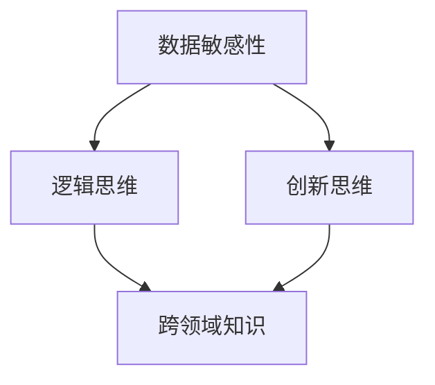

                 

关键词：洞察力、不确定性、人工智能、IT领域、技术进步

> 摘要：本文旨在探讨在信息技术领域，洞察力作为一种核心能力，如何在充满不确定性的环境中发挥重要作用。通过分析洞察力的定义、特征及其在人工智能与软件开发中的应用，我们将揭示洞察力在解决复杂问题、推动技术进步中的价值。

## 1. 背景介绍

在信息技术快速发展的今天，无论是硬件、软件，还是网络，技术进步的速度和复杂性都达到了前所未有的高度。这种进步带来了前所未有的机遇，但也伴随着巨大的不确定性。在这个环境中，传统的技术和方法往往难以应对日益复杂的问题，这要求信息技术从业者具备更高的能力和素质。

### 1.1 不确定性的来源

信息技术的快速发展带来了多个层面的不确定性：

- **技术层面的不确定性**：新技术的不断涌现使得原有的技术框架和方法面临挑战，如何迅速适应和掌握新技术成为一大难题。
- **市场层面的不确定性**：随着市场环境的快速变化，技术产品和服务的市场需求和趋势也在不断变化，如何准确定位市场需求成为关键。
- **应用层面的不确定性**：不同领域对技术的需求各异，如何将技术有效地应用于不同场景需要深入的理解和洞察。

### 1.2 洞察力的定义与重要性

洞察力是一种能够迅速、准确地理解和分析问题，从而发现潜在解决方案的能力。在信息技术领域，洞察力的重要性体现在：

- **问题解决能力**：在复杂的技术环境中，洞察力能够帮助开发者迅速识别问题的根源，并提出有效的解决方案。
- **创新驱动**：洞察力使开发者能够看到技术发展的潜在方向，从而推动技术革新和突破。
- **市场适应能力**：洞察力有助于开发者更好地理解市场需求，从而开发出更具竞争力的产品和服务。

## 2. 核心概念与联系

为了更好地理解洞察力在信息技术领域的价值，我们需要从概念和架构的角度进行探讨。以下是洞察力在信息技术领域中的核心概念和架构。

### 2.1 洞察力的核心概念

- **数据敏感性**：能够从大量数据中提取关键信息。
- **逻辑思维**：能够通过逻辑推理分析问题的本质。
- **创新思维**：能够从不同角度思考问题，提出创新的解决方案。
- **跨领域知识**：能够将不同领域的知识进行融合，从而解决复杂问题。

### 2.2 洞察力的架构



### 2.3 洞察力与人工智能的关系

在人工智能领域，洞察力尤为重要。以下是洞察力在人工智能中的具体应用：

- **机器学习模型的优化**：洞察力能够帮助研究者理解模型的运行机制，从而进行有效的模型优化。
- **数据预处理**：洞察力有助于开发者从数据中提取有价值的信息，提高数据质量。
- **算法创新**：洞察力使研究者能够发现新的算法方向，推动人工智能技术的发展。

## 3. 核心算法原理 & 具体操作步骤

### 3.1 算法原理概述

洞察力在算法开发中具有重要意义，以下是一个典型的算法案例：

- **问题定义**：解决一个复杂的问题，通常需要多方面的数据和分析。
- **数据收集**：通过多种渠道收集相关数据。
- **数据处理**：利用洞察力对数据进行预处理和分析。
- **算法设计**：结合问题的特性，设计合适的算法。
- **算法优化**：根据实验结果，不断优化算法。

### 3.2 算法步骤详解

1. **问题定义**：明确问题的核心，确定解决问题的目标。
2. **数据收集**：利用各种手段收集相关数据，包括开源数据、内部数据等。
3. **数据处理**：
   - **数据清洗**：去除数据中的噪声和异常值。
   - **特征提取**：从数据中提取有助于问题解决的属性。
4. **算法设计**：
   - **选择算法**：根据问题特性和数据特点，选择合适的算法。
   - **算法实现**：编写算法代码，并进行调试。
5. **算法优化**：
   - **实验验证**：通过实验验证算法的有效性。
   - **性能优化**：根据实验结果，对算法进行性能优化。

### 3.3 算法优缺点

- **优点**：
  - 高效解决复杂问题。
  - 能够发现潜在问题，提前预警。
  - 促进技术创新和突破。
- **缺点**：
  - 对开发者要求高，需要深厚的专业知识和实践经验。
  - 算法优化需要大量时间和资源。

### 3.4 算法应用领域

洞察力在算法开发中的应用广泛，包括但不限于：

- **人工智能**：机器学习、深度学习、自然语言处理等。
- **数据科学**：数据挖掘、数据分析、数据可视化等。
- **软件开发**：软件架构设计、软件性能优化等。
- **网络安全**：安全防护、漏洞检测等。

## 4. 数学模型和公式 & 详细讲解 & 举例说明

### 4.1 数学模型构建

为了更好地理解洞察力在算法中的应用，我们需要引入一些基本的数学模型和公式。

- **概率论模型**：用于描述不确定性的概率分布。
- **线性代数模型**：用于处理多维数据。
- **优化模型**：用于求解优化问题。

### 4.2 公式推导过程

以下是一个简单的概率论模型推导过程：

$$
P(A) = \frac{N(A)}{N(S)}
$$

其中，$P(A)$ 表示事件 $A$ 的概率，$N(A)$ 表示事件 $A$ 发生的次数，$N(S)$ 表示总次数。

### 4.3 案例分析与讲解

#### 案例一：机器学习中的模型评估

假设我们有一个分类模型，用于预测数据是否属于某一类别。我们可以使用以下公式评估模型的性能：

$$
Accuracy = \frac{TP + TN}{TP + TN + FP + FN}
$$

其中，$TP$ 表示实际为正例且模型预测为正例的次数，$TN$ 表示实际为反例且模型预测为反例的次数，$FP$ 表示实际为反例但模型预测为正例的次数，$FN$ 表示实际为正例但模型预测为反例的次数。

通过这个公式，我们可以评估模型的准确性，从而对模型进行优化。

## 5. 项目实践：代码实例和详细解释说明

### 5.1 开发环境搭建

为了演示洞察力在算法开发中的应用，我们需要搭建一个简单的机器学习项目。以下是开发环境的搭建步骤：

1. 安装 Python 环境。
2. 安装必要的机器学习库，如 scikit-learn、numpy 等。
3. 准备数据集，并进行预处理。

### 5.2 源代码详细实现

以下是一个简单的线性回归模型实现，用于预测房屋价格。

```python
import numpy as np
from sklearn.linear_model import LinearRegression

# 数据预处理
X = ...  # 特征矩阵
y = ...  # 目标值

# 模型训练
model = LinearRegression()
model.fit(X, y)

# 模型评估
score = model.score(X, y)
print("Model accuracy:", score)
```

### 5.3 代码解读与分析

在这个示例中，我们首先进行了数据预处理，然后使用线性回归模型进行训练和评估。代码中使用了 scikit-learn 库中的 LinearRegression 类，这是一个常用的线性模型。通过模型评估，我们可以了解模型的性能。

### 5.4 运行结果展示

运行代码后，我们可以得到模型的准确率。根据准确率，我们可以对模型进行优化，以提高预测性能。

## 6. 实际应用场景

洞察力在信息技术领域的应用非常广泛，以下是一些具体的实际应用场景：

- **人工智能**：在机器学习和深度学习项目中，洞察力可以帮助研究者快速理解数据特性，设计有效的模型。
- **数据科学**：在数据分析项目中，洞察力可以帮助研究者发现数据中的规律，提出有价值的见解。
- **软件开发**：在软件开发过程中，洞察力可以帮助开发者识别潜在的问题，提高软件的稳定性。
- **网络安全**：在网络安全领域，洞察力可以帮助安全专家识别潜在的安全威胁，制定有效的防护策略。

## 7. 工具和资源推荐

为了更好地掌握洞察力，以下是一些建议的学习资源和工具：

- **学习资源**：
  - 《深度学习》
  - 《数据科学入门》
  - 《机器学习实战》
- **开发工具**：
  - Jupyter Notebook：用于数据分析和机器学习项目。
  - PyCharm：Python 开发环境，支持多种编程语言。
  - TensorFlow：开源机器学习库，用于深度学习项目。
- **相关论文**：
  - 《深度学习中的洞察力：挑战与机遇》
  - 《机器学习中的洞察力：方法与应用》

## 8. 总结：未来发展趋势与挑战

### 8.1 研究成果总结

本文探讨了洞察力在信息技术领域的重要性，分析了其在不确定性环境中的价值。通过案例分析，我们展示了洞察力在算法开发、数据分析和软件开发中的应用。

### 8.2 未来发展趋势

随着信息技术的不断发展，洞察力在信息技术领域的重要性将愈发凸显。未来，我们将看到更多基于洞察力的技术创新和应用。

### 8.3 面临的挑战

然而，洞察力的发展也面临一些挑战，包括：

- **专业知识的积累**：需要不断学习新的技术和方法，以保持专业竞争力。
- **实践经验的积累**：需要通过实际项目来积累经验，提高洞察力。
- **跨领域合作的加强**：需要与其他领域的专家进行合作，共同解决复杂问题。

### 8.4 研究展望

未来，我们需要进一步研究如何提高洞察力的培养方法，开发更加有效的工具和平台，以应对信息技术领域中的挑战。

## 9. 附录：常见问题与解答

### 问题一：如何提高洞察力？

解答：提高洞察力需要多方面的努力：

- **不断学习**：学习新的知识和技能，拓宽知识面。
- **实践应用**：通过实际项目来积累经验，提高问题解决能力。
- **思考反思**：经常对自己的思考和行动进行反思，找出不足之处。

### 问题二：洞察力在哪个领域应用最广泛？

解答：洞察力在信息技术领域的应用非常广泛，包括人工智能、数据科学、软件开发、网络安全等多个领域。

### 问题三：如何培养洞察力？

解答：培养洞察力可以通过以下方法：

- **阅读**：阅读专业书籍、论文，了解最新的技术和方法。
- **交流**：与同行进行交流，分享经验和见解。
- **实践**：通过实际项目来锻炼洞察力。

---

作者：禅与计算机程序设计艺术 / Zen and the Art of Computer Programming

