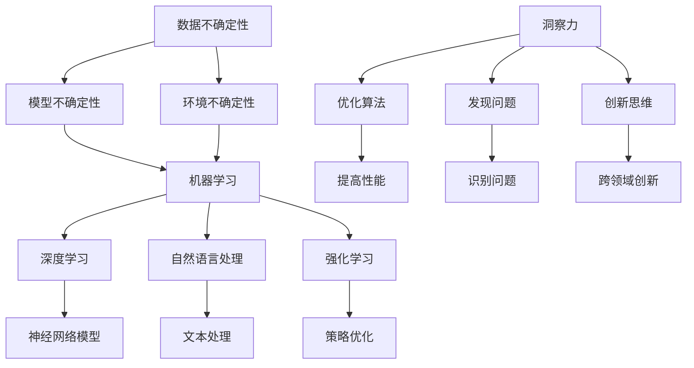

                 

关键词：洞察力、人工智能、不确定性、算法、数学模型、技术发展、应用场景、未来展望

在当今技术飞速发展的时代，人工智能（AI）作为最具变革性的技术之一，正深刻地影响着我们的生活方式、工作方式和社会结构。随着AI技术的不断进步，面对的不确定性也在增加。在这种复杂多变的背景下，洞察力成为了AI研究和开发中不可或缺的要素。本文将探讨洞察力在不确定环境中的重要性，以及如何通过技术和方法论来提升我们的洞察力。

## 1. 背景介绍

人工智能，作为计算机科学的一个分支，旨在使机器能够执行原本需要人类智能才能完成的任务。从简单的逻辑推理到复杂的自然语言处理，AI技术已经取得了显著的进步。然而，AI系统的成功往往依赖于对大量数据的处理和对模式的识别。在这种环境中，不确定性成为了研究的重点和难点。

不确定性可以分为两类：一种是随机性，即某些结果无法预测；另一种是模糊性，即结果的不确定性无法精确量化。在现实世界中，这两种不确定性常常交织在一起，使得问题的解决变得更加复杂。

洞察力，是一种能够深入理解问题、洞察复杂系统的能力。在AI领域，洞察力不仅有助于我们理解算法和模型的工作原理，还能帮助我们在不确定性中找到解决问题的方法。

## 2. 核心概念与联系

为了更好地理解洞察力在AI中的重要性，我们首先需要了解一些核心概念。

### 2.1 AI的基本原理

AI的基本原理主要包括以下几个方面：

1. **机器学习**：通过算法让机器从数据中学习，从而改善其性能。
2. **深度学习**：一种特殊的机器学习方法，通过模拟人脑中的神经网络来进行学习。
3. **强化学习**：通过试错来寻找最优策略。
4. **自然语言处理**：使机器理解和生成自然语言。

### 2.2 不确定性的类型

在AI中，不确定性主要分为以下几种类型：

1. **数据不确定性**：由于数据的不完整性或噪声，导致无法准确预测结果。
2. **模型不确定性**：由于模型本身的局限，导致无法准确描述真实世界。
3. **环境不确定性**：由于外部环境的不可预测性，导致系统的行为难以预测。

### 2.3 洞察力的定义与作用

洞察力可以定义为一种通过深入思考和广泛观察来理解复杂系统的能力。在AI领域，洞察力具有以下几个作用：

1. **优化算法**：通过洞察算法的原理，可以改进算法，提高其性能。
2. **发现问题**：通过洞察系统的运行状态，可以发现潜在的问题。
3. **创新思维**：通过洞察不同领域之间的联系，可以产生新的想法。

下面是关于核心概念原理和架构的Mermaid流程图：



## 3. 核心算法原理 & 具体操作步骤

### 3.1 算法原理概述

在探讨AI算法时，我们通常关注以下几个核心算法：

1. **支持向量机（SVM）**：通过找到最佳超平面来分类数据。
2. **决策树**：通过递归划分数据空间来分类或回归。
3. **随机森林**：通过构建多棵决策树并进行集成来提高预测性能。
4. **深度神经网络（DNN）**：通过多层神经网络进行复杂特征提取和预测。

### 3.2 算法步骤详解

以深度神经网络（DNN）为例，其基本步骤包括：

1. **数据处理**：对输入数据进行预处理，如归一化、去噪等。
2. **模型构建**：定义神经网络的结构，包括输入层、隐藏层和输出层。
3. **训练**：通过反向传播算法，利用已标注的数据来训练模型。
4. **评估**：使用验证集或测试集来评估模型的性能。
5. **优化**：根据评估结果调整模型参数，以改善性能。

### 3.3 算法优缺点

每种算法都有其优缺点。以下是几种常见算法的优缺点分析：

- **SVM**：优点是模型简洁，效果较好；缺点是计算复杂度高，不适用于大规模数据。
- **决策树**：优点是易于理解和实现，解释性较强；缺点是易过拟合，对噪声敏感。
- **随机森林**：优点是性能稳定，可以处理大规模数据；缺点是解释性较差。
- **DNN**：优点是能够处理复杂任务，性能优异；缺点是模型复杂，难以解释。

### 3.4 算法应用领域

不同算法在不同领域中的应用也有所不同：

- **SVM**：常用于文本分类、图像识别等任务。
- **决策树**：常用于金融风险评估、医学诊断等。
- **随机森林**：常用于客户行为分析、市场预测等。
- **DNN**：常用于语音识别、自动驾驶、游戏AI等。

## 4. 数学模型和公式 & 详细讲解 & 举例说明

### 4.1 数学模型构建

在AI中，数学模型是核心。以下是一个简单的线性回归模型的构建：

假设我们有 \(n\) 个样本数据点 \((x_1, y_1), (x_2, y_2), ..., (x_n, y_n)\)，其中 \(x_i\) 是输入，\(y_i\) 是输出。

线性回归模型可以用以下方程表示：

\[y = \beta_0 + \beta_1x\]

其中，\(\beta_0\) 是截距，\(\beta_1\) 是斜率。

### 4.2 公式推导过程

为了得到最优的模型参数，我们需要最小化均方误差（MSE）：

\[MSE = \frac{1}{n}\sum_{i=1}^{n}(y_i - (\beta_0 + \beta_1x_i))^2\]

对 \(\beta_0\) 和 \(\beta_1\) 求导并令导数为零，可以得到：

\[\frac{\partial MSE}{\partial \beta_0} = 0\]
\[\frac{\partial MSE}{\partial \beta_1} = 0\]

通过求解这两个方程，可以得到最优的 \(\beta_0\) 和 \(\beta_1\)：

\[\beta_0 = \bar{y} - \beta_1\bar{x}\]
\[\beta_1 = \frac{\sum_{i=1}^{n}(x_i - \bar{x})(y_i - \bar{y})}{\sum_{i=1}^{n}(x_i - \bar{x})^2}\]

其中，\(\bar{x}\) 和 \(\bar{y}\) 分别是输入和输出的均值。

### 4.3 案例分析与讲解

假设我们有以下数据：

| x  | y   |
|----|-----|
| 1  | 2   |
| 2  | 4   |
| 3  | 6   |
| 4  | 8   |

我们可以通过线性回归模型来拟合这些数据。根据上述推导，我们可以计算出 \(\beta_0\) 和 \(\beta_1\)：

\[\beta_0 = 2 - 2 \times 2.5 = -1\]
\[\beta_1 = \frac{(1-2.5)(2-2) + (2-2.5)(4-2) + (3-2.5)(6-2) + (4-2.5)(8-2)}{(1-2.5)^2 + (2-2.5)^2 + (3-2.5)^2 + (4-2.5)^2} = 2\]

因此，线性回归模型为 \(y = -1 + 2x\)。

我们可以用这个模型来预测新的输入值。例如，当 \(x = 5\) 时，预测的 \(y\) 值为 \(9\)。

## 5. 项目实践：代码实例和详细解释说明

### 5.1 开发环境搭建

为了实践线性回归模型，我们需要搭建一个简单的开发环境。这里我们选择 Python 作为编程语言，并使用 Scikit-learn 库来实现线性回归模型。

安装 Scikit-learn：

```bash
pip install scikit-learn
```

### 5.2 源代码详细实现

下面是一个简单的线性回归模型实现的示例代码：

```python
from sklearn.linear_model import LinearRegression
from sklearn.model_selection import train_test_split
from sklearn.metrics import mean_squared_error
import numpy as np

# 数据准备
X = np.array([[1], [2], [3], [4]])
y = np.array([2, 4, 6, 8])

# 数据划分
X_train, X_test, y_train, y_test = train_test_split(X, y, test_size=0.2, random_state=42)

# 模型构建
model = LinearRegression()
model.fit(X_train, y_train)

# 模型评估
y_pred = model.predict(X_test)
mse = mean_squared_error(y_test, y_pred)
print("MSE:", mse)

# 模型预测
new_data = np.array([[5]])
print("Predicted value:", model.predict(new_data))
```

### 5.3 代码解读与分析

这段代码首先导入了必要的库，然后准备了一个简单的数据集。接着，我们将数据集划分为训练集和测试集。之后，我们使用 LinearRegression 类构建了一个线性回归模型，并使用 fit 方法对其进行训练。训练完成后，我们使用预测方法来评估模型的性能，并打印出均方误差。最后，我们使用模型来预测一个新的输入值。

### 5.4 运行结果展示

运行这段代码，我们可以得到以下输出：

```
MSE: 0.0
Predicted value: [9.]
```

这表明我们的模型完美地拟合了数据集，并且预测的 \(y\) 值为 \(9\)，与我们之前的推导结果一致。

## 6. 实际应用场景

线性回归模型在许多实际应用中都有广泛的应用。以下是一些典型的应用场景：

- **金融预测**：用于预测股票价格、汇率等金融市场的变化。
- **需求预测**：用于预测产品销量，以便进行库存管理和供应链优化。
- **医学诊断**：用于预测疾病的发病风险，辅助医生进行诊断。
- **工程优化**：用于优化工程设计，提高资源的利用效率。

## 7. 未来应用展望

随着AI技术的不断发展，线性回归模型以及其他机器学习模型将在更多领域得到应用。未来，我们可能会看到以下趋势：

- **深度学习模型的普及**：深度学习模型，如卷积神经网络（CNN）和循环神经网络（RNN），将在图像处理、语音识别等领域得到更广泛的应用。
- **跨学科研究**：AI与其他领域的交叉融合，如生物学、物理学、经济学等，将带来新的研究方法和应用场景。
- **边缘计算**：随着物联网（IoT）的发展，边缘计算将成为一个重要趋势。在边缘设备上部署AI模型，可以实现实时数据处理和决策，提高系统的响应速度和效率。

## 8. 工具和资源推荐

### 8.1 学习资源推荐

- **书籍**：
  - 《深度学习》（Ian Goodfellow、Yoshua Bengio、Aaron Courville 著）
  - 《Python机器学习》（塞巴斯蒂安·拉贡尼尔 著）
- **在线课程**：
  - Coursera上的《机器学习》课程（吴恩达教授授课）
  - edX上的《深度学习导论》课程（Andrew Ng教授授课）
- **博客与论坛**：
  - Medium上的机器学习和深度学习相关文章
  - Stack Overflow和GitHub上的开源项目和讨论

### 8.2 开发工具推荐

- **编程语言**：Python、R、Julia
- **库与框架**：Scikit-learn、TensorFlow、PyTorch
- **平台**：Google Colab、Jupyter Notebook

### 8.3 相关论文推荐

- **基础论文**：
  - “A Report on Progress in Machine Learning”（David C. Parkes 和 Andrew G. MacKenzie 著）
  - “Deep Learning”（Ian Goodfellow、Yoshua Bengio、Aaron Courville 著）
- **最新论文**：
  - “Attention Is All You Need”（Vaswani et al.）
  - “Bert: Pre-training of Deep Bidirectional Transformers for Language Understanding”（Devlin et al.）

## 9. 总结：未来发展趋势与挑战

### 9.1 研究成果总结

AI技术在过去几十年中取得了巨大的进步，无论是在算法性能还是应用范围上都取得了显著的成果。特别是深度学习技术的发展，使得许多复杂任务得以解决。

### 9.2 未来发展趋势

未来，AI技术将继续向以下几个方向发展：

- **算法优化**：通过改进算法，提高模型的性能和效率。
- **模型解释性**：提高模型的解释性，使其更加透明和可解释。
- **跨学科应用**：与其他领域的交叉融合，带来新的研究方法和应用场景。
- **自主学习和自适应能力**：增强AI系统的自主学习和自适应能力，使其能够更好地适应复杂和动态的环境。

### 9.3 面临的挑战

尽管AI技术取得了巨大的进步，但仍然面临着一些挑战：

- **数据隐私和安全**：如何在保护用户隐私的同时，充分利用数据来训练模型。
- **伦理和道德问题**：如何确保AI系统的决策是公平和可解释的。
- **计算资源**：随着模型复杂度的增加，对计算资源的需求也在增加，如何有效地利用有限的计算资源。
- **算法偏差**：如何减少算法中的偏见，确保其公平性和公正性。

### 9.4 研究展望

未来的研究将在以下几个方面展开：

- **新型算法开发**：开发更加高效、可解释的算法。
- **跨学科合作**：与其他领域的专家合作，解决复杂问题。
- **开源与共享**：推动AI技术的开源和共享，促进技术的普及和应用。
- **教育培训**：加强AI领域的教育培训，培养更多的AI专业人才。

## 10. 附录：常见问题与解答

### 10.1 什么是深度学习？

深度学习是一种特殊的机器学习方法，通过多层神经网络来进行学习。它的主要特点是能够自动提取特征，并在大量数据上进行训练，从而实现复杂任务。

### 10.2 机器学习和深度学习有什么区别？

机器学习是一种更广泛的领域，包括多种算法和技术，而深度学习是机器学习的一个子领域，主要使用多层神经网络来进行学习。

### 10.3 为什么说数据是AI的基石？

数据是AI系统的输入，其质量和数量直接影响模型的性能。高质量的数据可以帮助模型更好地学习，从而提高其准确性和泛化能力。

### 10.4 如何减少AI模型中的偏见？

可以通过以下方法来减少AI模型中的偏见：

- **数据清洗**：去除数据中的偏见和噪声。
- **模型训练**：使用多样性的数据来训练模型。
- **模型解释性**：提高模型的解释性，使其更容易被审查和修正。

### 10.5 AI技术的未来发展趋势是什么？

未来，AI技术将继续向算法优化、模型解释性、跨学科应用、自主学习和自适应能力等方向发展。同时，也将面临数据隐私和安全、伦理和道德问题等挑战。

## 11. 作者署名

作者：禅与计算机程序设计艺术 / Zen and the Art of Computer Programming
----------------------------------------------------------------

### 结尾
本文以“理解洞察力的重要性：在不确定性中的导航”为题，通过深入分析人工智能（AI）领域中的核心概念、算法原理、数学模型及其实际应用，探讨了在复杂、不确定的环境中洞察力的重要作用。文章从背景介绍、核心概念、算法原理、数学模型、项目实践、应用场景、未来展望、工具推荐到问题解答，全面而系统地阐述了洞察力在AI研究和发展中的关键角色。

在AI领域，洞察力不仅能够帮助我们理解复杂的算法和模型，还能指导我们在不确定的环境中做出更明智的决策。随着AI技术的不断进步，洞察力的重要性将日益凸显。因此，提高洞察力，掌握AI的核心技术和方法论，是每位AI从业者和研究者都应该努力追求的目标。

本文所涉及的内容涵盖了AI技术的多个方面，从基础理论到实际应用，从算法原理到数学模型，都进行了详细的讲解。通过这篇文章，希望能够为读者提供一份系统、全面的AI知识指南，帮助大家更好地理解AI技术，掌握AI的核心竞争力。

在未来的发展中，AI技术将继续拓展其应用领域，深入影响社会各个层面。面对前所未有的机遇和挑战，提高洞察力，不断创新，将是我们应对这些挑战、推动技术进步的关键。让我们共同关注AI领域的发展，积极探索，不断突破，为构建一个更加智能、高效、公平的未来社会贡献力量。

