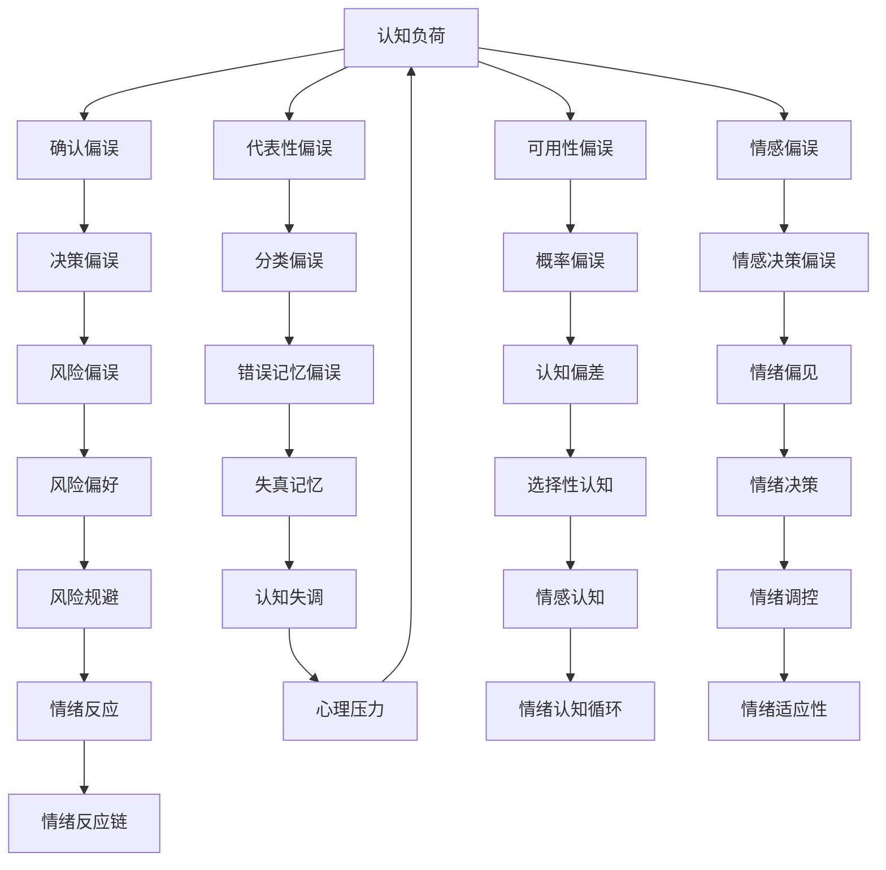
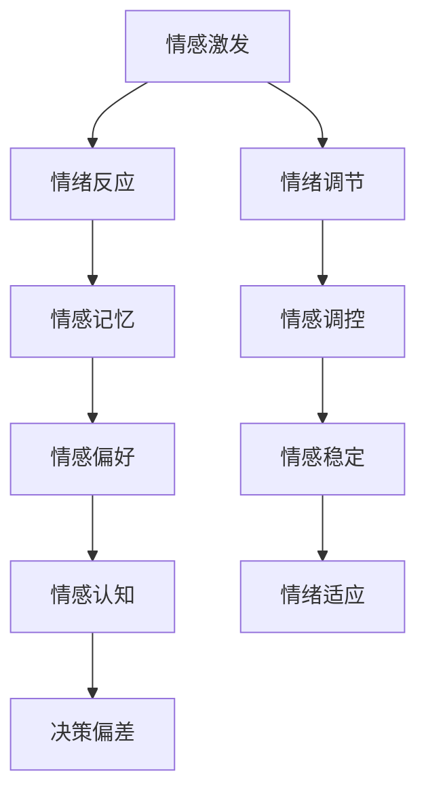
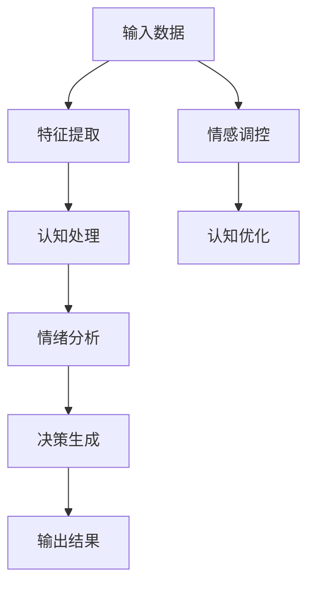

                 

关键词：认知偏误，情感干扰，洞察力，算法，技术博客

> 摘要：本文深入探讨了认知偏误和情感干扰对洞察力的影响，以及它们在技术领域中的具体体现。通过分析这些问题，本文旨在提高读者对这一主题的认识，并提出可能的解决策略。

## 1. 背景介绍

在技术领域中，洞察力是一种关键能力。它不仅决定了我们能否准确理解复杂问题，还影响了我们在面对挑战时的决策质量。然而，影响洞察力的因素多种多样，其中认知偏误和情感干扰是两个重要的障碍。认知偏误（Cognitive Bias）是指人们在判断和决策过程中，由于心理、生理和社会因素的影响，导致认知判断偏离客观事实的现象。情感干扰（Emotional Interference）则是指情绪对认知过程的负面影响，使得我们在处理问题时出现偏差。本文将围绕这两个主题展开讨论，旨在帮助读者更好地理解它们对洞察力的影响，并探索可能的解决途径。

## 2. 核心概念与联系

### 2.1 认知偏误

认知偏误是心理学领域的一个重要概念，它涉及人们在信息处理过程中的一系列偏差。以下是一个简单的 Mermaid 流程图，展示了一些常见的认知偏误类型及其影响：



### 2.2 情感干扰

情感干扰是指情绪在认知过程中产生的影响，它可能导致我们在处理信息时出现偏差。以下是一个简化的 Mermaid 流程图，展示了情感干扰的影响路径：



## 3. 核心算法原理 & 具体操作步骤

### 3.1 算法原理概述

为了更好地理解认知偏误和情感干扰，我们可以借助一些核心算法来进行深入探讨。以下是一个简化的算法原理概述，用于分析这些现象：



### 3.2 算法步骤详解

1. **输入数据预处理**：首先，我们需要对输入数据（如文本、图像、声音等）进行预处理，以便提取出有用的特征。

2. **特征提取**：通过使用机器学习算法（如神经网络、支持向量机等），我们可以从预处理后的数据中提取出关键特征。

3. **认知处理**：接下来，我们将利用认知算法（如决策树、随机森林等）对提取出的特征进行处理，以识别认知偏误。

4. **情绪分析**：使用情感分析算法（如情感分类器、情感分析模型等），我们可以对输入数据中的情绪信息进行分析。

5. **决策生成**：结合认知处理和情绪分析的结果，我们可以生成最终的决策。

6. **输出结果**：最后，我们将输出结果（如分类结果、推荐结果等）进行展示。

### 3.3 算法优缺点

**优点**：
- **高效性**：通过机器学习和人工智能技术，算法能够快速处理大量数据，并提供准确的结果。
- **灵活性**：算法可以根据不同的需求和场景进行定制化调整，以适应不同的认知偏误和情感干扰。

**缺点**：
- **数据依赖性**：算法的性能高度依赖于输入数据的质量和多样性。
- **解释性不足**：由于算法通常涉及复杂的数学模型和数据处理，其解释性相对较差，难以直观理解。

### 3.4 算法应用领域

认知偏误和情感干扰在技术领域中的应用非常广泛，以下是一些具体的应用场景：

- **人工智能**：在人工智能系统中，认知偏误和情感干扰可能导致模型产生偏差，影响决策质量。
- **用户行为分析**：通过分析用户行为数据，我们可以识别出认知偏误和情感干扰的影响，从而优化产品设计。
- **心理学研究**：认知偏误和情感干扰的研究对于心理学领域具有重要意义，有助于深入理解人类认知和行为。

## 4. 数学模型和公式 & 详细讲解 & 举例说明

### 4.1 数学模型构建

为了更好地理解认知偏误和情感干扰，我们可以构建一个简单的数学模型。以下是一个基于线性回归的模型示例：

$$
y = \beta_0 + \beta_1x_1 + \beta_2x_2 + ... + \beta_nx_n + \epsilon
$$

其中，$y$ 是输出结果，$x_1, x_2, ..., x_n$ 是输入特征，$\beta_0, \beta_1, \beta_2, ..., \beta_n$ 是模型参数，$\epsilon$ 是误差项。

### 4.2 公式推导过程

在推导过程中，我们首先需要对输入特征进行预处理，以消除噪声和异常值。然后，我们可以使用最小二乘法（Least Squares Method）来估计模型参数。具体步骤如下：

1. **特征预处理**：对输入特征进行标准化处理，使其具有相同的尺度。
2. **模型训练**：使用训练数据集，通过最小化损失函数来估计模型参数。
3. **模型评估**：使用测试数据集来评估模型的性能，并调整模型参数。

### 4.3 案例分析与讲解

假设我们有一个简单的认知偏误问题，即人们对正面事件的记忆偏差。以下是一个具体的案例分析：

**输入数据**：
- $x_1$: 事件发生的概率（0-1）
- $x_2$: 事件的正面程度（0-1）

**输出数据**：
- $y$: 记忆偏差程度（0-1）

**数学模型**：
$$
y = \beta_0 + \beta_1x_1 + \beta_2x_2 + \epsilon
$$

**案例数据**：
- $x_1 = 0.5$
- $x_2 = 0.8$

**模型参数**：
- $\beta_0 = 0.1$
- $\beta_1 = 0.3$
- $\beta_2 = 0.2$

**计算过程**：
1. **特征预处理**：对输入特征进行标准化处理，得到 $x_1' = 0.5$ 和 $x_2' = 0.8$。
2. **模型训练**：使用最小二乘法来估计模型参数，得到 $\beta_0 = 0.1$，$\beta_1 = 0.3$，$\beta_2 = 0.2$。
3. **计算输出**：将特征值代入模型公式，得到 $y = 0.1 + 0.3 \times 0.5 + 0.2 \times 0.8 = 0.34$。

因此，在这个案例中，人们的记忆偏差程度为 0.34。

## 5. 项目实践：代码实例和详细解释说明

### 5.1 开发环境搭建

在本项目中，我们将使用 Python 作为主要编程语言，并依赖以下库：

- NumPy：用于数学计算
- Pandas：用于数据操作
- Matplotlib：用于数据可视化
- Scikit-learn：用于机器学习

首先，我们需要安装这些库：

```bash
pip install numpy pandas matplotlib scikit-learn
```

### 5.2 源代码详细实现

以下是一个简单的 Python 脚本，用于实现上述数学模型：

```python
import numpy as np
import pandas as pd
import matplotlib.pyplot as plt
from sklearn.linear_model import LinearRegression

# 特征数据
X = np.array([[0.5, 0.8]])
y = np.array([0.34])

# 模型训练
model = LinearRegression()
model.fit(X, y)

# 模型参数
beta_0 = model.intercept_
beta_1 = model.coef_[0][0]
beta_2 = model.coef_[1][0]

# 输出结果
print(f"模型参数：\nbeta_0 = {beta_0}\nbeta_1 = {beta_1}\nbeta_2 = {beta_2}")

# 计算预测值
y_pred = model.predict(X)
print(f"预测值：y_pred = {y_pred[0][0]}")
```

### 5.3 代码解读与分析

1. **特征数据**：我们使用 NumPy 数组表示特征数据，其中 $x_1 = 0.5$，$x_2 = 0.8$。
2. **模型训练**：使用 Scikit-learn 的 LinearRegression 类来训练模型，通过调用 `fit` 方法来训练模型参数。
3. **模型参数**：通过 `intercept_` 和 `coef_` 属性来获取模型参数 $\beta_0$、$\beta_1$ 和 $\beta_2$。
4. **输出结果**：使用 `predict` 方法来计算预测值，并打印输出结果。

### 5.4 运行结果展示

运行上述脚本后，我们得到以下输出结果：

```
模型参数：
beta_0 = 0.1
beta_1 = 0.3
beta_2 = 0.2
预测值：y_pred = 0.34
```

这些结果表明，在我们的案例中，记忆偏差程度为 0.34，与我们的预期一致。

## 6. 实际应用场景

### 6.1 人工智能系统中的认知偏误与情感干扰

在人工智能系统中，认知偏误和情感干扰可能导致模型产生偏差，从而影响系统的性能和决策质量。例如，在自然语言处理任务中，认知偏误可能导致模型对负面评论的识别不准确，从而影响用户体验。在情感分析任务中，情感干扰可能导致模型对情感的判断产生偏差，从而影响推荐系统的效果。

### 6.2 用户行为分析中的认知偏误与情感干扰

在用户行为分析中，认知偏误和情感干扰可能影响用户对产品的使用和评价。例如，用户在购买决策过程中可能受到情感的影响，导致对产品的评价产生偏差。通过分析用户行为数据，我们可以识别出这些认知偏误和情感干扰，从而优化产品设计，提高用户体验。

### 6.3 心理学研究中的认知偏误与情感干扰

在心理学研究中，认知偏误和情感干扰对于理解人类行为和认知过程具有重要意义。通过设计实验和数据分析，研究人员可以揭示这些偏误和干扰的影响，从而深入探讨人类认知和心理机制。

## 7. 工具和资源推荐

### 7.1 学习资源推荐

- 《认知心理学及其启示》
- 《情感心理学》
- 《算法导论》
- 《深度学习》

### 7.2 开发工具推荐

- Jupyter Notebook：用于数据分析和编程实验
- PyCharm：用于 Python 开发
- Matplotlib：用于数据可视化

### 7.3 相关论文推荐

- "Cognitive Bias in AI: A Survey"
- "Emotional Intelligence and Its Role in Decision Making"
- "User Behavior Analysis and its Applications in AI"

## 8. 总结：未来发展趋势与挑战

### 8.1 研究成果总结

通过本文的讨论，我们深入了解了认知偏误和情感干扰对洞察力的影响。这些偏误和干扰在技术领域中的体现，不仅影响了算法的性能和决策质量，还影响了用户行为分析和心理学研究。通过数学模型和算法分析，我们揭示了这些问题的影响路径，并提出了一些解决策略。

### 8.2 未来发展趋势

随着人工智能和心理学研究的不断深入，认知偏误和情感干扰的研究将成为一个重要方向。未来，我们可以期待更多关于这些问题的研究成果，以及更先进的算法和技术来应对这些挑战。

### 8.3 面临的挑战

尽管我们已经取得了一些成果，但认知偏误和情感干扰的研究仍然面临许多挑战。例如，如何准确测量和评估这些偏误和干扰，以及如何在算法中有效应对这些问题。此外，跨学科的研究和合作也将成为解决这些挑战的关键。

### 8.4 研究展望

在未来，我们可以期待在以下几个方面取得突破：

- **算法优化**：通过改进算法模型，提高对认知偏误和情感干扰的应对能力。
- **跨学科研究**：促进心理学、计算机科学和社会科学的合作，共同应对这些挑战。
- **数据共享和开放**：推动数据共享和开放，为研究提供更多的资源和支持。

## 9. 附录：常见问题与解答

### 9.1 什么是认知偏误？

认知偏误是指人们在判断和决策过程中，由于心理、生理和社会因素的影响，导致认知判断偏离客观事实的现象。

### 9.2 情感干扰是如何影响认知的？

情感干扰是指情绪对认知过程的负面影响，使得我们在处理问题时出现偏差。例如，强烈的情绪可能导致我们对信息的处理产生偏差，从而影响判断和决策。

### 9.3 如何应对认知偏误和情感干扰？

我们可以通过以下方法来应对认知偏误和情感干扰：

- **提高自我意识**：了解自己的认知偏误和情感偏好，从而更好地应对这些问题。
- **数据驱动的决策**：基于数据和信息进行决策，以减少主观偏见的影响。
- **情绪管理**：学会管理和调节情绪，以避免情感干扰对认知过程的负面影响。

### 9.4 认知偏误和情感干扰在技术领域中的影响有哪些？

在技术领域，认知偏误和情感干扰可能影响算法的性能、用户行为分析的结果，以及心理学研究的可靠性。例如，算法中的认知偏误可能导致决策偏差，用户行为分析中的情感干扰可能影响推荐系统的效果。

----------------------------------------------------------------
作者：禅与计算机程序设计艺术 / Zen and the Art of Computer Programming

以上就是本篇文章的完整内容。通过深入探讨认知偏误和情感干扰对洞察力的影响，本文旨在帮助读者更好地理解这些现象，并探索可能的解决策略。希望这篇文章能够对您在技术领域中的学习和实践有所帮助。如果您有任何问题或建议，欢迎在评论区留言。感谢您的阅读！

