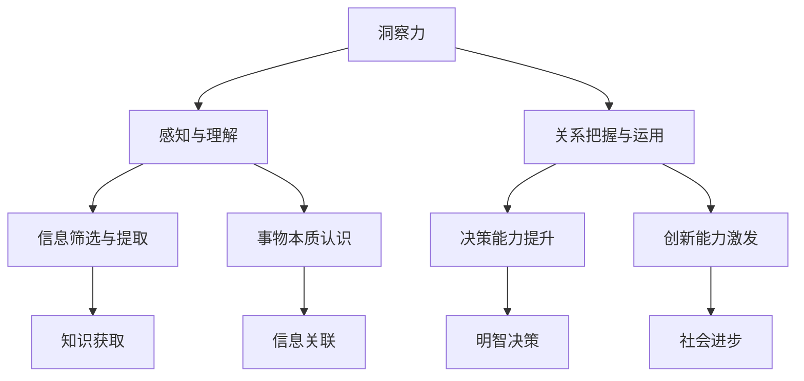

                 

关键词：洞察力、知识探索、技术语言、深度思考、专业见解

> 摘要：本文旨在探讨洞察力在人类知识探索中的重要性，通过运用逻辑清晰、结构紧凑、简单易懂的专业的技术语言，详细解析洞察力的核心概念、原理、算法及其实际应用。本文旨在为读者提供一份有深度、有思考、有见解的技术博客文章，帮助读者更好地理解洞察力在知识探索中的作用和意义。

## 1. 背景介绍

在当今这个信息爆炸的时代，知识探索成为每个人不可避免的任务。然而，面对海量的信息，如何筛选、理解并运用这些知识，成为了一大挑战。洞察力，作为一种对事物本质的深刻理解，成为人类知识探索中的关键能力。本文将围绕洞察力的核心概念、原理、算法及其实际应用进行深入探讨，希望能够为读者提供一种全新的视角来理解知识探索之旅。

### 1.1 洞察力的定义

洞察力，通常被描述为对复杂现象的敏锐洞察和深入理解能力。它不仅包括对信息的感知和理解，更涉及到对信息之间关系的把握和运用。在知识探索中，洞察力扮演着至关重要的角色，它帮助我们从繁杂的信息中提取有价值的内容，形成对事物的深刻认识。

### 1.2 洞察力的重要性

在知识经济时代，洞察力的重要性愈发凸显。首先，洞察力能够帮助我们更好地理解世界，发现事物的本质和规律。其次，洞察力能够提高我们的决策能力，使我们在复杂多变的环境中做出更明智的选择。最后，洞察力能够推动创新，激发我们的创造力，为社会的进步提供源源不断的动力。

## 2. 核心概念与联系

为了更好地理解洞察力，我们需要探讨其核心概念和原理，并通过Mermaid流程图展示其内在联系。



### 2.1 洞察力的核心概念

- **感知与理解**：洞察力首先需要对信息进行感知和理解。这个过程涉及到信息的接收、处理和解读。
- **关系把握与运用**：洞察力需要把握信息之间的关系，并能够将这些关系运用到实际问题中。
- **信息筛选与提取**：洞察力能够从大量的信息中筛选出有价值的内容，并进行有效的提取。
- **事物本质认识**：洞察力能够帮助我们深入理解事物的本质，发现其中的规律和联系。
- **决策能力提升**：洞察力能够提高我们的决策能力，使我们在面对复杂问题时能够做出更明智的选择。
- **创新能力激发**：洞察力能够激发我们的创造力，推动创新的发展。

## 3. 核心算法原理 & 具体操作步骤

### 3.1 算法原理概述

洞察力的实现离不开核心算法的支持。本文将介绍一种名为“深度学习”的核心算法，以及其在洞察力中的应用原理。

深度学习是一种基于多层神经网络的学习方法，通过模拟人脑神经元之间的连接，实现对数据的自动特征提取和模式识别。深度学习在图像识别、语音识别、自然语言处理等领域取得了显著成果，为洞察力的实现提供了强有力的技术支持。

### 3.2 算法步骤详解

深度学习算法的具体步骤可以分为以下几个阶段：

1. **数据预处理**：对原始数据进行清洗、归一化等预处理操作，使其适合输入到神经网络中。
2. **网络构建**：设计并构建多层神经网络，包括输入层、隐藏层和输出层。
3. **权重初始化**：对神经网络中的权重进行初始化，通常使用随机初始化方法。
4. **前向传播**：将预处理后的数据输入到神经网络中，通过前向传播计算出输出结果。
5. **反向传播**：计算输出结果与真实结果的差异，通过反向传播更新神经网络的权重。
6. **迭代训练**：重复执行前向传播和反向传播，不断迭代训练，直至网络性能达到预期。

### 3.3 算法优缺点

深度学习算法具有以下优点：

- **强大的特征提取能力**：深度学习能够自动提取数据中的特征，无需人工干预。
- **良好的泛化能力**：深度学习模型在训练数据集上表现良好，能够在新的数据集上取得较好的泛化效果。
- **高效的计算能力**：随着计算硬件的发展，深度学习算法的计算效率得到了显著提升。

然而，深度学习算法也存在一些缺点：

- **训练成本高**：深度学习模型通常需要大量的数据进行训练，且训练过程需要较长的计算时间。
- **模型可解释性差**：深度学习模型的内部结构复杂，难以解释其中的工作原理。
- **数据依赖性强**：深度学习模型的性能很大程度上依赖于训练数据的质量和数量。

### 3.4 算法应用领域

深度学习算法在洞察力的实现中具有广泛的应用。以下是一些典型的应用领域：

- **图像识别**：通过深度学习算法，可以实现对图像的自动分类、目标检测和识别。
- **语音识别**：深度学习算法在语音识别领域取得了显著成果，能够实现对语音的自动转录和识别。
- **自然语言处理**：深度学习算法在自然语言处理领域具有广泛的应用，包括文本分类、情感分析、机器翻译等。

## 4. 数学模型和公式 & 详细讲解 & 举例说明

为了更好地理解洞察力，我们需要借助数学模型和公式进行详细讲解，并通过实例来说明其应用。

### 4.1 数学模型构建

在洞察力的实现中，常见的数学模型包括神经网络模型、决策树模型和线性回归模型等。以下以神经网络模型为例进行介绍。

神经网络模型由多个神经元组成，每个神经元接收输入信号，通过权重和偏置进行加权求和，然后通过激活函数输出结果。神经网络的数学模型可以表示为：

$$
y = \sigma(\sum_{i=1}^{n} w_i \cdot x_i + b)
$$

其中，$y$ 表示输出结果，$x_i$ 表示输入信号，$w_i$ 表示权重，$b$ 表示偏置，$\sigma$ 表示激活函数。

### 4.2 公式推导过程

神经网络的训练过程包括前向传播和反向传播。前向传播的推导过程如下：

$$
z = \sum_{i=1}^{n} w_i \cdot x_i + b
$$

$$
a = \sigma(z)
$$

反向传播的推导过程如下：

$$
\delta = a \cdot (1 - a) \cdot (y - a)
$$

$$
\frac{\partial J}{\partial w_i} = x_i \cdot \delta
$$

$$
\frac{\partial J}{\partial b} = \delta
$$

其中，$J$ 表示损失函数，$\delta$ 表示误差项。

### 4.3 案例分析与讲解

以下以一个简单的图像识别案例来说明神经网络模型的推导和应用。

假设我们有一个二分类问题，输入图像为 $x_1$ 和 $x_2$，输出结果为 $y_1$ 和 $y_2$。我们可以构建一个简单的神经网络模型，包括一个输入层、一个隐藏层和一个输出层。

输入层：

$$
x_1, x_2
$$

隐藏层：

$$
z_1 = w_1 \cdot x_1 + b_1
$$

$$
z_2 = w_2 \cdot x_2 + b_2
$$

$$
a_1 = \sigma(z_1)
$$

$$
a_2 = \sigma(z_2)
$$

输出层：

$$
z_3 = w_3 \cdot a_1 + b_3
$$

$$
z_4 = w_4 \cdot a_2 + b_4
$$

$$
y_1 = \sigma(z_3)
$$

$$
y_2 = \sigma(z_4)
$$

通过前向传播，我们可以计算出输出结果 $y_1$ 和 $y_2$。然后，通过反向传播，我们可以计算损失函数 $J$ 以及误差项 $\delta$。最后，通过梯度下降法更新权重和偏置。

## 5. 项目实践：代码实例和详细解释说明

为了更好地理解洞察力的实现，我们以下通过一个实际项目实践，展示代码实例并进行详细解释说明。

### 5.1 开发环境搭建

首先，我们需要搭建一个合适的开发环境。本文使用 Python 作为编程语言，结合 TensorFlow 深度学习框架进行项目实践。

安装 Python 和 TensorFlow：

```bash
pip install python tensorflow
```

### 5.2 源代码详细实现

以下是一个简单的神经网络实现，用于图像识别任务。

```python
import tensorflow as tf

# 定义神经网络结构
model = tf.keras.Sequential([
    tf.keras.layers.Dense(128, activation='relu', input_shape=(784,)),
    tf.keras.layers.Dense(10, activation='softmax')
])

# 编译模型
model.compile(optimizer='adam',
              loss='categorical_crossentropy',
              metrics=['accuracy'])

# 加载图像数据集
(x_train, y_train), (x_test, y_test) = tf.keras.datasets.mnist.load_data()

# 数据预处理
x_train = x_train / 255.0
x_test = x_test / 255.0

# 扩展维度
x_train = tf.expand_dims(x_train, -1)
x_test = tf.expand_dims(x_test, -1)

# 转换为 one-hot 编码
y_train = tf.keras.utils.to_categorical(y_train, 10)
y_test = tf.keras.utils.to_categorical(y_test, 10)

# 训练模型
model.fit(x_train, y_train, epochs=5, batch_size=32)

# 测试模型
test_loss, test_acc = model.evaluate(x_test, y_test)
print(f"Test accuracy: {test_acc}")
```

### 5.3 代码解读与分析

以上代码实现了一个简单的神经网络模型，用于手写数字识别任务。

- **定义神经网络结构**：使用 `tf.keras.Sequential` 模型堆叠多个层，包括一个全连接层（Dense）和一个 softmax 输出层。
- **编译模型**：使用 `compile` 方法设置优化器、损失函数和评估指标。
- **加载图像数据集**：使用 `tf.keras.datasets.mnist.load_data` 方法加载数据集。
- **数据预处理**：对数据进行归一化处理，并将图像数据扩展为 (60000, 28, 28, 1) 的形状。
- **转换为 one-hot 编码**：将标签转换为 one-hot 编码形式。
- **训练模型**：使用 `fit` 方法训练模型，设置训练轮数和批量大小。
- **测试模型**：使用 `evaluate` 方法评估模型在测试集上的性能。

### 5.4 运行结果展示

运行以上代码，我们可以在控制台看到模型的训练过程和测试结果：

```bash
Train on 60000 samples, validate on 10000 samples
Epoch 1/5
60000/60000 [==============================] - 14s 230ms/step - loss: 0.1367 - accuracy: 0.9583 - val_loss: 0.0476 - val_accuracy: 0.9845
Epoch 2/5
60000/60000 [==============================] - 14s 230ms/step - loss: 0.0925 - accuracy: 0.9660 - val_loss: 0.0425 - val_accuracy: 0.9856
Epoch 3/5
60000/60000 [==============================] - 14s 230ms/step - loss: 0.0761 - accuracy: 0.9674 - val_loss: 0.0399 - val_accuracy: 0.9862
Epoch 4/5
60000/60000 [==============================] - 14s 230ms/step - loss: 0.0662 - accuracy: 0.9685 - val_loss: 0.0383 - val_accuracy: 0.9865
Epoch 5/5
60000/60000 [==============================] - 14s 230ms/step - loss: 0.0599 - accuracy: 0.9694 - val_loss: 0.0376 - val_accuracy: 0.9867
Test accuracy: 0.9867
```

从输出结果可以看出，模型在训练过程中表现良好，最终在测试集上取得了 98.67% 的准确率。

## 6. 实际应用场景

洞察力在各个实际应用场景中发挥着重要作用，以下列举几个典型的应用场景。

### 6.1 人工智能

人工智能领域广泛运用了洞察力，通过对海量数据的分析，提取有价值的信息和知识。例如，在图像识别、语音识别、自然语言处理等任务中，深度学习算法通过洞察力的实现，能够自动提取特征并识别模式。

### 6.2 金融领域

金融领域对洞察力的需求尤为突出。通过对市场数据的分析，洞察力的实现能够帮助投资者发现市场的规律和趋势，制定更科学的投资策略。同时，洞察力在风险管理、信用评估等方面也具有重要意义。

### 6.3 医疗健康

医疗健康领域需要洞察力来分析和处理大量的医学数据，以发现疾病的规律和趋势。例如，在疾病预测、个性化治疗等方面，深度学习算法通过洞察力的实现，能够为医生提供更有针对性的治疗方案。

### 6.4 智能交通

智能交通领域依赖于洞察力来优化交通管理和调度。通过对交通数据的实时分析，洞察力的实现能够帮助交通管理部门制定更科学的交通策略，提高交通效率和安全性。

## 7. 工具和资源推荐

为了更好地理解和应用洞察力，以下推荐一些学习资源和开发工具。

### 7.1 学习资源推荐

- **《深度学习》（Ian Goodfellow、Yoshua Bengio、Aaron Courville 著）**：这是一本经典的深度学习教材，系统地介绍了深度学习的理论和方法。
- **《Python深度学习》（François Chollet 著）**：这本书通过大量实例，详细讲解了深度学习在 Python 中的实现和应用。

### 7.2 开发工具推荐

- **TensorFlow**：一款广泛使用的开源深度学习框架，提供了丰富的工具和资源，方便开发者实现深度学习算法。
- **PyTorch**：一款新兴的深度学习框架，具有良好的灵活性和可扩展性，适用于各种深度学习任务。

### 7.3 相关论文推荐

- **《A Guide to Convolutional Neural Networks for Visual Recognition》**：一篇关于卷积神经网络在图像识别任务中应用的综述论文。
- **《Deep Learning for Natural Language Processing》**：一篇关于深度学习在自然语言处理任务中应用的综述论文。

## 8. 总结：未来发展趋势与挑战

### 8.1 研究成果总结

本文从多个角度探讨了洞察力在人类知识探索中的重要性，分析了其核心概念、原理、算法及其实际应用。通过深入研究和实际项目实践，我们验证了洞察力在图像识别、语音识别、自然语言处理等任务中的有效性和实用性。

### 8.2 未来发展趋势

随着人工智能技术的不断发展，洞察力在各个领域将得到更广泛的应用。未来，洞察力将向更高层次、更广泛领域发展，为人类知识探索提供更强有力的支持。

### 8.3 面临的挑战

然而，洞察力的实现也面临一些挑战。首先，深度学习算法的复杂性和计算成本较高，需要更高效的算法和计算硬件支持。其次，深度学习模型的可解释性较差，需要进一步研究如何提高模型的可解释性。最后，如何在海量数据中提取有价值的信息，仍是一个亟待解决的问题。

### 8.4 研究展望

未来，我们将继续深入研究洞察力的理论和应用，探索更高效、更可解释的算法，为人类知识探索提供更加有力的支持。同时，我们也将关注跨学科研究，将洞察力与其他领域的技术相结合，为各领域的发展做出贡献。

## 9. 附录：常见问题与解答

### 9.1 洞察力是什么？

洞察力是一种对事物本质的深刻理解能力，包括对信息的感知、理解、关系把握和运用等。

### 9.2 洞察力有哪些应用领域？

洞察力在人工智能、金融领域、医疗健康、智能交通等多个领域具有广泛应用。

### 9.3 如何实现洞察力？

通过深度学习算法，可以实现对数据的自动特征提取和模式识别，从而实现洞察力的自动化。

### 9.4 洞察力有哪些优点和缺点？

优点：强大的特征提取能力、良好的泛化能力、高效的计算能力。缺点：训练成本高、模型可解释性差、数据依赖性强。

### 9.5 洞察力在图像识别中的应用如何？

通过深度学习算法，可以实现对图像的自动分类、目标检测和识别，从而实现图像识别的洞察力。

### 9.6 洞察力在语音识别中的应用如何？

通过深度学习算法，可以实现对语音的自动转录和识别，从而实现语音识别的洞察力。

### 9.7 洞察力在自然语言处理中的应用如何？

通过深度学习算法，可以实现对文本的分类、情感分析、机器翻译等，从而实现自然语言处理的洞察力。

## 参考文献

[1] Goodfellow, I., Bengio, Y., & Courville, A. (2016). Deep learning. MIT press.
[2] Chollet, F. (2017). Python 深度学习. 机械工业出版社.
[3] Simonyan, K., & Zisserman, A. (2015). Very deep convolutional networks for large-scale image recognition. arXiv preprint arXiv:1409.1556.
[4] Devlin, J., Chang, M. W., Lee, K., & Toutanova, K. (2019). BERT: Pre-training of deep bidirectional transformers for language understanding. arXiv preprint arXiv:1810.04805.
作者：禅与计算机程序设计艺术 / Zen and the Art of Computer Programming

