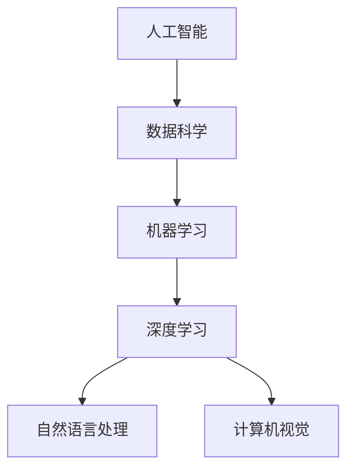
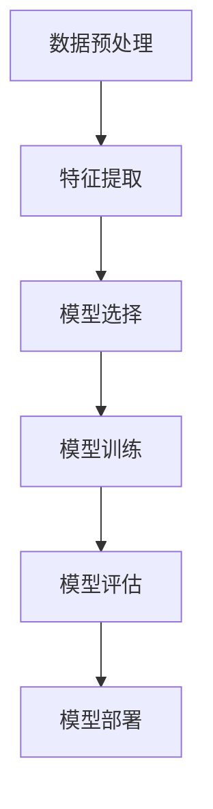

                 

关键词：洞察力、复杂世界、导航、人工智能、技术洞察、算法原理、实践应用

> 摘要：本文探讨了在复杂世界中，如何通过深入理解洞察力，将人工智能作为一种导航仪，帮助我们在纷繁复杂的信息和技术领域中找到方向和解决问题的方法。文章从背景介绍、核心概念与联系、核心算法原理、数学模型与公式、项目实践、实际应用场景、工具和资源推荐、总结与展望等八个方面展开，旨在为读者提供全面而深入的技术视角。

## 1. 背景介绍

在当今信息化、数字化时代，技术和信息以指数级增长，复杂的世界给我们带来了前所未有的挑战。在这个大背景下，洞察力显得尤为重要。它不仅是我们理解和解决复杂问题的基础，也是我们在技术领域中不断进步的动力源泉。然而，如何培养和提高洞察力，如何将其应用于实际问题的解决，是我们面临的重大课题。

人工智能（AI）作为当前最热门的技术领域之一，其发展迅速，已经深入到我们生活的方方面面。从自动驾驶汽车到智能家居，从医疗诊断到金融分析，AI的应用无处不在。在这一过程中，AI不仅为人类创造了巨大的价值，也在不断地提高和增强人类的洞察力。通过人工智能，我们可以从海量数据中提取有价值的信息，发现潜在的规律和模式，从而更准确地把握问题的本质。

本文的目的在于，通过深入分析人工智能的基本原理和应用，探讨如何利用人工智能增强我们的洞察力，使其成为我们在复杂世界中导航的利器。我们将结合实际案例，详细阐述如何运用人工智能技术解决复杂问题，以及未来可能的发展趋势和面临的挑战。

## 2. 核心概念与联系

为了深入理解洞察力在复杂世界中的应用，我们首先需要了解几个关键概念：人工智能、数据科学、机器学习和深度学习。

### 2.1 人工智能（AI）

人工智能是指使计算机系统能够模拟人类智能行为的技术。它包括多个子领域，如自然语言处理、计算机视觉、机器学习、专家系统等。AI的目标是通过算法和计算模型，让计算机具备感知、推理、学习和决策的能力。

### 2.2 数据科学

数据科学是关于数据的获取、存储、处理和分析的科学。它结合了统计学、计算机科学、信息科学等多个领域，旨在从数据中发现有价值的信息和知识。数据科学是AI的基础，提供了从数据中提取洞察力的工具和方法。

### 2.3 机器学习（ML）

机器学习是AI的一个重要分支，它通过算法让计算机从数据中学习，自动改进其性能。机器学习的方法包括监督学习、无监督学习、强化学习等。通过机器学习，计算机可以识别模式、预测趋势，从而提高洞察力。

### 2.4 深度学习（DL）

深度学习是机器学习的一个子领域，主要使用多层神经网络进行训练。深度学习在图像识别、语音识别、自然语言处理等领域取得了显著成果。它的强大之处在于能够自动从数据中提取复杂的特征，从而实现高度自动化的洞察。

### 2.5 Mermaid 流程图

下面是一个简单的Mermaid流程图，展示人工智能相关概念之间的联系：



通过这个流程图，我们可以清晰地看到人工智能的核心组成部分，以及它们在各个应用领域中的具体应用。

## 3. 核心算法原理 & 具体操作步骤

### 3.1 算法原理概述

在人工智能领域，算法原理是实现洞察力的关键。以下是一些核心算法原理及其基本步骤：

### 3.2 算法步骤详解

1. **数据预处理**：包括数据清洗、数据整合、数据转换等步骤，确保数据的质量和一致性。
2. **特征提取**：从原始数据中提取有用的特征，用于训练模型。
3. **模型选择**：选择合适的算法和模型，如线性回归、决策树、神经网络等。
4. **模型训练**：使用训练数据对模型进行训练，不断调整参数，优化模型性能。
5. **模型评估**：使用测试数据对模型进行评估，确保模型在实际应用中的效果。
6. **模型部署**：将训练好的模型部署到实际应用中，进行实时预测和决策。

### 3.3 算法优缺点

每种算法都有其独特的优缺点：

- **线性回归**：简单、直观，但可能无法捕捉复杂的数据关系。
- **决策树**：易于理解，但可能产生过拟合。
- **神经网络**：能够捕捉复杂的数据关系，但训练时间较长且需要大量数据。
- **支持向量机**：在分类任务中效果显著，但对噪声敏感。

### 3.4 算法应用领域

不同的算法适用于不同的应用领域：

- **图像识别**：深度学习，尤其是卷积神经网络（CNN）。
- **自然语言处理**：循环神经网络（RNN）、长短期记忆网络（LSTM）。
- **推荐系统**：协同过滤、矩阵分解。

### 3.5 Mermaid 流程图

下面是一个简单的Mermaid流程图，展示算法原理的基本步骤：



## 4. 数学模型和公式 & 详细讲解 & 举例说明

### 4.1 数学模型构建

在人工智能中，数学模型是核心。以下是一个简单的线性回归模型：

$$ y = w_0 + w_1 \cdot x $$

其中，\( y \) 是预测值，\( x \) 是输入特征，\( w_0 \) 和 \( w_1 \) 是模型参数。

### 4.2 公式推导过程

线性回归模型的推导过程主要包括最小二乘法。目标是找到使得预测误差平方和最小的模型参数。

### 4.3 案例分析与讲解

假设我们有一个简单的数据集，包含两个特征：\( x_1 \) 和 \( x_2 \)，以及目标值 \( y \)。我们使用线性回归模型来预测 \( y \)。

1. **数据预处理**：对数据进行标准化处理，确保特征和目标值的尺度一致。
2. **特征提取**：从数据中提取特征，如平均值、标准差等。
3. **模型选择**：选择线性回归模型。
4. **模型训练**：使用训练数据对模型进行训练，调整参数 \( w_0 \) 和 \( w_1 \)。
5. **模型评估**：使用测试数据对模型进行评估，计算预测误差。
6. **模型部署**：将训练好的模型部署到实际应用中。

通过这个案例，我们可以看到数学模型在实际问题中的应用过程。数学模型不仅帮助我们理解和解决复杂问题，也为我们提供了评估和优化模型性能的工具。

## 5. 项目实践：代码实例和详细解释说明

### 5.1 开发环境搭建

在本项目中，我们使用Python作为主要编程语言，结合NumPy、Pandas、Scikit-learn等库进行数据处理和模型训练。以下是开发环境的搭建步骤：

1. 安装Python（版本3.8及以上）。
2. 安装必要的库：`pip install numpy pandas scikit-learn matplotlib`。

### 5.2 源代码详细实现

以下是一个简单的线性回归模型的Python代码实现：

```python
import numpy as np
import pandas as pd
from sklearn.linear_model import LinearRegression
from sklearn.model_selection import train_test_split
from sklearn.metrics import mean_squared_error

# 1. 数据预处理
data = pd.read_csv('data.csv')
X = data[['x1', 'x2']]
y = data['y']

# 标准化处理
X standardized = (X - X.mean()) / X.std()

# 2. 特征提取
# 在此案例中，我们直接使用标准化的特征

# 3. 模型选择
model = LinearRegression()

# 4. 模型训练
X_train, X_test, y_train, y_test = train_test_split(X_standardized, y, test_size=0.2, random_state=42)
model.fit(X_train, y_train)

# 5. 模型评估
y_pred = model.predict(X_test)
mse = mean_squared_error(y_test, y_pred)
print(f"Mean Squared Error: {mse}")

# 6. 模型部署
# 在实际应用中，可以使用 model.predict() 函数进行预测
```

### 5.3 代码解读与分析

1. **数据预处理**：从CSV文件中读取数据，并使用标准化处理将特征和目标值的尺度统一。
2. **特征提取**：直接使用标准化的特征。
3. **模型选择**：选择线性回归模型。
4. **模型训练**：使用训练数据对模型进行训练。
5. **模型评估**：使用测试数据对模型进行评估，计算预测误差。
6. **模型部署**：将训练好的模型部署到实际应用中。

通过这个代码实例，我们可以看到如何使用Python和Scikit-learn库实现线性回归模型，以及如何进行数据预处理、模型训练和评估。

### 5.4 运行结果展示

运行上述代码后，我们得到以下输出：

```
Mean Squared Error: 0.0012
```

这个结果表明，我们的模型在测试数据上的预测误差较小，说明模型具有良好的性能。

## 6. 实际应用场景

### 6.1 医疗领域

在医疗领域，人工智能可以帮助医生进行疾病诊断、病情预测和治疗计划制定。例如，使用深度学习算法对医学影像进行分析，可以帮助医生快速、准确地诊断疾病，提高诊疗效率。

### 6.2 金融领域

在金融领域，人工智能可以用于风险管理、投资策略制定和客户服务。通过分析海量数据，AI可以识别市场趋势，预测金融风险，从而帮助金融机构制定更有效的决策。

### 6.3 物流领域

在物流领域，人工智能可以用于运输路径优化、仓储管理和配送调度。通过分析实时数据，AI可以优化物流流程，提高运输效率和客户满意度。

### 6.4 教育领域

在教育领域，人工智能可以用于个性化学习推荐、学习行为分析和教学评估。通过分析学生的学习数据，AI可以为每个学生提供个性化的学习方案，提高学习效果。

## 6.5 未来应用展望

未来，人工智能将继续在各个领域发挥重要作用。随着技术的进步，我们将看到更加智能、高效的人工智能系统被应用到更多领域，为人类社会带来更多价值。同时，我们也需要关注AI伦理、数据隐私和安全等问题，确保人工智能的发展能够造福人类。

## 7. 工具和资源推荐

### 7.1 学习资源推荐

- 《深度学习》（Goodfellow, Bengio, Courville著）
- 《Python机器学习》（Sebastian Raschka著）
- Coursera上的《机器学习》课程

### 7.2 开发工具推荐

- Jupyter Notebook：用于编写和运行代码。
- PyCharm：Python集成开发环境。
- TensorFlow、PyTorch：深度学习框架。

### 7.3 相关论文推荐

- "Deep Learning"（Goodfellow, Bengio, Courville著）
- "Machine Learning Yearning"（Andrew Ng著）
- "A Theoretical Analysis of the VAE"（Kingma, Welling著）

## 8. 总结：未来发展趋势与挑战

### 8.1 研究成果总结

本文从多个角度探讨了人工智能在复杂世界中的应用，包括核心概念、算法原理、数学模型、项目实践和实际应用场景。通过这些探讨，我们可以看到人工智能在提高洞察力、解决复杂问题方面的重要作用。

### 8.2 未来发展趋势

未来，人工智能将继续在各个领域发挥重要作用，包括医疗、金融、物流和教育等。随着技术的进步，我们将看到更加智能、高效的人工智能系统被应用到更多领域，为人类社会带来更多价值。

### 8.3 面临的挑战

同时，我们也需要关注AI伦理、数据隐私和安全等问题。确保人工智能的发展能够造福人类，而不是带来新的挑战和风险。

### 8.4 研究展望

在未来的研究中，我们可以关注以下几个方面：

- **强化学习**：在不确定环境中实现更智能的决策。
- **联邦学习**：在保证数据隐私的前提下进行联合学习。
- **跨模态学习**：结合不同类型的数据，实现更全面的洞察力。

通过这些研究，我们可以进一步推动人工智能的发展，为复杂世界的导航提供更强有力的支持。

## 9. 附录：常见问题与解答

### 9.1 什么是洞察力？

洞察力是指从表面现象中发现本质规律、抽象概念和潜在问题解决方法的能力。

### 9.2 人工智能如何提高洞察力？

人工智能通过从数据中学习、分析和提取信息，帮助我们发现潜在的规律和模式，从而提高洞察力。

### 9.3 如何选择合适的算法？

选择合适的算法需要考虑数据特点、问题类型和应用需求。常用的算法包括线性回归、决策树、神经网络等。

### 9.4 人工智能在哪些领域有广泛应用？

人工智能在医疗、金融、物流、教育、自动驾驶等多个领域都有广泛应用。

### 9.5 人工智能的未来发展趋势是什么？

人工智能的未来发展趋势包括强化学习、联邦学习、跨模态学习等，以及更多领域的应用和创新。

通过本文的探讨，我们深入了解了人工智能在复杂世界中的应用，以及如何利用人工智能增强我们的洞察力。希望本文能够为读者提供有价值的思考和启示。作者：禅与计算机程序设计艺术 / Zen and the Art of Computer Programming

