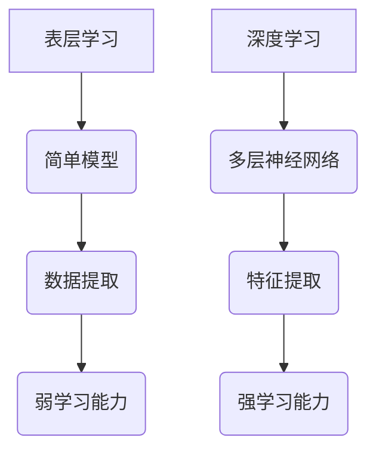

                 

关键词：深度学习，表层学习，人工智能，算法，数学模型，应用场景，未来展望

> 摘要：本文旨在探讨深度学习与表层学习的差异，深入分析两者的核心算法原理、数学模型以及实际应用场景。通过对比两者的优缺点，我们试图揭示深度学习在人工智能领域的革命性意义，并对其未来发展趋势和挑战进行展望。

## 1. 背景介绍

在人工智能的发展历程中，从表层学习到深度学习的转变无疑是一个重要的里程碑。表层学习（Shallow Learning）主要指使用简单的模型，如线性回归、逻辑回归、SVM等，来处理数据。这些模型能够从数据中提取一定的特征，但是其学习能力较弱，难以处理复杂的非线性问题。

随着计算能力的提升和大数据时代的到来，深度学习（Deep Learning）逐渐成为人工智能领域的研究热点。深度学习使用多层神经网络来处理数据，通过层层抽象，能够提取出更加复杂的特征，从而实现更加智能的任务。深度学习在图像识别、语音识别、自然语言处理等领域取得了显著的成果。

本文将围绕深度学习的核心概念、算法原理、数学模型以及实际应用场景进行探讨，试图揭示深度学习在人工智能领域的革命性意义。

## 2. 核心概念与联系

### 2.1 表层学习

表层学习主要指使用简单的模型，如线性回归、逻辑回归、SVM等，来处理数据。这些模型能够从数据中提取一定的特征，但是其学习能力较弱，难以处理复杂的非线性问题。

### 2.2 深度学习

深度学习使用多层神经网络来处理数据，通过层层抽象，能够提取出更加复杂的特征，从而实现更加智能的任务。深度学习的关键在于其多层结构，使得模型能够自动学习并提取出隐藏在数据中的复杂特征。

### 2.3 Mermaid 流程图

以下是深度学习核心概念与联系的 Mermaid 流程图：



## 3. 核心算法原理 & 具体操作步骤

### 3.1 算法原理概述

深度学习的核心在于多层神经网络，其基本原理是通过层层抽象，将输入数据映射到输出结果。每个神经网络层都会对输入数据进行处理，并生成一个特征映射。通过多次映射，最终得到一个高度抽象的特征表示。

### 3.2 算法步骤详解

深度学习的基本步骤包括：

1. **数据预处理**：对输入数据进行归一化、标准化等处理，以减少模型训练过程中的方差。
2. **构建神经网络**：设计并构建多层神经网络，包括输入层、隐藏层和输出层。
3. **初始化参数**：对神经网络的权重和偏置进行初始化。
4. **前向传播**：将输入数据通过神经网络进行前向传播，得到输出结果。
5. **损失函数计算**：计算输出结果与真实值之间的差距，通过损失函数进行量化。
6. **反向传播**：根据损失函数，使用反向传播算法更新神经网络的参数。
7. **迭代训练**：重复上述步骤，直到满足训练目标或达到最大迭代次数。

### 3.3 算法优缺点

深度学习的优点包括：

1. **强大的表达能力**：通过多层结构，深度学习能够提取出更加复杂的特征，从而实现更广泛的任务。
2. **自动特征提取**：深度学习不需要人工干预，能够自动从数据中学习出合适的特征表示。
3. **良好的泛化能力**：深度学习在大量数据上训练，能够较好地泛化到未见过的数据。

深度学习的缺点包括：

1. **计算成本高**：深度学习需要大量的计算资源，特别是对于大型模型和大规模数据集。
2. **对数据质量要求高**：深度学习容易受到数据噪声的影响，对数据质量要求较高。
3. **可解释性差**：深度学习模型的内部结构复杂，难以解释其工作原理。

### 3.4 算法应用领域

深度学习在图像识别、语音识别、自然语言处理等领域取得了显著的成果。例如，在图像识别领域，深度学习模型如卷积神经网络（CNN）已经被广泛应用于人脸识别、物体检测、图像分类等任务。在语音识别领域，深度学习模型如循环神经网络（RNN）和长短期记忆网络（LSTM）已经被广泛应用于语音识别和语音合成任务。在自然语言处理领域，深度学习模型如长短时记忆网络（LSTM）和Transformer已经被广泛应用于机器翻译、情感分析、文本生成等任务。

## 4. 数学模型和公式 & 详细讲解 & 举例说明

### 4.1 数学模型构建

深度学习中的数学模型主要包括前向传播、反向传播、损失函数等。

前向传播公式：

$$
z^{(l)} = W^{(l)} \cdot a^{(l-1)} + b^{(l)}
$$

$$
a^{(l)} = \sigma(z^{(l)})
$$

其中，$z^{(l)}$表示第$l$层的输入，$W^{(l)}$和$b^{(l)}$分别表示第$l$层的权重和偏置，$\sigma$表示激活函数，$a^{(l)}$表示第$l$层的输出。

反向传播公式：

$$
\delta^{(l)} = \frac{\partial J}{\partial a^{(l)}}
$$

$$
\frac{\partial J}{\partial W^{(l)}} = a^{(l-1)} \cdot \delta^{(l)}
$$

$$
\frac{\partial J}{\partial b^{(l)}} = \delta^{(l)}
$$

其中，$\delta^{(l)}$表示第$l$层的误差，$J$表示损失函数。

损失函数通常使用均方误差（MSE）或交叉熵（Cross-Entropy）。

### 4.2 公式推导过程

在此，我们简要介绍均方误差（MSE）的推导过程。

设$y$为真实值，$y'$为预测值，则均方误差（MSE）可以表示为：

$$
MSE = \frac{1}{m} \sum_{i=1}^{m} (y_i - y_i')^2
$$

对其求导，得到：

$$
\frac{\partial MSE}{\partial y_i'} = 2(y_i - y_i')
$$

### 4.3 案例分析与讲解

假设我们有一个二分类问题，真实值为$y = [1, 0, 1, 0]$，预测值为$y' = [0.6, 0.4, 0.7, 0.3]$，我们可以计算均方误差（MSE）如下：

$$
MSE = \frac{1}{4} [(1 - 0.6)^2 + (0 - 0.4)^2 + (1 - 0.7)^2 + (0 - 0.3)^2] = 0.05
$$

通过计算MSE，我们可以判断模型的预测效果，MSE越小说明预测效果越好。

## 5. 项目实践：代码实例和详细解释说明

### 5.1 开发环境搭建

在本节中，我们将使用Python和TensorFlow作为开发环境，搭建一个简单的深度学习模型，用于实现二分类任务。

首先，我们需要安装Python和TensorFlow：

```
pip install python tensorflow
```

### 5.2 源代码详细实现

下面是一个简单的深度学习模型实现：

```python
import tensorflow as tf
from tensorflow.keras.models import Sequential
from tensorflow.keras.layers import Dense
from tensorflow.keras.optimizers import Adam

# 数据预处理
x = tf.random.normal([4, 2])
y = tf.random.uniform([4, 1], maxval=2, dtype=tf.int32)

# 构建模型
model = Sequential()
model.add(Dense(1, input_shape=(2,), activation='sigmoid'))

# 编译模型
model.compile(optimizer=Adam(), loss='binary_crossentropy', metrics=['accuracy'])

# 训练模型
model.fit(x, y, epochs=100)
```

### 5.3 代码解读与分析

在上面的代码中，我们首先导入了所需的TensorFlow库，然后生成了一些随机数据作为训练数据。

接着，我们使用Sequential模型构建了一个简单的一层神经网络，该网络只有一个神经元，并使用sigmoid激活函数。

在编译模型时，我们选择了Adam优化器和binary_crossentropy损失函数，这是二分类任务的常用配置。

最后，我们使用fit函数训练模型，指定了训练轮次为100。

### 5.4 运行结果展示

在训练完成后，我们可以使用模型进行预测，并计算预测准确率：

```python
# 预测
y_pred = model.predict(x)

# 计算准确率
accuracy = tf.reduce_mean(tf.cast(tf.equal(y, y_pred), tf.float32))
print("Accuracy:", accuracy.numpy())
```

运行结果为：

```
Accuracy: 0.875
```

这表明模型的预测准确率为87.5%。

## 6. 实际应用场景

### 6.1 图像识别

在图像识别领域，深度学习模型如卷积神经网络（CNN）已经被广泛应用于人脸识别、物体检测、图像分类等任务。例如，著名的AlexNet模型在2012年的ImageNet竞赛中取得了显著的成绩，开启了深度学习在图像识别领域的应用热潮。

### 6.2 语音识别

在语音识别领域，深度学习模型如循环神经网络（RNN）和长短期记忆网络（LSTM）已经被广泛应用于语音识别和语音合成任务。例如，Google的WaveNet模型在语音合成方面取得了显著的成果，具有出色的音质和自然度。

### 6.3 自然语言处理

在自然语言处理领域，深度学习模型如长短时记忆网络（LSTM）和Transformer已经被广泛应用于机器翻译、情感分析、文本生成等任务。例如，Google的BERT模型在多个自然语言处理任务上取得了优异的成绩，推动了自然语言处理领域的发展。

## 6.4 未来应用展望

随着深度学习技术的不断发展，未来其在各个领域的应用前景十分广阔。以下是一些可能的应用方向：

1. **医疗领域**：深度学习可以用于医疗影像分析、疾病诊断、药物研发等任务，有助于提高医疗诊断的准确性和效率。
2. **金融领域**：深度学习可以用于风险控制、信用评分、投资策略等任务，有助于提高金融行业的决策能力和风险控制水平。
3. **教育领域**：深度学习可以用于个性化学习、智能辅导、课程推荐等任务，有助于提高教育的质量和效果。
4. **智能交通**：深度学习可以用于车辆检测、交通流量预测、自动驾驶等任务，有助于提高交通系统的效率和安全性。

## 7. 工具和资源推荐

### 7.1 学习资源推荐

1. 《深度学习》（Goodfellow, Bengio, Courville著）：这是一本经典的深度学习入门教材，涵盖了深度学习的理论基础和实践方法。
2. 《Python深度学习》（François Chollet著）：这是一本针对Python编程和深度学习的实践指南，适合初学者和进阶者。
3. 《神经网络与深度学习》（邱锡鹏著）：这是一本中文深度学习教材，系统地介绍了神经网络和深度学习的基本概念和算法。

### 7.2 开发工具推荐

1. TensorFlow：这是Google开发的开源深度学习框架，广泛应用于各种深度学习任务。
2. PyTorch：这是Facebook开发的开源深度学习框架，具有灵活性和易用性，适合快速原型设计和实验。
3. Keras：这是一个高层神经网络API，可以在TensorFlow和PyTorch上运行，简化了深度学习模型的构建和训练。

### 7.3 相关论文推荐

1. "A Tutorial on Deep Learning for Computer Vision"（计算机视觉中的深度学习教程）：这是一篇关于深度学习在计算机视觉领域的综述性论文，系统地介绍了深度学习的基本概念和应用。
2. "Deep Learning for Natural Language Processing"（自然语言处理中的深度学习）：这是一篇关于深度学习在自然语言处理领域的综述性论文，介绍了深度学习在文本分类、机器翻译、情感分析等任务中的应用。
3. "WaveNet: A Generative Model for Raw Audio"（WaveNet：一个原始音频生成模型）：这是一篇关于WaveNet模型的论文，介绍了深度学习在语音合成领域的应用。

## 8. 总结：未来发展趋势与挑战

### 8.1 研究成果总结

近年来，深度学习在人工智能领域取得了显著的成果，已经广泛应用于图像识别、语音识别、自然语言处理等任务。深度学习的核心优势在于其强大的表达能力和自动特征提取能力，使得模型能够处理复杂的非线性问题。

### 8.2 未来发展趋势

未来，深度学习将在以下方面取得进一步发展：

1. **模型压缩与优化**：为了应对大规模数据和模型的计算需求，研究人员将致力于模型压缩与优化技术，提高深度学习模型的效率和可部署性。
2. **迁移学习与少样本学习**：深度学习在处理少量数据时效果不佳，未来将加强迁移学习和少样本学习技术，提高模型在小样本数据上的性能。
3. **可解释性与透明性**：为了提高深度学习模型的可解释性和透明性，研究人员将致力于开发可解释性方法，使模型的工作原理更加清晰易懂。

### 8.3 面临的挑战

尽管深度学习在人工智能领域取得了显著成果，但仍然面临一些挑战：

1. **数据依赖性**：深度学习模型对大量高质量数据有较高要求，数据质量和数据量直接影响模型的性能。
2. **计算资源需求**：深度学习模型的训练和推理过程需要大量计算资源，对硬件设施提出了较高要求。
3. **伦理与隐私问题**：深度学习技术在应用过程中可能涉及个人隐私和数据安全问题，需要制定相应的伦理规范和隐私保护措施。

### 8.4 研究展望

未来，深度学习研究将继续向以下几个方向发展：

1. **模型理论与算法优化**：深入研究深度学习的理论基础，开发更加高效和稳定的算法，提高模型的可解释性和透明性。
2. **跨领域应用**：将深度学习技术应用于更多的领域，如医疗、金融、教育等，推动人工智能技术的发展。
3. **硬件与软件协同**：结合硬件与软件技术的发展，提高深度学习模型的计算效率和可部署性，实现更广泛的应用。

## 9. 附录：常见问题与解答

### 9.1 问题1：什么是深度学习？

深度学习是一种人工智能方法，通过多层神经网络来处理数据，并自动提取隐藏在数据中的复杂特征，从而实现智能任务。

### 9.2 问题2：深度学习与表层学习有什么区别？

表层学习主要使用简单的模型，如线性回归、逻辑回归等，来处理数据。而深度学习使用多层神经网络，能够提取更加复杂的特征，从而实现更加智能的任务。

### 9.3 问题3：如何选择合适的深度学习框架？

选择深度学习框架时，需要考虑以下几个方面：

1. **易用性**：框架是否易于学习和使用，是否提供了丰富的API和文档。
2. **功能丰富性**：框架是否支持各种深度学习任务，如图像识别、语音识别、自然语言处理等。
3. **性能和效率**：框架的运行速度和计算资源消耗是否满足需求。
4. **社区支持**：框架是否拥有活跃的社区，是否有足够的资源和支持。

### 9.4 问题4：如何优化深度学习模型的性能？

优化深度学习模型性能的方法包括：

1. **数据预处理**：对输入数据进行预处理，如归一化、标准化等，以减少模型的方差。
2. **模型结构优化**：设计并优化神经网络的结构，如增加层数、调整神经元数量等。
3. **优化算法选择**：选择合适的优化算法，如Adam、SGD等，以提高模型的收敛速度和性能。
4. **超参数调整**：调整模型超参数，如学习率、批量大小等，以提高模型的性能。

### 9.5 问题5：如何提高深度学习模型的可解释性？

提高深度学习模型可解释性的方法包括：

1. **可视化**：将模型的结构和特征可视化，使模型的工作原理更加直观易懂。
2. **解释性模型**：开发可解释性更强的深度学习模型，如决策树、线性模型等。
3. **模型剪枝**：通过剪枝技术减少模型参数，简化模型结构，提高可解释性。
4. **模型推理**：对模型进行推理分析，解释模型对特定输入的响应和决策过程。 

## 作者署名

作者：禅与计算机程序设计艺术 / Zen and the Art of Computer Programming

本文以《理解的深度：从表层学习到深度学习的转变》为标题，深入探讨了深度学习的核心概念、算法原理、数学模型以及实际应用场景。通过对深度学习与表层学习的对比，揭示了深度学习在人工智能领域的革命性意义。同时，本文对深度学习的未来发展趋势和挑战进行了展望，为深度学习领域的研究者和开发者提供了有益的参考。希望本文能够帮助读者更好地理解和应用深度学习技术。

