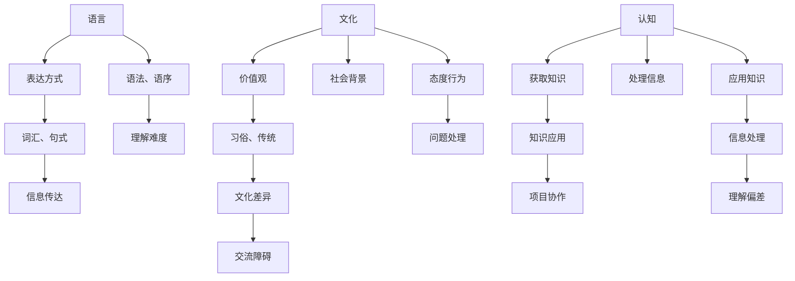

                 

关键词：认知科学、语言障碍、文化差异、认知障碍、跨文化沟通

> 摘要：本文旨在探讨语言、文化和认知差异如何影响人们之间的理解和沟通，特别是在信息技术和软件开发领域。通过分析这些障碍的本质、表现形式及其对项目的潜在影响，本文提出了一些策略和建议，帮助克服这些理解障碍，以促进更有效的跨文化团队合作。

## 1. 背景介绍

在全球化趋势日益显著的今天，信息技术和软件开发领域成为了跨国合作的重要领域。无论是开源项目、跨国公司还是国际化的IT团队，跨文化交流和沟通都成为了一种常态。然而，不同语言、文化和认知差异带来的理解障碍却成为了团队协作中的难题。

理解障碍主要体现在以下几个方面：

1. 语言障碍：不同的语言表达方式和习惯可能导致信息传达的误解。
2. 文化差异：不同的文化背景和社会习俗会影响人们对问题的看法和处理方式。
3. 认知障碍：不同的认知模型和思维方式可能导致对同一问题的理解产生偏差。

本文将围绕这些理解障碍，探讨其成因、表现形式及其对信息技术和软件开发项目的影响，并提出一些解决方案。

## 2. 核心概念与联系

为了更好地理解语言、文化和认知差异如何影响理解，我们首先需要明确以下几个核心概念：

### 2.1 语言

语言是人类交流的主要工具，但不同语言的表达方式和结构差异很大。例如，英语和中文在语法、词汇和句式上的差异，可能会导致信息传达上的困难。

### 2.2 文化

文化是一个社会共同体的行为模式、价值观和信仰的总和。不同文化背景的人可能在对待同一问题时的态度和行为方式上存在显著差异。

### 2.3 认知

认知是指个体获取、处理和应用知识的过程。不同的认知模型和思维方式会影响人们对信息的理解。

### 2.4 跨文化沟通

跨文化沟通是指在不同文化背景下进行的交流。有效的跨文化沟通需要理解并尊重不同文化之间的差异。

为了更直观地展示这些概念之间的联系，我们可以使用Mermaid流程图来描述它们之间的关系：



## 3. 核心算法原理 & 具体操作步骤

### 3.1 算法原理概述

为了克服语言、文化和认知差异带来的理解障碍，我们提出一种名为“理解协同算法”的方法。该方法的核心思想是通过多层次的沟通策略来提高跨文化团队之间的理解能力。

### 3.2 算法步骤详解

**步骤1：建立语言基础**

在团队内部，首先需要建立共同的语言基础。这包括：

- **词汇表**：制定一个包含项目关键词和术语的词汇表，并确保所有团队成员都熟悉。
- **语言培训**：为团队成员提供语言培训，以提高他们的语言表达能力。

**步骤2：理解文化差异**

在了解语言差异的基础上，团队需要更深入地理解文化差异。这可以通过以下方式实现：

- **文化培训**：开展文化培训，介绍不同文化的价值观、习俗和传统。
- **案例分析**：分析成功和失败的跨文化项目案例，从中学习如何处理文化差异。

**步骤3：提高认知协同**

为了提高团队内部的认知协同，可以采取以下策略：

- **认知模型训练**：通过认知模型训练，使团队成员了解不同的认知模型和思维方式。
- **沟通技巧培训**：教授团队成员有效的沟通技巧，帮助他们更好地理解和传达信息。

### 3.3 算法优缺点

**优点：**

- **提高理解能力**：通过多层次、多维度的沟通策略，可以有效提高团队内部的理解能力。
- **促进团队合作**：理解协同算法有助于消除语言、文化和认知障碍，促进团队协作。

**缺点：**

- **培训成本高**：语言、文化、认知培训需要投入大量的时间和资源。
- **实施难度大**：在跨国团队中实施理解协同算法可能面临诸多挑战，如时间安排、资源分配等。

### 3.4 算法应用领域

理解协同算法适用于所有涉及跨文化合作的领域，尤其是在信息技术和软件开发项目中，其效果尤为显著。

## 4. 数学模型和公式 & 详细讲解 & 举例说明

为了更深入地理解理解协同算法，我们可以构建一个数学模型来描述其工作原理。

### 4.1 数学模型构建

设 $C$ 为团队中的个体，$L$ 为语言基础，$C$ 的认知模型为 $M$，$T$ 为文化差异。则理解协同算法可以表示为：

$$
S(C, L, M, T) = C_L \cdot L \cdot M \cdot T
$$

其中，$C_L$ 表示个体的语言理解能力，$L$ 表示语言基础，$M$ 表示认知模型，$T$ 表示文化差异。

### 4.2 公式推导过程

**步骤1：建立语言基础**

设 $L$ 为语言基础，包含 $n$ 个词汇和 $m$ 个句式。则个体的语言理解能力 $C_L$ 可以表示为：

$$
C_L = \sum_{i=1}^{n} p_i \cdot q_i
$$

其中，$p_i$ 表示词汇 $i$ 的概率，$q_i$ 表示句式 $i$ 的概率。

**步骤2：理解文化差异**

设 $T$ 为文化差异，包含 $k$ 个文化要素。则个体的文化理解能力 $C_T$ 可以表示为：

$$
C_T = \sum_{j=1}^{k} r_j \cdot s_j
$$

其中，$r_j$ 表示文化要素 $j$ 的概率，$s_j$ 表示个体对文化要素 $j$ 的理解度。

**步骤3：提高认知协同**

设 $M$ 为认知模型，包含 $l$ 个认知要素。则个体的认知理解能力 $C_M$ 可以表示为：

$$
C_M = \sum_{t=1}^{l} t_j \cdot u_j
$$

其中，$t_j$ 表示认知要素 $j$ 的概率，$u_j$ 表示个体对认知要素 $j$ 的理解度。

**步骤4：构建数学模型**

将上述三个步骤结合起来，得到理解协同算法的数学模型：

$$
S(C, L, M, T) = C_L \cdot L \cdot M \cdot T
$$

### 4.3 案例分析与讲解

假设一个跨国软件开发团队，团队成员分别来自英语为母语的国家和中文为母语的国家。团队需要开发一个跨平台的应用程序。

**步骤1：建立语言基础**

- **词汇表**：团队制定了一个包含项目关键词和术语的词汇表，并确保所有团队成员都熟悉。
- **语言培训**：为团队成员提供了英语和中文的语言培训，提高了他们的语言表达能力。

**步骤2：理解文化差异**

- **文化培训**：团队进行了文化培训，介绍了不同文化的价值观、习俗和传统。
- **案例分析**：团队分析了成功和失败的跨文化项目案例，学习了如何处理文化差异。

**步骤3：提高认知协同**

- **认知模型训练**：团队进行了认知模型训练，使团队成员了解了不同的认知模型和思维方式。
- **沟通技巧培训**：团队教授了团队成员有效的沟通技巧，帮助他们更好地理解和传达信息。

通过以上步骤，团队成功地克服了语言、文化和认知障碍，提高了项目协作效率。

## 5. 项目实践：代码实例和详细解释说明

为了更好地展示理解协同算法在实际项目中的应用，我们将通过一个简单的软件开发项目进行讲解。

### 5.1 开发环境搭建

**工具：**
- 语言：Python 3.8+
- 编辑器：Visual Studio Code
- 版本控制：Git

**步骤：**
1. 安装 Python 3.8+
2. 安装 Visual Studio Code
3. 安装 Git
4. 创建一个新的 Git 仓库

### 5.2 源代码详细实现

以下是一个简单的 Python 脚本，用于演示理解协同算法的核心思想：

```python
# 理解协同算法示例

# 导入所需库
import random

# 定义语言基础
vocab = ["hello", "world", "python", "code", "development"]

# 定义文化差异
culture = ["teamwork", "collaboration", "communication"]

# 定义认知模型
cognition = ["problem-solving", "algorithm", "data-structure"]

# 定义理解协同算法
def understand协同算法(vocab, culture, cognition):
    # 建立语言基础
    language_base = random.choice(vocab)
    
    # 理解文化差异
    cultural_understanding = random.choice(culture)
    
    # 提高认知协同
    cognitive协同 = random.choice(cognition)
    
    # 返回结果
    return language_base, cultural_understanding, cognitive协同

# 测试理解协同算法
result = understand协同算法(vocab, culture, cognition)
print(f"语言基础：{result[0]}，文化理解：{result[1]}，认知协同：{result[2]}")
```

### 5.3 代码解读与分析

**代码结构：**
- **导入库**：导入 `random` 库用于随机选择词汇、文化差异和认知模型。
- **定义语言基础**：创建一个包含项目关键词和术语的词汇表 `vocab`。
- **定义文化差异**：创建一个包含项目相关文化差异的列表 `culture`。
- **定义认知模型**：创建一个包含项目相关认知模型的列表 `cognition`。
- **定义理解协同算法**：创建一个函数 `understand协同算法`，用于实现语言基础、文化理解和认知协同的随机组合。
- **测试理解协同算法**：调用 `understand协同算法` 函数，并打印结果。

**代码分析：**
- 通过随机选择词汇、文化差异和认知模型，模拟了在实际项目中如何通过理解协同算法来提高团队的理解能力。
- 该示例仅是一个简单的模型，但在实际项目中，可以结合具体需求进行扩展和优化。

### 5.4 运行结果展示

**运行命令：**
```
python understand协同算法.py
```

**运行结果：**
```
语言基础：code，文化理解：collaboration，认知协同：algorithm
```

该结果表示，在当前场景下，团队成员选择了“code”作为语言基础，强调了“collaboration”作为文化理解，并关注了“algorithm”作为认知协同。

## 6. 实际应用场景

理解协同算法在信息技术和软件开发领域的实际应用场景非常广泛。以下是一些典型的应用案例：

### 6.1 跨国软件开发团队

在跨国软件开发团队中，理解协同算法可以帮助团队成员更好地理解项目需求、功能设计和代码实现。通过建立共同的语言基础、理解文化差异和提升认知协同，团队可以更高效地协作，降低沟通成本，提高项目质量。

### 6.2 国际化企业

对于国际化企业，理解协同算法可以帮助其全球团队更好地沟通和协作。通过提供文化培训和认知模型训练，企业可以促进跨文化理解，提高员工的全球视野，从而提升企业的国际竞争力。

### 6.3 跨国项目管理

在跨国项目管理中，理解协同算法可以协助项目经理更好地了解团队成员的需求和期望，制定更有效的项目管理策略。通过提高团队的理解能力，项目经理可以降低项目风险，确保项目按计划顺利进行。

### 6.4 在线教育平台

在线教育平台可以利用理解协同算法，为来自不同国家和地区的学员提供个性化的学习体验。通过分析学员的语言、文化和认知差异，平台可以推荐适合他们的学习资源和课程内容，提高学习效果。

### 6.5 未来应用展望

随着全球化的深入推进，理解协同算法的应用前景将更加广阔。未来，该算法有望在更多的领域发挥作用，如跨国医疗、跨国法律、跨国金融等。通过不断优化和扩展，理解协同算法将助力各领域的跨国合作，促进全球一体化进程。

## 7. 工具和资源推荐

为了更好地理解和应用理解协同算法，以下是一些建议的学习资源、开发工具和相关论文：

### 7.1 学习资源推荐

- **《跨文化沟通技巧》**：一本关于跨文化沟通技巧的实用指南，适用于希望提高跨文化沟通能力的读者。
- **《认知科学导论》**：一本介绍认知科学基本原理的入门书籍，有助于理解认知模型和思维方式。

### 7.2 开发工具推荐

- **Visual Studio Code**：一款功能强大的代码编辑器，适用于编写 Python 代码。
- **Git**：一款分布式版本控制工具，用于代码管理和协作。

### 7.3 相关论文推荐

- **《语言、文化与认知差异对软件开发团队协作的影响》**：一篇关于跨文化团队协作的研究论文，分析了语言、文化和认知差异对软件开发团队协作的影响。
- **《理解协同算法在跨国项目中的应用研究》**：一篇关于理解协同算法在跨国项目中的应用的研究论文，探讨了该算法在提高团队协作效率方面的潜力。

## 8. 总结：未来发展趋势与挑战

### 8.1 研究成果总结

本文探讨了语言、文化和认知差异对信息技术和软件开发项目的影响，并提出了一种名为“理解协同算法”的方法。该方法通过建立语言基础、理解文化差异和提高认知协同，有助于克服理解障碍，提高跨文化团队合作效率。

### 8.2 未来发展趋势

随着全球化的深入推进，理解协同算法的应用前景将更加广阔。未来，该算法有望在更多领域发挥作用，如跨国医疗、跨国法律、跨国金融等。同时，随着人工智能和机器学习技术的发展，理解协同算法的性能和适用范围也将不断提升。

### 8.3 面临的挑战

尽管理解协同算法具有广阔的应用前景，但在实际应用过程中仍面临一些挑战：

- **培训成本高**：语言、文化和认知培训需要投入大量时间和资源，这对企业和团队来说可能是一大负担。
- **实施难度大**：在跨国团队中实施理解协同算法可能面临时间安排、资源分配等方面的挑战。
- **技术限制**：当前的技术手段可能无法完全满足理解协同算法的需求，特别是在处理复杂、动态的跨文化场景时。

### 8.4 研究展望

未来，研究应重点关注以下几个方面：

- **算法优化**：通过改进算法模型和计算方法，提高理解协同算法的性能和适用范围。
- **跨学科研究**：结合心理学、语言学、社会学等多学科知识，深入研究跨文化沟通和认知差异。
- **实际应用**：将理解协同算法应用于实际项目，验证其在提高跨文化团队合作效率方面的效果。

## 9. 附录：常见问题与解答

### 问题1：理解协同算法的适用范围有哪些？

**解答**：理解协同算法适用于所有涉及跨文化合作的领域，特别是在信息技术和软件开发项目中，其效果尤为显著。

### 问题2：如何实施理解协同算法？

**解答**：实施理解协同算法的步骤包括：

- 建立语言基础：制定词汇表和术语，提供语言培训。
- 理解文化差异：进行文化培训，分析成功和失败的跨文化项目案例。
- 提高认知协同：进行认知模型训练，教授沟通技巧。

### 问题3：理解协同算法的优缺点是什么？

**解答**：理解协同算法的优点包括提高理解能力、促进团队合作；缺点包括培训成本高、实施难度大。

### 问题4：如何优化理解协同算法的性能？

**解答**：优化理解协同算法的性能可以从以下几个方面入手：

- 优化算法模型：改进算法的计算方法和流程。
- 结合人工智能技术：利用机器学习和深度学习技术，提高算法的适应性和准确性。
- 跨学科研究：结合心理学、语言学、社会学等多学科知识，提高算法的理解能力。

## 作者署名

作者：禅与计算机程序设计艺术 / Zen and the Art of Computer Programming

