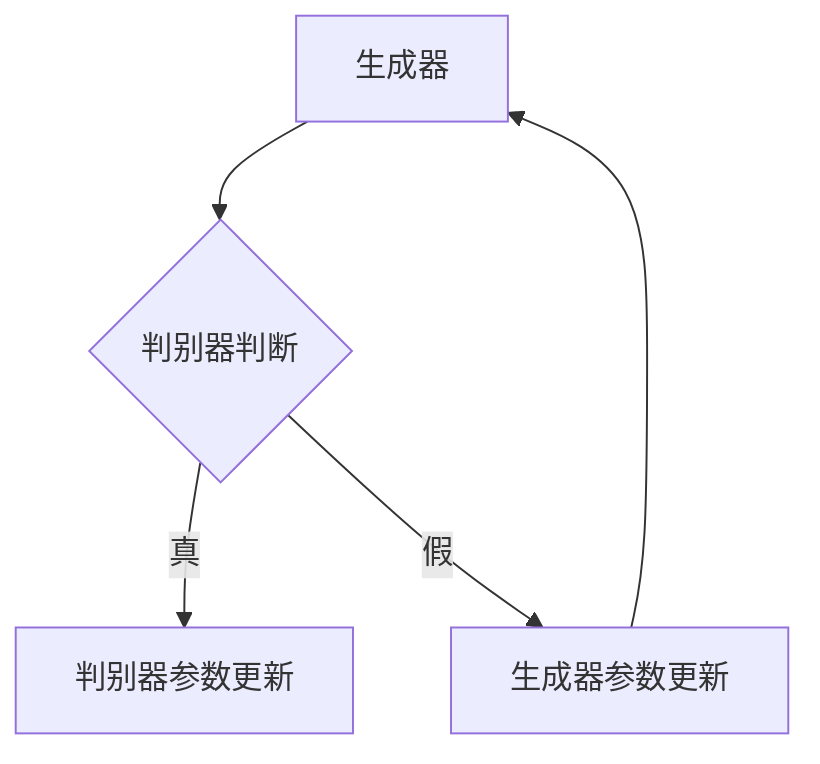

                 

关键词：生成对抗网络（GAN）、深度学习、人工智能、数据生成、机器学习、神经网络、创造性应用。

## 摘要

生成对抗网络（GAN）是一种强大的深度学习框架，能够在无监督学习环境下生成高保真度的数据。本文将深入探讨GAN的核心概念、算法原理、数学模型、实践应用以及未来发展趋势。通过具体的案例和实践，读者将了解如何利用GAN进行数据增强、图像生成、视频生成等创造性应用。

## 1. 背景介绍

### 1.1 GAN的起源

生成对抗网络（GAN）由伊恩·古德费洛（Ian Goodfellow）等人在2014年首次提出。GAN的设计灵感来源于博弈论中的“二人博弈”概念，其中一个玩家（生成器）试图生成与真实数据相似的数据，而另一个玩家（判别器）则试图区分真实数据和生成数据。

### 1.2 GAN的应用领域

GAN在人工智能领域的应用非常广泛，主要包括：

- 数据增强：通过生成与训练数据相似的数据，增加训练样本的多样性。
- 图像生成：生成逼真的图像，用于艺术创作、修复受损图像等。
- 视频生成：生成连续的视频序列，用于动画制作、视频游戏等。
- 语音合成：生成逼真的语音，用于语音助手、语音识别等。

## 2. 核心概念与联系

### 2.1 GAN的组成部分

一个标准的GAN由两个神经网络组成：生成器（Generator）和判别器（Discriminator）。

- **生成器**：接收随机噪声作为输入，通过神经网络处理生成与真实数据相似的数据。
- **判别器**：接收真实数据和生成数据的输入，并尝试区分它们。

### 2.2 GAN的工作原理

GAN通过以下步骤工作：

1. **生成器生成假数据**：生成器接收随机噪声，生成假数据。
2. **判别器进行判断**：判别器同时接收真实数据和生成数据，并尝试判断其真实性。
3. **优化过程**：通过反向传播算法，分别优化生成器和判别器的参数，使得生成器生成的数据更加真实，判别器能够更好地区分真实数据和生成数据。

### 2.3 GAN的架构

下面是一个GAN的Mermaid流程图，展示了生成器和判别器的交互过程。



## 3. 核心算法原理 & 具体操作步骤

### 3.1 算法原理概述

GAN的核心思想是生成器和判别器之间的博弈。生成器试图生成更加真实的数据，而判别器则试图识别出这些数据是真实的还是生成的。这种对抗过程促使两个网络不断优化，最终达到一个平衡状态。

### 3.2 算法步骤详解

1. **初始化网络**：初始化生成器和判别器的参数。
2. **生成器生成数据**：生成器接收随机噪声，生成假数据。
3. **判别器判断数据**：判别器同时接收真实数据和生成数据，并尝试判断其真实性。
4. **计算损失函数**：计算生成器和判别器的损失函数，并使用反向传播算法进行参数更新。
5. **重复步骤2-4**：重复上述步骤，直到生成器和判别器达到平衡状态。

### 3.3 算法优缺点

**优点**：

- 无需标注数据：GAN可以在无监督学习环境下工作，无需对数据进行标注。
- 高效生成数据：GAN能够生成大规模、高质量的数据，提高训练效果。

**缺点**：

- 训练难度大：GAN的稳定性较差，训练过程中容易出现不稳定现象。
- 依赖初始条件：GAN的生成效果很大程度上取决于初始条件，需要多次尝试。

### 3.4 算法应用领域

GAN在图像生成、视频生成、语音合成等领域有广泛的应用。例如，GAN可以用于生成虚假图片，用于人脸合成、艺术创作等。

## 4. 数学模型和公式 & 详细讲解 & 举例说明

### 4.1 数学模型构建

GAN的数学模型主要包括生成器和判别器的损失函数。

**生成器损失函数**：

$$L_G = -\log(D(G(z)))$$

其中，$G(z)$表示生成器生成的数据，$D$表示判别器。

**判别器损失函数**：

$$L_D = -\log(D(x)) - \log(1 - D(G(z)))$$

其中，$x$表示真实数据。

### 4.2 公式推导过程

**生成器损失函数的推导**：

生成器的目标是使判别器无法区分生成的数据和真实数据，因此生成器的损失函数是判别器对生成数据的判断概率的负对数。

$$L_G = -\log(D(G(z)))$$

**判别器损失函数的推导**：

判别器的目标是正确区分真实数据和生成数据，因此判别器的损失函数是真实数据和生成数据的判断概率的负对数之和。

$$L_D = -\log(D(x)) - \log(1 - D(G(z)))$$

### 4.3 案例分析与讲解

以下是一个简单的GAN模型，用于生成手写数字。

**生成器**：

$$G(z) = \sigma(W_2 \cdot \sigma(W_1 \cdot z) + b_1)$$

**判别器**：

$$D(x) = \sigma(W_2 \cdot \sigma(W_1 \cdot x) + b_1)$$

其中，$z$是生成器的输入噪声，$x$是真实数据。

## 5. 项目实践：代码实例和详细解释说明

### 5.1 开发环境搭建

为了实践GAN，需要安装以下环境：

- Python 3.x
- TensorFlow 2.x
- Keras

### 5.2 源代码详细实现

以下是一个简单的GAN模型，用于生成手写数字。

```python
import numpy as np
import tensorflow as tf
from tensorflow.keras.layers import Dense, Flatten
from tensorflow.keras.models import Model

# 生成器模型
def build_generator(z_dim):
    model = tf.keras.Sequential()
    model.add(Dense(128, activation='relu', input_shape=(z_dim,)))
    model.add(Dense(28 * 28, activation='sigmoid'))
    model.add(Reshape((28, 28)))
    return model

# 判别器模型
def build_discriminator(img_shape):
    model = tf.keras.Sequential()
    model.add(Flatten(input_shape=img_shape))
    model.add(Dense(128, activation='relu'))
    model.add(Dense(1, activation='sigmoid'))
    return model

# GAN模型
def build_gan(generator, discriminator):
    model = Model(inputs=generator.input, outputs=discriminator(generator.input))
    model.compile(loss='binary_crossentropy', optimizer=tf.keras.optimizers.Adam(0.0001))
    return model

# 设置参数
z_dim = 100
img_shape = (28, 28, 1)

# 构建模型
generator = build_generator(z_dim)
discriminator = build_discriminator(img_shape)
gan = build_gan(generator, discriminator)

# 加载数据
(x_train, _), (_, _) = tf.keras.datasets.mnist.load_data()
x_train = x_train / 127.5 - 1.0
x_train = np.expand_dims(x_train, axis=3)

# 训练模型
for epoch in range(1000):
    for _ in range(100):
        z = np.random.normal(0, 1, (64, z_dim))
        gen_imgs = generator.predict(z)

        real_imgs = x_train[np.random.randint(0, x_train.shape[0], 64)]

        # 训练判别器
        d_loss_real = discriminator.train_on_batch(real_imgs, np.ones((64, 1)))
        d_loss_fake = discriminator.train_on_batch(gen_imgs, np.zeros((64, 1)))

        # 训练生成器
        g_loss = gan.train_on_batch(z, np.ones((64, 1)))

    print(f'Epoch {epoch + 1}/{1000} [D loss: {d_loss_real + d_loss_fake:.3f}, G loss: {g_loss:.3f}]')

# 保存模型
generator.save('generator.h5')
discriminator.save('discriminator.h5')
gan.save('gan.h5')
```

### 5.3 代码解读与分析

上述代码首先定义了生成器和判别器的结构，然后构建了GAN模型。接着加载MNIST数据集，并对数据进行预处理。最后，通过循环训练生成器和判别器，并打印训练过程中的损失值。

### 5.4 运行结果展示

运行上述代码后，生成器会生成手写数字的图像。以下是部分生成图像：

```python
import matplotlib.pyplot as plt

# 加载模型
generator = tf.keras.models.load_model('generator.h5')

# 生成手写数字图像
z = np.random.normal(0, 1, (64, 100))
gen_imgs = generator.predict(z)

# 展示生成图像
fig, axes = plt.subplots(4, 8, figsize=(10, 5))
for i, ax in enumerate(axes.flat):
    ax.imshow(gen_imgs[i, :, :, 0], cmap='gray')
    ax.set_xticks([])
    ax.set_yticks([])
plt.show()
```

## 6. 实际应用场景

### 6.1 数据增强

GAN可以用于生成与训练数据相似的数据，从而增强训练数据的多样性，提高模型的泛化能力。

### 6.2 图像生成

GAN可以生成高质量、逼真的图像，用于艺术创作、图像修复、虚拟现实等领域。

### 6.3 视频生成

GAN可以生成连续的视频序列，用于动画制作、视频游戏等领域。

### 6.4 语音合成

GAN可以生成逼真的语音，用于语音助手、语音识别等领域。

## 7. 工具和资源推荐

### 7.1 学习资源推荐

- 《深度学习》（Goodfellow, Bengio, Courville）
- 《生成对抗网络》（Ian Goodfellow）

### 7.2 开发工具推荐

- TensorFlow
- Keras

### 7.3 相关论文推荐

- Ian J. Goodfellow, Jean Pouget-Abadie, Mehdi Mirza, Bing Xu, David Warde-Farley, Sherjil Ozair, Aaron C. Courville, and Yoshua Bengio. "Generative Adversarial Nets". Advances in Neural Information Processing Systems, 27:2672–2680, 2014.

## 8. 总结：未来发展趋势与挑战

### 8.1 研究成果总结

GAN在图像生成、视频生成、语音合成等领域取得了显著成果，成为人工智能领域的重要技术。

### 8.2 未来发展趋势

- GAN与其他深度学习技术的融合，如自监督学习、强化学习等。
- GAN在更多领域的应用，如医学图像处理、金融预测等。

### 8.3 面临的挑战

- 训练稳定性：GAN的训练过程容易陷入不稳定状态。
- 数据依赖：GAN的生成效果很大程度上取决于初始条件和数据质量。

### 8.4 研究展望

GAN在未来有望在人工智能领域发挥更大的作用，特别是在数据增强、图像生成、视频生成等领域。

## 9. 附录：常见问题与解答

### 9.1 什么是GAN？

GAN（生成对抗网络）是一种基于深度学习的框架，用于生成高保真度的数据。

### 9.2 GAN有哪些优点？

GAN可以在无监督学习环境下工作，无需对数据进行标注。此外，GAN能够生成大规模、高质量的数据，提高训练效果。

### 9.3 GAN有哪些缺点？

GAN的训练难度较大，稳定性较差。此外，GAN的生成效果很大程度上取决于初始条件和数据质量。

### 9.4 GAN可以应用于哪些领域？

GAN可以应用于图像生成、视频生成、语音合成、数据增强等领域。

-----------------------------------------------------------------

**作者：禅与计算机程序设计艺术 / Zen and the Art of Computer Programming**

