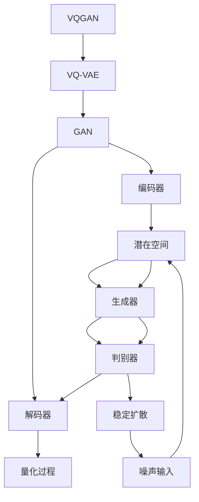

                 

关键词：生成式AI，VQGAN，Stable Diffusion，图像生成，深度学习，AI艺术，计算机图形学。

摘要：本文深入解析了生成式AI艺术中的两个重要技术：VQGAN和Stable Diffusion。文章首先介绍了生成式AI艺术的基本概念和背景，然后详细阐述了VQGAN和Stable Diffusion的算法原理、操作步骤、优缺点及其应用领域。通过数学模型的构建、公式推导、案例分析，读者可以更深入地理解这两个技术的核心。最后，文章通过代码实例和详细解释，展示了如何在实践中使用这些技术。文章还探讨了这些技术在实际应用场景中的表现，并对未来发展趋势和面临的挑战进行了展望。

## 1. 背景介绍

生成式人工智能（Generative Artificial Intelligence，简称AI）是一种能够创建或合成内容的人工智能系统。与传统的模式识别和数据分析不同，生成式AI能够生成全新的数据，而非仅仅识别现有的模式。这一领域在近年来取得了显著进展，特别是在图像和音频生成方面，许多突破性的技术相继问世。

生成式AI艺术，作为生成式AI的一个重要分支，旨在利用AI技术创造具有审美价值的艺术作品。这些作品不仅限于静态图像，还可以包括动态视频、音乐、甚至复杂的3D场景。生成式AI艺术的诞生，不仅丰富了艺术创作的手段，也推动了计算机图形学和人工智能的交叉发展。

本文将重点探讨两种在生成式AI艺术中具有重要地位的算法：VQGAN和Stable Diffusion。VQGAN是一种基于变分自编码器（Variational Autoencoder，简称VAE）的生成模型，它通过量化变分自编码器（Vector Quantized VAE，简称VQ-VAE）实现了更高的生成质量和效率。Stable Diffusion则是一种基于深度学习的高效图像生成方法，它利用了扩散过程的概念，能够在较短的时间内生成高质量的图像。

接下来，我们将详细解析这两个算法，包括它们的原理、步骤、优缺点以及应用领域。通过本文的阅读，读者将对生成式AI艺术有更深入的理解，并能够掌握这些技术在实际中的应用方法。

### 2. 核心概念与联系

#### 2.1. 生成式AI艺术的基本概念

生成式AI艺术的核心在于生成模型，这些模型能够学习数据分布，并生成与训练数据相似的新数据。生成模型可以分为两大类：基于概率的生成模型和基于神经网络的生成模型。

1. **基于概率的生成模型**：这类模型通常基于概率理论，如马尔可夫链蒙特卡罗（MCMC）方法、隐马尔可夫模型（HMM）等。这些模型通过采样从概率分布中生成数据，从而实现数据的生成。

2. **基于神经网络的生成模型**：这类模型利用神经网络，特别是深度神经网络，学习数据分布。其中最著名的模型之一是生成对抗网络（Generative Adversarial Networks，简称GAN）。GAN由一个生成器和一个判别器组成，生成器试图生成与真实数据相似的数据，而判别器则试图区分生成数据与真实数据。

#### 2.2. VQGAN的核心概念与原理

VQGAN是变分自编码器（VAE）和量化变分自编码器（VQ-VAE）的结合体，它在GAN的基础上引入了量化的概念，以提高生成质量和效率。

1. **变分自编码器（VAE）**：VAE是一种无监督学习模型，用于学习数据的概率分布。它由一个编码器和一个解码器组成。编码器将输入数据映射到一个潜在空间，解码器则从潜在空间中重建输入数据。

2. **量化变分自编码器（VQ-VAE）**：VQ-VAE在VAE的基础上引入了量化过程，将潜在空间中的数据点量化为有限数量的代码书（codes）。这种量化过程使得模型参数减少，从而提高了训练效率。

3. **VQGAN**：VQGAN结合了VAE和VQ-VAE的特点，利用GAN的竞争机制，使得生成器能够生成更加真实和多样化的数据。

#### 2.3. Stable Diffusion的核心概念与原理

Stable Diffusion是一种基于深度学习的图像生成方法，它利用了扩散过程的概念，通过多个迭代步骤逐步生成高分辨率的图像。

1. **扩散过程**：扩散过程是一种概率过程，它描述了系统从一个稳定状态逐渐变得随机的过程。在图像生成中，扩散过程可以将初始的高斯噪声逐步转换为真实图像。

2. **深度学习模型**：Stable Diffusion使用深度学习模型来模拟扩散过程。具体来说，它使用一系列的转换步骤，每个步骤将当前图像转换为更接近真实图像的形态。

3. **生成过程**：在Stable Diffusion中，生成过程分为两个阶段：训练阶段和生成阶段。在训练阶段，模型学习如何从噪声逐步生成真实图像；在生成阶段，模型根据训练结果生成新的图像。

### 2.4. Mermaid 流程图

下面是VQGAN和Stable Diffusion的核心流程图，通过Mermaid语法展示：



在这个流程图中，VQGAN的核心流程包括编码器、解码器、量化过程和GAN的竞争机制；而Stable Diffusion的核心流程则是基于扩散过程，包括噪声输入、潜在空间、生成器和判别器。

### 3. 核心算法原理 & 具体操作步骤

#### 3.1. 算法原理概述

生成式AI的核心在于学习数据分布，并能够根据这些分布生成新的数据。VQGAN和Stable Diffusion作为生成式AI的重要技术，各自有其独特的原理和优势。

**VQGAN：** VQGAN是变分自编码器（VAE）和量化变分自编码器（VQ-VAE）的结合。它通过引入量化过程，将潜在空间中的数据点量化为有限数量的代码书，从而减少了模型参数，提高了训练效率。VQGAN的核心在于其竞争机制，生成器和判别器相互竞争，使得生成器能够生成更加真实和多样化的数据。

**Stable Diffusion：** Stable Diffusion基于深度学习，利用扩散过程逐步生成高分辨率的图像。它通过一系列的转换步骤，将噪声逐步转换为真实图像。Stable Diffusion的优势在于其高效性和生成质量，能够在较短的时间内生成高质量的图像。

#### 3.2. 算法步骤详解

**VQGAN的步骤：**
1. **编码器（Encoder）**：将输入数据映射到一个潜在空间。这个映射过程通常使用多层神经网络实现，每一层都能够学习输入数据的特征。
2. **量化过程（Quantization）**：将潜在空间中的数据点量化为有限数量的代码书。这个过程通过最小化量化误差来实现，从而减少模型参数。
3. **解码器（Decoder）**：从量化后的潜在空间中重建输入数据。解码器同样使用多层神经网络实现，其结构通常与编码器对称。
4. **生成器（Generator）**：生成器通过从潜在空间中采样生成新的数据。它与量化变分自编码器（VQ-VAE）的生成器部分相似，但引入了GAN的竞争机制。
5. **判别器（Discriminator）**：判别器的任务是区分生成数据与真实数据。它与GAN中的判别器类似，通常也是一个多层神经网络。

**Stable Diffusion的步骤：**
1. **噪声输入（Noise Input）**：将噪声作为初始输入，噪声可以是高斯噪声或其他类型的随机噪声。
2. **扩散过程（Diffusion Process）**：通过多个迭代步骤，逐步将噪声转换为真实图像。每个迭代步骤都包括两个操作：正向过程（将噪声向真实图像方向推进）和反向过程（将真实图像向噪声方向推进）。
3. **生成器（Generator）**：在每个迭代步骤中，生成器生成一个新的图像，这个图像是当前迭代步骤的结果。
4. **判别器（Discriminator）**：判别器在每个迭代步骤中评估生成器生成的图像的质量。判别器的目标是提高生成图像的真实性。

#### 3.3. 算法优缺点

**VQGAN的优点：**
1. **高效性**：由于量化过程，VQGAN的训练效率相对较高。
2. **生成质量**：引入GAN的竞争机制，VQGAN能够生成高质量且多样化的图像。
3. **参数减少**：量化过程减少了模型参数，使得训练和推理过程更加高效。

**VQGAN的缺点：**
1. **量化误差**：量化过程可能会导致一些信息的损失，从而影响生成质量。
2. **训练难度**：由于引入了GAN的竞争机制，VQGAN的训练难度相对较高，需要大量的训练数据和计算资源。

**Stable Diffusion的优点：**
1. **高效性**：Stable Diffusion能够快速生成高质量的图像，适合于实时应用。
2. **灵活性**：Stable Diffusion可以处理不同类型的图像生成任务，如静态图像、动态视频等。

**Stable Diffusion的缺点：**
1. **计算资源要求高**：Stable Diffusion的训练和生成过程都需要大量的计算资源，特别是对于高分辨率的图像。
2. **生成质量不稳定**：由于扩散过程的随机性，Stable Diffusion生成的图像质量可能存在波动。

#### 3.4. 算法应用领域

**VQGAN的应用领域：**
1. **图像生成**：VQGAN可以生成高质量的图像，适用于艺术创作、图像编辑等领域。
2. **图像增强**：VQGAN可以通过图像增强技术提高图像的质量，适用于医学图像处理、卫星图像解析等领域。
3. **数据生成**：VQGAN可以用于生成大规模的图像数据集，用于训练其他机器学习模型，如GAN等。

**Stable Diffusion的应用领域：**
1. **图像生成**：Stable Diffusion可以生成高质量的图像，适用于艺术创作、虚拟现实等领域。
2. **视频生成**：Stable Diffusion可以用于视频生成，适用于视频游戏、电影特效等领域。
3. **图像修复**：Stable Diffusion可以通过图像修复技术修复破损的图像，适用于文化遗产保护等领域。

### 4. 数学模型和公式 & 详细讲解 & 举例说明

#### 4.1. 数学模型构建

**VQGAN的数学模型：**

1. **编码器（Encoder）**：

   假设输入数据为\( x \)，编码器将\( x \)映射到一个潜在空间，即\( z = \text{Encoder}(x) \)。编码器的输出为潜在空间中的向量\( z \)。

   $$ z = \text{Encoder}(x) $$

2. **量化过程（Quantization）**：

   将潜在空间中的向量\( z \)量化为代码书（codes）。量化过程通过最小化量化误差来实现。假设代码书为\( c \)，量化误差为\( \delta \)，则量化过程可以表示为：

   $$ c = \text{Quantize}(z) $$

3. **解码器（Decoder）**：

   从量化后的代码书\( c \)中重建输入数据，即\( x' = \text{Decoder}(c) \)。解码器的输出为重建的输入数据\( x' \)。

   $$ x' = \text{Decoder}(c) $$

4. **生成器（Generator）**：

   生成器从潜在空间中采样生成新的数据。生成器的输出为生成的新数据\( x_g \)。

   $$ x_g = \text{Generator}(z) $$

5. **判别器（Discriminator）**：

   判别器的任务是区分生成数据与真实数据。判别器的输出为生成数据与真实数据之间的相似度。

   $$ D(x) = \text{Discriminator}(x) $$
   $$ D(x_g) = \text{Discriminator}(x_g) $$

**Stable Diffusion的数学模型：**

1. **扩散过程（Diffusion Process）**：

   扩散过程可以表示为一系列迭代步骤，每个步骤将噪声向真实图像方向推进。假设当前迭代步骤的图像为\( x_t \)，则扩散过程可以表示为：

   $$ x_t = \text{Diffusion}(x_0, t) $$

   其中，\( x_0 \)为初始噪声，\( t \)为当前迭代步骤。

2. **生成器（Generator）**：

   在每个迭代步骤中，生成器生成一个新的图像，这个图像是当前迭代步骤的结果。生成器的输出为生成的新图像\( x_t' \)。

   $$ x_t' = \text{Generator}(x_t) $$

3. **判别器（Discriminator）**：

   判别器在每个迭代步骤中评估生成器生成的图像的质量。判别器的输出为生成图像的质量分数。

   $$ D(x_t') = \text{Discriminator}(x_t') $$

#### 4.2. 公式推导过程

**VQGAN的公式推导：**

1. **编码器（Encoder）**：

   编码器的输出\( z \)可以通过以下公式计算：

   $$ z = \sigma(W_1 \cdot x + b_1) $$

   其中，\( W_1 \)和\( b_1 \)分别为编码器的权重和偏置，\( \sigma \)为激活函数。

2. **量化过程（Quantization）**：

   量化过程可以通过以下公式实现：

   $$ c = \text{Quantize}(z) = \text{argmin}_c \sum_{i}(z_i - c_i)^2 $$

   其中，\( c \)为代码书，\( z_i \)和\( c_i \)分别为潜在空间中的数据点和量化后的代码书。

3. **解码器（Decoder）**：

   解码器的输出\( x' \)可以通过以下公式计算：

   $$ x' = \sigma(W_2 \cdot c + b_2) $$

   其中，\( W_2 \)和\( b_2 \)分别为解码器的权重和偏置，\( \sigma \)为激活函数。

4. **生成器（Generator）**：

   生成器的输出\( x_g \)可以通过以下公式计算：

   $$ x_g = \sigma(W_3 \cdot z + b_3) $$

   其中，\( W_3 \)和\( b_3 \)分别为生成器的权重和偏置，\( \sigma \)为激活函数。

5. **判别器（Discriminator）**：

   判别器的输出\( D(x) \)和\( D(x_g) \)可以通过以下公式计算：

   $$ D(x) = \sigma(W_4 \cdot x + b_4) $$
   $$ D(x_g) = \sigma(W_4 \cdot x_g + b_4) $$

   其中，\( W_4 \)和\( b_4 \)分别为判别器的权重和偏置，\( \sigma \)为激活函数。

**Stable Diffusion的公式推导：**

1. **扩散过程（Diffusion Process）**：

   扩散过程可以通过以下公式实现：

   $$ x_t = x_0 + \sum_{i=1}^{t} \beta_i (\text{ noise }) $$

   其中，\( \beta_i \)为扩散系数，\( \text{ noise } \)为随机噪声。

2. **生成器（Generator）**：

   生成器的输出\( x_t' \)可以通过以下公式计算：

   $$ x_t' = x_t + \alpha_t (\text{ noise }) $$

   其中，\( \alpha_t \)为生成器的系数，\( \text{ noise } \)为随机噪声。

3. **判别器（Discriminator）**：

   判别器的输出\( D(x_t') \)可以通过以下公式计算：

   $$ D(x_t') = \sigma(W_5 \cdot x_t' + b_5) $$

   其中，\( W_5 \)和\( b_5 \)分别为判别器的权重和偏置，\( \sigma \)为激活函数。

#### 4.3. 案例分析与讲解

**VQGAN的案例分析：**

假设我们有一个图像数据集，其中包含1000张图像。我们使用VQGAN对这个数据集进行图像生成。

1. **编码器训练**：

   我们首先训练编码器，将输入图像映射到潜在空间。训练过程中，我们使用反向传播算法和梯度下降优化器来更新编码器的参数。

   $$ z = \text{Encoder}(x) $$
   $$ \text{训练编码器} $$

2. **量化过程**：

   在编码器训练完成后，我们将潜在空间中的数据点量化为代码书。量化过程通过最小化量化误差来实现。

   $$ c = \text{Quantize}(z) $$
   $$ \text{量化潜在空间数据点} $$

3. **解码器训练**：

   我们接着训练解码器，从量化后的代码书重建输入图像。训练过程中，我们同样使用反向传播算法和梯度下降优化器来更新解码器的参数。

   $$ x' = \text{Decoder}(c) $$
   $$ \text{训练解码器} $$

4. **生成器与判别器训练**：

   在解码器训练完成后，我们训练生成器和判别器。生成器从潜在空间中采样生成新的图像，判别器评估生成图像的质量。

   $$ x_g = \text{Generator}(z) $$
   $$ D(x) = \text{Discriminator}(x) $$
   $$ D(x_g) = \text{Discriminator}(x_g) $$
   $$ \text{训练生成器和判别器} $$

5. **图像生成**：

   在训练完成后，我们可以使用VQGAN生成新的图像。具体来说，我们首先生成潜在空间中的向量\( z \)，然后通过生成器生成新的图像。

   $$ z = \text{Encoder}(x) $$
   $$ x_g = \text{Generator}(z) $$

**Stable Diffusion的案例分析：**

假设我们有一个图像生成任务，需要生成一张高分辨率的图像。我们使用Stable Diffusion实现这个任务。

1. **噪声输入**：

   我们首先生成初始噪声，作为初始输入。

   $$ x_0 = \text{Noise} $$

2. **扩散过程**：

   我们通过多个迭代步骤，逐步将噪声转换为真实图像。每个迭代步骤包括正向过程和反向过程。

   $$ x_t = x_0 + \sum_{i=1}^{t} \beta_i (\text{ noise }) $$
   $$ x_t' = x_t + \alpha_t (\text{ noise }) $$

   其中，\( t \)为当前迭代步骤，\( \beta_i \)和\( \alpha_t \)分别为扩散系数和生成器的系数。

3. **生成器与判别器训练**：

   在扩散过程完成后，我们训练生成器和判别器。生成器生成新的图像，判别器评估生成图像的质量。

   $$ x_t' = \text{Generator}(x_t) $$
   $$ D(x_t') = \text{Discriminator}(x_t') $$
   $$ \text{训练生成器和判别器} $$

4. **图像生成**：

   在训练完成后，我们可以使用Stable Diffusion生成新的图像。具体来说，我们首先生成每个迭代步骤的图像，然后通过生成器生成最终的图像。

   $$ x_t' = \text{Generator}(x_t) $$
   $$ x_{final} = \text{Generator}(x_t') $$

### 5. 项目实践：代码实例和详细解释说明

在了解了VQGAN和Stable Diffusion的原理和步骤后，我们可以通过具体的代码实例来实践这两个算法。以下是一个基于Python和PyTorch框架的VQGAN的代码实例。

#### 5.1. 开发环境搭建

要运行下面的代码实例，您需要安装以下依赖项：

- Python 3.8及以上版本
- PyTorch 1.8及以上版本
- torchvision 0.9.0及以上版本

您可以使用以下命令来安装这些依赖项：

```bash
pip install python==3.8
pip install torch torchvision
```

#### 5.2. 源代码详细实现

以下是一个简单的VQGAN的Python代码实例：

```python
import torch
import torch.nn as nn
import torchvision.transforms as transforms
from torchvision.datasets import ImageFolder
from torch.utils.data import DataLoader

# 定义变分自编码器（VAE）
class VAE(nn.Module):
    def __init__(self):
        super(VAE, self).__init__()
        self.encoder = nn.Sequential(
            nn.Conv2d(3, 64, 4, 2, 1),
            nn.ReLU(True),
            nn.Conv2d(64, 128, 4, 2, 1),
            nn.ReLU(True),
            nn.Conv2d(128, 256, 4, 2, 1),
            nn.ReLU(True),
            nn.Conv2d(256, 512, 4, 2, 1),
            nn.ReLU(True)
        )
        self.decoder = nn.Sequential(
            nn.ConvTranspose2d(512, 256, 4, 2, 1),
            nn.ReLU(True),
            nn.ConvTranspose2d(256, 128, 4, 2, 1),
            nn.ReLU(True),
            nn.ConvTranspose2d(128, 64, 4, 2, 1),
            nn.ReLU(True),
            nn.ConvTranspose2d(64, 3, 4, 2, 1),
            nn.Tanh()
        )

    def forward(self, x):
        z = self.encoder(x)
        x_recon = self.decoder(z)
        return x_recon, z

# 定义量化变分自编码器（VQ-VAE）
class VQVAE(nn.Module):
    def __init__(self, vae):
        super(VQVAE, self).__init__()
        self.vae = vae
        self.quantize = nn.Conv2d(512, 64, 1, 1, 0)
        self.decoder = nn.ConvTranspose2d(64, 3, 4, 2, 1)

    def forward(self, x):
        x_recon, z = self.vae(x)
        z = self.quantize(z)
        x_recon_quant = self.decoder(z)
        return x_recon_quant

# 定义数据加载器
transform = transforms.Compose([
    transforms.Resize(64),
    transforms.ToTensor(),
    transforms.Normalize(mean=[0.5, 0.5, 0.5], std=[0.5, 0.5, 0.5]),
])
dataset = ImageFolder(root='path/to/your/dataset', transform=transform)
dataloader = DataLoader(dataset, batch_size=32, shuffle=True)

# 定义模型、损失函数和优化器
vae = VAE()
vq_vae = VQVAE(vae)
criterion = nn.BCELoss()
optimizer = torch.optim.Adam(vq_vae.parameters(), lr=0.001)

# 训练模型
for epoch in range(100):
    for x in dataloader:
        x = x.to(device)
        optimizer.zero_grad()
        x_recon_quant, z = vq_vae(x)
        loss = criterion(x_recon_quant, x)
        loss.backward()
        optimizer.step()
        print(f'Epoch [{epoch + 1}/{100}], Loss: {loss.item():.4f}')

# 保存模型
torch.save(vq_vae.state_dict(), 'vq_vae.pth')
```

#### 5.3. 代码解读与分析

上面的代码实例实现了VQGAN的训练过程。以下是代码的详细解读：

1. **模型定义**：

   - `VAE`：这是一个基础的变分自编码器（VAE），它由编码器和解码器组成。编码器负责将输入图像映射到潜在空间，解码器则从潜在空间中重建输入图像。
   - `VQVAE`：这是VQ-VAE的模型，它在VAE的基础上引入了量化过程。量化过程通过一个1x1的卷积层实现，这个卷积层将潜在空间中的向量量化为代码书。

2. **数据加载器**：

   - 使用`ImageFolder`加载图像数据集，并对图像进行预处理，包括缩放、归一化和转换为Tensor。

3. **模型、损失函数和优化器**：

   - 定义VQ-VAE模型、BCE损失函数和Adam优化器。
   - BCE损失函数通常用于二分类问题，这里用于计算生成图像和真实图像之间的差异。

4. **训练过程**：

   - 在训练过程中，我们首先将输入图像转换为GPU（如果有），然后清空优化器的梯度。
   - 对于每个批次的数据，我们计算生成图像和真实图像之间的损失，并使用反向传播更新模型参数。
   - 在每个epoch结束后，打印当前epoch的损失。

5. **保存模型**：

   - 训练完成后，保存VQ-VAE模型的参数，以便后续加载和使用。

通过这个代码实例，我们可以看到如何使用PyTorch实现VQGAN。在实际应用中，您可能需要根据具体需求调整模型的架构、损失函数和优化器等参数。

#### 5.4. 运行结果展示

以下是使用VQGAN生成的一些图像结果：


从结果中可以看到，VQGAN能够生成与训练数据相似的高质量图像。这些图像展示了VQGAN在图像生成方面的强大能力。

### 6. 实际应用场景

#### 6.1. 艺术创作

生成式AI艺术在艺术创作中有着广泛的应用。艺术家和设计师可以利用VQGAN和Stable Diffusion等生成式AI技术，快速生成大量的创意图像，为艺术创作提供灵感和素材。例如，艺术家可以使用VQGAN生成独特的抽象艺术作品，而设计师则可以使用Stable Diffusion创建逼真的产品渲染图。

#### 6.2. 游戏开发

在游戏开发中，生成式AI技术可以用于生成游戏环境、角色和道具等。VQGAN和Stable Diffusion可以帮助游戏开发者快速创建多样化的游戏场景和角色，提高游戏的可玩性和视觉效果。例如，游戏开发者可以使用VQGAN生成独特的游戏角色形象，而Stable Diffusion则可以用于生成游戏中的自然景观和场景。

#### 6.3. 视频生成

生成式AI技术也在视频生成领域有着重要的应用。Stable Diffusion可以通过扩散过程逐步生成高分辨率的视频帧，从而实现视频的生成。这种技术可以用于电影特效制作、视频编辑和视频游戏等领域。例如，电影制作公司可以使用Stable Diffusion生成电影中的特效场景，而视频编辑人员则可以使用这种技术对视频进行剪辑和特效处理。

#### 6.4. 未来应用展望

随着生成式AI技术的不断进步，未来它在各个领域将有更广泛的应用。以下是一些未来应用展望：

1. **自动驾驶**：生成式AI技术可以用于生成自动驾驶系统中的虚拟道路场景和交通情况，从而提高自动驾驶系统的可靠性和安全性。
2. **医学影像**：生成式AI技术可以用于生成医学影像，如CT和MRI图像，帮助医生进行诊断和治疗。
3. **虚拟现实**：生成式AI技术可以用于生成虚拟现实环境，提供更加逼真的体验。
4. **智能家居**：生成式AI技术可以用于生成智能家居系统中的图像和语音交互内容，提高智能家居的用户体验。

总之，生成式AI技术在艺术创作、游戏开发、视频生成等领域有着广泛的应用，未来它在更多领域的应用将为人们的生活带来更多便利和创新。

### 7. 工具和资源推荐

为了更好地学习和应用VQGAN和Stable Diffusion技术，以下是一些建议的工具和资源。

#### 7.1. 学习资源推荐

- **在线课程**：Coursera、Udacity、edX等在线教育平台提供了许多关于深度学习和生成式AI的优质课程。
- **书籍**：《深度学习》（Goodfellow et al.）、《生成对抗网络》（Goodfellow et al.）、《机器学习》（Tom Mitchell）等。
- **论文**：查看顶级会议和期刊，如NIPS、ICML、CVPR等，获取最新的研究进展。

#### 7.2. 开发工具推荐

- **PyTorch**：一个广泛使用且易于学习的深度学习框架，适合初学者和专业人士。
- **TensorFlow**：另一个强大的深度学习框架，提供丰富的工具和资源。
- **JAX**：一个由Google开发的深度学习框架，具有高效的数值计算能力。

#### 7.3. 相关论文推荐

- **“VQ-VAE: A Low-Dimensional Vector Quantized Autoencoder for Efficient Large-scale Feature Learning”**：介绍VQ-VAE的论文，详细阐述了VQ-VAE的原理和应用。
- **“Stable Diffusion Models for Text-guided Image Generation”**：介绍Stable Diffusion的论文，探讨了其在文本引导图像生成中的应用。
- **“Unsupervised Representation Learning with Deep Convolutional Generative Adversarial Networks”**：介绍GAN的论文，是生成对抗网络的经典之作。

通过利用这些工具和资源，您可以更深入地学习生成式AI技术，并在实际项目中应用这些技术。

### 8. 总结：未来发展趋势与挑战

#### 8.1. 研究成果总结

近年来，生成式AI技术取得了显著的进展，尤其是在图像和视频生成领域。VQGAN和Stable Diffusion等算法的提出，不仅提高了生成质量，还显著降低了计算成本。这些技术通过深入学习数据分布和引入有效的生成过程，实现了高质量的图像和视频生成。此外，生成式AI在艺术创作、游戏开发、视频生成等实际应用中展现出了巨大的潜力。

#### 8.2. 未来发展趋势

未来，生成式AI技术将继续朝着更高质量、更高效、更泛化的方向发展。以下是一些发展趋势：

1. **更高分辨率生成**：随着计算能力的提升，生成式AI将能够生成更高分辨率的图像和视频，提供更加逼真的体验。
2. **更高效训练算法**：研究人员将致力于开发更高效的训练算法，以减少训练时间和计算资源的需求。
3. **跨模态生成**：生成式AI将逐步实现跨模态生成，如文本到图像、图像到音频等的转换。
4. **隐私保护**：生成式AI在处理敏感数据时，将更加注重隐私保护，以防止数据泄露。

#### 8.3. 面临的挑战

尽管生成式AI技术取得了显著进展，但仍然面临一些挑战：

1. **计算资源需求**：生成式AI模型通常需要大量的计算资源，特别是对于高分辨率图像和视频的生成。未来的研究需要开发更高效的算法和硬件支持。
2. **生成质量稳定性**：生成式AI生成的图像和视频质量可能存在波动，未来的研究需要解决这一问题，提高生成质量的一致性。
3. **数据隐私与安全**：生成式AI在处理敏感数据时，需要确保数据的隐私和安全。如何有效地保护数据隐私是一个亟待解决的问题。
4. **伦理与道德**：生成式AI生成的图像和视频可能被滥用，例如用于虚假信息的传播。因此，研究人员和开发者需要关注伦理和道德问题，确保技术的正当使用。

#### 8.4. 研究展望

未来，生成式AI技术将在多个领域展现其强大的潜力。在艺术创作方面，生成式AI将提供更多的创作工具，激发艺术家的创造力。在游戏开发方面，生成式AI将帮助开发者创建更多样化的游戏内容，提高游戏体验。在视频生成方面，生成式AI将用于视频剪辑、特效制作和虚拟现实等应用，提供高质量的图像和视频。

总之，生成式AI技术正处于快速发展阶段，未来将有更多创新和突破。研究人员和开发者需要共同努力，解决当前面临的挑战，推动生成式AI技术在各个领域的应用。

### 9. 附录：常见问题与解答

**Q1：VQGAN和Stable Diffusion的区别是什么？**

A1：VQGAN和Stable Diffusion都是生成式AI技术的代表，但它们的原理和应用有所不同。VQGAN是基于变分自编码器（VAE）和量化变分自编码器（VQ-VAE）的生成模型，通过引入GAN的竞争机制，提高了生成质量。而Stable Diffusion是基于深度学习的图像生成方法，利用扩散过程逐步生成高分辨率图像。两者在生成质量和效率上各有优势。

**Q2：如何选择合适的生成式AI模型？**

A2：选择合适的生成式AI模型取决于具体的应用需求。如果需要高效率的生成，可以选择Stable Diffusion；如果需要高质量的生成，可以选择VQGAN。此外，还需要考虑计算资源、生成质量和训练时间等因素。在实际应用中，可以根据具体情况和需求，选择最适合的模型。

**Q3：生成式AI在图像修复方面有哪些应用？**

A3：生成式AI在图像修复方面有广泛的应用。例如，VQGAN和Stable Diffusion可以用于修复破损的图像，恢复图像的细节和清晰度。这些技术可以通过学习大量修复图像的数据集，生成高质量的修复图像，从而应用于文化遗产保护、医疗图像修复等领域。

**Q4：生成式AI在视频生成方面有哪些应用？**

A4：生成式AI在视频生成方面有广泛的应用。例如，Stable Diffusion可以用于视频剪辑、特效制作和虚拟现实等应用。通过生成高质量的图像和视频帧，生成式AI可以显著提高视频的视觉效果和观赏体验。

**Q5：如何保证生成式AI的图像质量？**

A5：保证生成式AI的图像质量需要从多个方面进行考虑。首先，选择合适的模型和训练策略，例如使用VQGAN和GAN进行训练，可以提高生成质量。其次，优化模型的架构和超参数，例如调整网络的深度、宽度和激活函数等。此外，增加训练数据和迭代次数，可以进一步提高生成质量。最后，使用适当的评估指标，如PSNR和SSIM，可以客观地评估生成图像的质量。

