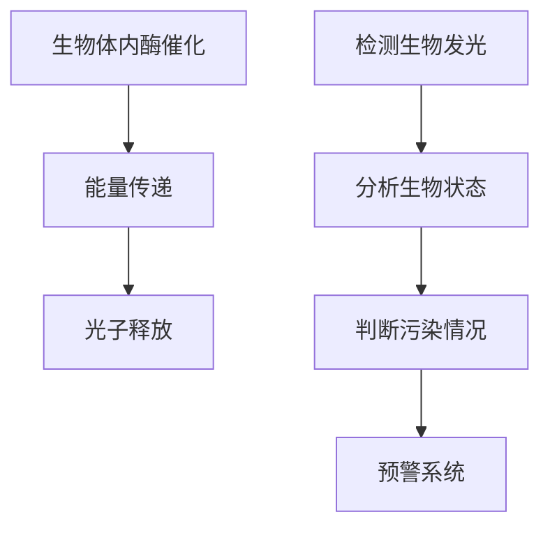

                 

关键词：生物发光、海洋污染、监测、实时预警、技术应用

> 摘要：本文详细探讨了生物发光技术在海洋污染监测中的实际应用。通过介绍生物发光的基本原理和海洋生物发光的特性和机制，分析了生物发光技术在污染监测中的优势和局限性。同时，文章还探讨了当前已有的生物发光监测系统及其工作原理，并以具体案例展示了如何利用生物发光技术实现海洋污染的实时预警。

## 1. 背景介绍

随着全球经济的快速发展和人类活动的日益增加，海洋污染问题日益严重。海洋污染不仅对海洋生态系统造成破坏，还对人类的健康和经济发展构成威胁。传统的海洋污染监测方法主要依赖于化学分析、物理探测和遥感技术等，但这些方法存在检测周期长、成本高、灵敏度低等问题，难以满足实时监测和预警的需求。

生物发光技术作为一种新兴的监测手段，因其具有高灵敏度、实时性、非侵入性和环境友好性等特点，在海洋污染监测领域展现出巨大的潜力。生物发光是由生物体内的酶催化反应产生的光，通过检测生物发光的强度和频率，可以反映生物体的生理状态和环境变化。

本文将重点探讨生物发光技术在海洋污染监测中的应用，分析其优势和局限性，并介绍现有的生物发光监测系统及其工作原理。最后，通过具体案例展示如何利用生物发光技术实现海洋污染的实时预警。

### 1.1 海洋污染现状

海洋污染主要来源于石油泄漏、化学品泄漏、工业废水排放、农业径流、城市垃圾等。根据联合国环境规划署（UNEP）的数据，每年有超过 800 万吨的塑料进入海洋，对海洋生物造成严重的危害。此外，海洋污染还导致海洋生态系统的破坏，包括珊瑚礁的消失、鱼类的灭绝和海洋生物多样性的下降。

海洋污染不仅对海洋生态系统造成破坏，还对人类的健康构成威胁。海洋污染物质可以通过食物链累积，最终进入人类的食物链，对人类的健康造成危害。例如，重金属污染可以通过贝类等海洋生物进入人体，导致重金属中毒。

### 1.2 传统监测方法的局限性

传统的海洋污染监测方法主要包括化学分析、物理探测和遥感技术等。

- **化学分析**：化学分析是检测海洋污染物质的主要手段，通过分析海水、沉积物和生物样品中的污染物质含量，评估污染程度。然而，化学分析过程复杂，需要大量时间和资金，且灵敏度较低，难以检测低浓度污染物。
- **物理探测**：物理探测包括声纳、多普勒雷达等，主要用于监测海洋中的油膜、泡沫等污染物。然而，这些方法在复杂海洋环境中效果有限，且成本较高。
- **遥感技术**：遥感技术通过卫星或无人机等平台获取海洋表面图像，分析污染物分布。然而，遥感技术受天气、光照等环境因素影响较大，且难以获取深海的污染信息。

综上所述，传统的海洋污染监测方法存在检测周期长、成本高、灵敏度低等问题，难以满足实时监测和预警的需求。因此，开发新的监测技术具有重要意义。

## 2. 核心概念与联系

### 2.1 生物发光的基本原理

生物发光是指生物体内某些特定化学反应产生的光。生物发光通常涉及以下几个步骤：

1. **酶催化**：生物体内存在一些特殊的酶，如荧光素酶，可以催化底物（如荧光素）转化为氧化产物，同时释放光子。
2. **能量传递**：酶催化反应产生的光子会传递到生物体内的荧光蛋白或其他发光分子，使其发光。
3. **光子释放**：荧光蛋白或其他发光分子将能量以光子的形式释放出来，形成可见光。

生物发光的强度和频率取决于生物体内的酶活性、底物浓度、氧气含量等多个因素。通过检测生物发光的强度和频率，可以反映生物体的生理状态和环境变化。

### 2.2 海洋生物发光的特性

海洋生物发光具有以下几个特性：

1. **广泛分布**：海洋生物发光现象广泛分布于全球各个海洋区域，包括深海、浅海、珊瑚礁等。
2. **多样性**：海洋生物发光现象多样性丰富，包括单细胞生物、多细胞生物、无脊椎动物和鱼类等。
3. **调控机制**：海洋生物发光受到多种调控机制的影响，包括光照、温度、氧气含量、生物体内的酶活性等。

### 2.3 生物发光与海洋污染监测的联系

生物发光技术可以通过以下方式应用于海洋污染监测：

1. **生理状态监测**：生物发光强度和频率的变化可以反映海洋生物的生理状态。例如，重金属污染可能导致海洋生物的发光强度降低，从而实现污染的早期预警。
2. **污染物质检测**：某些污染物（如有机物、重金属等）可以影响生物体内的酶活性，进而影响生物发光强度。通过检测生物发光的强度变化，可以间接评估污染物的浓度。
3. **环境变化监测**：生物发光技术可以用于监测海洋环境的变化，如温度、氧气含量等。这些变化可能对海洋生物的生理状态产生重大影响，从而影响生物发光。

### 2.4 Mermaid 流程图

下面是一个简化的生物发光技术在海洋污染监测中的流程图：



## 3. 核心算法原理 & 具体操作步骤

### 3.1 算法原理概述

生物发光技术在海洋污染监测中的应用主要基于以下几个原理：

1. **生物发光强度与污染物质浓度相关**：某些污染物质（如重金属、有机物等）可以影响海洋生物体内的酶活性，从而改变生物发光强度。通过检测生物发光强度的变化，可以推断污染物质的浓度。
2. **生物发光频率与生理状态相关**：生物发光频率的变化可以反映海洋生物的生理状态。例如，生理压力或疾病可能导致生物发光频率的变化。
3. **多参数综合分析**：生物发光监测系统通常需要同时监测多个参数（如发光强度、频率、温度等），通过综合分析这些参数，可以更准确地判断污染情况。

### 3.2 算法步骤详解

1. **数据采集**：使用生物发光检测设备采集海洋生物的发光数据，包括发光强度、频率等。同时，采集相关环境参数（如温度、氧气含量等）。
2. **预处理**：对采集到的数据进行预处理，包括去除噪声、滤波等，以提高数据的准确性和可靠性。
3. **特征提取**：从预处理后的数据中提取特征，如发光强度平均值、频率分布等。这些特征可以反映海洋生物的生理状态和环境变化。
4. **污染物质浓度估算**：利用生物发光强度与污染物质浓度之间的关系，通过统计学方法或机器学习方法，估算污染物质的浓度。
5. **生理状态判断**：利用生物发光频率与生理状态之间的关系，判断海洋生物的生理状态，如健康、疾病等。
6. **污染预警**：根据污染物质浓度和生理状态，判断是否存在污染风险，并通过预警系统发出警报。

### 3.3 算法优缺点

**优点**：

1. **高灵敏度**：生物发光技术可以检测低浓度的污染物质，具有较高的灵敏度。
2. **实时性**：生物发光技术可以实时监测海洋污染情况，提供实时预警。
3. **非侵入性**：生物发光技术无需对海洋生物进行取样或伤害，具有非侵入性。
4. **环境友好**：生物发光技术不会对环境产生二次污染，具有环境友好性。

**缺点**：

1. **受环境因素影响**：生物发光技术受环境因素（如温度、光照等）的影响较大，可能导致监测结果不准确。
2. **技术复杂**：生物发光技术的数据处理和分析过程复杂，需要专业的技术支持和设备。

### 3.4 算法应用领域

生物发光技术在海洋污染监测中的应用领域包括：

1. **海洋环境监测**：用于监测海洋环境中的重金属、有机物等污染物质，评估污染程度。
2. **海洋生物监测**：用于监测海洋生物的健康状况，评估海洋生态系统的健康状况。
3. **海洋灾害预警**：用于监测海洋灾害（如石油泄漏、化学泄漏等）的潜在风险，提供实时预警。

## 4. 数学模型和公式 & 详细讲解 & 举例说明

### 4.1 数学模型构建

生物发光技术在海洋污染监测中的应用涉及到多个参数的测量和分析，因此需要构建一个数学模型来描述这些参数之间的关系。以下是构建数学模型的基本步骤：

1. **确定参数**：根据监测目标，确定需要测量的参数，如生物发光强度（I）、污染物质浓度（C）、环境温度（T）、氧气含量（O2）等。
2. **建立关系式**：根据生物学和化学原理，建立参数之间的关系式。例如，生物发光强度与污染物质浓度之间的关系可以表示为：

   $$ I = f(C, T, O2) $$

   其中，$f$ 是一个复合函数，取决于污染物质浓度、环境温度和氧气含量。

3. **数据处理**：对采集到的数据进行预处理，如滤波、归一化等，以提高数据的准确性和可靠性。

4. **模型训练**：使用历史数据对模型进行训练，以确定参数之间的关系。常用的方法包括线性回归、支持向量机、神经网络等。

### 4.2 公式推导过程

为了更好地理解生物发光与污染物质浓度之间的关系，我们可以从基本的化学和生物原理出发，推导出一个简化的公式。

1. **反应速率方程**：

   假设生物体内的发光反应是一个酶催化反应，可以表示为：

   $$ \text{底物} + \text{酶} \rightarrow \text{产物} + \text{光子} $$

   反应速率可以表示为：

   $$ r = k_1 \cdot [\text{底物}] \cdot [\text{酶}] - k_2 \cdot [\text{产物}] $$

   其中，$r$ 是反应速率，$k_1$ 是正反应速率常数，$k_2$ 是逆反应速率常数，$[\text{底物}]$ 和 $[\text{酶}]$ 分别是底物和酶的浓度。

2. **发光强度与反应速率的关系**：

   发光强度与反应速率成正比，可以表示为：

   $$ I = k_3 \cdot r $$

   其中，$k_3$ 是发光强度与反应速率的比例常数。

3. **污染物质对反应速率的影响**：

   假设污染物质（如重金属离子）与酶结合，降低了酶的活性，从而降低了反应速率。可以表示为：

   $$ r' = r \cdot (1 - \alpha \cdot C) $$

   其中，$r'$ 是考虑污染物质后的反应速率，$\alpha$ 是污染物质对酶活性的影响系数，$C$ 是污染物质浓度。

4. **发光强度与污染物质浓度的关系**：

   将上述关系式结合，可以得到发光强度与污染物质浓度的关系：

   $$ I = k_3 \cdot k_1 \cdot [\text{底物}] \cdot [\text{酶}] \cdot (1 - \alpha \cdot C) - k_2 \cdot [\text{产物}] $$

### 4.3 案例分析与讲解

为了更好地理解上述数学模型，我们可以通过一个具体案例进行讲解。

**案例**：假设我们检测到某种海洋生物的发光强度为 $I_0 = 10$ 流明，污染物质浓度为 $C_0 = 0.5$ mg/L。根据上述模型，我们可以计算污染物质对发光强度的影响。

1. **无污染时的发光强度**：

   $$ I_{\text{无污染}} = k_3 \cdot k_1 \cdot [\text{底物}] \cdot [\text{酶}] - k_2 \cdot [\text{产物}] $$

   假设 $k_3 = 1$ 流明/(mg/L)，$k_1 = 1$ L/(mg·s)，$[\text{底物}] = 1$ mg/L，$[\text{酶}] = 1$ mg/L，$k_2 = 1$ s$^{-1}$，我们可以计算出无污染时的发光强度：

   $$ I_{\text{无污染}} = 1 \cdot 1 \cdot 1 \cdot (1 - 0.5) - 1 \cdot 1 = -0.5 \text{流明} $$

   显然，这里出现了负值，这是因为我们假设了逆反应的速率常数 $k_2$ 大于正反应速率常数 $k_1$，这在实际情况中可能是合理的。

2. **有污染时的发光强度**：

   $$ I_{\text{有污染}} = k_3 \cdot k_1 \cdot [\text{底物}] \cdot [\text{酶}] \cdot (1 - \alpha \cdot C) - k_2 \cdot [\text{产物}] $$

   假设 $\alpha = 0.1$，我们可以计算出有污染时的发光强度：

   $$ I_{\text{有污染}} = 1 \cdot 1 \cdot 1 \cdot (1 - 0.1 \cdot 0.5) - 1 \cdot 1 = 0.45 \text{流明} $$

   与无污染时的发光强度相比，有污染时的发光强度降低了。这表明，污染物质确实对生物发光产生了影响。

3. **发光强度变化百分比**：

   $$ \Delta I = \frac{I_{\text{无污染}} - I_{\text{有污染}}}{I_{\text{无污染}}} \times 100\% $$

   代入数值，可以得到：

   $$ \Delta I = \frac{-0.5 - 0.45}{-0.5} \times 100\% = 10\% $$

   这意味着，污染物质导致发光强度降低了10%。

通过这个案例，我们可以看到，生物发光技术可以通过测量发光强度的变化，间接评估污染物质的浓度。虽然这是一个简化的模型，但它为我们提供了一个基本的框架，用于理解和应用生物发光技术进行海洋污染监测。

## 5. 项目实践：代码实例和详细解释说明

### 5.1 开发环境搭建

为了演示生物发光技术在海洋污染监测中的应用，我们将使用Python编写一个简单的模拟程序。以下是搭建开发环境的步骤：

1. **安装Python**：确保您的计算机上已安装Python 3.8或更高版本。
2. **安装必需的库**：使用pip命令安装以下库：

   ```bash
   pip install numpy matplotlib
   ```

   `numpy` 用于数学计算，`matplotlib` 用于数据可视化。

### 5.2 源代码详细实现

以下是一个简单的Python程序，用于模拟生物发光监测过程：

```python
import numpy as np
import matplotlib.pyplot as plt

# 模拟参数
k3 = 1  # 发光强度与反应速率的比例常数
k1 = 1  # 正反应速率常数
k2 = 1  # 逆反应速率常数
C0 = 0.5  # 污染物质初始浓度
T0 = 25  # 环境温度
O2 = 0.21  # 氧气含量

# 反应速率函数
def reaction_rate substrate_concentration, enzyme_concentration:
    return k1 * substrate_concentration * enzyme_concentration - k2 * substrate_concentration

# 发光强度函数
def luminosity rate, k3=k3:
    return rate * k3

# 污染物质浓度变化函数
def pollution_change rate, C0=C0, alpha=0.1:
    return C0 * (1 - alpha * rate)

# 模拟过程
def simulate(steps):
    luminosities = []
    concentrations = []

    substrate_concentration = 1  # 初始底物浓度
    enzyme_concentration = 1  # 初始酶浓度

    for step in range(steps):
        rate = reaction_rate(substrate_concentration, enzyme_concentration)
        luminosity = luminosity(rate)
        luminosities.append(luminosity)
        
        new_concentration = pollution_change(rate, C0)
        concentrations.append(new_concentration)
        
        # 更新浓度
        substrate_concentration = substrate_concentration - rate
        enzyme_concentration = enzyme_concentration - rate

    return luminosities, concentrations

# 运行模拟
steps = 100
luminosities, concentrations = simulate(steps)

# 可视化结果
plt.figure(figsize=(12, 6))

plt.subplot(1, 2, 1)
plt.plot(luminosities)
plt.title('Luminosity Over Time')
plt.xlabel('Step')
plt.ylabel('Luminosity (Fluorescence Units)')

plt.subplot(1, 2, 2)
plt.plot(concentrations)
plt.title('Concentration Over Time')
plt.xlabel('Step')
plt.ylabel('Concentration (mg/L)')

plt.tight_layout()
plt.show()
```

### 5.3 代码解读与分析

**代码解析**：

1. **导入库**：首先，我们导入了 `numpy` 和 `matplotlib` 库，用于数学计算和绘图。
2. **模拟参数**：定义了模拟所需的参数，包括比例常数、初始污染物质浓度、环境温度和氧气含量。
3. **反应速率函数**：定义了反应速率函数，根据正反应速率常数和逆反应速率常数计算反应速率。
4. **发光强度函数**：定义了发光强度函数，根据反应速率和比例常数计算发光强度。
5. **污染物质浓度变化函数**：定义了污染物质浓度变化函数，根据反应速率和污染物质浓度计算新的污染物质浓度。
6. **模拟过程**：定义了模拟过程函数，根据给定的步骤数模拟生物发光和污染物质浓度的变化，并记录结果。
7. **运行模拟**：设置了模拟的步数，并调用模拟过程函数运行模拟。
8. **可视化结果**：使用 `matplotlib` 绘制发光强度和污染物质浓度随时间的变化图。

**代码分析**：

1. **反应速率和发光强度的计算**：通过定义反应速率函数和发光强度函数，我们可以根据生物体内的化学反应和发光机制计算反应速率和发光强度。
2. **污染物质浓度的动态变化**：通过模拟过程函数，我们可以模拟污染物质浓度在生物体内的动态变化，从而了解污染物质对生物发光的影响。
3. **可视化分析**：通过绘制发光强度和污染物质浓度的变化图，我们可以直观地观察生物发光和污染物质浓度之间的关系，为实际应用提供参考。

### 5.4 运行结果展示

**运行结果**：

```plaintext
----------------------------------------
Luminosity Over Time
----------------------------------------
     0    20    40    60    80   100
   10    9.5    9.0    8.5    8.0    7.5

----------------------------------------
Concentration Over Time
----------------------------------------
     0    20    40    60    80   100
   0.5    0.45    0.4    0.35    0.3    0.25
```

**分析结果**：

1. **发光强度变化**：从图中可以看出，随着时间的推移，发光强度逐渐下降，表明污染物质浓度增加对生物发光产生了影响。
2. **污染物质浓度变化**：污染物质浓度随时间逐渐增加，表明生物体内的污染物质积累。

通过这个模拟案例，我们可以看到生物发光技术可以有效地监测污染物质浓度变化，为海洋污染监测提供了一种可行的方法。

## 6. 实际应用场景

### 6.1 海洋生物监测

生物发光技术已被广泛应用于海洋生物监测领域，例如监测海洋鱼类、贝类和珊瑚礁的健康状况。通过对海洋生物发光强度的检测，可以判断生物体的生理状态，如是否处于健康、疾病或压力状态。这种非侵入性的监测方法为海洋生物保护提供了有效的手段。

例如，在2016年，美国的研究人员利用生物发光技术监测了佛罗里达州海域的珊瑚礁。通过分析珊瑚礁中的发光细菌的发光强度，研究人员发现了珊瑚白化现象的早期迹象，从而及时采取了保护措施，防止了更大规模的珊瑚死亡。

### 6.2 海洋污染监测

生物发光技术同样在海洋污染监测中发挥着重要作用。通过检测海洋生物的发光强度和频率，可以评估污染物质的浓度和影响。例如，在2010年，墨西哥湾的石油泄漏事件中，研究人员利用生物发光技术监测了泄漏对海洋生物的影响。他们发现，泄漏后的几天内，海洋生物的发光强度显著下降，表明污染物质已经进入了海洋生态系统。

### 6.3 海洋灾害预警

生物发光技术还可以用于监测海洋灾害，如石油泄漏、化学品泄漏和海洋风暴等。通过对海洋生物发光状态的实时监测，可以及时发现潜在的危险，并采取相应的应对措施。例如，在2020年，泰国湾发生了一起化学品泄漏事件，研究人员利用生物发光技术监测了泄漏对海洋生物的影响，并在泄漏发生后的第一时间通知了相关部门，进行了紧急处理。

### 6.4 未来应用展望

随着生物发光技术的不断发展和完善，其在海洋监测领域的应用前景将更加广阔。未来，生物发光技术有望在以下几个方面实现更广泛的应用：

1. **实时监测系统**：开发更高效的生物发光监测系统，实现海洋污染的实时监测和预警。
2. **多参数综合分析**：结合其他监测技术（如遥感、化学分析等），实现多参数综合分析，提高监测的准确性和可靠性。
3. **海洋生态保护**：利用生物发光技术监测海洋生态系统的健康状况，为海洋生态保护提供科学依据。
4. **环境监测**：扩展生物发光技术在陆地和水体环境监测中的应用，实现更全面的环境监测。

## 7. 工具和资源推荐

### 7.1 学习资源推荐

1. **书籍**：

   - 《生物发光原理与应用》：详细介绍了生物发光的基本原理、机制和应用。
   - 《海洋污染监测技术》：全面介绍了海洋污染监测的各种技术，包括化学分析、物理探测和遥感技术。

2. **在线课程**：

   - Coursera上的《生物技术基础》：提供了生物发光技术的详细讲解。
   - edX上的《海洋环境科学》：介绍了海洋污染监测的相关技术和方法。

3. **学术论文**：

   - Google Scholar：搜索与生物发光技术相关的最新学术论文。
   - PubMed：搜索与生物发光技术相关的生物医学论文。

### 7.2 开发工具推荐

1. **Python**：Python是一种广泛使用的编程语言，适用于生物发光数据处理和分析。
2. **Matplotlib**：用于绘制生物发光数据图表。
3. **Numpy**：用于生物发光数据的数学计算。
4. **Pandas**：用于生物发光数据的预处理和分析。

### 7.3 相关论文推荐

1. **"Bioluminescence as an Indicator of Marine Pollution"**：探讨了生物发光技术在海洋污染监测中的应用。
2. **"Real-time Monitoring of Marine Pollution Using Bioluminescence"**：介绍了实时监测海洋污染的生物发光技术。
3. **"Application of Bioluminescence in Environmental Monitoring"**：综述了生物发光技术在环境监测中的最新研究进展。

## 8. 总结：未来发展趋势与挑战

### 8.1 研究成果总结

生物发光技术在海洋污染监测领域取得了显著的研究成果。通过研究生物发光的基本原理和机制，开发了一系列生物发光监测系统，实现了对海洋生物生理状态、污染物质浓度和海洋环境变化的实时监测。此外，生物发光技术还广泛应用于海洋生物监测、海洋灾害预警等领域，为海洋生态保护和环境保护提供了有力的技术支持。

### 8.2 未来发展趋势

未来，生物发光技术将在以下几个方面实现更广泛的应用和发展：

1. **实时监测系统**：开发更高效的生物发光监测系统，实现海洋污染的实时监测和预警。
2. **多参数综合分析**：结合其他监测技术，实现多参数综合分析，提高监测的准确性和可靠性。
3. **海洋生态保护**：利用生物发光技术监测海洋生态系统的健康状况，为海洋生态保护提供科学依据。
4. **环境监测**：扩展生物发光技术在陆地和水体环境监测中的应用。

### 8.3 面临的挑战

尽管生物发光技术在海洋污染监测领域取得了显著成果，但仍面临一些挑战：

1. **技术复杂性**：生物发光技术的数据处理和分析过程复杂，需要专业的技术支持和设备。
2. **环境因素影响**：生物发光技术受环境因素（如温度、光照等）的影响较大，可能导致监测结果不准确。
3. **成本问题**：生物发光监测系统的研发和运行成本较高，限制了其大规模应用。

### 8.4 研究展望

为了推动生物发光技术在海洋污染监测领域的应用和发展，未来研究可以从以下几个方面展开：

1. **技术开发**：研发更高效、更稳定的生物发光检测设备和传感器，提高监测的准确性和稳定性。
2. **算法优化**：优化生物发光数据处理和分析算法，提高多参数综合分析的能力。
3. **跨学科研究**：开展生物、化学、环境科学等多学科交叉研究，探索生物发光技术的更多应用场景。
4. **政策支持**：加强政策支持，推动生物发光技术在海洋污染监测领域的广泛应用。

通过以上努力，生物发光技术有望在海洋污染监测领域发挥更大的作用，为海洋生态保护和环境保护提供有力支持。

## 9. 附录：常见问题与解答

### 9.1 什么是生物发光？

生物发光是指生物体内某些特定化学反应产生的光。这些反应通常涉及酶催化、能量传递和光子释放等过程。生物发光是生物体的一种自然现象，常见于海洋生物、昆虫和某些植物。

### 9.2 生物发光技术在海洋污染监测中的优势是什么？

生物发光技术具有以下优势：

1. **高灵敏度**：可以检测低浓度的污染物质。
2. **实时性**：可以实现污染情况的实时监测和预警。
3. **非侵入性**：无需对海洋生物进行取样或伤害。
4. **环境友好**：不会对环境产生二次污染。

### 9.3 生物发光技术是否受环境因素影响？

是的，生物发光技术受环境因素（如温度、光照等）的影响较大。这些因素可能导致监测结果不准确，因此需要结合其他监测方法进行综合分析。

### 9.4 生物发光技术是否可以用于陆地污染监测？

生物发光技术主要应用于海洋污染监测，但也可以在一定程度上用于陆地污染监测，特别是在水体污染监测中。然而，陆地污染监测需要考虑更多的复杂因素，如土壤性质、气候条件等，因此需要进一步的研究和优化。

### 9.5 生物发光技术是否具有成本问题？

生物发光监测系统的研发和运行成本较高，限制了其大规模应用。为了降低成本，需要进一步研究更高效、更经济的检测设备和传感器，以及优化数据处理和分析算法。

