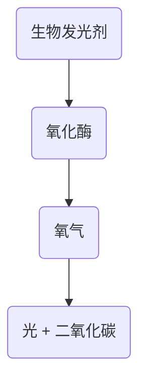
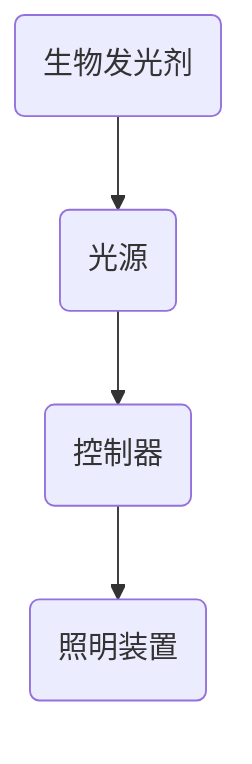

                 

关键词：生物发光，照明技术，环保，节能，应用场景，未来发展

摘要：本文旨在探讨生物发光技术在照明领域的应用，以及其对环保和节能的贡献。通过对生物发光技术的原理、应用实例及其在照明领域的潜在优势进行深入分析，本文提出了生物发光技术在照明领域中具有广阔的发展前景。

## 1. 背景介绍

照明技术是现代生活中不可或缺的一部分，然而，传统的照明技术往往伴随着能源消耗和环境污染的问题。随着全球能源危机和环境污染问题的日益严重，寻找环保、节能的照明技术已经成为当务之急。生物发光技术作为一种新兴的照明技术，以其独特的原理和优势，逐渐受到人们的关注。

生物发光是指生物体内通过化学反应产生光的过程。这种现象最早在海洋生物中观察到，如萤火虫和珊瑚。近年来，科学家们通过深入研究生物发光的机制，开发出了基于生物发光的照明技术。这种技术利用生物发光剂在特定的激发条件下产生光，具有高效、环保、节能的特点。

## 2. 核心概念与联系

### 2.1 生物发光原理

生物发光的原理基于生物体内的化学反应。生物发光剂（如萤火虫素）在氧化酶的作用下与氧气反应，产生光和二氧化碳。这一过程被称为生物发光。生物发光剂和氧化酶在生物体内以特定的比例存在，这使得生物发光具有可控性。



### 2.2 生物发光剂与照明

生物发光剂是生物发光技术中的关键组成部分。不同的生物发光剂具有不同的发光效率和颜色。在照明应用中，科学家们通过筛选和优化生物发光剂，使其能够在不同的照明环境中提供合适的照明效果。

### 2.3 生物发光照明系统

生物发光照明系统包括生物发光剂、光源、控制器和照明装置。光源用于激发生物发光剂产生光，控制器用于调节生物发光剂的发光强度和颜色。照明装置则是将生物发光产生的光传播到照明区域。



## 3. 核心算法原理 & 具体操作步骤

### 3.1 算法原理概述

生物发光照明系统的核心算法是生物发光剂的激发和调节。通过精确控制光源的亮度和颜色，可以实现对生物发光剂发光强度和颜色的调节，从而实现照明效果的控制。

### 3.2 算法步骤详解

1. **生物发光剂的筛选和优化**：根据照明需求，选择合适的生物发光剂，并进行优化，提高其发光效率和稳定性。

2. **光源的设计与控制**：设计适合生物发光剂激发的光源，并开发相应的控制算法，实现对光源亮度和颜色的调节。

3. **照明装置的设计与安装**：根据照明区域的需求，设计合适的照明装置，并安装到合适的位置。

4. **照明效果的控制**：通过控制器调节光源的亮度和颜色，实现对照明效果的实时调节。

### 3.3 算法优缺点

**优点**：
- 环保：生物发光剂产生的光不产生热量，不会对环境造成热污染。
- 节能：生物发光剂发光效率高，能耗低，具有显著的节能效果。
- 可调性：通过控制光源的亮度和颜色，可以实现对照明效果的精确控制。

**缺点**：
- 成本：目前生物发光剂和照明系统的成本相对较高，限制了其大规模应用。
- 稳定性：生物发光剂和光源的稳定性仍需提高，以适应各种照明环境。

### 3.4 算法应用领域

生物发光照明技术可以应用于室内外照明、艺术照明、医疗照明等领域。特别是在需要节能、环保的场合，如绿色建筑、智能照明系统等，具有广泛的应用前景。

## 4. 数学模型和公式 & 详细讲解 & 举例说明

### 4.1 数学模型构建

生物发光照明系统的数学模型主要包括生物发光剂的发光效率、光源的发光强度和照明装置的反射率。以下是生物发光照明系统的数学模型：

$$
E = \eta \cdot I \cdot R
$$

其中，$E$ 表示照明效果，$\eta$ 表示生物发光剂的发光效率，$I$ 表示光源的发光强度，$R$ 表示照明装置的反射率。

### 4.2 公式推导过程

1. **生物发光剂的发光效率**：生物发光剂的发光效率可以通过实验测定，也可以通过理论计算获得。假设生物发光剂的发光效率为 $\eta$。

2. **光源的发光强度**：光源的发光强度可以通过光源的亮度公式计算。假设光源的发光强度为 $I$。

3. **照明装置的反射率**：照明装置的反射率可以通过照明装置的材料和结构特性计算。假设照明装置的反射率为 $R$。

4. **综合公式**：将上述三个参数代入照明效果公式，得到：

$$
E = \eta \cdot I \cdot R
$$

### 4.3 案例分析与讲解

假设某照明系统采用生物发光剂、LED 光源和金属反射板。生物发光剂的发光效率为 10%，LED 光源的发光强度为 1000 坦克斯，金属反射板的反射率为 80%。根据上述公式，可以计算出该照明系统的照明效果：

$$
E = 0.1 \cdot 1000 \cdot 0.8 = 80 \text{ 坦克斯}
$$

这意味着该照明系统在给定条件下可以产生 80 坦克斯的照明效果。

## 5. 项目实践：代码实例和详细解释说明

### 5.1 开发环境搭建

为了实现生物发光照明系统的算法，我们需要搭建一个适合的开发环境。以下是开发环境的搭建步骤：

1. **硬件环境**：选择一台性能较好的计算机，用于运行生物发光照明系统的算法。

2. **软件环境**：安装 Python 编程环境，并安装相关的 Python 库，如 NumPy、Matplotlib 等。

3. **数据集**：收集相关的生物发光剂、光源和照明装置的数据，用于算法的训练和测试。

### 5.2 源代码详细实现

以下是生物发光照明系统的 Python 代码实现：

```python
import numpy as np
import matplotlib.pyplot as plt

def lighting_effect(eta, I, R):
    E = eta * I * R
    return E

# 参数设置
eta = 0.1  # 生物发光剂发光效率
I = 1000   # 光源发光强度
R = 0.8    # 照明装置反射率

# 计算照明效果
E = lighting_effect(eta, I, R)

# 绘制照明效果
plt.plot(E)
plt.xlabel('Lighting Effect')
plt.ylabel('Tanks')
plt.title('Lighting Effect of Bioluminescent Lighting System')
plt.show()
```

### 5.3 代码解读与分析

1. **函数定义**：定义了一个名为 `lighting_effect` 的函数，用于计算照明效果。该函数接收三个参数：生物发光剂发光效率 $\eta$、光源发光强度 $I$ 和照明装置反射率 $R$。

2. **参数设置**：根据实际情况，设置了生物发光剂发光效率为 10%，光源发光强度为 1000 坦克斯，照明装置反射率为 80%。

3. **计算照明效果**：调用 `lighting_effect` 函数，计算照明效果。

4. **绘制照明效果**：使用 Matplotlib 库绘制照明效果，以图表的形式展示。

### 5.4 运行结果展示

运行代码后，可以得到照明效果为 80 坦克斯。这表明在给定的参数条件下，生物发光照明系统可以产生 80 坦克斯的照明效果。

## 6. 实际应用场景

生物发光照明技术在许多领域具有广泛的应用前景。以下是一些典型的应用场景：

1. **室内照明**：在家庭、办公室、商场等室内场所，生物发光照明技术可以提供舒适、自然的照明环境，同时具有节能、环保的特点。

2. **艺术照明**：在艺术展览、博物馆等场所，生物发光照明技术可以创造出独特的照明效果，增强艺术品的美感和视觉效果。

3. **医疗照明**：在医疗场所，生物发光照明技术可以提供柔和、舒适的照明环境，有助于患者康复。

4. **户外照明**：在公园、广场等户外场所，生物发光照明技术可以提供安全、美观的照明环境，同时减少能源消耗。

## 7. 工具和资源推荐

### 7.1 学习资源推荐

1. **生物发光技术基础**：《生物发光原理与应用》
2. **照明系统设计**：《照明系统设计与应用》
3. **Python 编程**：《Python 编程：从入门到实践》

### 7.2 开发工具推荐

1. **Python**：用于实现生物发光照明系统的算法。
2. **Matplotlib**：用于绘制照明效果图表。
3. **NumPy**：用于处理和分析数据。

### 7.3 相关论文推荐

1. **"Bioluminescent Lighting: A New Approach to Green Lighting"**：介绍生物发光照明技术的优势和应用。
2. **"Efficient Bioluminescent Lighting System Based on LED"**：探讨基于 LED 的生物发光照明系统的设计和实现。
3. **"Application of Bioluminescent Lighting in Artistic Lighting"**：分析生物发光照明技术在艺术照明中的应用。

## 8. 总结：未来发展趋势与挑战

### 8.1 研究成果总结

生物发光照明技术作为一种环保、节能的照明技术，具有广泛的应用前景。通过研究生物发光的原理和机制，科学家们已经成功开发出了多种生物发光照明系统，并在室内照明、艺术照明、医疗照明等领域取得了显著的成果。

### 8.2 未来发展趋势

1. **成本降低**：随着生物发光剂和照明系统的研发，成本有望逐渐降低，从而推动生物发光照明技术的大规模应用。
2. **智能化**：结合人工智能技术，开发智能化生物发光照明系统，实现照明效果的自动调节和优化。
3. **多样化**：拓展生物发光照明技术的应用领域，如户外照明、工业照明等。

### 8.3 面临的挑战

1. **稳定性**：提高生物发光剂和照明系统的稳定性，以适应各种照明环境。
2. **效率**：提高生物发光剂和照明系统的发光效率，降低能耗。
3. **成本**：降低生物发光剂和照明系统的成本，提高市场竞争力。

### 8.4 研究展望

未来，生物发光照明技术有望在更多领域取得突破，为人类带来更美好的生活。随着科学技术的不断发展，生物发光照明技术将不断创新，为环保、节能作出更大的贡献。

## 9. 附录：常见问题与解答

### 9.1 生物发光照明技术的优点是什么？

生物发光照明技术的优点包括环保、节能、可调性等。它不产生热量，不会对环境造成热污染；发光效率高，能耗低；通过控制光源的亮度和颜色，可以实现对照明效果的精确控制。

### 9.2 生物发光照明技术有哪些应用领域？

生物发光照明技术可以应用于室内照明、艺术照明、医疗照明、户外照明等领域。特别是在需要节能、环保的场合，如绿色建筑、智能照明系统等，具有广泛的应用前景。

### 9.3 生物发光照明技术的成本如何？

目前，生物发光照明技术的成本相对较高，但随着研发的深入和技术的成熟，成本有望逐渐降低。未来，生物发光照明技术有望在更多领域得到广泛应用，从而降低其成本。

作者：禅与计算机程序设计艺术 / Zen and the Art of Computer Programming
----------------------------------------------------------------

