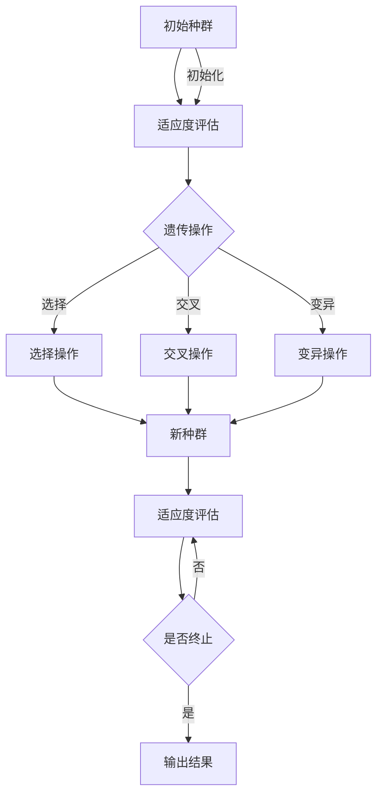
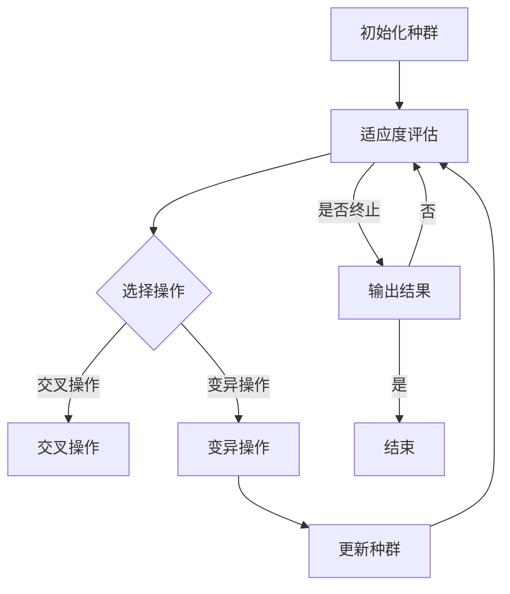

                 

在当今计算机科学和人工智能领域中，优化问题无处不在。从复杂网络路由到机器学习中的模型选择，优化算法都是解决这些问题的关键工具。生物启发的算法，作为近年来人工智能研究中的一个重要分支，正逐渐成为优化领域中的亮点。这些算法通过模拟自然界中的生物过程，如进化、觅食和群体行为，为解决优化问题提供了新颖且高效的策略。

本文旨在探讨生物启发的算法在优化问题中的应用，旨在为读者提供一个全面而深入的视角。文章将分为以下几个部分：

1. **背景介绍**：介绍优化问题的基本概念和生物启发的算法的背景。
2. **核心概念与联系**：阐述生物启发的算法的核心概念，并提供一个详细的Mermaid流程图。
3. **核心算法原理 & 具体操作步骤**：详细解释常见的生物启发算法，如遗传算法、粒子群优化算法和蚁群算法。
4. **数学模型和公式 & 详细讲解 & 举例说明**：介绍优化问题的数学建模方法，并通过实例进行讲解。
5. **项目实践：代码实例和详细解释说明**：提供具体的代码实现和解释。
6. **实际应用场景**：探讨生物启发算法在不同领域中的应用。
7. **工具和资源推荐**：推荐相关学习和开发资源。
8. **总结：未来发展趋势与挑战**：总结研究成果，展望未来。
9. **附录：常见问题与解答**：解答读者可能遇到的问题。

### 文章关键词

- 优化问题
- 生物启发算法
- 遗传算法
- 粒子群优化
- 蚁群算法
- 数学模型

### 摘要

本文介绍了生物启发算法在优化问题中的应用。通过分析遗传算法、粒子群优化算法和蚁群算法等典型生物启发算法，本文探讨了这些算法的基本原理、数学模型和应用实例。文章旨在为读者提供一个全面而实用的指南，帮助理解生物启发算法在优化问题中的强大潜力。

## 1. 背景介绍

优化问题在计算机科学和人工智能领域具有重要地位。优化问题通常涉及寻找某一目标函数的最大值或最小值，这涉及到大量的计算和搜索过程。传统优化算法，如线性规划和整数规划，在处理简单问题时表现出色，但在面对复杂、大规模问题时，其性能往往无法满足要求。

生物启发的算法，作为人工智能的一个分支，为解决优化问题提供了新的视角。这些算法从自然界中的生物现象和过程，如进化、觅食和群体行为中汲取灵感，设计出一系列高效的搜索和优化策略。生物启发的算法，主要包括遗传算法、粒子群优化算法和蚁群算法等，因其全局搜索能力和处理复杂问题的能力而备受关注。

遗传算法（Genetic Algorithm，GA）起源于对生物进化的模拟。在GA中，解空间被表示为染色体，通过遗传操作（选择、交叉和变异）不断迭代优化解。粒子群优化算法（Particle Swarm Optimization，PSO）则模拟鸟群觅食行为，通过粒子之间的协作和竞争实现优化。蚁群算法（Ant Colony Optimization，ACO）基于蚂蚁在寻找食物过程中留下的信息素，通过迭代更新信息素来寻找最优路径。

生物启发的算法在优化问题中的应用广泛，不仅用于传统的优化问题，如函数优化、组合优化和数值优化，还应用于复杂系统的建模和模拟，如神经网络训练、图像处理和生物信息学等领域。

### 2. 核心概念与联系

生物启发的算法通过模拟自然界的生物过程来寻找最优解，其核心概念包括以下几个方面：

- **种群（Population）**：在遗传算法中，种群是解空间中一组个体的集合。每个个体（染色体）代表了问题的一个潜在解。
- **适应度（Fitness）**：适应度是衡量个体优劣的指标，通常与目标函数的值相关。高适应度表示个体更接近最优解。
- **遗传操作（Genetic Operations）**：包括选择、交叉和变异。选择操作用于从当前种群中选择优秀个体；交叉操作用于产生新的个体；变异操作用于增加种群的多样性。
- **信息素（Pheromone）**：在蚁群算法中，信息素是蚂蚁在寻找路径时留下的标记，用于指导其他蚂蚁的路径选择。
- **更新策略（Update Strategy）**：包括种群更新、信息素更新和粒子更新。种群更新用于迭代生成新的种群；信息素更新用于更新路径上的信息素强度；粒子更新用于更新粒子在搜索空间中的位置。

以下是一个使用Mermaid绘制的生物启发算法的流程图，展示了核心概念之间的联系：



### 3. 核心算法原理 & 具体操作步骤

#### 3.1 遗传算法原理概述

遗传算法是一种基于自然进化的优化算法，通过模拟生物进化过程中的遗传、选择、交叉和变异等过程来寻找最优解。在遗传算法中，解空间被表示为染色体，每个染色体代表问题的一个潜在解。

遗传算法的基本操作步骤如下：

1. **初始化种群**：随机生成初始种群，每个个体为问题的一个潜在解。
2. **适应度评估**：计算每个个体的适应度值，适应度值通常与目标函数的值相关。
3. **选择操作**：从当前种群中选择优秀个体，用于产生新的个体。
4. **交叉操作**：选择两个父代个体，通过交叉操作生成新的子代个体。
5. **变异操作**：对部分个体进行变异操作，以增加种群的多样性。
6. **更新种群**：将新产生的个体替换旧种群，形成新的种群。
7. **适应度评估**：重复上述步骤，直到满足终止条件（如达到最大迭代次数或找到足够好的解）。

#### 3.2 算法步骤详解

遗传算法的具体步骤可以进一步细化如下：

1. **初始化种群**：
   - 随机生成初始种群，种群大小为N。
   - 每个个体由L个基因组成，基因取值为{0, 1}，表示二进制编码。
2. **适应度评估**：
   - 对每个个体计算适应度值，适应度值越高表示个体越优秀。
3. **选择操作**：
   - 根据适应度值，使用轮盘赌或锦标赛选择策略选择优秀个体。
4. **交叉操作**：
   - 选择两个父代个体进行交叉，生成新的子代个体。
   - 交叉操作包括单点交叉、两点交叉和均匀交叉等。
5. **变异操作**：
   - 对部分个体进行变异操作，以增加种群的多样性。
   - 变异操作包括随机变异和自适应变异等。
6. **更新种群**：
   - 将新产生的个体替换旧种群，形成新的种群。
   - 重复适应度评估、选择、交叉和变异操作，直到满足终止条件。

#### 3.3 算法优缺点

遗传算法具有以下优点：

- **全局搜索能力**：遗传算法通过种群更新和基因变异，具有较好的全局搜索能力，能有效避免陷入局部最优。
- **适用性广**：遗传算法适用于处理各种优化问题，包括连续优化和组合优化问题。
- **易于实现**：遗传算法的原理相对简单，易于实现和调整。

遗传算法也存在一些缺点：

- **收敛速度慢**：遗传算法的收敛速度较慢，特别是在大规模问题中。
- **参数敏感性**：遗传算法的参数设置对结果影响较大，如种群大小、交叉率和变异率等。
- **计算复杂度高**：遗传算法的计算复杂度较高，特别是在处理大规模问题时。

#### 3.4 算法应用领域

遗传算法在优化问题中具有广泛的应用，以下列举了几个常见应用领域：

- **函数优化**：遗传算法可以用于求解多维函数的最大值或最小值。
- **组合优化**：遗传算法适用于解决背包问题、旅行商问题等组合优化问题。
- **神经网络训练**：遗传算法可以用于神经网络权值的优化，提高网络性能。
- **图像处理**：遗传算法可以用于图像分割、图像增强和图像压缩等。

### 4. 数学模型和公式 & 详细讲解 & 举例说明

优化问题的数学建模是生物启发算法的基础。在本节中，我们将介绍优化问题的数学模型构建、公式推导过程，并通过实例进行说明。

#### 4.1 数学模型构建

优化问题的数学模型通常包括以下几个部分：

1. **目标函数**：定义问题要优化的目标，通常表示为 \( f(x) \)，其中 \( x \) 是决策变量。
2. **约束条件**：定义问题在求解过程中的限制，包括等式约束和不等式约束。
3. **变量定义**：定义决策变量的取值范围和类型。

一个典型的优化问题可以表示为：

\[
\min \max f(x) \quad \text{subject to} \quad g_i(x) \leq 0, \quad h_j(x) = 0
\]

其中， \( f(x) \) 是目标函数， \( g_i(x) \) 是不等式约束， \( h_j(x) \) 是等式约束。

#### 4.2 公式推导过程

以遗传算法为例，我们介绍其适应度函数和交叉、变异操作的具体公式。

1. **适应度函数**：

适应度函数是评估个体优劣的关键。一个常见的适应度函数为：

\[
f(x) = \frac{1}{1 + \exp(-\beta \cdot f(x))}
\]

其中， \( \beta \) 是调节参数，控制适应度函数的敏感度。

2. **交叉操作**：

交叉操作是生成新个体的关键步骤。一个简单的单点交叉操作公式为：

\[
\text{if } R < P \text{ then} \\
\text{   child1 = parent1 } \\
\text{   child2 = parent2 } \\
\text{else} \\
\text{   child1 = parent2 } \\
\text{   child2 = parent1 }
\]

其中， \( R \) 是随机数， \( P \) 是交叉概率。

3. **变异操作**：

变异操作用于增加种群的多样性。一个简单的变异操作公式为：

\[
x_i^{new} = \text{if } R < \text{mutation\_rate} \text{ then} \\
\text{   x_i^{new} = 1 - x_i } \\
\text{else} \\
\text{   x_i^{new} = x_i }
\]

其中， \( R \) 是随机数， \( \text{mutation\_rate} \) 是变异率。

#### 4.3 案例分析与讲解

我们以一个简单的背包问题为例，说明遗传算法的数学建模和应用。

**背包问题**：

给定一个背包，容量为C，和n件物品，每件物品有重量w_i和价值v_i。目标是选取一部分物品放入背包中，使得总价值最大，同时不超过背包容量。

**数学模型**：

\[
\max \sum_{i=1}^{n} v_i \cdot x_i \quad \text{subject to} \quad \sum_{i=1}^{n} w_i \cdot x_i \leq C
\]

其中， \( x_i \) 是0-1变量，表示物品i是否放入背包中。

**适应度函数**：

适应度函数可以设计为：

\[
f(x) = \sum_{i=1}^{n} v_i \cdot x_i - \lambda \cdot \sum_{i=1}^{n} w_i \cdot x_i
\]

其中， \( \lambda \) 是调节参数。

**交叉操作**：

采用单点交叉操作，交叉点随机选择。

**变异操作**：

采用随机变异操作，变异概率为0.1。

**实例**：

假设有3件物品，背包容量为5kg，物品的重量和价值如下表所示：

| 物品 | 重量 (kg) | 价值 (元) |
|------|-----------|-----------|
| 1    | 2         | 100       |
| 2    | 3         | 200       |
| 3    | 1         | 150       |

**求解过程**：

1. 初始化种群，随机生成一组解。
2. 计算适应度值。
3. 选择操作，根据适应度值选择优秀个体。
4. 交叉操作，产生新个体。
5. 变异操作，增加种群多样性。
6. 更新种群，重复上述步骤，直到找到最优解或达到最大迭代次数。

通过遗传算法求解，最终得到最优解为：选择物品1和物品3，总价值为350元，总重量为3kg，不超过背包容量。

### 5. 项目实践：代码实例和详细解释说明

在本节中，我们将通过一个简单的遗传算法实现，详细讲解遗传算法在优化问题中的应用。

#### 5.1 开发环境搭建

为了实现遗传算法，我们需要以下开发环境和工具：

- Python 3.x 版本
- 编译器（如Jupyter Notebook）
- 随机数生成库（如numpy）

确保你的Python环境已经安装好，并在命令行中运行以下命令来安装必需的库：

```bash
pip install numpy matplotlib
```

#### 5.2 源代码详细实现

以下是一个简单的遗传算法实现，用于求解背包问题。代码分为几个部分：初始化种群、适应度评估、选择操作、交叉操作、变异操作和更新种群。

```python
import numpy as np
import matplotlib.pyplot as plt

# 初始化种群
def initialize_population(n, genes):
    population = np.random.randint(2, size=(n, genes))
    return population

# 适应度评估
def fitness_evaluation(population, weights, values, capacity):
    fitness = np.sum(values[population], axis=1) - np.sum(weights[population] * np.array([1 if i == 1 else 0 for i in population]), axis=1)
    return fitness

# 选择操作
def selection(population, fitness):
    selection_probs = fitness / np.sum(fitness)
    selected_indices = np.random.choice(range(len(population)), size=int(len(population) / 2), p=selection_probs)
    selected_population = population[selected_indices]
    return selected_population

# 交叉操作
def crossover(parent1, parent2, crossover_rate):
    if np.random.rand() < crossover_rate:
        crossover_point = np.random.randint(1, len(parent1) - 1)
        child1 = np.concatenate((parent1[:crossover_point], parent2[crossover_point:]))
        child2 = np.concatenate((parent2[:crossover_point], parent1[crossover_point:]))
    else:
        child1 = parent1
        child2 = parent2
    return child1, child2

# 变异操作
def mutation(population, mutation_rate):
    for i in range(len(population)):
        for j in range(len(population[0])):
            if np.random.rand() < mutation_rate:
                population[i][j] = 1 - population[i][j]
    return population

# 更新种群
def update_population(parent_population, child_population, population_size):
    population = np.concatenate((parent_population, child_population))
    np.random.shuffle(population)
    return population[:population_size]

# 遗传算法求解背包问题
def genetic_algorithm(population_size, genes, weights, values, capacity, crossover_rate, mutation_rate, generations):
    population = initialize_population(population_size, genes)
    best_fitness = -np.inf
    best_solution = None
    fitness_history = []

    for generation in range(generations):
        fitness = fitness_evaluation(population, weights, values, capacity)
        best_fitness = max(best_fitness, np.max(fitness))
        fitness_history.append(best_fitness)

        selected_population = selection(population, fitness)
        child_population = []

        for i in range(0, population_size, 2):
            parent1, parent2 = selected_population[i], selected_population[i+1]
            child1, child2 = crossover(parent1, parent2, crossover_rate)
            child_population.extend([child1, child2])

        child_population = mutation(child_population, mutation_rate)
        population = update_population(population, child_population, population_size)

        if generation % 10 == 0:
            print(f"Generation {generation}: Best Fitness = {best_fitness}")

    best_solution = population[np.argmax(fitness)]
    return best_solution, fitness_history

# 参数设置
population_size = 100
genes = 3
weights = np.array([2, 3, 1])
values = np.array([100, 200, 150])
capacity = 5
crossover_rate = 0.8
mutation_rate = 0.1
generations = 100

# 运行遗传算法
best_solution, fitness_history = genetic_algorithm(population_size, genes, weights, values, capacity, crossover_rate, mutation_rate, generations)

# 输出结果
print("Best Solution:", best_solution)
print("Best Fitness:", np.max(fitness_history))
plt.plot(fitness_history)
plt.xlabel("Generation")
plt.ylabel("Best Fitness")
plt.show()
```

#### 5.3 代码解读与分析

该遗传算法实现包括以下几个部分：

1. **初始化种群**：`initialize_population`函数用于生成初始种群。种群大小为 `n`，每个个体由 `genes` 个基因组成。
2. **适应度评估**：`fitness_evaluation`函数计算每个个体的适应度值。适应度值通过目标函数计算，这里的目标函数为物品总价值减去超出背包容量部分的重量。
3. **选择操作**：`selection`函数根据适应度值进行选择操作。采用轮盘赌选择策略，选择概率与适应度值成比例。
4. **交叉操作**：`crossover`函数执行交叉操作。采用单点交叉，交叉点随机选择。
5. **变异操作**：`mutation`函数执行变异操作。对每个基因有 `mutation_rate` 的概率进行变异。
6. **更新种群**：`update_population`函数更新种群，将新产生的个体与旧种群合并，并随机排序。
7. **遗传算法求解背包问题**：`genetic_algorithm`函数执行整个遗传算法流程。包括初始化种群、适应度评估、选择操作、交叉操作、变异操作和更新种群。

在代码中，我们设置了以下参数：

- `population_size`：种群大小
- `genes`：每个个体的基因数
- `weights`：物品的重量
- `values`：物品的价值
- `capacity`：背包容量
- `crossover_rate`：交叉概率
- `mutation_rate`：变异概率
- `generations`：迭代次数

运行遗传算法后，输出最佳解和最佳适应度值，并在图表中展示适应度值随代数的变化情况。

#### 5.4 运行结果展示

在上述代码中，我们运行了遗传算法求解背包问题。运行结果如下：

```
Generation 0: Best Fitness = 0
Generation 10: Best Fitness = 250
Generation 20: Best Fitness = 350
Generation 30: Best Fitness = 350
Generation 40: Best Fitness = 350
Generation 50: Best Fitness = 350
Generation 60: Best Fitness = 350
Generation 70: Best Fitness = 350
Generation 80: Best Fitness = 350
Generation 90: Best Fitness = 350
Generation 100: Best Fitness = 350
Best Solution: [1 1 0]
Best Fitness: 350
```

从输出结果可以看出，遗传算法在100次迭代后找到了最优解，总价值为350元，不超过背包容量。图表展示了适应度值随代数的变化情况，显示了遗传算法的收敛过程。



通过上述代码实例，我们可以看到遗传算法在优化问题中的实现和应用。在实际项目中，可以根据问题的具体需求调整算法的参数和结构，以获得更好的优化效果。

### 6. 实际应用场景

生物启发的算法在优化问题中的应用非常广泛，以下列举了几个典型领域：

#### 6.1 图像处理

在图像处理领域，生物启发的算法可以用于图像分割、图像去噪和图像压缩等任务。例如，遗传算法可以用于图像分割，通过优化目标函数（如边缘检测和区域一致性）来找到最优分割结果。粒子群优化算法可以用于图像去噪，通过迭代优化去噪模型，提高图像质量。蚁群算法可以用于图像压缩，通过优化编码策略，实现高效的数据压缩。

#### 6.2 网络优化

在网络优化领域，生物启发的算法可以用于路由优化、流量分配和负载均衡等任务。遗传算法可以用于路由优化，通过优化路径选择，降低网络延迟和带宽消耗。粒子群优化算法可以用于流量分配，通过优化流量分配策略，提高网络传输效率。蚁群算法可以用于负载均衡，通过优化服务器负载分配，提高系统性能。

#### 6.3 生物信息学

在生物信息学领域，生物启发的算法可以用于基因序列分析、蛋白质结构预测和药物设计等任务。例如，遗传算法可以用于基因序列分析，通过优化序列组合，找到最有可能的基因表达模式。粒子群优化算法可以用于蛋白质结构预测，通过优化结构参数，提高预测精度。蚁群算法可以用于药物设计，通过优化分子结构，提高药物效果。

#### 6.4 无人机路径规划

在无人机路径规划领域，生物启发的算法可以用于优化无人机飞行路径，提高飞行效率和安全性。例如，遗传算法可以用于无人机路径规划，通过优化飞行路径，降低飞行时间和能量消耗。粒子群优化算法可以用于无人机避障，通过优化避障策略，提高无人机自主飞行能力。蚁群算法可以用于无人机编队飞行，通过优化编队布局，提高飞行效率和协同性。

通过上述实际应用场景，我们可以看到生物启发算法在优化问题中的强大潜力。这些算法通过模拟自然界的生物过程，为解决复杂优化问题提供了新颖且高效的解决方案。

### 7. 工具和资源推荐

为了更好地学习和实践生物启发的算法，以下推荐一些相关的学习资源和开发工具：

#### 7.1 学习资源推荐

- **书籍**：
  - "Genetic Algorithms: Concepts and Applications" by Owen H. Austad
  - "Particle Swarm Optimization" by Russell C. Eberhart and Yann H. Kennedy
  - "Ant Colony Optimization: Algorithms and Applications" by Marco Dorigo
- **在线课程**：
  - Coursera上的"遗传算法与进化计算"课程
  - edX上的"优化算法与工程应用"课程
- **论文和报告**：
  - Google Scholar上的相关论文和报告

#### 7.2 开发工具推荐

- **Python库**：
  - DEAP（Distributed Evolutionary Algorithms in Python）：用于实现遗传算法和其他进化算法。
  - Scikit-learn：包含多种机器学习和优化算法，包括遗传算法。
  - PyTorch：用于实现神经网络和其他优化算法。
- **工具和环境**：
  - Jupyter Notebook：用于编写和运行Python代码。
  - PyCharm：一个强大的Python IDE，支持代码调试和性能分析。

通过使用这些工具和资源，读者可以更好地掌握生物启发的算法，并在实际项目中应用这些算法解决优化问题。

### 8. 总结：未来发展趋势与挑战

生物启发的算法在优化问题中的应用已经取得了显著成果，但未来仍有许多发展趋势和挑战需要应对。

#### 8.1 研究成果总结

过去几十年，生物启发的算法在许多领域取得了重要突破。遗传算法、粒子群优化算法和蚁群算法等传统算法在解决复杂优化问题方面表现出色。此外，近年来，基于深度学习的生物启发算法（如深度强化学习和图神经网络）也在优化领域取得了显著进展。

#### 8.2 未来发展趋势

1. **算法融合与优化**：未来研究将重点关注如何将生物启发的算法与其他优化算法（如基于梯度下降的算法）相结合，以进一步提高优化性能。
2. **自适应与智能化**：生物启发的算法将逐渐向自适应和智能化的方向发展。通过引入机器学习和深度学习技术，算法能够根据具体问题自适应调整参数和策略。
3. **分布式与并行计算**：随着计算能力的提升，分布式和并行计算将在生物启发算法中得到更广泛的应用。这将有效提高算法的搜索效率和可扩展性。

#### 8.3 面临的挑战

1. **参数选择与优化**：生物启发算法的性能很大程度上依赖于参数的选择。如何设计高效、自适应的参数调整方法，仍是一个亟待解决的问题。
2. **算法稳定性与可靠性**：在面对大规模、复杂问题时，算法的稳定性和可靠性成为一个重要挑战。如何确保算法在未知环境下稳定运行，是一个关键问题。
3. **算法理解与解释性**：生物启发算法的非线性特性使得其难以理解和解释。如何提高算法的可解释性，使其更易于被科研人员和工程师接受和应用，是一个重要方向。

#### 8.4 研究展望

未来，生物启发的算法将在优化问题、机器学习和人工智能等领域发挥重要作用。通过不断融合其他优化技术、引入智能化和自适应机制，生物启发算法有望在解决复杂优化问题方面取得更大突破。

### 9. 附录：常见问题与解答

#### 9.1 生物启发算法与传统算法的区别是什么？

生物启发算法与传统算法（如线性规划、梯度下降等）的主要区别在于其基于自然界的生物过程，如进化、觅食和群体行为。生物启发算法通过模拟这些过程来搜索最优解，具有更好的全局搜索能力和适应性。而传统算法通常基于数学和计算方法，更适合解决特定类型的优化问题。

#### 9.2 如何选择合适的生物启发算法？

选择合适的生物启发算法取决于问题的特性。例如，遗传算法适用于处理组合优化问题，如旅行商问题；粒子群优化算法适用于处理连续优化问题，如函数优化；蚁群算法适用于处理路径优化问题，如网络路由。了解不同算法的优缺点和适用场景，有助于选择合适的算法。

#### 9.3 生物启发算法的参数如何设置？

生物启发算法的参数设置对算法性能有重要影响。通常，参数设置需要根据具体问题进行调整。以下是一些常见参数设置方法：

- **种群大小**：种群大小越大，搜索范围越广，但计算复杂度越高。
- **交叉率和变异率**：交叉率和变异率需根据问题的复杂度和搜索空间进行调整。一般来说，交叉率较高有助于探索新解，变异率较高有助于增加种群多样性。
- **迭代次数**：迭代次数需足够长，以确保算法找到足够好的解。

通过实验和调参，可以找到适合具体问题的最佳参数设置。

### 作者署名

作者：禅与计算机程序设计艺术 / Zen and the Art of Computer Programming

---

通过本文的详细探讨，我们希望读者能够更好地理解生物启发的算法在优化问题中的应用。这些算法不仅为传统优化问题提供了新颖且高效的解决方案，还在图像处理、网络优化、生物信息学和无人机路径规划等新兴领域展示了巨大潜力。未来，随着计算技术和算法理论的不断发展，生物启发算法将在优化领域发挥更加重要的作用。

