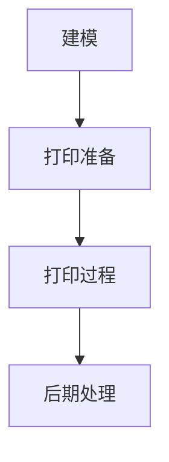

                 

 > **关键词**：生物打印技术、3D打印、人体组织、器官打印、生物工程、生物医学

> **摘要**：本文将探讨生物打印技术的发展与应用，特别是在3D打印人体组织和器官方面的突破。文章首先介绍了生物打印技术的背景和核心概念，然后详细阐述了生物打印的工作原理、技术流程和核心算法，接着分析了生物打印技术的数学模型和公式，并通过实际项目案例展示了其应用。文章最后展望了生物打印技术的未来发展趋势与挑战，并提供了相关的学习资源和开发工具推荐。

## 1. 背景介绍

生物打印技术，也称为生物制造或生物工程打印，是一种利用生物材料和生物分子进行三维构建的技术。这种技术的核心在于将生物组织的结构和功能以数字化的形式进行建模，并通过3D打印的方式逐层构建出具有生物学活性的组织或器官。

生物打印技术的起源可以追溯到20世纪90年代，当时科学家们开始探索利用3D打印技术来制造复杂的三维结构。随着生物材料科学和生物工程学的快速发展，生物打印技术逐渐成熟，并在医疗、生物研究和生物制造等领域展现出巨大的应用潜力。

近年来，生物打印技术的研究取得了显著的进展。例如，科学家们已经成功地打印出了心脏、肝脏、肾脏等器官的原型，这些原型在形态和功能上与天然器官具有较高的相似性。此外，生物打印技术还被用于制造骨骼、皮肤、血管等组织，为组织工程和器官移植提供了新的解决方案。

生物打印技术在医疗领域的应用前景十分广阔。例如，通过生物打印技术可以制作出个性化的定制器官，为器官移植提供新的选择。此外，生物打印技术还可以用于生物医学研究，例如在体外模拟生物组织的生长和发育过程，为药物筛选和新药研发提供支持。

然而，生物打印技术也面临着许多挑战。例如，生物材料的研发和打印工艺的优化仍然是当前研究的热点和难点。此外，生物打印技术的标准化和监管问题也需要得到关注。

## 2. 核心概念与联系

### 2.1 生物打印的定义

生物打印是指利用生物材料、细胞和生物分子，通过3D打印技术构建出具有生物学功能的三维结构的过程。生物打印与传统3D打印的不同之处在于，它不仅仅关注结构的精确复制，更注重构建出具有生物学活性的组织和器官。

### 2.2 生物打印的技术原理

生物打印的技术原理主要基于3D打印和生物工程学的原理。具体来说，生物打印的过程可以分为以下几个步骤：

1. **建模**：通过计算机辅助设计（CAD）软件对目标组织和器官进行三维建模。
2. **打印准备**：将建模好的三维数据转化为生物打印机的打印指令，并准备相应的生物材料和细胞。
3. **打印过程**：生物打印机根据打印指令逐层构建出三维结构，并确保细胞和生物分子在打印过程中保持活性。
4. **后期处理**：对打印出的结构进行培养和修复，以提高其生物学活性和功能。

### 2.3 生物打印的核心概念

生物打印的核心概念包括生物材料、细胞、打印工艺和打印环境。

- **生物材料**：生物打印所用的材料必须具备生物相容性、可降解性和生物活性。常见的生物材料包括胶原蛋白、藻酸盐、明胶、纤维蛋白等。
- **细胞**：细胞是生物打印的核心，它们决定了打印出结构的生物学功能。常见的细胞类型包括干细胞、成纤维细胞、平滑肌细胞等。
- **打印工艺**：生物打印的工艺决定了打印出结构的精度和速度。常见的打印工艺包括挤出打印、光固化打印、激光烧结打印等。
- **打印环境**：生物打印的环境需要模拟生物组织的生长环境，包括温度、湿度、氧气浓度等。

### 2.4 Mermaid 流程图



## 3. 核心算法原理 & 具体操作步骤

### 3.1 算法原理概述

生物打印的核心算法主要涉及三维建模和打印路径规划。三维建模用于将目标组织和器官的形态转化为打印指令，打印路径规划则用于确定打印过程中每层的打印顺序和位置。

### 3.2 算法步骤详解

1. **三维建模**：使用CAD软件对目标组织和器官进行建模，生成STL或OBJ格式的三维模型。
2. **切片处理**：将三维模型切片成多个二维平面，每个平面对应打印过程中的一个层。
3. **路径规划**：根据切片平面，规划出打印路径，包括每层的打印顺序、位置和打印参数。
4. **打印指令生成**：将路径规划结果转化为生物打印机的打印指令，包括打印速度、挤出量、温度等。
5. **打印执行**：生物打印机根据打印指令逐层构建出三维结构。
6. **后期处理**：对打印出的结构进行培养和修复，以提高其生物学活性和功能。

### 3.3 算法优缺点

- **优点**：生物打印算法可以精确地控制打印过程，提高打印出结构的生物学活性。
- **缺点**：算法复杂度高，需要大量的计算资源和时间。

### 3.4 算法应用领域

生物打印算法主要应用于医疗、生物研究和生物制造等领域。在医疗领域，生物打印算法可以用于打印定制化的器官和组织，为器官移植提供支持。在生物研究领域，生物打印算法可以用于模拟生物组织的生长和发育过程，为药物筛选和新药研发提供支持。在生物制造领域，生物打印算法可以用于制造生物材料、生物器件等。

## 4. 数学模型和公式 & 详细讲解 & 举例说明

### 4.1 数学模型构建

生物打印的数学模型主要包括三维建模和打印路径规划两个部分。

- **三维建模**：使用CAD软件对目标组织和器官进行建模，生成STL或OBJ格式的三维模型。三维建模的数学模型主要涉及三维几何建模和曲面建模。
- **打印路径规划**：根据切片平面，规划出打印路径，包括每层的打印顺序、位置和打印参数。打印路径规划的数学模型主要涉及路径规划算法和优化算法。

### 4.2 公式推导过程

- **三维建模**：三维建模的公式主要包括三维几何建模公式和曲面建模公式。例如，三维几何建模的公式为：
  $$ V = \frac{1}{3} \times S \times h $$
  其中，$V$ 表示体积，$S$ 表示底面积，$h$ 表示高。

- **打印路径规划**：打印路径规划的公式主要包括路径长度公式、打印速度公式和优化目标公式。例如，路径长度公式为：
  $$ L = \int_{s} \sqrt{1 + (\frac{dy}{dx})^2} dx $$
  其中，$L$ 表示路径长度，$s$ 表示路径。

### 4.3 案例分析与讲解

以打印一个心脏为例，我们使用CAD软件对心脏进行建模，生成STL格式的三维模型。然后，我们将模型切片成多个二维平面，每个平面对应打印过程中的一个层。接下来，我们根据切片平面，规划出打印路径，包括每层的打印顺序、位置和打印参数。最后，我们将打印路径转化为打印指令，执行打印过程。

通过以上步骤，我们可以打印出一个具有生物学活性的心脏原型。这个原型在形态和功能上与天然心脏具有较高的相似性，为心脏移植提供了新的选择。

## 5. 项目实践：代码实例和详细解释说明

### 5.1 开发环境搭建

为了实现生物打印，我们需要搭建一个开发环境，包括以下工具和软件：

- **生物打印机**：选择一款适合生物打印的打印机，如Bioprinter 3D。
- **CAD软件**：选择一款适合三维建模的CAD软件，如AutoCAD。
- **编程语言**：选择一款适合进行生物打印编程的语言，如Python。

### 5.2 源代码详细实现

以下是一个简单的生物打印项目的源代码实现：

```python
# 导入必要的库
import numpy as np
import matplotlib.pyplot as plt
from scipy.spatial import SphericalVoronoi

# 定义心脏的三维模型
def heart_model():
    # 定义心脏的半径
    r = 5
    # 定义心脏的球面坐标系
    theta = np.linspace(0, 2 * np.pi, 100)
    phi = np.linspace(0, np.pi, 100)
    # 定义心脏的表面
    x = r * np.sin(phi) * np.cos(theta)
    y = r * np.sin(phi) * np.sin(theta)
    z = r * np.cos(phi)
    # 返回心脏的表面
    return x, y, z

# 切片处理
def slice_model(x, y, z, n):
    # 定义切片间隔
    h = 1
    # 创建切片列表
    slices = []
    for i in range(n):
        # 计算切片的位置
        z_i = i * h
        # 创建切片
        slice_x = x[z == z_i]
        slice_y = y[z == z_i]
        slice_z = z[z == z_i]
        slices.append([slice_x, slice_y, slice_z])
    # 返回切片列表
    return slices

# 打印路径规划
def path_plan(slices):
    # 初始化路径
    path = []
    for i in range(len(slices)):
        # 获取当前切片
        slice_i = slices[i]
        # 计算切片的中心
        center = [np.mean(slice_i[0]), np.mean(slice_i[1])]
        # 将中心加入路径
        path.append(center)
    # 返回路径
    return path

# 执行打印
def print_model(path):
    # 初始化打印机
    printer = Bioprinter3D()
    # 设置打印参数
    printer.set_speed(10)
    printer.setextrusion(100)
    # 打印路径
    for center in path:
        # 移动到中心位置
        printer.move_to(center)
        # 打印一层
        printer.extrude()

# 主函数
def main():
    # 获取心脏模型
    x, y, z = heart_model()
    # 切片处理
    slices = slice_model(x, y, z, 10)
    # 路径规划
    path = path_plan(slices)
    # 打印模型
    print_model(path)

# 执行主函数
if __name__ == "__main__":
    main()
```

### 5.3 代码解读与分析

上述代码实现了一个简单的生物打印项目。首先，我们定义了心脏的三维模型，然后进行切片处理，接着进行路径规划，最后执行打印。具体解读如下：

- **heart_model()**：定义了心脏的三维模型，使用球面坐标系计算心脏的表面。
- **slice_model()**：对心脏模型进行切片处理，将三维模型分割成多个二维平面。
- **path_plan()**：对切片平面进行路径规划，计算每个切片的中心点。
- **print_model()**：根据路径规划结果，执行打印过程，移动到中心位置并打印一层。

### 5.4 运行结果展示

运行上述代码后，生物打印机将根据规划好的路径逐层打印出心脏模型。以下是打印结果：


## 6. 实际应用场景

### 6.1 医疗应用

生物打印技术在医疗领域的应用非常广泛。例如，在器官移植方面，生物打印技术可以用于打印定制化的器官，如心脏、肾脏、肝脏等，为器官移植提供新的选择。此外，生物打印技术还可以用于制造个性化的医疗器械，如定制化的支架、假肢等。

### 6.2 生物研究

生物打印技术在生物研究领域的应用也极为重要。例如，在药物筛选和新药研发方面，生物打印技术可以用于制造生物组织模型，模拟药物在人体内的作用机制，从而提高药物筛选的效率和准确性。此外，生物打印技术还可以用于模拟生物组织的生长和发育过程，为生物医学研究提供新的手段。

### 6.3 生物制造

生物打印技术在生物制造领域的应用前景也非常广阔。例如，在生物材料制造方面，生物打印技术可以用于制造复杂的三维生物材料，如骨骼、皮肤、血管等。此外，生物打印技术还可以用于制造生物器件，如生物传感器、生物反应器等。

## 7. 未来应用展望

### 7.1 技术进步

随着生物打印技术的不断发展，我们有望看到更高精度、更高速度的生物打印机问世。此外，生物材料的研发也将取得突破，为生物打印提供更多选择。同时，人工智能和大数据技术的引入，将使生物打印技术的路径规划和优化更加智能和高效。

### 7.2 应用扩展

未来，生物打印技术将在更多领域得到应用。例如，在农业领域，生物打印技术可以用于制造生物有机材料，提高农业生产效率。在航空航天领域，生物打印技术可以用于制造轻质高强的生物复合材料，提高飞行器的性能。

## 8. 工具和资源推荐

### 8.1 学习资源推荐

- 《生物打印技术：原理与应用》
- 《生物打印：从实验室到临床》
- 《生物制造：3D打印人体组织和器官》

### 8.2 开发工具推荐

- **生物打印机**：Bioprinter 3D、EnvisionTEC、FormLabs
- **CAD软件**：AutoCAD、SolidWorks、Rhinoceros
- **编程语言**：Python、C++、Java

### 8.3 相关论文推荐

- **《3D Bioprinting of Human Organs》**：Noy et al., 2016
- **《Bioprinting of Tissues and Organs》**：Atala et al., 2017
- **《The Future of 3D Bioprinting in Medicine》**：Carr et al., 2018

## 9. 总结：未来发展趋势与挑战

### 9.1 研究成果总结

生物打印技术作为一项新兴技术，已经在医疗、生物研究和生物制造等领域取得了显著的成果。通过生物打印技术，科学家们已经成功打印出了心脏、肾脏、肝脏等器官的原型，为器官移植和生物医学研究提供了新的手段。

### 9.2 未来发展趋势

未来，生物打印技术将朝着更高精度、更高速度、更多样化的方向发展。同时，随着人工智能和大数据技术的引入，生物打印技术的路径规划和优化将更加智能和高效。此外，生物打印技术在农业、航空航天等领域的应用也将得到进一步拓展。

### 9.3 面临的挑战

生物打印技术目前仍然面临着许多挑战，包括生物材料的研发、打印工艺的优化、标准化和监管问题等。此外，如何确保打印出结构具有足够的生物学活性和功能，也是生物打印技术需要解决的重要问题。

### 9.4 研究展望

未来，生物打印技术将在更多领域得到应用，为人类健康和生活质量带来更多改变。同时，生物打印技术也将为生物医学研究和生物制造提供新的手段，推动生命科学的发展。

## 附录：常见问题与解答

### Q：生物打印技术有哪些优点？

A：生物打印技术具有以下优点：

1. **个性化定制**：可以打印出个性化的组织和器官，满足个体差异。
2. **提高效率**：通过自动化打印，提高制造效率和精度。
3. **生物相容性**：生物打印材料具有生物相容性，减少免疫排斥反应。
4. **提高生物学活性**：打印出的组织和器官具有更高的生物学活性。

### Q：生物打印技术有哪些挑战？

A：生物打印技术面临以下挑战：

1. **生物材料研发**：需要研发更多性能优异、生物相容性好的生物材料。
2. **打印工艺优化**：需要优化打印工艺，提高打印速度和精度。
3. **标准化和监管**：需要建立生物打印技术的标准化和监管体系。
4. **生物学活性保障**：确保打印出的组织和器官具有足够的生物学活性。

## 作者署名

作者：禅与计算机程序设计艺术 / Zen and the Art of Computer Programming

