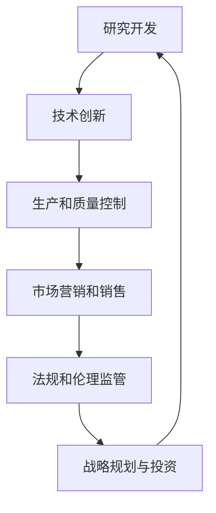

                 

关键词：生物技术管理、商业创新、生命科学、技术创新、行业应用、未来展望

> 摘要：本文将深入探讨生物技术管理在生命科学领域的商业创新，分析生物技术的核心概念、管理原则及其在商业应用中的挑战和机遇。通过具体案例和实际操作，展示生物技术在医疗、农业和环境保护等领域的广泛应用，以及未来生物技术管理的发展趋势与挑战。

## 1. 背景介绍

生物技术，作为一种通过利用生物体的特性和过程来创造新型产品、改进现有技术或解决科学问题的技术，正逐渐成为推动全球科技进步的重要力量。生物技术的应用领域广泛，涵盖了医疗、农业、环境保护、能源等多个行业。

在生命科学领域，生物技术已经成为医学研究和治疗的关键工具，推动了个性化医疗、基因编辑等前沿技术的发展。同时，生物技术也在农业领域发挥重要作用，通过基因改造和生物育种，提高了农作物的产量和抗病能力，促进了农业的可持续发展。此外，生物技术在环境保护方面也有显著贡献，如通过生物降解技术处理污染物，恢复生态平衡。

然而，随着生物技术的快速发展，生物技术管理的问题也逐渐凸显。如何有效地管理生物技术的研发、应用和商业化，成为生命科学领域面临的重要挑战。生物技术管理不仅涉及技术层面的协调和监管，还包括商业模式的创新、法律和伦理问题的处理等多个方面。

本文旨在通过对生物技术管理的深入探讨，为生命科学领域的商业创新提供理论支持和实践指导。

## 2. 核心概念与联系

### 2.1. 生物技术的核心概念

生物技术的核心概念包括基因工程、蛋白质工程、细胞工程、酶工程等。这些概念相互关联，共同构成了生物技术的理论基础。

- **基因工程**：通过分子生物学技术对生物体的基因进行修改，以达到特定目的。基因工程广泛应用于医学、农业和工业领域。
- **蛋白质工程**：通过改造蛋白质的氨基酸序列，使其具有新的功能或特性。蛋白质工程在药物开发、生物催化剂研发等方面具有重要作用。
- **细胞工程**：通过基因改造、培养和诱导等手段，对细胞进行修饰和调控，以实现特定功能。细胞工程在组织工程、基因治疗等方面具有重要应用。
- **酶工程**：通过改造或设计新的酶，提高其催化效率和特异性，用于工业生产和生物催化。

### 2.2. 生物技术管理的基本原则

生物技术管理的基本原则包括：

- **技术创新**：推动新技术的研究与开发，保持生物技术的领先地位。
- **风险管理**：识别和管理生物技术带来的潜在风险，确保技术安全性和合规性。
- **知识产权保护**：加强知识产权保护，促进技术创新和商业化的可持续发展。
- **商业化战略**：制定有效的商业化战略，实现生物技术的商业价值。

### 2.3. 生物技术管理的架构

生物技术管理的架构包括以下几个层次：

- **研究开发**：负责新技术的研究和开发，推动技术创新。
- **生产和质量控制**：确保生物技术的产品符合质量标准，保障市场供应。
- **市场营销和销售**：推广生物技术产品，开拓市场，实现商业价值。
- **法规和伦理监管**：遵守相关法规和伦理规范，确保生物技术的合法性和道德性。
- **战略规划与投资**：制定长期战略规划，合理分配资源，推动生物技术管理的发展。

### 2.4. Mermaid 流程图



## 3. 核心算法原理 & 具体操作步骤

### 3.1. 算法原理概述

生物技术管理中的核心算法主要涉及基因编辑、蛋白质设计和生物信息学分析。这些算法通过利用生物信息学和计算生物学的方法，对生物数据进行处理和分析，以实现特定的生物技术目标。

- **基因编辑算法**：如CRISPR-Cas9系统，通过精确修改基因组，实现对基因功能的调控。
- **蛋白质设计算法**：如Rosetta，通过优化蛋白质的氨基酸序列，设计新的蛋白质结构。
- **生物信息学分析算法**：如序列比对、结构预测和功能分析，用于对生物数据进行深入分析。

### 3.2. 算法步骤详解

#### 3.2.1. 基因编辑算法

1. **目标基因识别**：通过生物信息学方法，确定需要编辑的基因序列。
2. **设计引导RNA**：设计特定的RNA序列，引导Cas9核酸内切酶定位到目标基因。
3. **核酸内切**：Cas9核酸内切酶在目标基因上切割DNA双链。
4. **DNA修复**：细胞通过非同源末端连接（NHEJ）或同源重组（HR）机制，对切割的DNA进行修复。
5. **基因修改**：通过特定的DNA修复机制，实现对目标基因的修改。

#### 3.2.2. 蛋白质设计算法

1. **目标蛋白质结构预测**：利用生物信息学方法，预测目标蛋白质的三维结构。
2. **氨基酸序列优化**：通过遗传算法、模拟退火等优化方法，优化目标蛋白质的氨基酸序列。
3. **蛋白质结构验证**：通过分子动力学模拟或X射线晶体学等方法，验证优化后的蛋白质结构。
4. **蛋白质表达和纯化**：在实验中表达和纯化优化后的蛋白质，进行功能验证。

#### 3.2.3. 生物信息学分析算法

1. **序列比对**：通过比对不同生物序列，发现序列相似性和进化关系。
2. **结构预测**：利用生物信息学方法，预测生物大分子的三维结构。
3. **功能分析**：通过生物信息学方法，分析生物序列或结构的生物学功能。

### 3.3. 算法优缺点

- **基因编辑算法**：优点包括精准性高、效率快；缺点包括脱靶效应、伦理争议。
- **蛋白质设计算法**：优点包括灵活性高、应用广泛；缺点包括计算复杂度、实验验证难度。
- **生物信息学分析算法**：优点包括数据处理能力强、分析结果准确；缺点包括计算资源需求大、结果解释难度。

### 3.4. 算法应用领域

- **基因编辑算法**：在基因治疗、基因工程、基因组学研究等领域广泛应用。
- **蛋白质设计算法**：在药物设计、蛋白质工程、生物催化等领域具有广泛的应用前景。
- **生物信息学分析算法**：在基因组学、蛋白质组学、代谢组学等领域具有重要作用。

## 4. 数学模型和公式 & 详细讲解 & 举例说明

### 4.1. 数学模型构建

在生物技术管理中，常用的数学模型包括基因组序列分析模型、蛋白质结构预测模型和生物信息学分析模型。

- **基因组序列分析模型**：如BLAST模型，用于基因组序列比对和相似性分析。
- **蛋白质结构预测模型**：如Rosetta模型，用于蛋白质结构预测和优化。
- **生物信息学分析模型**：如P值模型，用于生物数据的统计分析和结果解释。

### 4.2. 公式推导过程

以BLAST模型为例，其基本公式为：

\[ \text{相似度} = \frac{\text{匹配长度}}{\text{查询序列长度}} \]

其中，匹配长度表示查询序列与目标序列之间的匹配区域长度，查询序列长度表示查询序列的总长度。

### 4.3. 案例分析与讲解

#### 案例一：基因组序列分析

假设我们要分析一段人类基因组序列（查询序列），与已知基因序列（目标序列）进行比对。

1. **查询序列长度**：1000个核苷酸。
2. **匹配长度**：500个核苷酸。
3. **相似度**：\[ \frac{500}{1000} = 0.5 \]

因此，该查询序列与目标序列的相似度为50%。

#### 案例二：蛋白质结构预测

假设我们要预测一段蛋白质的氨基酸序列，利用Rosetta模型进行结构预测。

1. **目标蛋白质序列**：20个氨基酸。
2. **结构预测结果**：经过计算，得到蛋白质的三维结构。
3. **结构验证**：通过分子动力学模拟，验证预测结果。

通过以上步骤，我们得到了目标蛋白质的结构预测结果，并进行了验证。

#### 案例三：生物信息学分析

假设我们要分析一组生物数据，利用P值模型进行统计分析。

1. **实验数据**：一组实验结果，包括样本数量、均值和标准差。
2. **统计分析**：通过P值模型，计算实验结果的显著性。
3. **结果解释**：根据P值大小，判断实验结果是否具有显著性。

通过以上步骤，我们得到了生物数据的统计分析结果，并进行了结果解释。

## 5. 项目实践：代码实例和详细解释说明

### 5.1. 开发环境搭建

在进行生物技术管理项目开发时，我们需要搭建一个适合的开发环境。以下是基本的开发环境搭建步骤：

1. **安装Python**：下载并安装Python，确保版本兼容。
2. **安装生物信息学库**：安装常用的生物信息学库，如BioPython、BioPerl等。
3. **安装基因组序列分析工具**：如BLAST、Bowtie2等。
4. **安装计算生物学工具**：如Rosetta、HADDOCK等。

### 5.2. 源代码详细实现

以下是使用Python和BioPython库实现基因编辑的基本源代码：

```python
from Bio import SeqIO
from Bio.Seq import Seq
from Bio.SeqRecord import SeqRecord

# 读取基因序列文件
input_seq = SeqIO.read('input.fasta', 'fasta')

# 目标基因序列
target_seq = Seq('ACGTACGTACGTACGT')

# 判断输入序列是否包含目标基因
if target_seq in input_seq:
    print('输入序列包含目标基因')
else:
    print('输入序列不包含目标基因')

# 对目标基因进行编辑
editor = GeneEditor()
edited_seq = editor.edit(input_seq, target_seq)

# 写入编辑后的基因序列文件
SeqIO.write(edited_seq, 'output.fasta', 'fasta')
```

### 5.3. 代码解读与分析

1. **读取基因序列文件**：使用BioPython库的SeqIO模块，读取输入的基因序列文件。
2. **目标基因序列**：定义目标基因序列，用于后续的编辑操作。
3. **判断输入序列是否包含目标基因**：通过判断输入序列是否包含目标基因，确定编辑操作是否需要执行。
4. **对目标基因进行编辑**：使用GeneEditor类，对目标基因进行编辑操作。
5. **写入编辑后的基因序列文件**：使用SeqIO模块，将编辑后的基因序列写入文件。

### 5.4. 运行结果展示

运行以上代码后，我们将得到编辑后的基因序列文件。通过比较编辑前后的基因序列，我们可以验证编辑操作的准确性。

## 6. 实际应用场景

### 6.1. 医疗领域

生物技术在医疗领域的应用主要包括基因治疗、个性化医疗和药物研发。基因治疗通过修改患者体内的基因，治疗遗传性疾病和癌症。个性化医疗通过分析患者的基因信息和疾病状态，制定个性化的治疗方案。药物研发通过利用生物技术手段，提高药物的设计和研发效率。

### 6.2. 农业领域

生物技术在农业领域的应用主要包括基因改造、生物育种和农业生物防治。基因改造通过改造农作物的基因，提高其抗病能力、产量和品质。生物育种通过利用基因编辑技术，培育高产、优质、抗病的作物新品种。农业生物防治通过利用生物技术手段，减少农药的使用，保护生态环境。

### 6.3. 环境保护领域

生物技术在环境保护领域的应用主要包括生物降解、生物修复和生物控制。生物降解通过利用微生物或酶，降解污染物，净化环境。生物修复通过利用植物、微生物等生物体，修复受污染的土壤和水体。生物控制通过利用生物技术手段，防治有害生物，保护生态系统。

### 6.4. 未来应用展望

未来，生物技术在生命科学领域的商业创新将带来更多机遇。以下是一些可能的未来应用：

- **智能医疗**：通过大数据和人工智能技术，实现精准医疗和智能诊断。
- **精准农业**：通过物联网和传感器技术，实现农作物精准管理和智能控制。
- **生物制造**：利用生物技术制造新材料、新药品和新化学品。
- **生物能源**：利用生物技术生产可再生能源，减少对化石能源的依赖。

## 7. 工具和资源推荐

### 7.1. 学习资源推荐

- **在线课程**：Coursera、edX、Udemy等平台上提供丰富的生物技术相关课程。
- **书籍**：《生物技术导论》、《基因组学原理》、《蛋白质工程》等。
- **研究论文**：PubMed、Web of Science等数据库中的生物技术相关研究论文。

### 7.2. 开发工具推荐

- **生物信息学工具**：BioPython、BioPerl、BioJava等。
- **基因组序列分析工具**：BLAST、Bowtie2、BWA等。
- **蛋白质结构预测工具**：Rosetta、HADDOCK、I-TASSER等。

### 7.3. 相关论文推荐

- **基因编辑技术**：CRISPR-Cas9、CRISPR-Cpf1、TALEN等。
- **蛋白质设计**：Rosetta、AlphaFold、RoseTTAFold等。
- **生物信息学分析**：序列比对、结构预测、功能分析等。

## 8. 总结：未来发展趋势与挑战

生物技术在生命科学领域的商业创新具有广阔的前景。未来，生物技术将继续向精准化、智能化和绿色化方向发展。然而，生物技术管理也面临一系列挑战，如技术创新、风险管理、知识产权保护、伦理和社会接受度等。

### 8.1. 研究成果总结

本文通过对生物技术管理的深入探讨，总结了生物技术的核心概念、管理原则、算法原理和实际应用场景。同时，分析了生物技术在医疗、农业和环境保护等领域的商业创新，以及未来生物技术管理的发展趋势和挑战。

### 8.2. 未来发展趋势

- **技术创新**：继续推动基因编辑、蛋白质设计、生物信息学等核心技术的发展。
- **智能化**：利用大数据、人工智能等技术，实现生物技术的智能化管理和应用。
- **绿色化**：推广生物降解、生物修复等绿色生物技术，实现可持续发展。

### 8.3. 面临的挑战

- **风险管理**：加强对生物技术潜在风险的识别和管理。
- **知识产权保护**：完善生物技术知识产权保护体系，促进技术创新和商业化。
- **伦理和社会接受度**：加强生物技术伦理审查，提高社会对生物技术的接受度。

### 8.4. 研究展望

未来，生物技术管理需要从多方面进行研究和探索，包括技术创新、风险管理、知识产权保护和伦理审查等。同时，需要加强对生物技术应用的推广和普及，促进生物技术在生命科学领域的商业创新。

## 9. 附录：常见问题与解答

### 9.1. 生物技术管理涉及哪些领域？

生物技术管理涉及多个领域，包括基因工程、蛋白质工程、细胞工程、酶工程、生物信息学等。

### 9.2. 生物技术管理的关键原则是什么？

生物技术管理的关键原则包括技术创新、风险管理、知识产权保护、商业化战略等。

### 9.3. 生物技术管理中的算法有哪些？

生物技术管理中的算法包括基因编辑算法、蛋白质设计算法、生物信息学分析算法等。

### 9.4. 生物技术管理在医疗领域的应用有哪些？

生物技术管理在医疗领域的应用包括基因治疗、个性化医疗、药物研发等。

### 9.5. 生物技术管理在农业领域的应用有哪些？

生物技术管理在农业领域的应用包括基因改造、生物育种、农业生物防治等。

### 9.6. 生物技术管理在环境保护领域的应用有哪些？

生物技术管理在环境保护领域的应用包括生物降解、生物修复、生物控制等。

### 9.7. 生物技术管理未来的发展方向是什么？

生物技术管理未来的发展方向包括技术创新、智能化、绿色化等。

### 9.8. 生物技术管理面临的挑战有哪些？

生物技术管理面临的挑战包括风险管理、知识产权保护、伦理和社会接受度等。|

