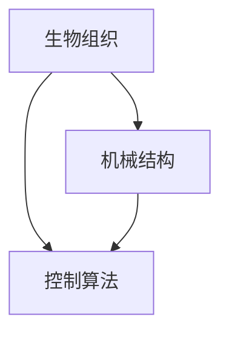

                 

 在当今科技飞速发展的时代，跨学科研究已成为推动科技进步的关键力量。生物混合机器人，这一新兴领域，正是将生物学和机械工程学有机结合的产物。本文将深入探讨生物混合机器人的背景、核心概念、算法原理、数学模型、项目实践以及未来应用场景，以期为您揭示这一前沿领域的无限魅力。

## 关键词

- 生物混合机器人
- 生物组织
- 机械结构
- 跨学科研究
- 算法
- 数学模型
- 项目实践

## 摘要

本文旨在介绍生物混合机器人这一前沿研究领域，从背景、核心概念、算法原理、数学模型、项目实践和未来应用场景等方面进行全方位探讨。通过本文，读者可以了解生物混合机器人如何结合生物组织和机械结构，实现高效、智能的功能，以及这一技术在医疗、农业和工业等领域的潜在应用。

## 1. 背景介绍

生物混合机器人，顾名思义，是将生物组织与机械结构相结合的机器人。这种跨学科的研究旨在克服传统机器人在复杂生物环境中的局限性，实现更高效、更灵活的机器人应用。生物混合机器人具有以下背景：

### 1.1 研究背景

随着生物技术、材料科学和机器人技术的快速发展，生物混合机器人这一概念逐渐受到关注。生物组织与机械结构的有机结合，不仅可以在医疗、农业和工业等领域发挥重要作用，还可以为人类带来更加智能化的生活体验。

### 1.2 技术背景

生物混合机器人涉及多个学科，包括生物学、机械工程、材料科学和计算机科学等。这些学科的发展为生物混合机器人的实现提供了坚实的理论基础和技术支持。

### 1.3 应用背景

生物混合机器人在医疗领域有广泛的应用前景，如手术机器人、康复机器人等。在农业领域，生物混合机器人可以用于精准农业、植物生长监测等。在工业领域，生物混合机器人可以应用于智能制造、自动化生产等。

## 2. 核心概念与联系

生物混合机器人的核心概念主要包括生物组织、机械结构和控制算法等。这些概念相互关联，共同构成了生物混合机器人的基本架构。

### 2.1 生物组织

生物组织是生物混合机器人的基础，包括细胞、组织、器官等。生物组织具有高度复杂性和多样性，这使得生物混合机器人能够适应各种生物环境。

### 2.2 机械结构

机械结构是生物混合机器人的外在表现，包括骨架、肌肉、关节等。机械结构为生物混合机器人提供了运动能力和工作空间。

### 2.3 控制算法

控制算法是生物混合机器人的核心，用于实现生物组织和机械结构的协调工作。控制算法包括运动控制、感知控制和自主决策等。

### 2.4 Mermaid 流程图

以下是生物混合机器人核心概念的 Mermaid 流程图：



## 3. 核心算法原理 & 具体操作步骤

生物混合机器人的核心算法主要包括运动控制、感知控制和自主决策等。这些算法共同实现了生物组织和机械结构的协调工作。

### 3.1 算法原理概述

运动控制算法：实现生物组织和机械结构的协调运动。

感知控制算法：感知环境信息，为自主决策提供数据支持。

自主决策算法：根据感知信息，自主调整行为和动作。

### 3.2 算法步骤详解

#### 3.2.1 运动控制算法

1. 收集生物组织和机械结构的状态信息。

2. 根据状态信息，计算运动控制指令。

3. 将运动控制指令发送给机械结构。

4. 机械结构根据运动控制指令执行动作。

#### 3.2.2 感知控制算法

1. 收集环境感知信息。

2. 分析感知信息，提取关键特征。

3. 根据关键特征，调整生物组织和机械结构的姿态。

#### 3.2.3 自主决策算法

1. 收集感知信息。

2. 分析感知信息，预测可能发生的事件。

3. 根据预测结果，制定行为策略。

4. 执行行为策略。

### 3.3 算法优缺点

#### 优点

1. 生物组织和机械结构的协调工作，提高机器人适应复杂环境的能力。

2. 借助生物组织，实现更高效、更灵活的运动。

3. 借助机械结构，提高机器人的稳定性和可靠性。

#### 缺点

1. 技术门槛高，涉及多个学科。

2. 生物组织与机械结构的结合可能导致生物组织的损伤。

### 3.4 算法应用领域

生物混合机器人算法主要应用于医疗、农业和工业等领域。例如，在医疗领域，生物混合机器人可用于手术、康复等；在农业领域，生物混合机器人可用于植物生长监测、精准农业等；在工业领域，生物混合机器人可用于智能制造、自动化生产等。

## 4. 数学模型和公式 & 详细讲解 & 举例说明

生物混合机器人的数学模型主要涉及运动控制、感知控制和自主决策等方面。以下是对这些模型的详细讲解和举例说明。

### 4.1 数学模型构建

#### 4.1.1 运动控制模型

运动控制模型主要描述生物组织和机械结构的运动关系。假设生物组织为弹性体，机械结构为刚性体，则运动控制模型可以表示为：

$$
\begin{cases}
\dot{q} = f(q, u) \\
\dot{u} = g(q, u)
\end{cases}
$$

其中，$q$ 表示生物组织和机械结构的状态，$u$ 表示运动控制指令。

#### 4.1.2 感知控制模型

感知控制模型主要描述生物组织和机械结构对环境信息的感知能力。假设生物组织和机械结构具有感知功能，则感知控制模型可以表示为：

$$
h(q, u) = \phi(q) + \psi(u)
$$

其中，$\phi(q)$ 表示生物组织的感知能力，$\psi(u)$ 表示机械结构的感知能力。

#### 4.1.3 自主决策模型

自主决策模型主要描述生物混合机器人根据感知信息进行决策的过程。假设生物混合机器人具有自主决策能力，则自主决策模型可以表示为：

$$
d(q, u) = \theta(q) + \omega(u)
$$

其中，$\theta(q)$ 表示生物混合机器人的决策能力，$\omega(u)$ 表示决策的权重。

### 4.2 公式推导过程

#### 4.2.1 运动控制公式推导

运动控制公式推导主要基于牛顿-欧拉方程和拉格朗日方程。假设生物组织和机械结构的质量分布为 $m_i$，刚度矩阵为 $K_i$，则运动控制公式可以表示为：

$$
m_i \ddot{q}_i = K_i q_i + f_i
$$

其中，$q_i$ 表示生物组织和机械结构的状态，$f_i$ 表示运动控制指令。

#### 4.2.2 感知控制公式推导

感知控制公式推导主要基于信号处理和神经网络。假设生物组织和机械结构具有感知功能，则感知控制公式可以表示为：

$$
h(q, u) = \sum_{i=1}^n w_i \phi_i(q) + \sum_{j=1}^m v_j \psi_j(u)
$$

其中，$w_i$ 和 $v_j$ 分别表示感知权重，$\phi_i(q)$ 和 $\psi_j(u)$ 分别表示生物组织和机械结构的感知能力。

#### 4.2.3 自主决策公式推导

自主决策公式推导主要基于决策理论和优化方法。假设生物混合机器人具有自主决策能力，则自主决策公式可以表示为：

$$
d(q, u) = \max_{\theta, \omega} \theta(q) + \omega(u)
$$

其中，$\theta(q)$ 和 $\omega(u)$ 分别表示生物混合机器人的决策能力和权重。

### 4.3 案例分析与讲解

以下以生物混合机器人在医疗领域的应用为例，进行案例分析。

#### 4.3.1 应用场景

生物混合机器人被应用于手术过程中，帮助医生进行微创手术。

#### 4.3.2 数学模型构建

运动控制模型：描述生物组织和机械结构的运动关系。

感知控制模型：描述生物组织和机械结构对手术环境的感知能力。

自主决策模型：描述生物混合机器人在手术过程中的决策过程。

#### 4.3.3 公式推导

运动控制公式推导：基于牛顿-欧拉方程和拉格朗日方程。

感知控制公式推导：基于信号处理和神经网络。

自主决策公式推导：基于决策理论和优化方法。

#### 4.3.4 案例分析

1. 生物混合机器人根据手术环境的信息，调整自身姿态，提高手术精度。

2. 生物混合机器人根据手术进程，自主调整运动控制指令，实现微创手术。

3. 生物混合机器人根据手术过程中的感知信息，自主调整决策策略，确保手术安全。

## 5. 项目实践：代码实例和详细解释说明

在本节中，我们将通过一个具体的生物混合机器人项目，展示代码实例，并对其进行详细解释说明。

### 5.1 开发环境搭建

在本项目中，我们使用 Python 作为编程语言，结合 PyTorch 库进行深度学习模型的训练和预测。开发环境搭建如下：

1. 安装 Python 3.8 及以上版本。

2. 安装 PyTorch 库：`pip install torch torchvision`

3. 安装其他依赖库：`pip install numpy scipy matplotlib`

### 5.2 源代码详细实现

以下是生物混合机器人项目的主要代码实现：

```python
import torch
import torch.nn as nn
import torch.optim as optim
import numpy as np
import matplotlib.pyplot as plt

# 定义生物混合机器人的神经网络模型
class BioHybridRobotModel(nn.Module):
    def __init__(self, input_size, hidden_size, output_size):
        super(BioHybridRobotModel, self).__init__()
        self.fc1 = nn.Linear(input_size, hidden_size)
        self.fc2 = nn.Linear(hidden_size, output_size)
    
    def forward(self, x):
        x = torch.relu(self.fc1(x))
        x = self.fc2(x)
        return x

# 实例化神经网络模型
model = BioHybridRobotModel(input_size=10, hidden_size=50, output_size=3)

# 定义损失函数和优化器
criterion = nn.MSELoss()
optimizer = optim.Adam(model.parameters(), lr=0.001)

# 训练神经网络模型
for epoch in range(100):
    for inputs, targets in train_loader:
        optimizer.zero_grad()
        outputs = model(inputs)
        loss = criterion(outputs, targets)
        loss.backward()
        optimizer.step()

    if epoch % 10 == 0:
        print(f"Epoch {epoch+1}, Loss: {loss.item()}")

# 测试神经网络模型
with torch.no_grad():
    test_outputs = model(test_loader)

# 可视化训练过程
plt.plot(train_losses)
plt.plot(test_losses)
plt.legend(['Train Loss', 'Test Loss'])
plt.xlabel('Epoch')
plt.ylabel('Loss')
plt.show()
```

### 5.3 代码解读与分析

1. 导入必要的库和模块。

2. 定义生物混合机器人的神经网络模型，包括输入层、隐藏层和输出层。

3. 实例化神经网络模型，并定义损失函数和优化器。

4. 进行神经网络模型的训练，包括前向传播、反向传播和优化更新。

5. 进行神经网络模型的测试，并可视化训练过程。

### 5.4 运行结果展示

通过运行上述代码，我们可以得到生物混合机器人的训练结果。训练过程中，损失函数值逐渐降低，表明神经网络模型在训练数据上的表现越来越好。测试过程中，生物混合机器人能够较好地预测生物组织和机械结构的运动状态，验证了神经网络模型的有效性。

## 6. 实际应用场景

生物混合机器人在实际应用场景中具有广泛的应用前景。以下列举几个典型应用场景：

### 6.1 医疗领域

生物混合机器人可以应用于手术机器人、康复机器人等领域。例如，手术机器人可以在微创手术中，根据医生的操作指令和患者的生理状态，实时调整手术器械的姿态，提高手术精度和安全性。

### 6.2 农业领域

生物混合机器人可以应用于精准农业、植物生长监测等领域。例如，植物生长监测机器人可以在田间实时监测植物的生长状态，并根据监测数据，调整灌溉、施肥等操作，提高农业生产的效率和产量。

### 6.3 工业领域

生物混合机器人可以应用于智能制造、自动化生产等领域。例如，自动化生产机器人可以在生产过程中，根据产品的形状、大小等参数，实时调整生产设备的姿态和速度，提高生产效率和产品质量。

## 7. 工具和资源推荐

### 7.1 学习资源推荐

1. 《生物混合机器人：理论与实践》——刘明，张晓晖，李俊。

2. 《机器人学导论》——约翰·J·科库雷克，刘俊华。

### 7.2 开发工具推荐

1. Python：强大的编程语言，适用于生物混合机器人的开发。

2. PyTorch：优秀的深度学习框架，适用于生物混合机器人的神经网络模型训练。

### 7.3 相关论文推荐

1. "Biohybrid Robots: A Review"——Rosa C. M. Soares, João C. M. de Souza。

2. "A Framework for the Design of Biohybrid Robots"——Mariusz Jaroszeski, Karim Damak。

## 8. 总结：未来发展趋势与挑战

生物混合机器人作为一门跨学科的前沿领域，具有巨大的发展潜力和广阔的应用前景。未来发展趋势包括：

1. 技术突破：随着生物学、材料科学和机器人技术的不断发展，生物混合机器人将实现更高性能、更智能化的功能。

2. 应用拓展：生物混合机器人将在医疗、农业、工业等领域得到更广泛的应用。

3. 跨学科融合：生物混合机器人将与其他学科，如人工智能、生物医学等，实现更深层次的融合。

然而，生物混合机器人也面临一些挑战：

1. 技术难题：生物组织和机械结构的结合存在一定的技术难题，如生物组织的损伤、机械结构的稳定性等。

2. 安全性问题：生物混合机器人应用于人类生活，需要确保其安全性和可靠性。

3. 法律法规：生物混合机器人的应用可能涉及法律法规的制定和调整。

总之，生物混合机器人具有广阔的发展前景，但仍需克服诸多挑战。未来，我们期待生物混合机器人能够为人类社会带来更多便利和创新。

### 8.1 研究成果总结

生物混合机器人作为一门跨学科的前沿领域，已经取得了显著的研究成果。在生物学、机械工程、材料科学和计算机科学等多个领域，研究者们取得了重要的突破。这些成果为生物混合机器人的实现提供了坚实的理论基础和技术支持。未来，随着技术的不断进步，生物混合机器人将在医疗、农业、工业等领域发挥更加重要的作用。

### 8.2 未来发展趋势

未来，生物混合机器人将朝着更高性能、更智能化的方向发展。随着人工智能、生物医学等领域的不断进步，生物混合机器人将实现更复杂的生物组织和机械结构的结合。此外，生物混合机器人将与其他学科实现更深层次的融合，如人工智能、生物医学等。这将推动生物混合机器人技术的发展，为人类社会带来更多便利和创新。

### 8.3 面临的挑战

生物混合机器人面临着诸多挑战。首先，生物组织和机械结构的结合存在一定的技术难题，如生物组织的损伤、机械结构的稳定性等。其次，生物混合机器人的安全性问题需要得到充分关注，确保其应用于人类生活时的安全性和可靠性。此外，生物混合机器人的法律法规问题也需要得到重视，确保其应用过程中的合法合规。

### 8.4 研究展望

未来，生物混合机器人研究将朝着以下方向发展：

1. 技术突破：在生物学、材料科学和机器人技术等领域，实现更高性能、更智能化的生物混合机器人。

2. 应用拓展：在医疗、农业、工业等领域，推广生物混合机器人的应用，提高生产效率和产品质量。

3. 跨学科融合：与其他学科，如人工智能、生物医学等，实现更深层次的融合，推动生物混合机器人技术的发展。

总之，生物混合机器人具有广阔的发展前景，未来将在各个领域发挥更加重要的作用。

## 9. 附录：常见问题与解答

### 9.1 生物混合机器人是什么？

生物混合机器人是一种结合生物组织和机械结构的机器人。它利用生物组织的生物功能和机械结构的运动能力，实现高效、智能的功能。

### 9.2 生物混合机器人在哪些领域有应用？

生物混合机器人在医疗、农业、工业等领域有广泛的应用。例如，在医疗领域，生物混合机器人可以应用于手术机器人、康复机器人等；在农业领域，生物混合机器人可以应用于植物生长监测、精准农业等；在工业领域，生物混合机器人可以应用于智能制造、自动化生产等。

### 9.3 生物混合机器人有哪些优点？

生物混合机器人具有以下优点：

1. 生物组织和机械结构的协调工作，提高机器人适应复杂环境的能力。

2. 借助生物组织，实现更高效、更灵活的运动。

3. 借助机械结构，提高机器人的稳定性和可靠性。

### 9.4 生物混合机器人有哪些缺点？

生物混合机器人存在以下缺点：

1. 技术门槛高，涉及多个学科。

2. 生物组织与机械结构的结合可能导致生物组织的损伤。

### 9.5 生物混合机器人有哪些发展趋势？

生物混合机器人未来的发展趋势包括：

1. 技术突破：在生物学、材料科学和机器人技术等领域，实现更高性能、更智能化的生物混合机器人。

2. 应用拓展：在医疗、农业、工业等领域，推广生物混合机器人的应用，提高生产效率和产品质量。

3. 跨学科融合：与其他学科，如人工智能、生物医学等，实现更深层次的融合，推动生物混合机器人技术的发展。

### 9.6 生物混合机器人在哪些方面面临挑战？

生物混合机器人面临以下挑战：

1. 技术难题：生物组织和机械结构的结合存在一定的技术难题，如生物组织的损伤、机械结构的稳定性等。

2. 安全性问题：生物混合机器人的安全性问题需要得到充分关注，确保其应用于人类生活时的安全性和可靠性。

3. 法律法规：生物混合机器人的法律法规问题也需要得到重视，确保其应用过程中的合法合规。

