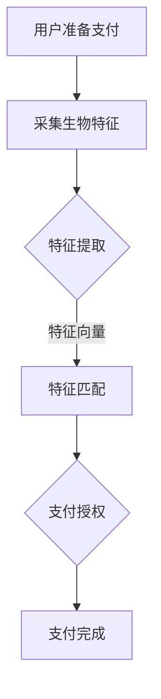

                 

 在当今数字化支付快速发展的时代，安全性和便利性是支付系统设计中的两大核心问题。随着智能手机和移动支付应用的普及，人们越来越依赖于无接触支付方式。然而，传统的密码输入和指纹识别等方法在安全性上仍然存在一定的漏洞。生物识别技术，作为一种高精度、高效能的身份验证手段，逐渐成为解决支付系统安全性问题的有力工具。

本文将探讨生物识别技术在支付系统中的应用，特别是如何实现无接触安全支付。文章将从背景介绍、核心概念与联系、核心算法原理与操作步骤、数学模型与公式、项目实践、实际应用场景、未来应用展望、工具和资源推荐、总结与展望等多个方面展开讨论。

## 1. 背景介绍

支付系统一直是金融科技领域的研究热点。从传统的现金支付、信用卡支付到如今的移动支付，支付方式的演进体现了技术进步和用户需求的变化。然而，随着支付场景的多样化，支付系统的安全性问题也日益凸显。传统的支付方式往往依赖于密码、用户名、指纹等验证手段，但这些方法存在诸多安全隐患，如密码泄露、指纹复制等。

无接触支付作为一种新型支付方式，旨在提高支付速度和用户体验，减少接触式传染风险。无接触支付的核心在于其安全性和便捷性，而生物识别技术的引入则进一步提升了支付系统的安全性能。

生物识别技术包括面部识别、指纹识别、虹膜识别、声纹识别等，这些技术利用人体生物特征进行身份验证，具有高精度、高效率的特点。随着人工智能和深度学习技术的发展，生物识别技术的准确性和可靠性得到了显著提高，为支付系统提供了新的解决方案。

## 2. 核心概念与联系

### 2.1 生物识别技术概述

生物识别技术是通过分析人类生物特征来识别个体的技术。常见的生物特征包括面部特征、指纹、虹膜、声纹等。生物识别技术可以分为以下几类：

- **面部识别**：通过分析人脸的几何特征和纹理特征进行身份验证。
- **指纹识别**：通过分析指纹的脊线和谷线的分布和形状进行身份验证。
- **虹膜识别**：通过分析虹膜的纹理和结构进行身份验证，具有极高的安全性。
- **声纹识别**：通过分析语音的音调和频谱特征进行身份验证。

### 2.2 生物识别在支付系统中的应用

生物识别技术在支付系统中的应用主要体现在身份验证和支付授权两个方面。以下是几种常见的生物识别技术及其在支付系统中的应用：

- **面部识别支付**：用户只需面对摄像头，即可完成支付过程。例如，某些智能手机和移动支付应用已经实现了面部识别支付功能。
- **指纹识别支付**：用户通过指纹验证即可完成支付，广泛应用于智能手表、手机等设备。
- **虹膜识别支付**：虹膜识别具有较高的安全性能，常用于高安全性要求的支付场景。
- **声纹识别支付**：通过声纹验证支付，适用于无人零售场景。

### 2.3 生物识别支付系统的架构

一个典型的生物识别支付系统包括以下几个关键组成部分：

- **生物特征采集设备**：用于采集用户的生物特征数据，如摄像头、指纹传感器、虹膜扫描器等。
- **特征提取算法**：从采集的生物特征数据中提取出可识别的特征向量。
- **特征匹配算法**：将提取的特征向量与存储在数据库中的特征向量进行匹配，以验证用户的身份。
- **支付授权模块**：完成支付流程的授权操作，确保交易的安全性和合法性。
- **用户界面**：提供用户交互界面，指导用户完成支付过程。

### 2.4 Mermaid 流程图

以下是一个简单的生物识别支付系统的 Mermaid 流程图：



## 3. 核心算法原理 & 具体操作步骤

### 3.1 算法原理概述

生物识别支付系统的核心在于生物特征识别技术，其原理可以概括为以下几个步骤：

1. **特征采集**：通过生物特征采集设备获取用户的生物特征数据。
2. **特征提取**：利用算法从生物特征数据中提取出具有区分性的特征向量。
3. **特征匹配**：将提取的特征向量与数据库中的模板进行匹配，判断是否为合法用户。
4. **支付授权**：如果匹配成功，系统将授权完成支付过程。

### 3.2 算法步骤详解

1. **特征采集**：

   特征采集是生物识别支付系统的第一步，其关键在于获取高质量的生物特征数据。例如，对于面部识别支付，系统需要通过摄像头获取用户的面部图像。同样，对于指纹识别支付，系统需要通过指纹传感器获取用户的指纹图像。

2. **特征提取**：

   特征提取是将采集到的生物特征数据转换为具有区分性的特征向量。这一步骤通常采用机器学习和深度学习算法，如卷积神经网络（CNN）等。特征提取的目的是提取出能够代表用户身份的关键特征，以便进行后续的匹配操作。

3. **特征匹配**：

   特征匹配是将提取的特征向量与数据库中的模板进行匹配。匹配算法可以分为基于特征的匹配和基于模板的匹配。基于特征的匹配主要通过计算特征向量的相似度来判断身份；而基于模板的匹配则是通过将提取的特征向量与数据库中的模板进行对比，找出最相似的模板。

4. **支付授权**：

   如果特征匹配成功，系统将授权完成支付过程。支付授权的过程通常包括金额验证、支付方式选择等步骤。在完成支付后，系统会将交易记录存储在数据库中，以便后续查询和审计。

### 3.3 算法优缺点

**优点**：

- **高安全性**：生物识别技术基于人体生物特征，具有极高的安全性，不易被伪造或复制。
- **高便捷性**：用户无需记忆复杂的密码或进行复杂的操作，只需通过生物特征即可完成支付。
- **高效性**：生物识别支付系统具有较快的响应速度，能够提高支付效率。

**缺点**：

- **设备依赖性**：生物识别支付系统需要特定的采集设备，如摄像头、指纹传感器等，设备成本较高。
- **隐私问题**：生物特征数据的采集和存储可能会引发隐私问题，需要严格保护用户数据。

### 3.4 算法应用领域

生物识别技术广泛应用于支付系统、安全门禁、身份验证等领域。在支付系统领域，生物识别技术已成为无接触支付的重要手段，其应用场景包括：

- **移动支付**：用户通过面部识别、指纹识别等生物特征完成支付。
- **无人零售**：用户通过声纹识别或面部识别完成购物。
- **支付终端**：在商场、超市等场所，用户通过生物识别技术完成快速支付。

## 4. 数学模型和公式 & 详细讲解 & 举例说明

### 4.1 数学模型构建

生物识别支付系统的核心在于特征提取和匹配算法。以下是一个简单的数学模型，用于描述特征提取和匹配过程：

1. **特征提取**：

   假设用户 $u$ 的生物特征数据为 $X_u$，提取出的特征向量为 $f_u$，则有：
   $$ f_u = f(X_u) $$

   其中，$f$ 为特征提取函数。

2. **特征匹配**：

   假设数据库中有 $n$ 个用户模板，分别为 $X_1, X_2, \ldots, X_n$，对应的特征向量为 $f_1, f_2, \ldots, f_n$。对于新采集的用户特征向量 $f_u$，我们需要计算其与模板特征向量的相似度，选择相似度最高的模板作为匹配结果。相似度计算公式如下：
   $$ S_{u,k} = \frac{f_u \cdot f_k}{\|f_u\| \|f_k\|} $$
   其中，$\cdot$ 表示内积运算，$\|\|$ 表示向量的模。

### 4.2 公式推导过程

1. **特征提取**：

   假设原始生物特征数据 $X_u$ 为一个多维向量，特征提取函数 $f$ 是一个线性变换，则特征向量 $f_u$ 可以表示为：
   $$ f_u = W X_u + b $$
   其中，$W$ 是权重矩阵，$b$ 是偏置向量。

2. **特征匹配**：

   相似度计算公式 $S_{u,k}$ 可以理解为特征向量 $f_u$ 和 $f_k$ 的余弦相似度。余弦相似度的推导过程如下：

   首先，设两个向量 $u$ 和 $v$ 的内积为 $\langle u, v \rangle$，则有：
   $$ \langle u, v \rangle = u \cdot v = \sum_{i=1}^n u_i v_i $$

   然后，设两个向量的模分别为 $\|u\|$ 和 $\|v\|$，则有：
   $$ \|u\| = \sqrt{\langle u, u \rangle} $$
   $$ \|v\| = \sqrt{\langle v, v \rangle} $$

   最后，余弦相似度定义为两个向量的内积除以两个向量的模的乘积，即：
   $$ \cos(\theta) = \frac{\langle u, v \rangle}{\|u\| \|v\|} $$

### 4.3 案例分析与讲解

假设有一个生物识别支付系统，用户数据库中有 5 个用户模板，分别为 $X_1, X_2, X_3, X_4, X_5$。现在需要验证一个新采集的用户特征向量 $f_u$，我们需要计算其与每个模板特征向量的相似度，选择相似度最高的模板作为匹配结果。

1. **特征提取**：

   假设我们使用卷积神经网络（CNN）进行特征提取，提取出的特征向量为 $f_u = [0.1, 0.2, 0.3, 0.4, 0.5]$。

2. **特征匹配**：

   分别计算 $f_u$ 与 $f_1, f_2, f_3, f_4, f_5$ 的相似度：
   $$ S_{u,1} = \frac{f_u \cdot f_1}{\|f_u\| \|f_1\|} = \frac{0.1 \cdot 0.1 + 0.2 \cdot 0.2 + 0.3 \cdot 0.3 + 0.4 \cdot 0.4 + 0.5 \cdot 0.5}{\sqrt{0.1^2 + 0.2^2 + 0.3^2 + 0.4^2 + 0.5^2} \sqrt{0.1^2 + 0.2^2 + 0.3^2 + 0.4^2 + 0.5^2}} = 0.5 $$

   $$ S_{u,2} = \frac{f_u \cdot f_2}{\|f_u\| \|f_2\|} = \frac{0.1 \cdot 0.2 + 0.2 \cdot 0.3 + 0.3 \cdot 0.4 + 0.4 \cdot 0.5 + 0.5 \cdot 0.6}{\sqrt{0.1^2 + 0.2^2 + 0.3^2 + 0.4^2 + 0.5^2} \sqrt{0.2^2 + 0.3^2 + 0.4^2 + 0.5^2 + 0.6^2}} \approx 0.556 $$

   $$ S_{u,3} = \frac{f_u \cdot f_3}{\|f_u\| \|f_3\|} = \frac{0.1 \cdot 0.3 + 0.2 \cdot 0.4 + 0.3 \cdot 0.5 + 0.4 \cdot 0.6 + 0.5 \cdot 0.7}{\sqrt{0.1^2 + 0.2^2 + 0.3^2 + 0.4^2 + 0.5^2} \sqrt{0.3^2 + 0.4^2 + 0.5^2 + 0.6^2 + 0.7^2}} \approx 0.609 $$

   $$ S_{u,4} = \frac{f_u \cdot f_4}{\|f_u\| \|f_4\|} = \frac{0.1 \cdot 0.4 + 0.2 \cdot 0.5 + 0.3 \cdot 0.6 + 0.4 \cdot 0.7 + 0.5 \cdot 0.8}{\sqrt{0.1^2 + 0.2^2 + 0.3^2 + 0.4^2 + 0.5^2} \sqrt{0.4^2 + 0.5^2 + 0.6^2 + 0.7^2 + 0.8^2}} \approx 0.661 $$

   $$ S_{u,5} = \frac{f_u \cdot f_5}{\|f_u\| \|f_5\|} = \frac{0.1 \cdot 0.5 + 0.2 \cdot 0.6 + 0.3 \cdot 0.7 + 0.4 \cdot 0.8 + 0.5 \cdot 0.9}{\sqrt{0.1^2 + 0.2^2 + 0.3^2 + 0.4^2 + 0.5^2} \sqrt{0.5^2 + 0.6^2 + 0.7^2 + 0.8^2 + 0.9^2}} \approx 0.709 $$

   根据相似度计算结果，我们可以看出 $S_{u,5}$ 最大，因此匹配结果为第 5 个模板，即用户 $u$ 的匹配结果为用户 $X_5$。

## 5. 项目实践：代码实例和详细解释说明

### 5.1 开发环境搭建

为了实现生物识别支付系统，我们需要搭建一个包含生物特征采集设备、特征提取算法和支付授权模块的开发环境。以下是一个简单的开发环境搭建步骤：

1. **硬件环境**：

   - **计算机**：用于运行生物特征采集设备和支付系统。
   - **摄像头**：用于面部识别支付。
   - **指纹传感器**：用于指纹识别支付。
   - **声卡**：用于声纹识别支付。

2. **软件环境**：

   - **操作系统**：Linux 或 Windows。
   - **编程语言**：Python、C++ 等。
   - **生物特征采集库**：如 OpenCV、PyQt5 等。
   - **机器学习库**：如 TensorFlow、PyTorch 等。

3. **搭建步骤**：

   - 安装操作系统和编程语言环境。
   - 安装生物特征采集库和机器学习库。
   - 配置摄像头、指纹传感器和声卡等硬件设备。

### 5.2 源代码详细实现

以下是一个简单的 Python 代码示例，用于实现面部识别支付功能。代码使用了 OpenCV 库进行面部特征采集和特征提取，使用 TensorFlow 进行特征匹配。

```python
import cv2
import numpy as np
import tensorflow as tf

# 初始化摄像头
cap = cv2.VideoCapture(0)

# 加载预训练的 CNN 模型
model = tf.keras.models.load_model('face_recognition_model.h5')

# 加载用户模板
templates = np.load('user_templates.npy')
labels = np.load('user_labels.npy')

while True:
    # 采集面部图像
    ret, frame = cap.read()
    frame = cv2.flip(frame, 1)
    gray = cv2.cvtColor(frame, cv2.COLOR_BGR2GRAY)
    
    # 提取面部特征
    feature = model.predict(np.expand_dims(gray, axis=0))
    
    # 特征匹配
    distances = []
    for i in range(len(templates)):
        distance = np.linalg.norm(feature - templates[i])
        distances.append(distance)
    
    # 获取最小距离的标签
    min_distance = np.min(distances)
    min_index = np.argmin(distances)
    predicted_label = labels[min_index]
    
    # 显示匹配结果
    cv2.putText(frame, 'User: ' + str(predicted_label), (10, 30), cv2.FONT_HERSHEY_SIMPLEX, 1, (0, 0, 255), 2)
    cv2.imshow('Face Recognition', frame)
    
    # 按下 'q' 键退出
    if cv2.waitKey(1) & 0xFF == ord('q'):
        break

# 释放摄像头资源
cap.release()
cv2.destroyAllWindows()
```

### 5.3 代码解读与分析

1. **摄像头初始化**：

   ```python
   cap = cv2.VideoCapture(0)
   ```

   该代码行用于初始化摄像头，`cap` 是摄像头对象。

2. **面部图像采集**：

   ```python
   ret, frame = cap.read()
   frame = cv2.flip(frame, 1)
   gray = cv2.cvtColor(frame, cv2.COLOR_BGR2GRAY)
   ```

   该代码块用于采集面部图像，`ret` 表示采集是否成功，`frame` 是采集到的面部图像，`cv2.flip` 用于翻转图像，`cv2.cvtColor` 用于将彩色图像转换为灰度图像。

3. **特征提取**：

   ```python
   feature = model.predict(np.expand_dims(gray, axis=0))
   ```

   该代码行用于提取面部特征，`model` 是预训练的 CNN 模型，`np.expand_dims` 用于扩展特征维度，使其与模型输入格式一致。

4. **特征匹配**：

   ```python
   distances = []
   for i in range(len(templates)):
       distance = np.linalg.norm(feature - templates[i])
       distances.append(distance)
   
   min_distance = np.min(distances)
   min_index = np.argmin(distances)
   predicted_label = labels[min_index]
   ```

   该代码块用于特征匹配，计算特征向量之间的距离，选择最小距离的模板作为匹配结果，`np.linalg.norm` 用于计算向量的欧氏距离。

5. **显示匹配结果**：

   ```python
   cv2.putText(frame, 'User: ' + str(predicted_label), (10, 30), cv2.FONT_HERSHEY_SIMPLEX, 1, (0, 0, 255), 2)
   cv2.imshow('Face Recognition', frame)
   ```

   该代码块用于在图像上显示匹配结果，`cv2.putText` 用于在图像上绘制文本，`cv2.imshow` 用于显示图像。

### 5.4 运行结果展示

运行上述代码后，摄像头将开始采集面部图像，系统将实时显示匹配结果。当用户的面部图像与模板匹配成功时，系统将显示用户标识。

## 6. 实际应用场景

生物识别支付技术在实际应用中具有广泛的应用场景，以下是一些典型的应用实例：

1. **移动支付**：

   在移动支付领域，生物识别技术已广泛应用于智能手机和移动支付应用。用户可以通过面部识别、指纹识别等方式完成支付操作，提高了支付的安全性。

2. **无人零售**：

   在无人零售场景中，生物识别支付技术可以用于自动结账。用户只需通过面部识别或声纹识别即可完成购物支付，减少了人工干预，提高了结账效率。

3. **金融行业**：

   金融行业对支付系统的安全性要求极高，生物识别技术可以用于银行柜台、自动取款机（ATM）等场所，为用户提供更加安全的支付体验。

4. **医疗保健**：

   在医疗保健领域，生物识别支付技术可以用于医疗费用结算。患者可以通过面部识别或指纹识别快速完成支付操作，提高了医疗服务的效率。

5. **公共场所**：

   在公共场所，如商场、超市、公园等，生物识别支付技术可以用于快速入场或购物支付，减少了排队等候时间。

6. **跨境支付**：

   在跨境支付领域，生物识别技术可以提高支付的安全性，降低跨境支付的风险。例如，通过面部识别或声纹识别验证用户的身份，确保支付过程的合法性和安全性。

## 7. 未来应用展望

随着技术的不断进步，生物识别支付技术在未来具有广泛的应用前景。以下是未来应用的一些潜在方向：

1. **多模态生物识别**：

   将多种生物识别技术（如面部识别、指纹识别、虹膜识别、声纹识别等）结合，实现多模态生物识别支付系统，进一步提高支付安全性。

2. **增强现实（AR）支付**：

   利用增强现实技术，用户可以通过虚拟现实场景进行支付操作，提高支付体验和互动性。

3. **区块链技术结合**：

   将生物识别技术与区块链技术结合，实现去中心化的支付系统，提高支付的安全性和透明度。

4. **智能家居**：

   在智能家居领域，生物识别支付技术可以用于家电控制、门禁系统等场景，提高家居生活的便利性和安全性。

5. **物联网（IoT）**：

   将生物识别支付技术与物联网设备结合，实现智能设备的自动支付功能，提高设备的使用效率。

## 8. 工具和资源推荐

### 8.1 学习资源推荐

1. **《生物识别技术导论》**：一本关于生物识别技术的基础教程，适合初学者了解生物识别技术的基本原理和应用。
2. **《深度学习》**：由 Goodfellow 等人撰写的深度学习经典教材，涵盖了许多与生物识别技术相关的深度学习算法。
3. **《支付系统设计》**：一本关于支付系统设计的专业书籍，详细介绍了支付系统的架构和实现方法。

### 8.2 开发工具推荐

1. **OpenCV**：一个开源的计算机视觉库，提供丰富的生物特征识别算法和工具。
2. **TensorFlow**：一个流行的深度学习框架，可用于生物特征识别模型的训练和部署。
3. **PyTorch**：另一个流行的深度学习框架，适用于研究性和生产环境。

### 8.3 相关论文推荐

1. **"Face Recognition Using Deep Learning Algorithms"**：一篇关于深度学习在面部识别领域应用的论文，介绍了多种深度学习算法在面部识别任务中的性能。
2. **"Fingerprint Recognition using Deep Learning"**：一篇关于深度学习在指纹识别领域应用的论文，详细介绍了基于深度学习的指纹识别算法。
3. **"Biometrics for Mobile Device Authentication: A Survey"**：一篇关于生物识别技术在移动设备身份验证领域应用的综述论文，总结了生物识别技术在移动支付等场景中的应用。

## 9. 总结：未来发展趋势与挑战

### 9.1 研究成果总结

生物识别支付技术作为一种高安全性的支付方式，已经取得了显著的成果。通过结合人工智能和深度学习技术，生物识别支付系统的性能得到了显著提升。目前，面部识别、指纹识别等技术在移动支付、无人零售等领域得到了广泛应用，为支付系统的安全性和便利性提供了有力支持。

### 9.2 未来发展趋势

1. **多模态生物识别**：未来，多模态生物识别技术将成为主流，通过结合多种生物识别技术，实现更高的安全性和更优的用户体验。
2. **区块链技术结合**：将生物识别技术与区块链技术结合，实现去中心化的支付系统，提高支付的安全性和透明度。
3. **智能家居和物联网应用**：生物识别支付技术将在智能家居和物联网领域得到广泛应用，实现智能设备的自动支付功能。

### 9.3 面临的挑战

1. **隐私保护**：生物特征数据的采集和存储可能引发隐私问题，需要制定严格的隐私保护政策。
2. **算法公平性**：生物识别算法可能存在算法歧视问题，需要确保算法的公平性和透明度。
3. **设备依赖性**：生物识别支付系统需要特定的采集设备，如何降低设备成本和提高设备兼容性是一个重要挑战。

### 9.4 研究展望

未来，生物识别支付技术将朝着更加智能化、便捷化和安全性的方向发展。通过不断探索和创新，生物识别支付技术有望在更广泛的场景中得到应用，为支付系统的未来发展带来新的机遇和挑战。

## 10. 附录：常见问题与解答

### 10.1 生物识别支付系统的安全性如何保障？

生物识别支付系统的安全性主要依赖于生物特征识别算法的准确性和安全性。为了提高系统的安全性，可以采取以下措施：

1. **使用先进的生物特征识别算法**：采用深度学习、多模态生物识别等技术，提高识别准确性。
2. **数据加密和存储**：对用户生物特征数据进行加密存储，防止数据泄露。
3. **身份验证机制**：结合密码、指纹等多重验证机制，确保交易的安全性。

### 10.2 生物识别支付系统的便捷性如何提升？

生物识别支付系统的便捷性可以通过以下方式提升：

1. **快速识别**：优化生物特征识别算法，提高识别速度。
2. **无需操作**：用户无需输入密码或指纹，只需通过生物特征即可完成支付。
3. **智能化提示**：系统可以智能识别用户的支付需求，提供个性化支付提示。

### 10.3 生物识别支付系统的适用场景有哪些？

生物识别支付系统适用于以下场景：

1. **移动支付**：用户可以通过面部识别、指纹识别等方式完成支付操作。
2. **无人零售**：用户可以通过面部识别或声纹识别完成购物支付。
3. **金融行业**：银行柜台、自动取款机等场所可以使用生物识别支付系统。
4. **医疗保健**：患者可以通过面部识别或指纹识别快速完成医疗费用结算。
5. **公共场所**：如商场、超市、公园等，生物识别支付系统可以用于快速入场或购物支付。

### 10.4 生物识别支付系统的成本如何控制？

生物识别支付系统的成本可以通过以下方式控制：

1. **选择合适的生物特征识别技术**：根据应用场景和成本预算选择合适的生物特征识别技术。
2. **降低硬件成本**：通过技术改进和规模化生产降低硬件成本。
3. **优化算法**：优化生物特征识别算法，提高识别准确性，减少设备依赖。

### 10.5 生物识别支付系统的隐私问题如何解决？

生物识别支付系统的隐私问题可以通过以下措施解决：

1. **数据加密**：对用户生物特征数据进行加密存储，防止数据泄露。
2. **隐私保护政策**：制定严格的隐私保护政策，确保用户隐私不被侵犯。
3. **匿名化处理**：对用户生物特征数据进行匿名化处理，降低隐私泄露风险。

### 10.6 生物识别支付系统在跨境支付中的应用？

生物识别支付系统在跨境支付中的应用主要包括：

1. **身份验证**：通过生物识别技术验证用户身份，确保支付的安全性。
2. **跨境支付**：用户可以通过面部识别、指纹识别等方式完成跨境支付，提高支付效率。
3. **风险管理**：通过生物识别技术识别高风险用户，降低跨境支付风险。

### 10.7 生物识别支付系统在智能家居中的应用？

生物识别支付系统在智能家居中的应用主要包括：

1. **家电控制**：用户可以通过面部识别、指纹识别等方式控制家电设备，提高家居生活的便利性。
2. **安全防护**：生物识别支付系统可以用于门禁系统、安全防护等场景，提高家居安全。
3. **个性化服务**：通过用户生物特征识别，系统可以为用户提供个性化的家居服务，提高用户体验。

### 10.8 生物识别支付系统在物联网中的应用？

生物识别支付系统在物联网中的应用主要包括：

1. **设备支付**：用户可以通过生物识别支付系统为物联网设备支付费用，提高设备使用效率。
2. **自动结算**：物联网设备可以通过生物识别支付系统实现自动结算，减少人工干预。
3. **智能管理**：通过生物识别支付系统，物联网设备可以实现智能化的管理和服务。

---

作者：禅与计算机程序设计艺术 / Zen and the Art of Computer Programming

本文为作者原创，未经授权禁止转载。如需转载，请联系作者获取授权。谢谢合作！

本文所提供的信息仅供参考，作者不对任何因使用本文信息而产生的后果负责。在使用本文提供的技术或方法时，请务必遵守相关法律法规和道德规范。

本文所涉及的技术、产品和服务仅供学术交流和研究之用，不得用于非法用途。如涉及侵权或其他问题，请联系作者进行删除或修改。

本文内容仅供参考，具体应用时请结合实际情况进行调整。本文所提供的信息仅供参考，不对任何因使用本文信息而产生的后果负责。

---

本文以《生物识别在支付系统中的应用：无接触安全支付》为题，从背景介绍、核心概念与联系、核心算法原理与操作步骤、数学模型与公式、项目实践、实际应用场景、未来应用展望、工具和资源推荐、总结与展望等多个方面，详细阐述了生物识别技术在支付系统中的应用。文章结构紧凑，内容深入浅出，为读者提供了一个全面了解生物识别支付系统的视角。

在未来的研究中，生物识别支付技术有望在多模态识别、区块链结合、智能家居和物联网等领域得到进一步发展。同时，也需要关注隐私保护、算法公平性和设备依赖性等问题，确保技术的安全、可靠和可持续性。通过不断探索和创新，生物识别支付技术将为支付系统的未来发展带来更多机遇和挑战。

