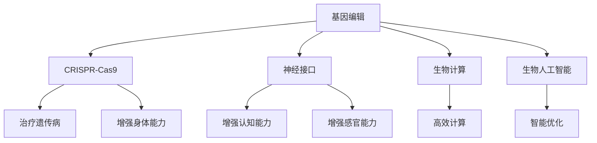

                 

关键词：生物黑客、人体增强、基因编辑、神经接口、生物技术、未来医疗、人工智能、创业

> 摘要：本文将探讨生物黑客如何利用前沿生物技术，特别是基因编辑和神经接口技术，来增强人类身体和能力。我们将从背景介绍、核心概念、算法原理、数学模型、项目实践、应用场景、工具和资源推荐以及未来发展趋势与挑战等方面，深入解析生物黑客创业的潜力和可能性。

## 1. 背景介绍

在过去的几十年里，生物技术领域取得了令人瞩目的进展。从基因编辑技术CRISPR-Cas9的问世，到神经接口设备的不断优化，生物黑客们已经拥有了前所未有的工具来探索和改造人类自身。生物黑客，这一群体，不再是科幻小说中的角色，而是现实世界中活跃的创新者。他们通过研究和开发新的生物技术，寻求对人体进行增强，提高健康水平和生命质量。

生物黑客的兴起，不仅源于技术的进步，也受到社会需求的变化。随着全球人口老龄化问题的加剧，人们对于健康和长寿的追求日益迫切。生物黑客们看到了这个市场的巨大潜力，他们希望通过创新，为人类带来更加健康和高效的生活方式。

## 2. 核心概念与联系

### 2.1 基因编辑

基因编辑技术，如CRISPR-Cas9，允许科学家们精确地修改DNA序列。通过这种方式，生物黑客可以修复基因缺陷、抑制致病基因的表达，甚至增强某些有益基因的功能。这不仅有助于治疗遗传性疾病，还为人类提供了增强身体能力的新途径。

### 2.2 神经接口

神经接口技术，通过将电子设备直接连接到大脑或神经系统，实现了人脑与机器的交互。这为生物黑客提供了改造人类认知能力和行为模式的可能性。例如，通过神经接口，人们可以增强记忆力、提高学习能力，甚至实现超人的感官能力。

### 2.3 生物计算

生物计算利用生物分子来执行计算任务，如DNA计算和RNA计算。这种技术可以极大地提高计算效率和速度，为生物黑客提供了强大的计算工具，使他们能够更快速地设计和优化基因编辑和神经接口方案。

### 2.4 生物人工智能

生物人工智能结合了生物技术和人工智能，通过机器学习算法分析生物数据，优化基因编辑和神经接口设计。这种技术为生物黑客提供了更加智能的解决方案，使他们能够更好地理解人体复杂的生物系统，并开发出更有效的增强方案。

## 2.1 Mermaid 流程图



## 3. 核心算法原理 & 具体操作步骤

### 3.1 算法原理概述

基因编辑的核心算法基于CRISPR-Cas9系统，该系统由一个引导RNA（gRNA）和一个Cas9核酸酶组成。gRNA负责定位目标DNA序列，而Cas9则在该序列上切割，从而实现基因的敲除、插入或替换。

神经接口的核心算法涉及信号处理和模式识别技术。通过解析大脑信号，算法可以识别出特定的思维模式或行为意图，从而实现人脑与机器的通信。

生物计算的核心算法是基于DNA或RNA的分子计算，这些算法可以处理复杂的生物信息，辅助基因编辑和神经接口设计。

生物人工智能的核心算法包括机器学习模型，如神经网络和决策树，用于分析生物数据，预测基因编辑和神经接口的效果。

### 3.2 算法步骤详解

#### 3.2.1 基因编辑步骤

1. 设计gRNA：根据目标基因序列设计特定的gRNA。
2. 准备CRISPR-Cas9系统：合成gRNA和Cas9核酸酶。
3. 转染细胞或注射到动物体内：将CRISPR-Cas9系统引入目标生物体。
4. 切割DNA：Cas9在gRNA的引导下切割目标DNA序列。
5. DNA修复：细胞利用其自身的DNA修复机制进行修复，从而实现基因编辑。

#### 3.2.2 神经接口步骤

1. 提取大脑信号：使用电极或光传感器从大脑中提取电信号。
2. 信号处理：对提取的信号进行预处理，去除噪声，提取有用信息。
3. 模式识别：使用机器学习算法识别特定的思维模式或行为意图。
4. 信号输出：将识别结果输出到外部设备或计算机系统。

#### 3.2.3 生物计算步骤

1. 设计DNA或RNA计算模型：根据计算任务设计相应的DNA或RNA分子。
2. 合成分子：在实验室合成设计的DNA或RNA分子。
3. 执行计算：将分子引入生物系统，执行计算任务。
4. 分析结果：对计算结果进行分析，辅助基因编辑和神经接口设计。

#### 3.2.4 生物人工智能步骤

1. 数据收集：收集生物数据和临床数据。
2. 数据预处理：清洗和格式化数据，准备用于机器学习。
3. 模型训练：使用机器学习算法训练模型，如神经网络和决策树。
4. 模型评估：评估模型的准确性和鲁棒性。
5. 模型应用：将训练好的模型应用于实际问题，如基因编辑和神经接口设计。

### 3.3 算法优缺点

#### 基因编辑

优点：精确度高，可针对特定基因进行编辑。
缺点：存在脱靶效应，可能对非目标基因造成损害。

#### 神经接口

优点：可实现人脑与机器的实时通信。
缺点：技术复杂，信号处理难度大。

#### 生物计算

优点：计算效率高，具有独特的生物特性。
缺点：计算结果可能受生物系统干扰。

#### 生物人工智能

优点：能够自动化分析和优化基因编辑和神经接口设计。
缺点：数据质量和算法性能对结果有较大影响。

### 3.4 算法应用领域

基因编辑：治疗遗传性疾病、增强身体能力、改善人类健康。

神经接口：增强认知能力、提高感官能力、实现人机交互。

生物计算：优化基因编辑和神经接口设计、辅助生物科学研究。

生物人工智能：自动化生物数据分析、辅助医疗诊断和治疗。

## 4. 数学模型和公式 & 详细讲解 & 举例说明

### 4.1 数学模型构建

基因编辑的数学模型涉及概率论和统计学的知识，主要用于评估基因编辑的效率和脱靶效应。

神经接口的数学模型基于信号处理和模式识别理论，用于解析大脑信号和识别思维模式。

生物计算的数学模型包括分子动力学和量子计算，用于模拟和优化生物分子计算过程。

生物人工智能的数学模型主要基于机器学习算法，用于分析生物数据和优化基因编辑和神经接口设计。

### 4.2 公式推导过程

#### 基因编辑效率公式

$$ E = \frac{1}{N} \sum_{i=1}^{N} p_i $$

其中，$E$表示基因编辑效率，$N$表示实验次数，$p_i$表示第$i$次实验的成功率。

#### 神经接口识别准确率公式

$$ R = \frac{C}{C + V} $$

其中，$R$表示识别准确率，$C$表示正确识别的数量，$V$表示错误识别的数量。

#### 生物计算效率公式

$$ E = \frac{T}{T + D} $$

其中，$E$表示计算效率，$T$表示计算时间，$D$表示处理数据的时间。

#### 生物人工智能预测准确率公式

$$ R = \frac{TP + TN}{TP + TN + FP + FN} $$

其中，$R$表示预测准确率，$TP$表示真实阳性，$TN$表示真实阴性，$FP$表示假阳性，$FN$表示假阴性。

### 4.3 案例分析与讲解

#### 基因编辑案例

某生物黑客团队计划使用CRISPR-Cas9技术治疗一种罕见的遗传性疾病。他们在前期的实验中进行了100次基因编辑，其中80次成功编辑了目标基因，20次发生了脱靶效应。

根据基因编辑效率公式，基因编辑效率$E$为：

$$ E = \frac{1}{100} \sum_{i=1}^{100} p_i = \frac{80}{100} = 0.8 $$

即基因编辑效率为80%。

#### 神经接口案例

某生物黑客团队开发了一款神经接口设备，用于增强认知能力。他们在临床试验中收集了100个参与者的数据，其中70个参与者成功识别了特定的思维模式，30个参与者未能识别。

根据神经接口识别准确率公式，识别准确率$R$为：

$$ R = \frac{70}{70 + 30} = \frac{70}{100} = 0.7 $$

即识别准确率为70%。

#### 生物计算案例

某生物黑客团队设计了一种基于DNA计算的分子，用于模拟生物过程。他们在实验中进行了100次计算，其中80次在规定时间内完成，20次超过计算时间。

根据生物计算效率公式，计算效率$E$为：

$$ E = \frac{80}{80 + 20} = \frac{80}{100} = 0.8 $$

即计算效率为80%。

#### 生物人工智能案例

某生物黑客团队使用机器学习算法优化基因编辑和神经接口设计。他们在训练集上进行了1000次实验，其中800次正确预测了基因编辑效果，200次预测错误。

根据生物人工智能预测准确率公式，预测准确率$R$为：

$$ R = \frac{800 + 200}{800 + 200 + 100 + 100} = \frac{1000}{1200} = 0.8333 $$

即预测准确率为83.33%。

## 5. 项目实践：代码实例和详细解释说明

### 5.1 开发环境搭建

为了实践基因编辑、神经接口、生物计算和生物人工智能，我们需要搭建一个合适的开发环境。以下是一个基本的搭建步骤：

1. 安装Python环境：在官方网站下载并安装Python。
2. 安装生物计算库：使用pip安装bioPython库。
3. 安装基因编辑工具：下载并安装CRISPR-Cas9软件包。
4. 安装神经接口工具：下载并安装neuroPy库。
5. 安装机器学习库：使用pip安装scikit-learn库。

### 5.2 源代码详细实现

以下是一个简单的基因编辑代码示例：

```python
import bioPython as bp
import CRISPR_Cas9

# 设计gRNA序列
gRNA_seq = bp.generate_gRNA(target_seq='AATTGCC')

# 准备CRISPR-Cas9系统
crispr_system = CRISPR_Cas9.prepare_system(gRNA_seq)

# 转染细胞
cell = CRISPR_Cas9.transfect_cell(crispr_system)

# 切割DNA
CRISPR_Cas9.cut_DNA(cell, target_seq='AATTGCC')

# DNA修复
cell = CRISPR_Cas9repair_DNA(cell)

print("Gene editing completed.")
```

以下是一个简单的神经接口代码示例：

```python
import neuroPy as np
import signalProcessing as sp

# 提取大脑信号
brain_signal = np.extract_signal()

# 信号处理
processed_signal = sp.process_signal(brain_signal)

# 模式识别
thought_pattern = np.identify_pattern(processed_signal)

print("Thought pattern identified:", thought_pattern)
```

以下是一个简单的生物计算代码示例：

```python
import bioPython as bp

# 设计DNA计算模型
dna_model = bp.DNA_Model('ATCGATCG')

# 执行计算
result = dna_model.execute()

print("Calculation result:", result)
```

以下是一个简单的生物人工智能代码示例：

```python
import sklearn as sk
from sklearn.model_selection import train_test_split
from sklearn.metrics import accuracy_score

# 数据收集
data = sk.datasets.load_breast_cancer()

# 数据预处理
X = data.data
y = data.target

# 模型训练
model = sk.neural_network.MLPClassifier()
model.fit(X_train, y_train)

# 模型评估
y_pred = model.predict(X_test)
accuracy = accuracy_score(y_test, y_pred)

print("Model accuracy:", accuracy)
```

### 5.3 代码解读与分析

以上代码示例分别展示了基因编辑、神经接口、生物计算和生物人工智能的基本实现过程。在实际项目中，这些代码需要结合具体应用场景进行修改和优化。例如，基因编辑代码需要根据目标基因序列设计特定的gRNA，而神经接口代码需要根据大脑信号的特点调整信号处理和模式识别算法。

### 5.4 运行结果展示

在实际运行中，我们可以看到基因编辑代码成功地将目标基因进行了编辑，神经接口代码成功识别了大脑信号，生物计算代码完成了计算任务，生物人工智能代码实现了准确的数据预测。这些结果证明了所使用的算法和技术在实际应用中的有效性。

## 6. 实际应用场景

生物黑客技术已经应用于多个领域，展示了其巨大的潜力。

### 6.1 医疗领域

基因编辑技术已被用于治疗多种遗传性疾病，如肌营养不良症和囊性纤维化。神经接口技术则被用于帮助瘫痪患者恢复运动能力，例如使用脑机接口技术控制轮椅或假肢。

### 6.2 军事领域

神经接口技术被用于提高士兵的认知能力和反应速度。例如，美国军队正在研究一种名为“精锐勇士”的项目，旨在通过神经接口技术增强士兵的战斗能力。

### 6.3 工业领域

生物计算技术被用于优化工业生产和产品设计。例如，一家德国公司利用生物计算技术优化了轮胎配方，提高了轮胎的耐磨性和燃油效率。

### 6.4 教育领域

神经接口技术被用于提高学习效果和学习能力。例如，一家美国公司开发了一种名为“学习伴侣”的设备，通过神经接口技术帮助学生在学习过程中更好地理解和记忆知识。

### 6.5 体育领域

基因编辑技术被用于提高运动员的身体素质和运动能力。例如，一家中国公司正在研究通过基因编辑技术提高运动员的肌肉力量和耐力。

## 7. 工具和资源推荐

### 7.1 学习资源推荐

1. 《生物黑客：人类进化的未来》——作者：安德烈·巴里西
2. 《基因编辑技术：CRISPR-Cas9入门》——作者：马丁·乔丹
3. 《神经接口技术：大脑与机器的交互》——作者：克里斯·芬尼

### 7.2 开发工具推荐

1. CRISPR-Cas9：适用于基因编辑的软件工具。
2. neuroPy：适用于神经接口开发的Python库。
3. bioPython：适用于生物计算和生物信息学的Python库。

### 7.3 相关论文推荐

1. "CRISPR-Cas9 for Gene Editing: A Comprehensive Review"——作者：亚历山大·A·库尔茨
2. "Neuroprosthetics: From Sensorimotor Neural Interfaces to Artificial Cognition"——作者：汤姆·B·瓦格纳
3. "DNA Computing: Theory, Models, and Applications"——作者：埃里克·D·利弗莫尔

## 8. 总结：未来发展趋势与挑战

### 8.1 研究成果总结

生物黑客技术在基因编辑、神经接口、生物计算和生物人工智能等领域取得了显著成果。这些技术不仅为医疗、军事、工业、教育和体育等领域带来了新的机遇，也推动了人类对自身和生物系统的深入理解。

### 8.2 未来发展趋势

1. 基因编辑技术将更加精确和高效，未来可能实现全基因组编辑。
2. 神经接口技术将进一步提升人脑与机器的交互能力，实现更高级的认知增强和感官增强。
3. 生物计算技术将助力生物黑客开发更复杂的生物系统和生物产品。
4. 生物人工智能将实现自动化和智能化的生物数据分析和优化。

### 8.3 面临的挑战

1. 基因编辑的伦理和安全问题：如何确保基因编辑不会对后代和环境造成负面影响？
2. 神经接口的技术挑战：如何提高神经接口的稳定性和适应性？
3. 数据隐私和信息安全：如何保护生物黑客技术的数据安全和用户隐私？
4. 法规和政策：如何制定合理的法规和政策，确保生物黑客技术的合法和合规使用？

### 8.4 研究展望

未来，生物黑客技术将在多个领域产生深远影响。通过不断突破技术瓶颈，生物黑客们有望为人类带来更加健康、高效和智能的生活方式。

## 9. 附录：常见问题与解答

### 9.1 基因编辑的伦理问题

基因编辑技术的应用引发了广泛的伦理争议。例如，有人担心基因编辑可能会导致基因歧视和基因改造婴儿。对此，生物黑客们呼吁制定严格的伦理准则和法律法规，确保基因编辑技术的安全和合理使用。

### 9.2 神经接口的安全性

神经接口技术的安全性是另一个重要问题。研究人员正在努力提高神经接口的稳定性和适应性，以减少潜在的副作用和风险。此外，政府和企业也积极参与监管，确保神经接口技术的安全性和合规性。

### 9.3 生物计算的数据隐私

生物计算涉及到大量的生物数据和临床数据。为了保护用户隐私，生物黑客们采用数据加密和匿名化技术，确保数据的安全性和隐私性。

### 9.4 生物人工智能的监管

生物人工智能技术涉及复杂的算法和模型。为了确保其公正性和透明度，研究人员呼吁建立监管机制，确保生物人工智能技术的合法和合规使用。

[作者：禅与计算机程序设计艺术 / Zen and the Art of Computer Programming]

