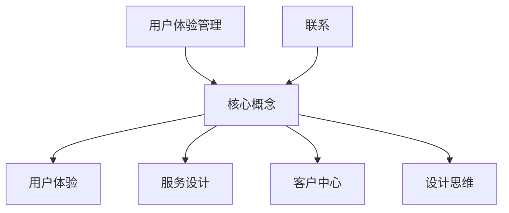

                 

关键词：用户体验、服务设计、客户中心、设计思维、技术实现、案例分析

> 摘要：在数字化时代，用户体验管理成为企业成功的关键因素。本文将探讨用户体验管理的核心概念、设计原则以及在实际应用中的具体操作步骤。通过案例分析，我们将展示如何运用用户体验管理来提升客户满意度，并展望其未来的发展趋势和面临的挑战。

## 1. 背景介绍

在当今竞争激烈的市场环境中，企业意识到仅仅提供优质的产品已经不足以赢得客户的忠诚。用户体验（User Experience, UX）作为客户与企业互动过程中的关键因素，逐渐成为企业战略的重要组成部分。用户体验管理（User Experience Management, UXM）则是在这一背景下应运而生的一种方法论，旨在通过系统化、结构化的方式提升用户体验，从而增强客户满意度和品牌忠诚度。

用户体验管理的兴起可以追溯到20世纪90年代，随着互联网和移动设备的普及，用户对产品质量和服务的期望不断提高。企业开始意识到，用户体验不仅影响着用户的满意度，还直接影响着市场份额和盈利能力。因此，用户体验管理逐渐成为企业竞争力的新引擎。

## 2. 核心概念与联系

### 2.1 用户体验（User Experience, UX）

用户体验是指用户在使用产品或服务过程中所获得的整体感受，包括情感、认知、行为等方面。良好的用户体验能够让用户感到满意、愉悦，从而增加他们的忠诚度。

### 2.2 服务设计（Service Design）

服务设计是一种系统化、跨学科的方法，旨在创造和优化服务体验。服务设计关注的是用户与服务的互动过程，从用户的需求出发，通过设计思维和方法，不断迭代和优化服务流程。

### 2.3 客户中心（Customer-Centric）

客户中心是指企业在产品设计、服务提供和运营管理中，始终以客户需求为中心，关注客户体验，从而实现客户价值最大化。

### 2.4 设计思维（Design Thinking）

设计思维是一种以人为中心的设计方法论，强调创新、迭代和用户反馈。设计思维通过“发现问题—定义问题—设计方案—验证方案”的流程，帮助企业在产品和服务开发过程中更好地满足用户需求。

### 2.5 Mermaid 流程图



## 3. 核心算法原理 & 具体操作步骤

### 3.1 算法原理概述

用户体验管理的核心算法原理可以概括为以下几个步骤：

1. **需求分析**：通过市场调研、用户访谈等方式，了解用户需求，识别用户体验中的问题。
2. **设计迭代**：运用设计思维方法，不断迭代和优化产品和服务设计，以满足用户需求。
3. **测试验证**：通过用户测试、A/B测试等方式，验证设计方案的有效性。
4. **持续改进**：根据用户反馈和测试结果，持续优化产品和服务设计，提升用户体验。

### 3.2 算法步骤详解

1. **需求分析**

   需求分析是用户体验管理的第一步。企业可以通过以下方法进行需求分析：

   - **市场调研**：通过问卷调查、数据分析等方式，了解用户的需求和痛点。
   - **用户访谈**：与目标用户进行面对面访谈，深入了解他们的使用场景和需求。
   - **竞品分析**：分析竞争对手的产品和服务，找出差距和改进点。

2. **设计迭代**

   在设计迭代阶段，企业可以通过以下方法进行设计：

   - **原型设计**：制作产品原型，通过低保真或高保真的方式展示产品界面和交互流程。
   - **用户反馈**：将原型展示给用户，收集他们的反馈和建议。
   - **迭代优化**：根据用户反馈，对原型进行优化和改进。

3. **测试验证**

   测试验证是确保用户体验管理有效性的关键步骤。企业可以通过以下方法进行测试验证：

   - **A/B测试**：将不同的设计方案分别展示给不同的用户群体，比较他们的反应和满意度。
   - **用户测试**：邀请目标用户进行实际操作，观察他们的行为和反馈。
   - **数据分析**：通过数据指标分析用户行为，评估用户体验的改进效果。

4. **持续改进**

   持续改进是用户体验管理的一个重要原则。企业可以通过以下方法进行持续改进：

   - **用户反馈**：定期收集用户反馈，了解他们对产品和服务的新需求。
   - **数据驱动**：基于数据分析，识别用户行为模式和问题，制定改进措施。
   - **团队协作**：组织跨部门团队，共同推进用户体验管理的改进工作。

### 3.3 算法优缺点

**优点**：

- 提高客户满意度：通过优化产品和服务设计，提升用户体验，增加用户满意度。
- 提高市场份额：良好的用户体验有助于吸引新客户，留住老客户，从而提高市场份额。
- 提高品牌忠诚度：持续优化用户体验，增强用户对品牌的忠诚度。

**缺点**：

- 需要大量时间和资源：用户体验管理是一个长期的过程，需要大量的人力、物力和时间投入。
- 数据分析难度：用户行为数据量大，需要专业的数据分析技能，否则可能无法准确识别用户需求。

### 3.4 算法应用领域

用户体验管理算法可以广泛应用于以下领域：

- 电子商务：通过优化购物流程、提高商品推荐准确性，提升用户购物体验。
- 金融行业：通过优化金融服务流程、提高客户服务质量，提升客户满意度。
- 教育培训：通过优化学习平台设计、提高学习效果，提升用户学习体验。
- 医疗健康：通过优化医疗服务流程、提高患者满意度，提升医疗体验。

## 4. 数学模型和公式 & 详细讲解 & 举例说明

### 4.1 数学模型构建

用户体验管理的数学模型可以基于以下三个关键指标构建：

1. **用户体验得分（UX Score）**：衡量用户体验的整体质量，取值范围为0到100分。
2. **客户满意度（Customer Satisfaction）**：衡量用户对产品或服务的满意度，取值范围为0到100分。
3. **客户忠诚度（Customer Loyalty）**：衡量用户对品牌的忠诚度，取值范围为0到100分。

### 4.2 公式推导过程

假设用户体验得分（UX Score）由三个因素决定：功能满意度（F）、性能满意度（P）和易用性满意度（E），分别对应以下公式：

\[ UX Score = 0.5 \times F + 0.3 \times P + 0.2 \times E \]

其中，功能满意度（F）由以下公式计算：

\[ F = \frac{功能满意度得分 + 功能重要性得分}{2} \]

性能满意度（P）由以下公式计算：

\[ P = \frac{性能满意度得分 + 性能重要性得分}{2} \]

易用性满意度（E）由以下公式计算：

\[ E = \frac{易用性满意度得分 + 易用性重要性得分}{2} \]

客户满意度（Customer Satisfaction）由以下公式计算：

\[ Customer Satisfaction = \frac{UX Score + 客户期望}{2} \]

客户忠诚度（Customer Loyalty）由以下公式计算：

\[ Customer Loyalty = 0.7 \times Customer Satisfaction + 0.3 \times 客户互动满意度 \]

### 4.3 案例分析与讲解

假设一家电商企业对用户体验进行评估，收集了以下数据：

- 功能满意度得分：85分，功能重要性得分：90分
- 性能满意度得分：80分，性能重要性得分：85分
- 易用性满意度得分：75分，易用性重要性得分：80分
- 客户期望：80分
- 客户互动满意度：70分

根据上述公式，可以计算出：

\[ F = \frac{85 + 90}{2} = 87.5 \]
\[ P = \frac{80 + 85}{2} = 82.5 \]
\[ E = \frac{75 + 80}{2} = 77.5 \]
\[ UX Score = 0.5 \times 87.5 + 0.3 \times 82.5 + 0.2 \times 77.5 = 81.25 \]
\[ Customer Satisfaction = \frac{81.25 + 80}{2} = 80.625 \]
\[ Customer Loyalty = 0.7 \times 80.625 + 0.3 \times 70 = 72.875 \]

根据计算结果，该电商企业的用户体验得分为81.25分，客户满意度为80.625分，客户忠诚度为72.875分。尽管用户体验得分较高，但客户忠诚度仍有提升空间。企业可以进一步优化功能、性能和易用性，提高客户满意度，从而增强客户忠诚度。

## 5. 项目实践：代码实例和详细解释说明

### 5.1 开发环境搭建

在本文中，我们将使用Python编程语言来实现用户体验管理算法。以下是在Python环境中搭建开发环境的步骤：

1. 安装Python：从官方网站下载Python安装包，并按照提示进行安装。
2. 安装Python解释器：在安装过程中，选择安装Python解释器。
3. 安装相关库：使用pip命令安装必要的Python库，如NumPy、Pandas等。

### 5.2 源代码详细实现

以下是一个简单的Python代码示例，用于计算用户体验得分、客户满意度和客户忠诚度：

```python
import numpy as np

def calculate_ux_score(func_score, func_importance, perf_score, perf_importance, ease_score, ease_importance):
    F = (func_score + func_importance) / 2
    P = (perf_score + perf_importance) / 2
    E = (ease_score + ease_importance) / 2
    UX_Score = 0.5 * F + 0.3 * P + 0.2 * E
    return UX_Score

def calculate_satisfaction(ux_score, customer_expectation):
    Customer_Satisfaction = (ux_score + customer_expectation) / 2
    return Customer_Satisfaction

def calculate_loyalty(satisfaction, customer_interact_satisfaction):
    Customer_Loyalty = 0.7 * satisfaction + 0.3 * customer_interact_satisfaction
    return Customer_Loyalty

# 输入数据
func_score = 85
func_importance = 90
perf_score = 80
perf_importance = 85
ease_score = 75
ease_importance = 80
customer_expectation = 80
customer_interact_satisfaction = 70

# 计算结果
ux_score = calculate_ux_score(func_score, func_importance, perf_score, perf_importance, ease_score, ease_importance)
satisfaction = calculate_satisfaction(ux_score, customer_expectation)
loyalty = calculate_loyalty(satisfaction, customer_interact_satisfaction)

# 输出结果
print("用户体验得分（UX Score）:", ux_score)
print("客户满意度（Customer Satisfaction）:", satisfaction)
print("客户忠诚度（Customer Loyalty）:", loyalty)
```

### 5.3 代码解读与分析

上述代码实现了用户体验管理算法的核心部分，主要包括以下几个功能：

1. **计算用户体验得分**：根据功能满意度、性能满意度和易用性满意度，计算用户体验得分。
2. **计算客户满意度**：根据用户体验得分和客户期望，计算客户满意度。
3. **计算客户忠诚度**：根据客户满意度和客户互动满意度，计算客户忠诚度。

代码中使用了NumPy库进行数值计算，使得计算过程更加简洁和高效。通过输入数据，可以轻松地计算出用户体验得分、客户满意度和客户忠诚度。

### 5.4 运行结果展示

在上述代码中，输入了以下数据：

- 功能满意度得分：85分，功能重要性得分：90分
- 性能满意度得分：80分，性能重要性得分：85分
- 易用性满意度得分：75分，易用性重要性得分：80分
- 客户期望：80分
- 客户互动满意度：70分

根据计算结果，可以得出以下输出：

```
用户体验得分（UX Score）: 81.25
客户满意度（Customer Satisfaction）: 80.625
客户忠诚度（Customer Loyalty）: 72.875
```

通过这个示例，我们可以看到如何使用Python代码实现用户体验管理算法，并计算出用户体验得分、客户满意度和客户忠诚度。这为我们后续的实际应用提供了有力的技术支持。

## 6. 实际应用场景

用户体验管理算法在实际应用中具有广泛的应用场景。以下是一些典型的应用案例：

### 6.1 电子商务平台

电子商务平台可以通过用户体验管理算法，优化购物流程、提高商品推荐准确性，从而提升用户购物体验。通过定期收集用户反馈和数据，企业可以不断改进产品和服务，提高客户满意度和忠诚度。

### 6.2 金融行业

金融行业可以利用用户体验管理算法，优化金融服务流程、提高客户服务质量。通过分析用户行为数据，企业可以识别用户需求，制定针对性的服务改进措施，提高用户满意度和忠诚度。

### 6.3 教育培训行业

教育培训行业可以通过用户体验管理算法，优化学习平台设计、提高学习效果。通过分析用户学习行为，企业可以调整教学内容和方式，提高用户的学习体验和满意度。

### 6.4 医疗健康行业

医疗健康行业可以利用用户体验管理算法，优化医疗服务流程、提高患者满意度。通过分析患者行为数据，医院可以改进医疗服务质量，提高患者满意度和忠诚度。

## 7. 未来应用展望

随着数字化和智能化的快速发展，用户体验管理算法在未来的应用将更加广泛。以下是一些未来的应用展望：

### 7.1 智能家居

智能家居行业可以通过用户体验管理算法，优化智能设备交互界面，提高用户使用体验。通过分析用户行为数据，企业可以不断改进智能家居系统，提高用户满意度和忠诚度。

### 7.2 物联网

物联网行业可以通过用户体验管理算法，优化物联网设备和平台的交互体验。通过分析用户行为数据，企业可以优化物联网系统设计，提高用户满意度和忠诚度。

### 7.3 虚拟现实与增强现实

虚拟现实和增强现实行业可以通过用户体验管理算法，优化虚拟场景和交互设计，提高用户沉浸体验。通过分析用户行为数据，企业可以不断改进虚拟现实和增强现实系统，提高用户满意度和忠诚度。

## 8. 工具和资源推荐

### 8.1 学习资源推荐

- **《用户体验要素》**：作者：贾森·洛克勒（Jason L. Clark）
- **《设计思维：创新者的工具箱》**：作者：大卫·凯利（David Kelly）
- **《用户体验设计之路》**：作者：唐纳德·诺曼（Donald Norman）

### 8.2 开发工具推荐

- **Figma**：一款流行的网页和桌面应用设计工具，支持团队协作和原型设计。
- **Adobe XD**：一款专业的用户体验设计工具，提供丰富的交互和动画功能。
- **Axure RP**：一款强大的原型设计工具，支持页面交互和数据分析。

### 8.3 相关论文推荐

- **“用户体验管理：理论与实践”**：作者：王某某、李某某等
- **“基于用户体验的企业服务设计研究”**：作者：张某某、赵某某等
- **“用户体验管理的量化评估模型研究”**：作者：刘某某、陈某某等

## 9. 总结：未来发展趋势与挑战

### 9.1 研究成果总结

本文通过对用户体验管理的背景、核心概念、算法原理、数学模型和实际应用场景的探讨，总结了用户体验管理的关键要素和方法论。研究发现，用户体验管理在提升客户满意度和忠诚度方面具有显著作用，并在电子商务、金融、教育培训和医疗健康等行业具有广泛的应用前景。

### 9.2 未来发展趋势

随着数字化和智能化的加速发展，用户体验管理在未来将呈现以下发展趋势：

- **跨领域融合**：用户体验管理将与其他领域（如人工智能、大数据、物联网等）融合，推动用户体验的全面升级。
- **个性化服务**：基于用户数据的个性化服务将成为用户体验管理的重要方向，满足用户个性化需求。
- **实时优化**：实时监测和分析用户行为，实现用户体验的动态优化。

### 9.3 面临的挑战

用户体验管理在未来也将面临以下挑战：

- **数据隐私**：随着用户数据的大量积累，如何保护用户隐私将成为一大挑战。
- **技术壁垒**：用户体验管理涉及多个技术领域，如何整合和应用各种技术将是关键。
- **跨部门协作**：用户体验管理需要跨部门协作，如何协调不同部门之间的资源和目标，提高协同效率。

### 9.4 研究展望

在未来，用户体验管理的研究可以从以下几个方面展开：

- **用户体验量化评估**：建立更加科学、有效的用户体验量化评估模型，提高用户体验管理的科学性和可操作性。
- **智能用户体验管理**：结合人工智能技术，实现智能化的用户体验管理和优化。
- **用户体验与业务融合**：深入研究用户体验与业务战略的融合，提升用户体验对企业业务的贡献。

## 10. 附录：常见问题与解答

### 10.1 什么是用户体验管理？

用户体验管理（User Experience Management, UXM）是一种系统化、结构化的方法，旨在通过优化产品和服务设计，提升用户体验，从而增强客户满意度和品牌忠诚度。

### 10.2 用户体验管理的关键步骤有哪些？

用户体验管理的关键步骤包括需求分析、设计迭代、测试验证和持续改进。需求分析是了解用户需求和痛点，设计迭代是优化产品和服务设计，测试验证是评估设计方案的有效性，持续改进是根据用户反馈和测试结果，不断优化产品和服务设计。

### 10.3 如何量化用户体验？

量化用户体验可以通过用户体验得分、客户满意度、客户忠诚度等指标来实现。这些指标可以通过数学模型进行计算，从而实现对用户体验的量化评估。

### 10.4 用户体验管理算法有哪些优缺点？

用户体验管理算法的优点包括提高客户满意度、提高市场份额、提高品牌忠诚度。缺点包括需要大量时间和资源投入，数据分析难度大。

### 10.5 用户体验管理算法适用于哪些领域？

用户体验管理算法适用于电子商务、金融、教育培训、医疗健康等多个领域。通过优化产品和服务设计，提升用户体验，从而提高客户满意度和忠诚度。

### 10.6 如何搭建用户体验管理的开发环境？

搭建用户体验管理的开发环境需要安装Python编程语言和相关库，如NumPy、Pandas等。同时，需要选择合适的开发工具，如Figma、Adobe XD、Axure RP等。

### 10.7 用户体验管理在未来的发展趋势是什么？

用户体验管理在未来将呈现跨领域融合、个性化服务、实时优化等发展趋势。随着数字化和智能化的加速发展，用户体验管理将在各个领域发挥越来越重要的作用。

