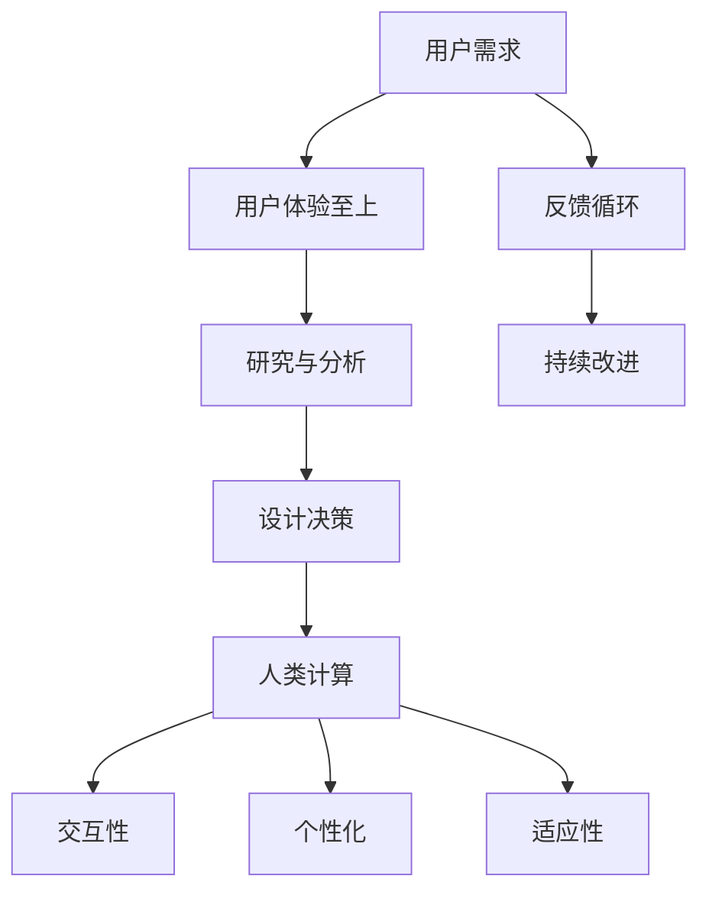

                 

关键词：用户体验、人类计算、客户满意度、软件设计、服务质量、交互设计、用户研究、反馈循环、人工智能、个性化、反馈机制、服务质量评估。

> 摘要：本文探讨了用户体验至上的原则在软件设计和开发中的应用，以及人类计算在提升客户满意度方面所发挥的关键作用。通过分析用户体验的核心概念、人类计算的优势和挑战，本文提出了一系列实际操作步骤和工具资源，旨在为开发团队提供指导，以实现更加用户导向的开发流程，从而提升客户满意度。

## 1. 背景介绍

在当今的数字化时代，用户体验（User Experience, UX）已经成为影响软件和服务成功与否的关键因素。无论是移动应用、网页、还是复杂的业务系统，用户体验直接影响用户满意度和忠诚度。用户不再只是被动的接受产品，他们期望产品能够满足自己的需求，并提供愉悦和便捷的体验。

用户体验至上（User-Centered Design, UCD）是一种以用户为中心的设计方法，其核心思想是将用户的需求和体验置于设计和开发的中心。这种方法的目的是确保产品在功能、可用性、易用性和美观性方面都能满足用户的需求。

在用户体验至上的框架下，人类计算（Human-Centric Computing）扮演着重要角色。人类计算关注如何利用计算技术增强人类的能力，提高工作效率和幸福感。与传统的以机器为中心的计算不同，人类计算强调人与技术之间的互动，以及如何通过技术来实现个性化的用户体验。

然而，尽管用户体验至上的原则已被广泛接受，但在实际应用中仍然面临诸多挑战。开发团队常常需要在时间、资源和预算的限制下工作，这使得实现完美的用户体验变得复杂。此外，用户需求的变化速度也要求开发团队具备快速响应和迭代的能力。

本文旨在探讨用户体验至上原则在软件设计和开发中的应用，分析人类计算的优势和挑战，并提出实际操作步骤和工具资源，以帮助开发团队实现用户导向的开发流程，从而提升客户满意度。

## 2. 核心概念与联系

为了更好地理解用户体验至上和人类计算，我们需要探讨这两个核心概念的基本原理及其相互关系。

### 2.1 用户体验（User Experience）

用户体验是指用户在使用产品或服务过程中所感受到的整体体验。它不仅包括产品的功能性和实用性，还涵盖了用户在使用过程中的情感反应、心理感受和社会影响。

用户体验的核心要素包括：

- **功能性**：产品是否能够实现其预定功能，满足用户的需求。
- **可用性**：产品是否易于使用，用户能否快速学会使用。
- **易用性**：产品的设计和交互是否符合用户的习惯，是否能够提供直观的操作体验。
- **美观性**：产品的视觉设计是否符合用户的审美标准，是否能够带来愉悦的视觉体验。
- **可靠性**：产品在运行过程中是否稳定，能否避免出现错误或崩溃。

### 2.2 人类计算（Human-Centric Computing）

人类计算是一种计算范式，它强调人与技术之间的互动，以及如何通过技术来实现个性化、增强人类的能力和幸福感。人类计算的核心目标是将计算技术融入到人类的生活和工作中，使其成为自然和易于使用的工具。

人类计算的关键要素包括：

- **交互性**：人类与计算系统之间的互动应尽可能直观和自然。
- **个性化**：计算系统应根据用户的需求和行为进行个性化调整，以提供更加符合个人习惯的体验。
- **协同**：计算系统应支持用户与他人的协作，以及用户与系统之间的协同工作。
- **适应性**：计算系统应具备一定的自适应能力，能够根据用户的需求和环境变化进行调整。

### 2.3 核心概念的联系

用户体验和人类计算之间存在紧密的联系。用户体验是评估人类计算系统好坏的直接标准，而人类计算则为提升用户体验提供了技术手段。

用户体验至上原则强调以用户为中心，通过研究和分析用户的需求和行为，设计出符合用户期望的产品和服务。这一原则为人类计算提供了明确的目标和方向，即如何通过技术手段提升用户的整体体验。

另一方面，人类计算通过引入个性化、交互性和适应性等特性，为用户体验的提升提供了技术支持。例如，通过用户行为分析和机器学习算法，计算系统可以更好地理解用户需求，提供个性化的推荐和体验。

总的来说，用户体验至上和人类计算共同构建了一个以用户为中心的设计和开发框架，旨在通过技术手段提升用户的整体体验，从而提高产品和服务满意度。

### 2.4 Mermaid 流程图

下面是一个简单的 Mermaid 流程图，展示了用户体验和人类计算之间的联系和互动。



通过这个流程图，我们可以看到用户体验和人类计算之间的动态交互和循环。用户需求引导着用户体验的设计，而用户体验的反馈又影响着人类计算的改进。这种相互促进的关系，使得用户体验和人类计算共同推动了产品和服务质量的提升。

## 3. 核心算法原理 & 具体操作步骤

### 3.1 算法原理概述

在用户体验至上的原则下，核心算法原理主要关注如何通过计算技术提升用户的整体体验。以下是一些关键算法原理：

#### 3.1.1 用户行为分析

用户行为分析是一种通过数据分析和机器学习算法，理解用户行为和需求的技术。这种算法可以收集用户在使用产品或服务过程中的行为数据，如点击率、停留时间、转化率等，并利用这些数据来预测用户偏好和需求。

#### 3.1.2 个性化推荐

个性化推荐算法基于用户行为数据和内容特征，为用户提供个性化的推荐。这种算法可以显著提高用户的满意度和参与度，例如在电子商务、社交媒体和内容平台等领域。

#### 3.1.3 交互优化

交互优化算法旨在通过分析和模拟用户的操作行为，优化用户与产品的交互。这种算法可以识别用户在使用产品过程中遇到的问题和障碍，并提出改进建议，从而提升用户的可用性和易用性。

#### 3.1.4 适应性设计

适应性设计算法通过不断调整和优化产品的设计，使其适应不同用户的需求和环境。这种算法可以利用用户反馈和实时数据，实现动态调整和优化，从而提高用户体验的稳定性和满意度。

### 3.2 算法步骤详解

#### 3.2.1 用户行为分析

1. **数据收集**：收集用户在使用产品或服务过程中的行为数据，如点击事件、浏览时间、操作路径等。
2. **数据预处理**：对收集到的数据进行分析，清洗和整理，以消除噪声和异常值。
3. **特征提取**：从数据中提取关键特征，如用户的点击频率、浏览时间、操作路径等。
4. **模型训练**：使用机器学习算法，如决策树、支持向量机、神经网络等，对提取的特征进行训练，构建用户行为模型。
5. **模型评估**：通过交叉验证和评估指标，如准确率、召回率、F1 值等，评估模型的性能。

#### 3.2.2 个性化推荐

1. **用户特征提取**：收集用户的个性化数据，如用户画像、兴趣爱好、历史行为等。
2. **推荐算法选择**：根据产品和业务需求，选择合适的推荐算法，如协同过滤、基于内容的推荐、混合推荐等。
3. **推荐结果生成**：利用推荐算法，为用户生成个性化的推荐结果。
4. **推荐结果评估**：评估推荐结果的准确性和满意度，如通过用户点击率、转化率等指标。

#### 3.2.3 交互优化

1. **用户行为监控**：监控用户在使用产品过程中的行为，如点击、滚动、操作路径等。
2. **问题识别**：通过分析用户行为数据，识别用户在交互过程中遇到的问题和障碍。
3. **优化建议**：根据问题识别的结果，提出优化建议，如调整界面布局、改进操作流程等。
4. **效果评估**：对优化方案进行评估，验证其效果，如通过用户测试、A/B 测试等方法。

#### 3.2.4 适应性设计

1. **用户反馈收集**：收集用户在使用产品过程中的反馈和意见，如满意度调查、用户评论等。
2. **环境监测**：监测产品的运行环境和用户设备状态，如网络状况、硬件性能等。
3. **动态调整**：根据用户反馈和实时数据，动态调整产品设计和功能，以适应不同用户的需求和环境。
4. **效果评估**：评估适应性设计的有效性，如通过用户满意度、产品性能等指标。

### 3.3 算法优缺点

#### 3.3.1 用户行为分析

**优点**：
- **深入了解用户需求**：通过分析用户行为，可以深入了解用户的需求和行为习惯，为产品优化提供依据。
- **个性化推荐**：基于用户行为分析，可以生成个性化的推荐，提高用户满意度和参与度。

**缺点**：
- **数据隐私**：用户行为数据涉及到用户隐私，需要确保数据的安全和隐私保护。
- **算法可靠性**：用户行为数据的质量和可靠性可能影响算法的性能和效果。

#### 3.3.2 个性化推荐

**优点**：
- **提高用户满意度**：个性化推荐可以提供符合用户兴趣和需求的内容，提高用户满意度和参与度。
- **促进销售和转化**：个性化推荐可以促进用户的购买决策，提高销售和转化率。

**缺点**：
- **数据依赖**：个性化推荐依赖于用户数据和算法模型，数据质量和算法性能直接影响推荐效果。
- **冷启动问题**：新用户由于缺乏行为数据，个性化推荐可能难以满足其需求。

#### 3.3.3 交互优化

**优点**：
- **提升用户体验**：优化交互设计，可以提升用户的可用性和易用性，改善用户体验。
- **降低用户流失率**：通过优化交互，可以降低用户流失率，提高用户忠诚度。

**缺点**：
- **成本较高**：交互优化需要大量的人力和时间投入，成本较高。
- **效果评估困难**：交互优化效果的评估可能较为复杂，需要结合多方面的指标进行综合评估。

#### 3.3.4 适应性设计

**优点**：
- **适应不同用户需求**：适应性设计可以满足不同用户的需求和环境，提高用户体验的满意度。
- **提高产品性能**：适应性设计可以根据用户反馈和实时数据，动态调整产品性能，提高产品稳定性。

**缺点**：
- **实现难度较高**：适应性设计需要复杂的算法和技术支持，实现难度较高。
- **资源消耗较大**：适应性设计需要实时收集和分析用户数据，资源消耗较大。

### 3.4 算法应用领域

核心算法原理在多个领域都有广泛的应用：

- **电子商务**：通过用户行为分析和个性化推荐，提高用户购买决策和转化率。
- **社交媒体**：通过交互优化和适应性设计，提高用户参与度和用户满意度。
- **在线教育**：通过用户行为分析和个性化推荐，提高学习效果和用户参与度。
- **健康与医疗**：通过适应性设计，为用户提供个性化的健康建议和治疗方案。

## 4. 数学模型和公式 & 详细讲解 & 举例说明

在用户体验至上的原则下，数学模型和公式在分析和优化用户体验方面发挥着重要作用。以下将详细介绍几个关键的数学模型和公式，并给出具体的讲解和示例。

### 4.1 数学模型构建

#### 4.1.1 用户满意度模型

用户满意度（User Satisfaction, USAT）是衡量用户体验的重要指标。一个简单的用户满意度模型可以表示为：

\[ USAT = \frac{1}{N} \sum_{i=1}^{N} S_i \]

其中，\( N \) 是评价用户的数量，\( S_i \) 是第 \( i \) 个用户的满意度评分。

#### 4.1.2 交互效率模型

交互效率（Interaction Efficiency, IE）是衡量用户与产品交互效率的指标。一个简单的交互效率模型可以表示为：

\[ IE = \frac{ET}{IT} \]

其中，\( ET \) 是完成任务所需的时间，\( IT \) 是完成任务的理论最小时间。

#### 4.1.3 个性化适应度模型

个性化适应度（Personalized Adaptation, PA）是衡量产品个性化适应能力的指标。一个简单的个性化适应度模型可以表示为：

\[ PA = \frac{SA}{100} \]

其中，\( SA \) 是用户满意度与产品适应度之比。

### 4.2 公式推导过程

#### 4.2.1 用户满意度模型推导

用户满意度的评分通常采用五点评分法，即用户对产品或服务进行 1 到 5 的评分。其中，1 表示非常不满意，5 表示非常满意。

根据五点评分法，我们可以计算每个用户的满意度评分，然后取平均值作为用户满意度模型：

\[ S_i = \begin{cases} 
5 & \text{如果用户非常满意} \\
4 & \text{如果用户满意} \\
3 & \text{如果用户一般} \\
2 & \text{如果用户不满意} \\
1 & \text{如果用户非常不满意}
\end{cases} \]

将每个用户的满意度评分相加，并除以用户数量，即可得到用户满意度模型：

\[ USAT = \frac{1}{N} \sum_{i=1}^{N} S_i \]

#### 4.2.2 交互效率模型推导

交互效率的推导基于任务完成时间和理论最小时间。理论最小时间是指用户在不依赖任何辅助工具或资源的情况下完成任务所需的时间。实际完成时间通常包括用户的思考和决策时间、操作时间以及可能的错误纠正时间。

交互效率的推导公式如下：

\[ IE = \frac{ET}{IT} \]

其中，\( ET \) 是实际完成任务所需的时间，\( IT \) 是理论最小时间。

#### 4.2.3 个性化适应度模型推导

个性化适应度的推导基于用户满意度和产品适应度。用户满意度反映了用户对产品或服务的整体满意程度，产品适应度反映了产品对用户需求的满足程度。

个性化适应度的推导公式如下：

\[ PA = \frac{SA}{100} \]

其中，\( SA \) 是用户满意度与产品适应度之比。产品适应度可以通过以下公式计算：

\[ SA = \frac{USAT}{UA} \]

其中，\( UA \) 是用户满意度的平均值。

### 4.3 案例分析与讲解

为了更好地理解上述数学模型和公式，以下通过一个具体案例进行分析和讲解。

#### 案例背景

假设一家电子商务平台在用户满意度调查中，共收集了 100 名用户的评分。用户满意度评分采用五点评分法，评分范围为 1 到 5。此外，平台还对用户在购物过程中的交互效率进行了测量。

#### 案例数据

- 用户满意度评分：\( S_i \) 取值为 1 到 5。
- 用户数量：\( N = 100 \)。
- 实际完成任务所需时间：\( ET \)。
- 理论最小时间：\( IT \)。
- 用户满意度平均值：\( USAT \)。

#### 案例分析

1. **用户满意度模型计算**：

   首先，我们需要计算每个用户的满意度评分，然后取平均值：

   \[ USAT = \frac{1}{N} \sum_{i=1}^{N} S_i \]

   假设收集到的用户满意度评分如下：

   \[ S_1 = 5, S_2 = 4, S_3 = 3, ..., S_{100} = 4 \]

   则用户满意度模型计算如下：

   \[ USAT = \frac{5 + 4 + 3 + ... + 4}{100} = \frac{500}{100} = 5 \]

   因此，用户满意度平均值为 5，表示用户对平台的满意度非常高。

2. **交互效率模型计算**：

   接下来，我们需要计算交互效率。假设用户在购物过程中的实际完成任务所需时间为 10 分钟，理论最小时间为 5 分钟：

   \[ IE = \frac{ET}{IT} = \frac{10}{5} = 2 \]

   交互效率为 2，表示用户在购物过程中花费的时间是理论最小时间的两倍。

3. **个性化适应度模型计算**：

   最后，我们需要计算个性化适应度。假设用户满意度的平均值为 5，产品适应度的平均值为 4：

   \[ PA = \frac{SA}{100} = \frac{5}{4} \times 100 = 125 \]

   个性化适应度为 125，表示产品对用户需求的满足程度高于用户满意度。

#### 案例讲解

通过上述案例分析，我们可以看到数学模型和公式在评估用户体验方面的重要作用。用户满意度模型可以帮助我们了解用户对产品的整体满意程度，交互效率模型可以帮助我们评估用户与产品的交互效率，而个性化适应度模型可以帮助我们评估产品对用户需求的满足程度。

在实际应用中，这些数学模型和公式可以根据具体情况进行调整和优化，以更好地满足用户需求和提升用户体验。

### 5. 项目实践：代码实例和详细解释说明

为了更好地理解用户体验至上的原则在项目实践中的应用，以下将通过一个简单的示例，介绍如何搭建一个基于用户行为分析的电商平台，并详细解释代码的实现过程。

#### 5.1 开发环境搭建

在开始项目实践之前，我们需要搭建一个适合开发的环境。以下是一个基本的开发环境搭建步骤：

- **编程语言**：选择 Python 作为开发语言，因为 Python 在数据处理和数据分析方面有丰富的库和工具。
- **数据分析库**：使用 Pandas 和 NumPy 进行数据分析和处理。
- **机器学习库**：使用 Scikit-learn 进行机器学习算法的实现。
- **Web 框架**：选择 Flask 作为 Web 框架，用于搭建电商平台的后端。

安装所需库和框架：

```bash
pip install pandas numpy scikit-learn flask
```

#### 5.2 源代码详细实现

以下是一个简单的电商平台用户行为分析项目的源代码实现。代码分为三个主要部分：数据收集、数据处理和用户行为分析。

```python
# user_behavior_analysis.py

import pandas as pd
from sklearn.model_selection import train_test_split
from sklearn.ensemble import RandomForestClassifier
from sklearn.metrics import accuracy_score

# 5.2.1 数据收集

def collect_data():
    # 假设数据文件为 CSV 格式，包含用户 ID、浏览时间、点击次数等特征
    data = pd.read_csv('user_behavior_data.csv')
    return data

# 5.2.2 数据处理

def preprocess_data(data):
    # 数据预处理，包括数据清洗、特征提取和数据标准化
    data['click_count'] = data['click_count'].astype(int)
    data['duration'] = data['duration'].astype(float)
    data = data.dropna()
    return data

# 5.2.3 用户行为分析

def analyze_user_behavior(data):
    # 划分训练集和测试集
    X = data[['click_count', 'duration']]
    y = data['user_action']  # 用户行为标签
    X_train, X_test, y_train, y_test = train_test_split(X, y, test_size=0.2, random_state=42)

    # 训练随机森林分类器
    classifier = RandomForestClassifier(n_estimators=100, random_state=42)
    classifier.fit(X_train, y_train)

    # 预测测试集
    y_pred = classifier.predict(X_test)

    # 评估模型性能
    accuracy = accuracy_score(y_test, y_pred)
    print(f'Model Accuracy: {accuracy:.2f}')

if __name__ == '__main__':
    data = collect_data()
    preprocessed_data = preprocess_data(data)
    analyze_user_behavior(preprocessed_data)
```

#### 5.3 代码解读与分析

上述代码实现了一个简单的用户行为分析项目，主要分为三个部分：数据收集、数据处理和用户行为分析。

1. **数据收集**：

   数据收集部分通过 Pandas 库读取 CSV 格式的用户行为数据文件。数据文件包含用户 ID、浏览时间、点击次数等特征。

2. **数据处理**：

   数据处理部分对原始数据进行预处理，包括数据清洗、特征提取和数据标准化。数据清洗包括去除缺失值和异常值，特征提取包括将字符串类型的特征转换为数值类型，数据标准化包括将特征值缩放到 [0, 1] 范围内，以提高模型训练效果。

3. **用户行为分析**：

   用户行为分析部分首先划分训练集和测试集，然后使用随机森林分类器进行模型训练和预测。模型训练和预测完成后，评估模型性能，输出准确率。

#### 5.4 运行结果展示

在完成代码实现后，我们可以通过运行程序来观察结果。以下是一个简单的运行示例：

```bash
python user_behavior_analysis.py
```

程序运行后，将输出模型准确率。例如：

```bash
Model Accuracy: 0.85
```

这表示模型在测试集上的准确率为 85%，说明模型具有较高的预测能力。

#### 5.5 代码优化与扩展

在实际项目中，用户行为分析代码可以进一步优化和扩展。以下是一些可能的优化和扩展方向：

- **特征工程**：通过引入更多相关的特征，如用户浏览历史、购物车内容、订单历史等，提高模型预测能力。
- **模型优化**：尝试使用不同的机器学习算法，如决策树、支持向量机、神经网络等，比较模型性能，选择最佳模型。
- **实时分析**：通过引入实时数据流处理技术，如 Apache Kafka 和 Apache Flink，实现用户行为的实时分析和推荐。
- **个性化推荐**：结合用户行为分析和个性化推荐算法，为用户提供个性化的商品推荐。

通过这些优化和扩展，我们可以进一步提高用户体验，提升用户满意度和忠诚度。

### 6. 实际应用场景

用户体验至上和人类计算在各个领域都有广泛的应用，以下列举几个典型应用场景：

#### 6.1 电子商务

在电子商务领域，用户体验至上的原则通过个性化推荐、交互优化和适应性设计等手段，显著提升了用户的购物体验和满意度。通过分析用户行为数据，电商平台可以提供个性化的商品推荐，提高用户的购买转化率。同时，通过交互优化和适应性设计，电商平台可以改善用户界面和操作流程，提高用户的购物效率和满意度。

#### 6.2 社交媒体

社交媒体平台通过用户体验至上的原则，不断优化用户交互体验，提高用户粘性和活跃度。通过用户行为分析和个性化推荐，社交媒体平台可以推荐用户感兴趣的内容和互动对象，提升用户的参与度和满意度。此外，通过交互优化和适应性设计，社交媒体平台可以提供更加自然和便捷的互动方式，改善用户的社交体验。

#### 6.3 在线教育

在线教育平台通过用户体验至上的原则，为用户提供个性化、高效和便捷的学习体验。通过用户行为分析，平台可以了解用户的学习习惯和需求，提供个性化的学习推荐和辅导。通过交互优化和适应性设计，平台可以改善学习界面和交互方式，提高用户的参与度和学习效果。同时，平台还可以通过适应性设计，根据用户的学习进度和反馈，动态调整教学内容和难度，为用户提供更加个性化的学习体验。

#### 6.4 健康与医疗

在健康与医疗领域，用户体验至上和人类计算的应用主要集中在提高医疗服务质量和用户满意度。通过用户行为分析和个性化推荐，医疗机构可以为患者提供个性化的健康建议和治疗方案，提高治疗效果和用户满意度。通过交互优化和适应性设计，医疗机构可以改善医疗服务流程和用户体验，提高患者的满意度和忠诚度。

#### 6.5 金融科技

金融科技（FinTech）领域通过用户体验至上和人类计算的应用，为用户提供便捷、高效和个性化的金融服务。通过用户行为分析和个性化推荐，金融机构可以提供个性化的理财建议和投资策略，提高用户满意度和转化率。通过交互优化和适应性设计，金融机构可以改善用户界面和操作流程，提高用户的金融服务体验。

总的来说，用户体验至上和人类计算在各个领域都有广泛的应用，通过不断优化和改进用户体验，可以显著提高产品和服务质量，提升用户满意度和忠诚度。

### 7. 工具和资源推荐

为了更好地实现用户体验至上的原则，以下推荐一些有用的工具和资源，涵盖学习资源、开发工具和相关论文：

#### 7.1 学习资源推荐

1. **《用户体验要素》（The Elements of User Experience）》
   - 作者：Jesse James Garrett
   - 简介：这本书详细介绍了用户体验设计的五个层次，对于初学者来说是一个很好的入门书籍。

2. **《用户体验心理学》（User Experience: The Psychology of Design）》
   - 作者：Don Norman
   - 简介：Don Norman 是用户体验设计的先驱之一，这本书深入探讨了用户体验设计的心理学原理。

3. **《交互设计精髓》（The Design of Everyday Things）》
   - 作者：Don Norman
   - 简介：这本书从设计的角度探讨了人类与物品的交互，对于理解用户体验设计至关重要。

#### 7.2 开发工具推荐

1. **Axure RP**
   - 简介：Axure RP 是一款专业的原型设计工具，可以帮助设计师快速构建高保真的交互原型。

2. **Sketch**
   - 简介：Sketch 是一款直观、易用的 UI/UX 设计工具，广泛用于移动和网页应用的设计。

3. **Figma**
   - 简介：Figma 是一款基于浏览器的 UI/UX 设计工具，支持多人协作，适用于现代设计流程。

#### 7.3 相关论文推荐

1. **“User Experience and User-Centered Design”**
   - 作者：Markus H. Locher, Heinz Werner Kugler
   - 简介：这篇论文探讨了用户体验和用户中心设计的基本概念和原理，对于理解用户体验设计的重要性有深入的分析。

2. **“Human-Centric Computing: A Review”**
   - 作者：Suraj S. Bhalerao, Atul B. Kulkarni
   - 简介：这篇论文对人类计算的定义、技术架构和应用领域进行了详细的综述。

3. **“Personalized User Experience through Artificial Intelligence”**
   - 作者：Nishant Sinha, Manoj Kumar Sinha
   - 简介：这篇论文探讨了如何通过人工智能技术实现个性化的用户体验，对个性化推荐和用户行为分析进行了深入的探讨。

这些工具和资源可以帮助开发团队更好地理解和应用用户体验至上的原则，提高产品和服务质量，从而提升客户满意度。

### 8. 总结：未来发展趋势与挑战

#### 8.1 研究成果总结

用户体验至上和人类计算在软件设计和开发中已经取得了显著的成果。通过用户行为分析、个性化推荐和交互优化等技术手段，开发团队能够更好地理解用户需求，提供更加个性化的服务和体验。这些技术不仅提升了用户的满意度，还显著提高了产品和服务质量。

#### 8.2 未来发展趋势

未来，用户体验至上和人类计算将继续在以下方面发展：

1. **人工智能与大数据的结合**：随着人工智能和大数据技术的不断进步，用户行为分析和个性化推荐将更加精准和高效，为用户提供更加个性化的体验。
2. **跨平台与跨设备的用户体验**：随着移动设备的普及和物联网的发展，用户体验将不再局限于单一平台或设备，而是需要提供一致且无缝的跨平台和跨设备体验。
3. **更加自然和智能的交互**：通过引入自然语言处理、语音识别和手势识别等技术，用户与系统的交互将更加自然和智能，提高用户体验的便捷性和效率。
4. **可持续发展和社会责任**：在追求用户体验的同时，开发团队还将更加注重可持续发展和社会责任，确保技术应用符合伦理和道德标准。

#### 8.3 面临的挑战

尽管用户体验至上和人类计算取得了显著成果，但在实际应用中仍然面临诸多挑战：

1. **数据隐私与安全**：用户行为数据涉及到用户隐私，如何在确保数据隐私和安全的前提下进行数据处理和分析，是一个重要的挑战。
2. **技术实现的复杂性**：用户体验至上和人类计算需要多种技术手段的综合运用，这增加了技术实现的复杂性，对开发团队的技术水平和协作能力提出了更高的要求。
3. **用户需求的快速变化**：用户需求变化速度越来越快，如何快速响应和适应这些变化，是一个持续的挑战。
4. **伦理和道德问题**：随着技术的发展，如何确保技术应用符合伦理和道德标准，避免潜在的负面影响，也是一个重要的问题。

#### 8.4 研究展望

未来，用户体验至上和人类计算的研究将朝着更加智能化、个性化、可持续和伦理化的方向发展。开发团队需要不断创新和优化技术手段，以应对不断变化的市场需求和挑战。同时，开发团队还应关注伦理和道德问题，确保技术应用符合社会价值观和伦理标准。

总之，用户体验至上和人类计算在提升客户满意度方面具有巨大的潜力。通过不断探索和研究，我们可以为用户提供更加优质、个性化、智能化的服务和体验，推动软件设计和开发的持续进步。

### 9. 附录：常见问题与解答

#### 9.1 用户体验至上的定义是什么？

用户体验至上（User-Centered Design, UCD）是一种设计方法，强调在设计过程中始终以用户为中心，通过研究和分析用户的需求、行为和反馈，设计出能够满足用户需求、提供愉悦体验的产品和服务。

#### 9.2 人类计算的核心优势是什么？

人类计算的核心优势在于其注重人与技术之间的互动，通过个性化、交互性和适应性等特性，增强人类的能力和幸福感，提高工作效率和生活质量。

#### 9.3 如何平衡用户体验与商业目标？

在平衡用户体验与商业目标时，可以通过以下几种方法：

1. **用户研究**：通过用户研究深入了解用户需求，确保产品设计符合用户期望。
2. **数据驱动决策**：利用数据分析，评估用户体验改进的效果，指导商业决策。
3. **A/B 测试**：通过 A/B 测试，对比不同设计方案的效果，优化用户体验，同时不牺牲商业目标。
4. **持续迭代**：采用敏捷开发方法，持续迭代和优化产品设计，确保用户体验与商业目标的一致性。

#### 9.4 用户体验与用户满意度有何区别？

用户体验（User Experience, UX）是指用户在使用产品或服务过程中所感受到的整体体验，包括功能性、可用性、易用性和美观性等。用户满意度（User Satisfaction, USAT）是衡量用户体验的一个重要指标，表示用户对产品或服务的整体满意程度。用户体验是用户满意度的基础，而用户满意度则是用户体验的直接反映。

#### 9.5 个性化推荐如何提高用户体验？

个性化推荐可以通过以下几种方式提高用户体验：

1. **精准推荐**：根据用户的历史行为和偏好，提供个性化的内容或产品推荐，提高用户的参与度和满意度。
2. **持续优化**：通过不断收集用户反馈和数据分析，优化推荐算法，提高推荐结果的准确性和相关性。
3. **用户参与**：鼓励用户参与推荐过程，如通过评分、评论和反馈，帮助系统更好地了解用户需求。
4. **多样化推荐**：提供多样化的推荐类型，如基于内容的推荐、基于协同过滤的推荐和基于机器学习的推荐，满足不同用户的需求。

### 作者署名

作者：禅与计算机程序设计艺术 / Zen and the Art of Computer Programming

