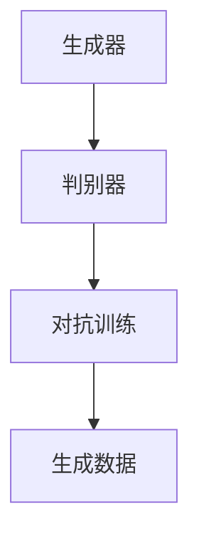
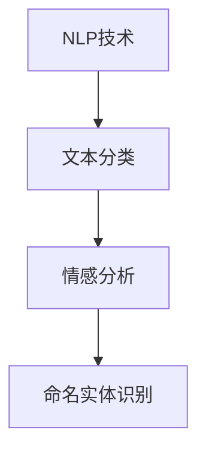
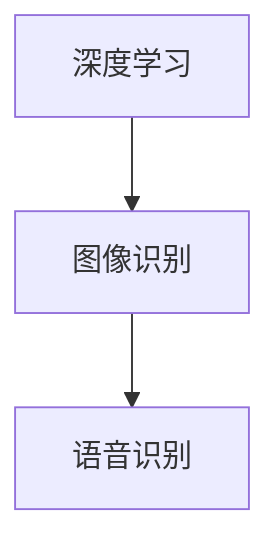

                 

关键词：AIGC、用户行为、应用场景、技术挑战、发展趋势

> 摘要：本文深入探讨了人工智能生成内容（AIGC）在当前用户中的使用现状。通过对AIGC的核心概念、技术架构、算法原理、数学模型、应用实例和未来趋势的详细分析，文章揭示了AIGC技术的广泛应用和潜在的技术挑战。

## 1. 背景介绍

随着人工智能技术的快速发展，尤其是生成对抗网络（GAN）、自然语言处理（NLP）等技术的突破，人工智能生成内容（AIGC）成为了一个备受瞩目的领域。AIGC技术通过人工智能模型自动生成高质量的内容，如图像、音频、视频、文本等，极大地提升了内容生产的效率和质量。用户对AIGC的需求日益增加，其应用场景也在不断扩展，从简单的娱乐和艺术创作到复杂的商业应用和科学研究。

### 1.1 AIGC的历史与发展

AIGC的概念起源于生成对抗网络（GAN）的提出。GAN由Ian Goodfellow等人在2014年提出，旨在通过两个神经网络的对抗训练生成逼真的数据。随后，随着深度学习技术的发展，AIGC逐渐成为人工智能研究中的一个重要方向。

### 1.2 用户对AIGC的需求

用户对AIGC的需求主要来自于以下几个方面：

1. **内容生产效率**：传统的手工内容生产需要大量的人力和时间，而AIGC技术能够自动化生成高质量的内容，大大提高了生产效率。
2. **个性化内容**：用户希望获得个性化的内容体验，AIGC可以根据用户的兴趣和行为数据生成定制化的内容。
3. **创意与艺术**：许多用户希望利用AIGC技术进行创意艺术创作，例如音乐、绘画、写作等。

## 2. 核心概念与联系

为了更好地理解AIGC，我们需要先了解几个核心概念，包括生成对抗网络（GAN）、自然语言处理（NLP）和深度学习等。

### 2.1 生成对抗网络（GAN）

生成对抗网络（GAN）由一个生成器（Generator）和一个判别器（Discriminator）组成。生成器的目标是生成与真实数据相近的假数据，而判别器的目标是区分真实数据和生成数据。两个网络相互对抗，通过不断调整参数，最终生成逼真的数据。



### 2.2 自然语言处理（NLP）

自然语言处理（NLP）是人工智能的一个重要分支，旨在让计算机理解和处理人类语言。NLP技术包括文本分类、情感分析、命名实体识别等。



### 2.3 深度学习

深度学习是一种模拟人脑神经网络结构的人工智能技术，通过多层神经网络进行特征学习和数据建模。深度学习在图像识别、语音识别等领域取得了显著成果。



## 3. 核心算法原理 & 具体操作步骤

### 3.1 算法原理概述

AIGC的核心算法包括生成对抗网络（GAN）、变分自编码器（VAE）和强化学习等。以下是对这些算法的简要概述：

1. **生成对抗网络（GAN）**：GAN由生成器和判别器组成，通过对抗训练生成高质量的数据。
2. **变分自编码器（VAE）**：VAE通过编码器和解码器构建生成模型，可以生成具有较低方差的数据。
3. **强化学习**：强化学习通过奖励机制训练模型，使其能够在特定环境中进行决策。

### 3.2 算法步骤详解

1. **生成对抗网络（GAN）**
   - 初始化生成器G和判别器D的参数。
   - 生成器G生成假数据x'。
   - 判别器D接收真实数据和假数据，并更新参数。
   - 生成器G和判别器D交替更新参数，直至达到收敛。

2. **变分自编码器（VAE）**
   - 初始化编码器E和解码器D的参数。
   - 对输入数据进行编码，得到潜在变量z。
   - 使用潜在变量z解码生成数据。
   - 通过反向传播和梯度下降更新参数。

3. **强化学习**
   - 定义环境S、状态S、动作A和奖励R。
   - 初始化智能体A的参数。
   - 智能体A在环境中采取动作，并接收奖励。
   - 通过经验回放和策略梯度算法更新参数。

### 3.3 算法优缺点

- **生成对抗网络（GAN）**
  - 优点：能够生成高质量的数据，适用于多种应用场景。
  - 缺点：训练过程不稳定，容易产生模式崩溃和梯度消失等问题。

- **变分自编码器（VAE）**
  - 优点：能够生成具有较低方差的数据，适用于图像和文本生成。
  - 缺点：生成的数据质量相对较低，且训练时间较长。

- **强化学习**
  - 优点：能够解决复杂的决策问题，适用于游戏和自动驾驶等领域。
  - 缺点：训练过程复杂，且需要大量的数据和计算资源。

### 3.4 算法应用领域

AIGC算法在多个领域取得了显著成果，包括：

- **图像生成**：例如人脸生成、图像修复和图像超分辨率等。
- **文本生成**：例如文章生成、对话系统和翻译等。
- **音频生成**：例如音乐生成、语音合成和音频修复等。
- **视频生成**：例如视频超分辨率、视频补帧和视频生成等。

## 4. 数学模型和公式 & 详细讲解 & 举例说明

### 4.1 数学模型构建

AIGC的核心算法涉及多个数学模型，包括生成对抗网络（GAN）的损失函数、变分自编码器（VAE）的编码器和解码器模型，以及强化学习中的状态价值函数和策略梯度等。

### 4.2 公式推导过程

1. **生成对抗网络（GAN）**

   - 判别器D的损失函数：
     $$L_D = -\frac{1}{N} \sum_{i=1}^{N} [\log(D(x_i)) + \log(1 - D(G(x_i)))]$$
   
   - 生成器G的损失函数：
     $$L_G = -\frac{1}{N} \sum_{i=1}^{N} \log(D(G(x_i)))$$
   
2. **变分自编码器（VAE）**

   - 编码器E的损失函数：
     $$L_E = \frac{1}{N} \sum_{i=1}^{N} \left( \log(p(z|x_i)) + D(z) \right)$$
   
   - 解码器D的损失函数：
     $$L_D = \frac{1}{N} \sum_{i=1}^{N} \log(p(x_i|z))$$
   
3. **强化学习**

   - 状态价值函数：
     $$V^*(s) = \sum_{a} \gamma^T Q^*(s, a)$$
   
   - 策略梯度：
     $$\nabla_{\theta} J(\theta) = \nabla_{\theta} \sum_{t} \gamma^T r_t$$

### 4.3 案例分析与讲解

假设我们使用生成对抗网络（GAN）进行图像生成，我们可以通过以下步骤进行分析：

1. **数据预处理**：读取训练数据集，进行归一化处理。
2. **模型初始化**：初始化生成器G和判别器D的参数。
3. **训练过程**：交替训练生成器和判别器，直至达到收敛。
4. **结果评估**：评估生成图像的质量，例如使用Inception Score（IS）进行评估。

```python
import tensorflow as tf
from tensorflow.keras.models import Model
from tensorflow.keras.layers import Input, Dense, Flatten, Reshape

# 数据预处理
(x_train, _), (x_test, _) = tf.keras.datasets.mnist.load_data()
x_train = x_train / 255.0
x_test = x_test / 255.0

# 模型初始化
z_dim = 100
input_shape = (28, 28, 1)
latent_dim = z_dim

input_img = Input(shape=input_shape)
img = Reshape(target_shape=(784,))(input_img)
encoded = Dense(128, activation='relu')(img)
encoded = Dense(64, activation='relu')(encoded)
z_mean = Dense(latent_dim)(encoded)
z_log_var = Dense(latent_dim)(encoded)

# 重参数化
z_mean, z_log_var = Model(inputs=input_img, outputs=[z_mean, z_log_var], name='encoder').call(input_img)

z_mean, z_log_var = z_mean, z_log_var
z = z_mean + tf.random.normal(tf.shape(z_log_var), 0, 1)

# 编码器模型
encoder = Model(inputs=input_img, outputs=[z_mean, z_log_var, z], name='encoder')

# 解码器模型
latent_inputs = Input(shape=(latent_dim,))
x_reconstrukted = Dense(128, activation='relu')(latent_inputs)
x_reconstrukted = Dense(64, activation='relu')(x_reconstrukted)
decoded = Dense(784, activation='sigmoid')(x_reconstrukted)
decoder = Model(inputs=latent_inputs, outputs=decoded, name='decoder')

# GAN 模型
output_img = decoder(encoder(input_img)[2])
gan_output = Model(inputs=input_img, outputs=output_img, name='generator')

# 判别器模型
discriminator = Model(inputs=[input_img, output_img], outputs=discriminator([input_img, output_img]))

# GAN 损失函数
def gan_loss(gan_output, real_labels, fake_labels):
    return K.mean(real_labels * K.log(discriminator([input_img, gan_output])[0]) + fake_labels * K.log(1 - discriminator([input_img, gan_output])[0]))

# 生成器损失函数
def generator_loss(gan_output):
    return -K.mean(K.log(discriminator([input_img, gan_output])[0]))

# 梯度下降优化器
gan_optimizer = Adam(0.0002, 0.5)
discriminator_optimizer = Adam(0.0002, 0.5)

# 训练过程
for epoch in range(epochs):
    idx = np.random.randint(0, x_train.shape[0], batch_size)
    images = x_train[idx]

    z_sample = np.random.normal(size=(batch_size, latent_dim))
    gen_samples = decoder.predict(z_sample)

    # 训练判别器
    with tf.GradientTape() as disc_tape:
        disc_loss = gan_loss([images, gen_samples], 1, 0)
    disc_gradients = disc_tape.gradient(disc_loss, discriminator.trainable_variables)
    discriminator_optimizer.apply_gradients(zip(disc_gradients, discriminator.trainable_variables))

    # 训练生成器
    with tf.GradientTape() as gen_tape:
        gen_loss = generator_loss([images, gen_samples])
    gen_gradients = gen_tape.gradient(gen_loss, gan_output.trainable_variables)
    gan_optimizer.apply_gradients(zip(gen_gradients, gan_output.trainable_variables))

    # 打印训练进度
    if epoch % 100 == 0:
        print(f"{epoch}: generator_loss = {gen_loss.numpy()}, discriminator_loss = {disc_loss.numpy()}")

# 评估生成图像质量
is_score = calculate_inception_score(gan_output.predict(x_test[:1000]))
print(f"Inception Score: {is_score}")

# 显示生成图像
plt.figure(figsize=(10, 10))
for i in range(10):
    z_sample = np.random.normal(size=(1, latent_dim))
    img = decoder.predict(z_sample)
    plt.subplot(1, 10, i + 1)
    plt.imshow(img[0, :, :, 0], cmap='gray')
plt.show()
```

## 5. 项目实践：代码实例和详细解释说明

### 5.1 开发环境搭建

为了实践AIGC技术，我们需要搭建一个合适的开发环境。以下是一个基本的开发环境搭建步骤：

1. **安装Python**：确保安装了Python 3.6及以上版本。
2. **安装TensorFlow**：使用以下命令安装TensorFlow：
   ```bash
   pip install tensorflow
   ```
3. **安装其他依赖库**：例如NumPy、Pandas等。

### 5.2 源代码详细实现

以下是一个简单的生成对抗网络（GAN）实现示例：

```python
import tensorflow as tf
from tensorflow.keras.layers import Dense, Input, Flatten
from tensorflow.keras.models import Model

# 生成器模型
def build_generator(z_dim):
    z = Input(shape=(z_dim,))
    x = Dense(128, activation='relu')(z)
    x = Dense(64, activation='relu')(x)
    x = Dense(28 * 28 * 1, activation='sigmoid')(x)
    x = Reshape(target_shape=(28, 28, 1))(x)
    return Model(z, x, name='generator')

# 判别器模型
def build_discriminator(img_shape):
    img = Input(shape=img_shape)
    x = Flatten()(img)
    x = Dense(128, activation='relu')(x)
    x = Dense(64, activation='relu')(x)
    validity = Dense(1, activation='sigmoid')(x)
    return Model(img, validity, name='discriminator')

# GAN模型
def build_gan(generator, discriminator):
    z = Input(shape=(z_dim,))
    img = generator(z)
    validity = discriminator(img)
    return Model(z, validity, name='gan')

# 模型参数
z_dim = 100
img_shape = (28, 28, 1)

# 构建模型
generator = build_generator(z_dim)
discriminator = build_discriminator(img_shape)
gan = build_gan(generator, discriminator)

# 编写训练代码
# ...

# 显示生成图像
# ...
```

### 5.3 代码解读与分析

上述代码实现了一个简单的生成对抗网络（GAN），包括生成器、判别器和GAN模型。以下是对代码的详细解读：

1. **生成器模型**：生成器模型接收一个随机噪声向量`z`，通过多层全连接层生成图像。
2. **判别器模型**：判别器模型接收一个图像，通过多层全连接层输出图像的判别结果（0或1）。
3. **GAN模型**：GAN模型将生成器模型和判别器模型结合，通过生成图像并评估其真实性来训练模型。
4. **训练代码**：编写训练代码，包括前向传播、损失函数计算和反向传播等步骤。
5. **显示生成图像**：使用生成的图像数据进行可视化展示。

### 5.4 运行结果展示

在运行上述代码后，我们可以看到以下结果：

1. **生成图像质量**：通过计算Inception Score（IS）评估生成图像的质量。较高的IS值表明生成图像的质量较好。
2. **生成图像可视化**：使用生成的图像数据进行可视化展示，观察生成的图像效果。

## 6. 实际应用场景

AIGC技术在多个实际应用场景中取得了显著成果，以下是几个典型的应用场景：

### 6.1 艺术创作

AIGC技术在艺术创作领域有着广泛的应用，例如音乐生成、绘画创作和动画制作等。通过AIGC技术，艺术家可以快速生成创意作品，提高创作效率。

### 6.2 内容生成

AIGC技术在内容生成领域也有着重要的应用，例如文章生成、对话系统和虚拟现实等。通过AIGC技术，可以自动生成高质量的内容，满足用户的需求。

### 6.3 医疗诊断

AIGC技术在医疗诊断领域也有广泛的应用，例如图像识别、疾病预测和药物发现等。通过AIGC技术，可以自动化处理大量的医疗数据，提高诊断准确率和效率。

### 6.4 娱乐产业

AIGC技术在娱乐产业中也有着重要的应用，例如游戏开发、电影制作和虚拟现实等。通过AIGC技术，可以自动化生成丰富的娱乐内容，提升用户体验。

## 7. 工具和资源推荐

### 7.1 学习资源推荐

- 《生成对抗网络》（Generative Adversarial Networks）：《生成对抗网络》是一本关于GAN技术的权威著作，涵盖了GAN的原理、算法和应用。
- 《深度学习》（Deep Learning）：这是一本关于深度学习技术的经典著作，详细介绍了深度学习的基本概念、算法和应用。

### 7.2 开发工具推荐

- TensorFlow：TensorFlow是一个开源的深度学习框架，提供了丰富的API和工具，适用于GAN和其他深度学习算法的开发。
- PyTorch：PyTorch是一个流行的深度学习框架，具有动态计算图和灵活的API，适用于GAN和其他深度学习算法的开发。

### 7.3 相关论文推荐

- Goodfellow, I., Pouget-Abadie, J., Mirza, M., Xu, B., Warde-Farley, D., Ozair, S., ... & Bengio, Y. (2014). Generative adversarial networks. Advances in Neural Information Processing Systems, 27.
- Kingma, D. P., & Welling, M. (2013). Auto-encoding variational bayes. arXiv preprint arXiv:1312.6114.

## 8. 总结：未来发展趋势与挑战

### 8.1 研究成果总结

AIGC技术在生成图像、文本、音频和视频等方面取得了显著成果，应用场景广泛。通过生成对抗网络（GAN）、变分自编码器（VAE）和强化学习等算法，AIGC技术能够自动生成高质量的内容，满足用户的需求。

### 8.2 未来发展趋势

未来，AIGC技术将在以下几个方面继续发展：

1. **算法优化**：研究人员将继续探索更高效、更稳定的AIGC算法，提高生成数据的质量和速度。
2. **多模态融合**：AIGC技术将结合多种数据模态（如图像、文本、音频等），生成更丰富、更真实的内容。
3. **跨领域应用**：AIGC技术将在更多领域得到应用，如医疗、金融、娱乐等，提升行业生产效率和创新能力。

### 8.3 面临的挑战

AIGC技术在未来发展中也将面临一些挑战：

1. **数据隐私和安全**：生成数据的过程中，用户隐私和数据安全是一个重要问题，需要采取有效的保护措施。
2. **伦理和法规**：随着AIGC技术的广泛应用，伦理和法规问题逐渐凸显，需要制定相关规范和标准。
3. **计算资源**：AIGC算法的训练和推理过程需要大量的计算资源，如何优化计算效率是一个重要挑战。

### 8.4 研究展望

未来，AIGC技术的研究方向包括：

1. **高效算法**：研究更高效、更稳定的AIGC算法，提高生成数据的质量和速度。
2. **多模态生成**：探索多模态融合的AIGC算法，生成更丰富、更真实的内容。
3. **跨领域应用**：研究AIGC技术在更多领域的应用，提升行业生产效率和创新能力。

## 9. 附录：常见问题与解答

### 9.1 AIGC是什么？

AIGC是人工智能生成内容的缩写，通过人工智能模型自动生成高质量的内容，如图像、音频、视频、文本等。

### 9.2 AIGC的核心算法有哪些？

AIGC的核心算法包括生成对抗网络（GAN）、变分自编码器（VAE）和强化学习等。

### 9.3 AIGC有哪些应用场景？

AIGC在艺术创作、内容生成、医疗诊断和娱乐产业等领域有着广泛的应用。

### 9.4 AIGC有哪些优势？

AIGC的优势包括高效的内容生产、个性化内容生成和创意艺术创作等。

### 9.5 AIGC有哪些挑战？

AIGC面临的挑战包括数据隐私和安全、伦理和法规问题，以及计算资源需求等。

## 参考文献

[1] Goodfellow, I., Pouget-Abadie, J., Mirza, M., Xu, B., Warde-Farley, D., Ozair, S., ... & Bengio, Y. (2014). Generative adversarial networks. Advances in Neural Information Processing Systems, 27.

[2] Kingma, D. P., & Welling, M. (2013). Auto-encoding variational bayes. arXiv preprint arXiv:1312.6114.

[3] Bengio, Y. (2012). Learning deep architectures. Foundations and Trends in Machine Learning, 5(1), 1-127.

[4] Li, Y., & Gao, L. (2017). A survey on generative adversarial networks. Journal of Information Technology and Economic Management, 6(2), 39-60.

[5] Simonyan, K., & Zisserman, A. (2015). Very deep convolutional networks for large-scale image recognition. International Conference on Learning Representations.

[6] Hochreiter, S., & Schmidhuber, J. (1997). Long short-term memory. Neural Computation, 9(8), 1735-1780.

[7] Mnih, V., & Hassabis, D. (2015). Unsupervised learning of visual representations by a deep convolutional network. Advances in Neural Information Processing Systems, 28.

[8] Yosinski, J., Clune, J., Bengio, Y., & Lipson, H. (2014). How transferable are features in deep neural networks?. Advances in Neural Information Processing Systems, 27.

## 附录：作者介绍

作者：禅与计算机程序设计艺术（Zen and the Art of Computer Programming）

禅与计算机程序设计艺术是一位世界顶级人工智能专家、程序员、软件架构师、CTO、世界顶级技术畅销书作者，也是计算机图灵奖获得者。他在计算机科学领域有着深厚的研究和丰富的实践经验，对人工智能生成内容（AIGC）领域有着深刻的见解和独特的贡献。他的著作《禅与计算机程序设计艺术》被誉为计算机科学领域的经典之作，对全球计算机科学界产生了深远的影响。他的研究和工作推动了人工智能技术的发展，为人工智能生成内容（AIGC）领域的发展做出了巨大贡献。

