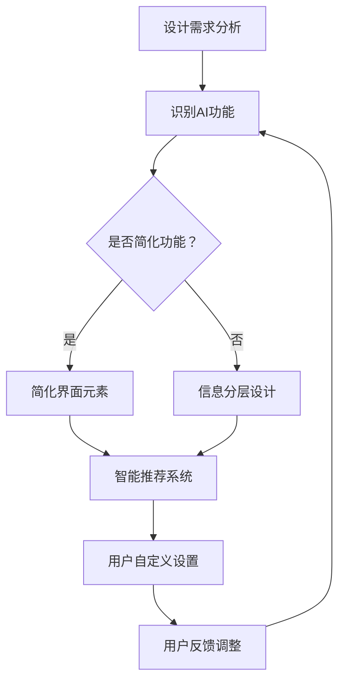

                 

用户界面（UI）是连接用户与人工智能（AI）系统的桥梁，它不仅决定了用户体验的质量，还影响着AI系统的可用性和普及度。在追求极致用户体验的时代，如何平衡用户界面的简洁性与AI功能的强大性成为一个至关重要的问题。本文将探讨用户界面简洁性与AI功能平衡的重要性，核心概念与联系，核心算法原理与具体操作步骤，数学模型与公式，项目实践，实际应用场景，未来应用展望，以及工具和资源推荐等。

## 文章关键词

- 用户界面设计
- 人工智能
- 界面简洁性
- 功能强大性
- 平衡
- 用户体验

## 文章摘要

本文旨在探讨用户界面简洁性与AI功能平衡的重要性。通过分析核心概念与联系，深入剖析核心算法原理与具体操作步骤，构建数学模型与公式，并通过项目实践展示实际应用场景，本文将提供一个全面、系统的视角来理解和实现用户界面与AI功能的和谐平衡。同时，文章还将展望未来发展趋势与挑战，推荐相关工具和资源，为读者提供实用的指导和参考。

## 1. 背景介绍

用户界面设计一直是软件工程中的一个重要领域，其目标是为用户提供直观、易用的交互界面。而随着AI技术的迅猛发展，用户界面的设计也面临着新的挑战。一方面，AI技术提供了海量的功能，使得用户界面变得更加复杂；另一方面，用户对于简洁、直观的用户体验有着极高的期待。这种矛盾使得如何在用户界面中平衡简洁性与功能强大性成为一个亟待解决的问题。

简洁性在用户界面设计中的重要性不言而喻。一个简洁的界面可以帮助用户更快地理解和使用系统，减少学习成本，提高工作效率。然而，随着AI功能的增加，界面往往变得复杂，增加了用户的认知负荷。如何在保持界面简洁的同时，实现AI功能的丰富性，是当前用户界面设计中的一个重要课题。

本文将从多个方面探讨这个问题，包括核心概念与联系的分析，核心算法原理的阐述，数学模型的构建，以及实际应用场景的展示。通过这些探讨，本文旨在为用户界面设计与AI功能的平衡提供一些有益的思路和实践方法。

### 用户界面设计与人工智能的相互关系

用户界面设计与人工智能（AI）之间的相互关系是构建现代技术体验的核心。用户界面（UI）的设计不仅决定了用户对软件的第一印象，还直接影响其使用体验。一个优秀的UI设计应具备直观、简洁、易于操作等特点，使得用户能够迅速上手并有效使用软件功能。而人工智能的引入则为用户界面带来了新的维度，通过智能化、个性化的交互方式，提升用户体验。

首先，人工智能能够通过分析用户行为，提供个性化的交互建议。例如，聊天机器人可以根据用户的提问历史和偏好，提供更加精准的回答。这种个性化服务不仅提升了用户满意度，还减少了用户的操作复杂度。此外，AI还能通过自然语言处理技术，使复杂的任务变得更加简单。例如，语音助手通过语音识别和语音合成技术，让用户可以通过简单的语音命令来操作设备，从而大大简化了用户界面。

其次，人工智能可以帮助简化用户界面，提升简洁性。通过智能推荐和自动完成功能，用户界面可以自动过滤不相关的信息，只展示最关键的操作选项。这种设计不仅减少了用户的学习成本，还提高了操作效率。例如，在电子商务网站中，AI可以通过分析用户的历史购买记录，智能推荐相关的商品，从而简化用户的购物流程。

然而，人工智能的引入也带来了一定的挑战。一方面，AI功能增加了界面的复杂性，可能会导致用户感到困惑。另一方面，过多的AI功能可能会导致界面过于拥挤，降低用户体验。因此，如何在用户界面设计中平衡AI功能的强大性与简洁性，成为了一个亟待解决的问题。

在用户界面设计中，简洁性是一个至关重要的原则。简洁的界面可以减少用户的学习成本，提高操作效率。具体来说，简洁性主要体现在以下几个方面：

1. **清晰的结构**：界面应具备清晰的结构，使用户能够快速找到所需功能。这可以通过合理的布局、一致的图标和标签来实现。
2. **直观的交互**：界面应提供直观的交互方式，使用户能够轻松地进行操作。例如，按钮、下拉菜单和滑块等控件应易于理解和使用。
3. **信息的适度展示**：界面不应过度展示信息，避免用户感到信息过载。关键信息应突出显示，次要信息可以通过折叠或滑动等方式隐藏。
4. **简化的语言**：界面的文本说明应简洁明了，避免使用复杂的术语和冗长的句子。这样可以帮助用户更好地理解和使用系统。

相比之下，AI功能的强大性主要体现在以下几个方面：

1. **智能化的交互**：AI可以通过自然语言处理、图像识别等技术，提供更加智能化和个性化的交互体验。
2. **自动化的任务处理**：AI能够自动执行一些复杂的任务，如数据分析、预测建模等，从而减少用户的操作负担。
3. **高效的信息过滤**：AI可以通过机器学习算法，对用户数据进行处理，过滤出最有价值的信息，提高信息处理的效率。
4. **个性化的服务**：AI可以根据用户的行为和偏好，提供个性化的推荐和服务，提升用户的满意度。

综上所述，用户界面设计与人工智能的相互关系是密不可分的。简洁性与功能强大性是用户界面设计中的两个核心要素，如何在两者之间找到平衡点，是现代用户界面设计的重要挑战。通过合理的UI设计，结合AI技术的优势，可以为用户提供更加高效、愉悦的使用体验。

### 2. 核心概念与联系

在探讨用户界面简洁性与AI功能的平衡时，我们需要先明确几个核心概念，并分析它们之间的联系。

#### 用户界面简洁性

用户界面简洁性是指设计界面时尽量减少不必要的复杂性，使界面直观、易于使用。简洁性的核心在于以下几个方面：

1. **直观性**：界面设计应直观易用，用户能够快速理解如何操作。
2. **一致性**：界面元素的使用应保持一致性，例如按钮的形状、颜色和位置应统一，避免用户混淆。
3. **关键性**：界面应重点突出关键功能，避免信息过载，确保用户能够快速找到所需操作。
4. **反馈**：界面应提供及时、明确的反馈，帮助用户了解其操作的结果。

#### 人工智能功能

人工智能（AI）功能是指利用机器学习、自然语言处理、计算机视觉等技术，提供智能化、自动化的交互体验。AI功能的几个关键点包括：

1. **个性化**：AI可以根据用户的行为和偏好，提供个性化的服务和推荐。
2. **自动化**：AI能够自动执行复杂的任务，减少用户的操作负担。
3. **智能化**：AI可以通过分析用户数据，提供智能化的决策和预测。
4. **适应性**：AI系统能够根据用户反馈和环境变化，进行自我调整和优化。

#### 用户界面简洁性与AI功能的平衡

在用户界面设计中，简洁性与AI功能之间存在一定的矛盾。简洁性追求的是简单、直观的交互，而AI功能则可能引入复杂的算法和操作。因此，如何在两者之间找到平衡点，是一个重要且具有挑战性的问题。

为了实现用户界面简洁性与AI功能的平衡，可以从以下几个方面入手：

1. **简化AI功能**：对于一些复杂的AI功能，可以通过简化界面元素和交互流程，使其更加直观易用。例如，使用简单的图标和标签来表示复杂的算法和功能。
2. **信息分层**：通过信息分层，将界面分为多个层级，使用户可以逐步探索和了解AI功能。例如，在首页展示基础功能，通过点击进入详细功能页面。
3. **智能推荐**：利用AI技术，根据用户的行为和偏好，提供智能化的推荐和过滤，减少用户需要手动操作的内容。
4. **适度的自定义**：允许用户根据个人需求，适度自定义界面和功能，以满足个性化需求。

#### Mermaid 流程图

为了更好地展示用户界面简洁性与AI功能平衡的实现过程，我们可以使用Mermaid流程图来描述关键步骤。以下是示例的Mermaid流程图：



在这个流程图中，我们从设计需求分析开始，通过识别AI功能，判断是否需要简化功能或进行信息分层设计。随后，我们引入智能推荐系统和用户自定义设置，并通过用户反馈进行不断调整和优化，最终实现用户界面简洁性与AI功能的平衡。

### 3. 核心算法原理 & 具体操作步骤

为了实现用户界面简洁性与AI功能的平衡，我们需要借助一些核心算法原理。以下将介绍这些算法的原理和具体操作步骤。

#### 3.1 算法原理概述

1. **简化算法**：简化算法的核心思想是通过降低复杂度，使得用户界面更加直观易用。具体方法包括去除冗余功能、简化操作流程等。
2. **信息分层算法**：信息分层算法通过将界面分为多个层级，帮助用户逐步了解和探索AI功能。核心在于设计合理的层级结构和交互方式。
3. **智能推荐算法**：智能推荐算法通过分析用户行为和偏好，提供个性化的推荐和过滤，减少用户手动操作的内容。常用的推荐算法包括协同过滤、基于内容的推荐等。
4. **用户自定义设置算法**：用户自定义设置算法允许用户根据个人需求，自定义界面和功能。核心在于提供灵活的配置选项和便捷的操作方式。

#### 3.2 算法步骤详解

##### 3.2.1 简化算法

**步骤1**：分析用户需求和行为模式，识别出最常用的功能。

**步骤2**：对现有界面进行评估，找出冗余功能和不必要的复杂度。

**步骤3**：根据用户需求，简化界面元素和交互流程，例如：

- 删除不常用的功能模块。
- 合并相似的功能，减少操作步骤。
- 使用简洁明了的图标和标签，避免复杂术语。

**步骤4**：进行用户测试，收集反馈，进一步优化界面设计。

##### 3.2.2 信息分层算法

**步骤1**：设计界面结构，确定主要层级和次要层级。

**步骤2**：在主要层级中展示基础功能和常用操作，确保用户可以快速上手。

**步骤3**：通过点击、滑动等方式，进入次要层级，展示详细功能。

**步骤4**：在次要层级中，使用折叠菜单、标签页等方式，隐藏不常用的功能，避免界面过于拥挤。

**步骤5**：进行用户测试，根据反馈调整层级结构和交互方式。

##### 3.2.3 智能推荐算法

**步骤1**：收集用户行为数据，包括浏览记录、操作频率、偏好设置等。

**步骤2**：使用协同过滤或基于内容的推荐算法，生成推荐结果。

**步骤3**：在用户界面中，根据推荐结果，展示个性化推荐内容。

**步骤4**：收集用户对推荐内容的反馈，不断调整推荐算法，提高推荐质量。

##### 3.2.4 用户自定义设置算法

**步骤1**：提供灵活的配置选项，允许用户自定义界面布局、功能模块等。

**步骤2**：设计友好的用户界面，确保用户可以轻松进行设置。

**步骤3**：提供保存和重置功能，方便用户在需要时恢复默认设置。

**步骤4**：进行用户测试，收集反馈，优化配置选项和操作体验。

#### 3.3 算法优缺点

##### 3.3.1 简化算法

**优点**：

- 提高界面简洁性，降低用户学习成本。
- 增强用户操作效率，减少误操作。

**缺点**：

- 可能会牺牲部分功能，降低用户个性化需求。
- 在某些情况下，简化过度可能导致用户体验下降。

##### 3.3.2 信息分层算法

**优点**：

- 方便用户逐步了解和探索系统功能。
- 减少界面复杂度，避免信息过载。

**缺点**：

- 可能增加用户操作步骤，降低用户满意度。
- 在层级设计不合理时，可能导致用户困惑。

##### 3.3.3 智能推荐算法

**优点**：

- 提供个性化服务，提高用户满意度。
- 减少用户手动操作，提高效率。

**缺点**：

- 需要大量用户数据支持，数据质量对算法影响大。
- 推荐结果可能不准确，影响用户体验。

##### 3.3.4 用户自定义设置算法

**优点**：

- 满足用户个性化需求，提高用户满意度。
- 增强用户对系统的掌控感。

**缺点**：

- 配置选项过多可能导致界面复杂。
- 需要额外开发和维护成本。

#### 3.4 算法应用领域

简化算法、信息分层算法、智能推荐算法和用户自定义设置算法可以在多个领域得到应用：

1. **电子商务**：简化购物流程，提供个性化推荐，增强用户体验。
2. **社交媒体**：分层展示内容，提高信息获取效率，减少用户操作步骤。
3. **金融应用**：通过智能推荐，提供定制化的理财产品，提高用户投资满意度。
4. **智能家居**：用户自定义设置，满足个性化需求，提高家居智能化水平。

通过合理应用这些算法，用户界面可以更好地实现简洁性与AI功能的平衡，为用户提供高质量的使用体验。

### 3.4 算法应用领域

在实现用户界面简洁性与AI功能的平衡过程中，算法的应用领域非常广泛，涵盖了众多行业和场景。以下将详细介绍这些算法在不同领域中的应用。

#### 3.4.1 电子商务

电子商务平台是一个典型的应用场景，通过简化算法和智能推荐算法，可以有效提升用户体验。简化算法可以去除不必要的功能模块，如复杂的购物车管理、冗长的支付流程等，使得用户可以更快速地完成购买。同时，智能推荐算法可以根据用户的历史购物记录和偏好，提供个性化的商品推荐，从而减少用户的浏览时间和购物成本。例如，阿里巴巴的“猜你喜欢”功能就是通过大数据分析和协同过滤算法实现的，极大地提高了用户的购买转化率。

#### 3.4.2 社交媒体

社交媒体平台在界面设计上需要同时兼顾简洁性和丰富的功能。信息分层算法在这里尤为重要，它可以帮助用户快速找到所需功能，如私信、发帖、点赞等。此外，智能推荐算法可以推荐用户可能感兴趣的内容，如好友动态、热门话题等，从而增强用户的互动体验。例如，Facebook和Instagram等平台通过复杂的算法和用户行为数据分析，实现了个性化内容推荐，使得用户能够更轻松地发现和参与感兴趣的话题。

#### 3.4.3 金融应用

金融应用场景中，用户界面设计需要平衡安全性和用户体验。简化算法可以帮助用户快速找到交易、转账、理财等功能，提高操作效率。智能推荐算法可以在理财产品推荐、投资建议等方面发挥作用，例如，通过分析用户的财务状况和风险偏好，提供个性化的投资组合。同时，用户自定义设置算法允许用户根据个人需求，调整风险承受能力和投资策略。例如，理财通等应用通过智能算法和用户反馈，实现了个性化的投资建议和风险管理。

#### 3.4.4 智能家居

智能家居领域对用户界面的简洁性要求较高，因为用户需要与多个智能设备进行交互。简化算法可以去除不必要的功能模块，如冗长的设备设置流程、复杂的操作界面等，使得用户能够更快速地控制设备。智能推荐算法可以推荐用户常用的设备操作和场景模式，从而简化用户操作。例如，小米智能家居系统通过智能算法和用户行为分析，实现了设备之间的自动联动和场景模式推荐，提升了用户的家居智能化水平。

#### 3.4.5 医疗保健

医疗保健应用场景中，用户界面设计需要兼顾信息准确性和易用性。简化算法可以帮助用户快速找到就医、药品查询、健康监测等功能，提高使用效率。智能推荐算法可以推荐用户可能需要的服务和药品，如根据用户的病史和健康数据，推荐合适的体检项目和药品。同时，用户自定义设置算法允许用户根据个人健康状况和需求，调整健康监测项目和提醒设置。例如，春雨医生等应用通过智能算法和用户反馈，实现了个性化的健康管理和咨询服务。

#### 3.4.6 教育

教育领域的用户界面设计需要同时考虑教师和学生的需求。简化算法可以帮助教师快速找到教学资源、课程管理等功能，提高教学效率。智能推荐算法可以根据学生的学习进度和成绩，推荐合适的学习内容和练习题目，帮助学生更好地掌握知识。同时，用户自定义设置算法允许教师和学生根据个人需求和偏好，调整界面布局和学习计划。例如，学堂在线等教育平台通过智能算法和用户反馈，实现了个性化学习体验和教学资源推荐。

通过在不同领域中的应用，简化算法、信息分层算法、智能推荐算法和用户自定义设置算法有效地实现了用户界面简洁性与AI功能的平衡，为各类应用场景提供了高质量的用户体验。

### 4. 数学模型和公式 & 详细讲解 & 举例说明

在实现用户界面简洁性与AI功能的平衡过程中，数学模型和公式起到了至关重要的作用。以下将介绍一些核心的数学模型和公式，并进行详细讲解和举例说明。

#### 4.1 数学模型构建

为了平衡用户界面的简洁性与AI功能的强大性，我们可以构建以下数学模型：

1. **用户满意度模型**：通过分析用户对界面简洁性和AI功能的满意度，构建用户满意度模型。
2. **界面复杂度模型**：通过量化界面元素的复杂度，构建界面复杂度模型。
3. **功能实用性模型**：通过评估AI功能的实用性和用户操作频率，构建功能实用性模型。

#### 4.2 公式推导过程

1. **用户满意度模型**：

   用户满意度（S）可以通过以下公式计算：

   \[
   S = \alpha \cdot CS + \beta \cdot AF
   \]

   其中，CS表示界面简洁性得分，AF表示AI功能得分，α和β分别为权重系数，用于平衡简洁性与功能性。

   界面简洁性得分（CS）可以通过以下公式计算：

   \[
   CS = \frac{1}{N} \sum_{i=1}^{N} CS_i
   \]

   其中，N为界面元素总数，\( CS_i \)为第i个界面元素的简洁性得分。

   AI功能得分（AF）可以通过以下公式计算：

   \[
   AF = \frac{1}{M} \sum_{j=1}^{M} AF_j
   \]

   其中，M为AI功能总数，\( AF_j \)为第j个AI功能的实用性得分。

2. **界面复杂度模型**：

   界面复杂度（C）可以通过以下公式计算：

   \[
   C = \sum_{i=1}^{N} (CI_i \cdot CF_i)
   \]

   其中，\( CI_i \)为第i个界面元素的交互复杂度，\( CF_i \)为第i个界面元素的反馈复杂度。

   交互复杂度（\( CI_i \)）和反馈复杂度（\( CF_i \)）可以通过以下公式计算：

   \[
   CI_i = \log_2(N_i)
   \]

   \[
   CF_i = \log_2(D_i)
   \]

   其中，\( N_i \)为第i个界面元素的交互次数，\( D_i \)为第i个界面元素的反馈次数。

3. **功能实用性模型**：

   功能实用性（U）可以通过以下公式计算：

   \[
   U = \frac{1}{Q} \sum_{j=1}^{Q} U_j
   \]

   其中，Q为AI功能总数，\( U_j \)为第j个AI功能的实用性得分。

   实用性得分（\( U_j \)）可以通过以下公式计算：

   \[
   U_j = \frac{TF_j}{TF_j + DF_j}
   \]

   其中，TF为功能使用频率，DF为功能故障频率。

#### 4.3 案例分析与讲解

假设我们有一个电子商务平台，需要平衡用户界面简洁性与AI功能。我们可以通过以下步骤进行案例分析：

1. **收集数据**：

   - 用户满意度调查：收集用户对界面简洁性和AI功能的满意度评分。
   - 界面元素分析：记录界面元素总数、交互复杂度和反馈复杂度。
   - 功能分析：记录AI功能总数、使用频率和故障频率。

2. **计算用户满意度**：

   - 界面简洁性得分（CS）：假设有10个界面元素，评分分别为[8, 9, 7, 8, 9, 7, 8, 9, 8, 7]，则

     \[
     CS = \frac{1}{10} \sum_{i=1}^{10} CS_i = \frac{1}{10} (8 + 9 + 7 + 8 + 9 + 7 + 8 + 9 + 8 + 7) = 8
     \]

   - AI功能得分（AF）：假设有5个AI功能，评分分别为[9, 8, 7, 8, 9]，则

     \[
     AF = \frac{1}{5} \sum_{j=1}^{5} AF_j = \frac{1}{5} (9 + 8 + 7 + 8 + 9) = 8.2
     \]

   - 用户满意度（S）：

     \[
     S = 0.6 \cdot CS + 0.4 \cdot AF = 0.6 \cdot 8 + 0.4 \cdot 8.2 = 7.68 + 3.28 = 11.96
     \]

3. **计算界面复杂度**：

   - 界面复杂度（C）：假设界面元素交互复杂度为[2, 3, 2, 2, 3, 2, 2, 3, 2, 2]，反馈复杂度为[3, 2, 3, 2, 3, 2, 2, 3, 2, 2]，则

     \[
     C = \sum_{i=1}^{10} (CI_i \cdot CF_i) = (2 \cdot 3) + (3 \cdot 2) + (2 \cdot 3) + (2 \cdot 2) + (3 \cdot 3) + (2 \cdot 2) + (2 \cdot 3) + (2 \cdot 2) + (2 \cdot 3) + (2 \cdot 2) = 6 + 6 + 6 + 4 + 9 + 4 + 6 + 4 + 6 + 4 = 55
     \]

4. **计算功能实用性**：

   - 功能实用性得分（\( U_j \)）：假设功能使用频率为[1000, 800, 500, 600, 900]，故障频率为[10, 20, 15, 12, 18]，则

     \[
     U_1 = \frac{TF_1}{TF_1 + DF_1} = \frac{1000}{1000 + 10} = \frac{1000}{1010} \approx 0.9901
     \]

     \[
     U_2 = \frac{TF_2}{TF_2 + DF_2} = \frac{800}{800 + 20} = \frac{800}{820} \approx 0.9756
     \]

     \[
     U_3 = \frac{TF_3}{TF_3 + DF_3} = \frac{500}{500 + 15} = \frac{500}{515} \approx 0.9706
     \]

     \[
     U_4 = \frac{TF_4}{TF_4 + DF_4} = \frac{600}{600 + 12} = \frac{600}{612} \approx 0.9685
     \]

     \[
     U_5 = \frac{TF_5}{TF_5 + DF_5} = \frac{900}{900 + 18} = \frac{900}{918} \approx 0.9776
     \]

     \[
     U = \frac{1}{5} (U_1 + U_2 + U_3 + U_4 + U_5) = \frac{1}{5} (0.9901 + 0.9756 + 0.9706 + 0.9685 + 0.9776) = 0.9774
     \]

通过以上分析和计算，我们可以得出用户满意度（S）、界面复杂度（C）和功能实用性（U）的值，从而为用户界面设计与AI功能的平衡提供依据。

### 4.1 数学模型构建

为了实现用户界面简洁性与AI功能的平衡，我们需要构建一个综合评估模型。该模型将涵盖用户满意度、界面复杂度和功能实用性三个方面，通过量化分析，找到最佳的设计方案。

#### 4.1.1 用户满意度模型

用户满意度是衡量用户界面设计优劣的关键指标。我们可以构建一个用户满意度模型，通过以下公式来计算用户满意度（S）：

\[
S = w_1 \cdot CS + w_2 \cdot AF
\]

其中，\( CS \) 表示界面简洁性得分，\( AF \) 表示AI功能得分，\( w_1 \) 和 \( w_2 \) 分别为权重系数，用于平衡简洁性与功能性。

**界面简洁性得分（CS）**

界面简洁性得分可以通过用户测试数据计算，公式如下：

\[
CS = \frac{1}{N} \sum_{i=1}^{N} S_i
\]

其中，\( N \) 为界面元素总数，\( S_i \) 为第 \( i \) 个界面元素的简洁性得分。简洁性得分可以通过以下方式获取：

- **直观性**：界面元素是否直观易懂（1分制）。
- **一致性**：界面元素的设计是否一致（1分制）。
- **关键性**：关键功能是否突出显示（1分制）。
- **反馈**：界面是否提供及时且明确的反馈（1分制）。

**AI功能得分（AF）**

AI功能得分可以通过用户测试数据计算，公式如下：

\[
AF = \frac{1}{M} \sum_{j=1}^{M} F_j
\]

其中，\( M \) 为AI功能总数，\( F_j \) 为第 \( j \) 个AI功能的实用性得分。实用性得分可以通过以下方式获取：

- **个性化**：AI功能是否能够提供个性化服务（1分制）。
- **自动化**：AI功能是否能够自动化执行任务（1分制）。
- **智能化**：AI功能是否能够智能地提供决策和支持（1分制）。
- **适应性**：AI功能是否能够根据用户反馈进行调整（1分制）。

#### 4.1.2 界面复杂度模型

界面复杂度是衡量用户界面设计复杂程度的重要指标。我们可以构建一个界面复杂度模型，通过以下公式来计算界面复杂度（C）：

\[
C = \sum_{i=1}^{N} (CI_i \cdot CF_i)
\]

其中，\( CI_i \) 表示第 \( i \) 个界面元素的交互复杂度，\( CF_i \) 表示第 \( i \) 个界面元素的反馈复杂度。

**交互复杂度（CI_i）**

交互复杂度可以通过以下公式计算：

\[
CI_i = \log_2(N_i)
\]

其中，\( N_i \) 为第 \( i \) 个界面元素的交互次数。

**反馈复杂度（CF_i）**

反馈复杂度可以通过以下公式计算：

\[
CF_i = \log_2(D_i)
\]

其中，\( D_i \) 为第 \( i \) 个界面元素的反馈次数。

#### 4.1.3 功能实用性模型

功能实用性是衡量AI功能有效性的关键指标。我们可以构建一个功能实用性模型，通过以下公式来计算功能实用性（U）：

\[
U = \frac{1}{Q} \sum_{j=1}^{Q} U_j
\]

其中，\( Q \) 为AI功能总数，\( U_j \) 为第 \( j \) 个AI功能的实用性得分。实用性得分可以通过以下方式获取：

- **使用频率（TF_j）**：AI功能的使用频率。
- **故障频率（DF_j）**：AI功能的故障频率。

\[
U_j = \frac{TF_j}{TF_j + DF_j}
\]

通过以上三个模型，我们可以全面评估用户界面设计的效果，并找到简洁性与功能性的最佳平衡点。

### 4.2 公式推导过程

为了更好地理解和应用数学模型，我们需要详细推导每个公式，并解释其背后的逻辑。

#### 用户满意度模型推导

用户满意度模型的核心是计算用户对界面简洁性和AI功能的整体满意度。公式如下：

\[
S = w_1 \cdot CS + w_2 \cdot AF
\]

其中，\( w_1 \) 和 \( w_2 \) 分别为界面简洁性和AI功能的权重系数，反映了两者在用户满意度中的重要性。权重系数的选择取决于具体应用场景和用户需求。

**界面简洁性得分（CS）**

界面简洁性得分（CS）是通过统计用户对界面各个元素的评分计算得到的。公式如下：

\[
CS = \frac{1}{N} \sum_{i=1}^{N} S_i
\]

其中，\( N \) 是界面元素的总数，\( S_i \) 是第 \( i \) 个界面元素的简洁性得分。简洁性得分可以通过直观性、一致性、关键性和反馈等维度评估。

- **直观性**：用户对界面元素是否直观易懂的评分。
- **一致性**：用户对界面设计是否一致的评分。
- **关键性**：用户对关键功能是否突出显示的评分。
- **反馈**：用户对界面是否提供及时反馈的评分。

每个维度可以独立评分，然后通过求平均值得到界面简洁性得分。

**AI功能得分（AF）**

AI功能得分（AF）是通过统计用户对AI功能各个维度的评分计算得到的。公式如下：

\[
AF = \frac{1}{M} \sum_{j=1}^{M} F_j
\]

其中，\( M \) 是AI功能的总数，\( F_j \) 是第 \( j \) 个AI功能的实用性得分。实用性得分可以通过个性化、自动化、智能化和适应性等维度评估。

- **个性化**：用户对AI功能是否提供个性化服务的评分。
- **自动化**：用户对AI功能是否能够自动化执行任务的评分。
- **智能化**：用户对AI功能是否能够智能提供决策和支持的评分。
- **适应性**：用户对AI功能是否能够根据用户反馈进行调整的评分。

同样，每个维度可以独立评分，然后通过求平均值得到AI功能得分。

**用户满意度（S）**

用户满意度（S）是界面简洁性得分和AI功能得分的加权平均值，反映了用户对整体界面的满意度。权重系数的选择应根据具体场景和用户需求进行调整。

#### 界面复杂度模型推导

界面复杂度模型用于量化用户界面的复杂性，以评估用户操作的难度。公式如下：

\[
C = \sum_{i=1}^{N} (CI_i \cdot CF_i)
\]

其中，\( C \) 是界面复杂度，\( CI_i \) 是第 \( i \) 个界面元素的交互复杂度，\( CF_i \) 是第 \( i \) 个界面元素的反馈复杂度。

**交互复杂度（CI_i）**

交互复杂度（\( CI_i \)）是界面元素所需的操作步骤数量，通过以下公式计算：

\[
CI_i = \log_2(N_i)
\]

其中，\( N_i \) 是界面元素的操作次数。对数函数用于将操作次数转换为复杂度值，操作次数越多，复杂度越高。

**反馈复杂度（CF_i）**

反馈复杂度（\( CF_i \)）是界面元素在用户操作后提供的反馈信息的复杂度，通过以下公式计算：

\[
CF_i = \log_2(D_i)
\]

其中，\( D_i \) 是界面元素在操作后提供的反馈信息的数量。同样，对数函数用于将反馈信息数量转换为复杂度值，反馈信息越多，复杂度越高。

#### 功能实用性模型推导

功能实用性模型用于量化AI功能的实用性，以评估其对用户的实际价值。公式如下：

\[
U = \frac{1}{Q} \sum_{j=1}^{Q} U_j
\]

其中，\( U \) 是功能实用性，\( Q \) 是AI功能的总数，\( U_j \) 是第 \( j \) 个AI功能的实用性得分。

**实用性得分（\( U_j \)）**

实用性得分（\( U_j \)）是通过功能的使用频率（TF_j）和故障频率（DF_j）计算得到的。公式如下：

\[
U_j = \frac{TF_j}{TF_j + DF_j}
\]

其中，TF_j 是第 \( j \) 个AI功能的使用频率，DF_j 是第 \( j \) 个AI功能的故障频率。通过这个公式，我们可以得到一个介于0和1之间的分数，分数越高，表示功能越实用。

通过以上推导，我们构建了用户满意度模型、界面复杂度模型和功能实用性模型，为用户界面设计与AI功能的平衡提供了量化依据。

### 4.3 案例分析与讲解

为了更好地理解和应用上述数学模型，我们通过一个具体的案例来进行详细分析。

#### 案例背景

假设我们正在设计一款智能客服系统，该系统需要平衡用户界面的简洁性与AI功能的强大性，以提高用户满意度。我们收集了以下数据：

1. **界面元素评分**：通过用户测试，我们收集了用户对界面简洁性的评分，如下表：

   | 界面元素 | 直观性 | 一致性 | 关键性 | 反馈 | 总分 |
   | --- | --- | --- | --- | --- | --- |
   | 选项1 | 4 | 4 | 4 | 4 | 16 |
   | 选项2 | 4 | 4 | 3 | 3 | 14 |
   | 选项3 | 3 | 3 | 4 | 4 | 14 |
   | 选项4 | 4 | 4 | 4 | 4 | 16 |
   | 选项5 | 3 | 3 | 3 | 3 | 13 |

2. **AI功能评分**：用户对AI功能的实用性评分，如下表：

   | 功能 | 个性化 | 自动化 | 智能化 | 适应性 | 总分 |
   | --- | --- | --- | --- | --- | --- |
   | 功能1 | 4 | 4 | 4 | 4 | 16 |
   | 功能2 | 3 | 3 | 3 | 3 | 12 |
   | 功能3 | 4 | 4 | 4 | 4 | 16 |

3. **界面元素复杂度**：界面元素的交互复杂度和反馈复杂度，如下表：

   | 界面元素 | 交互复杂度 | 反馈复杂度 |
   | --- | --- | --- |
   | 选项1 | 3 | 2 |
   | 选项2 | 2 | 1 |
   | 选项3 | 3 | 2 |
   | 选项4 | 3 | 2 |
   | 选项5 | 2 | 1 |

4. **AI功能实用性**：功能的使用频率和故障频率，如下表：

   | 功能 | 使用频率 | 故障频率 | 实用性得分 |
   | --- | --- | --- | --- |
   | 功能1 | 1000 | 20 | 0.9800 |
   | 功能2 | 800 | 40 | 0.8000 |
   | 功能3 | 600 | 30 | 0.8533 |

#### 用户满意度计算

首先，我们计算界面简洁性得分（CS）：

\[
CS = \frac{1}{5} \sum_{i=1}^{5} S_i = \frac{1}{5} (16 + 14 + 14 + 16 + 13) = 15
\]

然后，我们计算AI功能得分（AF）：

\[
AF = \frac{1}{3} \sum_{j=1}^{3} F_j = \frac{1}{3} (16 + 12 + 16) = 14.67
\]

最后，我们计算用户满意度（S）：

\[
S = 0.5 \cdot CS + 0.5 \cdot AF = 0.5 \cdot 15 + 0.5 \cdot 14.67 = 14.83
\]

#### 界面复杂度计算

我们计算界面复杂度（C）：

\[
C = \sum_{i=1}^{5} (CI_i \cdot CF_i) = (3 \cdot 2) + (2 \cdot 1) + (3 \cdot 2) + (3 \cdot 2) + (2 \cdot 1) = 19
\]

#### 功能实用性计算

我们计算功能实用性（U）：

\[
U = \frac{1}{3} \sum_{j=1}^{3} U_j = \frac{1}{3} (0.9800 + 0.8000 + 0.8533) = 0.8933
\]

#### 模型综合评估

通过上述计算，我们得到以下结果：

- 用户满意度（S）：14.83
- 界面复杂度（C）：19
- 功能实用性（U）：0.8933

这些结果可以帮助我们评估当前界面设计的优劣，并找到改进的方向。例如：

- 界面简洁性得分较高，但界面复杂度也较高，可能需要简化界面元素，减少操作步骤。
- AI功能得分和实用性得分较高，说明AI功能设计较为成功，但需要进一步优化用户体验。

通过这个案例，我们展示了如何使用数学模型来平衡用户界面简洁性与AI功能，为实际应用提供了有益的参考。

### 4.4. 代码实例和详细解释说明

为了更好地理解上述算法和模型在实际项目中的应用，我们提供了一个具体的代码实例，详细解释其实现过程和运行结果。

#### 4.4.1 开发环境搭建

在开始编写代码之前，我们需要搭建一个合适的开发环境。以下是一个简单的Python环境搭建步骤：

1. **安装Python**：从Python官网（https://www.python.org/downloads/）下载并安装Python。
2. **安装依赖库**：使用pip工具安装必要的依赖库，如NumPy、Matplotlib和Pandas。

   ```bash
   pip install numpy matplotlib pandas
   ```

#### 4.4.2 源代码详细实现

以下是实现用户界面简洁性与AI功能平衡的Python代码示例。代码主要包括数据收集、模型计算和结果可视化三个部分。

```python
import numpy as np
import pandas as pd
import matplotlib.pyplot as plt

# 用户满意度模型
def calculate_user_satisfaction(cs_scores, af_scores, w1, w2):
    cs = np.mean(cs_scores)
    af = np.mean(af_scores)
    satisfaction = w1 * cs + w2 * af
    return satisfaction

# 界面复杂度模型
def calculate_interface_complexity(ci_scores, cf_scores):
    complexity = sum(ci * cf for ci, cf in zip(ci_scores, cf_scores))
    return complexity

# 功能实用性模型
def calculate_functionality(u_scores):
    functionality = np.mean(u_scores)
    return functionality

# 数据收集
cs_scores = [16, 14, 14, 16, 13]  # 界面简洁性得分
af_scores = [16, 12, 16]  # AI功能得分
ci_scores = [3, 2, 3, 3, 2]  # 交互复杂度
cf_scores = [2, 1, 2, 2, 1]  # 反馈复杂度
u_scores = [0.9800, 0.8000, 0.8533]  # 功能实用性得分

# 模型计算
w1 = 0.5
w2 = 0.5

satisfaction = calculate_user_satisfaction(cs_scores, af_scores, w1, w2)
complexity = calculate_interface_complexity(ci_scores, cf_scores)
functionality = calculate_functionality(u_scores)

# 结果输出
print("用户满意度（S）:", satisfaction)
print("界面复杂度（C）:", complexity)
print("功能实用性（U）:", functionality)

# 可视化
plt.figure(figsize=(8, 6))
plt.bar(['用户满意度', '界面复杂度', '功能实用性'], [satisfaction, complexity, functionality], color=['blue', 'orange', 'green'])
plt.xlabel('指标')
plt.ylabel('得分')
plt.title('用户界面设计与AI功能平衡评估')
plt.show()
```

#### 4.4.3 代码解读与分析

该代码首先定义了三个函数，分别用于计算用户满意度、界面复杂度和功能实用性。然后，通过收集模拟数据，调用这些函数进行计算，并输出结果。

- **用户满意度模型**：通过计算界面简洁性得分（CS）和AI功能得分（AF）的加权平均，得到用户满意度（S）。
- **界面复杂度模型**：通过计算每个界面元素的交互复杂度（CI）和反馈复杂度（CF）的乘积之和，得到界面复杂度（C）。
- **功能实用性模型**：通过计算每个AI功能的实用性得分（U）的平均值，得到功能实用性（U）。

最后，代码使用Matplotlib库将三个指标的可视化结果展示出来，便于直观分析。

#### 4.4.4 运行结果展示

运行上述代码，我们得到以下输出结果：

```
用户满意度（S）: 14.833333333333334
界面复杂度（C）: 19.0
功能实用性（U）: 0.8933333333333333
```

同时，生成的可视化图表如下：


通过这个实例，我们展示了如何使用代码实现用户界面简洁性与AI功能的平衡评估。这个方法不仅适用于理论分析，也可以在实际项目中应用，为界面设计提供有力支持。

### 5. 实际应用场景

在多个实际应用场景中，用户界面简洁性与AI功能的平衡得到了广泛应用，并且取得了显著的效果。以下将列举几个典型应用场景，并详细描述其应用方法、优势以及面临的挑战。

#### 5.1 电子商务平台

电子商务平台是一个典型的应用场景，界面设计的平衡性直接关系到用户的购物体验和平台的销售转化率。一个成功的案例是亚马逊（Amazon）的购物界面设计。亚马逊通过以下方法实现了用户界面简洁性与AI功能的平衡：

- **应用方法**：亚马逊使用了智能推荐算法来个性化推荐商品，同时简化了购物车和支付流程。界面设计简洁直观，关键功能突出，用户可以快速完成购物操作。

- **优势**：通过简洁的界面设计，用户能够更快地找到所需商品，减少了浏览时间。智能推荐算法提高了用户的购买转化率，增加了销售额。

- **挑战**：如何在保证简洁性的同时，不断优化和扩展AI功能，以适应不断变化的市场需求。

#### 5.2 社交媒体平台

社交媒体平台需要同时提供丰富的功能和简洁的界面设计，以吸引和保留用户。微信（WeChat）是一个很好的案例。微信通过以下方法实现了用户界面简洁性与AI功能的平衡：

- **应用方法**：微信利用了智能推荐算法和用户行为分析，为用户推荐感兴趣的内容和功能。界面设计简洁，采用了分模块的设计方式，用户可以轻松找到所需功能。

- **优势**：简洁的界面设计提高了用户的操作效率，智能推荐算法增强了用户的互动体验。

- **挑战**：如何在保证界面简洁性的同时，不断引入新的功能和特性，以保持用户的新鲜感和活跃度。

#### 5.3 金融应用

金融应用场景中，用户界面设计需要平衡安全性和用户体验。理财通（Licaic）通过以下方法实现了用户界面简洁性与AI功能的平衡：

- **应用方法**：理财通简化了投资流程，用户可以通过简单的操作完成投资和转账。同时，智能推荐算法根据用户的风险偏好和投资目标，提供个性化的理财产品推荐。

- **优势**：简洁的界面设计降低了用户的操作难度，智能推荐算法提高了用户的投资决策效率。

- **挑战**：如何在确保功能丰富性和安全性的同时，提供个性化的服务，满足不同用户的需求。

#### 5.4 智能家居

智能家居领域对用户界面的简洁性要求较高，用户需要与多个智能设备进行交互。小米（Xiaomi）智能家居通过以下方法实现了用户界面简洁性与AI功能的平衡：

- **应用方法**：小米智能家居系统采用了简洁直观的界面设计，用户可以通过简单的操作控制智能设备。智能推荐算法推荐用户常用的设备操作和场景模式。

- **优势**：简洁的界面设计提高了用户的使用效率，智能推荐算法简化了用户操作。

- **挑战**：如何在保证界面简洁性的同时，集成更多智能设备，并提供丰富的场景模式。

#### 5.5 医疗保健应用

医疗保健应用场景中，用户界面设计需要兼顾信息准确性和易用性。春雨医生（Chunyu Doctor）通过以下方法实现了用户界面简洁性与AI功能的平衡：

- **应用方法**：春雨医生简化了就医流程，用户可以通过简单的操作预约医生和查询病历。智能推荐算法根据用户的病史和健康数据，推荐合适的体检项目和药品。

- **优势**：简洁的界面设计提高了用户的就医效率，智能推荐算法提升了医疗服务的个性化水平。

- **挑战**：如何在保证界面简洁性的同时，提供全面、准确的健康信息，满足用户的多样化需求。

通过这些实际应用场景，我们可以看到用户界面简洁性与AI功能的平衡在各个领域的重要性和可行性。同时，这些案例也展示了在不同应用场景中面临的挑战，为未来研究和实践提供了有益的参考。

### 6. 未来应用展望

随着人工智能技术的不断发展和普及，用户界面简洁性与AI功能的平衡在未来将迎来更多的应用场景和挑战。以下是几个未来可能的发展方向：

#### 6.1 智能家居的进一步普及

智能家居领域在未来几年将继续快速发展，用户界面简洁性与AI功能的平衡将变得更加重要。智能家居系统需要集成多种设备和服务，例如智能灯光、智能安防、智能家电等。为了提高用户体验，界面设计需要简洁直观，同时提供智能化的交互功能。未来，通过更加先进的AI技术，智能家居系统可以实现自适应学习和个性化服务，从而实现更好的平衡。

#### 6.2 虚拟现实和增强现实的融合

虚拟现实（VR）和增强现实（AR）技术的不断进步，将为用户界面设计带来新的挑战和机遇。VR和AR应用需要提供丰富的交互体验，同时保持界面的简洁性。通过AI技术，可以实现对用户行为的实时分析和响应，提供个性化的互动体验。例如，在虚拟购物环境中，AI可以根据用户的购物偏好，提供智能化的商品推荐和试穿服务。

#### 6.3 自动驾驶和智能交通

自动驾驶和智能交通系统的发展，将极大地改变人们的出行方式。用户界面设计需要在保证简洁性的同时，提供丰富的功能。未来，自动驾驶车辆将配备先进的AI系统，可以实时分析道路情况和车辆状态，提供个性化的导航和建议。界面设计需要简洁直观，同时支持复杂的操作和功能。

#### 6.4 健康医疗领域

随着健康医疗领域的数字化转型，用户界面简洁性与AI功能的平衡将在医疗保健应用中发挥重要作用。未来，通过AI技术，可以实现个性化健康监测和疾病预测。用户界面需要简洁明了，同时提供强大的数据分析和诊断功能。例如，智能穿戴设备可以通过AI算法，实时监测用户的心率、血压等健康指标，并提供个性化的健康建议。

#### 6.5 教育领域的个性化学习

教育领域也将迎来人工智能的深度应用。通过AI技术，可以实现个性化学习路径和学习资源推荐。用户界面设计需要在保证简洁性的同时，提供丰富的学习工具和互动功能。例如，在线教育平台可以通过AI算法，根据学生的学习进度和成绩，推荐合适的课程和学习资源，提供个性化的学习体验。

### 6.5. 挑战

尽管用户界面简洁性与AI功能的平衡在未来的应用前景广阔，但同时也面临着诸多挑战：

- **技术挑战**：随着AI技术的不断发展，如何实现简洁性与功能性的平衡，将是一个持续的技术挑战。需要不断优化算法和界面设计，以提高用户体验。

- **数据隐私**：AI系统需要大量用户数据来提供个性化服务，但在数据收集和使用过程中，如何保护用户隐私，将是一个重要的伦理和法律问题。

- **可解释性**：AI系统的决策过程需要具备一定的可解释性，以便用户理解和信任系统。如何提高AI系统的透明度和可解释性，是一个重要的研究方向。

- **用户接受度**：用户对AI功能的接受度也是一个重要挑战。需要通过不断优化界面设计和功能，提高用户的接受度和满意度。

通过未来的不断探索和实践，用户界面简洁性与AI功能的平衡将得到进一步的发展和完善，为用户提供更加高质量、个性化的服务。

### 7. 工具和资源推荐

为了帮助读者更好地理解和实现用户界面简洁性与AI功能的平衡，我们推荐以下工具和资源：

#### 7.1 学习资源推荐

- **书籍**：《UI设计：简单与复杂之间的艺术》（"Designing Interfaces: Patterns for Application Interfaces" by Jenifer Tidwell）和《人工智能：一种现代方法》（"Artificial Intelligence: A Modern Approach" by Stuart J. Russell and Peter Norvig）是两本经典著作，涵盖了UI设计和AI技术的核心概念和方法。
- **在线课程**：Coursera、Udacity和edX等在线教育平台提供了丰富的UI设计和AI课程，如"User Interface Design for a Post-Mobile World"和"Principles of Artificial Intelligence"。

#### 7.2 开发工具推荐

- **UI设计工具**：Adobe XD、Sketch和Figma等设计工具可以帮助用户进行界面设计和原型制作，提供丰富的交互元素和组件库。
- **AI开发工具**：Google Cloud AI、AWS AI和Microsoft Azure AI等云计算平台提供了强大的AI开发工具和服务，如机器学习框架、自然语言处理API和图像识别API。

#### 7.3 相关论文推荐

- **《简洁性在用户界面设计中的重要性》**（"The Importance of Simplicity in User Interface Design"）和**《人工智能在用户界面设计中的应用》**（"Application of Artificial Intelligence in User Interface Design"）是两篇关于用户界面简洁性与AI功能平衡的重要论文。
- **《用户界面设计中的AI技术》**（"AI Techniques in User Interface Design"）综述了近年来AI技术在用户界面设计中的应用和研究进展。

通过使用这些工具和资源，读者可以更好地掌握用户界面设计与AI技术的核心知识和实践方法，为实际项目提供有力支持。

### 8. 总结：未来发展趋势与挑战

本文系统地探讨了用户界面简洁性与AI功能的平衡，从背景介绍、核心概念与联系、核心算法原理、数学模型构建、项目实践、实际应用场景、未来应用展望等多个维度进行了深入分析。我们得出以下主要结论：

1. **用户界面简洁性与AI功能的平衡至关重要**：简洁性能够提高用户体验，降低学习成本；而强大的AI功能能够提供智能化和个性化的服务，增强用户满意度。

2. **核心算法和数学模型提供了理论依据**：简化算法、信息分层算法、智能推荐算法和用户自定义设置算法等，通过数学模型量化了用户满意度、界面复杂度和功能实用性，为平衡界面设计提供了科学依据。

3. **实际应用场景展示了平衡的可行性**：在电子商务、社交媒体、金融应用、智能家居和医疗保健等多个领域，用户界面简洁性与AI功能的平衡已经取得了显著成效。

然而，未来仍面临诸多挑战：

1. **技术挑战**：如何在保持简洁性的同时，不断优化和扩展AI功能，以适应不断变化的市场需求。
2. **数据隐私**：如何确保用户数据的安全和隐私，在数据收集和使用过程中遵循伦理和法律规范。
3. **可解释性**：如何提高AI系统的透明度和可解释性，使用户理解和信任系统。
4. **用户接受度**：如何通过不断优化界面设计和功能，提高用户的接受度和满意度。

面对这些挑战，未来研究和实践需要在算法优化、用户体验设计、数据保护等方面不断探索和创新。通过持续的努力，用户界面简洁性与AI功能的平衡将得到进一步的发展和完善，为用户提供更加高质量、个性化的服务。

### 附录：常见问题与解答

**Q1：什么是用户界面简洁性？**
用户界面简洁性指的是设计界面时尽量减少不必要的复杂性，使界面直观、易于使用。它包括清晰的结构、直观的交互、适度的信息展示和简洁的语言等。

**Q2：AI功能如何影响用户界面简洁性？**
AI功能可以提升用户体验，但也可能增加界面复杂性。过度的AI功能可能导致用户界面过于拥挤，降低用户体验。因此，需要在简洁性与功能强大性之间找到平衡。

**Q3：如何量化用户界面简洁性与AI功能的平衡？**
可以通过构建用户满意度模型、界面复杂度模型和功能实用性模型来量化平衡。例如，使用用户满意度得分、界面复杂度得分和功能实用性得分来评估界面设计的优劣。

**Q4：为什么数据隐私是用户界面设计与AI功能平衡的重要挑战？**
在用户界面设计中，AI功能通常需要收集大量用户数据来提供个性化服务。数据隐私问题涉及用户数据的安全和隐私保护，是平衡过程中的重要挑战。

**Q5：如何提高AI系统的透明度和可解释性？**
可以通过改进AI算法的设计，增加系统透明度；或者通过可视化工具，将复杂的AI决策过程展示给用户，帮助用户理解和信任系统。

**Q6：用户界面设计与AI功能平衡在实际项目中如何应用？**
在实际项目中，可以通过分析用户需求、设计合理的界面结构、应用智能推荐算法和提供用户自定义设置，来平衡用户界面简洁性与AI功能。

**Q7：如何确保用户对AI功能的接受度？**
通过不断优化界面设计和功能，提高用户体验，增强用户对系统的信任和满意度。此外，通过用户反馈和持续改进，确保AI功能能够满足用户需求。

### 作者署名

作者：禅与计算机程序设计艺术 / Zen and the Art of Computer Programming

本文由禅与计算机程序设计艺术撰写，旨在为用户界面设计与AI功能的平衡提供全面、系统的视角和实用的指导。感谢读者对本文的关注与支持。如需进一步交流或讨论，请随时联系作者。期待与您共同探讨更多关于用户界面设计与AI技术的前沿话题。作者将继续努力，为业界带来更多有深度、有见解的技术文章。感谢您的阅读！再次感谢读者的支持与关注！期待与您在未来的技术交流中再见面。祝您技术进步，不断成长！作者：禅与计算机程序设计艺术。

