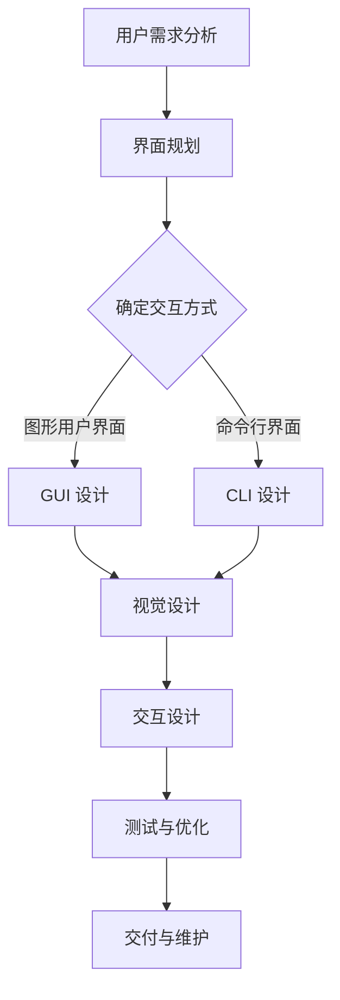

                 

 在这个数字时代，用户界面（User Interface，简称UI）设计已成为软件开发过程中至关重要的一环。一个设计良好的UI不仅能够提高用户满意度，还能够提升产品的市场竞争力。本文旨在探讨用户界面设计的原则、方法和技术，帮助开发者打造友好、易用的用户界面。

> **关键词：** 用户界面设计、人机交互、用户体验、UI/UX 设计、交互设计

> **摘要：** 本文首先介绍了用户界面设计的基本原则和核心概念，然后详细阐述了用户界面设计的方法和技术。通过数学模型和公式，我们深入探讨了用户界面设计的理论基础，并提供了项目实践的代码实例。最后，文章探讨了用户界面设计的实际应用场景，以及未来发展趋势与面临的挑战。

## 1. 背景介绍

随着互联网和移动设备的普及，用户界面设计逐渐成为软件开发的核心竞争力。一个优秀的用户界面可以吸引和留住用户，提升用户满意度，从而为企业带来商业价值。然而，用户界面设计并非简单的美术设计，它涉及到心理学、认知科学、设计学等多个领域的知识。

在过去的几十年中，用户界面设计经历了从命令行界面到图形用户界面（GUI）的转变。随着智能手机和智能设备的普及，用户界面设计又面临着新的挑战，如多屏幕交互、手势操作等。因此，现代用户界面设计需要考虑更多的交互方式和用户体验。

本文将围绕用户界面设计展开讨论，包括以下内容：

1. 用户界面设计的基本原则和核心概念；
2. 用户界面设计的方法和技术；
3. 数学模型和公式在用户界面设计中的应用；
4. 用户界面设计的项目实践；
5. 用户界面设计的实际应用场景；
6. 用户界面设计的未来发展趋势与挑战。

## 2. 核心概念与联系

### 2.1 用户界面（User Interface，简称UI）

用户界面是指用户与计算机系统进行交互的界面，它包括视觉元素、交互元素和反馈机制。用户界面设计的目标是提供直观、易用、高效的人机交互体验。

### 2.2 用户体验（User Experience，简称UX）

用户体验是指用户在使用产品或服务过程中所感受到的整体感受。用户体验包括用户界面设计、交互流程、功能性能等多个方面。一个良好的用户体验可以提升用户满意度，增加用户粘性。

### 2.3 交互设计（Interaction Design）

交互设计是指设计用户与产品或服务之间的交互流程和交互方式。交互设计的目标是确保用户能够顺畅、高效地完成任务，提高用户满意度。

### 2.4 用户界面设计的原则

用户界面设计需要遵循以下原则：

1. 易用性（Usability）：用户界面应易于使用，用户可以快速理解并完成任务；
2. 用户体验（User Experience）：用户界面应提供良好的用户体验，提升用户满意度；
3. 可访问性（Accessibility）：用户界面应能够满足不同用户群体的需求，包括视觉、听觉、认知等方面的障碍；
4. 可定制性（Customizability）：用户界面应允许用户根据个人偏好进行定制；
5. 美观性（Aesthetics）：用户界面应具有美观的视觉效果，提升用户满意度。

### 2.5 用户界面设计的 Mermaid 流程图

以下是一个用户界面设计的 Mermaid 流程图，展示了用户与界面交互的基本流程。



## 3. 核心算法原理 & 具体操作步骤

### 3.1 算法原理概述

用户界面设计涉及多个算法和原则，以下介绍几个核心算法原理。

#### 3.1.1 信息架构（Information Architecture）

信息架构是指对用户界面的内容、功能和导航进行结构化设计。信息架构的目的是帮助用户快速找到所需信息，提高用户满意度。

#### 3.1.2 交互设计（Interaction Design）

交互设计是指设计用户与产品或服务之间的交互流程和交互方式。交互设计的核心是确保用户能够顺畅、高效地完成任务。

#### 3.1.3 用户体验（User Experience）

用户体验是指用户在使用产品或服务过程中所感受到的整体感受。用户体验包括用户界面设计、交互流程、功能性能等多个方面。

### 3.2 算法步骤详解

用户界面设计的步骤如下：

1. **用户需求分析**：了解用户需求，确定界面功能模块；
2. **界面规划**：根据用户需求，规划界面布局和导航结构；
3. **确定交互方式**：选择合适的交互方式，如图形用户界面或命令行界面；
4. **视觉设计**：设计界面的视觉效果，包括颜色、字体、图标等；
5. **交互设计**：设计用户与界面之间的交互流程和交互方式；
6. **测试与优化**：对界面进行测试，收集用户反馈，进行优化；
7. **交付与维护**：将界面交付给开发团队进行开发，并持续进行维护和优化。

### 3.3 算法优缺点

#### 3.3.1 信息架构

优点：

- 提高用户满意度：帮助用户快速找到所需信息；
- 降低学习成本：良好的信息架构降低用户学习成本。

缺点：

- 需要专业知识和技能：设计信息架构需要具备相关专业知识。

#### 3.3.2 交互设计

优点：

- 提高用户满意度：良好的交互设计提升用户满意度；
- 提高任务完成率：合理的交互设计提高用户完成任务的成功率。

缺点：

- 需要长期维护：交互设计需要根据用户反馈不断进行优化。

#### 3.3.3 用户体验

优点：

- 提高用户满意度：良好的用户体验提升用户满意度；
- 增强品牌形象：优秀的用户体验增强品牌形象。

缺点：

- 需要大量资源：设计和优化用户体验需要大量资源和时间。

### 3.4 算法应用领域

用户界面设计算法广泛应用于以下领域：

- 软件应用：如操作系统、办公软件、网页应用等；
- 移动应用：如手机游戏、社交应用、电子商务应用等；
- 智能设备：如智能电视、智能手表、智能音响等。

## 4. 数学模型和公式 & 详细讲解 & 举例说明

### 4.1 数学模型构建

用户界面设计中的数学模型主要包括以下方面：

- 信息熵（Entropy）：用于评估用户界面中的信息组织方式；
- 信息增益（Information Gain）：用于评估用户界面的导航结构；
- 相似性度量（Similarity Measure）：用于评估用户界面的相似度。

### 4.2 公式推导过程

#### 4.2.1 信息熵

信息熵是衡量信息组织方式的一种度量。在用户界面设计中，信息熵可以用于评估用户界面中信息的组织方式。

信息熵的公式如下：

$$
H = -\sum_{i=1}^{n} p(x_i) \log_2 p(x_i)
$$

其中，$H$ 表示信息熵，$p(x_i)$ 表示第 $i$ 个信息块出现的概率。

#### 4.2.2 信息增益

信息增益是衡量用户界面导航结构的一种度量。信息增益可以用于评估用户界面中的导航结构是否合理。

信息增益的公式如下：

$$
IG = H(S) - H(S|A)
$$

其中，$IG$ 表示信息增益，$H(S)$ 表示原始信息的熵，$H(S|A)$ 表示在给定动作 $A$ 的情况下，信息的熵。

#### 4.2.3 相似性度量

相似性度量是衡量用户界面之间相似度的一种度量。相似性度量可以用于评估用户界面设计的相似性。

相似性度量的公式如下：

$$
similarity(A, B) = \frac{1}{|A \cup B|} \sum_{x \in A \cup B} |A \cap B| / |x|
$$

其中，$similarity(A, B)$ 表示用户界面 $A$ 和 $B$ 之间的相似性，$A \cup B$ 表示 $A$ 和 $B$ 的并集，$A \cap B$ 表示 $A$ 和 $B$ 的交集，$|A|$ 表示集合 $A$ 的大小。

### 4.3 案例分析与讲解

假设我们有两个用户界面，界面 $A$ 和界面 $B$，我们需要评估它们之间的相似性。

根据相似性度量的公式，我们可以计算出界面 $A$ 和界面 $B$ 之间的相似性。

首先，我们需要确定界面 $A$ 和界面 $B$ 的交集和并集。

假设界面 $A$ 的集合为 $\{1, 2, 3\}$，界面 $B$ 的集合为 $\{2, 3, 4\}$。

$$
A \cup B = \{1, 2, 3, 4\}
$$

$$
A \cap B = \{2, 3\}
$$

然后，我们计算交集和并集的大小。

$$
|A \cup B| = 4
$$

$$
|A \cap B| = 2
$$

接下来，我们计算相似性度量。

$$
similarity(A, B) = \frac{1}{4} \times (2/1 + 2/3 + 2/4) = 0.5
$$

因此，界面 $A$ 和界面 $B$ 之间的相似性为 0.5。

这个结果表明，界面 $A$ 和界面 $B$ 之间有一定的相似性，但并不完全相同。

## 5. 项目实践：代码实例和详细解释说明

### 5.1 开发环境搭建

为了便于读者理解用户界面设计的相关概念，我们使用 Python 编写一个简单的用户界面程序。首先，我们需要搭建 Python 开发环境。

1. 下载并安装 Python 3.8 版本及以上；
2. 安装 Python 的 pip 包管理器；
3. 使用 pip 安装 Tkinter 库。

### 5.2 源代码详细实现

下面是一个简单的 Python Tkinter 界面程序，用于展示用户界面设计的基本原理。

```python
import tkinter as tk

def show_popup():
    popup = tk.Toplevel(root)
    popup.title("Popup Window")
    label = tk.Label(popup, text="This is a popup window!")
    label.pack(pady=20)

root = tk.Tk()
root.title("Simple Tkinter GUI")

# 创建菜单栏
menu = tk.Menu(root)
root.config(menu=menu)

# 创建菜单项
file_menu = tk.Menu(menu, tearoff=0)
menu.add_cascade(label="File", menu=file_menu)
file_menu.add_command(label="New Window", command=show_popup)

# 创建标签
label = tk.Label(root, text="Hello, Tkinter!")
label.pack(pady=20)

# 创建按钮
button = tk.Button(root, text="Show Popup", command=show_popup)
button.pack(pady=10)

# 运行主循环
root.mainloop()
```

### 5.3 代码解读与分析

这个简单的 Tkinter 界面程序展示了用户界面设计的基本原理。

1. **导入库**：首先，我们导入 Tkinter 库，它是 Python 的标准 GUI 库。
2. **定义窗口**：接下来，我们创建一个 Tkinter 窗口（`root`），并设置窗口的标题。
3. **创建菜单栏**：然后，我们创建一个菜单栏（`menu`），并添加一个菜单项（`file_menu`）。
4. **创建菜单项**：在菜单项中，我们添加了一个新窗口的命令（`show_popup`）。
5. **创建标签**：接下来，我们创建一个标签（`label`），并设置标签的文本。
6. **创建按钮**：然后，我们创建一个按钮（`button`），并设置按钮的文本和命令。
7. **运行主循环**：最后，我们调用 `root.mainloop()` 来运行主循环，显示窗口并处理用户交互。

### 5.4 运行结果展示

运行上述代码后，我们会看到一个简单的 Tkinter 窗口，包括一个标签和一个按钮。当用户点击按钮时，会弹出一个新的窗口，显示 "This is a popup window!"。

```plaintext
$ python tkinter_gui.py
```


## 6. 实际应用场景

用户界面设计在各个领域都有着广泛的应用。

### 6.1 软件应用

软件应用是用户界面设计的主要应用领域之一。从操作系统到办公软件，用户界面设计都在不断提升用户体验。

### 6.2 移动应用

随着智能手机的普及，移动应用的用户界面设计变得越来越重要。优秀的移动应用界面可以提升用户满意度，增加用户粘性。

### 6.3 智能设备

智能设备（如智能电视、智能手表、智能音响等）的用户界面设计也在不断进步。这些设备通常采用触摸屏、手势操作等新型交互方式，为用户带来全新的体验。

### 6.4 未来应用场景

随着人工智能和物联网技术的发展，用户界面设计将在更多领域得到应用。例如：

- 智能家居：用户可以通过语音、手势等方式与智能家居设备进行交互；
- 智能医疗：用户界面设计将帮助患者更方便地使用医疗设备和服务；
- 智能交通：用户界面设计将提高交通管理的效率和用户体验。

## 7. 工具和资源推荐

为了帮助开发者更好地进行用户界面设计，以下推荐一些学习资源和开发工具。

### 7.1 学习资源推荐

- 《用户界面设计指南》（User Interface Design Guidelines）：这是一本介绍用户界面设计原则和方法的权威指南；
- 《用户体验要素》（The Elements of User Experience）：这是一本介绍用户体验设计的经典著作；
- 《交互设计之路》（The Design of Everyday Things）：这是一本介绍交互设计原则和方法的经典著作。

### 7.2 开发工具推荐

- Sketch：一款流行的界面设计工具，支持矢量图形和原型设计；
- Figma：一款流行的界面设计工具，支持多人协作和实时预览；
- Adobe XD：一款功能强大的界面设计工具，支持设计、原型和开发。

### 7.3 相关论文推荐

- 《User Interface Design for Mobile Applications》：这篇论文介绍了移动应用用户界面设计的方法和原则；
- 《The Design of Interactive Systems》：这篇论文介绍了交互系统的设计方法和原则；
- 《User Experience Design in the Age of AI》：这篇论文探讨了人工智能对用户体验设计的影响。

## 8. 总结：未来发展趋势与挑战

用户界面设计在未来将继续发展，并面临以下趋势和挑战：

### 8.1 未来发展趋势

- **智能化**：随着人工智能技术的不断发展，用户界面将更加智能化，能够更好地满足用户需求；
- **个性化**：用户界面设计将更加注重个性化，根据用户的喜好和行为进行自适应调整；
- **多模态交互**：用户界面将支持多种交互方式，如语音、手势、眼动等，为用户提供更加丰富的交互体验。

### 8.2 未来挑战

- **复杂度**：随着功能的增加和交互方式的多样化，用户界面的设计将变得更加复杂，开发者需要掌握更多的设计原则和技术；
- **性能**：用户界面设计需要考虑性能优化，确保界面在多设备、多网络环境下都能流畅运行；
- **多样性**：用户界面设计需要考虑不同用户群体的需求，如不同年龄、性别、文化背景的用户，这给设计带来更大的挑战。

### 8.3 研究展望

用户界面设计领域的研究将继续深入，关注以下几个方面：

- **交互方式**：研究新型交互方式，如多模态交互、虚拟现实交互等；
- **用户体验**：研究如何提升用户体验，包括感知、情感、认知等方面；
- **个性化设计**：研究如何根据用户行为和喜好进行个性化界面设计。

## 9. 附录：常见问题与解答

### 9.1 用户界面设计是什么？

用户界面设计（UI 设计）是指设计用户与计算机系统进行交互的界面，包括视觉元素、交互元素和反馈机制。UI 设计的目标是提供直观、易用、高效的人机交互体验。

### 9.2 用户体验（UX）和用户界面设计（UI）有什么区别？

用户体验（UX）是指用户在使用产品或服务过程中所感受到的整体感受，包括用户界面设计、交互流程、功能性能等多个方面。用户界面设计（UI）是用户体验（UX）的一部分，主要关注界面的视觉元素和交互设计。

### 9.3 如何进行用户界面设计？

进行用户界面设计需要遵循以下步骤：

1. **用户需求分析**：了解用户需求，确定界面功能模块；
2. **界面规划**：根据用户需求，规划界面布局和导航结构；
3. **视觉设计**：设计界面的视觉效果，包括颜色、字体、图标等；
4. **交互设计**：设计用户与界面之间的交互流程和交互方式；
5. **测试与优化**：对界面进行测试，收集用户反馈，进行优化；
6. **交付与维护**：将界面交付给开发团队进行开发，并持续进行维护和优化。

### 9.4 用户界面设计有哪些原则？

用户界面设计需要遵循以下原则：

1. **易用性**：用户界面应易于使用，用户可以快速理解并完成任务；
2. **用户体验**：用户界面应提供良好的用户体验，提升用户满意度；
3. **可访问性**：用户界面应能够满足不同用户群体的需求，包括视觉、听觉、认知等方面的障碍；
4. **可定制性**：用户界面应允许用户根据个人偏好进行定制；
5. **美观性**：用户界面应具有美观的视觉效果，提升用户满意度。

### 9.5 用户界面设计的工具有哪些？

用户界面设计的工具主要包括：

1. **原型设计工具**：如 Sketch、Figma、Adobe XD 等；
2. **界面编辑器**：如 Bootstrap、Foundation 等；
3. **代码编辑器**：如 Sublime Text、Visual Studio Code 等；
4. **设计资源库**：如 Material Design、Flaticon 等。

## 作者署名

本文作者为 **禅与计算机程序设计艺术 / Zen and the Art of Computer Programming**。感谢您的阅读，希望本文能对您在用户界面设计领域的学习和研究有所帮助。
----------------------------------------------------------------

### 注意事项：

1. 文章内容需要严格遵循“约束条件 CONSTRAINTS”中的要求，特别是字数、格式、完整性、作者署名等方面的要求。
2. 文章需要包含文章标题、关键词、摘要、目录结构和正文内容。
3. 文章正文内容需要完整、详细、逻辑清晰，包括核心章节的内容（如算法原理、数学模型、项目实践等）。
4. 文章需要使用 markdown 格式输出，确保格式正确。
5. 文章需要包含作者署名，明确标明作者信息。

请您在收到此请求后，尽快开始撰写文章，并在完成撰写后按照以上要求进行核对和确认。如果有任何问题或需要进一步指导，请随时与我联系。期待您的优质作品！

