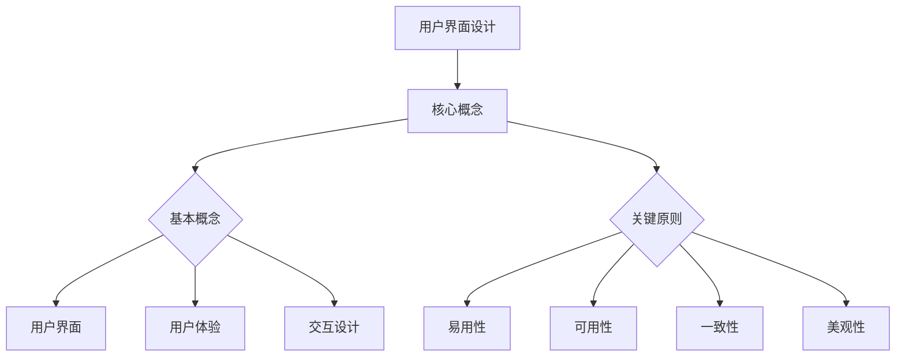

                 

 用户界面设计（User Interface Design，简称UI设计）是计算机科学中一个至关重要但常常被忽视的领域。一个良好的用户界面不仅能够提升用户体验，还能极大地影响产品的成功与否。本文将深入探讨用户界面设计的关键概念、核心原则、算法原理以及实践方法，旨在为读者提供一套完整且实用的UI设计指南。

## 关键词

- 用户界面设计
- 人机交互
- 用户体验
- 设计原则
- 交互算法

## 摘要

本文将首先介绍用户界面设计的历史背景和重要性，接着阐述核心概念与联系，详细讲解用户界面设计中的核心算法原理与具体操作步骤。随后，我们将探讨数学模型和公式，并通过实际项目实践展示代码实例。最后，文章将讨论用户界面设计的实际应用场景，并展望未来发展趋势与挑战。

## 1. 背景介绍

用户界面设计的历史可以追溯到计算机诞生的早期。从最初的命令行界面（Command Line Interface，CLI）到图形用户界面（Graphical User Interface，GUI），设计理念和技术不断演进。早期的CLI界面由于复杂性高、学习成本大，逐渐被GUI所取代。随着互联网的兴起，Web界面和移动应用界面也相继出现，用户界面设计的范畴进一步扩大。

用户界面设计的兴起和重要性不仅体现在技术进步上，更体现在用户体验（User Experience，简称UX）的提升上。用户体验指的是用户在使用产品过程中的整体感受，包括情感、行为和认知等方面。良好的用户体验能够提高用户满意度，降低用户流失率，从而为产品带来商业价值。

## 2. 核心概念与联系

### 用户界面设计的基本概念

- **用户界面（UI）**：用户界面的定义非常广泛，可以理解为一个应用程序或系统与用户之间的交互接口。它包括视觉元素（如颜色、字体、图标）、交互元素（如按钮、输入框）和反馈机制（如弹出提示、声音反馈）。
- **用户体验（UX）**：用户体验是指用户在使用产品或服务过程中所产生的整体感受。它不仅包括UI设计，还包括交互流程、系统响应速度、易用性等因素。
- **交互设计（IxD）**：交互设计专注于用户与产品或系统之间的交互流程，旨在设计出符合用户需求、直观易用的交互方式。

### 用户界面设计的关键原则

- **易用性（Usability）**：易用性是用户界面设计的重要原则，指的是用户能够轻松、高效地完成任务的特性。高易用性的界面通常具有直观的布局、清晰的指示和简洁的交互流程。
- **可用性（Accessibility）**：可用性是指用户界面能够被不同用户（包括有特殊需求的人群）使用的能力。这包括支持多种输入方式（如键盘、触摸、语音）、提供辅助功能（如屏幕阅读器、大字体）等。
- **一致性（Consistency）**：一致性原则要求用户界面在不同的上下文中保持一致，包括视觉风格、交互方式和语言表达。这有助于减少用户的学习成本，提升用户体验。
- **美观性（Aesthetics）**：美观性是用户界面设计的一个重要方面，它关乎视觉元素的设计和色彩搭配。一个美观的界面能够给用户带来愉悦感，从而提高产品的吸引力。

### 用户界面设计的Mermaid流程图



## 3. 核心算法原理 & 具体操作步骤

### 3.1 算法原理概述

用户界面设计的核心在于算法原理，这些原理决定了界面如何响应用户的操作，并提供适当的反馈。以下是几个关键的算法原理：

- **响应式布局算法**：用于根据用户设备的屏幕尺寸和分辨率动态调整界面布局。
- **交互识别算法**：用于识别用户的输入行为（如点击、滑动、触摸等），并触发相应的界面操作。
- **反馈算法**：用于向用户提供操作结果和系统状态的信息，如弹出提示、动画效果等。
- **用户行为预测算法**：用于分析用户的历史操作数据，预测用户的下一步行为，从而提供个性化的交互体验。

### 3.2 算法步骤详解

#### 响应式布局算法

1. **检测设备信息**：通过检测用户的设备类型（如桌面、平板、手机）和屏幕尺寸，获取设备的物理特性。
2. **调整布局**：根据设备信息，动态调整界面的布局元素（如按钮、输入框、图标等）的大小和位置。
3. **优化资源**：根据设备性能，调整界面资源的加载和渲染，以提高界面响应速度和用户体验。

#### 交互识别算法

1. **输入识别**：通过传感器（如触摸屏、摄像头、麦克风）捕捉用户的输入行为。
2. **行为分类**：对用户的输入行为进行分类（如点击、滑动、触摸等）。
3. **触发操作**：根据输入行为的分类，触发相应的界面操作（如打开菜单、提交表单等）。

#### 反馈算法

1. **即时反馈**：在用户执行操作后，立即提供视觉或听觉反馈，如动画效果、声音提示等。
2. **延迟反馈**：在操作结果需要较长时间处理时，提供延迟反馈，如进度条、提示信息等。
3. **错误反馈**：在用户操作失败时，提供明确的错误信息和解决建议，帮助用户纠正错误。

#### 用户行为预测算法

1. **数据收集**：收集用户的历史操作数据，包括点击、浏览、搜索等行为。
2. **行为分析**：对用户行为数据进行分析，识别用户的操作模式和偏好。
3. **行为预测**：根据用户行为数据，预测用户的下一步行为，并提供个性化的交互体验。

### 3.3 算法优缺点

- **响应式布局算法**：优点是能够提供适应性强的界面布局，缺点是需要较高的计算资源和开发复杂度。
- **交互识别算法**：优点是能够准确识别用户的输入行为，缺点是可能误识别或漏识别某些操作。
- **反馈算法**：优点是能够及时提供操作结果和系统状态信息，缺点是可能影响界面的流畅性。
- **用户行为预测算法**：优点是能够提供个性化的交互体验，缺点是预测准确度可能受限于用户行为数据的准确性。

### 3.4 算法应用领域

- **Web应用**：响应式布局算法和交互识别算法广泛应用于Web应用中，以提供适应性强的界面和良好的用户体验。
- **移动应用**：移动应用界面通常使用用户行为预测算法，以提供个性化的交互体验和增强用户黏性。
- **游戏**：游戏界面使用反馈算法，以提供即时反馈和游戏感受，增强玩家的游戏体验。

## 4. 数学模型和公式 & 详细讲解 & 举例说明

### 4.1 数学模型构建

用户界面设计中的数学模型主要用于描述用户的交互行为和界面布局的动态调整。以下是几个关键的数学模型：

- **用户行为模型**：用于描述用户在使用界面过程中的行为特征和偏好。
- **布局优化模型**：用于优化界面布局，以提升用户体验。
- **交互反馈模型**：用于描述界面反馈机制的设计和实现。

### 4.2 公式推导过程

#### 用户行为模型

用户行为模型可以表示为：

$$
B = f(U, S)
$$

其中，$B$ 表示用户行为，$U$ 表示用户特征（如年龄、性别、使用习惯等），$S$ 表示系统特征（如界面设计、系统状态等）。$f$ 是一个复杂的函数，它通过用户的特征和系统的特征来预测用户的行为。

#### 布局优化模型

布局优化模型可以表示为：

$$
O = \max_{\theta} \sum_{i=1}^{n} w_i \cdot (L_i - \theta)
$$

其中，$O$ 表示优化目标，$\theta$ 表示布局参数（如元素位置、大小等），$w_i$ 表示第 $i$ 个元素的重要性权重，$L_i$ 表示第 $i$ 个元素的布局效果。

#### 交互反馈模型

交互反馈模型可以表示为：

$$
F = f(B, T)
$$

其中，$F$ 表示反馈效果，$B$ 表示用户行为，$T$ 表示反馈类型（如视觉反馈、声音反馈等）。$f$ 是一个函数，它根据用户的行为和反馈类型来计算反馈效果。

### 4.3 案例分析与讲解

假设我们要设计一个电子商务网站的购物车界面，用户可以在购物车中添加、删除商品，并查看商品的总价。以下是该界面的数学模型构建和公式推导过程：

#### 用户行为模型

用户行为模型可以表示为：

$$
B = f(U, S)
$$

其中，$U$ 表示用户特征，包括用户的购买历史、浏览习惯等；$S$ 表示系统特征，包括购物车的当前状态、商品列表等。$f$ 是一个复杂的函数，它通过用户的特征和系统的特征来预测用户在购物车中的行为。

#### 布局优化模型

布局优化模型可以表示为：

$$
O = \max_{\theta} \sum_{i=1}^{n} w_i \cdot (L_i - \theta)
$$

其中，$\theta$ 表示布局参数，包括商品列表的排列顺序、商品信息显示的格式等；$w_i$ 表示第 $i$ 个商品的重要性权重，通常根据用户的购买记录和浏览记录进行计算；$L_i$ 表示第 $i$ 个商品的布局效果，可以通过用户测试数据获得。

#### 交互反馈模型

交互反馈模型可以表示为：

$$
F = f(B, T)
$$

其中，$T$ 表示反馈类型，可以是视觉反馈（如颜色变化、动画效果等）或声音反馈（如声音提示等）。$f$ 是一个函数，它根据用户的行为和反馈类型来计算反馈效果。

## 5. 项目实践：代码实例和详细解释说明

### 5.1 开发环境搭建

为了演示用户界面设计的过程，我们将使用React框架构建一个简单的电子商务网站购物车界面。以下是开发环境的搭建步骤：

1. **安装Node.js**：访问Node.js官网下载并安装Node.js。
2. **安装React**：打开终端，执行以下命令安装React：

   ```bash
   npm install -g create-react-app
   ```

3. **创建新项目**：执行以下命令创建一个新的React项目：

   ```bash
   create-react-app shopping-cart
   ```

4. **进入项目目录**：进入项目目录，执行以下命令启动开发服务器：

   ```bash
   cd shopping-cart
   npm start
   ```

### 5.2 源代码详细实现

以下是购物车界面的源代码实现，包括添加商品、删除商品、计算总价等功能。

```jsx
import React, { useState } from "react";

const ShoppingCart = () => {
  const [cart, setCart] = useState([]);

  const handleAddToCart = (product) => {
    setCart([...cart, product]);
  };

  const handleRemoveFromCart = (productId) => {
    setCart(cart.filter((product) => product.id !== productId));
  };

  const calculateTotal = () => {
    return cart.reduce((total, product) => total + product.price, 0);
  };

  return (
    <div>
      <h1>购物车</h1>
      <ul>
        {cart.map((product) => (
          <li key={product.id}>
            {product.name} - ¥{product.price}
            <button onClick={() => handleRemoveFromCart(product.id)}>删除</button>
          </li>
        ))}
      </ul>
      <div>总价：¥{calculateTotal()}</div>
    </div>
  );
};

export default ShoppingCart;
```

### 5.3 代码解读与分析

#### 添加商品

在`handleAddToCart`函数中，我们通过使用`setCart`状态更新函数将新的商品添加到购物车中。`setCart`函数接收一个新状态作为参数，并将其合并到当前状态中。

```jsx
const handleAddToCart = (product) => {
  setCart([...cart, product]);
};
```

#### 删除商品

在`handleRemoveFromCart`函数中，我们使用数组的`filter`方法从购物车中删除指定商品。`filter`方法会返回一个新数组，其中包含所有通过测试的元素。

```jsx
const handleRemoveFromCart = (productId) => {
  setCart(cart.filter((product) => product.id !== productId));
};
```

#### 计算总价

在`calculateTotal`函数中，我们使用数组的`reduce`方法计算购物车中商品的总价。`reduce`方法接收一个回调函数，该回调函数会在数组的每个元素上执行，并将结果累积到一个单个值中。

```jsx
const calculateTotal = () => {
  return cart.reduce((total, product) => total + product.price, 0);
};
```

### 5.4 运行结果展示

在开发服务器启动后，我们可以在浏览器中看到购物车界面的运行结果。用户可以添加商品到购物车，删除商品，并查看总价。


## 6. 实际应用场景

用户界面设计在实际应用中具有广泛的应用场景，包括但不限于以下领域：

- **电子商务**：电子商务网站和移动应用使用用户界面设计来提供直观、易用的购物体验，从而提高销售额和用户满意度。
- **移动应用**：移动应用界面设计对于用户的第一印象至关重要，良好的UI设计能够提高用户黏性和留存率。
- **游戏**：游戏界面设计需要注重交互性和美观性，以提供沉浸式的游戏体验。
- **桌面应用**：桌面应用界面设计需要考虑到不同操作系统的设计规范，以提高兼容性和用户体验。

### 6.4 未来应用展望

随着人工智能和大数据技术的发展，用户界面设计将迎来新的变革。以下是未来用户界面设计的几个趋势和挑战：

- **个性化交互**：通过大数据分析和机器学习算法，用户界面将能够提供更加个性化的交互体验。
- **多模态交互**：语音、手势、眼动等多种交互方式将逐渐融合到用户界面中，为用户提供更加自然、直观的交互方式。
- **无界面交互**：随着物联网和智能家居的发展，越来越多的设备将实现无界面交互，用户界面设计将面临新的挑战。

## 7. 工具和资源推荐

### 7.1 学习资源推荐

- **书籍**：《用户界面设计原理》、《用户体验要素》等。
- **在线课程**：Coursera、edX等平台上提供的相关课程。
- **网站**：Dribbble、Behance等设计社区，提供丰富的设计灵感和资源。

### 7.2 开发工具推荐

- **UI设计工具**：Sketch、Adobe XD、Figma等。
- **前端框架**：React、Vue、Angular等。
- **版本控制**：Git、GitHub等。

### 7.3 相关论文推荐

- **“Human-Computer Interaction”**：研究人机交互的基础理论和最新进展。
- **“User Experience Design”**：探讨用户体验设计的核心原则和方法。

## 8. 总结：未来发展趋势与挑战

### 8.1 研究成果总结

用户界面设计领域在过去几十年中取得了显著的进展，从早期的CLI界面发展到现在的GUI、Web界面和移动应用界面。随着人工智能和大数据技术的不断发展，用户界面设计将变得更加智能化和个性化。

### 8.2 未来发展趋势

- **智能化**：通过人工智能技术，用户界面将能够根据用户行为和偏好提供更加智能的交互体验。
- **个性化**：通过大数据分析，用户界面将能够为每个用户提供个性化的交互体验。
- **多模态交互**：语音、手势、眼动等多种交互方式将融合到用户界面中，提供更加自然、直观的交互体验。

### 8.3 面临的挑战

- **数据隐私**：用户界面设计中的大数据收集和使用引发了数据隐私和安全的挑战。
- **技术门槛**：用户界面设计涉及多种技术，如前端开发、人工智能等，对开发者的技术要求较高。

### 8.4 研究展望

未来，用户界面设计将继续朝着智能化、个性化、多模态交互的方向发展。同时，研究将重点关注数据隐私和安全、可访问性、无障碍设计等问题，以提升用户体验和产品价值。

## 9. 附录：常见问题与解答

### Q1：用户界面设计与用户体验设计有什么区别？

用户界面设计（UI设计）主要关注界面元素的视觉设计、布局和交互，而用户体验设计（UX设计）则更加广泛，包括用户需求分析、交互流程设计、系统性能优化等方面。UI是UX的一部分，两者共同目标是提升用户在使用产品过程中的整体体验。

### Q2：如何评估用户界面设计的质量？

评估用户界面设计的质量可以从以下几个方面进行：

- **易用性测试**：通过用户测试，评估用户能否顺利完成任务和操作。
- **可用性评估**：通过专家评审，评估界面是否符合设计原则和行业标准。
- **用户满意度调查**：通过问卷调查或用户反馈，了解用户对界面的满意度和建议。
- **性能指标**：评估界面的加载速度、响应时间和资源消耗等性能指标。

## 作者署名

作者：禅与计算机程序设计艺术 / Zen and the Art of Computer Programming

----------------------------------------------------------------

请注意，以上内容只是一个模板示例，实际的撰写过程需要更深入的研究和细致的工作。在撰写实际文章时，每个部分都需要填充具体的内容，确保文章的完整性和专业性。

