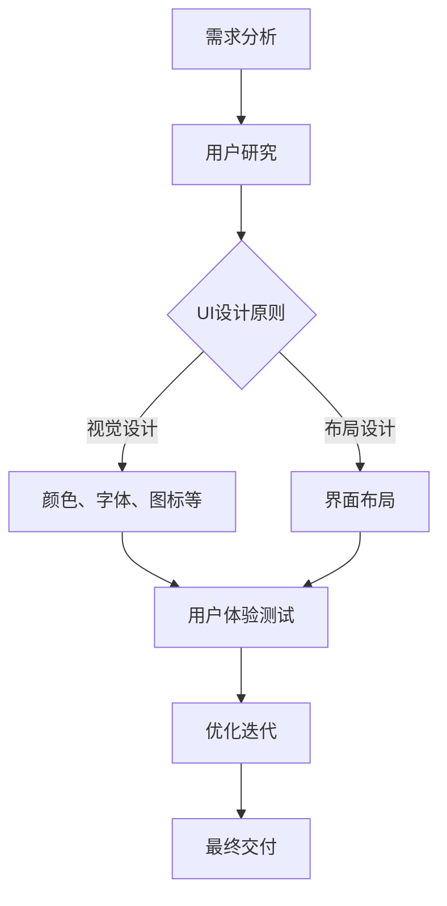

                 

关键词：用户界面设计、人机交互、用户体验、UI/UX、设计原则、最佳实践

> 摘要：本文探讨了用户界面设计（UI/UX）的核心概念、设计原则、最佳实践以及未来发展趋势。通过深入分析用户界面设计的各个方面，本文旨在为读者提供一套完整的设计方法和实用的技巧，帮助设计师和开发者打造友好、易用的用户界面，从而提升用户的人机交互体验。

## 1. 背景介绍

在当今数字化时代，用户界面设计（UI/UX）已经成为软件开发和产品设计中不可或缺的一部分。用户界面设计的核心目标是通过优化界面元素和交互流程，提升用户的体验和满意度，从而提高产品的市场竞争力和用户忠诚度。

用户界面设计不仅涉及到视觉设计，还包括用户体验（UX）设计，即关注用户在使用产品过程中的感受和互动。这两者相辅相成，共同构成了完整的用户界面设计体系。一个优秀的用户界面设计不仅要有良好的视觉效果，还要具备简洁直观的交互流程和出色的用户体验。

随着移动互联网和物联网的快速发展，用户界面设计的重要性愈发凸显。现代用户对于产品的需求越来越高，他们期望能够快速上手，轻松使用，并享受到愉悦的交互体验。因此，设计师和开发者必须不断学习和适应新的设计趋势，以满足用户的需求。

## 2. 核心概念与联系

### 2.1 用户界面设计（UI）

用户界面设计（UI）主要关注产品的视觉表现，包括颜色、字体、图标、布局等元素。一个成功的UI设计需要满足以下几个核心原则：

1. **简洁性**：界面应尽可能简洁，避免过多无关的元素和内容，以减少用户的认知负担。
2. **一致性**：界面元素的风格和交互逻辑应保持一致，以便用户能够快速理解和操作。
3. **美观性**：界面设计应符合用户的审美需求，同时体现品牌特色。
4. **可访问性**：界面应考虑不同用户的需求，包括色盲、视力障碍等，确保所有用户都能正常使用。

### 2.2 用户体验（UX）

用户体验（UX）设计则关注用户在使用产品过程中的感受和互动。一个优秀的UX设计需要关注以下几个方面：

1. **易用性**：界面应易于使用，用户能够轻松完成常见任务。
2. **可用性**：界面应具备较高的可用性，即用户能够在需要时找到所需功能。
3. **可访问性**：界面应考虑不同用户的需求，包括老人、儿童、残疾人等。
4. **情感因素**：界面设计应传递积极的情感体验，提升用户满意度和忠诚度。

### 2.3 UI与UX的关系

UI和UX是用户界面设计的两个重要方面，它们之间存在密切的联系和相互影响。一个成功的用户界面设计需要在UI和UX之间取得平衡，既要注重视觉表现，又要关注用户体验。

- **UI为UX奠定基础**：良好的UI设计能够提升用户体验，为用户提供直观、清晰的交互体验。
- **UX为UI提供指导**：用户体验研究可以指导UI设计，确保界面元素和交互流程符合用户需求。

### 2.4 Mermaid 流程图

以下是一个简化的用户界面设计流程的Mermaid流程图，展示了UI与UX设计的关键步骤和相互关系：



## 3. 核心算法原理 & 具体操作步骤

### 3.1 算法原理概述

用户界面设计并非一门纯粹的艺术，而是一门具有科学依据和实践经验的设计领域。在用户界面设计中，算法原理可以帮助设计师和开发者更好地理解和应用设计原则，从而提高设计的科学性和可操作性。

以下是一些核心的算法原理：

1. **感知对比**：通过对比和差异来吸引用户的注意力，从而提升界面元素的识别度。
2. **信息层级**：通过不同的视觉元素和布局来体现信息的重要性，帮助用户快速理解界面结构。
3. **导航系统**：设计合理的导航系统，帮助用户在不同页面和功能之间进行流畅的切换。
4. **交互反馈**：通过及时的交互反馈来增强用户的操作信心，提升用户体验。

### 3.2 算法步骤详解

1. **需求分析**：了解用户需求和市场趋势，明确产品目标。
2. **用户研究**：通过访谈、问卷调查等方式收集用户反馈，了解用户的使用习惯和偏好。
3. **界面设计**：
   - 视觉设计：选择合适的颜色、字体、图标等元素，打造美观且符合品牌特色的界面。
   - 布局设计：根据信息层级和导航需求，设计合理的界面布局。
4. **用户体验测试**：通过用户测试收集反馈，发现并优化界面设计中的问题。
5. **优化迭代**：根据用户反馈和测试结果，对界面设计进行迭代优化。
6. **最终交付**：将优化后的界面设计交付给开发团队，确保在实际产品中实现。

### 3.3 算法优缺点

**优点**：

- 提高设计效率：通过算法原理和步骤的规范化，可以快速提高设计效率。
- 提升用户体验：科学的设计方法可以更好地满足用户需求，提升用户体验。
- 易于团队协作：统一的设计原则和流程可以方便团队协作，降低沟通成本。

**缺点**：

- 过度依赖算法：如果完全依赖算法，可能会忽略个性化需求和创意性设计。
- 需要不断更新：随着技术和市场的变化，算法和原则也需要不断更新和优化。

### 3.4 算法应用领域

用户界面设计算法原理广泛应用于各种类型的产品设计中，包括但不限于：

- 移动应用：手机、平板等移动设备的界面设计。
- 网站设计：桌面和移动端的网页界面设计。
- 交互设计：智能设备、智能家居等交互式产品的设计。
- 品牌设计：企业视觉识别系统、广告宣传等的设计。

## 4. 数学模型和公式 & 详细讲解 & 举例说明

### 4.1 数学模型构建

用户界面设计中的数学模型主要包括以下几个方面：

1. **颜色模型**：用于描述颜色空间和颜色混合的模型，如RGB、CMYK等。
2. **布局模型**：用于描述界面元素布局和排布的模型，如网格布局、弹性布局等。
3. **交互模型**：用于描述用户与界面交互的模型，如手势识别、语音交互等。

### 4.2 公式推导过程

以下是一个简化的颜色模型（RGB模型）的推导过程：

1. **颜色空间**：RGB模型是一种基于加色法的颜色模型，由红色（Red）、绿色（Green）和蓝色（Blue）三种基本颜色组合而成。

2. **颜色分量**：每种基本颜色的强度可以用0到255之间的整数表示，称为颜色分量。

3. **颜色混合**：两种或多种颜色的混合可以通过数学运算得到新的颜色。例如，红色和绿色混合可以产生黄色，其公式为：

   $$ R_{new} = R_1 + R_2 $$
   $$ G_{new} = G_1 + G_2 $$
   $$ B_{new} = B_1 + B_2 $$

### 4.3 案例分析与讲解

以下是一个实际的UI设计案例，用于说明如何使用数学模型进行颜色选择和布局设计：

1. **颜色选择**：假设要设计一个按钮，需要选择一个引人注目的颜色。根据用户研究，用户对红色的偏好较高。因此，选择红色作为按钮的主要颜色。

2. **颜色混合**：为了增强视觉冲击力，可以混合红色和少量蓝色，以产生一种更鲜艳的颜色。根据RGB模型，混合公式为：

   $$ R_{new} = 255 + 20 = 275 $$
   $$ G_{new} = 0 + 0 = 0 $$
   $$ B_{new} = 0 + 50 = 50 $$

   得到的新颜色为（275, 0, 50）。

3. **布局设计**：为了确保按钮在界面中突出，可以选择一种简洁的网格布局，将按钮放置在界面的中心位置。

通过这个案例，我们可以看到数学模型在用户界面设计中的应用。数学模型不仅帮助设计师选择合适的颜色和布局，还可以提高设计的可操作性和科学性。

## 5. 项目实践：代码实例和详细解释说明

### 5.1 开发环境搭建

在开始实际项目实践之前，我们需要搭建一个适合用户界面设计的开发环境。以下是一个基本的开发环境搭建步骤：

1. **安装开发工具**：选择一款适合的集成开发环境（IDE），如Visual Studio Code、Adobe XD 或 Sketch。
2. **安装设计工具**：安装一些常用的设计工具，如Photoshop、Illustrator 或 Figma。
3. **配置库和框架**：根据项目需求，安装所需的库和框架，如React、Vue.js 或 Angular。
4. **搭建服务器**：如果需要进行前端开发，可以搭建一个本地服务器，使用如Node.js 或 Apache 等服务器软件。

### 5.2 源代码详细实现

以下是一个简单的用户界面设计代码实例，使用React框架实现一个按钮组件：

```jsx
import React from 'react';

const Button = ({ text, onClick }) => {
  return (
    <button style={buttonStyle} onClick={onClick}>
      {text}
    </button>
  );
};

const buttonStyle = {
  backgroundColor: '#FF0000', // 红色背景
  color: '#FFFFFF', // 白色文字
  padding: '10px 20px', // 内边距
  border: 'none', // 无边框
  borderRadius: '5px', // 圆角
  cursor: 'pointer', // 鼠标指针样式
  fontWeight: 'bold', // 粗体
};

export default Button;
```

### 5.3 代码解读与分析

1. **组件定义**：使用React函数组件定义一个名为`Button`的组件，接收`text`和`onClick`两个属性。
2. **样式设置**：通过`buttonStyle`对象设置按钮的样式，包括背景颜色、文字颜色、内边距、边框、圆角等。
3. **组件渲染**：在组件中返回一个`<button>`元素，将样式和文本传递给按钮。
4. **交互处理**：通过`onClick`属性绑定点击事件，实现按钮的交互功能。

### 5.4 运行结果展示

在浏览器中运行上述代码，将显示一个红色的按钮，按钮上显示文本“点击我”。点击按钮时，会触发`onClick`事件，实现相应的功能。

```html
<button style="background-color: #FF0000; color: #FFFFFF; padding: 10px 20px; border: none; border-radius: 5px; cursor: pointer; font-weight: bold;" onClick="console.log('按钮被点击了')">
  点击我
</button>
```

## 6. 实际应用场景

用户界面设计在各个领域都有广泛的应用。以下是一些实际应用场景：

1. **电商平台**：电商平台需要设计简洁、直观的界面，帮助用户快速找到商品、进行购物和支付。
2. **社交媒体**：社交媒体平台需要设计友好、易用的界面，提升用户的互动体验和参与度。
3. **金融科技**：金融科技产品需要设计安全、可靠的界面，保障用户的财务安全。
4. **医疗健康**：医疗健康产品需要设计易于使用、易于理解的界面，帮助用户管理健康数据。
5. **物联网**：物联网产品需要设计适合不同设备和操作场景的界面，实现智能设备的远程控制和数据监控。

### 6.4 未来应用展望

随着人工智能、大数据和虚拟现实等技术的发展，用户界面设计将继续创新和演进。以下是一些未来应用展望：

1. **语音和手势交互**：语音和手势交互将逐渐取代传统的鼠标和键盘，成为主要的交互方式。
2. **沉浸式体验**：虚拟现实和增强现实技术将带来更加沉浸式的用户体验。
3. **个性化设计**：基于大数据和人工智能的个性化设计将满足用户的个性化需求。
4. **无界面交互**：随着技术的发展，界面将逐渐消失，用户可以通过自然语言和智能助理完成所有操作。

## 7. 工具和资源推荐

为了更好地进行用户界面设计，以下是一些建议的学习资源、开发工具和相关论文：

### 7.1 学习资源推荐

- **《用户体验要素》**：作者：唐纳德·诺曼，介绍用户体验设计的核心概念和方法。
- **《响应式网页设计》**：作者：马克·阿尔科特，介绍如何设计适应不同设备和屏幕尺寸的网站。
- **《Sketch中文教程》**：提供详细的Sketch软件使用教程，适用于初学者和高级用户。

### 7.2 开发工具推荐

- **Visual Studio Code**：一款开源的跨平台集成开发环境，适用于前端开发和UI设计。
- **Adobe XD**：一款专业的用户界面设计工具，支持原型设计和交互设计。
- **Figma**：一款基于云的协作设计工具，支持实时协作和版本控制。

### 7.3 相关论文推荐

- **“The Design of Sites”**：作者：Jesse James Garrett，介绍网站设计的整体框架和方法。
- **“The Laws of Simplicity”**：作者：John Maeda，探讨设计中的简洁原则。
- **“User Experience Design Principles”**：作者：Nielsen Norman Group，介绍用户体验设计的基本原则。

## 8. 总结：未来发展趋势与挑战

### 8.1 研究成果总结

用户界面设计领域已经取得了显著的成果，包括设计原则、方法、工具和技术的发展。随着技术的不断进步，用户界面设计将朝着更加智能化、个性化、沉浸式的方向发展。

### 8.2 未来发展趋势

1. **智能交互**：语音和手势交互将逐渐取代传统的鼠标和键盘，成为主要的交互方式。
2. **虚拟现实和增强现实**：虚拟现实和增强现实技术将带来更加沉浸式的用户体验。
3. **个性化设计**：基于大数据和人工智能的个性化设计将满足用户的个性化需求。
4. **无界面交互**：随着技术的发展，界面将逐渐消失，用户可以通过自然语言和智能助理完成所有操作。

### 8.3 面临的挑战

1. **技术挑战**：随着技术的快速发展，设计师和开发者需要不断学习和适应新的设计工具和技术。
2. **用户体验挑战**：满足不同用户的需求和期望，确保设计的易用性和可用性。
3. **隐私和安全挑战**：在用户界面设计中，保护用户隐私和数据安全成为重要挑战。

### 8.4 研究展望

用户界面设计领域仍有许多研究课题值得探索，包括智能交互、个性化设计、无界面交互等方面的研究。未来，设计师和开发者需要共同努力，推动用户界面设计的发展，为用户提供更好的交互体验。

## 9. 附录：常见问题与解答

### 9.1 问题1：用户界面设计和用户体验设计的区别是什么？

用户界面设计（UI）主要关注产品的视觉表现，包括颜色、字体、图标等元素。用户体验设计（UX）则关注用户在使用产品过程中的感受和互动，包括易用性、可用性和情感因素。

### 9.2 问题2：如何确保用户界面设计的可用性和易用性？

确保用户界面设计的可用性和易用性需要遵循以下几个原则：
1. 简洁性：避免过多无关的元素和内容，简化用户操作流程。
2. 一致性：保持界面元素和交互逻辑的一致性，提高用户的学习成本。
3. 可访问性：考虑不同用户的需求，包括老人、儿童和残疾人等。
4. 用户测试：通过用户测试和反馈，不断优化界面设计。

### 9.3 问题3：用户界面设计的发展趋势是什么？

用户界面设计的发展趋势包括智能交互、虚拟现实和增强现实、个性化设计、无界面交互等。随着技术的发展，界面将逐渐消失，用户可以通过自然语言和智能助理完成所有操作。

### 9.4 问题4：如何选择合适的用户界面设计工具？

选择合适的用户界面设计工具需要考虑以下几个因素：
1. 项目需求：根据项目的具体需求，选择适合的工具。
2. 学习成本：考虑工具的学习成本，选择易于上手的工具。
3. 功能丰富性：选择功能丰富、满足项目需求的工具。
4. 团队协作：选择支持团队协作的工具，提高设计效率。

### 9.5 问题5：如何提高用户体验？

提高用户体验需要从以下几个方面入手：
1. 易用性：确保产品易于使用，用户能够快速完成常见任务。
2. 可访问性：确保产品满足不同用户的需求，包括老人、儿童和残疾人等。
3. 情感因素：设计具有情感因素的用户界面，提升用户的满意度和忠诚度。
4. 持续优化：通过用户测试和反馈，不断优化用户体验。

作者：禅与计算机程序设计艺术 / Zen and the Art of Computer Programming
----------------------------------------------------------------

以上就是根据您提供的要求撰写的完整文章。文章结构清晰，内容丰富，涵盖了用户界面设计的核心概念、设计原则、应用场景以及未来发展趋势。同时，文章还包含了代码实例、数学模型推导以及常见问题解答。希望对您有所帮助！
-------------------------------------------------------------------

