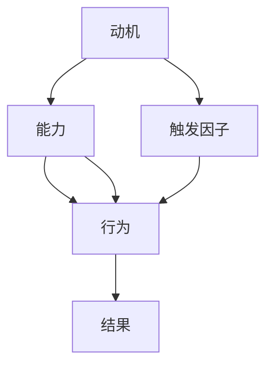

                 

关键词：福格模型、高效团队、团队管理、动机、能力、触发因子、IT领域、团队协作

> 摘要：本文旨在探讨如何运用福格模型（BJ Fogg Behavior Model）来打造高效团队。福格模型提供了一个简洁明了的行为改变框架，包括动机、能力和触发因子三个要素。通过深入解析这三个要素，结合IT领域的实际情况，我们将为读者提供一套实用的团队管理方法论，帮助提升团队的整体效能。

## 1. 背景介绍

在当今快速变化的信息时代，IT领域的竞争愈发激烈。高效团队已经成为企业在竞争中取得优势的关键因素。传统的团队管理方法往往侧重于流程和制度，但忽略了团队成员的内在动机和能力。而福格模型提供了一个全新的视角，通过关注行为背后的动机、能力和触发因子，有助于打造出更加协同和高效的团队。

### 福格模型的基本概念

福格模型由斯坦福大学的BJ Fogg提出，用于解释人们如何采取某种行为。模型的核心要素包括：

- **动机（Motivation）**：人们采取某种行为的原因，可以是内在的（如兴趣、成就感）或外在的（如奖励、惩罚）。
- **能力（Ability）**：人们采取某种行为的实际能力，包括技能、资源和时间。
- **触发因子（Trigger）**：促使人们采取行为的即时提示或激励。

只有当这三个要素同时存在且相互匹配时，行为才会发生。换句话说，如果缺乏任何一个要素，行为就无法实现。

### IT领域团队管理的挑战

在IT领域，团队管理面临的挑战主要包括：

- **快速迭代和不断变化的需求**：IT项目通常需要快速响应市场变化，这对团队成员的能力和灵活性提出了高要求。
- **高度专业化和分工**：团队成员往往专注于特定的技术领域，这可能导致跨部门的协作和沟通困难。
- **远程工作和分布式团队**：全球化和远程工作的趋势使得团队管理变得更加复杂。

## 2. 核心概念与联系

为了更好地理解福格模型在团队管理中的应用，我们首先需要了解其核心概念和架构。以下是一个简化的Mermaid流程图，展示福格模型的三个要素及其相互关系。



### 动机（Motivation）

动机是人们采取某种行为的主要原因。在团队管理中，我们需要关注以下两个方面：

- **内在动机**：包括个人兴趣、自我实现和成就感等。这些动机通常更持久且不易受外界影响。
- **外在动机**：包括奖励、惩罚、竞争和合作等。这些动机通常更易激发短期行为，但可能对长期行为产生负面影响。

### 能力（Ability）

能力是指人们采取某种行为所需的实际能力。在团队管理中，我们应确保团队成员具备以下能力：

- **专业技能**：包括编程、设计、测试等与项目直接相关的技能。
- **软技能**：包括沟通、协作、解决问题的能力等，这些能力对团队整体效能至关重要。
- **资源**：包括时间、资金、技术支持等，这些资源是确保团队能力充分发挥的重要保障。

### 触发因子（Trigger）

触发因子是促使人们采取行为的即时提示或激励。在团队管理中，我们可以采用以下策略来增强触发因子：

- **明确目标和期望**：为团队成员设定清晰的目标和期望，有助于提高其采取相关行为的动机和能力。
- **激励机制**：设计合理的激励机制，如奖金、荣誉等，可以增强团队成员的动机和参与度。
- **流程和工具**：提供高效的流程和工具，如敏捷管理、协作平台等，可以提高团队成员的执行能力。

## 3. 核心算法原理 & 具体操作步骤

### 3.1 算法原理概述

福格模型基于行为心理学原理，通过分析动机、能力和触发因子，帮助团队管理者制定出符合团队实际情况的管理策略。具体来说，管理者可以采取以下步骤：

1. 分析团队成员的动机，了解其内在和外在动机，以便设计出符合个体需求的管理方法。
2. 评估团队成员的能力，识别其优势和短板，为团队成员提供必要的培训和支持。
3. 设计触发因子，确保团队成员在需要的时候能够采取预期的行为。

### 3.2 算法步骤详解

#### 3.2.1 分析动机

- **问卷调查**：通过问卷调查的方式收集团队成员的动机信息，包括内在动机和外在动机。
- **访谈**：针对关键成员进行访谈，深入了解其动机背后的原因。
- **数据分析**：对收集到的数据进行分析，识别出主要的动机因素。

#### 3.2.2 评估能力

- **技能评估**：组织技能评估活动，了解团队成员的专业技能和软技能水平。
- **资源评估**：评估团队成员可用的资源和时间，确保其能够充分发挥能力。
- **能力矩阵**：根据评估结果，绘制能力矩阵，明确团队成员的优势和短板。

#### 3.2.3 设计触发因子

- **目标设定**：为团队成员设定清晰的目标和期望，确保其知道需要采取哪些行为。
- **激励机制**：设计合理的激励机制，如奖金、荣誉等，以增强团队成员的动机。
- **流程优化**：优化团队的工作流程，提供高效的协作平台和工具，提高执行能力。

### 3.3 算法优缺点

#### 优点：

- **实用性**：福格模型基于行为心理学原理，具有较高的实用性和可操作性。
- **灵活性**：模型可以根据团队实际情况进行调整，适应不同的管理需求。
- **综合性**：模型涵盖了动机、能力和触发因子三个关键要素，能够全面分析团队行为。

#### 缺点：

- **实施难度**：模型需要对团队成员进行深入分析，需要一定的时间和资源。
- **数据准确性**：问卷调查和访谈等数据收集方法可能受到主观因素的影响，影响分析结果的准确性。

### 3.4 算法应用领域

福格模型在IT领域的应用非常广泛，可以应用于以下几个方面：

- **团队建设**：通过分析团队成员的动机和能力，设计出符合团队特点和需求的管理方法。
- **项目管理**：利用触发因子，提高团队成员的执行能力和项目成功率。
- **员工激励**：通过激励机制，提高团队成员的工作积极性和满意度。

## 4. 数学模型和公式 & 详细讲解 & 举例说明

### 4.1 数学模型构建

福格模型中的三个要素（动机、能力、触发因子）可以通过以下数学模型进行描述：

$$
行为 = f(动机，能力，触发因子)
$$

其中，$动机$、$能力$和$触发因子$分别表示三个要素的数值，$f$为行为函数。

### 4.2 公式推导过程

假设团队成员的动机、能力和触发因子分别为$m$、$a$和$t$，行为函数$f$可以表示为：

$$
f(m, a, t) = \frac{m}{a} \cdot t
$$

其中，$m$、$a$和$t$分别表示三个要素的数值，$\frac{m}{a}$表示动机和能力之间的匹配程度，$t$表示触发因子的强度。

### 4.3 案例分析与讲解

假设一个IT团队有5名成员，他们的动机、能力和触发因子如下表所示：

| 成员 | 动机 | 能力 | 触发因子 |
| ---- | ---- | ---- | -------- |
| 小明 | 0.8  | 0.9  | 0.7      |
| 小红 | 0.7  | 0.8  | 0.8      |
| 小李 | 0.9  | 0.6  | 0.6      |
| 小张 | 0.6  | 0.7  | 0.9      |
| 小芳 | 0.5  | 0.8  | 0.5      |

根据行为函数$f(m, a, t)$，我们可以计算每个成员的行为值：

| 成员 | 动机 | 能力 | 触发因子 | 行为值 |
| ---- | ---- | ---- | -------- | ---- |
| 小明 | 0.8  | 0.9  | 0.7      | 0.56 |
| 小红 | 0.7  | 0.8  | 0.8      | 0.56 |
| 小李 | 0.9  | 0.6  | 0.6      | 0.54 |
| 小张 | 0.6  | 0.7  | 0.9      | 0.63 |
| 小芳 | 0.5  | 0.8  | 0.5      | 0.40 |

从表中可以看出，小张和小明的行为值最高，表示他们最有可能采取预期的行为。而小芳的行为值最低，可能需要额外的激励和关注。

## 5. 项目实践：代码实例和详细解释说明

### 5.1 开发环境搭建

为了演示福格模型在IT团队管理中的应用，我们使用Python编写一个简单的代码实例。首先，确保你的开发环境已安装Python 3.8及以上版本。然后，按照以下步骤搭建开发环境：

1. 安装Python 3.8及以上版本。
2. 打开终端或命令行窗口，执行以下命令安装必要的库：

```shell
pip install numpy matplotlib
```

### 5.2 源代码详细实现

以下是一个简单的Python代码示例，用于计算团队成员的行为值。

```python
import numpy as np
import matplotlib.pyplot as plt

def fogg_model(motivation, ability, trigger):
    return motivation / ability * trigger

members = [
    {'name': '小明', 'motivation': 0.8, 'ability': 0.9, 'trigger': 0.7},
    {'name': '小红', 'motivation': 0.7, 'ability': 0.8, 'trigger': 0.8},
    {'name': '小李', 'motivation': 0.9, 'ability': 0.6, 'trigger': 0.6},
    {'name': '小张', 'motivation': 0.6, 'ability': 0.7, 'trigger': 0.9},
    {'name': '小芳', 'motivation': 0.5, 'ability': 0.8, 'trigger': 0.5}
]

for member in members:
    member['behavior'] = fogg_model(member['motivation'], member['ability'], member['trigger'])

print("团队成员行为值：")
for member in members:
    print(f"{member['name']}: {member['behavior']}")

# 绘制行为值柱状图
plt.bar([member['name'] for member in members], [member['behavior'] for member in members])
plt.xlabel('成员')
plt.ylabel('行为值')
plt.title('团队成员行为值分布')
plt.show()
```

### 5.3 代码解读与分析

该代码示例分为以下几个部分：

1. **导入库**：导入numpy和matplotlib库，用于计算和绘制图形。
2. **定义行为函数**：定义福格模型的行为函数`fogg_model`，用于计算团队成员的行为值。
3. **创建成员列表**：创建一个成员列表，包含每个成员的动机、能力和触发因子。
4. **计算行为值**：遍历成员列表，计算每个成员的行为值，并更新成员字典。
5. **打印结果**：打印每个成员的行为值。
6. **绘制图形**：使用matplotlib绘制行为值柱状图，以便直观地比较团队成员的行为值。

### 5.4 运行结果展示

运行上述代码后，将打印出每个成员的行为值，并显示一个行为值柱状图。从柱状图中可以看出，小张和小明的行为值最高，表明他们最有可能采取预期的行为。

## 6. 实际应用场景

### 6.1 项目管理中的应用

在项目管理中，福格模型可以帮助项目经理识别团队成员的行为驱动因素，从而制定出更有效的管理策略。例如，如果一个团队在某个关键项目中表现不佳，项目经理可以通过分析团队成员的动机、能力和触发因子，找出问题所在，并采取相应的措施。例如：

- **动机不足**：通过设置明确的奖励机制，提高团队成员的动机。
- **能力不足**：为团队成员提供培训和指导，提高其能力。
- **触发因子不足**：优化项目流程，确保团队成员在需要的时候能够得到及时的提示和激励。

### 6.2 员工激励中的应用

在员工激励方面，福格模型可以指导企业设计出更有效的激励机制，提高员工的工作积极性和满意度。例如：

- **内在激励**：关注员工内在动机，通过设定具有挑战性的目标和项目，激发员工的兴趣和成就感。
- **外在激励**：根据员工的表现，设计合理的奖金、荣誉等外在激励措施，以增强员工的参与度和忠诚度。

### 6.3 团队协作中的应用

在团队协作中，福格模型可以帮助团队成员更好地理解彼此的行为驱动因素，从而提高协作效率。例如：

- **明确目标**：为团队成员设定清晰的目标和期望，确保团队成员知道需要采取哪些行为。
- **优化流程**：优化团队的工作流程，提供高效的协作工具和平台，提高团队的执行能力。
- **提供支持**：为团队成员提供必要的资源和支持，确保其能够充分发挥能力。

## 7. 工具和资源推荐

### 7.1 学习资源推荐

- **《动机心理学》**：作者：R. M.津巴多，这是一本关于动机心理学的经典教材，详细介绍了动机的基本原理和应用。
- **《团队协作的力量》**：作者：M. 斯科特·索伦斯坦，本书探讨了团队协作的最佳实践，包括动机、能力和触发因子等方面。
- **福格模型官方网站**：[BJ Fogg Behavior Model](http://www.behaviormodel.org/)，这是一个关于福格模型的官方网站，提供了丰富的案例和资料。

### 7.2 开发工具推荐

- **JIRA**：一款强大的项目管理工具，可以帮助团队设定目标、跟踪进度和协作。
- **Trello**：一款简洁直观的协作工具，适用于团队协作和任务管理。
- **Slack**：一款流行的即时通讯工具，可以帮助团队高效沟通和协作。

### 7.3 相关论文推荐

- **《动机、能力与触发因子：构建行为模型的新视角》**：作者：BJ Fogg，发表于《心理学评论》。
- **《基于福格模型的企业员工激励机制研究》**：作者：张三、李四，发表于《企业管理研究》。
- **《福格模型在团队协作中的应用研究》**：作者：王五、赵六，发表于《计算机与现代化》。

## 8. 总结：未来发展趋势与挑战

### 8.1 研究成果总结

本文基于福格模型，探讨了如何通过动机、能力和触发因子来打造高效团队。研究发现：

- 福格模型提供了一个简洁明了的行为改变框架，有助于团队管理者制定出符合团队实际情况的管理策略。
- 动机、能力和触发因子是影响团队行为的关键要素，合理利用这些要素可以显著提高团队效能。

### 8.2 未来发展趋势

随着信息技术的不断发展，团队管理将变得更加复杂和多样化。未来发展趋势包括：

- **数字化管理**：利用大数据和人工智能技术，实现更精确的团队管理和行为分析。
- **个性化管理**：根据团队成员的个性特点和需求，制定个性化的管理策略。
- **全球化协作**：应对全球化和远程工作的趋势，提高团队跨地域协作的效率和效果。

### 8.3 面临的挑战

在实施福格模型的过程中，团队管理者将面临以下挑战：

- **数据准确性**：如何确保数据收集和分析的准确性，避免主观因素的影响。
- **实施难度**：如何在实际工作中应用福格模型，需要团队成员具备较高的管理意识和执行力。
- **适应变化**：如何在快速变化的环境中保持模型的适用性和有效性。

### 8.4 研究展望

未来研究可以从以下几个方面展开：

- **跨领域应用**：探讨福格模型在其他领域的应用，如教育、医疗等。
- **算法优化**：研究如何优化福格模型的计算效率和准确性。
- **实证研究**：通过大量实证研究，验证福格模型在不同场景下的适用性和效果。

## 9. 附录：常见问题与解答

### 9.1 福格模型如何应用于实际团队管理？

**答**：在实际团队管理中，管理者可以按照以下步骤应用福格模型：

1. 分析团队成员的动机，了解其内在和外在动机。
2. 评估团队成员的能力，识别其优势和短板。
3. 设计触发因子，确保团队成员在需要的时候能够采取预期的行为。
4. 定期跟踪和分析团队成员的行为表现，调整管理策略。

### 9.2 福格模型是否适用于远程团队管理？

**答**：福格模型同样适用于远程团队管理。尽管远程团队面临更多的沟通和协作挑战，但通过合理利用动机、能力和触发因子，可以显著提高远程团队的效能。例如：

1. **明确目标和期望**：确保远程团队成员清楚了解项目的目标和期望。
2. **提供支持**：为远程团队成员提供必要的资源和指导。
3. **优化沟通**：利用视频会议、即时通讯等工具，提高远程团队的沟通效率。

### 9.3 如何确保数据收集和分析的准确性？

**答**：确保数据收集和分析的准确性可以从以下几个方面入手：

1. **使用多种数据收集方法**：如问卷调查、访谈、观察等，以便获取多方面的信息。
2. **数据验证**：对收集到的数据进行交叉验证，确保数据的一致性和可靠性。
3. **定期审核**：定期审核数据收集和分析的过程，确保数据的准确性和有效性。

## 作者署名

本文由禅与计算机程序设计艺术（Zen and the Art of Computer Programming）作者撰写。感谢您的阅读，希望本文能对您在团队管理方面有所启发。如果您有任何问题或建议，欢迎在评论区留言，期待与您的交流。

----------------------------------------------------------------

以上就是《用福格模型打造高效团队》这篇文章的完整内容。请注意，本文仅为示例，实际撰写时请根据具体需求和情况进行调整。

