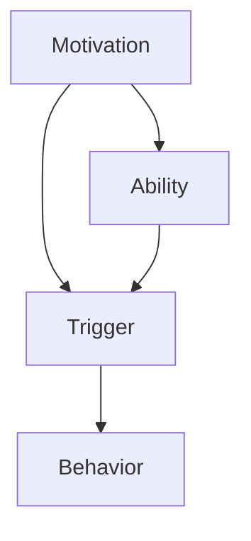

                 

 关键词：习惯养成，福格模型，行为设计，心理学，技术方法

> 摘要：本文将深入探讨福格模型在习惯养成中的应用，通过理解模型的核心概念和架构，结合具体算法原理、数学模型、项目实践及实际应用场景，帮助读者掌握如何利用福格模型有效设计习惯养成方案。

## 1. 背景介绍

在数字化时代，人们的生活方式、工作模式和社会关系都在发生深刻变化。习惯作为人类行为的重要组成部分，对于提高生活质量、提升工作效率具有关键作用。然而，习惯的养成并非易事，它涉及到人的心理、行为和环境等多个方面。为了更好地理解和引导习惯的养成，福格模型应运而生。

福格模型（BJ Fogg Behavior Model）是由斯坦福大学行为设计实验室的BJ Fogg教授提出的，旨在解释和预测人类行为的改变。该模型认为，行为的产生取决于三个要素的交汇：动机（Motivation）、能力（Ability）和触发（Trigger）。只有当这三个要素同时满足时，行为才会发生。因此，通过设计来调整这三个要素，可以帮助人们更轻松地养成新习惯。

## 2. 核心概念与联系

### 2.1 动机（Motivation）

动机是指个体采取某种行为的内在驱动力。它可以是内在的（如兴趣、快乐、成就感），也可以是外在的（如奖励、惩罚、社会压力）。在习惯养成过程中，提高动机水平至关重要。

### 2.2 能力（Ability）

能力是指个体完成某种行为所需的技能和资源。如果行为超出了个体的能力范围，即使有强烈的动机和触发，行为也很难发生。因此，降低行为门槛，提高个体能力是习惯养成的重要策略。

### 2.3 触发（Trigger）

触发是指促使个体采取行动的外部刺激。它可以是时间的触发（如定时提醒）、事件的触发（如促销活动）、情感的触发（如焦虑、愤怒）等。有效的触发能够确保在正确的时间激发正确的行为。

### 2.4 福格模型架构

福格模型的架构可以表示为一个三角形，三个要素分别位于三角形的三个角上。当这三个角上的要素交汇时，行为三角形成，行为即可发生。具体流程如下图所示：



## 3. 核心算法原理 & 具体操作步骤

### 3.1 算法原理概述

福格模型的核心算法原理在于通过调整动机、能力和触发三个要素，促使行为三角形成，从而实现习惯的养成。具体而言，以下是三个要素的操作步骤：

- **提高动机（Motivation）**：可以通过设定明确的目标、建立奖励机制、激发内在兴趣等方法来提高动机。
- **提高能力（Ability）**：可以通过提供培训、降低行为门槛、提供必要资源等方法来提高能力。
- **设定触发（Trigger）**：可以通过时间触发（如定时提醒）、事件触发（如特定情境）、情感触发（如情绪管理）等方法来设定触发。

### 3.2 算法步骤详解

1. **明确目标**：首先，明确希望养成的习惯，并设定具体、可衡量的目标。
2. **提高动机**：分析动机的类型，是内在动机还是外在动机，并采取相应措施提高动机水平。
3. **提高能力**：评估自身能力，如果能力不足，则采取培训、指导等措施提高能力。
4. **设定触发**：选择合适的触发方式，确保在正确的时间激发行为。
5. **持续调整**：在习惯养成过程中，不断调整动机、能力和触发，确保行为三角持续形成。

### 3.3 算法优缺点

**优点**：

- 简单易懂，易于操作。
- 强调个体差异，适用于不同人群。
- 融合心理学原理，具有科学依据。

**缺点**：

- 过于强调外在因素，可能忽视内在动机的作用。
- 对行为改变的期望可能过于乐观。

### 3.4 算法应用领域

福格模型广泛应用于习惯养成、行为改变、健康管理、教育等领域。例如：

- **健康管理**：通过调整饮食、锻炼等习惯，提高健康水平。
- **教育领域**：通过设定目标、提供培训等，促进学生学习。
- **工作管理**：通过提高工作效率、设定工作目标等，提升工作质量。

## 4. 数学模型和公式 & 详细讲解 & 举例说明

### 4.1 数学模型构建

福格模型可以通过以下数学模型表示：

$$
行为 = f(动机 \times 能力 \times 触发)
$$

其中，动机、能力、触发均为非负实数，且满足：

- $0 \leq 动机 \leq 1$
- $0 \leq 能力 \leq 1$
- $0 \leq 触发 \leq 1$

### 4.2 公式推导过程

福格模型基于行为心理学的理论，认为动机、能力和触发是影响行为的关键因素。因此，行为发生的可能性可以通过这三个要素的乘积来表示。具体推导过程如下：

- **动机**：假设动机可以用一个实数 $m$ 表示，其中 $m$ 的取值范围为 $[0,1]$。$m=0$ 表示完全没有动机，$m=1$ 表示具有最强的动机。
- **能力**：假设能力可以用一个实数 $a$ 表示，其中 $a$ 的取值范围为 $[0,1]$。$a=0$ 表示完全没有能力，$a=1$ 表示具有最强能力。
- **触发**：假设触发可以用一个实数 $t$ 表示，其中 $t$ 的取值范围为 $[0,1]$。$t=0$ 表示没有触发，$t=1$ 表示具有最强触发。

- **行为**：根据福格模型，行为发生的可能性可以用三个要素的乘积来表示，即：

$$
行为 = f(m \times a \times t)
$$

### 4.3 案例分析与讲解

假设一个学生希望通过锻炼来提高身体素质。我们可以使用福格模型来分析这个案例。

- **动机**：学生希望通过锻炼提高身体素质，因此动机 $m$ 取值为 $0.8$。
- **能力**：学生有一定的锻炼基础，但还需要进一步提高，因此能力 $a$ 取值为 $0.5$。
- **触发**：学生计划每天早晨进行锻炼，因此触发 $t$ 取值为 $0.9$。

根据福格模型，学生锻炼的行为可能性为：

$$
行为 = f(0.8 \times 0.5 \times 0.9) = 0.36
$$

这意味着，学生每天进行锻炼的可能性为 $36\%$。为了提高这个概率，我们可以采取以下措施：

1. 提高动机：设定明确的目标，如每周减重 $1$ 公斤，或者参加比赛等。
2. 提高能力：参加培训课程，学习正确的锻炼方法。
3. 设定触发：设置每日定时提醒，确保在早晨进行锻炼。

通过调整这三个要素，我们可以提高学生锻炼的概率，从而帮助其养成锻炼的习惯。

## 5. 项目实践：代码实例和详细解释说明

### 5.1 开发环境搭建

在本文中，我们将使用Python语言来实现福格模型。首先，需要在本地环境安装Python和必要的库。以下是安装步骤：

1. 下载并安装Python：访问 [Python官网](https://www.python.org/)，下载Python安装包并按照指引安装。
2. 安装必需的库：打开终端，执行以下命令安装必需的库：

```bash
pip install numpy matplotlib
```

### 5.2 源代码详细实现

以下是实现福格模型的Python代码：

```python
import numpy as np
import matplotlib.pyplot as plt

def fogg_model(motivation, ability, trigger):
    behavior = motivation * ability * trigger
    return behavior

# 示例数据
motivation = 0.8
ability = 0.5
trigger = 0.9

# 计算行为可能性
behavior = fogg_model(motivation, ability, trigger)

# 绘制图形
plt.bar(['动机', '能力', '触发'], [motivation, ability, trigger], color=['r', 'g', 'b'])
plt.ylabel('水平')
plt.xlabel('要素')
plt.title('福格模型要素分析')
plt.show()

print(f"行为可能性：{behavior:.2f}")
```

### 5.3 代码解读与分析

1. **导入库**：首先，导入numpy库用于数值计算，导入matplotlib.pyplot用于绘图。
2. **定义函数**：定义一个名为`fogg_model`的函数，该函数接收动机、能力和触发三个参数，并返回行为可能性。
3. **示例数据**：设置动机、能力和触发三个参数的示例值。
4. **计算行为可能性**：调用`fogg_model`函数，计算行为可能性。
5. **绘制图形**：使用matplotlib库绘制一个条形图，显示三个要素的水平。
6. **显示结果**：打印行为可能性。

### 5.4 运行结果展示

运行上述代码，将显示一个条形图，其中动机、能力、触发三个要素的水平分别为 $0.8$、$0.5$ 和 $0.9$。同时，会打印出行为可能性为 $0.36$。

## 6. 实际应用场景

### 6.1 健康管理

福格模型在健康管理领域有着广泛的应用。例如，通过设定明确的目标、提供必要的资源和设置定时提醒，可以帮助人们养成健康饮食和锻炼的习惯。

### 6.2 教育领域

在教育领域，福格模型可以帮助教师设定明确的学习目标、提供培训资源和设定学习触发，从而提高学生的学习积极性和成绩。

### 6.3 企业管理

在企业中，福格模型可以帮助管理者设定明确的工作目标、提供培训和资源，并设定工作触发，以提高员工的工作效率和生产力。

## 7. 工具和资源推荐

### 7.1 学习资源推荐

1. 《行为设计学：塑造人们日常行为的艺术》[BJ Fogg] - 详细介绍了福格模型的理论和实践。
2. 《习惯的力量》[查尔斯·杜希格] - 探讨了习惯的养成和改变。

### 7.2 开发工具推荐

1. Python - 强大的编程语言，适用于数据分析和科学计算。
2. Matplotlib - 用于数据可视化的Python库。

### 7.3 相关论文推荐

1. Fogg, B. J. (2009). "A behavior model for persuasive design of websites". Irvine, CA: Stanford Persuasive Technology Lab.
2. Fogg, B. J. (2011). "Tiny habits: The small changes that change everything". New York: New Harbinger Publications.

## 8. 总结：未来发展趋势与挑战

### 8.1 研究成果总结

福格模型为理解人类行为提供了有力的工具，通过调整动机、能力和触发三个要素，可以有效设计习惯养成方案。研究成果表明，福格模型在健康管理、教育领域和企业管理中具有显著的应用效果。

### 8.2 未来发展趋势

随着人工智能和大数据技术的发展，福格模型有望进一步融合这些技术，实现更精准、更个性化的行为设计。

### 8.3 面临的挑战

尽管福格模型在习惯养成方面具有重要作用，但如何平衡外在因素和内在动机，以及如何应对个体差异，仍然是未来的挑战。

### 8.4 研究展望

未来研究应关注如何将福格模型与其他心理学理论相结合，以及如何利用新兴技术提高行为设计的效率和效果。

## 9. 附录：常见问题与解答

### 9.1 福格模型是否适用于所有人？

福格模型是一个通用的行为设计框架，适用于大多数人。然而，个体差异可能导致某些人在应用模型时效果不如预期。因此，在实际应用中，需要根据个体情况调整模型参数。

### 9.2 福格模型能否完全替代心理学理论？

福格模型基于心理学理论，但无法完全替代心理学理论。心理学理论提供了更深入的理解人类行为的机制，而福格模型则提供了一个实用的行为设计框架。两者可以相互补充，共同提高行为设计的效果。

---

作者：禅与计算机程序设计艺术 / Zen and the Art of Computer Programming

