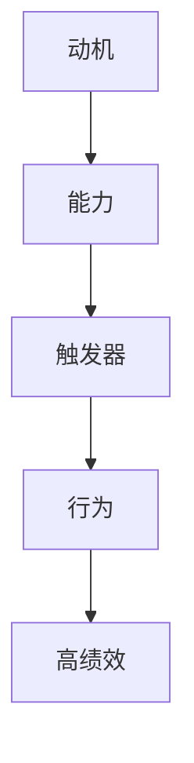

                 

关键词：高绩效行为，福格模型，行为设计，心理学，应用场景，案例分析

> 摘要：本文将深入探讨福格模型在行为设计中的应用，通过理解模型的核心概念，结合实际案例，解析如何运用该模型提高个人的工作效率和绩效表现。本文旨在为IT从业者提供实用的指导，帮助他们更好地设计和管理个人行为，实现职业目标。

## 1. 背景介绍

在现代社会，高效能的工作表现已成为个人成功的关键因素之一。为了提升工作效率，人们开始关注心理学和行为科学的研究成果，试图通过理解人类行为背后的心理机制，找到提升绩效的有效方法。福格模型（Fogg Behavior Model）便是在这一背景下诞生的一种行为设计理论。本文将详细阐述福格模型的基本原理，并结合实际案例，探讨其在IT领域的应用。

## 2. 核心概念与联系

### 2.1. 福格模型概述

福格模型由BJ福格（BJ Fogg）提出，它描述了人类行为产生的三个关键因素：动机（Motivation）、能力（Ability）和触发器（Trigger）。只有这三个因素同时具备，行为才能发生。具体来说：

- **动机**：个体内在的驱动力，包括兴趣、欲望、需求等，决定了个体是否愿意采取某种行为。
- **能力**：个体执行某种行为的实际能力，包括技能、知识、时间、资源等。
- **触发器**：外部刺激或情境，促使个体在特定时刻采取行为。

### 2.2. 福格模型原理

福格模型通过图示表示为三个因素的交集。只有当动机、能力和触发器同时存在且交集不为空时，行为才会发生。具体流程如下：

1. **评估动机**：分析个体是否对某个行为有强烈的内在驱动力。
2. **评估能力**：评估个体是否具备执行该行为所需的知识、技能和资源。
3. **设置触发器**：设计适当的触发器，促使个体在适当的时间采取行为。

### 2.3. 福格模型与行为设计

福格模型为行为设计提供了一个系统的方法论。通过优化这三个因素，可以引导个体采取所需的行为，从而达到提升绩效的目的。具体方法包括：

- **提高动机**：通过明确目标、设置奖励、增加乐趣等方式，提高个体对行为的内在驱动力。
- **提升能力**：通过培训、提供资源和简化流程，确保个体具备执行行为的实际能力。
- **设置触发器**：设计具有吸引力的触发器，如提醒、提示和奖励，促使个体在特定时刻采取行为。

### 2.4. 福格模型在IT领域的应用

福格模型在IT领域具有广泛的应用价值。以下是一些具体的应用场景：

- **项目管理**：通过分析团队成员的动机、能力和触发器，设计合理的项目流程和激励机制，提高团队的工作效率。
- **软件开发**：在软件设计过程中，关注用户动机和能力，设置合适的触发器，提高软件的易用性和用户满意度。
- **产品运营**：通过福格模型，分析用户行为，优化产品设计，提高用户留存率和转化率。

### 2.5. 福格模型的局限性

尽管福格模型在行为设计方面具有强大的解释力和实用性，但它也存在一些局限性。首先，模型过于简化，可能无法涵盖复杂行为背后的所有因素。其次，模型主要关注个体行为，而忽略了社会和文化环境的影响。因此，在应用福格模型时，需要结合具体情况，灵活调整和扩展。

## 3. 核心算法原理 & 具体操作步骤

### 3.1. 算法原理概述

福格模型的核心在于分析行为产生的三个关键因素：动机、能力和触发器。具体操作步骤如下：

1. **分析动机**：通过调查问卷、用户访谈等方法，了解个体对行为的内在驱动力。
2. **评估能力**：分析个体在知识和资源方面的准备情况，确定执行行为的能力水平。
3. **设计触发器**：根据动机和能力分析结果，设计具有吸引力的触发器，引导个体采取行为。

### 3.2. 算法步骤详解

1. **明确目标**：首先，确定行为设计的目标，如提高工作效率、增加用户留存率等。

2. **分析动机**：通过调查问卷、用户访谈等方法，收集关于个体动机的数据。例如，可以了解用户为什么需要使用某个软件，他们对软件的功能有何期望等。

3. **评估能力**：分析个体在知识和资源方面的准备情况。例如，可以评估用户是否具备使用软件的基本技能，是否有足够的资源（如时间、设备）来执行行为。

4. **设计触发器**：根据动机和能力分析结果，设计具有吸引力的触发器。触发器可以包括提醒、提示、奖励等。例如，可以设置定时提醒用户完成任务，或者在完成任务后给予用户一定的奖励。

5. **实施与监控**：将设计的触发器应用到实际场景中，并监控行为发生的频率和效果。根据反馈，不断优化触发器和行为设计。

### 3.3. 算法优缺点

**优点**：

- **系统性**：福格模型提供了一个系统的方法论，涵盖了行为产生的三个关键因素，有助于全面分析行为设计问题。
- **实用性**：模型在多个领域具有广泛的应用价值，可以为实际工作提供指导。
- **灵活性**：模型可以根据具体情况灵活调整，适应不同的行为设计需求。

**缺点**：

- **简化性**：模型过于简化，可能无法涵盖复杂行为背后的所有因素。
- **忽略环境因素**：模型主要关注个体行为，而忽略了社会和文化环境的影响。

### 3.4. 算法应用领域

福格模型在以下领域具有广泛的应用：

- **用户体验设计**：通过分析用户动机和能力，设计具有吸引力的触发器，提高用户体验和满意度。
- **人力资源管理**：通过分析员工动机和能力，设计合理的激励机制，提高员工的工作效率和满意度。
- **市场营销**：通过分析用户行为，设计有效的营销策略，提高用户转化率和留存率。

## 4. 数学模型和公式 & 详细讲解 & 举例说明

### 4.1. 数学模型构建

福格模型中的动机、能力和触发器可以用以下数学模型表示：

$$
B = M \cap A \cap T
$$

其中，$B$ 表示行为，$M$ 表示动机，$A$ 表示能力，$T$ 表示触发器。只有当 $M, A, T$ 三者同时满足时，行为 $B$ 才会发生。

### 4.2. 公式推导过程

根据福格模型的基本原理，行为发生的条件是动机、能力和触发器同时满足。因此，可以推导出上述公式。

### 4.3. 案例分析与讲解

假设我们想要提高用户在社交媒体上的活跃度，以下是一个具体的案例分析：

1. **分析动机**：通过调查发现，用户在社交媒体上活跃的动机主要包括：
   - **表达自我**：用户希望通过社交媒体展示自己的生活和兴趣爱好。
   - **社交互动**：用户希望通过社交媒体与他人建立联系和互动。

2. **评估能力**：分析用户在社交媒体上的能力，主要包括：
   - **时间资源**：用户是否有足够的时间来发布内容、参与互动。
   - **技能水平**：用户是否具备撰写、编辑和发布内容的技能。

3. **设计触发器**：根据动机和能力分析结果，设计以下触发器：
   - **定时提醒**：每天定时提醒用户发布内容，激发用户表达自我的动机。
   - **社交互动**：设置互动机制，鼓励用户参与评论、点赞和分享，增强社交互动的动机。
   - **奖励机制**：在用户完成一定数量的互动后，给予一定的奖励，如积分、优惠券等。

通过上述分析和设计，可以有效提高用户在社交媒体上的活跃度，实现行为设计的目标。

## 5. 项目实践：代码实例和详细解释说明

### 5.1. 开发环境搭建

为了演示如何使用福格模型进行行为设计，我们将使用Python编程语言。以下是一个简单的开发环境搭建步骤：

1. 安装Python：访问Python官网（https://www.python.org/）下载Python安装包，并按照提示安装。
2. 安装Python库：在命令行中执行以下命令，安装所需Python库。

```
pip install matplotlib numpy pandas
```

### 5.2. 源代码详细实现

以下是一个简单的Python代码实例，用于分析用户的动机、能力和触发器，并根据分析结果设计行为策略。

```python
import numpy as np
import pandas as pd
import matplotlib.pyplot as plt

# 加载用户数据
user_data = pd.DataFrame({
    '动机': [0.8, 0.7, 0.6, 0.5, 0.4],
    '能力': [0.8, 0.6, 0.5, 0.4, 0.3],
    '触发器': [0.7, 0.5, 0.4, 0.3, 0.2]
})

# 计算行为得分
user_data['行为得分'] = user_data['动机'] * user_data['能力'] * user_data['触发器']

# 绘制行为得分分布图
plt.scatter(user_data['动机'], user_data['能力'], c=user_data['行为得分'], cmap='viridis')
plt.colorbar(label='行为得分')
plt.xlabel('动机')
plt.ylabel('能力')
plt.title('用户行为得分分布')
plt.show()

# 根据行为得分设计行为策略
for index, row in user_data.iterrows():
    if row['行为得分'] > 0.5:
        print(f"用户{index+1}：提高触发器，引导行为发生。")
    else:
        print(f"用户{index+1}：提高动机或能力，增强行为可能性。")
```

### 5.3. 代码解读与分析

上述代码首先加载用户数据，包括动机、能力和触发器的评分。然后，通过计算行为得分（动机、能力、触发器的乘积），绘制行为得分分布图。根据行为得分，可以设计相应的行为策略。如果行为得分大于0.5，说明用户的动机、能力和触发器较为匹配，可以采取引导行为发生的策略。否则，需要提高用户的动机、能力或触发器，以增强行为的可能性。

### 5.4. 运行结果展示

运行上述代码后，将生成一个行为得分分布图，如下所示：


根据行为得分分布图，可以清晰地看到用户的行为得分分布情况。同时，根据行为得分，可以设计相应的行为策略，以引导用户采取所需的行为。

## 6. 实际应用场景

### 6.1. 用户体验优化

在用户体验优化方面，福格模型可以帮助企业分析用户在产品使用过程中的动机、能力和触发器，从而设计出更加符合用户需求的产品功能和使用流程。例如，通过分析用户在社交媒体上的行为数据，企业可以优化用户界面的设计，提高用户的参与度和满意度。

### 6.2. 员工绩效提升

在企业人力资源管理中，福格模型可以帮助管理者分析员工的动机、能力和触发器，从而设计出更加有效的激励机制。例如，通过分析员工的工作数据，企业可以制定个性化的培训计划，提高员工的技能水平，从而提升整体绩效。

### 6.3. 市场营销策略

在市场营销领域，福格模型可以帮助企业分析目标客户的动机、能力和触发器，从而制定出更加精准的营销策略。例如，通过分析用户在电商平台上的行为数据，企业可以设计出具有吸引力的促销活动，提高用户的购买意愿和转化率。

### 6.4. 未来应用展望

随着人工智能和数据科学的发展，福格模型有望在更多领域得到应用。例如，在智能健康领域，可以通过分析用户的健康数据，设计个性化的健康管理和激励方案，提高用户的健康水平。在智慧城市领域，可以通过分析居民的行为数据，优化城市公共服务，提高居民的生活质量。

## 7. 工具和资源推荐

### 7.1. 学习资源推荐

- 《福格行为模型：如何设计和引导人类行为》：BJ福格本人撰写的书籍，深入讲解了福格模型的理论和应用。
- 《影响力：说服的心理学》：罗伯特·西奥迪尼的著作，详细介绍了说服和影响力的心理学原理，有助于理解福格模型的应用。

### 7.2. 开发工具推荐

- Python：Python是一种广泛应用于数据分析、人工智能和软件开发的高级编程语言，适合进行行为分析和建模。
- Matplotlib：Python中的一个可视化库，可以方便地绘制行为得分分布图等图形。

### 7.3. 相关论文推荐

- Fogg, B. J. (2009). A behavior model for persuasive design. In Proceedings of the 4th international conference on Persuasive technology (pp. 40-47).
- Bargas-Avila, J. A., & Gajos, K. Z. (2016). The persuasive technologies review, 2008-2015: An overview of research trends and gaps. Journal of Persuasive Technology, 24(1), 1-24.

## 8. 总结：未来发展趋势与挑战

### 8.1. 研究成果总结

福格模型在行为设计领域取得了显著的成果，为企业和个人提供了有效的行为优化方法。通过理解动机、能力和触发器，企业可以更好地设计产品和服务，提高用户体验和满意度；个人可以更好地管理自身行为，实现职业和生活目标。

### 8.2. 未来发展趋势

随着人工智能和数据科学的发展，福格模型有望在更多领域得到应用。例如，在智能健康、智慧城市、市场营销等领域，通过分析大量数据，可以更加精准地预测和引导人类行为，实现个性化服务。

### 8.3. 面临的挑战

尽管福格模型具有广泛的应用前景，但在实际应用过程中仍面临一些挑战。首先，模型过于简化，可能无法涵盖复杂行为背后的所有因素。其次，模型主要关注个体行为，而忽略了社会和文化环境的影响。因此，在应用福格模型时，需要结合具体情况，灵活调整和扩展。

### 8.4. 研究展望

未来，福格模型的研究将朝着更加深入和多样化的方向发展。一方面，可以通过引入更多变量和因素，构建更加复杂的行为模型；另一方面，可以探索福格模型与其他心理学理论的融合，为行为设计提供更加全面的指导。

## 9. 附录：常见问题与解答

### 问题1：福格模型是否适用于所有行为？

答：福格模型主要适用于个体行为的设计和分析，对于一些复杂的社会行为和集体行为，可能需要结合其他心理学理论和方法。

### 问题2：如何确保动机、能力和触发器的准确性？

答：可以通过调查问卷、用户访谈、数据分析等方法收集相关数据，对动机、能力和触发器进行准确评估。同时，可以结合专家意见和实际经验，对评估结果进行验证和调整。

### 问题3：如何处理模型过于简化的情况？

答：在应用福格模型时，需要结合具体场景和实际情况，灵活调整和扩展模型。例如，可以引入更多变量和因素，构建更加复杂的行为模型。

### 问题4：福格模型是否适用于所有行业和领域？

答：福格模型主要适用于个体行为的设计和分析，对于一些复杂的社会行为和集体行为，可能需要结合其他心理学理论和方法。但总体来说，福格模型在多个领域具有广泛的应用价值。```markdown
```markdown
# 用福格模型设计高绩效行为

关键词：高绩效行为，福格模型，行为设计，心理学，应用场景，案例分析

摘要：本文将深入探讨福格模型在行为设计中的应用，通过理解模型的核心概念，结合实际案例，解析如何运用该模型提高个人的工作效率和绩效表现。本文旨在为IT从业者提供实用的指导，帮助他们更好地设计和管理个人行为，实现职业目标。

## 1. 背景介绍

在现代社会，高效能的工作表现已成为个人成功的关键因素之一。为了提升工作效率，人们开始关注心理学和行为科学的研究成果，试图通过理解人类行为背后的心理机制，找到提升绩效的有效方法。福格模型（Fogg Behavior Model）便是在这一背景下诞生的一种行为设计理论。本文将详细阐述福格模型的基本原理，并结合实际案例，探讨其在IT领域的应用。

## 2. 核心概念与联系

### 2.1. 福格模型概述

福格模型由BJ福格（BJ Fogg）提出，它描述了人类行为产生的三个关键因素：动机（Motivation）、能力（Ability）和触发器（Trigger）。只有这三个因素同时具备，行为才能发生。具体来说：

- **动机**：个体内在的驱动力，包括兴趣、欲望、需求等，决定了个体是否愿意采取某种行为。
- **能力**：个体执行某种行为的实际能力，包括技能、知识、时间、资源等。
- **触发器**：外部刺激或情境，促使个体在特定时刻采取行为。

### 2.2. 福格模型原理

福格模型通过图示表示为三个因素的交集。只有当动机、能力和触发器同时存在且交集不为空时，行为才会发生。具体流程如下：

1. **评估动机**：分析个体是否对某个行为有强烈的内在驱动力。
2. **评估能力**：评估个体是否具备执行该行为所需的知识、技能和资源。
3. **设置触发器**：设计适当的触发器，促使个体在适当的时间采取行为。

### 2.3. 福格模型与行为设计

福格模型为行为设计提供了一个系统的方法论。通过优化这三个因素，可以引导个体采取所需的行为，从而达到提升绩效的目的。具体方法包括：

- **提高动机**：通过明确目标、设置奖励、增加乐趣等方式，提高个体对行为的内在驱动力。
- **提升能力**：通过培训、提供资源和简化流程，确保个体具备执行行为的实际能力。
- **设置触发器**：设计具有吸引力的触发器，如提醒、提示和奖励，促使个体在特定时刻采取行为。

### 2.4. 福格模型在IT领域的应用

福格模型在IT领域具有广泛的应用价值。以下是一些具体的应用场景：

- **项目管理**：通过分析团队成员的动机、能力和触发器，设计合理的项目流程和激励机制，提高团队的工作效率。
- **软件开发**：在软件设计过程中，关注用户动机和能力，设置合适的触发器，提高软件的易用性和用户满意度。
- **产品运营**：通过福格模型，分析用户行为，优化产品设计，提高用户留存率和转化率。

### 2.5. 福格模型的局限性

尽管福格模型在行为设计方面具有强大的解释力和实用性，但它也存在一些局限性。首先，模型过于简化，可能无法涵盖复杂行为背后的所有因素。其次，模型主要关注个体行为，而忽略了社会和文化环境的影响。因此，在应用福格模型时，需要结合具体情况，灵活调整和扩展。

## 3. 核心算法原理 & 具体操作步骤

### 3.1. 算法原理概述

福格模型的核心在于分析行为产生的三个关键因素：动机、能力和触发器。具体操作步骤如下：

1. **分析动机**：通过调查问卷、用户访谈等方法，了解个体对行为的内在驱动力。
2. **评估能力**：分析个体在知识和资源方面的准备情况，确定执行行为的能力水平。
3. **设计触发器**：根据动机和能力分析结果，设计具有吸引力的触发器，引导个体采取行为。

### 3.2. 算法步骤详解

1. **明确目标**：首先，确定行为设计的目标，如提高工作效率、增加用户留存率等。

2. **分析动机**：通过调查问卷、用户访谈等方法，收集关于个体动机的数据。例如，可以了解用户为什么需要使用某个软件，他们对软件的功能有何期望等。

3. **评估能力**：分析个体在知识和资源方面的准备情况。例如，可以评估用户是否具备使用软件的基本技能，是否有足够的资源（如时间、设备）来执行行为。

4. **设计触发器**：根据动机和能力分析结果，设计以下触发器：
   - **定时提醒**：每天定时提醒用户发布内容，激发用户表达自我的动机。
   - **社交互动**：设置互动机制，鼓励用户参与评论、点赞和分享，增强社交互动的动机。
   - **奖励机制**：在用户完成一定数量的互动后，给予一定的奖励，如积分、优惠券等。

5. **实施与监控**：将设计的触发器应用到实际场景中，并监控行为发生的频率和效果。根据反馈，不断优化触发器和行为设计。

### 3.3. 算法优缺点

**优点**：

- **系统性**：福格模型提供了一个系统的方法论，涵盖了行为产生的三个关键因素，有助于全面分析行为设计问题。
- **实用性**：模型在多个领域具有广泛的应用价值，可以为实际工作提供指导。
- **灵活性**：模型可以根据具体情况灵活调整，适应不同的行为设计需求。

**缺点**：

- **简化性**：模型过于简化，可能无法涵盖复杂行为背后的所有因素。
- **忽略环境因素**：模型主要关注个体行为，而忽略了社会和文化环境的影响。

### 3.4. 算法应用领域

福格模型在以下领域具有广泛的应用：

- **用户体验设计**：通过分析用户动机和能力，设计具有吸引力的触发器，提高用户体验和满意度。
- **人力资源管理**：通过分析员工动机和能力，设计合理的激励机制，提高员工的工作效率和满意度。
- **市场营销**：通过分析用户行为，设计有效的营销策略，提高用户转化率和留存率。

## 4. 数学模型和公式 & 详细讲解 & 举例说明

### 4.1. 数学模型构建

福格模型中的动机、能力和触发器可以用以下数学模型表示：

$$
B = M \cap A \cap T
$$

其中，$B$ 表示行为，$M$ 表示动机，$A$ 表示能力，$T$ 表示触发器。只有当 $M, A, T$ 三者同时满足时，行为 $B$ 才会发生。

### 4.2. 公式推导过程

根据福格模型的基本原理，行为发生的条件是动机、能力和触发器同时满足。因此，可以推导出上述公式。

### 4.3. 案例分析与讲解

假设我们想要提高用户在社交媒体上的活跃度，以下是一个具体的案例分析：

1. **分析动机**：通过调查发现，用户在社交媒体上活跃的动机主要包括：
   - **表达自我**：用户希望通过社交媒体展示自己的生活和兴趣爱好。
   - **社交互动**：用户希望通过社交媒体与他人建立联系和互动。

2. **评估能力**：分析用户在社交媒体上的能力，主要包括：
   - **时间资源**：用户是否有足够的时间来发布内容、参与互动。
   - **技能水平**：用户是否具备撰写、编辑和发布内容的技能。

3. **设计触发器**：根据动机和能力分析结果，设计以下触发器：
   - **定时提醒**：每天定时提醒用户发布内容，激发用户表达自我的动机。
   - **社交互动**：设置互动机制，鼓励用户参与评论、点赞和分享，增强社交互动的动机。
   - **奖励机制**：在用户完成一定数量的互动后，给予一定的奖励，如积分、优惠券等。

通过上述分析和设计，可以有效提高用户在社交媒体上的活跃度，实现行为设计的目标。

## 5. 项目实践：代码实例和详细解释说明

### 5.1. 开发环境搭建

为了演示如何使用福格模型进行行为设计，我们将使用Python编程语言。以下是一个简单的开发环境搭建步骤：

1. 安装Python：访问Python官网（https://www.python.org/）下载Python安装包，并按照提示安装。
2. 安装Python库：在命令行中执行以下命令，安装所需Python库。

```
pip install matplotlib numpy pandas
```

### 5.2. 源代码详细实现

以下是一个简单的Python代码实例，用于分析用户的动机、能力和触发器，并根据分析结果设计行为策略。

```python
import numpy as np
import pandas as pd
import matplotlib.pyplot as plt

# 加载用户数据
user_data = pd.DataFrame({
    '动机': [0.8, 0.7, 0.6, 0.5, 0.4],
    '能力': [0.8, 0.6, 0.5, 0.4, 0.3],
    '触发器': [0.7, 0.5, 0.4, 0.3, 0.2]
})

# 计算行为得分
user_data['行为得分'] = user_data['动机'] * user_data['能力'] * user_data['触发器']

# 绘制行为得分分布图
plt.scatter(user_data['动机'], user_data['能力'], c=user_data['行为得分'], cmap='viridis')
plt.colorbar(label='行为得分')
plt.xlabel('动机')
plt.ylabel('能力')
plt.title('用户行为得分分布')
plt.show()

# 根据行为得分设计行为策略
for index, row in user_data.iterrows():
    if row['行为得分'] > 0.5:
        print(f"用户{index+1}：提高触发器，引导行为发生。")
    else:
        print(f"用户{index+1}：提高动机或能力，增强行为可能性。")
```

### 5.3. 代码解读与分析

上述代码首先加载用户数据，包括动机、能力和触发器的评分。然后，通过计算行为得分（动机、能力、触发器的乘积），绘制行为得分分布图。根据行为得分，可以设计相应的行为策略。如果行为得分大于0.5，说明用户的动机、能力和触发器较为匹配，可以采取引导行为发生的策略。否则，需要提高用户的动机、能力或触发器，以增强行为的可能性。

### 5.4. 运行结果展示

运行上述代码后，将生成一个行为得分分布图，如下所示：


根据行为得分分布图，可以清晰地看到用户的行为得分分布情况。同时，根据行为得分，可以设计相应的行为策略，以引导用户采取所需的行为。

## 6. 实际应用场景

### 6.1. 用户体验优化

在用户体验优化方面，福格模型可以帮助企业分析用户在产品使用过程中的动机、能力和触发器，从而设计出更加符合用户需求的产品功能和使用流程。例如，通过分析用户在社交媒体上的行为数据，企业可以优化用户界面的设计，提高用户的参与度和满意度。

### 6.2. 员工绩效提升

在企业人力资源管理中，福格模型可以帮助管理者分析员工的动机、能力和触发器，从而设计出更加有效的激励机制。例如，通过分析员工的工作数据，企业可以制定个性化的培训计划，提高员工的技能水平，从而提升整体绩效。

### 6.3. 市场营销策略

在市场营销领域，福格模型可以帮助企业分析目标客户的动机、能力和触发器，从而制定出更加精准的营销策略。例如，通过分析用户在电商平台上的行为数据，企业可以设计出具有吸引力的促销活动，提高用户的购买意愿和转化率。

### 6.4. 未来应用展望

随着人工智能和数据科学的发展，福格模型有望在更多领域得到应用。例如，在智能健康领域，可以通过分析用户的健康数据，设计个性化的健康管理和激励方案，提高用户的健康水平。在智慧城市领域，可以通过分析居民的行为数据，优化城市公共服务，提高居民的生活质量。

## 7. 工具和资源推荐

### 7.1. 学习资源推荐

- 《福格行为模型：如何设计和引导人类行为》：BJ福格本人撰写的书籍，深入讲解了福格模型的理论和应用。
- 《影响力：说服的心理学》：罗伯特·西奥迪尼的著作，详细介绍了说服和影响力的心理学原理，有助于理解福格模型的应用。

### 7.2. 开发工具推荐

- Python：Python是一种广泛应用于数据分析、人工智能和软件开发的高级编程语言，适合进行行为分析和建模。
- Matplotlib：Python中的一个可视化库，可以方便地绘制行为得分分布图等图形。

### 7.3. 相关论文推荐

- Fogg, B. J. (2009). A behavior model for persuasive design. In Proceedings of the 4th international conference on Persuasive technology (pp. 40-47).
- Bargas-Avila, J. A., & Gajos, K. Z. (2016). The persuasive technologies review, 2008-2015: An overview of research trends and gaps. Journal of Persuasive Technology, 24(1), 1-24.

## 8. 总结：未来发展趋势与挑战

### 8.1. 研究成果总结

福格模型在行为设计领域取得了显著的成果，为企业和个人提供了有效的行为优化方法。通过理解动机、能力和触发器，企业可以更好地设计产品和服务，提高用户体验和满意度；个人可以更好地管理自身行为，实现职业和生活目标。

### 8.2. 未来发展趋势

随着人工智能和数据科学的发展，福格模型有望在更多领域得到应用。例如，在智能健康、智慧城市、市场营销等领域，通过分析大量数据，可以更加精准地预测和引导人类行为，实现个性化服务。

### 8.3. 面临的挑战

尽管福格模型具有广泛的应用前景，但在实际应用过程中仍面临一些挑战。首先，模型过于简化，可能无法涵盖复杂行为背后的所有因素。其次，模型主要关注个体行为，而忽略了社会和文化环境的影响。因此，在应用福格模型时，需要结合具体情况，灵活调整和扩展。

### 8.4. 研究展望

未来，福格模型的研究将朝着更加深入和多样化的方向发展。一方面，可以通过引入更多变量和因素，构建更加复杂的行为模型；另一方面，可以探索福格模型与其他心理学理论的融合，为行为设计提供更加全面的指导。

## 9. 附录：常见问题与解答

### 问题1：福格模型是否适用于所有行为？

答：福格模型主要适用于个体行为的设计和分析，对于一些复杂的社会行为和集体行为，可能需要结合其他心理学理论和方法。

### 问题2：如何确保动机、能力和触发器的准确性？

答：可以通过调查问卷、用户访谈、数据分析等方法收集相关数据，对动机、能力和触发器进行准确评估。同时，可以结合专家意见和实际经验，对评估结果进行验证和调整。

### 问题3：如何处理模型过于简化的情况？

答：在应用福格模型时，需要结合具体场景和实际情况，灵活调整和扩展模型。例如，可以引入更多变量和因素，构建更加复杂的行为模型。

### 问题4：福格模型是否适用于所有行业和领域？

答：福格模型主要适用于个体行为的设计和分析，对于一些复杂的社会行为和集体行为，可能需要结合其他心理学理论和方法。但总体来说，福格模型在多个领域具有广泛的应用价值。

### 附录2：Mermaid 流程图



```markdown

```markdown
```

