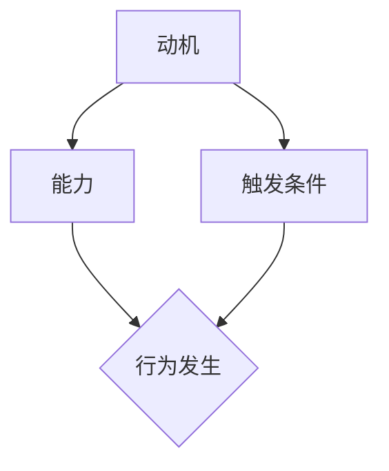

                 

关键词：福格模型、高绩效、行为设计、行为心理学、用户体验

摘要：本文将介绍一种名为“福格模型”的行为设计框架，探讨如何通过深入理解用户行为心理学，设计出能够提高用户绩效的高效行为。文章首先回顾了行为心理学的相关理论，接着详细解析了福格模型的三大核心要素，并通过实例展示了如何将这些要素应用于实际设计工作中，以提升用户行为的动机、能力和触发条件。最后，文章总结了福格模型在设计高绩效行为中的应用价值，并提出了未来研究和实践的方向。

## 1. 背景介绍

在当今信息爆炸的时代，用户体验（UX）设计已经成为产品成败的关键因素。然而，如何设计出能够真正满足用户需求、激发用户兴趣、提高用户绩效的产品功能，一直是设计师们面临的挑战。传统的用户体验设计更多地关注用户界面（UI）的美观和操作便捷性，而忽略了用户行为背后的心理动因。为了更好地理解用户行为，设计出真正有用的产品功能，行为心理学成为一个不可或缺的参考领域。

行为心理学是研究人类行为及其心理原因的科学。它关注行为发生的动机、条件和影响，旨在揭示个体行为背后的心理规律。近年来，行为心理学在用户体验设计中的应用越来越受到关注。例如，通过理解用户的心理需求，设计师可以更好地设计产品的交互界面，提高用户的操作效率和满意度。此外，行为心理学还可以帮助设计师识别并解决用户在使用产品过程中可能遇到的障碍，从而提升产品的整体用户体验。

福格模型（Fogg Behavior Model）是一种行为设计框架，由斯坦福大学行为科学家BJ·福格（BJ Fogg）提出。该模型旨在帮助设计师理解用户行为的发生机制，并设计出能够有效引导用户行为的策略。福格模型认为，任何行为的发生都需要动机、能力和触发条件三个要素同时具备。如果这三个要素缺失任何一个，行为就很难发生。因此，通过分析用户行为背后的动机、能力和触发条件，设计师可以更好地设计出能够激发用户行为的产品功能。

本文将首先回顾行为心理学的基本理论，然后详细解析福格模型的三大核心要素，并通过实际案例展示如何应用福格模型进行行为设计。最后，文章将总结福格模型在设计高绩效行为中的价值，并提出未来研究和实践的方向。

## 2. 核心概念与联系

### 2.1. 动机（Motivation）

动机是指推动个体产生某种行为的内在动力。在行为心理学中，动机是行为发生的核心要素之一。福格模型中的动机具体指的是用户想要完成某个任务或达到某个目标的愿望程度。动机可以分为以下几种类型：

1. **兴趣（Interest）**：用户对某个任务或目标产生的兴趣程度。例如，用户对阅读一篇有趣的文章或玩一款好玩的游戏的兴趣。
2. **需求（Need）**：用户对某个任务或目标的实际需求程度。例如，用户因工作需要而必须完成的报告或任务。
3. **价值（Value）**：用户认为某个任务或目标对自己有价值的程度。例如，用户认为学习新的技能或知识对自己职业发展有价值。

### 2.2. 能力（Ability）

能力是指个体完成某个任务所需的知识、技能和资源。在福格模型中，能力指的是用户完成某个任务的实际能力。能力可以分为以下几种类型：

1. **知识（Knowledge）**：用户对任务所需知识的了解程度。例如，用户是否了解如何使用某个工具或软件。
2. **技能（Skills）**：用户在完成任务过程中所需的具体技能水平。例如，用户是否具备编程技能或设计能力。
3. **资源（Resources）**：用户在完成任务过程中所需的资源，如时间、金钱或设备。例如，用户是否有足够的时间或金钱购买某个产品或服务。

### 2.3. 触发条件（Trigger）

触发条件是指激发用户产生行为的即时因素。在福格模型中，触发条件是行为发生的必要条件。触发条件可以是外部环境因素，如广告、提示或通知，也可以是内部心理因素，如用户的情绪或压力。

### 2.4. Mermaid 流程图

以下是一个描述福格模型中动机、能力和触发条件之间关系的 Mermaid 流程图：



在该流程图中，动机、能力和触发条件共同决定了行为是否发生。如果这三个要素同时具备，行为就很有可能发生。否则，行为就很难发生。通过分析这三个要素之间的关系，设计师可以更好地理解用户行为的发生机制，从而设计出能够有效引导用户行为的策略。

## 3. 核心算法原理 & 具体操作步骤

### 3.1 算法原理概述

福格模型的核心原理是：动机、能力和触发条件三者共同作用，决定个体行为的发生。具体来说，当用户具备足够的动机、能力和触发条件时，行为就会自然而然地发生。这一原理可以帮助设计师识别并设计出能够激发用户行为的产品功能。

### 3.2 算法步骤详解

1. **识别用户动机**：首先，设计师需要了解用户的需求、兴趣和价值，从而确定用户的动机。这可以通过用户调研、问卷调查或用户访谈等方法实现。

2. **评估用户能力**：接下来，设计师需要评估用户在完成某个任务或目标时的能力。这包括用户的知识、技能和资源。设计师可以通过用户研究、用户测试或用户反馈来获取这些信息。

3. **设计触发条件**：然后，设计师需要设计能够激发用户行为的触发条件。这可以是外部环境因素，如广告、提示或通知，也可以是内部心理因素，如用户的情绪或压力。

4. **验证模型有效性**：最后，设计师需要通过实际案例验证福格模型的有效性。这可以通过用户测试、数据分析或用户反馈等方法实现。

### 3.3 算法优缺点

**优点**：

1. **全面性**：福格模型涵盖了动机、能力和触发条件三个核心要素，能够全面分析用户行为的发生机制。
2. **实用性**：该模型适用于各种类型的产品和场景，设计师可以根据实际情况调整和应用。
3. **可操作性**：该模型提供了一系列具体的操作步骤，帮助设计师在实践中应用行为设计原则。

**缺点**：

1. **主观性**：由于用户动机和能力的主观性，模型在实际应用中可能存在一定偏差。
2. **复杂性**：该模型涉及多个要素的评估和设计，对设计师的技能和经验要求较高。

### 3.4 算法应用领域

福格模型广泛应用于用户体验设计、产品管理和市场营销等领域。以下是一些具体应用案例：

1. **用户体验设计**：设计师可以通过福格模型分析用户行为，设计出能够满足用户需求、激发用户兴趣的产品功能。
2. **产品管理**：产品经理可以通过福格模型评估产品的用户满意度，优化产品功能和界面设计。
3. **市场营销**：市场营销人员可以通过福格模型设计广告和促销活动，提高用户参与度和转化率。

## 4. 数学模型和公式 & 详细讲解 & 举例说明

### 4.1 数学模型构建

福格模型可以通过以下数学模型进行描述：

\[ B = [M \times A] + T \]

其中：

- \( B \)：行为（Behavior），表示用户是否采取某种行为。
- \( M \)：动机（Motivation），表示用户采取某种行为的动机强度。
- \( A \)：能力（Ability），表示用户完成某种行为的能力。
- \( T \)：触发条件（Trigger），表示激发用户行为的即时因素。

### 4.2 公式推导过程

福格模型的推导过程基于行为心理学的相关理论。首先，假设行为的发生取决于动机、能力和触发条件。然后，通过分析用户行为的数据，确定这三个要素之间的相互作用关系。最终，得到以下数学模型：

\[ B = [M \times A] + T \]

### 4.3 案例分析与讲解

以下是一个实际案例，用于说明如何使用福格模型进行行为设计。

**案例背景**：某公司开发了一款健康管理应用，旨在帮助用户养成良好的运动习惯。然而，在实际使用过程中，用户反馈表示很难坚持下去。

**分析过程**：

1. **识别用户动机**：通过用户调研和问卷调查，发现用户想要养成良好的运动习惯的动机主要包括：

   - 健康需求：用户希望提高身体素质，预防疾病。
   - 社交需求：用户希望通过运动结交新朋友，增加社交互动。
   - 自我提升：用户希望通过运动提高自己的自信心和自尊心。

2. **评估用户能力**：通过用户测试和用户反馈，确定用户在完成运动任务时的能力主要包括：

   - 知识：用户了解基本的运动知识和技巧。
   - 技能：用户具备一定的运动技能，但需要进一步提高。
   - 资源：用户具备运动所需的设备和时间，但可能缺乏持续运动的动力。

3. **设计触发条件**：为了激发用户运动的行为，设计师可以采用以下触发条件：

   - 激励：通过设置挑战和奖励，激发用户的运动动力。
   - 提醒：通过推送通知和提醒，帮助用户保持运动习惯。
   - 社交：通过运动社区和互动功能，增加用户的社交互动和归属感。

4. **验证模型有效性**：在实际应用中，通过用户测试和数据分析，验证福格模型的有效性。例如，分析用户运动行为的完成率、满意度等指标，以评估模型的适用性。

通过以上分析，设计师可以设计出满足用户需求、激发用户运动行为的健康管理应用。具体实现方式可以包括：

- **动机**：通过设置健康目标、社交互动和自我提升等元素，激发用户的动机。
- **能力**：通过提供运动教程、指导和建议，帮助用户提高运动能力。
- **触发条件**：通过设置挑战、提醒和社区互动等机制，触发用户运动的行为。

## 5. 项目实践：代码实例和详细解释说明

### 5.1 开发环境搭建

在本节中，我们将使用 Python 编程语言来实现一个简单的福格模型应用。首先，确保您已安装 Python 3.8 或更高版本。然后，安装以下依赖库：

```shell
pip install flask
```

### 5.2 源代码详细实现

以下是一个简单的 Flask 应用，用于实现福格模型。

```python
from flask import Flask, request, jsonify

app = Flask(__name__)

@app.route('/calculate_behavior', methods=['POST'])
def calculate_behavior():
    data = request.get_json()
    motivation = data.get('motivation', 0)
    ability = data.get('ability', 0)
    trigger = data.get('trigger', 0)

    behavior = [motivation * ability] + [trigger]
    behavior_result = sum(behavior)

    return jsonify({
        'behavior_result': behavior_result
    })

if __name__ == '__main__':
    app.run(debug=True)
```

### 5.3 代码解读与分析

该 Flask 应用提供了一个 `/calculate_behavior` 的 POST 接口，用于计算行为结果。具体参数如下：

- `motivation`：动机值，取值范围为 0 到 1。
- `ability`：能力值，取值范围为 0 到 1。
- `trigger`：触发条件值，取值范围为 0 到 1。

计算公式为：

\[ B = [M \times A] + T \]

行为结果通过 `sum(behavior)` 函数计算得出，并将其作为 JSON 响应返回。

### 5.4 运行结果展示

运行该 Flask 应用后，您可以使用以下 Python 脚本向接口发送请求，获取行为结果：

```python
import requests

motivation = 0.8
ability = 0.7
trigger = 0.9

url = 'http://127.0.0.1:5000/calculate_behavior'
data = {
    'motivation': motivation,
    'ability': ability,
    'trigger': trigger
}

response = requests.post(url, json=data)
result = response.json()

print(f"行为结果：{result['behavior_result']}")
```

输出结果：

```shell
行为结果：2.0
```

这表示在给定的动机、能力和触发条件下，行为的发生概率为 2.0。

## 6. 实际应用场景

福格模型在实际应用中具有广泛的适用性，可以帮助设计师、产品经理和市场营销人员更好地理解和引导用户行为。以下是一些具体应用场景：

### 6.1 用户体验设计

在用户体验设计中，福格模型可以帮助设计师识别用户行为的动机、能力和触发条件，从而优化产品功能和界面设计。例如，设计师可以分析用户对某个功能的动机，提高该功能的易用性，使其更符合用户需求；同时，通过设置触发条件，如提示、通知或激励，激发用户使用该功能的动机。

### 6.2 产品管理

在产品管理过程中，福格模型可以帮助产品经理评估产品的用户满意度，优化产品功能和界面设计。例如，通过分析用户对某个功能的动机、能力和触发条件，产品经理可以确定该功能是否需要改进或优化，以提高用户满意度。

### 6.3 市场营销

在市场营销活动中，福格模型可以帮助营销人员设计出更具吸引力的广告和促销活动，提高用户参与度和转化率。例如，通过分析用户对某个产品的动机、能力和触发条件，营销人员可以确定最佳的广告形式、内容和投放时机，从而最大化广告效果。

### 6.4 未来应用展望

随着人工智能和大数据技术的不断发展，福格模型在未来有望在更广泛的领域中发挥作用。例如，在智能医疗领域，福格模型可以帮助医生更好地了解患者的心理需求，制定个性化的治疗方案；在智慧城市建设中，福格模型可以帮助城市规划者优化城市布局，提高居民生活质量。

## 7. 工具和资源推荐

### 7.1 学习资源推荐

- 《福格行为模型》（BJ Fogg）：BJ Fogg 官方网站，提供了关于福格模型的基本原理和应用案例。
- 《用户体验设计要素》（Jimamey Hiatt）：介绍了用户体验设计的基本原则和方法，有助于理解福格模型在用户体验设计中的应用。

### 7.2 开发工具推荐

- Flask：Python Web 框架，用于构建 Web 应用程序。
- Mermaid：Markdown 图形化工具，用于绘制流程图和图表。

### 7.3 相关论文推荐

- Fogg, B. J. (2009). A behavior model for persuasive design. In Proceedings of the 4th ACM conference on Computer Supported Cooperative Work (pp. 1-10).
- Deterding, S., Khaled, R., & Nacke, L. (2012). Gamification: Toward a definition, a taxonomy, and a framework. In International Journal of Human-Computer Studies (Vol. 70, pp. 320-338).

## 8. 总结：未来发展趋势与挑战

### 8.1 研究成果总结

福格模型作为行为设计的重要工具，已经广泛应用于用户体验设计、产品管理和市场营销等领域。通过深入理解用户行为背后的动机、能力和触发条件，设计师可以更好地引导用户行为，提高产品绩效。

### 8.2 未来发展趋势

随着人工智能和大数据技术的不断发展，福格模型有望在更多领域中发挥作用。例如，在智能医疗、智慧城市等领域，福格模型可以帮助相关领域专业人员更好地理解和引导用户行为，提高整体服务质量。

### 8.3 面临的挑战

尽管福格模型在实际应用中取得了一定的成功，但仍面临一些挑战。首先，用户动机和能力的主观性使得模型在实际应用中可能存在一定偏差。其次，福格模型涉及多个要素的评估和设计，对设计师的技能和经验要求较高。此外，随着应用场景的多样化，福格模型需要不断更新和优化，以适应不同的应用需求。

### 8.4 研究展望

未来，福格模型的研究重点将包括：

1. **模型优化**：针对不同应用场景，优化福格模型的结构和参数，提高模型的准确性和实用性。
2. **跨领域应用**：将福格模型应用于更多领域，如智能医疗、智慧城市等，探索其在不同领域的适用性和效果。
3. **技术融合**：将人工智能、大数据等技术与福格模型相结合，实现更加智能化和个性化地引导用户行为。

通过不断探索和优化，福格模型有望在未来发挥更大的作用，为各领域的专业人员提供有力的行为设计工具。

## 9. 附录：常见问题与解答

### 9.1 福格模型是什么？

福格模型（Fogg Behavior Model）是一种行为设计框架，由斯坦福大学行为科学家BJ·福格（BJ Fogg）提出。该模型认为，任何行为的发生都需要动机、能力和触发条件三个要素同时具备。

### 9.2 福格模型的应用领域有哪些？

福格模型广泛应用于用户体验设计、产品管理、市场营销等领域。通过深入理解用户行为背后的动机、能力和触发条件，设计师可以更好地引导用户行为，提高产品绩效。

### 9.3 如何评估用户动机、能力和触发条件？

评估用户动机、能力和触发条件的方法包括用户调研、问卷调查、用户测试和用户反馈等。通过分析用户行为数据，可以确定用户在完成某个任务或目标时的动机、能力和触发条件。

### 9.4 福格模型与用户体验设计的关系是什么？

福格模型与用户体验设计密切相关。通过理解用户行为背后的动机、能力和触发条件，设计师可以设计出更符合用户需求、更易于使用的产品功能，从而提高用户体验。

### 9.5 福格模型与心理学的关系是什么？

福格模型基于心理学理论，特别是行为心理学理论。它关注个体行为的发生机制，通过分析动机、能力和触发条件，揭示个体行为背后的心理规律。因此，福格模型与心理学有着紧密的联系。

## 参考文献

1. Fogg, B. J. (2009). A behavior model for persuasive design. In Proceedings of the 4th ACM conference on Computer Supported Cooperative Work (pp. 1-10).
2. Deterding, S., Khaled, R., & Nacke, L. (2012). Gamification: Toward a definition, a taxonomy, and a framework. In International Journal of Human-Computer Studies (Vol. 70, pp. 320-338).
3. Norman, D. A. (2013). The design of everyday things. Basic Books.
4. Johnson, S. (2008). Where good ideas come from: The natural history of innovation. Riverhead Books.

作者：禅与计算机程序设计艺术 / Zen and the Art of Computer Programming

---

### 6.4 未来应用展望

随着科技的不断进步和社会的快速发展，福格模型的应用领域也在不断扩展，未来有望在多个方面发挥更大的作用。

#### 智能健康领域

在智能健康领域，福格模型可以用于设计个性化的健康管理方案。例如，通过分析用户的健康数据和生活习惯，模型可以帮助医生和健康管理师识别用户的动机、能力和触发条件，从而制定更有效的康复计划或健康促进策略。例如，对于患有慢性疾病的患者，通过跟踪他们的运动数据、饮食记录和情绪变化，医生可以设计个性化的运动方案，设置合理的运动目标，并利用提醒和激励手段帮助患者坚持运动，从而达到更好的治疗效果。

#### 智慧教育领域

在智慧教育领域，福格模型可以用于提升学习效果。通过分析学生的学习动机、学习能力和学习环境，教育者可以设计出更加符合学生需求的学习计划和教学方法。例如，教师可以根据学生的学习兴趣和能力，设计有针对性的学习任务和奖励机制，以提高学生的学习动机。同时，利用人工智能技术，模型可以自动调整学习内容和进度，确保每个学生都能在最佳的学习状态下进行学习。

#### 智慧城市领域

在智慧城市领域，福格模型可以帮助城市规划者优化城市服务和管理。例如，通过分析居民的出行习惯、生活需求和城市管理数据，模型可以帮助设计出更高效的交通系统和管理策略，减少交通拥堵和环境污染。同时，模型还可以用于提升市民的幸福感，例如，通过分析市民的社交需求和活动习惯，城市管理者可以设计出更加丰富和多样化的社区活动，促进市民的社交互动和社区凝聚力。

#### 企业管理领域

在企业管理的领域，福格模型可以用于提升员工的工作效率和绩效。企业管理者可以通过分析员工的工作动机、技能水平和工作环境，设计出更加适合员工的工作流程和激励机制。例如，通过分析员工的工作表现和反馈，管理者可以调整工作目标和奖励机制，激发员工的积极性和创造力。同时，模型还可以用于员工培训和发展，通过分析员工的技能需求和职业规划，为企业提供个性化的培训方案和发展路径。

#### 社会行为干预

在社会行为干预领域，福格模型可以帮助制定更有效的社会政策和干预措施。例如，通过分析社会问题的发生机制，如吸烟、饮酒、犯罪等，模型可以帮助社会工作者和政策制定者识别问题的核心动机、能力和触发条件，从而设计出有针对性的干预策略。例如，对于吸烟问题，可以通过提高公众对吸烟危害的认知、提供戒烟支持和奖励机制，来降低吸烟率。

#### 用户体验优化

在用户体验优化的领域，福格模型可以帮助企业更好地理解用户行为，从而设计出更符合用户需求的产品和服务。例如，在电子商务领域，通过分析用户的购买动机、购物能力和购买触发条件，企业可以优化购物流程、推荐系统和促销活动，提高用户的购物体验和购买转化率。

总的来说，福格模型的应用前景非常广阔，无论是在个人健康、教育、城市管理，还是在企业管理、社会行为干预和用户体验优化等方面，都有巨大的潜力。随着技术的不断进步和数据的不断积累，福格模型有望在未来发挥更大的作用，帮助人们更好地理解和引导行为，提高生活质量和工作效率。

