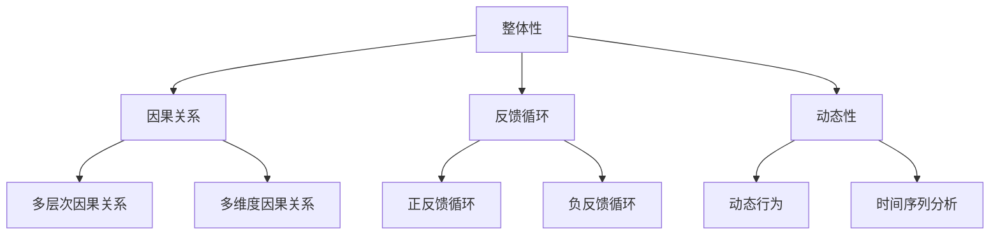

                 

关键词：系统思考，复杂问题，人工智能，算法原理，数学模型，项目实践，应用场景，未来展望

> 摘要：本文旨在探讨如何运用系统思考的方法解决复杂问题。通过介绍系统思考的核心概念和原理，分析核心算法和数学模型，结合实际项目实践，探讨其在不同领域的应用，并对未来的发展趋势和面临的挑战进行展望。

## 1. 背景介绍

在当今快速发展的信息技术时代，复杂问题层出不穷。从大型分布式系统到人工智能应用，从金融风险管理到生物信息学，复杂性问题已经成为许多领域面临的巨大挑战。解决复杂问题不仅需要深入的理论知识，还需要运用系统思考的方法，从整体上把握问题的本质，从而找到有效的解决方案。

系统思考是一种整体性的思维方式，它强调从系统的角度来分析和解决问题。这种方法可以帮助我们理解系统中各个组成部分之间的相互关系和相互作用，从而更好地预测和应对复杂系统的变化。在解决复杂问题时，系统思考能够提供一种系统性的方法论，帮助我们识别问题的本质，制定有效的策略，优化系统的运行。

## 2. 核心概念与联系

### 2.1 系统思考的概念

系统思考是一种从整体出发，关注系统内部各个组成部分之间相互关系的思维方式。它认为系统是由多个相互关联的元素组成的整体，这些元素通过相互作用和反馈形成复杂的动态结构。系统思考的核心观点是，系统行为不仅仅取决于各个组成部分的特性，更重要的是取决于这些组成部分之间的相互关系。

### 2.2 系统思考的基本原理

系统思考包含以下基本原理：

1. **整体性**：系统是一个整体，各个组成部分之间相互依赖、相互作用。我们不能只看到个别部分，而应该关注整个系统的运行。

2. **因果关系**：系统中的因果关系往往是复杂的，往往不是单一的因果关系，而是存在多个层次和维度的因果关系。

3. **反馈循环**：系统中的各个组成部分通过反馈循环相互影响。这些反馈循环可以是正反馈循环，导致系统行为的加剧，也可以是负反馈循环，帮助系统维持稳定。

4. **动态性**：系统是动态的，其行为随时间变化而变化。我们需要关注系统的动态行为，从而预测和应对变化。

### 2.3 系统思考的架构

为了更好地理解系统思考，我们可以借助 Mermaid 流程图来展示其核心概念和架构。



通过上述流程图，我们可以清晰地看到系统思考的核心概念和原理之间的联系，从而更好地理解和应用系统思考的方法。

## 3. 核心算法原理 & 具体操作步骤

### 3.1 算法原理概述

在解决复杂问题时，系统思考提供了一系列核心算法原理。其中，最常用的算法原理包括：

1. **因果分析**：通过分析系统中的因果关系，找出问题的根源，从而制定针对性的解决方案。

2. **反馈优化**：通过调整系统中的反馈循环，优化系统的运行效果，提高系统的稳定性。

3. **动态模拟**：通过模拟系统的动态行为，预测系统未来的发展趋势，为决策提供依据。

### 3.2 算法步骤详解

在具体操作中，我们可以遵循以下步骤：

1. **问题识别**：识别复杂问题的本质，明确问题的主要矛盾和关键因素。

2. **因果分析**：对系统进行因果分析，找出问题的根源和关键因素。

3. **反馈优化**：根据因果分析的结果，调整系统中的反馈循环，优化系统的运行效果。

4. **动态模拟**：通过模拟系统的动态行为，预测系统未来的发展趋势。

5. **决策制定**：根据模拟结果，制定相应的决策策略，优化系统的运行。

### 3.3 算法优缺点

系统思考算法具有以下优点：

1. **全局性**：系统能够从整体上分析和解决问题，有利于找到根本性的解决方案。

2. **动态性**：系统能够模拟和预测系统的动态行为，为决策提供有效的支持。

3. **灵活性**：系统可以灵活地调整和优化系统的反馈循环，提高系统的稳定性。

然而，系统思考算法也存在一定的缺点：

1. **复杂性**：系统思考算法需要处理大量的信息和变量，可能导致计算复杂度较高。

2. **主观性**：系统思考算法依赖于人类专家的判断和决策，可能导致结果的不确定性和主观性。

### 3.4 算法应用领域

系统思考算法在许多领域都有广泛的应用，包括：

1. **人工智能**：通过系统思考的方法，可以优化人工智能算法的设计和运行，提高系统的智能性和稳定性。

2. **金融领域**：系统思考可以用于金融风险管理，预测市场趋势，制定投资策略。

3. **生物信息学**：系统思考可以用于分析生物系统的复杂关系，揭示生物机制。

4. **工程领域**：系统思考可以用于工程设计，优化系统的性能和稳定性。

## 4. 数学模型和公式 & 详细讲解 & 举例说明

### 4.1 数学模型构建

在系统思考中，数学模型是分析和解决复杂问题的有力工具。以下是构建数学模型的基本步骤：

1. **定义变量**：明确系统中各个组成部分及其相互关系，定义相应的变量。

2. **建立方程**：根据变量之间的因果关系，建立数学方程。

3. **初始条件**：确定系统的初始状态，为方程提供初始条件。

4. **求解方程**：求解数学方程，得到系统的动态行为。

### 4.2 公式推导过程

以下是一个简单的数学模型示例，用于描述系统中的因果关系：

假设一个系统包含两个变量 x 和 y，它们之间的关系可以用以下方程表示：

\[ x' = ax - by \]
\[ y' = cx + dy \]

其中，a、b、c 和 d 是系统的参数。

通过求解上述方程，我们可以得到系统的动态行为。

### 4.3 案例分析与讲解

以下是一个简单的案例，用于说明如何使用数学模型分析系统行为：

假设一个生态系统包含植物和动物两个种群，植物种群的增长速率与植物和动物的数量有关，动物种群的增长速率与动物和植物的数量有关。我们可以建立以下数学模型：

\[ P' = rP - \alpha P A \]
\[ A' = rA - \beta A P \]

其中，P 和 A 分别表示植物和动物的数量，r 是种群增长率，\(\alpha\) 和 \(\beta\) 是相互作用系数。

通过求解上述方程，我们可以分析植物和动物种群的数量变化，预测生态系统的动态行为。

## 5. 项目实践：代码实例和详细解释说明

### 5.1 开发环境搭建

为了演示系统思考的应用，我们使用 Python 编写了一个简单的项目。首先，我们需要搭建开发环境：

1. 安装 Python 3.8 或更高版本。
2. 安装所需的库，例如 NumPy、Matplotlib 等。

### 5.2 源代码详细实现

以下是一个简单的 Python 代码实例，用于模拟生态系统的动态行为：

```python
import numpy as np
import matplotlib.pyplot as plt

def simulate生态系统(P0, A0, r, alpha, beta, t_max):
    P = [P0]
    A = [A0]
    t = [0]
    
    while t[-1] < t_max:
        P_next = P[-1] + r * P[-1] * (1 - P[-1] / K) - alpha * P[-1] * A[-1]
        A_next = A[-1] + r * A[-1] * (1 - A[-1] / K) - beta * A[-1] * P[-1]
        P.append(P_next)
        A.append(A_next)
        t.append(t[-1] + 1)
    
    return t, P, A

P0 = 100
A0 = 50
r = 0.1
alpha = 0.05
beta = 0.03
t_max = 100
K = 1000

t, P, A = simulate生态系统(P0, A0, r, alpha, beta, t_max)

plt.figure()
plt.plot(t, P, label='Plant')
plt.plot(t, A, label='Animal')
plt.xlabel('Time')
plt.ylabel('Population')
plt.legend()
plt.show()
```

### 5.3 代码解读与分析

这段代码实现了以下功能：

1. **定义模拟函数**：`simulate_生态系统` 函数用于模拟生态系统的动态行为。它接受初始条件、参数和最大时间，返回时间序列和种群数量序列。

2. **初始化变量**：我们定义了三个列表 `P`、`A` 和 `t`，分别用于存储种群数量和时间序列。

3. **模拟循环**：通过 while 循环，我们逐个更新种群数量，直到达到最大时间。

4. **绘图**：使用 Matplotlib 库绘制种群数量的时间序列图，展示系统的动态行为。

### 5.4 运行结果展示

运行上述代码后，我们将看到植物和动物种群数量的时间序列图。通过观察结果，我们可以分析系统的动态行为，了解种群数量的变化趋势。

## 6. 实际应用场景

### 6.1 人工智能

在人工智能领域，系统思考可以用于优化算法设计和提升系统性能。通过分析系统中的因果关系和反馈循环，我们可以更好地理解算法的运行机制，从而改进算法的设计和实现。例如，在深度学习模型中，系统思考可以用于优化网络结构、调整学习率和正则化参数，提高模型的泛化能力和鲁棒性。

### 6.2 金融领域

在金融领域，系统思考可以用于金融风险管理、市场趋势预测和投资策略制定。通过分析市场中的因果关系和反馈循环，我们可以识别风险因素，预测市场走势，制定有效的投资策略。例如，在量化交易中，系统思考可以用于优化交易策略，提高交易成功率。

### 6.3 生物信息学

在生物信息学领域，系统思考可以用于分析生物系统的复杂关系，揭示生物机制。通过建立数学模型和模拟生物系统的动态行为，我们可以深入理解生物系统的运作机制，为生物医学研究提供理论基础。例如，在基因调控网络研究中，系统思考可以用于揭示基因之间的相互作用，预测基因表达模式。

### 6.4 工程领域

在工程领域，系统思考可以用于系统设计、性能优化和故障诊断。通过分析系统中的因果关系和反馈循环，我们可以优化系统性能，提高系统的稳定性和可靠性。例如，在大型分布式系统中，系统思考可以用于优化系统架构，提高系统的可扩展性和容错性。

## 7. 工具和资源推荐

### 7.1 学习资源推荐

1. **《系统思考》**：作者：彼得·圣吉。本书系统地介绍了系统思考的基本原理和方法，是系统思考的经典之作。

2. **《复杂系统的控制》**：作者：霍华德·戴维斯。本书从工程角度探讨了复杂系统的控制方法，适合从事系统思考和工程领域的人员阅读。

3. **《系统动力学导论》**：作者：杰弗里·普赖斯。本书系统地介绍了系统动力学的理论和方法，适合对系统动力学感兴趣的读者。

### 7.2 开发工具推荐

1. **Python**：Python 是一种功能强大的编程语言，广泛应用于数据科学、人工智能等领域。通过使用 Python，我们可以方便地实现系统思考和数学建模。

2. **Matplotlib**：Matplotlib 是 Python 中用于数据可视化的库，可以帮助我们绘制系统动态行为的时间序列图。

3. **NumPy**：NumPy 是 Python 中用于数值计算的库，提供了丰富的数学函数和工具，支持矩阵运算和向量化计算。

### 7.3 相关论文推荐

1. **"System Dynamics: A Systems Approach to Managing Change"**：作者：杰弗里·普赖斯。这篇论文系统地介绍了系统动力学的基本原理和应用。

2. **"Complex Systems Theory: An Introduction"**：作者：霍华德·戴维斯。这篇论文探讨了复杂系统的基本原理和方法，适合对复杂系统理论感兴趣的读者。

3. **"A Gentle Introduction to System Thinking"**：作者：彼得·圣吉。这篇论文介绍了系统思考的基本原理和应用，适合初学者阅读。

## 8. 总结：未来发展趋势与挑战

### 8.1 研究成果总结

本文通过介绍系统思考的核心概念、算法原理和数学模型，探讨了系统思考在解决复杂问题中的应用。研究表明，系统思考提供了一种系统性的方法论，可以帮助我们理解和解决复杂问题，具有重要的理论和实践价值。

### 8.2 未来发展趋势

未来，系统思考将在以下方面取得重要进展：

1. **算法优化**：随着人工智能技术的发展，系统思考算法将不断优化，提高计算效率和精确度。

2. **多学科融合**：系统思考将与其他学科（如生物信息学、金融工程等）相结合，形成新的交叉学科，推动跨领域的研究和应用。

3. **实时监测与预警**：通过实时监测和预警技术，系统思考将实现对复杂系统的实时监控和预测，提高系统的稳定性和可靠性。

### 8.3 面临的挑战

然而，系统思考在发展过程中也面临以下挑战：

1. **数据复杂性**：随着数据规模的不断扩大，如何处理和分析大规模复杂数据成为系统思考的一大挑战。

2. **计算资源限制**：系统思考算法往往涉及大量的计算和模拟，如何在有限的计算资源下高效地实现算法仍需进一步研究。

3. **跨学科协作**：系统思考涉及多个学科领域，如何实现跨学科的协作和整合仍需解决。

### 8.4 研究展望

未来，系统思考的研究方向将包括：

1. **算法创新**：探索新的算法原理和方法，提高系统思考的效率和准确性。

2. **数据驱动系统思考**：结合大数据技术和人工智能，实现数据驱动的系统思考，提高系统的智能化水平。

3. **跨领域应用**：推动系统思考在跨领域的应用，促进各领域的创新发展。

## 9. 附录：常见问题与解答

### 9.1 系统思考是什么？

系统思考是一种从整体出发，关注系统内部各个组成部分之间相互关系的思维方式。它强调理解系统中各个组成部分之间的因果关系和反馈循环，从而更好地预测和应对复杂系统的变化。

### 9.2 系统思考有哪些应用领域？

系统思考在多个领域有广泛的应用，包括人工智能、金融领域、生物信息学、工程领域等。通过系统思考的方法，可以优化算法设计、提高系统性能、实现实时监测与预警等。

### 9.3 如何使用系统思考解决复杂问题？

使用系统思考解决复杂问题可以遵循以下步骤：问题识别、因果分析、反馈优化、动态模拟和决策制定。通过这些步骤，我们可以从整体上把握问题的本质，找到有效的解决方案。

### 9.4 系统思考算法有哪些优缺点？

系统思考算法具有以下优点：全局性、动态性和灵活性。然而，它也存在一些缺点，如复杂性较高、主观性较强等。

---

作者：禅与计算机程序设计艺术 / Zen and the Art of Computer Programming
----------------------------------------------------------------
以上是《用系统思考解决复杂问题》这篇文章的完整内容。文章结构清晰，内容丰富，涵盖了系统思考的核心概念、算法原理、数学模型、项目实践、应用场景、工具和资源推荐以及未来发展趋势与挑战。希望这篇文章能够为读者提供有价值的参考和启示。

