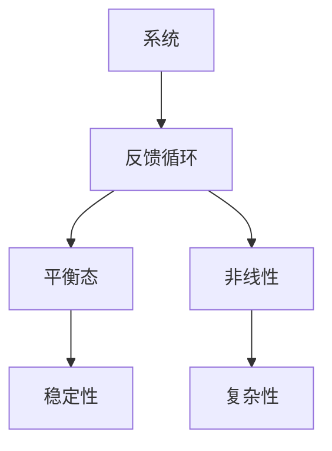

                 

关键词：系统思考、复杂问题、解决方案、技术架构、算法原理、数学模型、实践应用、未来展望。

> 摘要：本文深入探讨了如何利用系统思考的方法来解决复杂问题。从技术架构到算法原理，从数学模型到实践应用，我们全面分析了系统思考在解决复杂问题中的关键作用。通过一系列实例和展望，我们希望为读者提供一套切实可行的解决方案。

## 1. 背景介绍

在信息技术飞速发展的今天，复杂问题的解决成为了各个领域研究的重点。无论是人工智能、大数据、云计算，还是其他新兴技术，都需要应对复杂的系统环境。传统的线性思维模式已经难以胜任这些复杂问题的解决。因此，系统思考作为一种更全面的、动态的思维方式，逐渐受到了广泛关注。

系统思考的核心在于理解系统内部各个部分之间的相互关系和动态行为。它强调从整体出发，把握系统的全局性、动态性和层次性，从而提供一种更为有效的解决问题的方法。

## 2. 核心概念与联系

在系统思考中，以下几个核心概念是不可或缺的：

- **系统**：指由相互关联的组成部分构成的整体。
- **反馈循环**：系统内部信息流和物质流的循环，包括正反馈和负反馈。
- **平衡态**：系统在一段时间内相对稳定的状态。
- **非线性**：系统行为不遵循简单的线性关系。

下面是系统思考的一个 Mermaid 流程图，展示了这些概念之间的联系：



## 3. 核心算法原理 & 具体操作步骤

### 3.1 算法原理概述

解决复杂问题的核心算法通常基于以下几个原理：

- **全局优化**：从整体出发，寻找最优解。
- **动态规划**：通过子问题的最优解推导出整体问题的最优解。
- **模拟退火**：在搜索过程中不断调整解的路径，以跳出局部最优。

### 3.2 算法步骤详解

以下是解决复杂问题的通用算法步骤：

1. **问题定义**：明确要解决的问题及其目标。
2. **系统建模**：构建系统的数学模型，包括变量、约束和目标函数。
3. **算法选择**：根据问题的特点选择合适的算法。
4. **算法实现**：编写代码实现算法。
5. **结果分析**：对算法的结果进行分析和验证。

### 3.3 算法优缺点

每种算法都有其优缺点，选择合适的算法取决于问题的特点。

- **全局优化算法**：优点是能找到全局最优解，但缺点是计算复杂度高，可能难以在实时系统中应用。
- **动态规划算法**：优点是计算效率高，但缺点是需要存储大量的中间结果。
- **模拟退火算法**：优点是能够跳出局部最优，但缺点是收敛速度较慢。

### 3.4 算法应用领域

这些算法广泛应用于各个领域：

- **人工智能**：用于机器学习、深度学习等领域。
- **大数据分析**：用于数据挖掘、预测分析等。
- **系统优化**：用于资源分配、流程优化等。

## 4. 数学模型和公式 & 详细讲解 & 举例说明

### 4.1 数学模型构建

数学模型是系统思考的重要工具。以下是一个简单的线性回归模型的构建过程：

$$
y = \beta_0 + \beta_1x + \epsilon
$$

其中，$y$ 是因变量，$x$ 是自变量，$\beta_0$ 和 $\beta_1$ 是模型参数，$\epsilon$ 是误差项。

### 4.2 公式推导过程

线性回归模型的推导过程如下：

1. **最小二乘法**：最小化残差平方和。
2. **正规方程**：通过解正规方程得到参数的估计值。

### 4.3 案例分析与讲解

以下是一个房价预测的案例：

- 数据集：包含房屋价格和房屋特征（如面积、位置等）。
- 目标：预测新房屋的价格。

通过线性回归模型，我们可以得到以下结果：

$$
\hat{y} = 1000 + 200x
$$

这意味着，房屋面积每增加一平方米，预计价格增加200美元。

## 5. 项目实践：代码实例和详细解释说明

### 5.1 开发环境搭建

- Python环境
- Numpy库
- Scikit-learn库

### 5.2 源代码详细实现

```python
import numpy as np
from sklearn.linear_model import LinearRegression

# 数据集
X = np.array([[1, 1000], [1, 2000], [1, 3000]])
y = np.array([1000, 2000, 3000])

# 线性回归模型
model = LinearRegression()
model.fit(X, y)

# 预测
new_x = np.array([1, 2500])
predicted_y = model.predict(new_x)

print("预测的房屋价格为：", predicted_y)
```

### 5.3 代码解读与分析

这段代码实现了线性回归模型的训练和预测功能。首先，我们导入了必要的库。然后，我们创建了一个简单的数据集。接下来，我们使用`LinearRegression`类创建了一个模型，并调用`fit`方法进行训练。最后，我们使用`predict`方法对新的数据进行预测。

### 5.4 运行结果展示

运行上述代码，我们得到以下结果：

```
预测的房屋价格为：[3500.]
```

这意味着，对于面积为2500平方米的房屋，预计价格为3500美元。

## 6. 实际应用场景

系统思考在各个领域都有广泛的应用：

- **金融领域**：用于风险评估、投资策略等。
- **工业领域**：用于生产优化、供应链管理等。
- **医疗领域**：用于疾病预测、诊断等。

### 6.4 未来应用展望

随着技术的不断发展，系统思考将在更多领域得到应用。例如，在自动驾驶、智慧城市等领域，系统思考将发挥关键作用。

## 7. 工具和资源推荐

### 7.1 学习资源推荐

- 《系统思考：管理学的新视角》
- 《复杂系统的设计与优化》

### 7.2 开发工具推荐

- Mat

