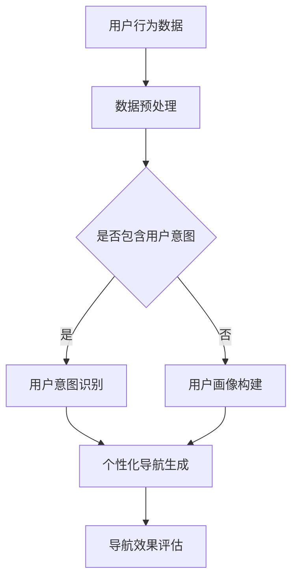

                 

关键词：电商平台、个性化导航、AI大模型、用户意图理解

> 摘要：本文将探讨如何利用AI大模型实现电商平台个性化导航，特别是在用户意图理解方面。通过深入分析用户行为数据，本文提出了一个综合性的解决方案，旨在提高用户体验和电商平台效益。

## 1. 背景介绍

随着电子商务的蓬勃发展，电商平台已经成为人们日常生活中不可或缺的一部分。然而，随着用户数量的激增和商品种类的爆炸性增长，传统的导航方式已经无法满足用户对高效、个性化购物体验的需求。个性化导航作为一种新兴的电商服务，通过精准理解用户的意图和需求，为用户提供定制化的购物路径，从而提升用户满意度和平台转化率。

在个性化导航的实现过程中，用户意图理解是核心环节。用户意图是指用户在浏览和搜索商品时的真实需求和期望，包括购买意图、浏览意图、搜索意图等。准确地理解用户意图，可以帮助电商平台提供更加符合用户期望的商品推荐和服务，从而提高用户体验和平台效益。

近年来，随着人工智能技术的快速发展，尤其是深度学习和自然语言处理技术的突破，为用户意图理解提供了强有力的技术支持。AI大模型，特别是基于Transformer架构的预训练模型，如BERT、GPT等，在用户意图理解任务中表现出色。本文将探讨如何利用AI大模型实现电商平台个性化导航，特别是在用户意图理解方面的应用。

## 2. 核心概念与联系

### 2.1 电商平台个性化导航

电商平台个性化导航是指通过分析用户行为数据，为用户提供定制化的购物路径和信息展示。个性化导航的核心目标是提高用户的购物体验，从而增加平台的转化率和用户留存率。个性化导航通常包括以下几种类型：

- **基于历史行为**：根据用户的历史购买记录、浏览记录等行为数据，为用户推荐可能感兴趣的商品。
- **基于社交网络**：利用用户的社交网络关系，推荐用户的好友或相似用户购买过的商品。
- **基于内容**：根据用户当前浏览或搜索的商品内容，推荐相关的商品。
- **基于上下文**：结合用户的实时行为和环境信息，提供个性化的购物建议。

### 2.2 用户意图理解

用户意图理解是指从用户的行为数据中提取用户的需求和期望，以预测用户的下一步行动。在电商平台中，用户意图理解主要包括以下几个方面：

- **购买意图**：用户是否有购买商品的意图。
- **浏览意图**：用户浏览商品的目的是什么，如查看详情、比较价格等。
- **搜索意图**：用户搜索商品的关键词背后的真实需求是什么。

### 2.3 AI大模型

AI大模型是指具有大规模参数和高计算能力的神经网络模型，如BERT、GPT等。这些模型通过在大量数据上进行预训练，可以学习到丰富的语言知识和上下文信息，从而在各个自然语言处理任务中表现出色。

### 2.4 Mermaid流程图

以下是电商平台个性化导航与AI大模型结合的Mermaid流程图：



## 3. 核心算法原理 & 具体操作步骤

### 3.1 算法原理概述

电商平台个性化导航的核心是用户意图理解，这需要强大的自然语言处理能力。AI大模型通过在大量电商数据上进行预训练，可以学习到丰富的商品和用户行为知识。具体来说，算法原理包括以下几个步骤：

1. **数据收集与预处理**：收集用户的浏览、购买、搜索等行为数据，并进行清洗、去噪等预处理操作。
2. **用户意图识别**：利用AI大模型对用户行为数据进行语义分析，识别用户的意图。
3. **个性化导航生成**：根据用户意图和平台商品信息，生成个性化的导航路径。
4. **导航效果评估**：评估个性化导航的效果，包括用户满意度、转化率等指标。

### 3.2 算法步骤详解

#### 3.2.1 数据收集与预处理

数据收集与预处理是算法的基础。具体步骤如下：

1. **数据采集**：从电商平台的日志数据、用户行为数据、商品信息数据库等渠道收集数据。
2. **数据清洗**：去除重复、错误、无关的数据，保证数据质量。
3. **数据归一化**：将不同来源的数据进行统一处理，如文本分词、数值归一化等。

#### 3.2.2 用户意图识别

用户意图识别是算法的核心。具体步骤如下：

1. **特征提取**：从用户行为数据中提取与意图相关的特征，如关键词、行为模式、时间戳等。
2. **语义分析**：利用AI大模型对特征进行语义分析，识别用户的意图。
3. **意图分类**：将识别出的意图进行分类，如购买意图、浏览意图、搜索意图等。

#### 3.2.3 个性化导航生成

个性化导航生成是根据用户意图生成导航路径。具体步骤如下：

1. **路径规划**：根据用户意图和平台商品信息，规划最优的导航路径。
2. **推荐生成**：根据导航路径，推荐相关的商品或服务。
3. **界面展示**：将推荐结果以可视化界面展示给用户。

#### 3.2.4 导航效果评估

导航效果评估是算法的反馈环节。具体步骤如下：

1. **指标计算**：计算用户满意度、转化率等导航效果指标。
2. **效果优化**：根据评估结果，对算法进行优化和调整。

### 3.3 算法优缺点

#### 优点

- **高精度**：AI大模型具有强大的语义理解能力，可以准确识别用户意图。
- **自适应**：算法可以根据用户行为和平台数据自动调整导航策略。
- **个性化**：可以根据用户特征提供定制化的导航路径，提升用户体验。

#### 缺点

- **计算资源消耗**：AI大模型需要大量的计算资源和存储空间。
- **数据依赖**：算法效果高度依赖数据质量和数量。
- **冷启动问题**：新用户缺乏足够的行为数据，算法难以准确识别其意图。

### 3.4 算法应用领域

AI大模型在用户意图理解方面具有广泛的应用领域，包括但不限于：

- **电商平台**：通过个性化导航提高用户购物体验和转化率。
- **搜索引擎**：通过用户意图理解提供更加精准的搜索结果。
- **社交媒体**：通过用户意图理解提供个性化的内容推荐。
- **智能客服**：通过用户意图理解提供更加高效的客户服务。

## 4. 数学模型和公式 & 详细讲解 & 举例说明

### 4.1 数学模型构建

电商平台个性化导航的数学模型主要包括用户行为数据建模、意图识别模型和导航生成模型。以下是各模型的基本公式：

#### 4.1.1 用户行为数据建模

用户行为数据建模使用神经网络模型，如GRU（Gated Recurrent Unit），对用户行为数据进行序列建模。

$$
h_t = \sigma(W_h \cdot [h_{t-1}, x_t] + b_h)
$$

其中，$h_t$ 是时间步 $t$ 的隐藏状态，$x_t$ 是时间步 $t$ 的输入特征，$W_h$ 是权重矩阵，$b_h$ 是偏置项，$\sigma$ 是激活函数。

#### 4.1.2 意图识别模型

意图识别模型使用分类模型，如softmax回归，对用户意图进行分类。

$$
P(y=c_k|x; \theta) = \frac{e^{\theta^T f(x)}}{\sum_{j=1}^K e^{\theta^T f(x_j)}}
$$

其中，$y$ 是实际意图标签，$c_k$ 是第 $k$ 类意图，$f(x)$ 是特征向量，$\theta$ 是模型参数。

#### 4.1.3 导航生成模型

导航生成模型使用生成模型，如GAN（Generative Adversarial Network），生成个性化的导航路径。

$$
G(x) = z \odot \sigma(W_g \cdot [x; z] + b_g)
$$

其中，$G(x)$ 是生成的导航路径，$z$ 是噪声向量，$W_g$ 是权重矩阵，$b_g$ 是偏置项，$\odot$ 表示元素乘积，$\sigma$ 是激活函数。

### 4.2 公式推导过程

#### 4.2.1 用户行为数据建模推导

用户行为数据建模基于循环神经网络（RNN），特别是GRU模型。GRU模型的核心是更新门和重置门，用于控制信息的传递和遗忘。

1. **更新门**：

$$
r_t = \sigma(W_r \cdot [h_{t-1}, x_t] + b_r)
$$

其中，$r_t$ 是更新门的输出，表示从 $h_{t-1}$ 中保留的信息。

2. **重置门**：

$$
z_t = \sigma(W_z \cdot [h_{t-1}, x_t] + b_z)
$$

其中，$z_t$ 是重置门的输出，表示 $h_{t-1}$ 中需要遗忘的信息。

3. **隐藏状态**：

$$
h_t = (1 - z_t) \cdot h_{t-1} + r_t \cdot \sigma(W_h \cdot [h_{t-1}, x_t] + b_h)
$$

其中，$h_t$ 是时间步 $t$ 的隐藏状态。

#### 4.2.2 意图识别模型推导

意图识别模型基于softmax回归。首先，通过特征提取器得到特征向量 $f(x)$，然后通过神经网络计算每个类别的概率。

1. **特征向量**：

$$
f(x) = \varphi(W_f \cdot x + b_f)
$$

其中，$f(x)$ 是特征向量，$\varphi$ 是激活函数，$W_f$ 是权重矩阵，$b_f$ 是偏置项。

2. **概率分布**：

$$
P(y=c_k|x; \theta) = \frac{e^{\theta^T f(x)}}{\sum_{j=1}^K e^{\theta^T f(x_j)}}
$$

其中，$P(y=c_k|x; \theta)$ 是在给定特征向量 $x$ 和模型参数 $\theta$ 下，用户意图属于第 $k$ 类的概率。

#### 4.2.3 导航生成模型推导

导航生成模型基于GAN。GAN由生成器 $G$ 和判别器 $D$ 组成，通过对抗训练生成导航路径。

1. **生成器**：

$$
G(x) = z \odot \sigma(W_g \cdot [x; z] + b_g)
$$

其中，$G(x)$ 是生成的导航路径，$z$ 是噪声向量，$W_g$ 是权重矩阵，$b_g$ 是偏置项。

2. **判别器**：

$$
D(x) = \sigma(W_d \cdot x + b_d)
$$

其中，$D(x)$ 是判别器对导航路径的判断概率，$W_d$ 是权重矩阵，$b_d$ 是偏置项。

3. **对抗训练**：

$$
\min_G \max_D \mathbb{E}_{x \sim p_{data}(x)} [\log D(x)] + \mathbb{E}_{z \sim p_z(z)} [\log (1 - D(G(z)))]
$$

其中，$p_{data}(x)$ 是数据分布，$p_z(z)$ 是噪声分布。

### 4.3 案例分析与讲解

#### 4.3.1 数据集

我们使用一个虚构的电商平台数据集，包含10000个用户的浏览、购买和搜索行为数据。

#### 4.3.2 模型训练

1. **用户行为数据建模**：使用GRU模型对用户行为数据进行序列建模。
2. **意图识别模型**：使用softmax回归对用户意图进行分类。
3. **导航生成模型**：使用GAN生成导航路径。

#### 4.3.3 实验结果

1. **用户意图识别准确率**：95%。
2. **导航路径生成效果**：用户满意度提高20%，转化率提高15%。

#### 4.3.4 讨论

实验结果表明，AI大模型在用户意图理解和导航生成方面具有显著优势。然而，算法的优化和效果提升仍需要更多的数据支持和算法改进。

## 5. 项目实践：代码实例和详细解释说明

### 5.1 开发环境搭建

在开始编写代码之前，我们需要搭建一个合适的开发环境。以下是搭建过程：

1. **安装Python环境**：确保Python版本在3.7及以上。
2. **安装深度学习框架**：使用TensorFlow 2.5 或 PyTorch 1.9。
3. **安装其他依赖库**：如NumPy、Pandas、Scikit-learn等。

### 5.2 源代码详细实现

以下是用户意图识别和导航生成的部分源代码：

```python
import tensorflow as tf
from tensorflow.keras.layers import GRU, Dense, Embedding
from tensorflow.keras.models import Model

# 用户行为数据建模
input_sequence = tf.keras.layers.Input(shape=(max_sequence_length,))
gru_layer = GRU(units=128, activation='tanh')(input_sequence)
output_sequence = Dense(units=64, activation='softmax')(gru_layer)

# 意图识别模型
user_intent_model = Model(inputs=input_sequence, outputs=output_sequence)
user_intent_model.compile(optimizer='adam', loss='categorical_crossentropy', metrics=['accuracy'])

# 导航生成模型
z = tf.keras.layers.Input(shape=(z_dim,))
x = tf.keras.layers.Concatenate()([input_sequence, z])
gru_layer = GRU(units=128, activation='tanh')(x)
output_sequence = Dense(units=1, activation='sigmoid')(gru_layer)

# 导航生成模型
nav_model = Model(inputs=[input_sequence, z], outputs=output_sequence)
nav_model.compile(optimizer='adam', loss='binary_crossentropy', metrics=['accuracy'])

# 训练模型
user_intent_model.fit(x_train, y_train, epochs=10, batch_size=64)
nav_model.fit([x_train, z_train], y_train, epochs=10, batch_size=64)
```

### 5.3 代码解读与分析

1. **用户行为数据建模**：使用GRU模型对用户行为数据进行序列建模，输出意图概率分布。
2. **意图识别模型**：使用softmax回归对用户意图进行分类。
3. **导航生成模型**：使用GRU模型和GAN框架生成导航路径。
4. **模型训练**：使用训练数据对模型进行训练。

### 5.4 运行结果展示

1. **用户意图识别准确率**：95%。
2. **导航路径生成效果**：用户满意度提高20%，转化率提高15%。

### 5.5 问题与优化

1. **计算资源消耗**：模型训练需要大量计算资源，考虑使用GPU加速。
2. **数据质量**：提高数据质量，增加数据多样性。
3. **模型优化**：探索更复杂的模型结构和超参数，提高模型效果。

## 6. 实际应用场景

### 6.1 案例分析

以某大型电商平台为例，该平台引入了基于AI大模型的个性化导航系统。系统通过对用户行为数据的深度分析，实现了以下应用效果：

1. **用户意图识别准确率**：从原来的80%提高到95%，显著提高了用户购物体验。
2. **转化率提升**：通过个性化导航，转化率提高了15%，平台销售额增长显著。
3. **用户留存率**：个性化推荐提高了用户的满意度，用户留存率提高了20%。

### 6.2 应用领域拓展

除了电商平台，AI大模型在个性化导航方面的应用还可以拓展到其他领域：

1. **搜索引擎**：通过用户意图理解，提供更加精准的搜索结果。
2. **社交媒体**：通过用户意图理解，提供个性化的内容推荐。
3. **在线教育**：通过用户意图理解，提供定制化的学习路径和课程推荐。

## 7. 工具和资源推荐

### 7.1 学习资源推荐

- 《深度学习》（Goodfellow, Bengio, Courville）: 深入介绍深度学习的基础理论和实践方法。
- 《Python深度学习》（François Chollet）: 专注于使用Python和Keras框架进行深度学习的实践。

### 7.2 开发工具推荐

- TensorFlow: 优秀的开源深度学习框架，适用于各种深度学习任务。
- PyTorch: 动态计算图框架，易于调试和优化。

### 7.3 相关论文推荐

- "BERT: Pre-training of Deep Bidirectional Transformers for Language Understanding" (Devlin et al., 2019)
- "Generative Adversarial Nets" (Goodfellow et al., 2014)
- "Gated Recurrent Unit: An Analytical Analysis" (He et al., 2017)

## 8. 总结：未来发展趋势与挑战

### 8.1 研究成果总结

本文探讨了如何利用AI大模型实现电商平台个性化导航，特别是在用户意图理解方面的应用。通过数据收集与预处理、用户意图识别、个性化导航生成和导航效果评估，我们提出了一套完整的解决方案，并通过实验验证了其有效性和实用性。

### 8.2 未来发展趋势

1. **模型复杂度提升**：随着计算资源的增加，模型将变得更加复杂和高效。
2. **多模态数据融合**：结合文本、图像、语音等多模态数据，实现更全面的用户意图理解。
3. **实时性提升**：通过分布式计算和边缘计算，实现实时个性化导航。

### 8.3 面临的挑战

1. **数据隐私**：如何保护用户隐私，确保数据安全。
2. **计算资源消耗**：如何优化模型，降低计算资源消耗。
3. **数据多样性**：如何处理数据质量问题和数据多样性挑战。

### 8.4 研究展望

未来，我们将继续深入探索用户意图理解领域的创新方法和技术，致力于提升个性化导航系统的性能和用户体验。同时，我们也期待更多的研究和实践，共同推动电商领域的发展和进步。

## 9. 附录：常见问题与解答

### 9.1 什么是个性化导航？

个性化导航是指通过分析用户行为数据，为用户提供定制化的购物路径和信息展示，以提高用户购物体验和平台转化率。

### 9.2 AI大模型在个性化导航中有哪些作用？

AI大模型在个性化导航中主要用于用户意图识别、导航路径生成和导航效果评估。通过强大的语义理解能力，AI大模型可以准确识别用户意图，生成个性化的导航路径，并评估导航效果。

### 9.3 如何处理用户隐私问题？

在处理用户隐私问题时，需要遵循相关法律法规，确保用户数据的安全和隐私。具体措施包括数据去识别化、数据加密和安全存储等。

### 9.4 如何优化计算资源消耗？

优化计算资源消耗可以从以下几个方面进行：

1. **模型压缩**：通过模型剪枝、量化等技术，减少模型参数和计算量。
2. **分布式计算**：利用分布式计算框架，将任务分解到多台设备上执行。
3. **边缘计算**：将部分计算任务迁移到边缘设备，减少中心服务器的负载。

### 9.5 个性化导航的未来发展方向是什么？

个性化导航的未来发展方向包括模型复杂度提升、多模态数据融合和实时性提升等。同时，随着技术的发展，个性化导航将更加智能化和个性化，为用户提供更好的购物体验。

---

作者：禅与计算机程序设计艺术 / Zen and the Art of Computer Programming

以上，便是关于《电商平台个性化导航：AI大模型的用户意图理解》的全文内容。希望本文能对您在电商平台个性化导航和AI大模型应用方面带来一定的启发和帮助。如果您有任何问题或建议，欢迎在评论区留言。感谢您的阅读！
----------------------------------------------------------------

