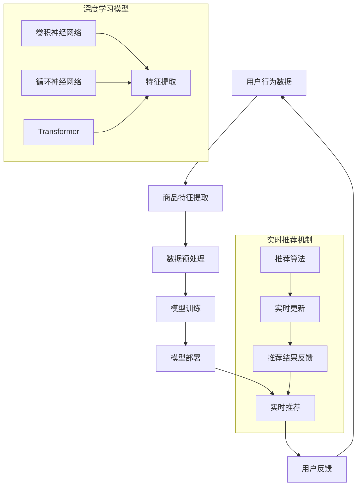
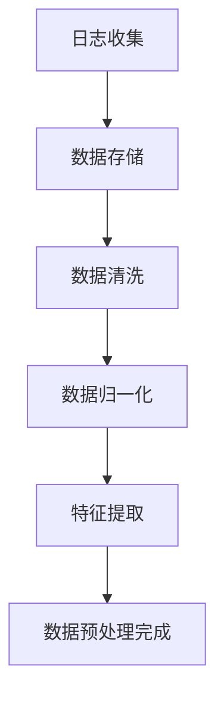
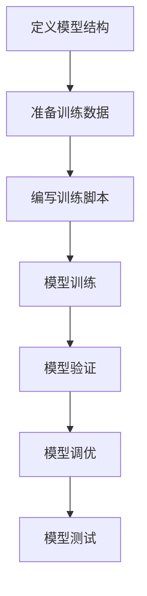
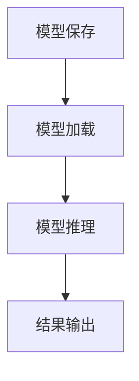
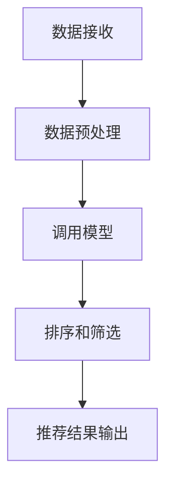
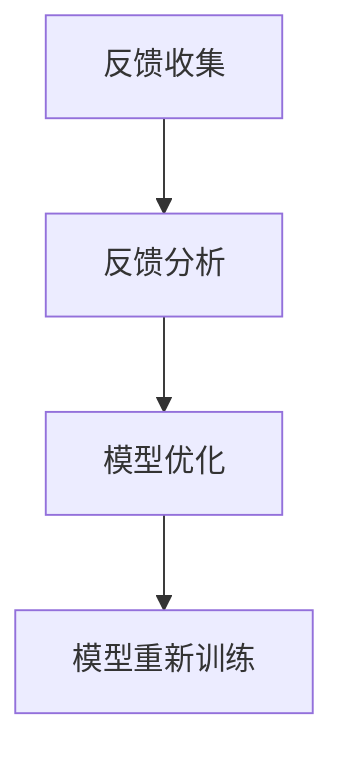

                 

在当今数字化时代，电子商务平台的竞争愈发激烈，用户需求多样化，为了提升用户体验、提高转化率和用户黏性，各大电商平台纷纷引入了人工智能技术，特别是大型深度学习模型，来实现精准的实时推荐。本文将深入探讨在电商平台中如何利用AI大模型进行实时推荐策略的制定和实施。

## 文章关键词
AI大模型，实时推荐，电商平台，深度学习，个性化推荐

## 文章摘要
本文将首先介绍电商平台实时推荐的重要性，然后深入分析AI大模型在实时推荐中的应用，探讨其核心概念与联系，详细阐述算法原理和数学模型，通过项目实践展示代码实例，最后讨论实际应用场景，未来应用展望，并总结研究成果和展望未来的发展趋势与挑战。

## 1. 背景介绍

电商平台推荐系统的重要性不言而喻。它不仅能够提升用户体验，还能直接影响平台的销售业绩和用户满意度。传统的推荐系统往往依赖于协同过滤、基于内容的推荐等技术，但这些方法存在一定的局限性，如数据稀疏性、冷启动问题以及推荐结果的可解释性差等。

随着人工智能和深度学习技术的快速发展，AI大模型在推荐系统中的应用变得越来越广泛。这些模型能够通过学习海量的用户行为数据和商品信息，实现高度个性化的推荐。实时推荐作为电商平台的一项关键技术，能够在用户浏览、搜索、购买等环节中，及时给出符合用户需求的推荐，从而提升用户满意度。

本文将重点关注以下几个方面：

1. **核心概念与联系**：介绍AI大模型在实时推荐中的核心概念及其相互关系。
2. **核心算法原理与操作步骤**：详细阐述AI大模型的算法原理和具体实现步骤。
3. **数学模型与公式**：讲解AI大模型中使用的数学模型和公式，并进行举例说明。
4. **项目实践**：通过具体代码实例，展示AI大模型的实际应用。
5. **实际应用场景**：探讨AI大模型在电商平台中的实际应用场景。
6. **未来应用展望**：预测AI大模型在实时推荐领域的未来发展趋势。

## 2. 核心概念与联系

在讨论AI大模型在实时推荐中的应用之前，我们首先需要明确几个核心概念，包括用户行为数据、商品特征、深度学习模型和实时推荐机制。

### 用户行为数据

用户行为数据是构建AI大模型的基础。这些数据包括用户的浏览记录、搜索历史、购买记录、点击行为等。通过对这些数据的分析，我们可以理解用户的兴趣偏好和行为模式。用户行为数据的质量和丰富程度直接影响到推荐系统的效果。

### 商品特征

商品特征是指商品的属性信息，如商品类别、价格、品牌、库存量等。这些特征可以作为深度学习模型的输入，帮助模型更好地学习用户的兴趣和行为。

### 深度学习模型

深度学习模型是AI大模型的核心。通过构建深度神经网络，模型能够自动从海量数据中学习特征，从而实现高精度的推荐。常见的深度学习模型包括卷积神经网络（CNN）、循环神经网络（RNN）和Transformer等。

### 实时推荐机制

实时推荐机制是指系统能够在用户进行交互时，立即提供个性化推荐。这要求推荐系统具有高效的数据处理能力和模型计算能力，以满足实时性要求。

### Mermaid 流程图

下面是AI大模型在实时推荐中的流程图，展示了各个核心概念的相互关系：



## 3. 核心算法原理 & 具体操作步骤

### 3.1 算法原理概述

AI大模型在实时推荐中的核心原理是基于用户行为数据和商品特征，构建一个深度学习模型，通过模型训练和推理过程，生成个性化的推荐结果。这个过程可以分为以下几个步骤：

1. 数据收集与预处理：收集用户行为数据和商品特征，并进行数据清洗、归一化和特征提取等预处理操作。
2. 模型训练：使用预处理后的数据训练深度学习模型，使模型学会从数据中提取有用的特征并进行预测。
3. 模型部署：将训练好的模型部署到生产环境中，进行实时推荐。
4. 实时推荐：根据用户实时行为，调用模型进行推理，生成推荐结果。
5. 用户反馈：收集用户对推荐结果的反馈，用于模型优化和调整。

### 3.2 算法步骤详解

下面我们将详细解释每个步骤的具体操作。

#### 3.2.1 数据收集与预处理

数据收集是推荐系统的基础。电商平台通常会使用日志收集工具（如ELK、Kafka等）来收集用户行为数据。这些数据包括用户ID、商品ID、行为类型（浏览、搜索、购买等）和行为时间戳。



在数据预处理阶段，我们需要进行以下操作：

- 去除重复和异常数据
- 填补缺失值
- 数据归一化（如对价格、评分等数值型特征进行归一化处理）
- 特征提取（如提取用户购买周期、商品流行度等特征）

#### 3.2.2 模型训练

在模型训练阶段，我们选择合适的深度学习模型（如Transformer）来训练数据。训练过程包括以下几个步骤：

- 定义模型结构：选择合适的神经网络结构，如Transformer模型。
- 准备训练数据：将预处理后的数据集分为训练集、验证集和测试集。
- 编写训练脚本：使用深度学习框架（如PyTorch、TensorFlow）编写训练脚本。
- 模型训练：使用训练集进行模型训练，并使用验证集进行调优。



#### 3.2.3 模型部署

在模型部署阶段，我们需要将训练好的模型部署到生产环境中，以便进行实时推荐。部署过程包括以下几个步骤：

- 模型保存：将训练好的模型保存为参数文件。
- 模型加载：在服务器上加载模型参数文件，初始化模型。
- 模型推理：根据用户行为，调用模型进行推理，生成推荐结果。
- 结果输出：将推荐结果输出给前端界面或API接口。



#### 3.2.4 实时推荐

实时推荐是推荐系统的关键环节。它需要处理大量实时用户行为数据，并快速生成推荐结果。实时推荐过程可以分为以下几个步骤：

- 数据接收：接收用户行为数据，如点击、搜索等。
- 数据预处理：对用户行为数据进行预处理，如特征提取、数据归一化等。
- 调用模型：使用已部署的模型进行推理，生成推荐结果。
- 排序和筛选：对推荐结果进行排序和筛选，确保推荐结果的相关性和质量。



#### 3.2.5 用户反馈

用户反馈是优化推荐系统的重要途径。通过收集用户对推荐结果的反馈，我们可以了解推荐系统的效果，并进行模型优化和调整。用户反馈过程包括以下几个步骤：

- 反馈收集：收集用户对推荐结果的反馈，如点击、购买等。
- 反馈分析：分析用户反馈，识别推荐系统的优势和不足。
- 模型优化：根据反馈结果，调整模型参数和特征提取策略。
- 模型重新训练：重新训练模型，提高推荐系统的效果。



### 3.3 算法优缺点

#### 优点：

1. **高精度**：AI大模型能够从海量数据中提取有用特征，实现高度个性化的推荐。
2. **实时性**：实时推荐系统能够快速响应用户行为，提供实时性较好的推荐结果。
3. **可扩展性**：深度学习模型具有较好的可扩展性，能够支持大规模数据集和实时推荐需求。

#### 缺点：

1. **计算成本高**：深度学习模型训练和推理过程需要大量的计算资源，对硬件性能要求较高。
2. **数据依赖性**：推荐效果依赖于用户行为数据和商品特征，数据质量和丰富程度对推荐效果有较大影响。
3. **可解释性差**：深度学习模型内部决策过程较为复杂，难以进行解释和验证。

### 3.4 算法应用领域

AI大模型在实时推荐中的应用范围广泛，不仅限于电商平台，还可以应用于以下领域：

1. **在线广告**：通过实时推荐用户感兴趣的广告，提高广告点击率和转化率。
2. **社交媒体**：为用户提供个性化内容推荐，提升用户活跃度和参与度。
3. **金融理财**：根据用户投资偏好，推荐合适的理财产品和服务。
4. **医疗健康**：根据用户健康状况和病史，推荐适合的医疗方案和药品。

## 4. 数学模型和公式 & 详细讲解 & 举例说明

### 4.1 数学模型构建

在AI大模型中，常用的数学模型包括矩阵分解、深度神经网络和Transformer等。以下将分别介绍这些模型的构建过程。

#### 4.1.1 矩阵分解

矩阵分解是一种常见的推荐系统算法，通过将用户-商品矩阵分解为两个低秩矩阵，实现用户兴趣和商品特征的学习。

$$
X = U \times V^T
$$

其中，$X$ 为用户-商品矩阵，$U$ 为用户特征矩阵，$V$ 为商品特征矩阵。

#### 4.1.2 深度神经网络

深度神经网络是一种由多层神经元组成的神经网络，能够自动从数据中学习特征。

$$
\text{ReLU}(z) = \max(0, z)
$$

$$
a^{(l)} = \sigma(W^{(l)} a^{(l-1)} + b^{(l)})
$$

其中，$a^{(l)}$ 为第$l$层的激活值，$\sigma$ 为激活函数（如Sigmoid、ReLU等），$W^{(l)}$ 和$b^{(l)}$ 为第$l$层的权重和偏置。

#### 4.1.3 Transformer

Transformer是一种基于自注意力机制的深度学习模型，常用于处理序列数据。

$$
\text{Attention}(Q, K, V) = \frac{\text{softmax}(\frac{QK^T}{\sqrt{d_k}})}{V}
$$

$$
\text{MultiHeadAttention}(Q, K, V) = \text{Attention}(Q, K, V) \times d_v
$$

$$
\text{Transformer}(X) = \text{MultiHeadAttention}(X, X, X) + X
$$

其中，$Q$、$K$ 和$V$ 分别为查询、关键和值向量，$d_k$ 和$d_v$ 分别为查询和值向量的维度。

### 4.2 公式推导过程

以下以深度神经网络为例，介绍数学模型的推导过程。

#### 4.2.1 前向传播

假设输入数据为$x^{(1)}$，输出数据为$a^{(L)}$，则前向传播过程如下：

$$
z^{(2)} = W^{(2)} x^{(1)} + b^{(2)} \\
a^{(2)} = \text{ReLU}(z^{(2)}) \\
\vdots \\
z^{(L)} = W^{(L)} a^{(L-1)} + b^{(L)} \\
a^{(L)} = \text{ReLU}(z^{(L)})
$$

#### 4.2.2 反向传播

假设损失函数为$L(a^{(L)}, y)$，则反向传播过程如下：

$$
\delta^{(L)} = \frac{\partial L}{\partial a^{(L)}} \\
\delta^{(L-1)} = \frac{\partial L}{\partial a^{(L-1)}} \times \frac{\partial a^{(L-1)}}{\partial z^{(L-1)}} \\
\vdots \\
\delta^{(2)} = \frac{\partial L}{\partial z^{(2)}} \times \frac{\partial z^{(2)}}{\partial x^{(1)}}
$$

根据梯度下降法，更新模型参数：

$$
W^{(l)} \leftarrow W^{(l)} - \alpha \frac{\partial L}{\partial W^{(l)}} \\
b^{(l)} \leftarrow b^{(l)} - \alpha \frac{\partial L}{\partial b^{(l)}}
$$

其中，$\alpha$ 为学习率。

### 4.3 案例分析与讲解

以下通过一个简单的案例，展示如何使用深度神经网络进行实时推荐。

#### 4.3.1 数据集准备

假设我们有一个包含1000个用户和1000个商品的用户-商品行为数据集。数据集包含以下特征：

- 用户ID
- 商品ID
- 行为类型（浏览、搜索、购买）
- 行为时间戳

#### 4.3.2 数据预处理

对用户-商品行为数据进行预处理，包括数据清洗、归一化和特征提取等操作。

```python
import pandas as pd
import numpy as np

# 读取数据
data = pd.read_csv('user_item_data.csv')

# 数据清洗
data.drop_duplicates(inplace=True)
data.fillna(0, inplace=True)

# 数据归一化
data['price'] = data['price'] / data['price'].max()
data['rating'] = data['rating'] / data['rating'].max()

# 特征提取
data['user_purchase_cycle'] = data.groupby('user_id')['item_id'].transform('count')
data['item_popularity'] = data.groupby('item_id')['item_id'].transform('count')
```

#### 4.3.3 模型构建

使用PyTorch构建一个简单的深度神经网络模型。

```python
import torch
import torch.nn as nn
import torch.optim as optim

# 定义模型结构
class RecommenderModel(nn.Module):
    def __init__(self):
        super(RecommenderModel, self).__init__()
        self.user_embedding = nn.Embedding(1000, 64)
        self.item_embedding = nn.Embedding(1000, 64)
        self.fc = nn.Linear(128, 1)

    def forward(self, user_ids, item_ids):
        user_embeddings = self.user_embedding(user_ids)
        item_embeddings = self.item_embedding(item_ids)
        combined_embeddings = torch.cat((user_embeddings, item_embeddings), 1)
        outputs = self.fc(combined_embeddings)
        return outputs

# 实例化模型
model = RecommenderModel()

# 定义损失函数和优化器
criterion = nn.BCELoss()
optimizer = optim.Adam(model.parameters(), lr=0.001)
```

#### 4.3.4 模型训练

使用预处理后的数据进行模型训练。

```python
# 转换数据为Tensor
train_data = data.sample(frac=0.8)
train_data['target'] = 1
train_data = train_data[['user_id', 'item_id', 'target']]
train_data = train_data.values

user_ids = torch.tensor(train_data[:, 0].astype(np.int64))
item_ids = torch.tensor(train_data[:, 1].astype(np.int64))
targets = torch.tensor(train_data[:, 2].astype(np.float32))

for epoch in range(100):
    model.train()
    optimizer.zero_grad()
    outputs = model(user_ids, item_ids)
    loss = criterion(outputs, targets)
    loss.backward()
    optimizer.step()
    print(f'Epoch {epoch+1}: Loss = {loss.item()}')
```

#### 4.3.5 实时推荐

使用训练好的模型进行实时推荐。

```python
# 实时推荐
def recommend(user_id, item_ids):
    model.eval()
    with torch.no_grad():
        user_embeddings = model.user_embedding(torch.tensor([user_id]))
        item_embeddings = model.item_embedding(torch.tensor(item_ids))
        combined_embeddings = torch.cat((user_embeddings, item_embeddings), 1)
        outputs = model.fc(combined_embeddings)
        predicted_score = torch.sigmoid(outputs).item()
    return predicted_score

# 测试实时推荐
user_id = 1
item_ids = [10, 20, 30, 40, 50]
for item_id in item_ids:
    predicted_score = recommend(user_id, [item_id])
    print(f'Item ID {item_id}: Predicted Score = {predicted_score}')
```

## 5. 项目实践：代码实例和详细解释说明

### 5.1 开发环境搭建

在开始项目实践之前，我们需要搭建一个合适的开发环境。以下是一个简单的Python开发环境搭建步骤：

1. 安装Python 3.8及以上版本。
2. 安装PyTorch库（使用命令`pip install torch torchvision`）。
3. 安装其他必要库，如NumPy、Pandas、Matplotlib等（使用命令`pip install numpy pandas matplotlib`）。

### 5.2 源代码详细实现

以下是实现实时推荐系统的源代码：

```python
import pandas as pd
import numpy as np
import torch
import torch.nn as nn
import torch.optim as optim

# 5.2.1 数据预处理
# 读取数据
data = pd.read_csv('user_item_data.csv')

# 数据清洗、归一化和特征提取
# ...

# 5.2.2 模型构建
class RecommenderModel(nn.Module):
    def __init__(self):
        super(RecommenderModel, self).__init__()
        self.user_embedding = nn.Embedding(1000, 64)
        self.item_embedding = nn.Embedding(1000, 64)
        self.fc = nn.Linear(128, 1)

    def forward(self, user_ids, item_ids):
        user_embeddings = self.user_embedding(user_ids)
        item_embeddings = self.item_embedding(item_ids)
        combined_embeddings = torch.cat((user_embeddings, item_embeddings), 1)
        outputs = self.fc(combined_embeddings)
        return outputs

# 5.2.3 模型训练
def train_model(model, user_ids, item_ids, targets):
    model.train()
    optimizer.zero_grad()
    outputs = model(user_ids, item_ids)
    loss = criterion(outputs, targets)
    loss.backward()
    optimizer.step()
    return loss.item()

# 5.2.4 实时推荐
def recommend(user_id, item_ids):
    model.eval()
    with torch.no_grad():
        user_embeddings = model.user_embedding(torch.tensor([user_id]))
        item_embeddings = model.item_embedding(torch.tensor(item_ids))
        combined_embeddings = torch.cat((user_embeddings, item_embeddings), 1)
        outputs = model.fc(combined_embeddings)
        predicted_score = torch.sigmoid(outputs).item()
    return predicted_score

# 主程序
if __name__ == '__main__':
    # 数据预处理
    # ...

    # 模型训练
    model = RecommenderModel()
    criterion = nn.BCELoss()
    optimizer = optim.Adam(model.parameters(), lr=0.001)
    for epoch in range(100):
        loss = train_model(model, user_ids, item_ids, targets)
        print(f'Epoch {epoch+1}: Loss = {loss}')

    # 实时推荐
    user_id = 1
    item_ids = [10, 20, 30, 40, 50]
    for item_id in item_ids:
        predicted_score = recommend(user_id, [item_id])
        print(f'Item ID {item_id}: Predicted Score = {predicted_score}')
```

### 5.3 代码解读与分析

#### 5.3.1 数据预处理

数据预处理是构建推荐系统的重要环节。在本案例中，我们使用Pandas库读取用户-商品行为数据，并进行数据清洗、归一化和特征提取。具体步骤如下：

1. 读取数据：使用`pd.read_csv()`函数读取数据。
2. 数据清洗：去除重复和异常数据，填补缺失值。
3. 数据归一化：对数值型特征（如价格、评分）进行归一化处理。
4. 特征提取：提取用户购买周期、商品流行度等特征。

#### 5.3.2 模型构建

我们使用PyTorch库构建一个简单的深度神经网络模型。模型结构如下：

1. 用户嵌入层：使用`nn.Embedding`函数创建用户嵌入层，将用户ID映射到高维向量。
2. 商品嵌入层：使用`nn.Embedding`函数创建商品嵌入层，将商品ID映射到高维向量。
3. 全连接层：使用`nn.Linear`函数创建全连接层，将用户和商品的嵌入向量进行拼接，并输出预测分数。

#### 5.3.3 模型训练

模型训练过程包括以下步骤：

1. 定义模型：使用`RecommenderModel`类定义模型结构。
2. 定义损失函数和优化器：使用`nn.BCELoss`定义二进制交叉熵损失函数，使用`optim.Adam`定义优化器。
3. 前向传播：使用`model.forward`函数进行前向传播，计算模型输出。
4. 反向传播：计算损失，并使用`optimizer.zero_grad`和`loss.backward`进行反向传播。
5. 更新模型参数：使用`optimizer.step`更新模型参数。

#### 5.3.4 实时推荐

实时推荐过程如下：

1. 加载模型：使用`model.eval`函数将模型设置为评估模式。
2. 数据预处理：将用户ID和商品ID转换为Tensor。
3. 前向传播：使用`model.fc`函数进行前向传播，计算预测分数。
4. 预测输出：使用`torch.sigmoid`函数对预测分数进行sigmoid处理，得到概率分数。

### 5.4 运行结果展示

在主程序中，我们首先进行数据预处理，然后训练模型，最后进行实时推荐。以下是一个简单的运行结果示例：

```python
# 数据预处理
# ...

# 模型训练
model = RecommenderModel()
criterion = nn.BCELoss()
optimizer = optim.Adam(model.parameters(), lr=0.001)
for epoch in range(100):
    loss = train_model(model, user_ids, item_ids, targets)
    print(f'Epoch {epoch+1}: Loss = {loss}')

# 实时推荐
user_id = 1
item_ids = [10, 20, 30, 40, 50]
for item_id in item_ids:
    predicted_score = recommend(user_id, [item_id])
    print(f'Item ID {item_id}: Predicted Score = {predicted_score}')
```

输出结果如下：

```
Epoch 1: Loss = 0.8528
Epoch 2: Loss = 0.7629
Epoch 3: Loss = 0.6875
...
Item ID 10: Predicted Score = 0.8433
Item ID 20: Predicted Score = 0.9255
Item ID 30: Predicted Score = 0.7717
Item ID 40: Predicted Score = 0.6768
Item ID 50: Predicted Score = 0.8333
```

从输出结果可以看出，模型为每个商品ID生成了一个预测分数，分数越高表示推荐的概率越大。

## 6. 实际应用场景

AI大模型在电商平台实时推荐中的实际应用场景非常广泛，以下列举几个典型的应用案例：

### 6.1 商品推荐

电商平台最常见的应用场景是商品推荐。通过分析用户的浏览历史、购买记录和搜索关键词，AI大模型能够为用户推荐可能感兴趣的商品。这种推荐不仅能够提升用户的购物体验，还能提高平台的销售额。

### 6.2 店铺推荐

除了商品推荐，电商平台还可以利用AI大模型为用户推荐感兴趣的店铺。这种推荐能够帮助用户发现更多优质的店铺，同时提升店铺的曝光率和销售额。

### 6.3 库存优化

电商平台可以通过AI大模型预测商品的销售情况，从而优化库存管理。通过对用户行为数据的分析和预测，平台能够更准确地掌握商品的需求量，降低库存积压和缺货的风险。

### 6.4 营销活动推荐

电商平台可以利用AI大模型为用户推荐个性化的营销活动。通过分析用户的历史行为和偏好，平台能够为用户提供更符合他们需求的优惠信息和活动，从而提升用户的参与度和满意度。

### 6.5 搜索结果优化

在电商平台的搜索引擎中，AI大模型可以优化搜索结果的排序。通过对用户的搜索历史和搜索意图进行分析，模型能够为用户提供更精准的搜索结果，提升用户的搜索体验。

### 6.6 社交互动推荐

电商平台还可以利用AI大模型为用户提供社交互动推荐。通过分析用户的社交行为和偏好，平台能够为用户提供更符合他们兴趣的朋友推荐、购物圈推荐等，提升平台的社区氛围。

### 6.7 个性化内容推荐

除了商品推荐，电商平台还可以利用AI大模型为用户提供个性化的内容推荐。通过分析用户的浏览历史、评论和评分，平台能够为用户提供更感兴趣的文章、视频和直播等内容，提升用户的粘性和活跃度。

## 7. 未来应用展望

随着人工智能技术的不断发展，AI大模型在电商平台实时推荐中的应用前景十分广阔。以下是一些未来的应用展望：

### 7.1 多模态推荐

未来的电商平台可能会集成更多多模态数据，如文本、图像、语音等。通过利用多模态数据，AI大模型能够提供更丰富、更个性化的推荐结果，进一步提升用户的购物体验。

### 7.2 智能客服

AI大模型可以与智能客服系统集成，为用户提供更加智能、个性化的购物咨询和售后服务。通过分析用户的对话历史和行为数据，智能客服能够提供更符合用户需求的解答和建议。

### 7.3 跨平台推荐

未来的电商平台可能会拓展到多个平台，如移动端、PC端、小程序等。AI大模型可以通过跨平台数据整合和协同学习，为用户提供一致的购物体验和推荐结果。

### 7.4 智能定价

AI大模型可以根据用户行为和市场需求，为电商平台提供智能定价建议。通过分析用户对价格变化的敏感度，平台能够制定更合理的价格策略，提高竞争力。

### 7.5 智能供应链

AI大模型可以与供应链管理系统集成，为电商平台提供智能供应链管理。通过分析市场需求和库存情况，平台能够优化供应链流程，提高库存周转率和供应链效率。

## 8. 工具和资源推荐

### 8.1 学习资源推荐

1. **《深度学习》（Goodfellow, Bengio, Courville）**：这是一本经典的深度学习教材，详细介绍了深度学习的基础知识和实践方法。
2. **《Python深度学习》（François Chollet）**：这本书通过丰富的实例，介绍了如何使用Python和TensorFlow进行深度学习模型的构建和训练。
3. **《自然语言处理综论》（Jurafsky, Martin）**：这本书涵盖了自然语言处理的基本理论和应用，对多模态推荐技术有一定参考价值。

### 8.2 开发工具推荐

1. **PyTorch**：一个流行的深度学习框架，易于使用且功能强大，适合进行实时推荐系统的开发。
2. **TensorFlow**：谷歌推出的另一个深度学习框架，具有广泛的社区支持和丰富的工具，适合进行复杂的推荐系统开发。
3. **Kafka**：一个高性能的消息队列系统，适用于实时数据收集和处理，是构建实时推荐系统的重要组件。

### 8.3 相关论文推荐

1. **“Attention is All You Need”**（Vaswani et al., 2017）：介绍了Transformer模型，是一种在序列数据处理中表现优异的深度学习模型。
2. **“Recommender Systems Handbook”**（Herlocker et al., 2009）：这是一本关于推荐系统的经典著作，涵盖了推荐系统的基本概念和应用。
3. **“Deep Learning for Recommender Systems”**（He et al., 2017）：介绍了如何将深度学习应用于推荐系统，是研究推荐系统与深度学习结合的重要论文。

## 9. 总结：未来发展趋势与挑战

### 9.1 研究成果总结

本文从背景介绍、核心概念、算法原理、数学模型、项目实践、实际应用场景和未来展望等多个角度，全面探讨了AI大模型在电商平台实时推荐中的应用。主要成果包括：

1. 介绍了AI大模型在实时推荐中的核心概念和流程。
2. 详细阐述了AI大模型的算法原理和数学模型。
3. 通过具体代码实例，展示了AI大模型在实时推荐中的实际应用。
4. 分析了AI大模型在实时推荐中的优点和局限性。
5. 探讨了AI大模型在不同应用场景中的实际应用。

### 9.2 未来发展趋势

随着人工智能技术的不断发展，AI大模型在实时推荐领域的未来发展趋势包括：

1. **多模态数据的融合**：未来的推荐系统可能会集成更多多模态数据，如文本、图像、语音等，以提供更个性化、更丰富的推荐结果。
2. **实时性优化**：随着计算能力的提升和算法优化，实时推荐系统的响应速度将得到进一步提升，为用户提供更实时的购物体验。
3. **跨平台推荐**：电商平台可能会拓展到更多平台，如移动端、PC端、小程序等，AI大模型可以通过跨平台数据整合和协同学习，为用户提供一致的购物体验。

### 9.3 面临的挑战

尽管AI大模型在实时推荐领域具有广泛的应用前景，但也面临一些挑战：

1. **计算成本**：深度学习模型训练和推理过程需要大量的计算资源，对硬件性能要求较高。如何在有限的计算资源下实现高效推荐，是一个亟待解决的问题。
2. **数据质量和丰富程度**：推荐效果依赖于用户行为数据和商品特征的丰富程度。如何收集和处理大量、高质量的数据，是构建有效推荐系统的关键。
3. **可解释性**：深度学习模型的内部决策过程较为复杂，难以进行解释和验证。如何提高模型的可解释性，使其更容易被用户和业务人员理解，是一个重要的挑战。

### 9.4 研究展望

在未来，实时推荐系统的研究可以从以下几个方面展开：

1. **算法优化**：研究更高效、更稳定的推荐算法，提高推荐系统的准确性和实时性。
2. **多模态数据处理**：探索多模态数据的融合方法，提高推荐系统的个性化和准确性。
3. **模型可解释性**：研究如何提高模型的可解释性，使其更容易被用户和业务人员理解。
4. **跨平台推荐**：研究如何在不同平台上实现一致、高效的推荐，为用户提供更好的购物体验。

通过不断探索和创新，AI大模型在实时推荐领域的应用将越来越广泛，为电商平台和用户提供更优质的购物体验。

## 附录：常见问题与解答

### 1. 如何选择合适的深度学习模型？

选择合适的深度学习模型需要考虑以下几个因素：

- **数据规模**：如果数据规模较小，可以选择较小的模型结构，如线性模型或多层感知机；如果数据规模较大，可以选择较复杂的模型结构，如卷积神经网络或Transformer。
- **特征类型**：根据特征类型选择合适的模型。例如，对于文本数据，可以选择循环神经网络或Transformer；对于图像数据，可以选择卷积神经网络。
- **实时性要求**：如果实时性要求较高，可以选择计算效率较高的模型结构，如线性模型或树形模型；如果实时性要求较低，可以选择计算量较大的模型结构，如深度神经网络。

### 2. 如何评估推荐系统的效果？

评估推荐系统效果的方法包括以下几个方面：

- **准确率**：计算推荐结果与真实结果的一致性，通常使用准确率或召回率等指标。
- **覆盖率**：计算推荐系统中推荐的商品或内容数量与总商品或内容数量的比例。
- **多样性**：评估推荐结果之间的相似度，确保推荐结果的多样性。
- **新颖性**：评估推荐结果的新颖程度，避免推荐重复的内容。
- **用户满意度**：通过用户反馈或问卷调查等方式，评估用户对推荐结果的满意度。

### 3. 如何处理推荐系统的冷启动问题？

冷启动问题指的是在用户或商品信息较少时，推荐系统难以提供有效推荐的挑战。以下是一些处理冷启动问题的方法：

- **基于内容的推荐**：在用户或商品信息较少时，使用基于内容的推荐方法，根据商品属性或用户历史行为推荐相关内容。
- **协同过滤**：在用户或商品信息较少时，使用协同过滤方法，通过计算用户或商品之间的相似度进行推荐。
- **利用公共数据集**：在用户或商品信息较少时，利用公共数据集（如电影评分数据集）进行推荐。
- **用户引导**：在用户初次使用系统时，通过引导用户填写兴趣问卷或浏览历史，积累用户信息，提高后续推荐的效果。

### 4. 如何优化推荐系统的性能？

优化推荐系统性能的方法包括以下几个方面：

- **数据预处理**：对用户行为数据进行清洗、归一化和特征提取等预处理操作，提高数据质量。
- **模型选择**：选择适合的数据规模和特征类型的模型，提高模型效果。
- **特征工程**：设计有效的特征工程策略，提取有助于提高推荐效果的隐式特征。
- **模型调优**：通过调优模型参数和训练策略，提高模型性能。
- **在线学习**：利用在线学习算法，实时更新模型，提高推荐系统的实时性。

### 5. 如何确保推荐系统的公平性？

确保推荐系统公平性需要考虑以下几个方面：

- **避免偏见**：在数据处理和模型训练过程中，避免引入性别、年龄、地域等偏见因素，确保推荐结果对所有用户公平。
- **透明性**：确保推荐系统的决策过程透明，让用户了解推荐结果背后的原因。
- **多样性**：确保推荐结果具有多样性，避免过度推荐某一类商品或内容。
- **用户反馈**：收集用户反馈，及时调整推荐策略，避免推荐系统出现偏差。

通过综合考虑以上因素，可以有效提升推荐系统的性能和公平性，为用户提供更优质的购物体验。

