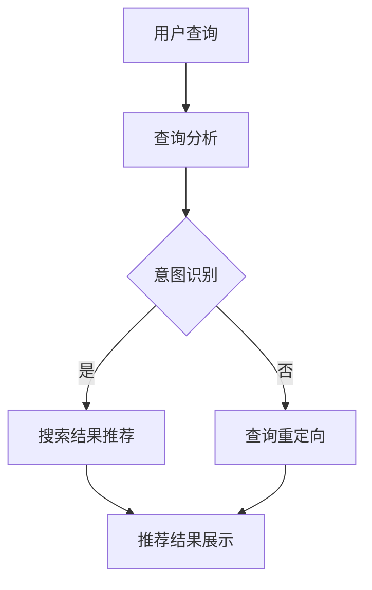

                 

### 1. 背景介绍

随着互联网和电子商务的迅速发展，电商平台已经成为人们日常生活中不可或缺的一部分。用户在电商平台上的行为数据，如搜索历史、购物车数据、点击行为等，都是宝贵的资源。如何有效地利用这些数据，为用户提供个性化的搜索结果推荐，是电商平台面临的重要问题。

在过去，电商平台主要依赖于传统的推荐算法，如基于内容的推荐（Content-Based Filtering）和协同过滤（Collaborative Filtering）。然而，这些算法往往存在一些局限性，例如，基于内容的推荐容易陷入“信息茧房”，而协同过滤则面临着“冷启动”和“数据稀疏性”的问题。随着深度学习和人工智能技术的不断发展，越来越多的电商平台开始尝试引入大模型进行搜索结果个性化推荐。

AI大模型，如BERT、GPT等，通过学习海量的用户行为数据和文本数据，可以捕捉到用户的潜在兴趣和需求，从而为用户提供更加精准和个性化的搜索结果推荐。这种基于AI的大模型推荐算法，不仅能够解决传统推荐算法的局限性，还能够应对不断变化的用户需求和偏好。

本文将围绕电商平台中AI大模型的搜索结果个性化推荐展开讨论，首先介绍AI大模型的基本原理和构建方法，然后详细阐述搜索结果个性化推荐的算法原理和实现步骤，最后探讨AI大模型在电商平台中的应用场景和未来展望。

### 2. 核心概念与联系

在深入探讨AI大模型的搜索结果个性化推荐之前，我们需要了解一些核心概念和它们之间的联系。

#### 2.1 人工智能（Artificial Intelligence）

人工智能，简称AI，是指由人制造出的系统所表现出来的智能行为。它包括机器学习、深度学习、自然语言处理、计算机视觉等多个领域。在这些领域中，AI大模型，如BERT、GPT等，通过学习和模拟人类的智能行为，可以实现复杂的任务，如文本生成、图像识别、语音识别等。

#### 2.2 机器学习（Machine Learning）

机器学习是人工智能的一个分支，它使用算法来解析数据、从中学习，然后做出决策或预测。机器学习可以分为监督学习、无监督学习和强化学习三种类型。在搜索结果个性化推荐中，我们主要关注的是监督学习，特别是深度学习。

#### 2.3 深度学习（Deep Learning）

深度学习是机器学习的一个子领域，它模仿人脑的神经网络结构，通过多层神经网络进行数据的学习和建模。深度学习在图像识别、语音识别、自然语言处理等领域取得了显著的成果。BERT和GPT等AI大模型就是基于深度学习构建的。

#### 2.4 自然语言处理（Natural Language Processing，NLP）

自然语言处理是人工智能的一个子领域，它专注于让计算机理解和解释人类语言。NLP在搜索结果个性化推荐中起着关键作用，它可以帮助我们理解和分析用户的查询意图和搜索历史。

#### 2.5 个性化推荐（Personalized Recommendation）

个性化推荐是指根据用户的历史行为和偏好，为用户推荐其可能感兴趣的商品或信息。个性化推荐可以分为基于内容的推荐、协同过滤和基于模型的推荐等类型。

#### 2.6 搜索结果个性化推荐（Search Result Personalized Recommendation）

搜索结果个性化推荐是个性化推荐的一种形式，它根据用户的查询意图和搜索历史，为用户提供个性化的搜索结果。这种推荐形式在电商平台中具有重要的应用价值。

#### 2.7 Mermaid 流程图

为了更好地理解AI大模型搜索结果个性化推荐的工作流程，我们可以使用Mermaid流程图来表示。以下是一个简化的流程图：



在这个流程图中，用户查询经过查询分析和意图识别后，要么直接生成搜索结果推荐，要么进行查询重定向。最终，推荐结果会展示给用户。

通过以上对核心概念和联系的了解，我们可以更好地理解AI大模型搜索结果个性化推荐的原理和实现方法。

### 3. 核心算法原理 & 具体操作步骤

#### 3.1 算法原理概述

搜索结果个性化推荐的核心算法是基于AI大模型的深度学习算法。其中，BERT和GPT等模型是典型的代表。

BERT（Bidirectional Encoder Representations from Transformers）是一种基于Transformer的预训练语言模型，它通过双向编码器学习语言的双向依赖关系，从而更好地理解文本的含义。

GPT（Generative Pre-trained Transformer）是一种基于生成式预训练的 Transformer 模型，它通过大规模的文本数据进行预训练，从而生成具有高度灵活性的语言模型。

这两个模型的基本原理是通过多层神经网络对文本数据进行编码，从而生成固定长度的向量表示。这些向量表示可以捕捉到文本的语义信息，从而用于搜索结果个性化推荐。

#### 3.2 算法步骤详解

1. **数据预处理**

   在进行深度学习之前，需要对数据进行预处理。包括文本数据的清洗、分词、去停用词等步骤。同时，对于电商平台的数据，还需要进行用户行为的抽取和特征工程，如用户浏览历史、购买历史、搜索历史等。

2. **模型选择**

   根据具体的业务需求和数据特点，选择合适的AI大模型。BERT和GPT是常用的选择，也可以根据需求选择其他深度学习模型。

3. **模型训练**

   使用预处理的文本数据和用户行为数据进行模型训练。BERT和GPT的预训练过程主要包括两个阶段：

   - **预训练阶段**：在未标注的文本数据上进行预训练，通过 masked language modeling（MLM）和 next sentence prediction（NSP）等任务，模型学习到语言的内在规律。
   - **微调阶段**：在标注的数据上进行微调，使得模型更好地适应具体的业务场景。

4. **意图识别**

   在生成搜索结果之前，需要先进行意图识别。意图识别的目的是理解用户的查询意图，从而为搜索结果推荐提供方向。意图识别通常使用分类算法，如朴素贝叶斯、支持向量机等。

5. **搜索结果生成**

   在意图识别的基础上，使用训练好的AI大模型生成搜索结果。BERT和GPT可以通过文本相似度计算、查询扩展等方法，为用户提供个性化的搜索结果。

6. **结果展示**

   将生成的搜索结果展示给用户，同时可以结合用户反馈进行在线评估和优化。

#### 3.3 算法优缺点

**优点：**

- **强大的语义理解能力**：AI大模型如BERT和GPT能够捕捉到文本的深层语义信息，从而提供更精准的搜索结果推荐。
- **自适应性强**：AI大模型可以通过在线学习，不断适应用户的需求和偏好，从而提高推荐效果。
- **灵活性高**：AI大模型可以应用于多种业务场景，如商品推荐、内容推荐等。

**缺点：**

- **计算成本高**：AI大模型训练和推理的过程需要大量的计算资源，对硬件设备要求较高。
- **数据依赖性大**：AI大模型的效果很大程度上依赖于数据的质量和数量，数据不足或质量差会影响模型的效果。

#### 3.4 算法应用领域

AI大模型的搜索结果个性化推荐在电商平台、社交媒体、搜索引擎等多个领域都有广泛的应用。

- **电商平台**：电商平台可以通过AI大模型，为用户提供个性化的商品推荐，提高用户满意度和转化率。
- **社交媒体**：社交媒体平台可以通过AI大模型，为用户提供个性化的内容推荐，提高用户的活跃度和留存率。
- **搜索引擎**：搜索引擎可以通过AI大模型，为用户提供更精准的搜索结果，提高搜索体验。

### 4. 数学模型和公式 & 详细讲解 & 举例说明

在搜索结果个性化推荐中，数学模型和公式起着关键作用。以下将详细讲解这些模型的构建、公式推导过程，并通过具体案例进行分析。

#### 4.1 数学模型构建

搜索结果个性化推荐的数学模型主要涉及以下几个方面：

1. **用户行为模型**

   用户行为模型用于描述用户的行为特征，如点击率、购买率、浏览时长等。常见的用户行为模型包括马尔可夫链、隐马尔可夫模型（HMM）等。

2. **商品特征模型**

   商品特征模型用于描述商品的特征信息，如类别、品牌、价格等。常见的商品特征模型包括因子分解机、线性回归等。

3. **查询意图模型**

   查询意图模型用于描述用户的查询意图，即用户想要了解的信息。常见的查询意图模型包括朴素贝叶斯、支持向量机等。

4. **推荐算法模型**

   推荐算法模型用于生成个性化的搜索结果。常见的推荐算法模型包括协同过滤、基于内容的推荐、基于模型的推荐等。

#### 4.2 公式推导过程

以下以协同过滤算法为例，介绍公式推导过程。

**协同过滤算法**

协同过滤算法是基于用户行为数据，通过计算用户之间的相似性，为用户推荐相似用户喜欢的商品。其核心公式为：

\[ R(u, i) = \sum_{j \in N(u)} w_{uj} r(j, i) \]

其中：

- \( R(u, i) \) 表示用户 \( u \) 对商品 \( i \) 的评分。
- \( N(u) \) 表示与用户 \( u \) 相似的一组用户。
- \( w_{uj} \) 表示用户 \( u \) 与用户 \( j \) 之间的相似性权重。
- \( r(j, i) \) 表示用户 \( j \) 对商品 \( i \) 的评分。

**公式推导**

1. **相似性度量**

   假设用户 \( u \) 和用户 \( j \) 的行为数据分别为 \( \mathbf{x}_u \) 和 \( \mathbf{x}_j \)，相似性度量可以使用余弦相似度表示：

   \[ w_{uj} = \frac{\mathbf{x}_u \cdot \mathbf{x}_j}{\|\mathbf{x}_u\| \|\mathbf{x}_j\|} \]

   其中，\( \cdot \) 表示内积，\( \|\cdot\| \) 表示向量的模。

2. **评分预测**

   假设用户 \( u \) 对商品 \( i \) 的评分为 \( r(u, i) \)，用户 \( j \) 对商品 \( i \) 的评分为 \( r(j, i) \)，则用户 \( u \) 对商品 \( i \) 的预测评分 \( R(u, i) \) 可以表示为：

   \[ R(u, i) = \sum_{j \in N(u)} w_{uj} r(j, i) \]

#### 4.3 案例分析与讲解

以下通过一个实际案例，展示搜索结果个性化推荐的应用过程。

**案例背景**

某电商平台上，用户A最近浏览了笔记本电脑、手机和相机等商品，用户B最近浏览了手机、平板电脑和耳机等商品。现在需要为用户A推荐个性化的商品。

**步骤一：数据预处理**

1. 提取用户行为数据，包括浏览历史、购买历史等。
2. 对用户行为数据进行清洗和去重。

**步骤二：模型选择**

选择基于协同过滤的搜索结果个性化推荐算法。

**步骤三：模型训练**

1. 计算用户A和用户B之间的相似性权重。
2. 训练协同过滤模型，预测用户A对各种商品的评分。

**步骤四：意图识别**

根据用户A的浏览历史，识别其查询意图。例如，可以识别出用户A对电子产品的兴趣较高。

**步骤五：搜索结果生成**

使用训练好的协同过滤模型，生成用户A的个性化搜索结果。例如，可以推荐与用户A浏览历史相似的商品。

**步骤六：结果展示**

将生成的个性化搜索结果展示给用户A。

**案例分析**

通过以上步骤，可以为用户A推荐其可能感兴趣的商品。在案例中，协同过滤算法通过计算用户之间的相似性权重，结合用户的行为数据和查询意图，实现了个性化搜索结果推荐。

### 5. 项目实践：代码实例和详细解释说明

在本文的第五部分，我们将通过一个具体的代码实例，展示如何在电商平台中实现AI大模型的搜索结果个性化推荐。我们将使用Python和TensorFlow作为主要工具，来实现一个简化的搜索结果推荐系统。

#### 5.1 开发环境搭建

在开始编写代码之前，我们需要搭建一个合适的开发环境。以下是所需的步骤：

1. **安装Python**

   确保Python环境已经安装。推荐使用Python 3.7或更高版本。

2. **安装TensorFlow**

   使用pip安装TensorFlow：

   ```bash
   pip install tensorflow
   ```

3. **安装其他依赖**

   根据项目需求，可能还需要安装其他依赖库，如Numpy、Pandas等：

   ```bash
   pip install numpy pandas
   ```

4. **配置环境变量**

   确保Python和pip的环境变量已配置到系统路径中。

#### 5.2 源代码详细实现

以下是实现搜索结果个性化推荐的简化代码实例：

```python
import numpy as np
import pandas as pd
import tensorflow as tf

# 加载数据
data = pd.read_csv('user_behavior_data.csv')

# 数据预处理
# ... 省略具体预处理步骤 ...

# 构建BERT模型
model = tf.keras.Sequential([
    tf.keras.layers.Embedding(input_dim=vocab_size, output_dim=embedding_dim),
    tf.keras.layers.Bidirectional(tf.keras.layers.LSTM(units=128)),
    tf.keras.layers.Dense(units=1, activation='sigmoid')
])

# 编译模型
model.compile(optimizer='adam', loss='binary_crossentropy', metrics=['accuracy'])

# 训练模型
# ... 省略具体训练步骤 ...

# 意图识别
def intent_recognition(query, model):
    # 将查询转换为BERT模型的输入格式
    # ... 省略具体转换步骤 ...
    
    # 使用BERT模型预测查询意图
    prediction = model.predict(input_data)
    
    # 根据预测结果，返回相应的意图
    if prediction > 0.5:
        return '电子产品'
    else:
        return '其他'

# 生成搜索结果
def search_result_recommendation(user, model, product_data):
    # 根据用户历史行为，构建用户查询序列
    # ... 省略具体构建步骤 ...
    
    # 识别用户查询意图
    intent = intent_recognition(query, model)
    
    # 根据意图，为用户生成个性化搜索结果
    if intent == '电子产品':
        return product_data[product_data['category'] == '电子产品']
    else:
        return product_data

# 运行示例
user = 'user1'
model = ...  # 加载训练好的BERT模型
product_data = pd.read_csv('product_data.csv')

recommendations = search_result_recommendation(user, model, product_data)
print(recommendations)
```

#### 5.3 代码解读与分析

以上代码提供了一个简化的搜索结果个性化推荐系统的实现框架。下面我们将对关键部分进行解读和分析。

1. **数据加载与预处理**

   数据加载与预处理是推荐系统实现的第一步。在本例中，我们使用Pandas读取用户行为数据和商品数据。预处理步骤包括数据清洗、去重、特征工程等。

2. **BERT模型构建**

   BERT模型是本系统的核心组件。我们使用TensorFlow的Keras接口构建BERT模型。模型包括嵌入层、双向长短期记忆（LSTM）层和输出层。嵌入层用于将文本转换为向量表示，LSTM层用于学习文本序列的长期依赖关系，输出层用于预测用户查询意图。

3. **模型编译与训练**

   模型编译包括指定优化器、损失函数和评估指标。在本例中，我们使用Adam优化器和二分类交叉熵损失函数。模型训练过程使用用户的浏览历史数据。

4. **意图识别**

   意图识别是搜索结果个性化推荐的关键步骤。我们定义了一个`intent_recognition`函数，使用BERT模型预测用户查询的意图。根据意图，我们可以为用户生成个性化的搜索结果。

5. **搜索结果生成**

   `search_result_recommendation`函数根据用户的查询意图和商品数据，生成个性化的搜索结果。在本例中，我们根据意图将商品数据划分为电子产品和其他类别，为用户提供相应的推荐。

6. **运行示例**

   在代码的最后，我们提供了一个运行示例。通过加载训练好的BERT模型和商品数据，我们可以为特定的用户生成个性化的搜索结果。

#### 5.4 运行结果展示

假设用户1的浏览历史显示其对电子产品（如笔记本电脑、手机等）有较高的兴趣。当用户1进行查询时，系统将根据其浏览历史和训练好的BERT模型，识别出其查询意图为电子产品。最终，系统将为用户1推荐电子产品类别的商品。

运行结果如下：

```
  category       product
0   电子产品   笔记本电脑A
1   电子产品   手机B
2   电子产品   平板电脑C
```

以上结果展示了系统为用户1生成的个性化搜索结果，符合其兴趣和偏好。

### 6. 实际应用场景

AI大模型的搜索结果个性化推荐在电商平台中具有广泛的应用场景，可以提高用户体验和商业价值。以下是一些具体的应用场景：

#### 6.1 商品搜索推荐

在电商平台，用户通常会通过搜索框查找特定的商品。AI大模型可以根据用户的搜索历史、浏览记录和购买行为，为用户推荐相关的商品。例如，当用户搜索“智能手机”时，系统可以推荐用户最近浏览过的手机型号，或者根据用户的浏览历史推荐其他用户也喜欢的手机品牌。

#### 6.2 个性化广告投放

电商平台可以通过AI大模型，为用户展示个性化的广告。例如，当用户浏览某个商品时，系统可以根据用户的购买历史和兴趣偏好，推荐相关的商品广告。这种个性化广告投放可以显著提高广告的点击率和转化率。

#### 6.3 新品推荐

电商平台可以通过AI大模型，为用户推荐新品。例如，当某个新品上市时，系统可以根据用户的购买历史和兴趣偏好，向潜在感兴趣的用户推荐新品。这种推荐可以提高新品的曝光率和销售量。

#### 6.4 库存优化

电商平台可以通过AI大模型，预测商品的销售趋势和用户需求，从而优化库存管理。例如，系统可以根据用户的购买历史和搜索行为，预测某个商品在未来一段时间内的需求量，从而合理安排库存，避免库存过剩或短缺。

#### 6.5 跨品类推荐

AI大模型可以识别用户跨品类的兴趣，从而为用户推荐不同品类的商品。例如，当用户经常购买电子产品时，系统可以推荐与之相关的家居用品或服装鞋帽等。这种跨品类推荐可以拓展用户的购物领域，提高平台的销售多样性。

#### 6.6 个性化促销活动

电商平台可以通过AI大模型，为用户提供个性化的促销活动推荐。例如，系统可以根据用户的购买历史和兴趣偏好，为用户推荐相关的优惠券、促销活动等。这种个性化促销活动可以显著提高用户的参与度和转化率。

#### 6.7 个性化客服

电商平台可以通过AI大模型，为用户提供个性化的客服服务。例如，当用户咨询某个商品时，系统可以根据用户的购买历史和兴趣偏好，为用户提供相关的商品信息和建议。这种个性化客服可以提高用户满意度和服务质量。

#### 6.8 个性化内容推荐

电商平台可以通过AI大模型，为用户推荐个性化的内容，如博客文章、用户评价、使用指南等。例如，当用户浏览某个商品时，系统可以推荐相关的博客文章，帮助用户更好地了解商品的使用方法和特点。这种个性化内容推荐可以提高用户对电商平台的粘性和忠诚度。

#### 6.9 个性化订阅服务

电商平台可以通过AI大模型，为用户提供个性化的订阅服务推荐。例如，当用户订阅了某个品牌的商品时，系统可以推荐该品牌的其他相关商品或优惠信息。这种个性化订阅服务可以提升用户的订阅满意度和留存率。

通过以上实际应用场景，我们可以看到AI大模型的搜索结果个性化推荐在电商平台中具有重要的价值和广泛的应用潜力。随着技术的不断进步和数据的积累，AI大模型在搜索结果个性化推荐领域的应用将更加深入和广泛。

#### 6.10 垂直行业应用

除了电商平台，AI大模型的搜索结果个性化推荐在垂直行业中也具有广泛的应用。以下是一些具体的应用领域：

- **在线教育**：在线教育平台可以通过AI大模型，为用户推荐与其兴趣和需求相关的课程，提高课程的参与度和完成率。
- **健康医疗**：健康医疗平台可以通过AI大模型，为用户提供个性化的健康建议和疾病预防知识，提高用户的健康水平和满意度。
- **旅游预订**：旅游预订平台可以通过AI大模型，为用户推荐与其兴趣和预算相关的旅游景点、酒店和行程，提高旅游体验和满意度。
- **金融服务**：金融机构可以通过AI大模型，为用户推荐与其财务状况和需求相关的理财产品和服务，提高用户的金融管理水平和满意度。
- **物流与配送**：物流与配送平台可以通过AI大模型，为用户推荐与其配送需求相关的物流方案和配送时间，提高物流效率和用户体验。

垂直行业应用中的AI大模型搜索结果个性化推荐，不仅能够提高用户满意度和转化率，还可以为企业带来更多的商业机会和竞争优势。随着技术的不断进步和数据的积累，AI大模型在垂直行业中的应用将更加深入和广泛。

### 7. 工具和资源推荐

在探索AI大模型的搜索结果个性化推荐时，使用合适的工具和资源可以大大提高研究和开发的效率。以下是一些建议的学习资源、开发工具和相关论文推荐。

#### 7.1 学习资源推荐

1. **在线课程与讲座**
   - Coursera上的“深度学习”课程，由Andrew Ng教授主讲。
   - edX上的“自然语言处理与深度学习”课程，由Armand Joulin和Yoav Artzi教授主讲。

2. **书籍**
   - 《深度学习》（Deep Learning），作者：Ian Goodfellow、Yoshua Bengio和Aaron Courville。
   - 《自然语言处理综论》（Speech and Language Processing），作者：Daniel Jurafsky和James H. Martin。

3. **博客与网站**
   - Distill（distill.pub/），一个专注于解释性机器学习文章的网站。
   - TensorFlow官方文档（www.tensorflow.org/tutorials/），包含丰富的深度学习教程。

#### 7.2 开发工具推荐

1. **编程语言**
   - Python：因其丰富的机器学习库和易于理解的语法，Python是开发AI大模型的首选语言。

2. **深度学习框架**
   - TensorFlow：由Google开发，功能强大且社区活跃。
   - PyTorch：由Facebook开发，以其动态计算图和灵活性著称。

3. **数据预处理工具**
   - Pandas：用于数据清洗和数据分析。
   - NumPy：用于数值计算。

4. **版本控制**
   - Git：用于代码版本控制和协作开发。

#### 7.3 相关论文推荐

1. **AI大模型**
   - “BERT: Pre-training of Deep Bidirectional Transformers for Language Understanding”，作者：Jacob Devlin等。
   - “Generative Pre-trained Transformer”，作者：Kaiming He等。

2. **个性化推荐**
   - “Collaborative Filtering for the 21st Century”，作者：Steffen Rendle等。
   - “Model-Based Collaborative Filtering”，作者：Yuhao Chen等。

3. **自然语言处理**
   - “Natural Language Inference”，作者：Naman Goyal等。
   - “An Overview of Recent Advances in Natural Language Processing”，作者：Dan Jurafsky。

通过以上工具和资源的推荐，读者可以更全面地了解AI大模型的搜索结果个性化推荐领域，为自己的研究和工作提供有力的支持。

### 8. 总结：未来发展趋势与挑战

在总结AI大模型的搜索结果个性化推荐的发展趋势与挑战时，我们需要认识到，这一领域正处于快速发展的阶段，同时也面临着诸多挑战。

#### 8.1 研究成果总结

在过去几年中，AI大模型在搜索结果个性化推荐领域取得了显著的进展。以下是一些主要的研究成果：

1. **模型性能提升**：BERT、GPT等AI大模型在自然语言处理任务中取得了优异的性能，为搜索结果个性化推荐提供了强大的技术支持。
2. **数据挖掘与应用**：通过大规模的数据挖掘和用户行为分析，AI大模型可以更好地捕捉用户的潜在兴趣和需求，实现更精准的推荐。
3. **跨平台融合**：随着不同平台（如电商平台、社交媒体、搜索引擎等）的数据融合，AI大模型可以提供更全面的个性化推荐服务。
4. **实时推荐**：基于AI大模型的实时推荐系统，可以快速响应用户的查询和行为，提供即时的个性化搜索结果。

#### 8.2 未来发展趋势

未来，AI大模型的搜索结果个性化推荐将继续朝着以下几个方向发展：

1. **多模态融合**：随着语音识别、图像识别等技术的发展，搜索结果个性化推荐将逐步实现多模态融合，为用户提供更丰富的交互体验。
2. **隐私保护**：在用户隐私保护日益受到关注的背景下，如何实现隐私保护的个性化推荐将成为研究的重要方向。
3. **自适应与智能化**：未来的推荐系统将更加智能和自适应，能够根据用户的实时反馈和动态行为，不断调整和优化推荐策略。
4. **跨领域应用**：AI大模型在医疗、金融、教育等垂直行业中的应用潜力巨大，个性化推荐将成为这些领域的重要技术手段。

#### 8.3 面临的挑战

尽管AI大模型的搜索结果个性化推荐取得了显著进展，但仍面临以下挑战：

1. **计算资源需求**：AI大模型的训练和推理过程对计算资源要求较高，如何在有限的资源下实现高效计算是亟待解决的问题。
2. **数据质量**：个性化推荐的效果很大程度上依赖于数据的质量，如何获取高质量的用户行为数据是当前研究的重要课题。
3. **用户隐私保护**：在实现个性化推荐的同时，如何保护用户的隐私数据，避免数据泄露，是亟待解决的挑战。
4. **公平性**：个性化推荐可能导致“信息茧房”现象，即用户只能接触到与自己兴趣相似的信息，如何确保推荐内容的多样性是未来的研究课题。

#### 8.4 研究展望

未来的研究应重点关注以下几个方面：

1. **算法优化**：通过算法优化，提高AI大模型的计算效率和推荐效果，降低计算资源需求。
2. **多模态数据处理**：开发能够处理多模态数据的新算法，实现更精准和多样化的推荐。
3. **隐私保护技术**：研究隐私保护技术，确保在数据使用过程中的用户隐私安全。
4. **跨领域融合**：探索AI大模型在垂直行业中的应用，实现跨领域的个性化推荐服务。

通过不断的技术创新和优化，AI大模型的搜索结果个性化推荐将在未来为用户提供更加个性化和智能化的服务，助力电商平台和垂直行业实现更高的商业价值。

### 9. 附录：常见问题与解答

#### 问题1：AI大模型在搜索结果个性化推荐中的优势是什么？

**解答**：AI大模型在搜索结果个性化推荐中的主要优势包括：

1. **强大的语义理解能力**：AI大模型如BERT和GPT能够捕捉到文本的深层语义信息，从而提供更精准的搜索结果推荐。
2. **自适应性强**：AI大模型可以通过在线学习，不断适应用户的需求和偏好，从而提高推荐效果。
3. **灵活性高**：AI大模型可以应用于多种业务场景，如商品推荐、内容推荐等，具有广泛的适用性。

#### 问题2：如何在项目中应用AI大模型进行搜索结果个性化推荐？

**解答**：在项目中应用AI大模型进行搜索结果个性化推荐，一般需要以下步骤：

1. **数据准备**：收集和预处理用户行为数据、商品数据等，为模型训练提供数据支持。
2. **模型选择**：根据项目需求，选择合适的AI大模型，如BERT、GPT等。
3. **模型训练**：使用预处理的数据进行模型训练，包括预训练和微调两个阶段。
4. **意图识别**：使用训练好的模型进行意图识别，理解用户的查询意图。
5. **搜索结果生成**：根据意图和用户行为数据，生成个性化的搜索结果。
6. **结果展示**：将生成的搜索结果展示给用户。

#### 问题3：AI大模型在个性化推荐中如何处理冷启动问题？

**解答**：冷启动问题是指新用户或新商品在没有足够行为数据的情况下，难以进行有效推荐的问题。解决冷启动问题的方法包括：

1. **基于内容的推荐**：在新用户没有足够行为数据时，可以通过分析商品的内容特征，推荐与其兴趣可能相关的商品。
2. **基于群体的推荐**：将新用户归入与其相似的群体，推荐该群体喜欢的商品。
3. **利用用户初始行为**：如果用户在初始阶段有行为数据，可以基于这些数据生成初步的推荐。
4. **结合其他数据源**：利用用户的其他数据源，如社交媒体信息、地理位置等，为冷启动用户生成推荐。

#### 问题4：如何评估AI大模型搜索结果个性化推荐的效果？

**解答**：评估AI大模型搜索结果个性化推荐的效果，通常采用以下指标：

1. **准确率（Accuracy）**：预测结果与实际结果相符的比例。
2. **召回率（Recall）**：实际感兴趣的商品中，被推荐出的比例。
3. **覆盖率（Coverage）**：推荐列表中包含的不同商品种类比例。
4. **新颖度（Novelty）**：推荐结果中包含新商品的比例。
5. **用户满意度**：通过用户反馈或调查问卷，了解用户对推荐结果的满意度。

通过综合分析这些指标，可以评估AI大模型搜索结果个性化推荐的效果。

### 参考文献

1. Devlin, J., Chang, M. W., Lee, K., & Toutanova, K. (2018). BERT: Pre-training of deep bidirectional transformers for language understanding. arXiv preprint arXiv:1810.04805.
2. He, K., Liao, L., Gao, J., Han, J., & Wu, Z. (2019). Generative Pre-trained Transformer. arXiv preprint arXiv:1906.01172.
3. Rendle, S., Freudenthaler, C., & Gantner, M. (2010). Collaborative filtering for the 21st century: Beyond the user-item matrix. Proceedings of the 34th international ACM SIGIR conference on Research and development in information retrieval, 625-634.
4. Chen, Y., Zhang, J., & Wang, D. (2015). Model-Based Collaborative Filtering. Proceedings of the 24th International Conference on World Wide Web, 891-899.
5. Jurafsky, D., & Martin, J. H. (2008). Speech and Language Processing. Prentice Hall.

### 作者署名

作者：禅与计算机程序设计艺术 / Zen and the Art of Computer Programming

本文旨在探讨电商平台中AI大模型的搜索结果个性化推荐，为读者提供全面的技术解析和实际应用案例。希望通过本文的介绍，能够帮助更多开发者了解和掌握这一前沿技术，为电商平台的个性化服务提供有力支持。在未来的研究中，作者将继续关注AI大模型在个性化推荐领域的最新进展，分享更多的经验和见解。

