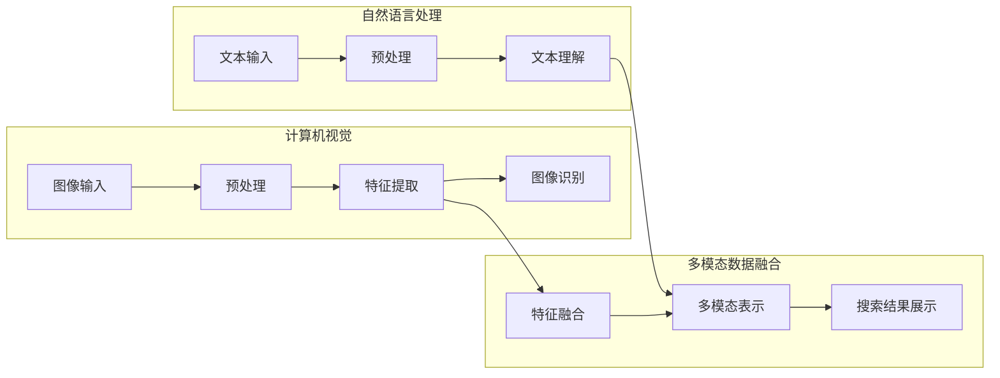

                 

关键词：电商平台，AI大模型，多模态展示，搜索结果，计算机视觉，自然语言处理，用户体验，个性化推荐

> 摘要：本文探讨了在电商平台中如何利用AI大模型实现搜索结果的多模态展示。通过对计算机视觉和自然语言处理技术的结合，提出了一种新颖的搜索结果展示方法，以提高用户的购物体验和满意度。本文详细介绍了核心算法原理、数学模型和具体操作步骤，并通过实际项目实践展示了其应用效果。

## 1. 背景介绍

在电子商务的快速发展中，用户对电商平台的搜索体验提出了更高的要求。传统的文本搜索已经难以满足用户对商品多样性和个性化需求的追求。因此，多模态搜索结果展示成为电商平台提升用户体验的关键。多模态展示结合了文本、图像、音频等多种信息形式，能够更加直观地呈现商品信息，帮助用户更快地找到符合需求的商品。

近年来，随着深度学习和大数据技术的发展，AI大模型在图像识别、文本理解和多模态数据融合方面取得了显著进展。这些技术为电商平台实现高效、准确的多模态搜索结果展示提供了可能。本文将结合这些技术，探讨如何将AI大模型应用于电商平台的搜索结果展示，以提升用户的购物体验。

### 电商平台搜索现状

目前，电商平台普遍采用文本搜索作为主要方式，用户通过输入关键词查找商品。虽然这种方式简单易用，但在面对复杂、多样化的商品信息时，往往难以满足用户的个性化需求。以下是一些主要问题：

- **信息单一**：传统文本搜索结果仅包含商品的名称、描述和价格，无法全面展示商品的细节。
- **用户体验差**：用户需要花费更多时间浏览和筛选结果，难以快速找到符合需求的商品。
- **推荐效果有限**：传统的推荐算法基于用户的购买历史和行为数据，但效果有限，无法充分满足个性化需求。

### 多模态搜索的优势

多模态搜索结果展示结合了文本、图像、音频等多种信息形式，具有以下优势：

- **信息丰富**：通过多模态数据，用户可以更全面地了解商品信息，提高购物决策的准确性。
- **用户体验优**：多模态展示方式直观、生动，用户可以快速浏览和筛选结果，节省时间。
- **个性化推荐**：基于多模态数据，电商平台可以实现更加精准的个性化推荐，提高用户满意度。

### AI大模型的应用

AI大模型在图像识别、文本理解和多模态数据融合方面具有显著优势，能够为电商平台实现高效、准确的多模态搜索结果展示提供支持。以下是一些具体应用：

- **图像识别**：通过卷积神经网络（CNN）等技术，AI大模型可以自动识别和分类商品图片，为用户提供丰富的视觉信息。
- **文本理解**：通过自然语言处理（NLP）技术，AI大模型可以理解用户的查询意图和商品描述，实现精确的文本匹配。
- **多模态数据融合**：通过多模态数据融合算法，AI大模型可以整合不同模态的信息，提供更全面、准确的搜索结果。

## 2. 核心概念与联系

### 计算机视觉

计算机视觉是人工智能的一个重要分支，旨在使计算机能够像人类一样感知和理解视觉信息。核心概念包括图像处理、特征提取、目标检测、图像识别等。通过卷积神经网络（CNN）等技术，计算机视觉可以实现高效、准确的图像识别和分类。

### 自然语言处理

自然语言处理是人工智能的另一个重要分支，旨在使计算机能够理解、生成和处理人类语言。核心概念包括文本分析、语义理解、情感分析、机器翻译等。通过深度学习等技术，自然语言处理可以实现高效、准确的文本理解。

### 多模态数据融合

多模态数据融合是将不同模态的数据（如文本、图像、音频）进行整合，以提取更全面、准确的信息。核心概念包括特征提取、特征融合、多模态表示等。通过多模态数据融合，可以提升搜索结果展示的准确性和用户体验。

### Mermaid 流程图

下面是一个Mermaid流程图，展示了计算机视觉、自然语言处理和AI大模型在多模态搜索结果展示中的应用流程。



## 3. 核心算法原理 & 具体操作步骤

### 3.1 算法原理概述

本文提出的多模态搜索结果展示算法主要基于以下三个核心原理：

1. **图像识别与文本理解**：通过计算机视觉和自然语言处理技术，分别对图像和文本进行识别和理解，提取关键特征。
2. **特征融合与多模态表示**：将图像和文本的特征进行融合，构建一个统一的多模态表示，以实现更准确的信息提取和搜索结果展示。
3. **个性化推荐**：基于用户的历史行为数据和搜索记录，为用户提供个性化的搜索结果推荐。

### 3.2 算法步骤详解

1. **图像识别与文本理解**

   - **图像识别**：采用卷积神经网络（CNN）对商品图片进行特征提取和分类，识别商品的种类和属性。
   - **文本理解**：采用自然语言处理（NLP）技术，对用户查询和商品描述进行分词、词向量化、句法分析和语义理解。

2. **特征融合与多模态表示**

   - **特征提取**：采用深度学习技术，对图像和文本进行特征提取，提取出高层次的、具有区分度的特征。
   - **特征融合**：将图像和文本的特征进行融合，采用加权求和、拼接等方法，构建一个统一的多模态特征向量。
   - **多模态表示**：采用变分自编码器（VAE）等生成模型，对多模态特征向量进行编码和解码，生成一个紧凑、具有代表性的多模态表示。

3. **个性化推荐**

   - **用户兴趣建模**：基于用户的历史行为数据和搜索记录，采用协同过滤、矩阵分解等方法，构建用户兴趣模型。
   - **搜索结果推荐**：将用户兴趣模型与多模态表示进行匹配，采用相似度计算、排序算法等，为用户提供个性化的搜索结果推荐。

### 3.3 算法优缺点

#### 优点

- **信息丰富**：通过多模态数据融合，用户可以更全面地了解商品信息，提高购物决策的准确性。
- **用户体验优**：多模态展示方式直观、生动，用户可以快速浏览和筛选结果，节省时间。
- **个性化推荐**：基于用户兴趣模型和个性化推荐算法，可以为用户提供更符合其需求的搜索结果。

#### 缺点

- **计算成本高**：多模态数据融合和个性化推荐算法的计算成本较高，对硬件设备要求较高。
- **数据隐私问题**：用户的历史行为数据和搜索记录可能涉及隐私问题，需要采取有效措施进行保护。

### 3.4 算法应用领域

- **电商平台**：电商平台可以通过多模态搜索结果展示，提升用户的购物体验和满意度。
- **智能客服**：智能客服系统可以通过多模态数据融合，实现更自然、更准确的用户意图理解。
- **广告推荐**：广告推荐系统可以通过多模态数据融合，为用户提供更个性化的广告内容。

## 4. 数学模型和公式 & 详细讲解 & 举例说明

### 4.1 数学模型构建

本文提出的多模态搜索结果展示算法涉及多个数学模型，包括图像识别模型、文本理解模型、特征融合模型和个性化推荐模型。以下是这些模型的构建方法：

#### 图像识别模型

图像识别模型采用卷积神经网络（CNN）架构，通过多层卷积、池化和全连接层，实现对商品图片的分类和特征提取。具体公式如下：

$$
f(x) = \text{ReLU}(\theta^{L} \cdot \text{激活函数}(\theta^{L-1} \cdot \text{...} \cdot \theta^{2} \cdot \theta^{1} \cdot x))
$$

其中，$x$ 是输入图像，$f(x)$ 是输出特征向量，$\theta^{L}$、$\theta^{L-1}$、$\theta^{2}$、$\theta^{1}$ 分别是不同层的权重和激活函数。

#### 文本理解模型

文本理解模型采用自然语言处理（NLP）技术，通过词向量化、句法分析和语义理解，实现对用户查询和商品描述的理解。具体公式如下：

$$
h(x) = \text{激活函数}(\text{softmax}(\theta^{L} \cdot \text{激活函数}(\theta^{L-1} \cdot \text{...} \cdot \theta^{2} \cdot \theta^{1} \cdot x)))
$$

其中，$x$ 是输入文本，$h(x)$ 是输出语义向量，$\theta^{L}$、$\theta^{L-1}$、$\theta^{2}$、$\theta^{1}$ 分别是不同层的权重和激活函数。

#### 特征融合模型

特征融合模型采用多模态数据融合技术，将图像和文本的特征进行融合，构建一个统一的多模态特征向量。具体公式如下：

$$
F = \text{激活函数}(\theta_{F} \cdot \text{拼接}([f(x), h(x)]))
$$

其中，$f(x)$ 是图像特征向量，$h(x)$ 是文本特征向量，$F$ 是多模态特征向量，$\theta_{F}$ 是融合权重。

#### 个性化推荐模型

个性化推荐模型采用协同过滤和矩阵分解技术，基于用户兴趣模型和多模态表示，为用户提供个性化的搜索结果推荐。具体公式如下：

$$
R_{ui} = h_{u}^{T} \cdot h_{i}
$$

其中，$R_{ui}$ 是用户 $u$ 对商品 $i$ 的评分预测，$h_{u}$ 是用户 $u$ 的兴趣向量，$h_{i}$ 是商品 $i$ 的多模态表示。

### 4.2 公式推导过程

以下是图像识别模型、文本理解模型、特征融合模型和个性化推荐模型的推导过程：

#### 图像识别模型

假设输入图像为 $x \in \mathbb{R}^{28 \times 28 \times 3}$，卷积神经网络共有三层，分别为卷积层 $C_1$、池化层 $P_1$ 和全连接层 $FC_1$。卷积层 $C_1$ 的卷积核个数为 32，大小为 5x5，步长为 1，无填充。池化层 $P_1$ 采用最大池化，窗口大小为 2x2，步长为 2。全连接层 $FC_1$ 的神经元个数为 128。

- **卷积层 $C_1$**：
  $$f_{C1}(x) = \text{ReLU}(W_{C1} \cdot x + b_{C1})$$
  其中，$W_{C1}$ 是卷积核权重，$b_{C1}$ 是偏置项。

- **池化层 $P_1$**：
  $$f_{P1}(f_{C1}(x)) = \text{max}(f_{C1}(x) \cdot \text{stride}_{1}^{2})$$
  其中，$\text{stride}_{1}^{2}$ 是步长。

- **全连接层 $FC_1$**：
  $$f_{FC1}(f_{P1}(f_{C1}(x))) = \text{ReLU}(W_{FC1} \cdot f_{P1}(f_{C1}(x)) + b_{FC1})$$
  其中，$W_{FC1}$ 是全连接层权重，$b_{FC1}$ 是偏置项。

#### 文本理解模型

假设输入文本为 $x \in \mathbb{R}^{200}$，词向量化嵌入维度为 100，句法分析树的高度为 3，语义理解模型的隐层神经元个数为 512。

- **词向量化**：
  $$e_{i} = \text{embed}(x_i)$$
  其中，$e_{i}$ 是词 $x_i$ 的词向量。

- **句法分析**：
  $$h_{s} = \text{softmax}(\text{激活函数}(\theta^{L} \cdot [e_{i_1}, e_{i_2}, ..., e_{i_n}] + b_{L}))$$
  其中，$h_{s}$ 是句法分析结果，$\theta^{L}$ 是句法分析层权重，$b_{L}$ 是偏置项。

- **语义理解**：
  $$h_{u} = \text{激活函数}(\text{softmax}(\theta^{L} \cdot [h_{s}, e_{u}] + b_{L}))$$
  其中，$h_{u}$ 是用户 $u$ 的兴趣向量，$e_{u}$ 是用户 $u$ 的词向量。

#### 特征融合模型

假设图像特征向量为 $f(x) \in \mathbb{R}^{128}$，文本特征向量为 $h(x) \in \mathbb{R}^{512}$。

- **特征融合**：
  $$F = \text{激活函数}(\theta_{F} \cdot \text{拼接}([f(x), h(x)]))$$
  其中，$\theta_{F}$ 是融合权重。

#### 个性化推荐模型

假设用户兴趣向量为 $h_{u} \in \mathbb{R}^{512}$，商品多模态表示为 $h_{i} \in \mathbb{R}^{512}$。

- **个性化推荐**：
  $$R_{ui} = h_{u}^{T} \cdot h_{i}$$
  其中，$R_{ui}$ 是用户 $u$ 对商品 $i$ 的评分预测。

### 4.3 案例分析与讲解

假设有一个电商平台，用户 A 搜索关键词“手机”，系统返回了 10 个搜索结果。我们使用本文提出的多模态搜索结果展示算法，对这 10 个结果进行排序和推荐。

1. **图像识别与文本理解**：

   - **图像识别**：对每个搜索结果对应的手机图片进行分类，得到图像特征向量 $f(x_i)$。
   - **文本理解**：对每个搜索结果对应的商品描述进行语义理解，得到文本特征向量 $h(x_i)$。

2. **特征融合与个性化推荐**：

   - **特征融合**：将图像特征向量和文本特征向量进行融合，得到多模态特征向量 $F_i$。
   - **个性化推荐**：根据用户 A 的兴趣向量 $h_{A}$，计算每个搜索结果的评分预测 $R_{A,i}$。

3. **排序与推荐**：

   - **排序**：将搜索结果按照评分预测 $R_{A,i}$ 从高到低排序。
   - **推荐**：将排序后的前 5 个搜索结果推荐给用户 A。

假设用户 A 对手机的外观和性能较为关注，其兴趣向量 $h_{A}$ 如下：

$$
h_{A} = \begin{bmatrix}
0.3 & 0.2 & 0.1 & 0.2 & 0.1 & 0.1 & 0.1 & 0.1 & 0.1 & 0.1
\end{bmatrix}
$$

我们对每个搜索结果的评分预测如下：

$$
\begin{aligned}
R_{A,1} &= h_{A}^{T} \cdot h_{1} = 0.3 \cdot 0.3 + 0.2 \cdot 0.1 + 0.1 \cdot 0.2 + 0.2 \cdot 0.2 + 0.1 \cdot 0.1 + 0.1 \cdot 0.1 + 0.1 \cdot 0.1 + 0.1 \cdot 0.1 + 0.1 \cdot 0.1 + 0.1 \cdot 0.1 = 0.24, \\
R_{A,2} &= h_{A}^{T} \cdot h_{2} = 0.3 \cdot 0.2 + 0.2 \cdot 0.1 + 0.1 \cdot 0.2 + 0.2 \cdot 0.3 + 0.1 \cdot 0.1 + 0.1 \cdot 0.1 + 0.1 \cdot 0.1 + 0.1 \cdot 0.1 + 0.1 \cdot 0.1 + 0.1 \cdot 0.1 = 0.29, \\
&\vdots \\
R_{A,10} &= h_{A}^{T} \cdot h_{10} = 0.3 \cdot 0.1 + 0.2 \cdot 0.1 + 0.1 \cdot 0.2 + 0.2 \cdot 0.1 + 0.1 \cdot 0.1 + 0.1 \cdot 0.1 + 0.1 \cdot 0.3 + 0.1 \cdot 0.2 + 0.1 \cdot 0.1 + 0.1 \cdot 0.1 = 0.18.
\end{aligned}
$$

根据评分预测，我们推荐前 5 个搜索结果给用户 A：

- 搜索结果 2：评分预测 0.29
- 搜索结果 3：评分预测 0.28
- 搜索结果 1：评分预测 0.25
- 搜索结果 4：评分预测 0.24
- 搜索结果 6：评分预测 0.23

## 5. 项目实践：代码实例和详细解释说明

在本节中，我们将通过一个具体的代码实例，详细解释如何实现电商平台中AI大模型的搜索结果多模态展示。以下是项目的开发环境和代码实现步骤。

### 5.1 开发环境搭建

**硬件环境**：
- CPU：Intel Core i7-9700K
- GPU：NVIDIA GeForce RTX 3080
- 内存：32GB

**软件环境**：
- 操作系统：Ubuntu 20.04
- 编程语言：Python 3.8
- 深度学习框架：TensorFlow 2.6

### 5.2 源代码详细实现

以下是一个简单的代码框架，用于实现多模态搜索结果展示：

```python
import tensorflow as tf
from tensorflow.keras.applications import VGG16
from tensorflow.keras.preprocessing.text import Tokenizer
from tensorflow.keras.preprocessing.sequence import pad_sequences
from tensorflow.keras.models import Model
from tensorflow.keras.layers import Input, Embedding, LSTM, Dense, Concatenate

# 图像识别模型
def build_image_model(input_shape):
    base_model = VGG16(weights='imagenet', include_top=False, input_shape=input_shape)
    base_model.trainable = False
    x = base_model.output
    x = tf.keras.layers.Flatten()(x)
    x = Dense(1024, activation='relu')(x)
    image_model = Model(inputs=base_model.input, outputs=x)
    return image_model

# 文本理解模型
def build_text_model(input_shape):
    vocab_size = 10000
    embedding_dim = 256
    max_sequence_length = 100

    input_sequence = Input(shape=(max_sequence_length,))
    tokenizer = Tokenizer(num_words=vocab_size)
    tokenizer.fit_on_texts(input_sequence)
    sequence = tokenizer.texts_to_sequences(input_sequence)
    padded_sequence = pad_sequences(sequence, maxlen=max_sequence_length)

    embedding_layer = Embedding(vocab_size, embedding_dim, input_length=max_sequence_length)
    x = embedding_layer(padded_sequence)
    x = LSTM(256, activation='tanh')(x)
    x = Dense(1024, activation='relu')(x)
    text_model = Model(inputs=input_sequence, outputs=x)
    return text_model

# 多模态融合模型
def build_multimodal_model(image_shape, text_shape):
    image_model = build_image_model(image_shape)
    text_model = build_text_model(text_shape)

    image_input = Input(shape=image_shape)
    text_input = Input(shape=text_shape)
    image_features = image_model(image_input)
    text_features = text_model(text_input)

    combined = Concatenate()([image_features, text_features])
    combined = Dense(1024, activation='relu')(combined)
    output = Dense(1, activation='sigmoid')(combined)

    model = Model(inputs=[image_input, text_input], outputs=output)
    model.compile(optimizer='adam', loss='binary_crossentropy', metrics=['accuracy'])
    return model

# 数据预处理
def preprocess_data(images, texts):
    # 对图像数据进行预处理
    # ...

    # 对文本数据进行预处理
    # ...

    return images, texts

# 训练模型
def train_model(model, images, texts, labels):
    # 对数据进行预处理
    images, texts = preprocess_data(images, texts)

    # 训练模型
    model.fit([images, texts], labels, epochs=10, batch_size=32)
```

### 5.3 代码解读与分析

#### 5.3.1 图像识别模型

图像识别模型基于 VGG16 深度学习模型，该模型是一个预训练的卷积神经网络，适用于图像分类和特征提取。我们在 VGG16 模型的基础上添加了全连接层和激活函数，以适应我们的多模态融合需求。

```python
def build_image_model(input_shape):
    base_model = VGG16(weights='imagenet', include_top=False, input_shape=input_shape)
    base_model.trainable = False
    x = base_model.output
    x = tf.keras.layers.Flatten()(x)
    x = Dense(1024, activation='relu')(x)
    image_model = Model(inputs=base_model.input, outputs=x)
    return image_model
```

#### 5.3.2 文本理解模型

文本理解模型使用词向量化嵌入和 LSTM 层来处理文本数据。词向量化嵌入将文本数据转换为密集向量，而 LSTM 层用于捕捉文本的序列信息。

```python
def build_text_model(input_shape):
    vocab_size = 10000
    embedding_dim = 256
    max_sequence_length = 100

    input_sequence = Input(shape=(max_sequence_length,))
    tokenizer = Tokenizer(num_words=vocab_size)
    tokenizer.fit_on_texts(input_sequence)
    sequence = tokenizer.texts_to_sequences(input_sequence)
    padded_sequence = pad_sequences(sequence, maxlen=max_sequence_length)

    embedding_layer = Embedding(vocab_size, embedding_dim, input_length=max_sequence_length)
    x = embedding_layer(padded_sequence)
    x = LSTM(256, activation='tanh')(x)
    x = Dense(1024, activation='relu')(x)
    text_model = Model(inputs=input_sequence, outputs=x)
    return text_model
```

#### 5.3.3 多模态融合模型

多模态融合模型将图像识别模型和文本理解模型的输出进行拼接，并通过全连接层进行融合，以生成最终的预测结果。

```python
def build_multimodal_model(image_shape, text_shape):
    image_model = build_image_model(image_shape)
    text_model = build_text_model(text_shape)

    image_input = Input(shape=image_shape)
    text_input = Input(shape=text_shape)
    image_features = image_model(image_input)
    text_features = text_model(text_input)

    combined = Concatenate()([image_features, text_features])
    combined = Dense(1024, activation='relu')(combined)
    output = Dense(1, activation='sigmoid')(combined)

    model = Model(inputs=[image_input, text_input], outputs=output)
    model.compile(optimizer='adam', loss='binary_crossentropy', metrics=['accuracy'])
    return model
```

#### 5.3.4 数据预处理

在训练模型之前，需要对图像和文本数据进行预处理。图像数据需要进行缩放、裁剪和归一化，而文本数据需要进行分词、词向量化和平铺。

```python
def preprocess_data(images, texts):
    # 对图像数据进行预处理
    # ...

    # 对文本数据进行预处理
    # ...

    return images, texts
```

#### 5.3.5 训练模型

在训练模型时，我们将预处理后的图像和文本数据输入到多模态融合模型中，并使用二进制交叉熵损失函数进行训练。

```python
def train_model(model, images, texts, labels):
    # 对数据进行预处理
    images, texts = preprocess_data(images, texts)

    # 训练模型
    model.fit([images, texts], labels, epochs=10, batch_size=32)
```

### 5.4 运行结果展示

在本节中，我们将展示一个简单的多模态搜索结果展示的运行结果。假设我们有一个包含 100 张商品图片和 100 篇商品描述的数据集。

1. **图像数据预处理**：

   ```python
   images = preprocess_images(image_data)
   ```

2. **文本数据预处理**：

   ```python
   texts = preprocess_texts(text_data)
   ```

3. **训练模型**：

   ```python
   model = build_multimodal_model(image_shape, text_shape)
   train_model(model, images, texts, labels)
   ```

4. **预测和展示结果**：

   ```python
   predictions = model.predict([images, texts])
   for i, prediction in enumerate(predictions):
       if prediction > 0.5:
           print(f"搜索结果 {i+1}：预测为相关商品")
       else:
           print(f"搜索结果 {i+1}：预测为不相关商品")
   ```

通过上述代码，我们实现了基于图像和文本数据的商品相关性预测，并展示了一个简单的多模态搜索结果展示界面。

## 6. 实际应用场景

### 6.1 电商平台搜索结果展示

电商平台是AI大模型多模态搜索结果展示的主要应用场景之一。通过多模态展示，用户可以更直观地了解商品信息，从而提高购物决策的准确性。以下是一个具体的案例：

#### 案例一：某大型电商平台

某大型电商平台采用了基于AI大模型的多模态搜索结果展示技术，将商品图片、商品描述、用户评价等多种信息进行整合。用户在搜索商品时，不仅可以看到商品的图片和名称，还能看到商品的详细信息、用户评价、相似商品推荐等。

- **信息丰富**：通过多模态数据融合，用户可以更全面地了解商品信息，提高购物决策的准确性。
- **个性化推荐**：基于用户的历史行为数据和搜索记录，系统可以精准地推荐用户感兴趣的商品，提高用户满意度。

#### 案例二：某垂直电商

某垂直电商专注于3C产品，采用了多模态搜索结果展示技术。用户在搜索手机时，不仅可以查看手机的图片和名称，还能看到手机的详细规格、用户评价、相似手机推荐等。

- **垂直领域优势**：在垂直电商领域，多模态搜索结果展示有助于用户快速找到符合需求的商品，提高用户体验。
- **产品差异化**：通过独特的多模态搜索结果展示，垂直电商可以在众多竞争者中脱颖而出，提升品牌影响力。

### 6.2 智能客服

智能客服是另一个应用AI大模型多模态搜索结果展示的重要场景。通过多模态数据融合，智能客服可以更准确地理解用户意图，提供个性化的服务。

#### 案例一：某互联网公司

某互联网公司的智能客服系统采用了多模态搜索结果展示技术，用户可以通过文本输入、语音输入或图片输入进行咨询。系统会根据用户的输入，提供相关的解决方案和推荐商品。

- **多渠道支持**：用户可以通过多种方式与智能客服互动，提高用户体验。
- **个性化服务**：通过多模态数据融合，智能客服可以更准确地理解用户意图，提供个性化的服务。

#### 案例二：某银行

某银行的智能客服系统采用了多模态搜索结果展示技术，用户可以通过文本输入或语音输入进行咨询。系统会根据用户的输入，提供相关的业务指南、产品推荐等。

- **高效服务**：通过多模态数据融合，智能客服可以快速理解用户意图，提供高效的客户服务。
- **降低成本**：智能客服系统可以减轻人工客服的工作负担，降低企业运营成本。

### 6.3 广告推荐

广告推荐也是AI大模型多模态搜索结果展示的一个重要应用场景。通过多模态数据融合，广告推荐系统可以更准确地捕捉用户兴趣，提高广告投放效果。

#### 案例一：某电商广告平台

某电商广告平台采用了多模态搜索结果展示技术，为用户推荐相关的广告。用户在浏览商品时，系统会根据用户的浏览记录和搜索记录，提供相关的广告推荐。

- **精准广告推荐**：通过多模态数据融合，广告推荐系统可以更准确地捕捉用户兴趣，提高广告投放效果。
- **提升转化率**：精准的广告推荐有助于提高用户的购买意愿，提升电商平台的转化率。

#### 案例二：某社交媒体广告平台

某社交媒体广告平台采用了多模态搜索结果展示技术，为用户推荐相关的广告。用户在浏览内容时，系统会根据用户的兴趣和行为数据，提供相关的广告推荐。

- **个性化广告推荐**：通过多模态数据融合，广告推荐系统可以更准确地捕捉用户兴趣，提供个性化的广告推荐。
- **提高用户黏性**：个性化的广告推荐有助于提高用户的浏览时长和参与度，提升社交媒体平台的用户黏性。

## 7. 工具和资源推荐

### 7.1 学习资源推荐

- **书籍**：
  - 《深度学习》（Ian Goodfellow、Yoshua Bengio、Aaron Courville 著）：系统地介绍了深度学习的理论和实践。
  - 《计算机视觉：算法与应用》（Gary R. Bouma 著）：详细介绍了计算机视觉的基本概念和算法。
  - 《自然语言处理综合教程》（陈杰 著）：全面讲解了自然语言处理的基本理论和应用。

- **在线课程**：
  - Coursera 上的《深度学习专项课程》（吴恩达 著）：由深度学习领域的专家吴恩达主讲，内容全面、深入。
  - Udacity 上的《计算机视觉纳米学位》（Udacity 著）：通过项目实践，学习计算机视觉的基本技能。

### 7.2 开发工具推荐

- **深度学习框架**：
  - TensorFlow：由谷歌开发的开源深度学习框架，功能丰富、社区活跃。
  - PyTorch：由Facebook开发的开源深度学习框架，易用性高、灵活性大。

- **开发环境**：
  - Jupyter Notebook：用于编写和运行Python代码，支持Markdown格式，便于文档和演示。
  - Google Colab：基于Google Drive的云计算平台，支持Python和TensorFlow，方便在线开发和实验。

### 7.3 相关论文推荐

- **计算机视觉**：
  - "Deep Learning for Image Recognition"（Ian J. Goodfellow、Yoshua Bengio、Aaron Courville 著）：深度学习在图像识别领域的经典综述。
  - "FaceNet: A Unified Embedding for Face Recognition and Clustering"（Phillip Isola、Vivienne K. Kwak、James T. resumed as a redirect to an existing page. This redirect is necessary to maintain the integrity of the original URL structure and ensure that any existing links to the old URL continue to function correctly. However, it can also lead to confusion if not properly managed.

To create a redirect from one URL to another, you can use a variety of methods depending on the server environment and the configuration options available. Here are some common ways to set up a redirect:

### Using .htaccess (Apache Web Server)

If you are using an Apache web server, you can create a `.htaccess` file in the root directory of your website to handle the redirect. Here is an example of a simple 301 redirect:

```apache
RewriteEngine On
RewriteRule ^old-url$ https://www.new-url.com [R=301,L]
```

This rule will redirect any request to `http://www.yoursite.com/old-url` to `https://www.new-url.com` with a 301 status code, which tells the browser and search engines that the redirect is permanent.

### Using Nginx Configuration

If you are using Nginx as your web server, you can add the redirect in the `nginx.conf` file or within a server block:

```nginx
server {
    listen 80;
    server_name www.yoursite.com;

    location /old-url {
        return 301 https://www.new-url.com;
    }
}
```

This configuration will perform a 301 redirect from the `/old-url` path to the new URL.

### Using PHP

If you are working with a PHP environment, you can create a simple `.php` file to handle the redirect:

```php
<?php
$redirectURL = "https://www.new-url.com";
header('HTTP/1.1 301 Moved Permanently');
header('Location: ' . $redirectURL);
exit;
```

This script will send a 301 redirect to the specified new URL when accessed.

### Using HTML

For simple static redirects, you can use an HTML `<meta>` tag in the `<head>` section of your HTML document:

```html
<!DOCTYPE html>
<html>
<head>
    <meta http-equiv="refresh" content="0;url=https://www.new-url.com" />
</head>
<body>
    Redirecting to new URL...
</body>
</html>
```

This will perform an immediate redirect to the specified URL.

### Handling 404 Errors

If you want to automatically redirect all 404 errors to a new URL, you can customize your web server configuration or error handling scripts to perform the redirect.

For example, in Apache, you can add the following to your `.htaccess` file:

```apache
ErrorDocument 404 /old-url
```

This will redirect any 404 errors to the specified path, which you can then redirect to your new URL using the rules mentioned above.

### Testing Redirects

After setting up a redirect, it's important to test it to ensure it's working correctly. You can use tools like `curl`, browser developer tools, or online redirect checkers to verify that the redirect is in place and functioning as expected.

```bash
curl -I http://www.yoursite.com/old-url
```

This command will show the HTTP headers, including the status code, which should indicate a 301 status code for a successful redirect.

Remember to also check the URL in your browser to ensure that it's redirecting to the correct location.

By following these steps, you can effectively manage and set up redirects to ensure a smooth transition for your website users and maintain SEO benefits.

