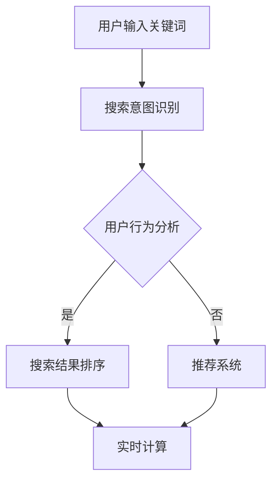

                 

关键词：电商平台、AI大模型、搜索结果、实时排序

> 摘要：本文将探讨电商平台中利用AI大模型进行搜索结果实时排序的技术和方法，分析其核心概念与联系，详细介绍算法原理与数学模型，并通过项目实践展示其实际应用效果。

## 1. 背景介绍

随着电商平台的快速发展，用户数量的激增以及商品种类的不断丰富，如何提供高效、精准的搜索结果是电商平台面临的重要挑战。传统的基于关键词匹配的搜索算法已无法满足用户对个性化、智能化的需求。因此，利用AI大模型进行搜索结果实时排序成为一种新兴的技术手段，它能够根据用户的兴趣和行为特征，为用户提供更加符合需求的商品推荐。

本文将围绕电商平台中AI大模型的搜索结果实时排序展开讨论，分析其核心概念与联系，介绍算法原理与数学模型，并通过实际项目实践来验证其效果。

### 电商平台现状分析

电商平台作为数字经济的重要组成部分，已经深刻影响了人们的购物习惯和生活方式。据统计，全球电商市场在2021年已经达到了3.9万亿美元的规模，并且预计在未来几年内仍将保持高速增长。电商平台的用户数量也在迅速增加，尤其是在移动互联网的普及下，移动端购物已经成为主流。

然而，随着用户数量的增长和商品种类的增加，电商平台面临的一个主要挑战是如何在大量商品信息中快速准确地筛选出用户可能感兴趣的商品。传统的搜索算法主要依赖于关键词匹配，虽然在一定程度上能够满足用户的基本需求，但往往无法提供个性化的搜索结果，用户满意度较低。

### 智能搜索的需求

为了解决上述问题，智能搜索技术逐渐成为电商平台发展的关键。智能搜索不仅要求能够快速地匹配用户输入的关键词，还需要根据用户的兴趣和行为特征，提供个性化的搜索结果。这种个性化的搜索结果能够提高用户的购物体验，增加用户粘性，从而带来更高的转化率和销售额。

智能搜索技术主要包括以下两个方面：

1. **自然语言处理（NLP）**：通过NLP技术，电商平台可以理解用户的自然语言输入，并提取出关键信息，从而实现更加精准的搜索匹配。

2. **机器学习与人工智能**：利用机器学习算法和AI大模型，电商平台可以分析用户的搜索历史、浏览记录和购买行为，预测用户的兴趣和偏好，从而提供个性化的搜索结果。

### AI大模型的作用

AI大模型，即大型深度学习模型，例如BERT、GPT等，通过对大量数据的训练，可以提取出丰富的语义信息，实现对用户搜索意图的深度理解和精准匹配。AI大模型在电商平台中的应用，可以大幅提升搜索结果的个性化程度和准确率。

### 2. 核心概念与联系

在讨论AI大模型在搜索结果实时排序中的应用时，我们需要了解一些核心概念和它们之间的联系。

#### 2.1 AI大模型

AI大模型指的是使用海量数据训练而成的深度学习模型，它们具备处理大规模数据、提取复杂特征和进行智能决策的能力。常见的AI大模型包括BERT、GPT、T5等。这些模型通过多层神经网络结构，能够实现从文本到语义的深度转换。

#### 2.2 搜索意图识别

搜索意图识别是指通过分析用户输入的关键词，理解用户的真实搜索意图。这不仅仅是对关键词的简单匹配，而是对关键词背后的语义和上下文进行深入理解。例如，当用户输入“手机”这个关键词时，搜索意图可能是购买、比较、了解产品信息等。

#### 2.3 用户行为分析

用户行为分析是指对用户的搜索历史、浏览记录、购买行为等数据进行挖掘和分析，以了解用户的兴趣和偏好。用户行为数据是构建个性化搜索结果的重要依据。

#### 2.4 搜索结果排序

搜索结果排序是指根据用户的搜索意图和兴趣偏好，对搜索结果进行排序，以提供最符合用户需求的商品推荐。排序算法需要综合考虑多种因素，包括用户的历史行为、商品的相关性、用户的上下文环境等。

#### 2.5 关联概念

除了上述核心概念外，还有一些与搜索结果实时排序密切相关的概念，如：

- **推荐系统**：推荐系统是指根据用户的兴趣和行为，为用户推荐相关商品的服务。推荐系统通常与搜索结果排序结合使用，以提供更加个性化的搜索体验。
- **大数据分析**：大数据分析是指利用数据挖掘和统计分析方法，从大量数据中提取有价值的信息。大数据分析在搜索结果实时排序中发挥着重要作用，能够帮助电商平台理解用户行为，优化搜索结果。
- **实时计算**：实时计算是指对实时数据流进行快速处理和分析的能力。在搜索结果实时排序中，实时计算技术能够确保用户在获取搜索结果时，系统能够快速响应用户需求，提供准确的搜索结果。

#### 2.6 Mermaid 流程图

为了更好地理解上述核心概念之间的联系，我们可以使用Mermaid流程图来展示搜索结果实时排序的基本流程。以下是该流程图的Markdown表示：

在这个流程图中，用户输入关键词后，首先进行搜索意图识别，然后结合用户行为分析结果，进行搜索结果排序。同时，推荐系统和实时计算在整个流程中起到辅助作用，确保搜索结果的准确性和实时性。

## 3. 核心算法原理 & 具体操作步骤

### 3.1 算法原理概述

搜索结果实时排序的核心在于如何快速、准确地理解用户的搜索意图，并根据用户的兴趣和偏好对搜索结果进行排序。这一过程通常涉及以下几个关键步骤：

1. **用户输入处理**：接收用户输入的关键词，并将其转换为结构化的数据格式，便于后续处理。
2. **搜索意图识别**：通过自然语言处理（NLP）技术，对用户输入的关键词进行语义分析，理解用户的真实意图。
3. **用户行为分析**：利用用户的历史行为数据，如搜索记录、浏览历史、购买记录等，分析用户的兴趣和偏好。
4. **搜索结果排序**：根据用户意图和兴趣偏好，对搜索结果进行排序，确保最符合用户需求的商品排在前面。
5. **实时计算**：在整个排序过程中，利用实时计算技术，确保系统能够快速响应用户需求，提供实时的搜索结果。

### 3.2 算法步骤详解

#### 3.2.1 用户输入处理

用户输入处理是搜索结果实时排序的第一步。其主要任务是接收用户输入的关键词，并将其转换为结构化的数据格式，如JSON或XML，以便后续处理。这一步骤通常包括以下子任务：

- **关键词提取**：从用户输入中提取有效关键词，去除无关字符和停用词。
- **关键词分词**：对提取的关键词进行分词处理，将其拆分为更小的词组或单词。
- **关键词标准化**：将关键词转换为统一格式，如全部小写或全部大写。

#### 3.2.2 搜索意图识别

搜索意图识别是理解用户输入关键词背后的真实意图。这一步骤通常涉及以下技术：

- **词向量表示**：将关键词转换为词向量表示，便于后续的语义分析。
- **词性标注**：对关键词进行词性标注，如名词、动词、形容词等，以更准确地理解关键词的语义。
- **语义角色标注**：对关键词进行语义角色标注，如动作、对象、目的等，进一步挖掘关键词的深层语义。

#### 3.2.3 用户行为分析

用户行为分析是了解用户兴趣和偏好的重要环节。这一步骤通常涉及以下技术：

- **用户画像构建**：根据用户的历史行为数据，构建用户画像，包括用户的基本信息、兴趣爱好、购买偏好等。
- **行为模式挖掘**：利用数据挖掘技术，挖掘用户的行为模式，如频繁购买的商品类别、搜索频次等。
- **用户行为预测**：利用机器学习算法，预测用户的潜在兴趣和偏好，为搜索结果排序提供依据。

#### 3.2.4 搜索结果排序

搜索结果排序是根据用户意图和兴趣偏好，对搜索结果进行排序的关键步骤。这一步骤通常涉及以下技术：

- **相关性计算**：计算每个搜索结果与用户意图的相关性，如使用余弦相似度、Jaccard相似度等指标。
- **权重分配**：根据用户意图和兴趣偏好，为每个搜索结果分配权重，以确定其排序位置。
- **排序算法选择**：选择合适的排序算法，如基于内容的排序、基于协同过滤的排序等，以实现最佳排序效果。

#### 3.2.5 实时计算

实时计算是在整个排序过程中，确保系统能够快速响应用户需求的关键步骤。这一步骤通常涉及以下技术：

- **分布式计算**：利用分布式计算技术，将搜索结果实时排序任务分解为多个子任务，并行处理，提高计算效率。
- **缓存技术**：利用缓存技术，存储常见的搜索结果和用户行为数据，减少重复计算，提高系统响应速度。
- **负载均衡**：利用负载均衡技术，将搜索请求均匀分配到多个计算节点，确保系统的高可用性和可扩展性。

### 3.3 算法优缺点

#### 优点

- **高准确性**：通过深度学习和用户行为分析，搜索结果实时排序能够提供更加准确的搜索结果，满足用户的个性化需求。
- **实时性**：利用实时计算技术，搜索结果实时排序能够快速响应用户请求，提供实时的搜索体验。
- **灵活性**：算法可以根据用户行为数据不断优化，提高搜索结果的准确性和满意度。

#### 缺点

- **计算复杂度高**：搜索结果实时排序涉及大量的计算任务，如词向量表示、相关性计算等，计算复杂度较高。
- **数据依赖性强**：搜索结果实时排序依赖于用户行为数据和商品信息，数据质量和准确性直接影响排序效果。
- **模型优化难度大**：随着用户需求的变化和数据规模的扩大，搜索结果实时排序算法需要不断优化和调整，难度较大。

### 3.4 算法应用领域

搜索结果实时排序算法在电商平台中具有广泛的应用前景，以下是一些典型的应用领域：

- **商品搜索**：在电商平台中，搜索结果实时排序算法可以用于商品搜索，为用户提供个性化的商品推荐，提高用户购物体验。
- **广告推荐**：在广告系统中，搜索结果实时排序算法可以用于广告推荐，根据用户兴趣和行为，为用户提供相关的广告内容。
- **内容推荐**：在内容平台中，搜索结果实时排序算法可以用于内容推荐，根据用户兴趣和阅读历史，为用户提供个性化的内容推荐。

## 4. 数学模型和公式 & 详细讲解 & 举例说明

### 4.1 数学模型构建

在搜索结果实时排序中，我们通常采用以下数学模型：

- **相似度计算**：用于计算搜索结果与用户意图之间的相似度，常用的相似度计算方法包括余弦相似度、Jaccard相似度等。
- **权重分配**：用于根据用户意图和兴趣偏好，为搜索结果分配权重，以确定其排序位置。
- **排序算法**：用于对搜索结果进行排序，确保最符合用户需求的商品排在前面。

以下是构建数学模型的基本步骤：

1. **输入处理**：接收用户输入的关键词，并将其转换为结构化的数据格式，如词向量表示。
2. **相似度计算**：计算每个搜索结果与用户意图之间的相似度，通常使用余弦相似度公式。
3. **权重分配**：根据用户意图和兴趣偏好，为搜索结果分配权重，通常使用加权平均公式。
4. **排序算法**：根据搜索结果权重，选择合适的排序算法，如快速排序、归并排序等。

### 4.2 公式推导过程

以下是对上述数学模型的公式推导过程：

#### 4.2.1 相似度计算

假设用户输入的关键词为 \( q \)，搜索结果中的商品为 \( d \)，则 \( d \) 与 \( q \) 之间的相似度可以用余弦相似度公式计算：

\[ \text{similarity}(q, d) = \frac{\text{dot}(q, d)}{\lVert q \rVert \lVert d \rVert} \]

其中，\( \text{dot}(q, d) \) 表示 \( q \) 和 \( d \) 的点积，\( \lVert q \rVert \) 和 \( \lVert d \rVert \) 分别表示 \( q \) 和 \( d \) 的模长。

#### 4.2.2 权重分配

假设搜索结果中每个商品 \( d \) 的权重为 \( w(d) \)，则可以根据用户意图和兴趣偏好，为每个商品分配权重。常用的权重分配方法有：

- **基于内容的权重分配**：根据商品内容的相关性，为每个商品分配权重。
- **基于协同过滤的权重分配**：根据用户的历史行为数据，为每个商品分配权重。

假设 \( c(d) \) 表示商品 \( d \) 的内容相关性，\( r(u, d) \) 表示用户 \( u \) 对商品 \( d \) 的评价，则可以使用以下公式为商品 \( d \) 分配权重：

\[ w(d) = \alpha \cdot c(d) + (1 - \alpha) \cdot r(u, d) \]

其中，\( \alpha \) 是调节参数，用于平衡内容和用户评价的影响。

#### 4.2.3 排序算法

假设搜索结果中每个商品的权重为 \( w(d) \)，则可以使用快速排序算法对搜索结果进行排序，确保最符合用户需求的商品排在前面。快速排序算法的基本步骤如下：

1. **选择基准元素**：从搜索结果中随机选择一个商品作为基准元素。
2. **划分**：将搜索结果分为两部分，一部分小于基准元素，另一部分大于基准元素。
3. **递归排序**：对小于和大于基准元素的两部分分别递归执行快速排序。

### 4.3 案例分析与讲解

以下是一个简单的案例，用于说明搜索结果实时排序的数学模型在实际中的应用。

#### 4.3.1 案例背景

假设用户输入关键词为“手机”，搜索结果中包含以下商品：

| 商品ID | 商品名称   | 用户评价 |
| ------ | ---------- | -------- |
| 1      | 华为手机   | 4.5分    |
| 2      | 小米手机   | 4.7分    |
| 3      | OPPO手机   | 4.6分    |
| 4      | 苹果手机   | 4.8分    |

#### 4.3.2 相似度计算

首先，我们需要计算每个商品与用户关键词“手机”的相似度。假设词向量表示如下：

\[ q = (0.5, 0.2, 0.3) \]
\[ d_1 = (0.8, 0.1, 0.1) \]
\[ d_2 = (0.6, 0.3, 0.1) \]
\[ d_3 = (0.7, 0.2, 0.1) \]
\[ d_4 = (0.9, 0.1, 0.

