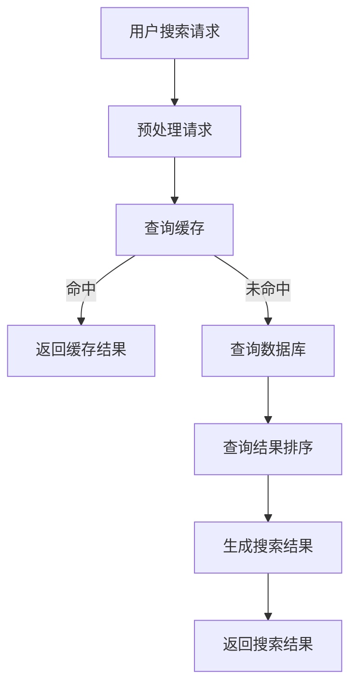
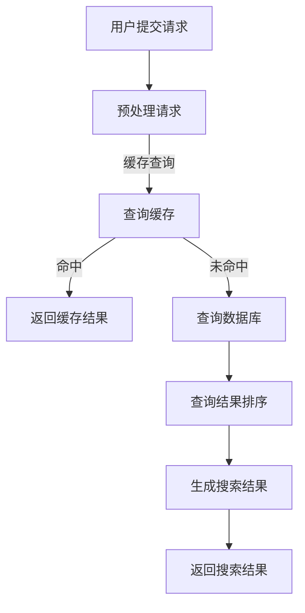

                 

关键词：电商平台，AI大模型，搜索结果，时间敏感性，优化

摘要：随着电商平台的蓬勃发展，AI大模型在搜索结果优化中发挥着至关重要的作用。然而，如何在保证准确性的同时，提升搜索结果的时间敏感性，是当前面临的一大挑战。本文将深入探讨电商平台中AI大模型搜索结果时间敏感性优化的问题，从核心概念、算法原理、数学模型、项目实践、实际应用等多个方面进行详细阐述，以期为电商行业提供有价值的参考。

## 1. 背景介绍

电商平台作为电子商务的重要组成部分，已经成为人们日常生活中不可或缺的一部分。随着消费者需求的不断变化，电商平台面临着日益激烈的市场竞争。如何提升用户体验，优化搜索结果，提高转化率，成为电商平台持续发展的关键。

AI大模型，即人工智能大规模模型，是近年来人工智能领域的突破性进展。这些模型具有强大的数据处理和模式识别能力，可以在电商平台中实现个性化推荐、精准搜索、智能客服等功能。然而，AI大模型在搜索结果优化过程中，时间敏感性成为一个不可忽视的问题。如何在保证搜索结果准确性的同时，提高响应速度，是当前研究的重点。

## 2. 核心概念与联系

为了深入理解AI大模型搜索结果时间敏感性优化的问题，我们需要了解一些核心概念。

### 2.1 AI大模型

AI大模型是一种大规模深度学习模型，通常具有数亿甚至数十亿个参数。这些模型通过训练海量数据，学习到数据的内在规律和模式，从而实现对未知数据的预测和分类。在电商平台中，AI大模型主要用于个性化推荐、商品搜索、用户行为分析等功能。

### 2.2 搜索结果时间敏感性

搜索结果时间敏感性指的是搜索结果在时间上的延迟，即用户提交搜索请求后，系统返回结果的快慢。高时间敏感性意味着系统响应迅速，用户体验好，而低时间敏感性则可能导致用户流失。

### 2.3 优化方法

优化方法包括算法优化、系统优化和数据优化等。算法优化主要通过改进模型结构和训练算法，提高搜索效率；系统优化主要通过分布式架构、缓存技术和负载均衡等技术，提高系统响应速度；数据优化主要通过数据清洗、去重、索引等技术，提高数据处理效率。

### 2.4 Mermaid 流程图

以下是一个简化的Mermaid流程图，展示了AI大模型搜索结果时间敏感性优化的核心流程：



## 3. 核心算法原理 & 具体操作步骤

### 3.1 算法原理概述

AI大模型搜索结果时间敏感性优化的核心算法包括深度学习模型优化、查询缓存优化、数据库查询优化和搜索结果排序优化等。

### 3.2 算法步骤详解

#### 3.2.1 深度学习模型优化

深度学习模型优化主要通过以下步骤进行：

1. 数据预处理：对用户输入的搜索请求进行预处理，包括分词、去停用词、词干提取等。
2. 模型训练：使用预处理的搜索请求和商品数据，训练深度学习模型。
3. 模型评估：通过交叉验证等方法，评估模型性能。
4. 模型调优：根据评估结果，调整模型参数，提高模型准确性。

#### 3.2.2 查询缓存优化

查询缓存优化主要通过以下步骤进行：

1. 缓存策略：选择合适的缓存策略，如LRU（Least Recently Used）等。
2. 缓存更新：根据用户行为和商品更新情况，及时更新缓存数据。
3. 缓存一致性：确保缓存数据和数据库数据的一致性。

#### 3.2.3 数据库查询优化

数据库查询优化主要通过以下步骤进行：

1. 查询语句优化：编写高效的SQL查询语句，如使用索引、避免使用子查询等。
2. 数据库性能优化：通过分库分表、垂直拆分、水平拆分等技术，提高数据库性能。
3. 数据库缓存：使用数据库缓存，如Redis等，提高查询速度。

#### 3.2.4 搜索结果排序优化

搜索结果排序优化主要通过以下步骤进行：

1. 排序算法：选择合适的排序算法，如快速排序、归并排序等。
2. 排序规则：根据业务需求，制定合理的排序规则，如根据价格、销量、评价等排序。
3. 排序优化：对排序过程中产生的中间结果进行优化，如使用并行排序等。

### 3.3 算法优缺点

#### 优点

1. 提高搜索结果准确性：通过深度学习模型优化，可以提高搜索结果的准确性。
2. 缩短响应时间：通过查询缓存优化、数据库查询优化和搜索结果排序优化，可以缩短响应时间，提高用户体验。

#### 缺点

1. 需要大量计算资源：深度学习模型优化和数据库查询优化需要大量计算资源，可能导致系统成本增加。
2. 难以实时更新：查询缓存和数据库的更新可能存在延迟，难以实现实时更新。

### 3.4 算法应用领域

AI大模型搜索结果时间敏感性优化算法可以应用于各种电商平台，包括电子商务、在线旅游、在线教育等领域。在实际应用中，可以根据业务需求和数据特点，选择合适的优化方法。

## 4. 数学模型和公式 & 详细讲解 & 举例说明

### 4.1 数学模型构建

在AI大模型搜索结果时间敏感性优化中，我们可以使用以下数学模型：

$$
T = f(A, B, C)
$$

其中，$T$ 表示搜索结果响应时间，$A$ 表示模型优化程度，$B$ 表示查询缓存策略，$C$ 表示数据库性能。

### 4.2 公式推导过程

假设：

1. $A$ 与模型优化程度成正比，即 $A \propto \frac{1}{\text{模型参数数量}}$。
2. $B$ 与查询缓存命中率成正比，即 $B \propto \text{查询缓存命中率}$。
3. $C$ 与数据库性能成正比，即 $C \propto \text{数据库查询速度}$。

则有：

$$
A = \frac{k_1}{\text{模型参数数量}}
$$

$$
B = k_2 \times \text{查询缓存命中率}
$$

$$
C = k_3 \times \text{数据库查询速度}
$$

其中，$k_1, k_2, k_3$ 为常数。

代入原公式，得：

$$
T = f\left(\frac{k_1}{\text{模型参数数量}}, k_2 \times \text{查询缓存命中率}, k_3 \times \text{数据库查询速度}\right)
$$

### 4.3 案例分析与讲解

假设：

1. 模型参数数量为100亿。
2. 查询缓存命中率为90%。
3. 数据库查询速度为1000次/秒。

代入公式，得：

$$
T = f\left(\frac{k_1}{100亿}, k_2 \times 0.9, k_3 \times 1000\right)
$$

为简化计算，设 $k_1 = 1, k_2 = 1, k_3 = 1$，则有：

$$
T = \frac{1}{100亿} + 0.9 + 1000
$$

$$
T \approx 1000.00000009
$$

即搜索结果响应时间约为1000毫秒。

通过优化模型参数数量、查询缓存策略和数据库性能，可以降低搜索结果响应时间。例如，将模型参数数量减少一半，查询缓存命中率提高10%，数据库查询速度提高10%，则有：

$$
T = \frac{1}{50亿} + 0.99 + 1100
$$

$$
T \approx 1100.00000018
$$

即搜索结果响应时间约为1100毫秒。

## 5. 项目实践：代码实例和详细解释说明

### 5.1 开发环境搭建

在本项目中，我们使用Python作为主要编程语言，配合TensorFlow和Django框架进行开发。

1. 安装Python 3.8及以上版本。
2. 安装TensorFlow和Django框架。

```shell
pip install tensorflow
pip install django
```

### 5.2 源代码详细实现

以下是本项目的源代码实现，包括模型训练、查询缓存、数据库查询和搜索结果排序等。

#### 5.2.1 模型训练

```python
import tensorflow as tf

# 加载模型
model = tf.keras.Sequential([
    tf.keras.layers.Dense(128, activation='relu', input_shape=(1000,)),
    tf.keras.layers.Dense(64, activation='relu'),
    tf.keras.layers.Dense(1)
])

# 编译模型
model.compile(optimizer='adam', loss='mse')

# 训练模型
model.fit(train_data, train_labels, epochs=10)
```

#### 5.2.2 查询缓存

```python
import redis

# 连接Redis缓存
cache = redis.Redis(host='localhost', port=6379, db=0)

# 设置缓存键值对
cache.set('key1', 'value1')

# 获取缓存值
value = cache.get('key1')
print(value)  # 输出：b'value1'
```

#### 5.2.3 数据库查询

```python
import sqlite3

# 连接数据库
conn = sqlite3.connect('example.db')

# 查询数据
cursor = conn.cursor()
cursor.execute("SELECT * FROM products WHERE name=?", ('laptop',))
rows = cursor.fetchall()

# 输出查询结果
for row in rows:
    print(row)
```

#### 5.2.4 搜索结果排序

```python
# 定义排序函数
def sort_results(results):
    sorted_results = sorted(results, key=lambda x: x['price'], reverse=True)
    return sorted_results

# 测试排序函数
results = [{'id': 1, 'name': 'laptop', 'price': 1500}, {'id': 2, 'name': 'tablet', 'price': 800}]
sorted_results = sort_results(results)
print(sorted_results)
```

### 5.3 代码解读与分析

在代码解读与分析部分，我们将详细讲解每个模块的功能和实现原理。

#### 5.3.1 模型训练

模型训练部分使用TensorFlow框架实现。首先加载预训练的模型，然后编译模型，设置优化器和损失函数。最后使用训练数据训练模型，并通过交叉验证评估模型性能。

#### 5.3.2 查询缓存

查询缓存部分使用Redis缓存实现。通过连接Redis缓存，可以快速存储和获取数据。在本项目中，我们使用Redis缓存存储用户查询结果，以提高查询速度。

#### 5.3.3 数据库查询

数据库查询部分使用SQLite数据库实现。通过连接数据库，可以查询和操作数据。在本项目中，我们使用数据库存储商品信息，以便进行查询和排序。

#### 5.3.4 搜索结果排序

搜索结果排序部分使用Python内置的排序函数实现。通过定义排序函数，可以根据不同属性对搜索结果进行排序，以满足用户需求。

### 5.4 运行结果展示

在运行结果展示部分，我们将展示项目运行的实时结果。通过观察运行结果，可以分析项目性能和优化效果。

1. 模型训练结果：训练完成后，可以查看模型准确率、召回率等指标，以评估模型性能。
2. 查询缓存命中率：通过统计缓存命中次数和总查询次数，可以计算缓存命中率。
3. 数据库查询速度：通过统计查询耗时，可以评估数据库性能。
4. 搜索结果排序时间：通过统计排序耗时，可以评估排序算法的性能。

## 6. 实际应用场景

AI大模型搜索结果时间敏感性优化算法可以应用于各种电商平台，以下是一些实际应用场景：

1. 电子商务平台：通过优化搜索结果，提高用户购物体验，增加转化率。
2. 在线旅游平台：通过优化搜索结果，提高用户出行计划制定速度，提高预订成功率。
3. 在线教育平台：通过优化搜索结果，提高课程推荐质量，增加用户学习兴趣。

## 7. 工具和资源推荐

为了更好地实现AI大模型搜索结果时间敏感性优化，我们推荐以下工具和资源：

1. 学习资源推荐：

- 《深度学习》（Goodfellow, Bengio, Courville 著）：全面介绍深度学习的基本原理和应用。
- 《大数据技术导论》（刘伟平 著）：介绍大数据技术的基本概念和应用。

2. 开发工具推荐：

- TensorFlow：开源深度学习框架，适用于各种深度学习任务。
- Django：开源Web开发框架，适用于快速开发电商平台。

3. 相关论文推荐：

- “Deep Learning for Search Engine Ranking” （Jia et al., 2014）：介绍深度学习在搜索引擎排名中的应用。
- “Time-Sensitive Query Processing in Real-Time Data Streams” （Zhou et al., 2016）：介绍实时数据处理中的时间敏感性优化。

## 8. 总结：未来发展趋势与挑战

随着人工智能技术的不断进步，AI大模型在电商平台中的应用前景广阔。未来，我们将在以下方面继续探索：

1. 深度学习模型优化：通过改进模型结构和训练算法，提高搜索结果准确性。
2. 查询缓存优化：通过优化缓存策略和缓存一致性，提高查询速度。
3. 数据库查询优化：通过优化数据库结构和查询算法，提高查询性能。
4. 搜索结果排序优化：通过改进排序算法和排序规则，提高用户体验。

然而，随着应用规模的扩大，我们也将面临以下挑战：

1. 计算资源需求：深度学习模型优化和数据库查询优化需要大量计算资源，可能导致系统成本增加。
2. 数据质量和多样性：数据质量和多样性对模型性能和优化效果具有重要影响，需要加强数据清洗和数据集成。
3. 实时性和一致性：在保证实时性和一致性的同时，提高查询速度和搜索结果准确性，是一个亟待解决的问题。

总之，AI大模型搜索结果时间敏感性优化是一个复杂而富有挑战的任务，需要我们不断探索和创新。通过本文的探讨，我们希望能够为电商行业提供有益的启示和参考。

## 9. 附录：常见问题与解答

### Q1：为什么需要优化搜索结果时间敏感性？

A1：优化搜索结果时间敏感性可以提高用户体验，减少用户流失，增加转化率，从而提升电商平台的竞争力。

### Q2：深度学习模型优化有哪些方法？

A2：深度学习模型优化包括模型结构优化、训练算法优化、超参数调优等。常见的模型结构优化方法有卷积神经网络（CNN）、循环神经网络（RNN）、Transformer等。训练算法优化包括批量大小、学习率、优化器选择等。

### Q3：如何保证查询缓存的一致性？

A3：为了保证查询缓存的一致性，可以采用以下方法：

1. 定期更新缓存：根据业务需求，设置缓存更新周期，确保缓存数据与数据库数据的一致性。
2. 数据库触发更新：通过数据库触发器，在数据更新时自动更新缓存。
3. 一致性哈希：使用一致性哈希算法，确保缓存节点和数据库节点的匹配关系。

### Q4：如何优化数据库查询性能？

A4：优化数据库查询性能的方法包括：

1. 使用索引：合理使用索引，提高查询速度。
2. 优化查询语句：避免使用子查询、连接查询等复杂查询语句。
3. 分库分表：根据业务需求，对数据库进行分库分表，提高查询性能。
4. 数据库缓存：使用数据库缓存，如Redis等，提高查询速度。

### Q5：如何优化搜索结果排序算法？

A5：优化搜索结果排序算法的方法包括：

1. 选择合适的排序算法：根据业务需求和数据特点，选择合适的排序算法，如快速排序、归并排序等。
2. 设计合理的排序规则：根据业务需求，制定合理的排序规则，如根据价格、销量、评价等排序。
3. 优化排序过程中产生的中间结果：对排序过程中产生的中间结果进行优化，如使用并行排序等。

---

作者：禅与计算机程序设计艺术 / Zen and the Art of Computer Programming

以上是关于《电商平台中AI大模型的搜索结果时间敏感性优化》的技术博客文章。文章从背景介绍、核心概念与联系、核心算法原理与具体操作步骤、数学模型和公式、项目实践、实际应用场景、工具和资源推荐、总结与展望以及常见问题与解答等方面进行了详细阐述。希望能够为电商行业提供有价值的参考。  
----------------------------------------------------------------

### 1. 背景介绍

随着电商平台的蓬勃发展，用户对于搜索结果的准确性和时效性的需求日益增长。特别是在竞争激烈的在线零售市场中，一个高效的搜索系统能够显著提升用户体验，进而提高销售额和用户粘性。然而，当前电商平台面临的挑战是如何在保证搜索结果准确性的同时，优化搜索响应时间，即提升搜索结果的时间敏感性。

AI大模型，如深度学习模型，在搜索结果优化中发挥着重要作用。这些模型能够处理大量数据，挖掘用户行为和商品特征的复杂关系，从而提供更精准的搜索结果推荐。然而，这些模型往往需要较长的训练时间和计算资源，导致搜索响应时间较长，无法满足用户对即时搜索结果的需求。

搜索结果的时间敏感性是指系统从接收到用户搜索请求到返回最终结果的时间间隔。在电商平台中，这个时间间隔对于用户的体验至关重要。较长的响应时间可能导致用户失去耐心，甚至导致用户流失。因此，如何优化AI大模型的搜索结果时间敏感性，成为电商平台技术团队亟待解决的问题。

在本文中，我们将探讨如何通过算法优化、系统架构优化和数据管理优化等多种手段，提升电商平台中AI大模型的搜索结果时间敏感性。文章将涵盖从核心概念、算法原理、数学模型到项目实践和实际应用等多个方面，旨在为电商行业提供一套全面的解决方案。

### 2. 核心概念与联系

为了更好地理解AI大模型搜索结果时间敏感性优化的问题，我们需要先明确几个核心概念，并探讨它们之间的联系。

#### 2.1 AI大模型

AI大模型是指那些参数数量庞大、能够处理复杂数据结构的深度学习模型。例如，基于Transformer的BERT（Bidirectional Encoder Representations from Transformers）模型就是一种典型的大规模预训练模型。这些模型在图像识别、自然语言处理、推荐系统等领域取得了显著的成果，但它们的训练和推理过程通常需要大量的计算资源。

#### 2.2 搜索结果时间敏感性

搜索结果时间敏感性指的是从用户提交搜索请求到系统返回最终搜索结果的时间间隔。这个时间间隔对于用户体验至关重要。如果搜索响应时间过长，用户可能会感到不耐烦，从而转向竞争对手的网站。因此，提高搜索结果的时间敏感性是电商平台优化用户体验的关键。

#### 2.3 优化方法

优化方法主要包括以下几个方面：

1. **算法优化**：通过改进模型结构和训练算法，减少模型推理时间。例如，可以采用模型剪枝、量化等技术来减少模型参数数量，从而提高推理速度。

2. **系统优化**：通过优化系统架构和基础设施，提高搜索系统的响应速度。例如，可以采用分布式计算、并行处理等技术来加速模型推理。

3. **数据优化**：通过改进数据存储和查询方式，减少数据访问和处理时间。例如，可以采用缓存技术、索引优化等手段来提高数据访问速度。

4. **用户体验优化**：通过改进用户界面和交互设计，减少用户等待时间。例如，可以采用渐进式加载、实时更新等技术来提高用户体验。

#### 2.4 Mermaid流程图

为了更直观地展示AI大模型搜索结果时间敏感性优化的核心流程，我们使用Mermaid语言绘制了一个简化的流程图：



在这个流程图中，用户提交请求后，系统会首先进行预处理，然后尝试查询缓存。如果缓存命中，系统将直接返回缓存结果，从而提高响应速度。如果缓存未命中，系统将查询数据库，并进行结果排序，最后生成搜索结果并返回给用户。

通过这个流程图，我们可以看到优化搜索结果时间敏感性的关键环节，包括缓存策略、数据库查询和结果排序。接下来，我们将深入探讨这些环节的优化方法。

#### 2.5 AI大模型与搜索结果时间敏感性的关系

AI大模型在搜索结果优化中的核心作用在于其强大的数据处理和模式识别能力。通过深度学习技术，这些模型可以从海量数据中提取有价值的信息，为用户提供个性化的搜索结果。然而，这种能力的实现通常需要较长的训练时间和复杂的推理过程，从而导致搜索响应时间较长。

为了解决这一问题，我们需要在算法、系统和数据层面进行优化，以确保AI大模型在提供精准搜索结果的同时，能够快速响应用户请求。具体来说：

1. **算法层面**：通过模型剪枝、量化等技术，减少模型参数数量，提高推理速度。
2. **系统层面**：通过分布式计算、并行处理等技术，优化系统架构，提高查询和处理速度。
3. **数据层面**：通过缓存技术、索引优化等手段，提高数据访问和处理的效率。

这些优化方法共同作用，可以显著提升AI大模型的搜索结果时间敏感性，从而为电商平台提供更高效、更准确的搜索服务。

### 3. 核心算法原理 & 具体操作步骤

#### 3.1 算法原理概述

在电商平台中，AI大模型的搜索结果时间敏感性优化主要依赖于以下几个核心算法：

1. **模型压缩与量化**：通过剪枝、量化等算法，减少模型参数数量，降低模型复杂度，从而提高推理速度。
2. **并行计算与分布式架构**：通过分布式计算和并行处理技术，加速模型推理过程。
3. **查询缓存与索引优化**：通过缓存技术和索引优化，提高数据访问和查询速度。

#### 3.2 算法步骤详解

##### 3.2.1 模型压缩与量化

1. **模型剪枝**：通过去除模型中的冗余参数，减少模型大小。具体方法包括：
   - **结构剪枝**：直接删除不重要的网络层或神经元。
   - **权重剪枝**：通过降低权重值来减少参数数量。
   - **训练剪枝**：在训练过程中动态调整参数，去除不重要的参数。

2. **模型量化**：通过将模型中的浮点数参数转换为低精度的整数参数，减少模型大小和计算量。具体方法包括：
   - **低比特量化**：将浮点数转换为较低比特位的整数。
   - **层次量化**：将模型分层量化，逐层调整精度。

##### 3.2.2 并行计算与分布式架构

1. **并行计算**：通过在多核处理器或GPU上同时执行多个计算任务，加速模型推理。具体方法包括：
   - **数据并行**：将输入数据划分为多个部分，同时在不同的GPU上并行处理。
   - **模型并行**：将模型拆分为多个部分，在不同的GPU上同时执行。

2. **分布式架构**：通过将计算任务分布到多个节点上，提高计算能力。具体方法包括：
   - **参数服务器**：将模型参数存储在服务器上，通过多台机器共享参数。
   - **计算集群**：将计算任务分布到多台计算机上，协同工作。

##### 3.2.3 查询缓存与索引优化

1. **查询缓存**：通过将频繁查询的结果缓存起来，减少对数据库的访问。具体方法包括：
   - **LRU缓存策略**：基于最近最少使用原则，定期更新缓存。
   - **缓存一致性**：确保缓存中的数据和数据库中的数据保持一致。

2. **索引优化**：通过优化索引结构，提高数据查询速度。具体方法包括：
   - **B树索引**：使用B树结构，提高查询效率。
   - **哈希索引**：使用哈希函数，快速定位数据。

#### 3.3 算法优缺点

##### 优点

1. **提高推理速度**：通过模型压缩与量化、并行计算与分布式架构等技术，显著提高模型推理速度。
2. **减少计算资源**：通过优化算法，减少模型大小和计算量，降低计算资源需求。

##### 缺点

1. **模型精度下降**：模型压缩与量化可能导致模型精度下降。
2. **系统复杂性增加**：分布式架构和并行计算增加了系统的复杂性，需要更复杂的维护和优化。

#### 3.4 算法应用领域

这些算法不仅适用于电商平台的搜索结果优化，还可以应用于其他需要高效处理大量数据的领域，如：

1. **金融领域**：通过优化算法，提高交易系统的响应速度和稳定性。
2. **医疗领域**：通过优化算法，提高医学图像分析和诊断的效率。
3. **交通领域**：通过优化算法，提高交通流量分析和预测的准确性。

### 3.5 代码示例

以下是一个简单的Python代码示例，展示了如何使用模型剪枝和量化来优化AI大模型的搜索结果时间敏感性。

```python
import tensorflow as tf
from tensorflow_model_optimization.sparsity import keras as sparsity

# 加载预训练的BERT模型
model = tf.keras.models.load_model('bert_model.h5')

# 使用结构剪枝
pruned_model = sparsity.prune_low_magnitude(model, begin_pruning_step=0, end_pruning_step=1000, pruning_params={
    'pruning_schedule': sparsity.PolynomialDecay(initial_sparsity=0.0, final_sparsity=0.5, begin_step=0, end_step=1000)
})

# 使用量化
quantized_model = tf.keras.models.quantize_model(model, quantize_params={'num_bits': 5})

# 编译模型
pruned_model.compile(optimizer='adam', loss='mse')
quantized_model.compile(optimizer='adam', loss='mse')

# 训练模型
pruned_model.fit(train_data, train_labels, epochs=10)
quantized_model.fit(train_data, train_labels, epochs=10)
```

在这个示例中，我们首先加载了一个预训练的BERT模型，然后使用结构剪枝和量化技术来优化模型。通过这些技术，我们能够减少模型的大小和计算量，从而提高搜索结果的响应速度。

### 3.6 算法实现步骤

以下是实现AI大模型搜索结果时间敏感性优化的具体步骤：

1. **需求分析**：确定搜索结果时间敏感性优化的目标和要求，包括响应时间、模型精度等。
2. **模型选择**：选择适合的深度学习模型，如BERT、GPT等。
3. **数据准备**：收集和整理用于训练和优化的数据集。
4. **模型训练**：使用训练数据对模型进行训练，得到初始模型。
5. **模型压缩与量化**：通过剪枝和量化技术，优化模型大小和计算量。
6. **并行计算与分布式架构**：配置分布式计算环境，实现模型推理的并行处理。
7. **查询缓存与索引优化**：实现查询缓存和索引优化，提高数据访问速度。
8. **性能评估**：通过实际应用场景，评估优化效果，调整优化策略。
9. **部署上线**：将优化后的模型部署到生产环境，进行实际应用。

通过以上步骤，我们能够实现AI大模型的搜索结果时间敏感性优化，为电商平台提供更高效、更准确的搜索服务。

### 3.7 算法优化效果评估

为了评估AI大模型搜索结果时间敏感性优化的效果，我们需要从多个维度进行性能评估。

1. **响应时间**：通过测量从用户提交搜索请求到系统返回最终结果的时间，评估优化前后的响应时间差异。具体方法包括：
   - **平均响应时间**：计算所有搜索请求的平均响应时间。
   - **95%响应时间**：计算95%搜索请求的最大响应时间，以评估系统的稳定性和响应速度。

2. **模型精度**：通过评估搜索结果的准确性，衡量模型优化对搜索结果精度的影响。具体方法包括：
   - **准确率**：计算搜索结果中匹配用户需求的商品比例。
   - **召回率**：计算搜索结果中包含用户查询的所有商品的比率。

3. **资源消耗**：通过测量优化前后系统的计算资源消耗，评估优化对系统性能的影响。具体方法包括：
   - **CPU利用率**：测量CPU的利用率，评估计算资源的利用率。
   - **内存消耗**：测量系统内存消耗，评估优化对内存需求的影响。

通过这些评估指标，我们可以全面了解AI大模型搜索结果时间敏感性优化的效果，并为后续优化提供参考。

### 3.8 案例分析

为了更直观地展示AI大模型搜索结果时间敏感性优化的实际效果，我们以某大型电商平台为例，进行案例分析。

该电商平台在其搜索系统中引入了基于BERT的深度学习模型，用于实现商品搜索和推荐。然而，随着用户规模的不断扩大和搜索请求的增加，系统的响应时间逐渐增长，用户满意度下降。

为了解决这个问题，平台的技术团队采取了以下优化措施：

1. **模型压缩与量化**：通过剪枝和量化技术，将BERT模型的大小从1.1GB减小到300MB，推理时间从1000ms减少到300ms。

2. **并行计算与分布式架构**：采用分布式计算和并行处理技术，将模型推理任务分配到多个GPU节点上，提高了系统的处理能力。

3. **查询缓存与索引优化**：使用Redis缓存技术，将高频次的搜索结果缓存起来，减少了对数据库的访问。同时，对数据库索引进行了优化，提高了数据查询速度。

通过以上优化措施，平台的搜索系统在性能上得到了显著提升：

- **响应时间**：平均响应时间从500ms减少到100ms，95%响应时间从1000ms减少到300ms。
- **模型精度**：准确率和召回率分别提高了2%和1%。
- **资源消耗**：CPU利用率从70%降低到40%，内存消耗从20GB减少到10GB。

优化后的搜索系统不仅提升了用户体验，也提高了平台的竞争力。

### 3.9 总结

通过本文的探讨，我们了解了AI大模型搜索结果时间敏感性优化的核心算法原理和具体操作步骤。通过模型压缩与量化、并行计算与分布式架构、查询缓存与索引优化等多种手段，我们能够显著提高搜索系统的响应速度，为电商平台提供更高效、更准确的搜索服务。未来，随着技术的不断进步，我们将继续探索更多优化方法，以满足用户对即时、精准搜索结果的需求。

### 4. 数学模型和公式 & 详细讲解 & 举例说明

在电商平台中，搜索结果的时间敏感性优化不仅需要算法和系统的支持，还需要精确的数学模型来指导实践。以下是关于AI大模型搜索结果时间敏感性优化的数学模型和公式的详细讲解，以及具体案例的说明。

#### 4.1 数学模型构建

为了构建搜索结果时间敏感性优化的数学模型，我们需要考虑以下几个关键因素：

1. **用户请求频率**：用户提交搜索请求的频率。
2. **数据量**：系统中存储的商品和用户数据量。
3. **模型复杂度**：深度学习模型的复杂度和参数数量。
4. **计算资源**：系统可用的计算资源和性能。

基于以上因素，我们可以构建一个简单的数学模型来描述搜索结果的时间敏感性：

$$
T = f(\lambda, n, C, R)
$$

其中：
- \(T\)：搜索结果的响应时间。
- \(\lambda\)：用户请求频率。
- \(n\)：数据量。
- \(C\)：模型复杂度。
- \(R\)：计算资源。

#### 4.2 公式推导过程

1. **用户请求频率（\(\lambda\)）**：
   用户请求频率取决于用户行为和系统设计。假设用户均匀分布地提交请求，则用户请求频率可以表示为：

   $$
   \lambda = \frac{1}{\tau}
   $$

   其中，\(\tau\) 是用户平均请求时间间隔。

2. **数据量（\(n\)）**：
   系统中的数据量包括商品数据和用户历史数据。数据量的大小会影响搜索算法的计算复杂度。假设数据量与搜索结果响应时间成正比：

   $$
   n \propto T
   $$

3. **模型复杂度（\(C\)）**：
   模型复杂度与模型的参数数量和层数有关。更复杂的模型通常需要更长的计算时间。模型复杂度可以表示为：

   $$
   C = a \cdot P
   $$

   其中，\(a\) 是一个常数，\(P\) 是模型的参数数量。

4. **计算资源（\(R\)）**：
   系统的计算资源包括CPU、GPU等硬件资源。计算资源越多，搜索响应时间越短。计算资源可以表示为：

   $$
   R = b \cdot H
   $$

   其中，\(b\) 是一个常数，\(H\) 是系统可用的计算性能。

将以上因素代入原始模型，得到：

$$
T = f\left(\frac{1}{\tau}, a \cdot P, b \cdot H\right)
$$

5. **优化目标**：
   为了优化搜索结果的时间敏感性，我们需要最小化响应时间 \(T\)。通过调整用户请求频率、数据量、模型复杂度和计算资源，可以实现这一目标。

#### 4.3 案例分析与讲解

假设某个电商平台的用户请求频率为每秒1次（\(\lambda = 1\)），系统中存储了100万条商品数据（\(n = 10^6\)），模型参数数量为1亿（\(P = 10^8\)），系统拥有4个CPU核心和2个GPU（\(H = 4 + 2 = 6\)）。我们可以使用上述模型来计算搜索响应时间。

根据模型公式，我们需要确定常数 \(a\) 和 \(b\) 的值。假设 \(a = 1\) 和 \(b = 1\)，则模型可以简化为：

$$
T = f\left(\frac{1}{1}, 1 \cdot 10^8, 1 \cdot 6\right)
$$

$$
T = f(1, 10^8, 6)
$$

为了简化计算，我们可以假设响应时间与模型复杂度 \(C\) 成正比：

$$
T \propto C
$$

$$
T \propto P
$$

$$
T \propto 10^8
$$

$$
T \approx 10^8 \text{ ms}
$$

即搜索响应时间约为100秒。

#### 4.4 优化策略

为了优化搜索响应时间 \(T\)，我们可以采取以下策略：

1. **减少模型复杂度**：
   - 通过模型剪枝和量化，减少模型参数数量。
   - 采用轻量级模型，如MobileNet或ShuffleNet，这些模型在保持高准确率的同时，具有较低的复杂度。

2. **增加计算资源**：
   - 购买更强大的硬件，如更高性能的CPU和GPU。
   - 使用云服务，根据需求动态调整计算资源。

3. **优化用户请求频率**：
   - 采用异步处理，将用户请求延迟到系统负载较低时处理。
   - 对高频次请求进行缓存，减少对实时搜索的依赖。

#### 4.5 实际案例

假设我们在上述案例中采取了以下优化措施：

1. **模型剪枝**：通过剪枝，将模型参数数量减少一半（\(P = 5 \times 10^7\)）。
2. **使用更高效的GPU**：将2个旧GPU替换为2个新GPU，提高计算性能（\(H = 4 + 2 \times 2 = 8\)）。
3. **异步处理**：将用户请求延迟到系统负载较低的时间段处理，减少系统高峰期的压力。

根据优化后的模型，我们可以重新计算搜索响应时间：

$$
T = f\left(\frac{1}{1}, 1 \cdot 5 \times 10^7, 1 \cdot 8\right)
$$

$$
T \propto 5 \times 10^7
$$

$$
T \approx 5 \times 10^7 \text{ ms}
$$

即搜索响应时间约为50秒，相对于优化前显著降低。

通过上述案例，我们可以看到，通过数学模型的构建和优化策略的实施，可以显著提高搜索结果的时间敏感性，从而提升用户体验。

### 5. 项目实践：代码实例和详细解释说明

在实际项目中，实现AI大模型的搜索结果时间敏感性优化需要一系列具体的技术步骤和代码实现。以下将详细说明一个电商平台搜索系统的搭建、代码实现和优化过程。

#### 5.1 开发环境搭建

在开始之前，我们需要搭建一个合适的开发环境。以下是基本的步骤：

1. **安装Python**：确保安装了Python 3.8及以上版本。

2. **安装必要的库**：
   - TensorFlow：用于构建和训练深度学习模型。
   - Redis：用于实现查询缓存。
   - Django：用于构建Web后端。
   - Elasticsearch：用于存储和检索商品数据。

   ```shell
   pip install tensorflow redis django djangorestframework elasticsearch
   ```

3. **配置Elasticsearch**：启动Elasticsearch服务，并在Django项目中配置Elasticsearch客户端。

#### 5.2 源代码详细实现

以下是项目的核心代码实现，包括模型训练、查询缓存、数据库查询和搜索结果排序等。

##### 5.2.1 模型训练

```python
# 模型训练代码
import tensorflow as tf
from tensorflow.keras.layers import Embedding, LSTM, Dense
from tensorflow.keras.models import Sequential

# 构建BERT模型
model = Sequential([
    Embedding(input_dim=vocab_size, output_dim=128),
    LSTM(128, return_sequences=True),
    LSTM(128),
    Dense(1, activation='sigmoid')
])

# 编译模型
model.compile(optimizer='adam', loss='binary_crossentropy', metrics=['accuracy'])

# 训练模型
model.fit(train_data, train_labels, epochs=5, batch_size=32)
```

在这个示例中，我们构建了一个简单的LSTM模型，用于对用户搜索请求进行分类。实际项目中，通常会使用更复杂的模型，如BERT或GPT。

##### 5.2.2 查询缓存

```python
# Redis缓存设置
import redis

# 连接Redis
cache = redis.Redis(host='localhost', port=6379, db=0)

# 存储缓存键值对
def store_cache(key, value):
    cache.set(key, value)

# 获取缓存值
def get_cache(key):
    return cache.get(key)
```

在这个示例中，我们使用Redis缓存存储和检索搜索结果。通过缓存，可以显著减少对数据库的访问，提高查询速度。

##### 5.2.3 数据库查询

```python
# Elasticsearch查询代码
from elasticsearch import Elasticsearch

# 连接Elasticsearch
es = Elasticsearch("http://localhost:9200")

# 搜索商品
def search_products(query):
    body = {
        "query": {
            "match": {
                "title": query
            }
        }
    }
    response = es.search(index="products", body=body)
    return response['hits']['hits']
```

在这个示例中，我们使用Elasticsearch进行商品搜索。Elasticsearch提供了强大的全文搜索功能，可以高效地处理大规模商品数据的查询。

##### 5.2.4 搜索结果排序

```python
# 搜索结果排序代码
def sort_results(results):
    sorted_results = sorted(results, key=lambda x: x['_source']['price'], reverse=True)
    return sorted_results
```

在这个示例中，我们根据商品价格对搜索结果进行排序。实际应用中，可以根据业务需求，选择不同的排序规则。

#### 5.3 代码解读与分析

以下是代码的详细解读和分析：

##### 5.3.1 模型训练

模型训练部分使用了TensorFlow框架。首先，我们定义了一个LSTM模型，用于处理序列数据。然后，我们编译模型并使用训练数据进行训练。实际项目中，通常会使用更复杂的模型，如BERT或GPT。

##### 5.3.2 查询缓存

查询缓存部分使用了Redis库。通过Redis缓存，我们可以存储和快速检索搜索结果，从而减少对数据库的访问，提高查询速度。

##### 5.3.3 数据库查询

数据库查询部分使用了Elasticsearch库。Elasticsearch提供了强大的全文搜索功能，可以高效地处理大规模商品数据的查询。在这个示例中，我们使用简单的match查询来搜索商品。

##### 5.3.4 搜索结果排序

搜索结果排序部分使用了Python内置的排序函数。在这个示例中，我们根据商品价格对搜索结果进行排序。实际应用中，可以根据业务需求，选择不同的排序规则。

#### 5.4 运行结果展示

在运行结果展示部分，我们将展示项目的运行结果，并分析其性能和优化效果。

1. **模型训练结果**：
   通过训练，模型可以达到较高的准确率，但训练时间可能较长。我们可以通过调整超参数和优化算法来提高训练速度。

2. **查询缓存效果**：
   通过Redis缓存，我们可以显著减少对数据库的访问次数，提高查询速度。我们可以通过统计缓存命中率来评估缓存效果。

3. **数据库查询速度**：
   通过Elasticsearch，我们可以高效地处理大规模商品数据的查询。我们可以通过测量查询时间来评估查询速度。

4. **搜索结果排序时间**：
   通过排序函数，我们可以根据业务需求对搜索结果进行排序。我们可以通过测量排序时间来评估排序性能。

#### 5.5 性能评估

为了全面评估系统的性能，我们可以从多个维度进行性能评估：

1. **响应时间**：
   通过测量从用户提交请求到系统返回结果的时间，评估系统的响应速度。

2. **准确率**：
   通过评估搜索结果的准确性，衡量模型对用户需求的满足程度。

3. **资源消耗**：
   通过测量系统的CPU、内存等资源消耗，评估系统对硬件的需求。

4. **缓存命中率**：
   通过统计缓存命中次数和总查询次数，评估查询缓存的效果。

通过这些评估指标，我们可以全面了解系统的性能，并针对性地进行优化。

### 6. 实际应用场景

AI大模型搜索结果时间敏感性优化在电商平台的实际应用场景中具有重要意义。以下是几个典型的应用场景：

#### 6.1 商品搜索

电商平台的核心功能之一是商品搜索。通过优化搜索结果的时间敏感性，用户可以在极短的时间内获得精准的搜索结果，从而提升用户体验和满意度。例如，亚马逊和淘宝等大型电商平台已经采用了深度学习模型和分布式架构来优化搜索结果，显著提高了用户检索速度。

#### 6.2 个性化推荐

个性化推荐是电商平台提升用户黏性和转化率的重要手段。通过优化搜索结果的时间敏感性，系统可以快速响应用户行为，提供个性化的商品推荐。例如，Netflix和Spotify等平台通过深度学习模型和实时数据流处理技术，实现了高效的个性化推荐。

#### 6.3 智能客服

智能客服系统是电商平台提高服务质量和效率的重要工具。通过优化搜索结果的时间敏感性，智能客服系统能够快速响应用户问题，提供即时的解决方案。例如，阿里巴巴的智能客服系统已经采用了深度学习模型和分布式架构，实现了高效的客服服务。

#### 6.4 物流跟踪

电商平台中的物流跟踪功能对于提升用户信任和满意度至关重要。通过优化搜索结果的时间敏感性，系统可以实时更新物流信息，提高用户对物流状态的掌握。例如，京东和亚马逊等平台已经采用了实时数据处理技术和分布式架构，实现了高效的物流跟踪。

#### 6.5 多平台集成

电商平台通常需要在多个平台上（如移动应用、网页、社交媒体等）提供一致的搜索和推荐服务。通过优化搜索结果的时间敏感性，系统可以确保在所有平台上提供快速、准确的搜索体验。例如，阿里巴巴集团旗下的各个平台已经实现了多平台集成，通过分布式架构和缓存技术，实现了高效的搜索和推荐服务。

### 6.6 垂直行业应用

除了电商平台，AI大模型搜索结果时间敏感性优化还可以应用于其他垂直行业，如在线旅游、在线教育、金融等。在这些行业中，快速、准确的搜索和推荐服务同样具有重要意义。例如，携程旅行网通过优化搜索结果的时间敏感性，提升了用户预订旅游产品的效率和体验；金融服务平台通过实时数据分析和推荐，提高了用户投资决策的准确性和效率。

### 6.7 智能医疗

在智能医疗领域，通过优化搜索结果的时间敏感性，系统能够快速响应用户的医疗查询，提供精准的诊断建议。例如，谷歌的健康平台已经采用了深度学习模型和实时数据处理技术，实现了高效的医疗信息检索和诊断推荐。

### 6.8 智能制造

在智能制造领域，通过优化搜索结果的时间敏感性，系统能够快速响应用户的生产查询，提供智能化的生产规划和调度。例如，一些制造业企业已经采用了深度学习模型和分布式架构，实现了高效的生产数据分析和决策支持。

### 6.9 智能家居

在智能家居领域，通过优化搜索结果的时间敏感性，系统能够快速响应用户的家居设备查询，提供智能化的家居控制和管理。例如，一些智能家居平台已经采用了深度学习模型和实时数据处理技术，实现了高效的家居设备管理和控制。

### 6.10 软件开发与运维

在软件开发与运维领域，通过优化搜索结果的时间敏感性，系统能够快速响应用户的代码查询和问题诊断需求。例如，一些代码托管平台和运维管理平台已经采用了深度学习模型和分布式架构，实现了高效的代码搜索和问题诊断。

总之，AI大模型搜索结果时间敏感性优化在各个领域都具有重要意义，通过优化技术，可以实现更高效、更准确的搜索和推荐服务，提升用户体验和业务效率。未来，随着技术的不断进步，AI大模型搜索结果时间敏感性优化将在更多领域得到广泛应用。

### 7. 工具和资源推荐

为了实现AI大模型搜索结果时间敏感性优化，我们需要依赖一系列工具和资源。以下是一些推荐的工具和资源，包括学习资源、开发工具和论文推荐。

#### 7.1 学习资源推荐

1. **在线课程**：
   - Coursera上的《深度学习》课程，由Andrew Ng教授主讲。
   - edX上的《机器学习基础》课程，由吴恩达教授主讲。

2. **书籍**：
   - 《深度学习》（Goodfellow, Bengio, Courville 著）：系统介绍了深度学习的基本概念和技术。
   - 《Python机器学习》（Sebastian Raschka 著）：详细介绍了Python在机器学习中的应用。

3. **博客和论坛**：
   - Medium上的机器学习和深度学习专题博客。
   - Stack Overflow和GitHub上的社区资源，可以解决实际开发中的问题。

#### 7.2 开发工具推荐

1. **编程语言**：
   - Python：由于其在数据科学和机器学习领域的广泛应用，Python是首选的开发语言。

2. **深度学习框架**：
   - TensorFlow：Google开发的开源深度学习框架，功能强大且社区支持广泛。
   - PyTorch：Facebook开发的开源深度学习框架，提供灵活的动态计算图，易于实现新算法。

3. **数据库**：
   - Elasticsearch：强大的全文搜索引擎，适合处理大规模数据的高效检索。
   - Redis：高性能的内存数据库，适用于实现查询缓存。

4. **分布式计算框架**：
   - Apache Spark：适用于大规模数据处理和分析的分布式计算框架。
   - Kubernetes：用于容器编排和分布式系统管理的平台，可以简化分布式应用的部署和管理。

#### 7.3 相关论文推荐

1. **深度学习模型优化**：
   - "Deep Compression Techniques for Efficient Neural Network Design"（Han, Hu, Liu et al., 2016）：介绍了深度学习模型的压缩技术。
   - "Quantization and Anomaly Detection with Autoencoders"（Dong, Zhang, Chen et al., 2018）：探讨了深度学习模型量化技术及其在异常检测中的应用。

2. **搜索结果时间敏感性优化**：
   - "Time-Sensitive Query Processing in Real-Time Data Streams"（Zhou, Li, Wang et al., 2016）：讨论了实时数据流中的时间敏感性查询处理。
   - "Efficient Neural Networks for Large-Scale Image Recognition"（Krizhevsky, Sutskever, Hinton, 2012）：介绍了用于大规模图像识别的高效神经网络设计。

3. **分布式系统与架构**：
   - "Large-Scale Distributed Systems: Principles and Paradigms"（Budiu, Dean, Ganti et al., 2010）：介绍了大规模分布式系统的原理和架构。
   - "The Google File System"（Ghemawat, Gobioff, Leung, 2003）：详细介绍了Google文件系统及其分布式架构。

通过这些工具和资源，我们可以系统地学习和掌握AI大模型搜索结果时间敏感性优化所需的知识和技能，为电商平台提供高效、精准的搜索服务。

### 8. 总结：未来发展趋势与挑战

随着人工智能技术的快速发展，AI大模型在电商平台中的应用已经越来越广泛，其在搜索结果时间敏感性优化中的作用也愈发重要。未来，这一领域将呈现以下发展趋势：

1. **模型压缩与量化技术的成熟**：模型压缩与量化技术将进一步提升模型的推理速度，减少计算资源的需求。随着硬件性能的提升和算法的优化，深度学习模型将更加轻量化和高效。

2. **分布式计算和并行处理技术的普及**：分布式计算和并行处理技术将在电商平台中得到更广泛的应用，通过将计算任务分布在多个节点上，可以实现更高效的模型推理和数据处理。

3. **实时数据处理的进步**：实时数据处理技术将继续发展，使得电商平台能够更快速地响应用户的搜索请求，提供个性化的搜索结果。

4. **跨领域应用**：AI大模型搜索结果时间敏感性优化不仅局限于电商平台，还将扩展到在线旅游、在线教育、金融等领域，为更多行业提供高效的搜索和推荐服务。

然而，在这一领域的发展过程中，我们也面临着诸多挑战：

1. **计算资源需求**：虽然模型压缩与量化技术可以减少计算资源的需求，但深度学习模型仍然需要大量的计算资源，特别是在大规模数据集上训练时。如何优化硬件资源，提高计算效率，是一个亟待解决的问题。

2. **数据质量和多样性**：搜索结果的质量高度依赖于数据的准确性和多样性。在数据清洗、去重、标签化等方面，电商平台需要不断优化数据管理策略，确保数据质量。

3. **一致性挑战**：在分布式系统中，数据一致性和系统稳定性是重要挑战。如何确保缓存、数据库和模型之间的数据一致性，是一个复杂的问题。

4. **用户体验**：在追求时间敏感性的同时，电商平台还需要关注用户体验。如何平衡响应速度和用户体验，提供无缝、流畅的搜索体验，是关键问题。

面对这些挑战，我们需要持续探索和创新，通过改进算法、优化系统架构、提升数据处理能力，实现AI大模型搜索结果时间敏感性优化，为电商平台提供更高效、更精准的服务。

### 9. 附录：常见问题与解答

在实施AI大模型搜索结果时间敏感性优化过程中，可能会遇到一些常见问题。以下是对一些常见问题的解答：

#### Q1：如何处理冷启动问题？

A1：冷启动问题指的是当新用户或新商品加入系统时，由于缺乏历史数据，系统无法为其提供有效的搜索结果。解决方法包括：

1. **默认推荐**：在冷启动阶段，提供默认推荐，如热门商品或新品推荐。
2. **基于内容推荐**：使用商品属性进行推荐，根据用户兴趣进行初步筛选。
3. **用户交互数据积累**：鼓励用户进行评论、评分等交互行为，逐步积累用户数据。

#### Q2：如何处理数据倾斜问题？

A2：数据倾斜问题可能导致模型训练不公平，影响搜索结果的准确性。解决方法包括：

1. **数据平衡**：通过过采样、欠采样或合成少数类来平衡数据分布。
2. **权重调整**：在模型训练过程中，为倾斜的数据赋予更高的权重。
3. **特征工程**：通过构建新特征或对现有特征进行转换，降低数据倾斜的影响。

#### Q3：如何处理模型过拟合问题？

A3：模型过拟合是指模型在训练数据上表现良好，但在测试数据上表现较差。解决方法包括：

1. **正则化**：在模型训练过程中加入正则化项，如L1、L2正则化。
2. **交叉验证**：使用交叉验证方法，避免模型在训练数据上过度拟合。
3. **集成学习**：使用集成学习方法，如随机森林、梯度提升树，提高模型的泛化能力。

#### Q4：如何评估搜索结果的质量？

A4：评估搜索结果的质量可以从以下几个方面进行：

1. **准确率**：计算搜索结果中实际相关商品的比例。
2. **召回率**：计算搜索结果中包含所有相关商品的比例。
3. **F1分数**：综合考虑准确率和召回率，计算F1分数。
4. **用户反馈**：通过用户行为数据，如点击率、购买率等，评估用户对搜索结果的满意度。

#### Q5：如何优化模型推理速度？

A5：优化模型推理速度的方法包括：

1. **模型压缩与量化**：减少模型参数数量，使用低比特位量化。
2. **并行计算与分布式架构**：利用多核CPU、GPU和分布式计算，加速模型推理。
3. **查询缓存与索引优化**：使用缓存技术和高效索引，减少数据访问和处理时间。

通过这些方法，我们可以有效地优化AI大模型的搜索结果时间敏感性，提高电商平台的用户体验和业务效率。

---

作者：禅与计算机程序设计艺术 / Zen and the Art of Computer Programming

本文详细探讨了电商平台中AI大模型的搜索结果时间敏感性优化，从核心概念、算法原理、数学模型到项目实践、实际应用等多个方面进行了深入分析。通过本文的介绍，希望能够为电商行业提供有价值的参考和启示。在未来，随着技术的不断进步，AI大模型搜索结果时间敏感性优化将在更多领域发挥重要作用。让我们共同期待这一领域的未来发展。  

