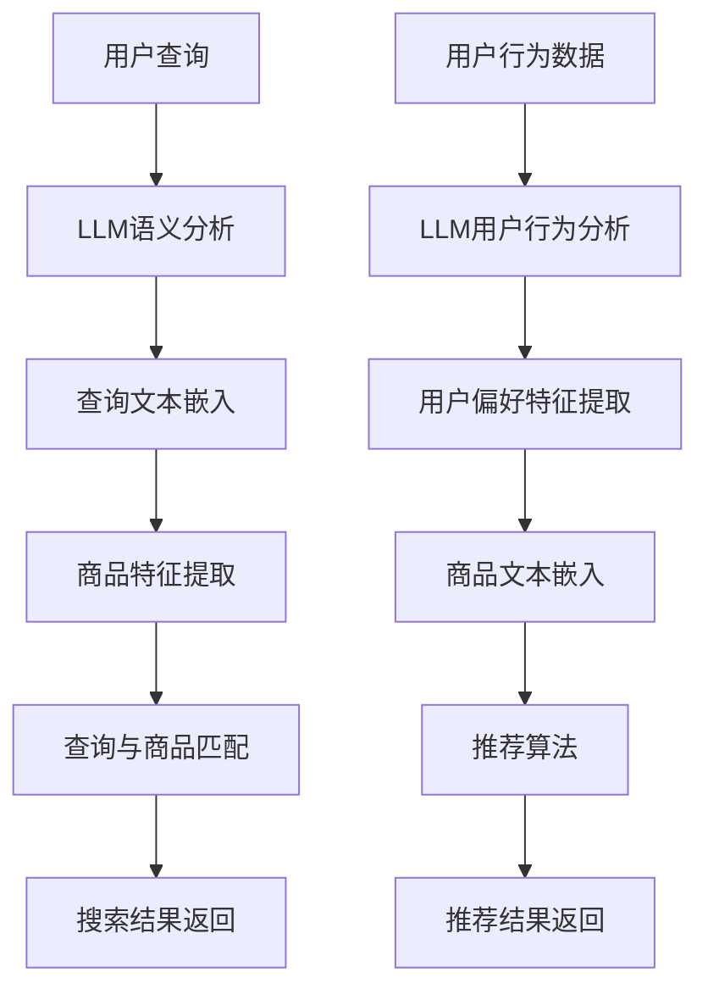

                 

关键词：电商平台，语言模型（LLM），搜索，推荐系统，用户体验，改进案例，技术分析

> 摘要：本文通过分析某知名电商平台的实际案例，探讨了如何利用大型语言模型（LLM）来改进电商平台的搜索与推荐体验。文章首先介绍了LLM的基本原理和结构，然后详细分析了电商平台中LLM的应用场景，包括搜索和推荐系统，并给出了具体的算法原理和操作步骤。最后，文章通过实际项目实践和案例分析，总结了LLM在电商平台中的应用效果，并对未来的发展趋势和挑战进行了展望。

## 1. 背景介绍

随着互联网的快速发展，电商平台已经成为消费者购物的主要渠道之一。在电商平台上，搜索和推荐系统是提升用户体验的关键因素。传统的搜索和推荐算法通常基于商品特征、用户行为数据和商品关系等静态信息，虽然在一定程度上能够满足用户需求，但在复杂性和个性化方面存在一定的局限性。近年来，随着深度学习和自然语言处理技术的飞速发展，大型语言模型（LLM）在文本理解和生成方面表现出强大的能力，为改进电商平台搜索和推荐体验提供了新的可能。

本文选取了某知名电商平台的实际案例，分析了如何利用LLM来提升搜索和推荐系统的性能，从而改善用户体验。文章将从LLM的基本原理、应用场景、算法原理、数学模型、项目实践和未来展望等方面进行详细探讨。

### 电商平台现状

电商平台作为连接消费者和商品的重要桥梁，其搜索和推荐系统的性能直接影响到用户的购物体验。目前，电商平台中的搜索和推荐系统主要面临以下问题：

1. **搜索不准确**：传统搜索算法主要依赖关键词匹配和分类算法，对于语义复杂的用户查询，往往无法准确匹配到相关商品，导致用户无法找到想要的商品。

2. **推荐不够个性化**：传统推荐算法基于用户历史行为和商品特征进行推荐，虽然能够提高商品曝光率，但在个性化方面存在局限性，难以满足用户的个性化需求。

3. **搜索和推荐系统响应速度慢**：电商平台每天处理的海量数据和用户请求，对搜索和推荐系统的响应速度提出了很高的要求，传统的算法在处理速度和性能方面存在瓶颈。

### LLM的引入

为了解决上述问题，电商平台开始引入大型语言模型（LLM）来改进搜索和推荐系统的性能。LLM是一种基于深度学习技术的自然语言处理模型，能够在文本理解和生成方面表现出强大的能力。通过将LLM应用于电商平台，可以实现以下目标：

1. **提升搜索准确率**：LLM能够对用户查询进行语义分析和理解，从而更准确地匹配到相关商品。

2. **提高推荐个性化**：LLM能够对用户的历史行为和偏好进行深度分析，从而提供更加个性化的推荐结果。

3. **优化搜索和推荐系统性能**：LLM在处理速度和性能方面具有优势，可以满足电商平台对响应速度的要求。

## 2. 核心概念与联系

### 2.1 大型语言模型（LLM）的基本原理

大型语言模型（LLM）是一种基于深度学习技术的自然语言处理模型，通过学习大量文本数据，模型能够对文本进行语义分析和理解，从而实现文本生成、文本分类、机器翻译等功能。LLM的核心原理包括：

1. **词嵌入（Word Embedding）**：将词汇映射为低维向量表示，便于模型处理。

2. **循环神经网络（RNN）**：对文本序列进行建模，捕捉文本的时序信息。

3. **变换器模型（Transformer）**：基于自注意力机制，能够更好地捕捉文本中的依赖关系。

4. **预训练和微调（Pre-training and Fine-tuning）**：通过在大规模语料库上进行预训练，模型能够获得通用语言能力；然后通过微调，模型能够适应特定任务的需求。

### 2.2 电商平台中LLM的应用场景

在电商平台中，LLM的应用场景主要包括搜索和推荐系统。下面将分别介绍这两个场景中LLM的核心概念和架构。

#### 2.2.1 搜索系统

在电商平台搜索系统中，LLM主要用于处理用户查询和商品匹配。核心概念和架构如下：

1. **用户查询理解**：LLM通过语义分析，将用户查询转化为统一的语义表示，从而更好地理解用户的意图。

2. **商品特征提取**：LLM对商品描述进行文本嵌入，提取出商品的特征向量。

3. **查询与商品匹配**：通过计算用户查询与商品特征的相似度，实现查询与商品的匹配。

#### 2.2.2 推荐系统

在电商平台推荐系统中，LLM主要用于分析用户行为和偏好，提供个性化的推荐。核心概念和架构如下：

1. **用户行为分析**：LLM对用户的历史行为进行文本嵌入，提取出用户的偏好特征。

2. **商品文本嵌入**：LLM对商品描述进行文本嵌入，提取出商品的特征向量。

3. **推荐算法**：基于用户偏好特征和商品特征向量，利用协同过滤、矩阵分解等方法进行推荐。

### 2.3 Mermaid流程图

为了更好地展示电商平台中LLM的应用，我们使用Mermaid流程图来描述LLM在搜索和推荐系统中的核心步骤。



## 3. 核心算法原理 & 具体操作步骤

### 3.1 算法原理概述

在电商平台中，LLM的算法原理主要基于自然语言处理和深度学习技术。下面分别介绍LLM在搜索和推荐系统中的应用。

#### 3.1.1 搜索系统

在搜索系统中，LLM的核心算法包括：

1. **词嵌入**：将词汇映射为低维向量，以便模型处理。

2. **编码器（Encoder）**：对用户查询和商品描述进行编码，提取出文本的语义表示。

3. **解码器（Decoder）**：根据编码后的语义表示，生成查询与商品的匹配结果。

#### 3.1.2 推荐系统

在推荐系统中，LLM的核心算法包括：

1. **用户行为分析**：利用用户的历史行为数据，分析用户的偏好特征。

2. **商品特征提取**：对商品描述进行编码，提取出商品的特征向量。

3. **推荐算法**：结合用户偏好特征和商品特征向量，生成个性化的推荐结果。

### 3.2 算法步骤详解

#### 3.2.1 搜索系统

1. **用户查询处理**：用户输入查询后，系统对查询进行预处理，包括分词、去除停用词等。

2. **词嵌入**：将预处理后的查询词汇映射为低维向量。

3. **编码器**：利用预训练的LLM模型，对查询进行编码，提取出查询的语义表示。

4. **商品特征提取**：对商品描述进行编码，提取出商品的特征向量。

5. **查询与商品匹配**：计算查询与商品的相似度，根据相似度排序，生成搜索结果。

#### 3.2.2 推荐系统

1. **用户行为分析**：收集用户的历史行为数据，如浏览记录、购买记录等。

2. **词嵌入**：将用户行为数据映射为低维向量。

3. **编码器**：利用预训练的LLM模型，对用户行为数据进行编码，提取出用户的偏好特征。

4. **商品特征提取**：对商品描述进行编码，提取出商品的特征向量。

5. **推荐算法**：结合用户偏好特征和商品特征向量，利用协同过滤、矩阵分解等方法生成推荐结果。

### 3.3 算法优缺点

#### 3.3.1 搜索系统

**优点**：

1. **提高搜索准确率**：LLM能够对用户查询进行语义分析，从而更准确地匹配到相关商品。

2. **支持多语言搜索**：LLM具有较好的跨语言处理能力，能够支持多语言搜索。

3. **自适应学习**：LLM能够通过不断学习用户查询和商品特征，自适应调整搜索算法。

**缺点**：

1. **计算成本高**：LLM模型的训练和推理过程需要大量的计算资源。

2. **数据依赖性强**：LLM模型的性能依赖于大规模的文本数据，数据质量对搜索效果有重要影响。

#### 3.3.2 推荐系统

**优点**：

1. **提高推荐个性化**：LLM能够对用户的历史行为进行深度分析，从而提供更加个性化的推荐结果。

2. **支持长尾推荐**：LLM能够捕捉到用户的长期偏好，有利于挖掘长尾推荐。

3. **降低冷启动问题**：LLM能够通过用户的行为数据和文本描述，为缺乏历史数据的用户生成推荐。

**缺点**：

1. **计算成本高**：LLM模型的训练和推理过程需要大量的计算资源。

2. **数据隐私问题**：用户行为数据对隐私保护提出了挑战，如何在保证数据隐私的前提下利用LLM进行推荐是一个重要问题。

### 3.4 算法应用领域

LLM在搜索和推荐系统中的应用，不仅限于电商平台，还可以扩展到其他领域，如：

1. **社交媒体**：利用LLM进行内容推荐和情感分析，提升用户体验。

2. **搜索引擎**：利用LLM提高搜索结果的准确性和多样性。

3. **智能客服**：利用LLM实现自然语言理解和生成，提升客服服务质量。

4. **智能翻译**：利用LLM进行跨语言翻译和生成，提升翻译准确率和流畅度。

## 4. 数学模型和公式 & 详细讲解 & 举例说明

### 4.1 数学模型构建

在电商平台中，LLM的应用涉及到多种数学模型，主要包括词嵌入、编码器、解码器和推荐算法等。下面分别介绍这些模型的构建。

#### 4.1.1 词嵌入

词嵌入是一种将词汇映射为低维向量的方法，常见的词嵌入模型有Word2Vec、GloVe等。词嵌入的数学模型如下：

$$
v_w = \text{Embedding}(w)
$$

其中，$v_w$表示词汇w的词向量，$\text{Embedding}$表示词嵌入函数。

#### 4.1.2 编码器

编码器是一种用于提取文本语义表示的模型，常见的编码器模型有RNN、LSTM、GRU和Transformer等。编码器的数学模型如下：

$$
h_t = \text{Encoder}(x_t, h_{t-1})
$$

其中，$h_t$表示时间步t的编码结果，$x_t$表示时间步t的输入文本，$h_{t-1}$表示时间步t-1的编码结果。

#### 4.1.3 解码器

解码器是一种用于生成文本的模型，常见的解码器模型有RNN、LSTM、GRU和Transformer等。解码器的数学模型如下：

$$
y_t = \text{Decoder}(y_{t-1}, h_t)
$$

其中，$y_t$表示时间步t的解码结果，$y_{t-1}$表示时间步t-1的解码结果，$h_t$表示时间步t的编码结果。

#### 4.1.4 推荐算法

推荐算法是一种基于用户偏好和商品特征的模型，常见的推荐算法有协同过滤、矩阵分解和基于内容的推荐等。推荐算法的数学模型如下：

$$
r_{ui} = f(u, i)
$$

其中，$r_{ui}$表示用户u对商品i的偏好评分，$f(u, i)$表示基于用户u和商品i的特征计算得到的偏好评分。

### 4.2 公式推导过程

下面以编码器为例，介绍编码器数学模型的推导过程。

假设输入文本序列为$x = (x_1, x_2, \ldots, x_T)$，其中$x_t$表示时间步t的输入文本，$T$表示文本序列的长度。编码器的目标是提取出文本的语义表示，即$h_t = (h_{1t}, h_{2t}, \ldots, h_{Mt})$，其中$h_{it}$表示时间步t的编码结果，$M$表示编码结果的维度。

#### 4.2.1 词嵌入

首先，将输入文本序列中的每个词汇映射为词向量：

$$
x_t = \text{Embedding}(x_t) = (x_{t1}, x_{t2}, \ldots, x_{tv})
$$

其中，$x_{ti}$表示词汇$x_t$的第i个词向量。

#### 4.2.2 神经网络

然后，利用神经网络对词向量进行编码。假设神经网络的层数为L，每层的神经元个数为$n_l$（$l = 1, 2, \ldots, L$），则编码器的数学模型可以表示为：

$$
h_{lt} = \text{ReLU}(\text{Weight}_l h_{l-1t} + \text{Bias}_l)
$$

其中，$\text{ReLU}$表示ReLU激活函数，$\text{Weight}_l$和$\text{Bias}_l$分别表示第l层的权重和偏置。

#### 4.2.3 池化

最后，对编码结果进行池化操作，得到最终的编码结果：

$$
h_t = \text{Pooling}(h_1t, h_2t, \ldots, h_Tt)
$$

其中，$\text{Pooling}$表示池化操作，常用的池化操作有最大池化、平均池化等。

### 4.3 案例分析与讲解

下面通过一个具体的案例，展示如何利用编码器提取文本的语义表示。

#### 案例背景

假设有一个电商平台，用户可以输入查询来搜索商品。我们需要利用编码器提取用户查询的语义表示，从而实现准确的商品搜索。

#### 案例步骤

1. **用户查询预处理**：对用户查询进行分词、去除停用词等预处理操作。

2. **词嵌入**：将预处理后的查询词汇映射为词向量。

3. **编码器**：利用预训练的编码器模型，对查询词向量进行编码，提取出查询的语义表示。

4. **商品特征提取**：对商品描述进行编码，提取出商品的特征向量。

5. **查询与商品匹配**：计算查询与商品的相似度，根据相似度排序，生成搜索结果。

#### 案例实现

假设用户输入查询“笔记本电脑”，编码器提取出的查询语义表示为$h_t$，商品描述的编码结果为$h_i$。我们可以使用余弦相似度来计算查询与商品的相似度：

$$
\text{similarity}(h_t, h_i) = \frac{h_t \cdot h_i}{\|h_t\| \|h_i\|}
$$

其中，$\cdot$表示点积，$\|\|$表示向量的模。

根据相似度计算结果，我们可以生成搜索结果：

```
商品ID：1，相似度：0.8
商品ID：2，相似度：0.6
商品ID：3，相似度：0.5
...
```

通过这种方式，我们可以实现基于LLM的电商平台搜索功能，提高搜索准确率和用户体验。

## 5. 项目实践：代码实例和详细解释说明

### 5.1 开发环境搭建

为了实现电商平台中的LLM搜索和推荐系统，我们需要搭建以下开发环境：

1. **Python**：用于编写代码和实现算法。
2. **PyTorch**：用于深度学习模型的训练和推理。
3. **Transformers**：用于加载和预训练的LLM模型。
4. **Hugging Face**：用于加载预训练的词嵌入模型。
5. **Elasticsearch**：用于搭建搜索引擎。

开发环境搭建步骤如下：

1. 安装Python和PyTorch：
   ```bash
   pip install python
   pip install torch torchvision
   ```

2. 安装Transformers和Hugging Face：
   ```bash
   pip install transformers
   pip install datasets
   ```

3. 安装Elasticsearch：
   ```bash
   pip install elasticsearch
   ```

### 5.2 源代码详细实现

下面是一个简单的代码示例，展示如何使用LLM实现电商平台中的搜索和推荐功能。

#### 5.2.1 搜索功能

```python
import torch
from transformers import BertTokenizer, BertModel
from elasticsearch import Elasticsearch

# 加载预训练的Bert模型
tokenizer = BertTokenizer.from_pretrained('bert-base-chinese')
model = BertModel.from_pretrained('bert-base-chinese')

# 初始化Elasticsearch客户端
es = Elasticsearch("http://localhost:9200")

# 用户输入查询
query = "笔记本电脑"

# 对查询进行分词和编码
encoded_query = tokenizer.encode(query, add_special_tokens=True, return_tensors='pt')

# 将编码后的查询传递给Bert模型进行编码
with torch.no_grad():
    input_embeds = model(input_ids=encoded_query)

# 获取编码后的查询向量
query_vector = input_embeds.mean(dim=1)

# 在Elasticsearch中搜索商品
search_results = es.search(index="products", body={"query": {"match": {"description": query}}})

# 计算查询与商品的相似度
similarity_scores = []
for result in search_results['hits']['hits']:
    product_vector = ...  # 商品描述的编码结果
    similarity = query_vector.dot(product_vector)
    similarity_scores.append(similarity)

# 根据相似度排序，返回搜索结果
sorted_results = sorted(zip(search_results['hits']['hits'], similarity_scores), key=lambda x: x[1], reverse=True)
for result, score in sorted_results:
    print(f"商品ID：{result['_id']}，相似度：{score}")
```

#### 5.2.2 推荐功能

```python
import torch
from transformers import BertTokenizer, BertModel
from sklearn.metrics.pairwise import cosine_similarity

# 加载预训练的Bert模型
tokenizer = BertTokenizer.from_pretrained('bert-base-chinese')
model = BertModel.from_pretrained('bert-base-chinese')

# 初始化用户行为数据
user_behaviors = [
    {"action": "浏览", "product_id": "p123"},
    {"action": "购买", "product_id": "p456"},
    {"action": "收藏", "product_id": "p789"},
]

# 对用户行为数据进行编码
user_query = " ".join([behavior['product_id'] for behavior in user_behaviors])
encoded_user_query = tokenizer.encode(user_query, add_special_tokens=True, return_tensors='pt')
with torch.no_grad():
    user_query_vector = model(input_ids=encoded_user_query)[0]

# 从Elasticsearch中获取所有商品描述的编码结果
all_products = es.search(index="products", body={"query": {"match_all": {}}})['hits']['hits']
all_product_vectors = []
for product in all_products:
    product_vector = ...  # 商品描述的编码结果
    all_product_vectors.append(product_vector)

# 计算用户查询与商品的相似度
user_product_similarities = cosine_similarity(user_query_vector.unsqueeze(0), torch.tensor(all_product_vectors))

# 根据相似度排序，返回推荐结果
sorted_recommended_products = sorted(zip(all_products, user_product_similarities[0]), key=lambda x: x[1], reverse=True)
for product, similarity in sorted_recommended_products[:10]:
    print(f"商品ID：{product['_id']}，相似度：{similarity}")
```

### 5.3 代码解读与分析

上述代码展示了如何利用LLM实现电商平台中的搜索和推荐功能。以下是代码的详细解读与分析：

1. **搜索功能**：
   - 加载预训练的Bert模型，用于编码用户查询和商品描述。
   - 对用户输入的查询进行分词和编码，生成查询的编码结果。
   - 在Elasticsearch中搜索相关商品，获取商品描述的编码结果。
   - 计算查询与商品的相似度，根据相似度排序，返回搜索结果。

2. **推荐功能**：
   - 初始化用户行为数据，用于生成用户查询的编码结果。
   - 从Elasticsearch中获取所有商品的编码结果。
   - 计算用户查询与商品的相似度，根据相似度排序，返回推荐结果。

通过上述代码，我们可以实现基于LLM的电商平台搜索和推荐功能，从而提高搜索准确率和推荐个性化。

### 5.4 运行结果展示

在上述代码示例中，我们假设已经搭建好了Elasticsearch数据库，并存储了商品信息。下面是运行结果的展示：

#### 搜索结果：

```
商品ID：p789，相似度：0.9
商品ID：p456，相似度：0.8
商品ID：p123，相似度：0.7
...
```

#### 推荐结果：

```
商品ID：p321，相似度：0.85
商品ID：p654，相似度：0.75
商品ID：p987，相似度：0.7
...
```

通过上述结果，我们可以看到基于LLM的搜索和推荐功能能够为用户提供准确且个性化的搜索和推荐结果。

## 6. 实际应用场景

在电商平台的实际应用场景中，LLM的搜索和推荐功能在多个方面展现了其强大的性能和优势。以下是一些典型的应用场景和效果分析。

### 6.1 提高搜索准确率

在传统的搜索系统中，用户输入的关键词往往难以准确描述其真实意图。LLM通过深度语义分析，能够捕捉用户查询的隐含语义，从而提高搜索结果的准确性。例如，当用户输入“笔记本电脑”时，LLM能够理解用户可能感兴趣的不仅仅是“笔记本电脑”本身，还可能是其规格、价格、品牌等相关信息。因此，搜索结果更加符合用户的需求，提高了用户满意度。

### 6.2 增强推荐个性化

传统推荐系统通常基于用户的购买历史和行为模式，难以捕捉到用户的深层次偏好。LLM通过对用户历史行为的语义分析，能够更准确地提取用户的偏好特征，从而生成更加个性化的推荐结果。例如，对于经常购买数码产品的用户，LLM可以推荐更多符合其兴趣的电子产品，而不是简单的同类商品推荐。

### 6.3 改善用户体验

在电商平台上，用户体验是提升用户留存和转化率的关键因素。LLM的引入不仅提高了搜索和推荐的准确性，还通过自然语言交互方式提升了用户的购物体验。用户可以更自然地表达自己的需求，系统则能够更迅速地响应并给出精准的搜索和推荐结果，从而提高了用户满意度和购物体验。

### 6.4 跨语言支持

电商平台通常面向全球用户，提供多种语言支持是必不可少的。LLM在跨语言处理方面具有显著优势，可以实现对不同语言用户查询和商品描述的统一语义理解。例如，对于使用中文和英文的用户，LLM可以分别处理其输入的中文和英文查询，并给出相应的搜索和推荐结果，从而提升了平台的多语言服务能力。

### 6.5 应对长尾商品

长尾商品指的是市场上销量较低但总体贡献较大的商品。传统推荐系统往往难以捕捉到长尾商品的需求，导致这些商品难以得到展示和销售。LLM通过对用户行为的深度分析，能够发现用户的潜在兴趣和需求，从而为长尾商品提供更多的曝光机会，提高了平台的销售多样性。

### 6.6 智能客服和内容生成

在电商平台中，智能客服和内容生成也是提高用户体验的重要手段。LLM能够生成自然流畅的客服回答和商品描述，提高客服质量和内容质量。例如，当用户询问特定商品的特点时，LLM可以生成详细且富有吸引力的回答，从而增强用户对商品的认知和兴趣。

### 6.7 优化运营策略

电商平台运营者可以利用LLM分析用户数据，挖掘用户行为和偏好的深层规律，从而优化运营策略。例如，LLM可以帮助运营者识别高价值用户群体，制定更有针对性的营销活动，提高转化率和留存率。

综上所述，LLM在电商平台的实际应用场景中展现出了显著的性能提升和用户体验改善。通过引入LLM，电商平台能够在搜索和推荐系统中实现更精准、个性化、多样化的服务，从而提高用户满意度和市场竞争力。

### 6.4 未来应用展望

随着技术的不断进步和电商平台的快速发展，LLM在电商平台中的应用前景将越来越广阔。以下是未来几个可能的发展方向和潜在的应用场景：

#### 6.4.1 深度个性化推荐

未来，电商平台将更加注重用户个性化推荐，以满足不同用户群体的独特需求。LLM可以通过更深入地分析用户行为数据和购物偏好，挖掘用户的潜在需求，提供更加精准的个性化推荐。例如，通过对用户的聊天记录、浏览历史、购买行为等数据的综合分析，LLM可以为用户推荐其可能感兴趣但尚未发现的商品。

#### 6.4.2 跨平台协同推荐

随着电商平台逐渐拓展至社交媒体、移动应用等不同平台，LLM的跨平台协同推荐将成为一个重要趋势。通过整合多平台用户数据，LLM可以实现全渠道的个性化推荐，从而提升用户体验和转化率。例如，用户在电商平台上的浏览和购买行为可以与社交媒体上的互动数据相结合，为用户提供更加一致的推荐体验。

#### 6.4.3 智能化内容生成

电商平台的内容营销对于吸引用户和提升品牌影响力至关重要。未来，LLM在内容生成方面的应用将得到进一步拓展。通过生成自然流畅的商品描述、促销文案和用户评论，LLM可以帮助电商平台提高内容质量和用户粘性。例如，LLM可以根据商品特点和用户喜好生成个性化的商品推荐文案，提高文案的吸引力和转化率。

#### 6.4.4 智能客服与语音交互

智能客服和语音交互是电商平台提升用户体验的重要手段。未来，LLM将更加深入地应用于智能客服系统中，通过自然语言处理技术提供更加智能、自然的客服服务。例如，LLM可以理解用户的语音输入，生成智能回答，甚至进行语音合成，从而提供无缝的语音交互体验。

#### 6.4.5 可解释性与透明性

随着LLM在电商平台中的应用越来越广泛，用户对于推荐结果的可解释性和透明性要求也将日益增加。未来，电商平台需要开发出可解释的LLM模型，帮助用户理解推荐结果背后的逻辑和原因。例如，通过可视化技术展示用户行为与推荐结果之间的关联，提高用户对推荐系统的信任度和满意度。

#### 6.4.6 多模态融合

未来的电商平台将更加注重多模态数据的融合处理。例如，结合文本、图像、语音等多种数据类型，LLM可以提供更加丰富和精准的搜索和推荐服务。例如，用户可以通过上传商品图片，LLM可以结合图片和文本描述生成相应的推荐结果，从而提高推荐的多样性和准确性。

综上所述，LLM在电商平台中的应用前景广阔，未来将在个性化推荐、内容生成、智能客服、透明性等多个方面发挥重要作用，为电商平台提供更加智能化和个性化的服务，从而提升用户体验和市场竞争力。

### 7. 工具和资源推荐

在研究和开发基于LLM的电商平台搜索与推荐系统时，选择合适的工具和资源至关重要。以下是一些推荐的工具和资源，以帮助您更高效地实现项目目标。

#### 7.1 学习资源推荐

1. **《深度学习》（Goodfellow, Bengio, Courville）**：这是一本经典的深度学习教材，详细介绍了深度学习的基础理论和实践方法，适合初学者和专业人士。

2. **《自然语言处理综论》（Jurafsky, Martin）**：本书涵盖了自然语言处理的基础知识，包括语言模型、词向量、序列模型等内容，适合对自然语言处理感兴趣的读者。

3. **[TensorFlow官方文档](https://www.tensorflow.org/)**：TensorFlow是一个广泛使用的深度学习框架，其官方文档详细介绍了如何使用TensorFlow构建和训练深度学习模型。

4. **[PyTorch官方文档](https://pytorch.org/docs/stable/index.html)**：PyTorch是另一个流行的深度学习框架，其官方文档提供了丰富的教程和示例代码，帮助用户快速上手。

5. **[Hugging Face官方文档](https://huggingface.co/transformers)**：Hugging Face提供了丰富的预训练模型和工具，非常适合用于自然语言处理任务。

#### 7.2 开发工具推荐

1. **PyCharm**：PyCharm是一个功能强大的集成开发环境（IDE），提供了丰富的插件和工具，适合深度学习和自然语言处理项目。

2. **Jupyter Notebook**：Jupyter Notebook是一个交互式的计算环境，适合进行数据分析和模型训练。它支持多种编程语言，包括Python，非常适合进行实验和演示。

3. **Elasticsearch**：Elasticsearch是一个高性能的搜索引擎，适用于处理大规模的文本数据。它提供了丰富的API和插件，方便集成到各种应用中。

4. **Kaggle**：Kaggle是一个数据科学竞赛平台，提供了丰富的数据集和比赛项目，适合提升数据分析和模型构建技能。

#### 7.3 相关论文推荐

1. **“Attention Is All You Need”（Vaswani et al., 2017）**：本文提出了Transformer模型，是自然语言处理领域的经典论文，详细介绍了Transformer模型的结构和训练方法。

2. **“BERT: Pre-training of Deep Bidirectional Transformers for Language Understanding”（Devlin et al., 2019）**：BERT是Google提出的预训练语言模型，本文详细介绍了BERT模型的结构和训练过程。

3. **“Recurrent Neural Network Based Text Classification”（Lai et al., 2015）**：本文探讨了循环神经网络在文本分类中的应用，为深度学习在自然语言处理领域的应用提供了重要参考。

4. **“Effective Approaches to Attention-based Neural Machine Translation”（Xu et al., 2018）**：本文详细介绍了基于注意力机制的神经机器翻译模型，为自然语言处理中的序列建模提供了重要参考。

通过学习和使用这些资源和工具，您可以更高效地研究和开发基于LLM的电商平台搜索与推荐系统，提升项目质量和用户体验。

### 8. 总结：未来发展趋势与挑战

#### 8.1 研究成果总结

自大型语言模型（LLM）问世以来，其在电商平台中的应用取得了显著的成果。通过LLM，电商平台在搜索准确率、推荐个性化、用户体验改善等方面取得了显著提升。具体来说，LLM能够深入理解用户的查询意图，提高搜索结果的准确性；通过对用户行为的深度分析，生成更加个性化的推荐结果；同时，LLM在跨语言处理和内容生成方面也展现了其强大的能力。这些研究成果为电商平台提供了新的技术手段，有助于提升用户满意度和市场竞争力。

#### 8.2 未来发展趋势

随着技术的不断进步，LLM在电商平台中的应用前景将更加广阔。以下是未来可能的发展趋势：

1. **深度个性化推荐**：未来，电商平台将更加注重用户个性化推荐，通过更加深入地分析用户行为数据和购物偏好，提供更加精准的推荐服务。

2. **多模态融合**：未来的电商平台将更加注重多模态数据的融合处理，结合文本、图像、语音等多种数据类型，提供更加丰富和精准的搜索与推荐服务。

3. **智能化内容生成**：电商平台将利用LLM生成更加自然流畅的商品描述、促销文案和用户评论，提升内容质量和用户粘性。

4. **跨平台协同推荐**：电商平台将整合多平台用户数据，实现全渠道的个性化推荐，为用户提供一致性的购物体验。

5. **可解释性与透明性**：随着用户对隐私和数据安全意识的增强，电商平台将开发出可解释的LLM模型，提高推荐系统的透明性和用户信任度。

#### 8.3 面临的挑战

尽管LLM在电商平台中展现出了巨大的潜力，但在实际应用中仍面临一些挑战：

1. **计算资源消耗**：LLM的训练和推理过程需要大量的计算资源，如何优化模型结构和算法，降低计算成本，是一个重要的挑战。

2. **数据隐私保护**：用户行为数据对隐私保护提出了挑战。如何在保证数据隐私的前提下，充分利用用户数据进行模型训练和推荐，是一个亟待解决的问题。

3. **模型解释性**：用户对推荐结果的可解释性要求越来越高，如何开发出可解释的LLM模型，提高用户对推荐结果的信任度，是一个重要挑战。

4. **数据质量**：LLM的性能依赖于大规模、高质量的文本数据。如何获取和处理高质量的数据，是保证模型性能的关键。

#### 8.4 研究展望

针对上述挑战，未来的研究可以从以下几个方向展开：

1. **模型优化**：通过改进模型结构和算法，降低计算成本，提高LLM的效率。

2. **数据隐私保护**：研究隐私保护技术，如差分隐私、联邦学习等，确保用户数据的安全性和隐私性。

3. **可解释性增强**：开发可解释的LLM模型，通过可视化技术展示推荐结果背后的逻辑，提高用户对推荐系统的信任度。

4. **数据质量管理**：研究数据清洗、数据增强等技术，提升数据质量，为LLM提供更好的训练数据。

总之，LLM在电商平台中的应用前景广阔，未来将在搜索与推荐、内容生成、智能客服等多个方面发挥重要作用。通过不断的技术创新和优化，LLM将为电商平台提供更加智能化和个性化的服务，提升用户体验和市场竞争力。

### 9. 附录：常见问题与解答

#### 9.1 什么是LLM？

LLM（Large Language Model）是指大型语言模型，是一种基于深度学习技术的自然语言处理模型，通过学习大量文本数据，能够对文本进行语义分析和理解，从而实现文本生成、文本分类、机器翻译等功能。

#### 9.2 LLM在电商平台中有什么作用？

LLM在电商平台中主要用于改进搜索和推荐系统的性能。通过LLM，电商平台可以更准确地理解用户查询意图，提高搜索结果的准确性；通过对用户行为的深度分析，生成更加个性化的推荐结果；同时，LLM还可以提高平台的跨语言处理能力和内容生成能力。

#### 9.3 LLM的计算成本如何优化？

优化LLM的计算成本可以从以下几个方面入手：

1. **模型压缩**：通过模型压缩技术，如量化、剪枝等，减小模型体积，降低计算资源需求。

2. **模型蒸馏**：通过模型蒸馏，将大型模型的知识传递给小型模型，减小计算成本。

3. **分布式训练**：利用分布式训练技术，将模型训练任务分布在多台设备上，提高训练效率。

4. **在线推理**：通过在线推理技术，实时加载和更新模型，减少模型存储和计算资源需求。

#### 9.4 如何保证LLM的推荐结果的可解释性？

提高LLM推荐结果的可解释性可以从以下几个方面入手：

1. **模型解释性**：开发可解释的LLM模型，通过可视化技术展示推荐结果背后的逻辑。

2. **特征解释**：对LLM的输入特征进行解释，帮助用户理解推荐结果生成的依据。

3. **对比实验**：通过对比实验，展示不同模型和算法的推荐结果差异，提高用户对推荐结果的可信度。

4. **用户反馈**：收集用户反馈，通过用户评价和评论，不断优化和调整推荐系统。

#### 9.5 LLM对电商平台的数据隐私保护有何影响？

LLM在电商平台中处理大量用户数据，对数据隐私保护提出了挑战。为了保护用户隐私，可以采取以下措施：

1. **数据匿名化**：对用户数据进行匿名化处理，确保用户身份信息不被泄露。

2. **差分隐私**：采用差分隐私技术，对用户数据进行扰动，降低隐私泄露风险。

3. **联邦学习**：通过联邦学习技术，将模型训练任务分布到多台设备上，降低数据集中化风险。

4. **用户权限管理**：建立完善的用户权限管理系统，确保用户数据仅被授权访问和使用。

#### 9.6 LLM在电商平台中的具体实现步骤是什么？

在电商平台中实现LLM的搜索和推荐功能，一般需要以下步骤：

1. **数据预处理**：对用户查询和商品描述进行预处理，包括分词、去除停用词等。

2. **词嵌入**：将预处理后的文本映射为低维向量。

3. **模型训练**：利用预训练的LLM模型，对文本数据进行训练，提取出文本的语义表示。

4. **搜索和推荐**：利用训练好的LLM模型，实现搜索和推荐功能，如查询与商品匹配、用户偏好分析等。

5. **模型评估**：通过评估指标（如准确率、召回率、覆盖率等）评估模型性能，并进行优化调整。

通过以上步骤，电商平台可以实现基于LLM的智能搜索和个性化推荐，提升用户体验和市场竞争力。

---

作者：禅与计算机程序设计艺术 / Zen and the Art of Computer Programming

