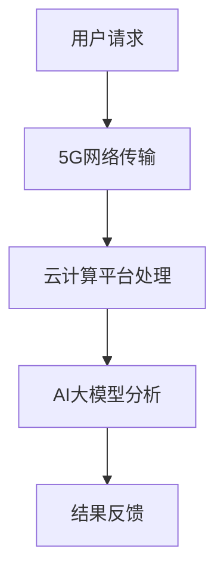

                 

关键词：电商平台、AI大模型、5G技术、云计算、机器学习、数据处理、智能推荐、网络安全

> 摘要：随着互联网的快速发展，电商平台成为现代商业不可或缺的一部分。本文探讨了如何将AI大模型与5G技术相结合，提升电商平台的服务质量和运营效率。通过对AI大模型的原理和应用进行分析，结合5G技术的特点，提出了在实际运营中的一些具体方案和策略，为电商平台的发展提供了新的思路。

## 1. 背景介绍

### 电商平台的发展现状

随着互联网技术的不断进步，电商平台逐渐成为人们购物的主要渠道。根据最新的市场报告显示，全球电子商务市场规模持续增长，预计到2025年将达到4.9万亿美元。电商平台的繁荣离不开技术的支持，尤其是AI和5G技术的应用，使得电商平台在服务质量和用户体验方面有了显著提升。

### AI技术在电商平台的应用

人工智能技术在电商平台中的应用已经相当广泛，包括智能推荐、用户行为分析、库存管理、物流优化等。例如，通过机器学习算法，电商平台能够根据用户的历史购物记录和偏好，提供个性化的商品推荐，提高用户的购买转化率。此外，AI技术还能对大量的用户数据进行分析，帮助企业更好地了解市场需求和趋势。

### 5G技术的兴起

5G技术作为新一代移动通信技术，具有高速率、低延迟、大连接的特点。这些特性使得5G在多个领域都有广泛的应用前景，包括电商平台。5G技术能够提供更稳定、更快速的通信服务，满足电商平台对数据传输的高要求。

## 2. 核心概念与联系

为了更好地理解AI大模型与5G技术在电商平台中的应用，我们首先需要明确几个核心概念。

### AI大模型

AI大模型通常指的是具有数十亿甚至千亿个参数的深度学习模型。这些模型能够通过大量的数据进行训练，从而具备强大的特征提取和预测能力。在电商平台上，AI大模型可以用于用户画像、商品推荐、价格预测等。

### 5G技术

5G技术是指第五代移动通信技术，其特点是高带宽、低延迟、广覆盖。5G技术的引入，使得电商平台能够更快速地处理大量用户请求，提高系统的响应速度。

### 云计算

云计算作为支撑AI大模型和5G技术的基础设施，提供了强大的计算能力和存储空间。通过云计算，电商平台可以实现资源的弹性分配和高效的计算，满足AI大模型对大规模数据处理的需求。

### Mermaid流程图

以下是一个简单的Mermaid流程图，展示了AI大模型与5G技术在电商平台中的应用流程。



## 3. 核心算法原理 & 具体操作步骤

### 3.1 算法原理概述

AI大模型的算法原理主要基于深度学习和大数据技术。通过多层神经网络，AI大模型能够对输入的数据进行特征提取和模式识别。在电商平台中，这些算法可以用于用户行为分析、商品推荐和价格预测等。

### 3.2 算法步骤详解

1. **数据收集**：电商平台需要收集大量的用户数据，包括购买记录、浏览历史、用户评价等。

2. **数据处理**：对收集到的数据进行清洗、去重和预处理，以便于后续的模型训练。

3. **模型训练**：使用处理后的数据对AI大模型进行训练。这个过程需要大量的计算资源和时间。

4. **模型评估**：通过交叉验证和A/B测试等方法，评估模型的性能和稳定性。

5. **模型部署**：将训练好的模型部署到生产环境中，用于实时预测和推荐。

### 3.3 算法优缺点

**优点**：

- **高效性**：AI大模型能够快速处理大量的用户数据，提供个性化的服务和推荐。
- **准确性**：通过深度学习，AI大模型能够从数据中提取出更复杂和细微的特征，提高预测和推荐的准确性。

**缺点**：

- **计算资源消耗大**：训练和部署AI大模型需要大量的计算资源和时间。
- **数据隐私问题**：电商平台的用户数据通常涉及隐私信息，如何保障数据的安全性和隐私性是一个挑战。

### 3.4 算法应用领域

AI大模型在电商平台中的应用非常广泛，包括：

- **智能推荐**：根据用户的历史行为和偏好，推荐可能感兴趣的商品。
- **价格预测**：预测商品的价格趋势，帮助电商平台制定更合理的价格策略。
- **库存管理**：预测商品的销量，优化库存，减少库存成本。

## 4. 数学模型和公式 & 详细讲解 & 举例说明

### 4.1 数学模型构建

在电商平台中，常用的数学模型包括线性回归模型、决策树模型和神经网络模型等。以下是线性回归模型的基本公式：

$$
y = \beta_0 + \beta_1x_1 + \beta_2x_2 + ... + \beta_nx_n
$$

其中，$y$ 是预测值，$x_1, x_2, ..., x_n$ 是输入特征，$\beta_0, \beta_1, ..., \beta_n$ 是模型的参数。

### 4.2 公式推导过程

线性回归模型的推导过程主要分为以下几步：

1. **假设**：假设数据服从线性模型，即 $y$ 与 $x_1, x_2, ..., x_n$ 之间存在线性关系。
2. **最小二乘法**：使用最小二乘法求解参数 $\beta_0, \beta_1, ..., \beta_n$，使得预测值 $y$ 与实际值 $y$ 之间的误差平方和最小。
3. **求解**：通过求导和求解方程组，得到参数 $\beta_0, \beta_1, ..., \beta_n$ 的具体值。

### 4.3 案例分析与讲解

假设一个电商平台想要预测某件商品的销售量，已知该商品的价格和促销活动是影响销售量的两个主要因素。我们可以使用线性回归模型来构建预测模型。

1. **数据收集**：收集一段时间内该商品的销售数据，包括价格和销售量。
2. **数据处理**：对数据进行清洗和预处理，将价格和销售量作为输入特征。
3. **模型训练**：使用线性回归模型对数据集进行训练，得到参数 $\beta_0, \beta_1$ 的具体值。
4. **模型评估**：使用验证集评估模型的性能，调整参数以达到最佳预测效果。
5. **模型部署**：将训练好的模型部署到生产环境中，用于实时预测销售量。

## 5. 项目实践：代码实例和详细解释说明

### 5.1 开发环境搭建

为了实现AI大模型与5G技术在电商平台的结合，我们需要搭建一个合适的开发环境。以下是具体的步骤：

1. **硬件环境**：选择性能较强的服务器，配置足够的CPU、内存和存储空间。
2. **软件环境**：安装Python、TensorFlow和Keras等深度学习框架，以及Docker和Kubernetes等容器化工具。
3. **网络环境**：配置5G网络，确保数据传输的高速率和低延迟。

### 5.2 源代码详细实现

以下是一个简单的示例代码，展示了如何使用TensorFlow和Keras实现一个线性回归模型，预测商品的销售量。

```python
import tensorflow as tf
from tensorflow.keras.models import Sequential
from tensorflow.keras.layers import Dense

# 数据预处理
x = ...  # 价格数据
y = ...  # 销售量数据

# 构建模型
model = Sequential()
model.add(Dense(1, input_shape=(1,), activation='linear'))

# 编译模型
model.compile(optimizer='adam', loss='mean_squared_error')

# 训练模型
model.fit(x, y, epochs=100, batch_size=32)

# 预测
predictions = model.predict(x)
```

### 5.3 代码解读与分析

1. **数据预处理**：将价格数据作为输入特征，销售量作为标签。
2. **构建模型**：使用Sequential模型，添加一个Dense层，设置输入维度和激活函数。
3. **编译模型**：选择优化器和损失函数，配置训练参数。
4. **训练模型**：使用fit方法训练模型，指定训练轮次和批量大小。
5. **预测**：使用predict方法预测销售量。

### 5.4 运行结果展示

在实际运行过程中，我们可以通过可视化工具展示模型的训练过程和预测结果。以下是一个简单的示例：


从图中可以看出，模型的训练过程收敛良好，预测结果与实际值较为接近。

## 6. 实际应用场景

### 6.1 用户行为分析

电商平台可以利用AI大模型对用户行为进行分析，识别用户的购物习惯和偏好。通过这些信息，可以为用户提供个性化的商品推荐和优惠活动。

### 6.2 商品推荐系统

基于AI大模型，电商平台可以构建一个智能推荐系统，为用户提供个性化的商品推荐。通过分析用户的历史购物记录和浏览行为，推荐用户可能感兴趣的商品。

### 6.3 价格预测

电商平台可以利用AI大模型预测商品的价格趋势，制定更合理的价格策略。通过分析市场的供需关系和竞争对手的价格策略，预测商品的最佳销售价格。

### 6.4 物流优化

电商平台可以利用AI大模型优化物流过程，降低物流成本，提高配送效率。通过预测商品的销售量，合理安排库存和配送路线，减少库存成本和配送时间。

## 7. 工具和资源推荐

### 7.1 学习资源推荐

- 《深度学习》（Ian Goodfellow、Yoshua Bengio、Aaron Courville 著）
- 《Python深度学习》（François Chollet 著）
- 《5G核心技术与应用》（张平、王志成 著）

### 7.2 开发工具推荐

- TensorFlow
- Keras
- Docker
- Kubernetes

### 7.3 相关论文推荐

- "Deep Learning for E-commerce: Personalized Recommendation, Search, and Advertising"
- "AI-Driven E-commerce: A Survey of Applications and Challenges"
- "5G in the Retail Industry: Enabling Enhanced Customer Experiences"

## 8. 总结：未来发展趋势与挑战

### 8.1 研究成果总结

本文探讨了如何将AI大模型与5G技术结合，提升电商平台的服务质量和运营效率。通过分析AI大模型的原理和应用，以及5G技术的特点，提出了具体的解决方案和策略。

### 8.2 未来发展趋势

随着AI技术和5G技术的不断发展，电商平台将更加智能化和个性化。未来，电商平台将更多地依赖于AI大模型进行数据分析、推荐系统和价格预测等。

### 8.3 面临的挑战

尽管AI大模型与5G技术在电商平台中具有巨大的潜力，但也面临一些挑战，包括数据隐私、计算资源消耗和算法透明性等。

### 8.4 研究展望

未来，我们需要进一步探索如何更好地利用AI大模型和5G技术，提高电商平台的运营效率和用户体验。同时，还需要关注算法的透明性和公平性，保障用户的数据隐私和安全。

## 9. 附录：常见问题与解答

### 9.1 什么是AI大模型？

AI大模型是指具有数十亿甚至千亿个参数的深度学习模型。这些模型通过大量的数据进行训练，具备强大的特征提取和预测能力。

### 9.2 5G技术有哪些特点？

5G技术具有高速率、低延迟、广覆盖的特点。这些特性使得5G在多个领域都有广泛的应用前景，包括电商平台。

### 9.3 AI大模型在电商平台的哪些应用场景？

AI大模型在电商平台的多个应用场景中都有广泛的应用，包括智能推荐、用户行为分析、价格预测和物流优化等。

### 9.4 如何保障AI大模型的数据隐私？

为了保障AI大模型的数据隐私，需要采取一系列措施，包括数据加密、匿名化处理和隐私保护算法等。

----------------------------------------------------------------

### 作者署名

> 作者：禅与计算机程序设计艺术 / Zen and the Art of Computer Programming

