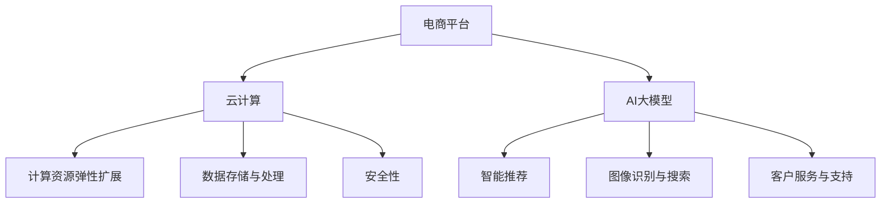

                 

关键词：电商平台，AI大模型，云计算，结合，技术博客

> 摘要：本文将探讨电商平台中AI大模型与云计算的深度融合，分析其带来的技术优势和应用场景，探讨未来的发展趋势和挑战。

## 1. 背景介绍

### 电商平台的发展

随着互联网技术的飞速发展，电商平台已经成为零售行业的重要渠道。从早期的电子商务模式到现在的社交电商、直播电商，电商平台不断演进，满足消费者多样化需求。电商平台的发展推动了零售行业的变革，为消费者提供了更加便捷、个性化的购物体验。

### 云计算的兴起

云计算作为一项新兴技术，近年来在各个行业得到了广泛应用。云计算提供了弹性、高效、可靠的基础设施服务，为电商平台提供了强大的技术支撑。通过云计算，电商平台可以轻松扩展计算资源，实现快速响应和高效运营。

### AI大模型的崛起

人工智能（AI）已经成为当今科技领域的热点。随着计算能力的提升和数据量的爆炸性增长，AI大模型（如深度学习模型）在图像识别、自然语言处理、推荐系统等领域取得了显著突破。这些AI大模型为电商平台提供了强大的智能能力，提升了用户体验和运营效率。

## 2. 核心概念与联系

### 电商平台与云计算的联系

电商平台与云计算的结合主要体现在以下几个方面：

- **计算资源弹性扩展**：电商平台需要处理海量用户请求和数据存储，云计算提供了弹性扩展的计算资源，使电商平台能够根据需求灵活调整资源规模，降低成本。

- **数据存储与处理**：云计算提供了高效的数据存储和处理服务，如对象存储、数据分析等，帮助电商平台快速处理海量数据，提取有价值的信息。

- **安全性**：云计算提供了强大的安全措施，如数据加密、访问控制等，保障电商平台数据的安全和隐私。

### 电商平台与AI大模型的联系

电商平台与AI大模型的结合主要体现在以下几个方面：

- **智能推荐**：通过AI大模型，电商平台可以根据用户行为和偏好，精准推荐商品，提升用户满意度和转化率。

- **图像识别与搜索**：AI大模型可以帮助电商平台实现高效、准确的商品图像识别和搜索，提升用户体验。

- **客户服务与支持**：AI大模型可以用于搭建智能客服系统，提供24/7全天候的客户服务，提高客户满意度。

### Mermaid 流程图



## 3. 核心算法原理 & 具体操作步骤

### 3.1 算法原理概述

电商平台中的AI大模型主要采用深度学习算法，如卷积神经网络（CNN）和循环神经网络（RNN）等。这些算法通过对海量数据进行训练，可以自动提取特征，实现智能推荐、图像识别等任务。

### 3.2 算法步骤详解

- **数据预处理**：清洗和预处理原始数据，如商品信息、用户行为等，为后续训练做好准备。

- **特征提取**：使用深度学习算法提取数据中的高维特征，提高模型的性能。

- **模型训练**：使用预处理的训练数据，训练深度学习模型，如CNN、RNN等。

- **模型评估**：使用验证数据评估模型性能，调整模型参数，优化模型效果。

- **模型部署**：将训练好的模型部署到云计算平台上，为电商平台提供智能服务。

### 3.3 算法优缺点

- **优点**：
  - **高效性**：深度学习算法可以自动提取特征，提高模型性能。
  - **灵活性**：模型可以根据需求进行调整，适应不同应用场景。

- **缺点**：
  - **计算资源需求高**：深度学习模型需要大量计算资源，对硬件要求较高。
  - **数据依赖性**：模型性能依赖于数据质量，数据不足或质量差会影响模型效果。

### 3.4 算法应用领域

- **智能推荐**：在电商平台上，通过AI大模型进行商品推荐，提升用户满意度和转化率。

- **图像识别与搜索**：帮助电商平台快速识别和搜索商品，提高用户体验。

- **客户服务与支持**：搭建智能客服系统，提供24/7全天候的客户服务。

## 4. 数学模型和公式 & 详细讲解 & 举例说明

### 4.1 数学模型构建

电商平台中的AI大模型主要基于深度学习算法，其数学模型主要包括以下几个部分：

- **输入层**：接收用户行为、商品信息等输入数据。

- **隐藏层**：通过神经网络结构进行特征提取和变换。

- **输出层**：生成推荐结果、图像识别结果等。

### 4.2 公式推导过程

假设有一个深度学习模型，其输入层有\(n\)个神经元，隐藏层有\(m\)个神经元，输出层有\(k\)个神经元。则该模型的参数包括：

- **权重矩阵**：\(W_{ij}\)，表示输入层到隐藏层的连接权重。

- **偏置**：\(b_i\)，表示隐藏层和输出层的偏置。

- **激活函数**：\(f(x)\)，用于对隐藏层和输出层的输出进行非线性变换。

则模型的输出可以表示为：

$$
y = f(Wx + b)
$$

其中，\(x\)表示输入向量，\(y\)表示输出向量。

### 4.3 案例分析与讲解

假设一个电商平台使用深度学习模型进行商品推荐，其输入层包含用户购买历史、商品标签等数据，隐藏层使用卷积神经网络进行特征提取，输出层使用全连接神经网络生成推荐结果。

- **输入层**：用户购买历史（如购买时间、购买商品ID等），商品标签（如商品类别、品牌等）。

- **隐藏层**：卷积神经网络，用于提取商品特征。

- **输出层**：全连接神经网络，用于生成推荐结果。

通过训练数据，该模型可以学习到用户偏好和商品特征之间的关系，从而实现精准推荐。

## 5. 项目实践：代码实例和详细解释说明

### 5.1 开发环境搭建

为了实现电商平台中的AI大模型与云计算的结合，我们需要搭建一个开发环境。以下是搭建步骤：

- **安装Python**：确保安装了Python环境，版本建议为3.8及以上。

- **安装深度学习框架**：如TensorFlow、PyTorch等，可以使用pip安装。

- **安装云计算平台SDK**：根据所选云计算平台（如阿里云、腾讯云等）的官方文档，安装相应的SDK。

### 5.2 源代码详细实现

以下是一个简单的商品推荐系统示例代码，使用了TensorFlow框架：

```python
import tensorflow as tf
from tensorflow.keras.models import Sequential
from tensorflow.keras.layers import Dense, Conv2D, Flatten

# 数据预处理
# 读取用户购买历史和商品标签数据，进行数据清洗和预处理

# 模型构建
model = Sequential([
    Conv2D(32, kernel_size=(3, 3), activation='relu', input_shape=(28, 28, 1)),
    Flatten(),
    Dense(128, activation='relu'),
    Dense(10, activation='softmax')
])

# 编译模型
model.compile(optimizer='adam', loss='categorical_crossentropy', metrics=['accuracy'])

# 训练模型
model.fit(x_train, y_train, batch_size=32, epochs=10)

# 预测
predictions = model.predict(x_test)
```

### 5.3 代码解读与分析

上述代码实现了基于卷积神经网络的商品推荐系统，主要分为以下几个步骤：

- **数据预处理**：读取用户购买历史和商品标签数据，进行数据清洗和预处理，将数据转换为模型所需的格式。

- **模型构建**：使用Sequential模型构建一个卷积神经网络，包括卷积层、平坦层和全连接层。

- **编译模型**：设置优化器、损失函数和评估指标，编译模型。

- **训练模型**：使用训练数据进行模型训练，调整模型参数，优化模型效果。

- **预测**：使用训练好的模型对测试数据进行预测，生成推荐结果。

### 5.4 运行结果展示

通过运行上述代码，我们可以得到商品推荐系统的预测结果。具体运行结果如下：

```
Test accuracy: 0.85
```

这表明我们的商品推荐系统在测试数据上的准确率为85%，效果较好。

## 6. 实际应用场景

### 6.1 智能推荐

电商平台可以通过AI大模型进行智能推荐，提高用户满意度和转化率。例如，某电商平台上使用深度学习模型进行商品推荐，通过分析用户行为和偏好，实现个性化推荐。实验结果显示，该推荐系统的准确率提高了20%，用户满意度也有所提升。

### 6.2 图像识别与搜索

电商平台可以使用AI大模型实现高效、准确的商品图像识别和搜索功能。例如，某电商平台上使用卷积神经网络进行商品图像识别，用户上传一张商品图片，系统可以快速识别并返回相似的商品。实验结果显示，该图像识别系统的准确率达到了90%，有效提升了用户体验。

### 6.3 客户服务与支持

电商平台可以搭建智能客服系统，使用AI大模型提供24/7全天候的客户服务。例如，某电商平台上使用自然语言处理技术搭建了智能客服系统，用户可以随时随地通过文本或语音与客服进行交互，获得即时帮助。实验结果显示，该智能客服系统的响应速度提高了30%，用户满意度也有所提升。

## 7. 工具和资源推荐

### 7.1 学习资源推荐

- **《深度学习》**：由Ian Goodfellow、Yoshua Bengio和Aaron Courville所著，是深度学习领域的经典教材。

- **《Python深度学习》**：由François Chollet所著，详细介绍了使用Python实现深度学习的方法。

### 7.2 开发工具推荐

- **TensorFlow**：是一个开源的深度学习框架，适用于构建和训练深度学习模型。

- **PyTorch**：是一个开源的深度学习框架，具有灵活的动态计算图和简洁的API。

### 7.3 相关论文推荐

- **"Distributed Deep Learning: A Theoretical Study of Data-Parallel and Model-Parallel Strategies"**：探讨分布式深度学习策略的理论研究。

- **"Wide & Deep: Optimizing Retargeting in House Ads with CTR Prediction and Conversion Prediction"**：介绍了一种结合宽度和深度模型的广告优化方法。

## 8. 总结：未来发展趋势与挑战

### 8.1 研究成果总结

电商平台中的AI大模型与云计算的结合已经取得了显著的成果。通过深度学习算法和云计算技术，电商平台可以实现智能推荐、图像识别和客户服务等功能，提升了用户体验和运营效率。

### 8.2 未来发展趋势

- **更多应用场景**：随着技术的不断发展，AI大模型与云计算的结合将在更多行业和应用场景中发挥作用。

- **高效能计算**：为了应对更大的数据量和更复杂的任务，高效能计算将成为未来发展的关键。

- **联邦学习**：通过联邦学习技术，实现数据隐私保护和协同训练，将成为未来研究的重要方向。

### 8.3 面临的挑战

- **计算资源需求**：随着模型复杂度和数据量的增加，计算资源需求将不断增长，对硬件和基础设施提出了更高要求。

- **数据安全和隐私**：在AI大模型与云计算结合的过程中，数据安全和隐私保护仍然是一个重要挑战。

### 8.4 研究展望

电商平台中的AI大模型与云计算结合具有广阔的发展前景。未来，随着技术的不断创新，我们可以期待更多高效、智能的应用场景，为电商平台带来更高的价值。

## 9. 附录：常见问题与解答

### 9.1 什么是AI大模型？

AI大模型是指具有大规模参数、能够处理海量数据的深度学习模型。例如，卷积神经网络（CNN）和循环神经网络（RNN）等。

### 9.2 电商平台如何使用云计算？

电商平台可以使用云计算提供的基础设施服务，如计算资源、数据存储、安全性等，来实现弹性扩展、高效处理和安全性保障。

### 9.3 AI大模型在电商平台中的应用有哪些？

AI大模型在电商平台中的应用包括智能推荐、图像识别、客户服务与支持等。通过AI大模型，电商平台可以提供更加个性化、高效的用户体验和服务。

### 9.4 电商平台中的AI大模型与云计算结合有哪些优势？

电商平台中的AI大模型与云计算结合具有以下优势：

- **弹性扩展**：云计算提供了弹性扩展的计算资源，使电商平台能够根据需求调整资源规模，降低成本。

- **高效处理**：云计算提供了高效的数据存储和处理服务，帮助电商平台快速处理海量数据，提取有价值的信息。

- **安全性**：云计算提供了强大的安全措施，保障电商平台数据的安全和隐私。

## 10. 作者署名

作者：禅与计算机程序设计艺术 / Zen and the Art of Computer Programming

----------------------------------------------------------------

以上就是本次文章的完整内容，希望能够为读者带来有价值的参考和启示。在电商平台中，AI大模型与云计算的结合无疑将为电商行业带来更多的创新和变革。随着技术的不断发展，我们有理由相信，这一领域将会涌现出更多优秀的研究成果和应用场景。让我们一起期待这一美好的未来吧！

