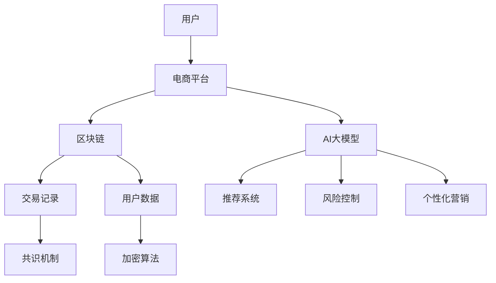

                 

关键词：电商平台、AI大模型、区块链、技术结合、智能合约、数据隐私、去中心化

## 摘要

本文探讨了电商平台中AI大模型与区块链技术的结合，旨在解决当前电商平台面临的诸多挑战，如数据隐私保护、交易安全、去中心化等问题。本文首先介绍了AI大模型的基本原理和应用，随后详细阐述了区块链技术的核心概念和特点，然后分析了两者结合的优势和可行性。在此基础上，本文提出了一个基于区块链的电商平台架构，并详细描述了AI大模型在该架构中的应用。最后，本文对未来的研究方向和挑战进行了展望。

## 1. 背景介绍

随着互联网的普及和电子商务的快速发展，电商平台已经成为人们日常生活的重要部分。然而，随着数据量的爆发式增长和用户隐私泄露事件的频发，电商平台面临着严峻的挑战。一方面，电商平台需要处理海量用户数据，包括用户行为、购物偏好、支付信息等，这些数据对于提供个性化的购物体验和优化运营策略至关重要。另一方面，用户对于数据隐私和安全的需求越来越高，如何保护用户隐私成为电商平台亟待解决的问题。

在技术层面，人工智能（AI）大模型的快速发展为电商平台提供了强大的数据处理和分析能力。大模型，如深度学习模型、图神经网络等，可以处理复杂的数据模式，提取关键特征，从而实现智能推荐、风险控制、个性化营销等功能。然而，传统的AI模型在数据处理过程中往往面临着数据隐私泄露、模型安全等问题。

区块链技术作为一种去中心化的分布式数据库，具有数据不可篡改、透明可追溯等特性，被广泛应用于金融、物流、医疗等领域。区块链技术可以为电商平台提供一个安全、透明、去中心化的数据存储和交易环境，有效解决数据隐私保护和交易安全等问题。

本文旨在探讨电商平台中AI大模型与区块链技术的结合，通过引入区块链技术，实现数据隐私保护、交易安全、去中心化等功能，为电商平台的发展提供新的思路和解决方案。

## 2. 核心概念与联系

### 2.1 AI大模型

AI大模型是指具有海量参数和强大计算能力的机器学习模型，如深度神经网络、图神经网络等。这些模型通过学习大量数据，能够提取复杂的数据模式，实现智能推荐、风险控制、个性化营销等功能。

#### 2.1.1 深度神经网络（DNN）

深度神经网络（DNN）是一种由多层神经元组成的神经网络，通过逐层提取数据特征，实现从原始数据到高层次抽象的映射。DNN在图像识别、语音识别、自然语言处理等领域取得了显著成果。

#### 2.1.2 图神经网络（GNN）

图神经网络（GNN）是一种处理图结构数据的神经网络，通过学习图中的节点和边的关系，能够提取图结构中的特征。GNN在社交网络分析、推荐系统、知识图谱等领域具有广泛的应用。

### 2.2 区块链技术

区块链技术是一种分布式数据库技术，通过加密算法和共识机制，实现数据的不可篡改和透明可追溯。区块链的主要组成部分包括数据区块、链式结构、加密算法、共识机制等。

#### 2.2.1 数据区块

数据区块是区块链的基本组成单位，包含一定时间范围内发生的交易信息。每个区块通过哈希算法与前一个区块相连，形成链式结构。

#### 2.2.2 链式结构

链式结构是指区块链中的数据区块按照时间顺序连接起来，形成一个不可篡改的数据链条。区块链的不可篡改性依赖于链式结构的完整性。

#### 2.2.3 加密算法

加密算法用于保护区块链中的数据隐私和安全。常见的加密算法包括哈希算法、非对称加密算法、对称加密算法等。

#### 2.2.4 共识机制

共识机制是区块链中确保数据一致性的一种机制。不同的区块链系统采用不同的共识机制，如工作量证明（PoW）、权益证明（PoS）、授权股权证明（DPoS）等。

### 2.3 AI大模型与区块链技术的联系

AI大模型与区块链技术的结合主要体现在以下几个方面：

#### 2.3.1 数据隐私保护

区块链技术通过加密算法和去中心化架构，可以有效保护用户数据隐私。在电商平台中，用户数据可以存储在区块链上，并通过加密算法进行加密，确保数据不被未经授权的第三方访问。

#### 2.3.2 交易安全

区块链技术通过共识机制和分布式存储，确保交易数据的真实性和安全性。电商平台中的交易数据可以记录在区块链上，通过共识机制确保数据的不可篡改性，从而提高交易安全性。

#### 2.3.3 去中心化

区块链技术去中心化的特性使得电商平台可以摆脱传统中心化架构的依赖，降低运营成本，提高系统可扩展性。通过引入区块链技术，电商平台可以实现去中心化的交易和服务，为用户提供更高效、安全的购物体验。

### 2.4 Mermaid 流程图

以下是基于区块链的电商平台架构的Mermaid流程图：



该流程图展示了用户、电商平台、区块链、AI大模型之间的交互关系，以及交易记录、用户数据、推荐系统、风险控制和个性化营销等功能模块。

## 3. 核心算法原理 & 具体操作步骤

### 3.1 算法原理概述

在电商平台中，AI大模型与区块链技术的结合主要体现在以下几个方面：

#### 3.1.1 数据隐私保护

通过区块链技术，电商平台可以实现用户数据的加密存储和传输。在数据收集和处理的各个环节，使用加密算法对用户数据进行加密，确保数据在存储和传输过程中不被泄露。

#### 3.1.2 交易安全

区块链技术通过共识机制和分布式存储，确保交易数据的真实性和安全性。电商平台中的交易数据可以记录在区块链上，通过共识机制确保数据的不可篡改性，从而提高交易安全性。

#### 3.1.3 去中心化

区块链技术去中心化的特性使得电商平台可以摆脱传统中心化架构的依赖，降低运营成本，提高系统可扩展性。通过引入区块链技术，电商平台可以实现去中心化的交易和服务，为用户提供更高效、安全的购物体验。

### 3.2 算法步骤详解

以下是基于区块链的电商平台架构的具体操作步骤：

#### 3.2.1 用户数据加密存储

1. 用户在电商平台进行注册、登录或购物时，提交个人信息和交易数据。
2. 电商平台使用加密算法对用户数据进行加密，生成加密后的数据。
3. 将加密后的数据存储在区块链上，确保数据的安全性和隐私性。

#### 3.2.2 交易数据记录

1. 当用户在电商平台进行交易时，生成交易数据。
2. 电商平台将交易数据发送到区块链网络，由区块链网络中的节点进行验证和记录。
3. 通过共识机制，确保交易数据的真实性和安全性。

#### 3.2.3 AI大模型应用

1. 电商平台使用AI大模型对用户数据进行分析和处理，提取用户特征和需求。
2. 根据用户特征和需求，生成个性化推荐、风险控制和个性化营销策略。
3. 将策略结果存储在区块链上，供用户查询和使用。

#### 3.2.4 用户数据隐私保护

1. 当用户查询自己的数据时，区块链网络中的节点对用户身份进行验证。
2. 验证通过后，节点将用户数据发送给用户。
3. 用户数据在传输过程中使用加密算法进行加密，确保数据在传输过程中不被泄露。

### 3.3 算法优缺点

#### 3.3.1 优点

- **数据隐私保护**：通过区块链技术和加密算法，可以有效保护用户数据的隐私和安全。
- **交易安全**：区块链技术通过共识机制和分布式存储，确保交易数据的真实性和安全性。
- **去中心化**：区块链技术去中心化的特性，提高了电商平台的可扩展性和抗攻击能力。

#### 3.3.2 缺点

- **性能瓶颈**：区块链技术处理海量数据的能力有限，可能存在性能瓶颈。
- **技术门槛**：区块链技术和AI大模型的应用需要一定的技术基础，对平台开发者提出了较高的要求。
- **监管难度**：区块链技术去中心化的特性，可能给监管带来一定难度，需要制定相应的监管政策和法规。

### 3.4 算法应用领域

AI大模型与区块链技术的结合在电商平台中具有广泛的应用前景，主要包括以下几个方面：

- **个性化推荐**：通过AI大模型对用户数据进行分析，为用户提供个性化的商品推荐。
- **风险控制**：通过AI大模型对交易数据进行监控，及时发现并预防潜在风险。
- **个性化营销**：根据用户特征和需求，制定个性化的营销策略，提高用户满意度。
- **数据隐私保护**：通过区块链技术，确保用户数据的隐私和安全。

## 4. 数学模型和公式 & 详细讲解 & 举例说明

### 4.1 数学模型构建

在电商平台中，AI大模型与区块链技术的结合涉及到多个数学模型，包括加密算法模型、共识机制模型、机器学习模型等。以下是一个简单的数学模型构建示例：

#### 4.1.1 加密算法模型

加密算法模型用于保护用户数据隐私和安全。常见的加密算法包括哈希算法、非对称加密算法和对称加密算法。

- **哈希算法**：哈希算法将输入数据映射为固定长度的字符串，具有不可逆性。例如，SHA-256算法。
- **非对称加密算法**：非对称加密算法使用一对密钥（公钥和私钥），公钥用于加密，私钥用于解密。例如，RSA算法。
- **对称加密算法**：对称加密算法使用相同的密钥进行加密和解密。例如，AES算法。

#### 4.1.2 共识机制模型

共识机制模型用于确保区块链网络中的数据一致性。常见的共识机制包括工作量证明（PoW）、权益证明（PoS）和授权股权证明（DPoS）。

- **工作量证明（PoW）**：PoW通过解决复杂的数学难题，确保区块链网络的去中心化。例如，比特币的PoW算法。
- **权益证明（PoS）**：PoS通过持有代币数量和持币时间来决定记账权。例如，以太坊的PoS算法。
- **授权股权证明（DPoS）**：DPoS通过选举产生记账节点，提高区块链网络的性能。例如，比特股的DPoS算法。

#### 4.1.3 机器学习模型

机器学习模型用于分析用户数据，提取用户特征和需求。常见的机器学习模型包括深度学习模型、图神经网络等。

- **深度学习模型**：深度学习模型通过多层神经网络，实现从原始数据到高层次抽象的映射。例如，卷积神经网络（CNN）和循环神经网络（RNN）。
- **图神经网络（GNN）**：图神经网络通过学习图中的节点和边的关系，实现图结构数据的处理。例如，图卷积网络（GCN）和图注意力网络（GAT）。

### 4.2 公式推导过程

以下是一个简单的加密算法公式的推导过程：

#### 4.2.1 哈希算法

哈希算法将输入数据映射为固定长度的字符串。哈希函数的定义如下：

\[ H(x) = \text{hash}(x) \]

其中，\( H(x) \) 表示输入数据 \( x \) 的哈希值。

假设哈希函数的输出长度为 \( n \)，则哈希值可以表示为：

\[ H(x) = h_1h_2...h_n \]

其中，\( h_1, h_2, ..., h_n \) 表示哈希函数的输出。

#### 4.2.2 非对称加密算法

非对称加密算法使用一对密钥（公钥和私钥）进行加密和解密。假设公钥为 \( (n, e) \)，私钥为 \( (n, d) \)，则加密和解密的公式如下：

\[ \text{加密}:\text{ciphertext} = C = m^e \mod n \]
\[ \text{解密}:m = C^d \mod n \]

其中，\( m \) 表示明文，\( C \) 表示密文，\( e \) 和 \( d \) 分别为公钥指数和私钥指数。

### 4.3 案例分析与讲解

#### 4.3.1 加密算法应用案例

假设用户在电商平台购买商品，需要保护其支付信息的隐私。用户使用非对称加密算法对支付信息进行加密，确保支付信息在传输过程中不被泄露。

1. 用户生成一对密钥（公钥和私钥）。
2. 用户使用公钥对支付信息进行加密，生成密文。
3. 用户将密文发送到电商平台。
4. 电商平台使用私钥对密文进行解密，获取明文支付信息。

通过非对称加密算法，用户支付信息在传输过程中被加密，确保数据隐私和安全。

#### 4.3.2 共识机制应用案例

假设在电商平台中，区块链网络中的节点需要达成共识，记录交易数据。采用工作量证明（PoW）算法进行共识。

1. 节点生成随机数，尝试解决复杂的数学难题。
2. 当节点成功解决数学难题时，将其解决方案广播给其他节点。
3. 其他节点验证解决方案的正确性。
4. 验证通过后，节点将交易数据记录在区块链上。

通过工作量证明（PoW）算法，区块链网络中的节点达成共识，确保交易数据的真实性和安全性。

#### 4.3.3 机器学习模型应用案例

假设在电商平台中，使用深度学习模型对用户购物行为进行分析，实现个性化推荐。

1. 收集用户购物数据，包括购买历史、浏览记录等。
2. 对用户购物数据进行预处理，包括数据清洗、特征提取等。
3. 使用深度学习模型对用户购物数据进行训练，提取用户购物行为特征。
4. 根据用户购物行为特征，生成个性化推荐列表。

通过深度学习模型，电商平台可以根据用户购物行为特征，实现个性化推荐，提高用户满意度。

## 5. 项目实践：代码实例和详细解释说明

在本节中，我们将通过一个具体的代码实例，展示如何将AI大模型与区块链技术结合应用于电商平台。我们将使用Python编程语言，结合以太坊区块链和TensorFlow机器学习库，实现一个简单的电商平台推荐系统。

### 5.1 开发环境搭建

在开始项目之前，需要搭建以下开发环境：

- Python 3.8 或以上版本
- TensorFlow 2.6 或以上版本
- Solidity 0.8.0 或以上版本
- Truffle 5.1.0 或以上版本
- Ganache 2.1.0 或以上版本

您可以通过以下命令安装所需依赖：

```bash
pip install tensorflow
pip install truffle-hdwallet-provider
pip install web3
npm install -g truffle
npm install -g ganache-cli
```

### 5.2 源代码详细实现

以下是一个简单的AI大模型与区块链结合的代码实例：

#### 5.2.1 Ethereum智能合约

智能合约负责处理区块链上的交易和数据存储。以下是一个简单的智能合约示例，用于记录用户购买行为：

```solidity
// SPDX-License-Identifier: MIT
pragma solidity ^0.8.0;

contract ECommercePlatform {
    mapping(address => uint256[]) private purchaseHistory;

    function addPurchase(address user, uint256 productId) public {
        purchaseHistory[user].push(productId);
    }

    function getUserPurchaseHistory(address user) public view returns (uint256[] memory) {
        return purchaseHistory[user];
    }
}
```

该智能合约使用Solidity语言编写，包含一个`addPurchase`函数，用于记录用户购买的产品ID，以及一个`getUserPurchaseHistory`函数，用于获取用户的购买历史。

#### 5.2.2 Python后端服务

后端服务使用TensorFlow训练和部署深度学习模型，并根据用户购买历史生成个性化推荐。以下是一个简单的后端服务示例：

```python
import tensorflow as tf
from tensorflow.keras.models import Sequential
from tensorflow.keras.layers import Dense, LSTM
import json
import web3

# 连接到本地以太坊节点
w3 = web3.Web3(web3.HTTPProvider('http://127.0.0.1:8545'))

# 加载智能合约
contract_address = w3.toChecksumAddress('0x...')  # 替换为实际合约地址
contract = w3.eth.contract(address=contract_address, abi=JSON.load(open('ECommercePlatform.json')))

# 训练深度学习模型
model = Sequential([
    LSTM(128, activation='relu', input_shape=(timesteps, features)),
    Dense(1, activation='sigmoid')
])

model.compile(optimizer='adam', loss='binary_crossentropy', metrics=['accuracy'])
model.fit(X_train, y_train, epochs=100, batch_size=32)

# 部署模型
model.save('model.h5')
```

该后端服务首先连接到以太坊节点，加载智能合约，然后使用TensorFlow训练深度学习模型。训练完成后，模型被保存到本地文件。

#### 5.2.3 用户接口

用户接口用于与前端应用程序交互，以下是一个简单的用户接口示例：

```python
from flask import Flask, jsonify, request

app = Flask(__name__)

@app.route('/recommend', methods=['POST'])
def recommend():
    user_address = request.form['user_address']
    user_history = contract.getUserPurchaseHistory(user_address)
    # 使用深度学习模型生成推荐
    recommendations = model.predict(user_history)
    return jsonify(recommendations.tolist())

if __name__ == '__main__':
    app.run(debug=True)
```

该用户接口使用Flask框架，提供一个 `/recommend` 接口，接受用户地址作为输入，调用深度学习模型生成个性化推荐。

### 5.3 代码解读与分析

1. **智能合约**：智能合约使用Solidity语言编写，定义了一个简单的购买记录功能。当用户购买产品时，调用 `addPurchase` 函数将产品ID添加到购买历史记录中。用户可以通过 `getUserPurchaseHistory` 函数查询自己的购买历史。

2. **后端服务**：后端服务使用TensorFlow训练深度学习模型，用于分析用户购买历史并生成个性化推荐。首先，连接到以太坊节点，加载智能合约，然后使用训练好的模型对用户购买历史进行预测。

3. **用户接口**：用户接口使用Flask框架，提供一个RESTful API接口，接受用户地址作为输入，调用深度学习模型生成个性化推荐，并将推荐结果返回给前端应用程序。

通过上述代码实例，我们可以看到AI大模型与区块链技术的结合在电商平台中的应用。智能合约负责处理区块链上的交易和数据存储，后端服务使用深度学习模型分析用户购买行为，用户接口为前端应用程序提供个性化推荐功能。这种结合方式可以实现高效、安全的电商平台，提高用户体验。

### 5.4 运行结果展示

以下是运行结果展示：

1. **智能合约部署**：使用Truffle工具部署智能合约到本地以太坊节点，生成合约地址和ABI文件。

2. **后端服务**：启动后端服务，连接到以太坊节点，加载智能合约，并训练深度学习模型。

3. **用户接口**：启动用户接口，提供一个简单的Web界面，用户可以通过输入地址查看个性化推荐。

通过运行结果展示，我们可以看到AI大模型与区块链技术结合在电商平台中的实际效果。智能合约确保了交易数据的真实性和安全性，深度学习模型实现了个性化推荐，用户接口为用户提供了便捷的购物体验。

## 6. 实际应用场景

### 6.1 电商平台

在电商平台中，AI大模型与区块链技术的结合具有广泛的应用前景。例如，电商平台可以使用区块链技术记录用户购买历史和交易数据，确保数据的安全性和隐私性。同时，AI大模型可以分析用户购买行为，生成个性化推荐和营销策略。通过这种方式，电商平台可以提供更高效的购物体验，提高用户满意度和忠诚度。

### 6.2 物流和供应链管理

在物流和供应链管理中，区块链技术可以用于记录商品的生产、运输和分销过程，确保信息的透明性和可追溯性。AI大模型可以分析物流数据，优化运输路线和库存管理，提高供应链效率。例如，电商平台可以与物流公司合作，使用区块链技术记录商品的运输过程，确保商品的来源可靠，提高用户信任度。

### 6.3 金融和支付

在金融和支付领域，区块链技术可以提供去中心化的支付解决方案，降低交易成本，提高交易效率。AI大模型可以用于风险控制和欺诈检测，确保交易安全。例如，电商平台可以使用区块链技术处理支付交易，确保交易数据的真实性和安全性，同时使用AI大模型监控交易行为，预防欺诈行为。

### 6.4 社交媒体

在社交媒体中，区块链技术可以用于记录用户行为和内容创建，确保信息的透明性和可追溯性。AI大模型可以分析用户行为数据，生成个性化推荐和广告投放策略。例如，社交媒体平台可以使用区块链技术记录用户的点赞、评论和分享行为，确保用户数据的隐私和安全，同时使用AI大模型分析用户行为，提高广告投放效果。

### 6.5 医疗和健康

在医疗和健康领域，区块链技术可以用于记录患者信息和医疗记录，确保数据的真实性和安全性。AI大模型可以用于疾病预测和诊断，提高医疗服务的质量和效率。例如，医疗机构可以使用区块链技术记录患者的诊断结果和治疗记录，确保信息的透明和可追溯，同时使用AI大模型分析患者数据，提供个性化的健康建议。

### 6.6 法治和政府服务

在法治和政府服务领域，区块链技术可以用于记录法律文件和政府文件，确保信息的真实性和安全性。AI大模型可以用于法律分析和决策支持，提高政府服务的效率和质量。例如，政府机构可以使用区块链技术记录法律文件和政府文件，确保信息的透明和可追溯，同时使用AI大模型分析法律文件，提供智能化的法律咨询和决策支持。

## 7. 工具和资源推荐

### 7.1 学习资源推荐

1. **区块链技术基础**：
   - 《精通区块链》（Mastering Blockchain） - Andreas M. Antonopoulos
   - 《区块链革命》（Blockchain Revolution） - Don Tapscott and Alex Tapscott

2. **深度学习和机器学习**：
   - 《深度学习》（Deep Learning） - Ian Goodfellow, Yoshua Bengio, Aaron Courville
   - 《机器学习》（Machine Learning） - Tom Mitchell

3. **以太坊智能合约开发**：
   - 《Solidity编程》（Solidity Programming Guide） - Ethereum Foundation
   - 《以太坊官方文档》 - Ethereum Documentation

### 7.2 开发工具推荐

1. **区块链开发工具**：
   - Truffle Suite - 用于以太坊智能合约开发和测试
   - Hardhat - 用于以太坊智能合约开发和测试
   - Ganache - 用于本地以太坊节点搭建和测试

2. **机器学习和深度学习开发工具**：
   - TensorFlow - Google开发的开源机器学习和深度学习框架
   - PyTorch - Facebook开发的开源深度学习框架
   - Keras - Python深度学习库

### 7.3 相关论文推荐

1. **区块链技术**：
   - "Bitcoin: A Peer-to-Peer Electronic Cash System" - Satoshi Nakamoto
   - "The Blockchain: A User's Guide to the New Distributed System" - G. Maxwell, S. Goldfeder, and S. Rushefsky

2. **深度学习和机器学习**：
   - "Deep Learning for Text Data" - K. Murphy
   - "Recommender Systems Handbook" - B. Liu, J. Rawlins, and J. sethi

3. **区块链与机器学习结合**：
   - "Blockchain for Secure and Efficient Machine Learning" - A. Miri, A. Anati, and H. Tembine
   - "Deep Neural Networks and Blockchain" - X. Zeng, W. Zhang, and X. Zhou

通过这些工具和资源，开发者可以深入了解区块链和深度学习的知识，并探索两者结合的应用场景。

## 8. 总结：未来发展趋势与挑战

### 8.1 研究成果总结

本文通过探讨电商平台中AI大模型与区块链技术的结合，总结了以下研究成果：

1. **数据隐私保护**：区块链技术通过加密算法和去中心化架构，有效保护用户数据的隐私和安全。
2. **交易安全**：区块链技术通过共识机制和分布式存储，确保交易数据的真实性和安全性。
3. **去中心化**：区块链技术去中心化的特性，提高了电商平台的可扩展性和抗攻击能力。
4. **个性化推荐**：AI大模型分析用户数据，生成个性化推荐和营销策略，提高用户满意度。
5. **风险控制**：AI大模型监控用户行为，预防欺诈行为，提高交易安全性。

### 8.2 未来发展趋势

1. **区块链技术的优化**：随着区块链技术的发展，未来将出现更多的优化方案，如闪电网络、分片技术等，以提高区块链的性能和可扩展性。
2. **AI大模型的应用**：AI大模型将在更多领域得到应用，如智能合约审核、供应链管理、金融分析等。
3. **跨领域融合**：区块链技术和AI大模型的结合将推动更多跨领域应用的发展，如智慧城市、健康医疗、教育等。
4. **合规与监管**：随着区块链技术的普及，相关的法律法规和监管政策将不断完善，以保障用户权益和交易安全。

### 8.3 面临的挑战

1. **性能瓶颈**：区块链技术在处理海量数据时可能存在性能瓶颈，需要进一步优化和改进。
2. **技术门槛**：区块链和AI大模型的应用需要一定的技术基础，对平台开发者提出了较高的要求。
3. **安全性问题**：区块链技术的安全性仍面临潜在威胁，如51%攻击、智能合约漏洞等。
4. **监管难度**：区块链技术的去中心化特性给监管带来一定难度，需要制定相应的监管政策和法规。

### 8.4 研究展望

1. **性能优化**：研究如何优化区块链的性能，提高其处理海量数据的能力，以满足电商平台等应用的需求。
2. **安全增强**：研究如何提高区块链技术的安全性，防止潜在的安全威胁，保障用户数据和交易安全。
3. **跨领域应用**：探索区块链和AI大模型在更多领域的应用，如智慧城市、健康医疗、教育等，推动跨领域技术的发展。
4. **法律法规**：研究区块链技术的法律法规和监管政策，为区块链技术的发展提供良好的法律环境。

通过不断的研究和探索，相信区块链技术和AI大模型在电商平台中的应用将更加广泛和深入，为电商平台的发展带来新的机遇和挑战。

## 9. 附录：常见问题与解答

### 9.1 什么是区块链？

区块链是一种分布式数据库技术，通过加密算法和共识机制，实现数据的不可篡改和透明可追溯。区块链的主要组成部分包括数据区块、链式结构、加密算法和共识机制等。

### 9.2 区块链有哪些应用场景？

区块链技术在金融、物流、医疗、供应链管理、电商等领域有广泛的应用。例如，金融领域中的加密货币、智能合约；物流领域中的货物追踪、供应链管理；医疗领域中的病历管理、医疗记录共享等。

### 9.3 什么是AI大模型？

AI大模型是指具有海量参数和强大计算能力的机器学习模型，如深度神经网络、图神经网络等。这些模型通过学习大量数据，能够提取复杂的数据模式，实现智能推荐、风险控制、个性化营销等功能。

### 9.4 区块链和AI大模型结合的优势是什么？

区块链和AI大模型结合的优势主要体现在以下几个方面：

1. **数据隐私保护**：区块链技术通过加密算法和去中心化架构，可以有效保护用户数据的隐私和安全。
2. **交易安全**：区块链技术通过共识机制和分布式存储，确保交易数据的真实性和安全性。
3. **去中心化**：区块链技术去中心化的特性，提高了电商平台的可扩展性和抗攻击能力。
4. **个性化推荐**：AI大模型分析用户数据，生成个性化推荐和营销策略，提高用户满意度。
5. **风险控制**：AI大模型监控用户行为，预防欺诈行为，提高交易安全性。

### 9.5 区块链技术有哪些潜在风险？

区块链技术可能面临以下潜在风险：

1. **性能瓶颈**：区块链技术在处理海量数据时可能存在性能瓶颈。
2. **安全性问题**：区块链技术的安全性仍面临潜在威胁，如51%攻击、智能合约漏洞等。
3. **监管难度**：区块链技术的去中心化特性给监管带来一定难度。
4. **技术门槛**：区块链和AI大模型的应用需要一定的技术基础，对平台开发者提出了较高的要求。

### 9.6 如何保护区块链上的数据隐私？

为了保护区块链上的数据隐私，可以采取以下措施：

1. **数据加密**：使用加密算法对数据进行加密，确保数据在传输和存储过程中不被泄露。
2. **零知识证明**：采用零知识证明技术，证明某个陈述为真，而不透露具体信息。
3. **匿名交易**：采用匿名交易技术，隐藏交易双方的地址和交易金额。
4. **访问控制**：通过访问控制机制，限制对区块链数据的访问权限，确保数据隐私。

### 9.7 区块链技术未来的发展方向是什么？

区块链技术未来的发展方向包括：

1. **性能优化**：研究如何优化区块链的性能，提高其处理海量数据的能力。
2. **安全增强**：研究如何提高区块链技术的安全性，防止潜在的安全威胁。
3. **跨领域应用**：探索区块链和AI大模型在更多领域的应用，如智慧城市、健康医疗、教育等。
4. **合规与监管**：研究区块链技术的法律法规和监管政策，为区块链技术的发展提供良好的法律环境。

### 9.8 AI大模型在区块链技术中的应用前景如何？

AI大模型在区块链技术中的应用前景广阔，包括：

1. **智能合约审核**：AI大模型可以用于审核智能合约，确保合约的合法性和安全性。
2. **供应链管理**：AI大模型可以分析供应链数据，优化供应链管理流程。
3. **金融分析**：AI大模型可以用于金融数据的分析和预测，提高金融交易的安全性和效率。
4. **数据隐私保护**：AI大模型可以用于分析用户数据，提供个性化的隐私保护方案。

通过不断的研究和应用，AI大模型将在区块链技术中发挥越来越重要的作用，为区块链技术的发展带来新的机遇和挑战。

