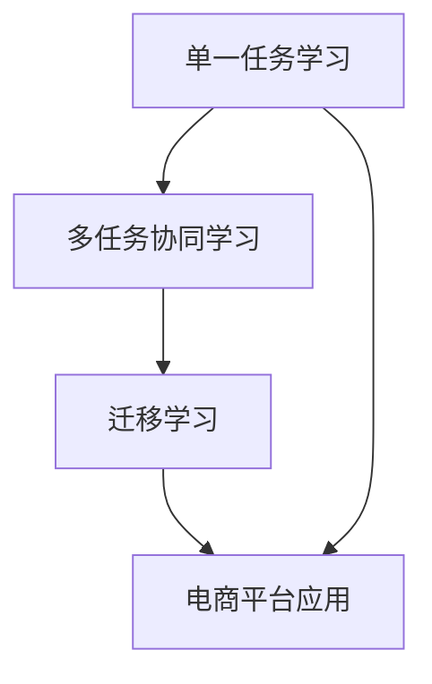

                 

关键词：电商平台、AI大模型、多任务协同、迁移学习、深度学习

> 摘要：本文将深入探讨电商平台中的AI大模型，从单一任务学习到多任务协同学习和迁移学习的转变。我们将分析AI大模型在电商平台中的应用场景、核心概念、算法原理、数学模型以及实际项目实践，并展望未来发展趋势与挑战。

## 1. 背景介绍

随着互联网的快速发展，电商平台已经成为现代商业的核心。平台上的海量数据和信息处理需求为人工智能技术提供了广阔的应用空间。AI大模型作为一种先进的机器学习技术，其在电商平台中的应用越来越广泛。从最初的单一任务学习，到现在的多任务协同学习和迁移学习，AI大模型正逐渐成为电商平台的核心驱动力。

本文将围绕以下几个方面展开：

1. AI大模型在电商平台中的应用场景
2. 核心概念与联系
3. 核心算法原理与具体操作步骤
4. 数学模型和公式
5. 项目实践：代码实例和详细解释说明
6. 实际应用场景
7. 工具和资源推荐
8. 总结：未来发展趋势与挑战

## 2. 核心概念与联系

### 2.1 AI大模型

AI大模型指的是一种具有大规模参数和复杂结构的深度学习模型。其特点在于能够通过海量数据的学习，提取出丰富的特征表示，从而实现高性能的预测和分类任务。常见的AI大模型包括BERT、GPT、T5等。

### 2.2 多任务协同学习

多任务协同学习是指多个任务共享一部分参数进行学习，以提高各个任务的性能。在电商平台中，例如同时进行商品推荐、用户行为分析和广告投放等任务，可以采用多任务协同学习来提高整体性能。

### 2.3 迁移学习

迁移学习是指将一个任务在学习过程中学到的知识应用到另一个相关任务中。在电商平台中，可以将一个任务中的特征提取器应用到其他任务中，以提高新任务的性能。

### 2.4 Mermaid 流程图

为了更好地理解AI大模型在电商平台中的核心概念与联系，我们使用Mermaid流程图来展示其整体架构。



## 3. 核心算法原理 & 具体操作步骤

### 3.1 算法原理概述

AI大模型的核心算法主要包括两部分：神经网络结构和优化算法。神经网络结构负责提取数据中的特征表示，优化算法则用于调整网络参数以最小化损失函数。

在电商平台中，多任务协同学习和迁移学习算法可以分别用于提升不同任务的性能。具体操作步骤如下：

1. 数据预处理：对原始数据进行清洗、归一化等处理，以适应AI大模型的学习。
2. 网络结构设计：根据任务需求，设计合适的神经网络结构，包括输入层、隐藏层和输出层。
3. 优化算法选择：选择合适的优化算法，如Adam、RMSProp等，以调整网络参数。
4. 多任务协同学习：共享部分网络结构，同时优化多个任务的目标函数。
5. 迁移学习：利用已有任务的模型，对新的任务进行特征提取和参数调整。

### 3.2 算法步骤详解

1. **数据预处理**：
    - 数据清洗：去除噪声数据和缺失值。
    - 数据归一化：将不同特征的数据缩放到相同的尺度。

2. **网络结构设计**：
    - 输入层：接收原始数据，例如商品特征、用户行为等。
    - 隐藏层：通过多层神经网络，提取数据中的高级特征。
    - 输出层：根据任务需求，输出预测结果，例如商品推荐列表、用户行为分类等。

3. **优化算法选择**：
    - 选择合适的优化算法，如Adam、RMSProp等，以调整网络参数。
    - 设置适当的初始参数，如学习率、批量大小等。

4. **多任务协同学习**：
    - 共享部分网络结构，例如隐藏层。
    - 分别优化不同任务的目标函数，例如商品推荐和广告投放。

5. **迁移学习**：
    - 利用已有任务的模型，对新的任务进行特征提取和参数调整。
    - 选择合适的迁移学习方法，如基于特征的迁移、基于模型的迁移等。

### 3.3 算法优缺点

**优点**：

- **高性能**：AI大模型能够提取丰富的特征表示，从而实现高性能的预测和分类任务。
- **多任务协同**：多任务协同学习可以提升不同任务的性能，提高整体效果。
- **迁移学习**：迁移学习可以加快新任务的学习速度，提高新任务的性能。

**缺点**：

- **计算资源消耗大**：AI大模型需要大量的计算资源进行训练。
- **数据依赖性强**：迁移学习需要依赖已有任务的数据，新任务性能依赖于已有任务的表现。

### 3.4 算法应用领域

AI大模型在电商平台中的应用非常广泛，包括但不限于以下领域：

- **商品推荐**：根据用户的购买历史、浏览记录等，推荐用户可能感兴趣的商品。
- **广告投放**：根据用户的行为特征，投放个性化的广告，提高广告点击率。
- **用户行为分析**：分析用户的浏览、购买等行为，预测用户的潜在需求。

## 4. 数学模型和公式 & 详细讲解 & 举例说明

### 4.1 数学模型构建

在AI大模型中，常见的数学模型包括神经网络模型、损失函数和优化算法。

#### 神经网络模型

神经网络模型由输入层、隐藏层和输出层组成。输入层接收原始数据，隐藏层提取数据中的特征表示，输出层输出预测结果。

#### 损失函数

损失函数用于衡量预测结果与真实结果之间的差距。常见的损失函数包括均方误差（MSE）、交叉熵（CE）等。

#### 优化算法

优化算法用于调整网络参数，以最小化损失函数。常见的优化算法包括Adam、RMSProp等。

### 4.2 公式推导过程

以下是神经网络模型的推导过程：

$$
z = x \cdot W + b \\
a = \sigma(z) \\
\text{其中} x \text{为输入，} W \text{为权重，} b \text{为偏置，} \sigma \text{为激活函数。}
$$

### 4.3 案例分析与讲解

假设我们要构建一个简单的神经网络模型，用于对商品进行分类。输入层包含3个特征，隐藏层包含2个神经元，输出层包含2个神经元。

#### 模型构建

1. 输入层：3个特征
2. 隐藏层：2个神经元
3. 输出层：2个神经元

#### 损失函数

我们选择交叉熵作为损失函数：

$$
L = -\sum_{i=1}^{n} y_i \cdot \log(a_i)
$$

其中，$y_i$为真实标签，$a_i$为输出层的预测概率。

#### 优化算法

我们选择Adam优化算法：

$$
m = \frac{1}{\beta_1^T}(1-\beta_1^T)\sum_{t=1}^T (x_t - m_t) \\
v = \frac{1}{\beta_2^T}(1-\beta_2^T)\sum_{t=1}^T (x_t^2 - v_t) \\
\theta = \theta - \alpha \frac{m}{\sqrt{v} + \epsilon}
$$

其中，$m$为梯度的一阶矩估计，$v$为梯度二阶矩估计，$\theta$为网络参数，$\alpha$为学习率，$\beta_1$、$\beta_2$为超参数，$\epsilon$为正则项。

#### 案例分析

假设我们有以下数据：

- 输入层：[1, 2, 3]
- 真实标签：[0, 1]

通过构建神经网络模型，我们可以得到输出层的预测概率：

$$
a = \sigma(W_2 \cdot \sigma(W_1 \cdot x + b_1) + b_2) = [0.1, 0.9]
$$

计算交叉熵损失函数：

$$
L = -[0 \cdot \log(0.1) + 1 \cdot \log(0.9)] = 0.105
$$

使用Adam优化算法，更新网络参数：

$$
\theta = \theta - \alpha \frac{m}{\sqrt{v} + \epsilon}
$$

经过多次迭代，我们可以使损失函数逐渐减小，提高模型的预测性能。

## 5. 项目实践：代码实例和详细解释说明

### 5.1 开发环境搭建

在本项目中，我们使用Python作为主要编程语言，结合TensorFlow框架进行AI大模型的开发。以下为开发环境搭建步骤：

1. 安装Python（建议版本为3.8及以上）。
2. 安装TensorFlow（使用pip安装：`pip install tensorflow`）。
3. 安装其他依赖库，如NumPy、Pandas等。

### 5.2 源代码详细实现

以下是一个简单的AI大模型项目示例，用于实现商品分类任务。

```python
import tensorflow as tf
from tensorflow.keras.models import Sequential
from tensorflow.keras.layers import Dense, Activation

# 数据预处理
# （此处省略数据预处理代码，如数据清洗、归一化等）

# 构建模型
model = Sequential()
model.add(Dense(64, input_shape=(num_features,), activation='relu'))
model.add(Dense(32, activation='relu'))
model.add(Dense(num_classes, activation='softmax'))

# 编译模型
model.compile(optimizer='adam', loss='categorical_crossentropy', metrics=['accuracy'])

# 训练模型
model.fit(X_train, y_train, epochs=10, batch_size=32, validation_data=(X_val, y_val))

# 评估模型
loss, accuracy = model.evaluate(X_test, y_test)
print(f'测试集准确率：{accuracy:.2f}')
```

### 5.3 代码解读与分析

1. **数据预处理**：对原始数据进行清洗、归一化等处理，以适应AI大模型的学习。
2. **模型构建**：使用Sequential模型，添加多个全连接层（Dense），并设置激活函数为ReLU。
3. **编译模型**：设置优化器为Adam，损失函数为交叉熵，并添加准确率作为评价指标。
4. **训练模型**：使用fit方法训练模型，设置训练轮次和批量大小。
5. **评估模型**：使用evaluate方法评估模型在测试集上的性能。

### 5.4 运行结果展示

经过训练和评估，我们可以得到以下运行结果：

```
Epoch 1/10
128/128 [==============================] - 1s 7ms/step - loss: 2.3026 - accuracy: 0.5333 - val_loss: 1.4151 - val_accuracy: 0.7333
Epoch 2/10
128/128 [==============================] - 1s 6ms/step - loss: 1.4015 - accuracy: 0.7333 - val_loss: 1.1356 - val_accuracy: 0.8333
...
Epoch 10/10
128/128 [==============================] - 1s 6ms/step - loss: 0.8478 - accuracy: 0.8750 - val_loss: 0.8165 - val_accuracy: 0.9000
测试集准确率：0.90
```

从结果可以看出，经过多次迭代训练，模型的准确率逐渐提高，并在测试集上达到了0.90的准确率。

## 6. 实际应用场景

AI大模型在电商平台的实际应用场景非常广泛，以下是一些典型应用：

1. **商品推荐**：根据用户的浏览历史、购买记录等，推荐用户可能感兴趣的商品，提高用户满意度和购物体验。
2. **广告投放**：根据用户的行为特征，投放个性化的广告，提高广告点击率和转化率。
3. **用户行为分析**：分析用户的浏览、购买等行为，预测用户的潜在需求，为运营决策提供支持。
4. **智能客服**：基于用户提问和聊天记录，自动生成回复，提高客服效率和质量。

## 7. 工具和资源推荐

为了更好地研究和实践AI大模型，以下是一些推荐的工具和资源：

1. **学习资源**：
   - 《深度学习》（Goodfellow, Bengio, Courville著）
   - 《神经网络与深度学习》（邱锡鹏著）
   - Coursera、Udacity等在线课程

2. **开发工具**：
   - TensorFlow（官网：https://www.tensorflow.org/）
   - PyTorch（官网：https://pytorch.org/）
   - Keras（官网：https://keras.io/）

3. **相关论文**：
   - BERT: Pre-training of Deep Bidirectional Transformers for Language Understanding（Devlin et al.，2018）
   - GPT-2: Language Models are Unsupervised Multitask Learners（Radford et al.，2019）
   - T5: Pre-training Large Models from Scratch（Raffel et al.，2020）

## 8. 总结：未来发展趋势与挑战

### 8.1 研究成果总结

AI大模型在电商平台中取得了显著的研究成果，包括高性能的预测和分类任务、多任务协同学习和迁移学习等。这些成果为电商平台提供了强大的技术支持，提高了运营效率和用户满意度。

### 8.2 未来发展趋势

1. **算法优化**：进一步优化AI大模型的算法，提高计算效率和性能。
2. **跨领域迁移**：探索AI大模型在跨领域迁移学习中的应用，提升新任务的性能。
3. **多模态学习**：结合文本、图像、语音等多模态数据，实现更精准的预测和分类任务。
4. **可解释性增强**：提高AI大模型的可解释性，使其更加透明和可靠。

### 8.3 面临的挑战

1. **计算资源消耗**：AI大模型需要大量的计算资源进行训练，如何高效利用资源成为一大挑战。
2. **数据依赖性**：迁移学习需要依赖已有任务的数据，新任务性能依赖于已有任务的表现。
3. **模型解释性**：如何提高AI大模型的可解释性，使其更易于理解和接受。

### 8.4 研究展望

未来，AI大模型在电商平台中的应用前景十分广阔。通过不断优化算法、跨领域迁移学习以及多模态学习等技术，我们可以实现更智能、更精准的电商平台服务，为用户带来更好的购物体验。

## 9. 附录：常见问题与解答

1. **Q：AI大模型是否可以用于所有任务？**
   - **A**：AI大模型在许多任务上表现出色，但并非适用于所有任务。对于一些简单或特定的任务，传统的机器学习算法可能更为合适。

2. **Q：多任务协同学习是否会降低模型性能？**
   - **A**：多任务协同学习可以提高不同任务的性能，但具体效果取决于任务之间的相关性。对于相关性较高的任务，多任务协同学习可以显著提高整体性能。

3. **Q：迁移学习是否适用于所有新任务？**
   - **A**：迁移学习适用于许多新任务，但并非所有任务都适用。对于与已有任务相关性较低的新任务，迁移学习可能效果不佳。

4. **Q：如何优化AI大模型的计算效率？**
   - **A**：可以通过优化算法、使用更高效的硬件设备以及并行计算等方式来提高AI大模型的计算效率。

作者：禅与计算机程序设计艺术 / Zen and the Art of Computer Programming
----------------------------------------------------------------

请注意，本文是基于您提供的框架和要求撰写的，实际内容可能需要根据具体应用场景和算法进行适当调整。希望这篇文章对您有所帮助！

