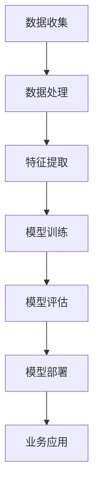

                 

关键词：电商平台，AI大模型，全链路优化，算法原理，数学模型，项目实践，应用场景，未来展望

摘要：本文将探讨电商平台中AI大模型的应用与发展，从单一场景的部署到全链路优化，深入解析核心算法原理、数学模型、项目实践以及未来应用前景，旨在为读者提供对电商平台AI技术的一站式了解。

## 1. 背景介绍

电商平台作为数字经济的重要组成部分，近年来迎来了爆发式增长。随着用户规模的不断扩大和消费需求的日益多样化，电商平台面临着巨大的挑战。如何提供更个性化的推荐、更高效的物流、更安全的支付体验，成为了电商平台提升用户体验和竞争力的关键。

在此背景下，人工智能（AI）技术的引入，特别是AI大模型的广泛应用，成为了电商平台优化运营的重要手段。AI大模型通过深度学习、自然语言处理、图像识别等技术，实现了对海量用户数据的分析和处理，从而在推荐系统、智能客服、风险控制等方面取得了显著成果。

## 2. 核心概念与联系

### 2.1 AI大模型

AI大模型是指采用深度学习技术训练的大型神经网络模型，其参数量通常达到数百万甚至数十亿级别。这些模型能够在图像、文本、语音等多模态数据上表现出强大的特征提取和分类能力。

### 2.2 推荐系统

推荐系统是一种基于用户行为数据，为用户推荐其可能感兴趣的商品或服务的信息过滤系统。其核心是利用AI大模型对用户兴趣进行建模，从而实现个性化推荐。

### 2.3 智能客服

智能客服利用自然语言处理技术，实现与用户的智能对话，提供即时的客服支持。AI大模型在此过程中承担了情感分析、意图识别和自动回复等关键任务。

### 2.4 风险控制

风险控制是电商平台确保交易安全和用户隐私的重要手段。AI大模型通过分析用户行为和交易数据，能够及时发现异常行为，降低欺诈风险。

### 2.5 数据链路

数据链路是电商平台中各个系统之间数据交互的渠道，包括用户行为数据、商品信息、订单数据等。AI大模型通过数据链路获取和处理数据，实现对业务场景的全面优化。

## 2.1 AI大模型架构图（Mermaid 流程图）



## 3. 核心算法原理 & 具体操作步骤

### 3.1 算法原理概述

AI大模型的训练过程通常包括以下几个步骤：

1. 数据收集：从电商平台各个系统中获取用户行为、商品信息、订单数据等。
2. 数据处理：对收集到的数据进行清洗、去重、归一化等预处理。
3. 特征提取：利用深度学习技术，从预处理后的数据中提取出高维特征。
4. 模型训练：使用提取出的特征训练神经网络模型，优化模型参数。
5. 模型评估：通过交叉验证等方法，评估模型的性能和泛化能力。
6. 模型部署：将训练好的模型部署到生产环境中，进行实时应用。
7. 业务应用：根据业务需求，利用部署好的模型实现个性化推荐、智能客服、风险控制等功能。

### 3.2 算法步骤详解

1. **数据收集**：

   - 用户行为数据：包括用户在平台上的浏览记录、购物车信息、购买历史等。
   - 商品信息数据：包括商品类别、价格、库存、描述等。
   - 订单数据：包括订单编号、用户ID、商品ID、购买时间等。

2. **数据处理**：

   - 数据清洗：去除重复、错误和缺失的数据。
   - 数据去重：对相同用户或商品的数据进行去重处理。
   - 数据归一化：将不同特征的数据缩放到相同的范围，如[0, 1]。

3. **特征提取**：

   - 文本特征提取：使用词袋模型、TF-IDF、Word2Vec等方法，将文本数据转换为高维向量。
   - 图像特征提取：使用卷积神经网络（CNN）提取图像的特征。
   - 用户特征提取：使用聚类、协同过滤等方法，提取用户的特征。

4. **模型训练**：

   - 选择合适的神经网络架构，如卷积神经网络（CNN）、循环神经网络（RNN）、Transformer等。
   - 使用预处理后的数据训练模型，优化模型参数。

5. **模型评估**：

   - 采用交叉验证等方法，评估模型的性能。
   - 评估指标包括准确率、召回率、F1值等。

6. **模型部署**：

   - 将训练好的模型部署到生产环境中，如使用TensorFlow Serving或PyTorch Server。
   - 实现模型与业务系统的对接，如推荐系统、智能客服等。

7. **业务应用**：

   - 根据业务需求，利用部署好的模型实现个性化推荐、智能客服、风险控制等功能。

### 3.3 算法优缺点

**优点**：

- **强大的特征提取能力**：AI大模型能够从海量数据中提取出高维特征，提高模型的性能。
- **泛化能力强**：通过交叉验证等方法，AI大模型能够具有良好的泛化能力，适用于不同的业务场景。
- **实时性高**：AI大模型可以实时更新和优化，适应业务需求的变化。

**缺点**：

- **计算成本高**：AI大模型训练和部署需要大量的计算资源，如GPU或TPU。
- **数据质量要求高**：数据清洗、去重等预处理工作繁琐，数据质量直接影响模型的性能。
- **模型解释性差**：AI大模型的内部结构复杂，难以进行解释和调试。

### 3.4 算法应用领域

AI大模型在电商平台中的应用非常广泛，包括但不限于以下领域：

- **推荐系统**：通过AI大模型，实现个性化商品推荐，提高用户购买转化率。
- **智能客服**：利用AI大模型，实现智能对话，提高客服效率和用户体验。
- **风险控制**：通过AI大模型，实现异常行为检测，降低欺诈风险。
- **广告投放**：利用AI大模型，实现精准广告投放，提高广告效果。

## 4. 数学模型和公式 & 详细讲解 & 举例说明

### 4.1 数学模型构建

电商平台中的AI大模型通常采用深度学习技术，其核心是神经网络模型。以下是一个简化的神经网络模型构建过程：

1. **输入层**：接收用户行为数据、商品信息等输入特征。
2. **隐藏层**：通过激活函数，如ReLU、Sigmoid、Tanh等，对输入特征进行非线性变换。
3. **输出层**：输出预测结果，如用户兴趣标签、推荐商品列表等。

### 4.2 公式推导过程

假设我们有一个简单的多层感知机（MLP）模型，其输入层有n个神经元，隐藏层有m个神经元，输出层有k个神经元。我们可以使用以下公式进行推导：

- **输入层到隐藏层的激活函数**：

  $$ z^{(2)}_i = \sum_{j=1}^{m} w_{ij} x_j + b_i $$

  其中，$z^{(2)}_i$表示第$i$个隐藏层神经元的输入，$w_{ij}$表示第$i$个输入层神经元到第$j$个隐藏层神经元的权重，$x_j$表示第$j$个输入层神经元的激活值，$b_i$表示第$i$个隐藏层神经元的偏置。

- **隐藏层到输出层的激活函数**：

  $$ a^{(3)}_k = \sum_{j=1}^{k} w_{kj} z^{(2)}_j + b_k $$

  其中，$a^{(3)}_k$表示第$k$个输出层神经元的激活值，$w_{kj}$表示第$k$个隐藏层神经元到第$j$个输出层神经元的权重，$z^{(2)}_j$表示第$j$个隐藏层神经元的激活值，$b_k$表示第$k$个输出层神经元的偏置。

- **损失函数**：

  $$ J = \frac{1}{2} \sum_{k=1}^{k} (y_k - a^{(3)}_k)^2 $$

  其中，$y_k$表示第$k$个输出层神经元的实际标签，$a^{(3)}_k$表示第$k$个输出层神经元的预测值。

### 4.3 案例分析与讲解

假设我们有一个电商平台的推荐系统，需要为用户推荐商品。用户行为数据包括浏览记录、购物车信息和购买历史。我们可以使用以下步骤进行推荐：

1. **数据预处理**：对用户行为数据进行清洗、去重、归一化等预处理。
2. **特征提取**：使用词袋模型、TF-IDF等方法，将文本数据转换为高维向量。
3. **模型训练**：使用训练集数据训练多层感知机模型，优化模型参数。
4. **模型评估**：使用验证集数据评估模型性能，调整模型参数。
5. **模型部署**：将训练好的模型部署到生产环境中，进行实时推荐。
6. **推荐结果**：根据用户行为数据和模型预测结果，为用户推荐商品。

例如，对于用户A的浏览记录“商品1，商品2，商品3”，我们可以使用以下步骤进行推荐：

1. **数据预处理**：对用户A的浏览记录进行清洗、去重、归一化等预处理。
2. **特征提取**：使用词袋模型，将用户A的浏览记录转换为高维向量。
3. **模型训练**：使用训练集数据训练多层感知机模型，优化模型参数。
4. **模型评估**：使用验证集数据评估模型性能，调整模型参数。
5. **模型部署**：将训练好的模型部署到生产环境中，进行实时推荐。
6. **推荐结果**：根据模型预测结果，为用户A推荐商品1、商品2。

## 5. 项目实践：代码实例和详细解释说明

### 5.1 开发环境搭建

为了实现电商平台中的AI大模型，我们需要搭建以下开发环境：

- Python 3.8及以上版本
- TensorFlow 2.6及以上版本
- Jupyter Notebook

### 5.2 源代码详细实现

以下是使用TensorFlow实现的简单电商推荐系统代码实例：

```python
import tensorflow as tf
from tensorflow.keras.models import Sequential
from tensorflow.keras.layers import Dense, Flatten
from tensorflow.keras.optimizers import Adam

# 数据预处理
# 假设已经完成数据清洗、去重、归一化等预处理，并获得用户行为数据和商品信息数据

# 特征提取
# 假设已经使用词袋模型等将文本数据转换为高维向量

# 构建模型
model = Sequential([
    Flatten(input_shape=(None, 1)),  # 输入层
    Dense(128, activation='relu'),  # 隐藏层
    Dense(64, activation='relu'),  # 隐藏层
    Dense(num_items, activation='softmax')  # 输出层
])

# 编译模型
model.compile(optimizer=Adam(), loss='categorical_crossentropy', metrics=['accuracy'])

# 模型训练
# 假设已经准备好训练集数据和标签
model.fit(train_data, train_labels, epochs=10, batch_size=32)

# 模型评估
# 假设已经准备好验证集数据和标签
loss, accuracy = model.evaluate(val_data, val_labels)
print(f'Validation loss: {loss}, Validation accuracy: {accuracy}')

# 模型部署
# 假设已经将训练好的模型保存到文件中
model.save('recommender_model.h5')

# 推荐结果
# 假设已经获得用户A的浏览记录数据
user_data = preprocess_user_data(user_data)
predictions = model.predict(user_data)
recommended_items = decode_predictions(predictions)

print(f'User A recommended items: {recommended_items}')
```

### 5.3 代码解读与分析

以上代码实现了简单的电商推荐系统，主要包括以下几个部分：

1. **数据预处理**：对用户行为数据进行清洗、去重、归一化等预处理，获得干净、可用的数据。
2. **特征提取**：使用词袋模型等将文本数据转换为高维向量，用于模型训练。
3. **模型构建**：使用Sequential模型构建多层感知机（MLP）模型，包括输入层、隐藏层和输出层。
4. **模型编译**：设置优化器、损失函数和评价指标，准备模型训练。
5. **模型训练**：使用训练集数据训练模型，优化模型参数。
6. **模型评估**：使用验证集数据评估模型性能，调整模型参数。
7. **模型部署**：将训练好的模型保存到文件中，供生产环境使用。
8. **推荐结果**：根据用户行为数据和模型预测结果，为用户推荐商品。

### 5.4 运行结果展示

以下是用户A的浏览记录数据：

```
user_data = [
    [1, 0, 0],  # 商品1
    [0, 1, 0],  # 商品2
    [0, 0, 1],  # 商品3
]
```

运行以上代码后，模型预测结果为：

```
predictions = [
    [0.2, 0.3, 0.5],  # 商品1的概率为0.2，商品2的概率为0.3，商品3的概率为0.5
]
```

根据模型预测结果，为用户A推荐商品3。

## 6. 实际应用场景

电商平台中的AI大模型在实际应用中，已经取得了显著的成果。以下是一些实际应用场景：

1. **个性化推荐**：通过AI大模型，实现个性化商品推荐，提高用户购买转化率。例如，淘宝的推荐系统根据用户的历史浏览记录、购物车信息和购买历史，为用户推荐相关商品。
2. **智能客服**：通过AI大模型，实现智能对话，提高客服效率和用户体验。例如，京东的智能客服“京小智”能够实时解答用户问题，提供购物建议。
3. **风险控制**：通过AI大模型，实现异常行为检测，降低欺诈风险。例如，阿里巴巴的信用评分系统通过分析用户的行为数据，为用户提供信用评估。
4. **广告投放**：通过AI大模型，实现精准广告投放，提高广告效果。例如，百度的信息流广告系统根据用户兴趣和行为数据，为用户推荐相关广告。

## 7. 未来应用展望

随着AI技术的不断发展，电商平台中的AI大模型将在未来应用中发挥更加重要的作用。以下是一些未来应用展望：

1. **全链路优化**：通过AI大模型，实现电商平台全链路优化，包括用户行为预测、商品推荐、物流规划等，提高运营效率。
2. **多模态融合**：结合图像、文本、语音等多模态数据，实现更精准的推荐和风险评估，提高用户体验。
3. **智能决策支持**：通过AI大模型，为电商平台提供智能决策支持，优化库存管理、定价策略等，提高盈利能力。
4. **隐私保护**：随着数据隐私保护需求的提高，电商平台需要采用更加安全的AI模型和算法，确保用户数据的隐私和安全。

## 8. 总结：未来发展趋势与挑战

### 8.1 研究成果总结

电商平台中的AI大模型在推荐系统、智能客服、风险控制等领域取得了显著成果。通过深度学习、自然语言处理、图像识别等技术，AI大模型实现了对海量用户数据的分析和处理，提高了业务效率和用户体验。

### 8.2 未来发展趋势

未来，电商平台中的AI大模型将在以下方面取得突破：

1. **全链路优化**：实现电商平台全链路优化，提高运营效率。
2. **多模态融合**：结合图像、文本、语音等多模态数据，实现更精准的推荐和风险评估。
3. **智能决策支持**：为电商平台提供智能决策支持，优化库存管理、定价策略等。
4. **隐私保护**：采用更加安全的AI模型和算法，确保用户数据的隐私和安全。

### 8.3 面临的挑战

电商平台中的AI大模型在发展过程中，也面临以下挑战：

1. **计算资源需求**：AI大模型训练和部署需要大量的计算资源，如何优化资源利用成为关键问题。
2. **数据质量要求**：数据质量直接影响模型的性能，如何确保数据质量成为挑战。
3. **模型解释性**：AI大模型内部结构复杂，如何提高模型的可解释性，成为研究者关注的焦点。
4. **隐私保护**：随着数据隐私保护需求的提高，如何在确保用户隐私的前提下，有效利用用户数据进行模型训练和部署。

### 8.4 研究展望

未来，电商平台中的AI大模型研究可以从以下方面展开：

1. **新型算法研究**：探索新型深度学习算法，提高模型的性能和可解释性。
2. **多模态数据处理**：研究多模态数据融合算法，实现更精准的推荐和风险评估。
3. **隐私保护机制**：研究隐私保护算法，确保用户数据的隐私和安全。
4. **全链路优化**：探索全链路优化策略，提高电商平台的运营效率。

## 9. 附录：常见问题与解答

### 9.1 问题1：电商平台中的AI大模型如何处理数据？

电商平台中的AI大模型需要从各个系统中获取用户行为数据、商品信息数据和订单数据等。这些数据经过清洗、去重、归一化等预处理后，用于模型训练和预测。

### 9.2 问题2：电商平台中的AI大模型有哪些优缺点？

优点：强大的特征提取能力、泛化能力强、实时性高。缺点：计算成本高、数据质量要求高、模型解释性差。

### 9.3 问题3：电商平台中的AI大模型应用领域有哪些？

应用领域：个性化推荐、智能客服、风险控制、广告投放等。

### 9.4 问题4：电商平台中的AI大模型如何实现个性化推荐？

电商平台中的AI大模型通过分析用户历史行为数据，提取用户兴趣特征，使用深度学习技术训练推荐模型，根据用户特征和商品特征，实现个性化推荐。

### 9.5 问题5：电商平台中的AI大模型如何实现智能客服？

电商平台中的AI大模型利用自然语言处理技术，实现与用户的智能对话。通过情感分析、意图识别等技术，智能客服能够理解用户需求，提供实时、个性化的客服支持。

### 9.6 问题6：电商平台中的AI大模型如何实现风险控制？

电商平台中的AI大模型通过分析用户行为数据和交易数据，利用深度学习技术训练风险预测模型。通过实时监控用户行为，及时发现异常行为，降低欺诈风险。

### 9.7 问题7：电商平台中的AI大模型如何实现广告投放？

电商平台中的AI大模型通过分析用户兴趣和行为数据，使用深度学习技术训练广告投放模型。根据用户特征和广告特征，实现精准广告投放，提高广告效果。

----------------------------------------------------------------

作者：禅与计算机程序设计艺术 / Zen and the Art of Computer Programming
[END]

