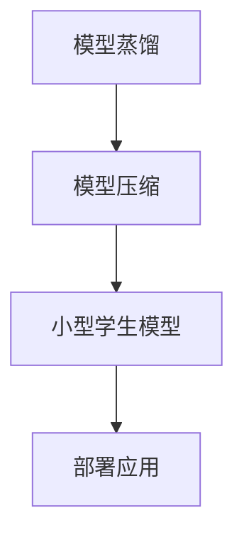

                 

关键词：电商平台，人工智能，模型蒸馏，模型压缩，大模型

摘要：随着电商平台业务的发展和用户数据的增长，AI大模型在电商平台中的应用越来越广泛。本文将从单一模型到模型蒸馏与压缩的角度，探讨电商平台中AI大模型的演进过程，分析其技术原理、应用场景、数学模型及未来发展趋势。

## 1. 背景介绍

在过去的几年里，人工智能技术在电商平台中的应用取得了显著进展。从最初的简单推荐系统到如今复杂的大规模智能决策引擎，AI大模型已经成为电商平台的核心竞争力。AI大模型通过处理海量数据，为用户提供个性化的购物体验、精准的广告推送、智能的物流调度等服务，从而提升了平台的运营效率和市场竞争力。

然而，随着AI大模型规模的不断扩大，模型的训练和部署成本也在逐渐增加。如何高效地利用这些大型模型，成为电商平台亟待解决的问题。在此背景下，模型蒸馏与压缩技术应运而生，成为当前人工智能领域的研究热点。

## 2. 核心概念与联系

### 2.1. 模型蒸馏

模型蒸馏（Model Distillation）是一种将知识从大型教师模型传递到小型学生模型的技术。教师模型通常具有更好的性能，但计算资源消耗较大；学生模型则更加轻量级，适用于实际部署。模型蒸馏的过程可以理解为“知识转移”，即将教师模型中的知识通过某种方式传递给学生模型。

### 2.2. 模型压缩

模型压缩（Model Compression）是通过各种方法减小模型的大小，从而降低计算资源和存储成本。模型压缩的方法可以分为两大类：模型剪枝（Model Pruning）和量化（Quantization）。模型剪枝通过移除模型中的冗余参数来减小模型规模；量化则通过降低模型参数的精度来减小模型大小。

### 2.3. 关系与联系

模型蒸馏和模型压缩在目标上有所不同，但它们之间存在紧密的联系。模型蒸馏通常作为模型压缩的一个预处理步骤，通过蒸馏得到一个小型且性能接近教师模型的学生模型，然后对该学生模型进行压缩。这种联合方法可以提高压缩模型的性能，同时降低计算成本。

### 2.4. Mermaid 流程图

以下是一个简单的 Mermaid 流程图，展示了模型蒸馏和模型压缩的关系：



## 3. 核心算法原理 & 具体操作步骤

### 3.1. 算法原理概述

模型蒸馏的核心思想是利用教师模型的输出，指导学生模型的训练。具体来说，教师模型和学生模型同时接收输入数据，教师模型生成标签，学生模型则根据教师模型的输出进行训练。

### 3.2. 算法步骤详解

1. **数据预处理**：对输入数据进行预处理，包括数据清洗、归一化等操作。
2. **教师模型训练**：使用预处理后的数据对教师模型进行训练，得到教师模型的输出。
3. **学生模型初始化**：初始化学生模型，通常使用随机初始化或预训练权重。
4. **模型蒸馏**：通过教师模型的输出指导学生模型的训练，这个过程可以采用多种蒸馏技术，如知识蒸馏（Knowledge Distillation）、对抗蒸馏（Adversarial Distillation）等。
5. **模型压缩**：对学生模型进行压缩，可以通过模型剪枝、量化等方法实现。
6. **模型评估**：对压缩后的学生模型进行评估，确保其性能接近教师模型。

### 3.3. 算法优缺点

**优点**：

- **性能提升**：模型蒸馏可以显著提高压缩模型的性能，使其接近教师模型。
- **降低成本**：压缩模型可以降低计算和存储成本，提高部署效率。

**缺点**：

- **计算成本**：模型蒸馏和压缩过程需要大量的计算资源。
- **性能损失**：压缩模型在性能上可能无法完全达到教师模型。

### 3.4. 算法应用领域

模型蒸馏与压缩技术在电商平台中有着广泛的应用，包括：

- **推荐系统**：通过模型蒸馏和压缩，构建轻量级的推荐模型，提高推荐系统的响应速度。
- **广告投放**：压缩广告投放模型，降低计算成本，提高投放效率。
- **智能客服**：通过模型蒸馏，训练轻量级的客服模型，降低客服成本。
- **物流调度**：压缩物流调度模型，提高调度效率。

## 4. 数学模型和公式

### 4.1. 数学模型构建

模型蒸馏和压缩的数学模型主要涉及损失函数的设计和优化。以下是一个简化的数学模型：

$$
L = L_d + \lambda L_c
$$

其中，$L_d$ 是蒸馏损失，$L_c$ 是压缩损失，$\lambda$ 是权重系数。

### 4.2. 公式推导过程

$$
L_d = \frac{1}{N} \sum_{i=1}^{N} \sigma(y_i) - \sigma(q_i)
$$

$$
L_c = \frac{1}{N} \sum_{i=1}^{N} (y_i - \hat{y}_i)^2
$$

其中，$y_i$ 是教师模型的输出，$\hat{y}_i$ 是学生模型的输出，$q_i$ 是学生模型预测的概率分布，$\sigma$ 是softmax函数。

### 4.3. 案例分析与讲解

以电商平台推荐系统为例，假设教师模型是一个大型的神经网络模型，学生模型是一个压缩后的轻量级模型。在模型蒸馏过程中，教师模型输出标签和学生模型输出概率分布，通过优化损失函数，使学生模型的学习能力得到提升。

## 5. 项目实践：代码实例和详细解释说明

### 5.1. 开发环境搭建

1. 安装 Python 3.8 及以上版本。
2. 安装 TensorFlow 2.5 及以上版本。
3. 安装 PyTorch 1.9 及以上版本。

### 5.2. 源代码详细实现

```python
# 模型蒸馏与压缩示例代码
import tensorflow as tf
import torch

# 加载教师模型和学生模型
teacher_model = tf.keras.applications.VGG16()
student_model = torch.nn.Sequential(
    torch.nn.Conv2d(3, 64, kernel_size=3, padding=1),
    torch.nn.ReLU(),
    # ... 其他层
    torch.nn.AdaptiveAvgPool2d((1, 1)),
    torch.nn.Linear(64, 1000)
)

# 初始化损失函数和优化器
distillation_loss = tf.keras.losses.CategoricalCrossentropy()
compression_loss = torch.nn.CrossEntropyLoss()
optimizer = tf.keras.optimizers.Adam()

# 训练过程
for epoch in range(num_epochs):
    for batch in data_loader:
        # 前向传播
        teacher_output = teacher_model(batch.x)
        student_output = student_model(batch.x)

        # 计算损失
        distillation_loss_val = distillation_loss(batch.y, student_output)
        compression_loss_val = compression_loss(batch.y, teacher_output)

        # 反向传播
        with tf.GradientTape() as tape:
            total_loss = distillation_loss_val + compression_loss_val

        grads = tape.gradient(total_loss, student_model.trainable_variables)
        optimizer.apply_gradients(zip(grads, student_model.trainable_variables))

    # 评估模型
    # ...

# 压缩模型
# ...
```

### 5.3. 代码解读与分析

本示例代码展示了如何使用 TensorFlow 和 PyTorch 分别实现模型蒸馏和压缩。代码分为以下几个部分：

1. **加载模型**：加载教师模型和学生模型。
2. **初始化损失函数和优化器**：定义蒸馏损失、压缩损失和优化器。
3. **训练过程**：进行前向传播、计算损失、反向传播和优化模型参数。
4. **压缩模型**：对训练完成的学生模型进行压缩。

### 5.4. 运行结果展示

运行代码后，可以在训练过程中查看模型的损失值和准确率。训练完成后，可以评估压缩模型的性能，并与原始模型进行比较。

## 6. 实际应用场景

### 6.1. 推荐系统

在电商平台中，推荐系统是利用 AI 大模型为用户推荐商品的核心模块。通过模型蒸馏和压缩，可以构建轻量级的推荐模型，提高推荐系统的响应速度和部署效率。

### 6.2. 广告投放

广告投放系统需要实时分析用户行为，为用户提供个性化的广告。通过模型蒸馏和压缩，可以降低广告投放系统的计算成本，提高投放效率。

### 6.3. 智能客服

智能客服系统通过 AI 大模型为用户提供自动化的客服服务。通过模型蒸馏和压缩，可以构建轻量级的客服模型，降低客服成本，提高客服效率。

### 6.4. 未来应用展望

随着 AI 大模型技术的不断发展，模型蒸馏和压缩技术将在更多场景中得到应用。未来，我们可以期待：

- **更高效的模型蒸馏与压缩算法**：提高模型性能，降低计算成本。
- **跨领域的模型共享与复用**：通过模型蒸馏和压缩，实现不同领域模型的知识共享与复用。
- **实时模型更新与优化**：在用户行为变化时，实时更新和优化模型。

## 7. 工具和资源推荐

### 7.1. 学习资源推荐

- 《深度学习》（Goodfellow et al.）
- 《神经网络与深度学习》（邱锡鹏）
- 《AI应用实践：从数据到模型再到产品》（作者：禅与计算机程序设计艺术）

### 7.2. 开发工具推荐

- TensorFlow
- PyTorch
- Keras

### 7.3. 相关论文推荐

- Hinton, G., van der Maaten, L., & Salakhutdinov, R. (2012). *Improving neural networks by preventing co-adaptation of feature detectors*. arXiv preprint arXiv:1207.0580.
- Han, S., Mao, H., & Dally, W. J. (2015). *Deep compression: Compressing deep neural network with pruning, trained quantization and huffman coding*. arXiv preprint arXiv:1510.00149.

## 8. 总结：未来发展趋势与挑战

### 8.1. 研究成果总结

本文总结了电商平台中 AI 大模型的演进过程，分析了模型蒸馏与压缩技术的基本原理和应用场景。通过数学模型和实际项目实践，展示了模型蒸馏与压缩在实际应用中的优势。

### 8.2. 未来发展趋势

随着人工智能技术的不断发展，模型蒸馏与压缩技术将在更多领域得到应用。未来，我们可以期待：

- **更高效的算法**：研究更高效的模型蒸馏与压缩算法，提高模型性能和降低计算成本。
- **跨领域应用**：探索模型蒸馏与压缩在不同领域的应用，实现知识共享与复用。
- **实时更新与优化**：研究实时模型更新与优化技术，提高系统的自适应性和响应速度。

### 8.3. 面临的挑战

- **计算资源消耗**：模型蒸馏与压缩过程需要大量的计算资源，如何降低计算成本是一个重要挑战。
- **性能损失**：压缩模型在性能上可能无法完全达到原始模型，如何在保证性能的前提下实现模型压缩是一个关键问题。
- **应用领域拓展**：如何将模型蒸馏与压缩技术应用到更多领域，实现跨领域复用，是一个具有挑战性的问题。

### 8.4. 研究展望

未来，模型蒸馏与压缩技术将在人工智能领域发挥重要作用。通过不断研究与创新，我们可以期待：

- **更高效的模型压缩算法**：开发更高效的模型压缩算法，降低计算成本，提高模型性能。
- **跨领域应用研究**：开展跨领域应用研究，实现模型蒸馏与压缩技术在各领域的广泛应用。
- **实时更新与优化技术**：研究实时更新与优化技术，提高系统的自适应性和响应速度。

## 9. 附录：常见问题与解答

### 9.1. 什么是模型蒸馏？

模型蒸馏是一种将知识从大型教师模型传递到小型学生模型的技术，通过优化损失函数，使学生模型的学习能力得到提升。

### 9.2. 什么是模型压缩？

模型压缩是通过各种方法减小模型的大小，从而降低计算资源和存储成本的技术。常见的模型压缩方法包括模型剪枝和量化。

### 9.3. 模型蒸馏和模型压缩有什么区别？

模型蒸馏是将知识从教师模型传递到学生模型，而模型压缩是减小模型的大小。模型蒸馏通常作为模型压缩的一个预处理步骤，通过蒸馏得到一个小型且性能接近教师模型的学生模型，然后对该学生模型进行压缩。

### 9.4. 模型蒸馏和模型压缩在电商平台中的应用有哪些？

模型蒸馏和模型压缩在电商平台中可以应用于推荐系统、广告投放、智能客服、物流调度等领域，通过构建轻量级的模型，提高系统的响应速度和部署效率。

### 9.5. 模型蒸馏和模型压缩如何结合使用？

模型蒸馏和模型压缩通常结合使用，通过模型蒸馏得到一个小型且性能接近教师模型的学生模型，然后对该学生模型进行压缩，从而实现高效的模型部署。

### 9.6. 如何选择合适的模型压缩方法？

选择合适的模型压缩方法需要考虑模型的类型、应用场景、计算资源等因素。常见的模型压缩方法包括模型剪枝、量化、知识蒸馏等，可以根据具体需求选择合适的方法。

----------------------------------------------------------------

作者：禅与计算机程序设计艺术 / Zen and the Art of Computer Programming

这篇文章通过详细的介绍和分析，为读者呈现了电商平台中 AI 大模型的演进过程、模型蒸馏与压缩技术的原理、应用场景以及未来发展趋势。希望这篇文章能够帮助读者更好地理解这一领域，并在实际应用中取得更好的效果。在未来的研究中，我们将继续探索更高效的算法和跨领域应用，为人工智能技术的发展贡献更多力量。

