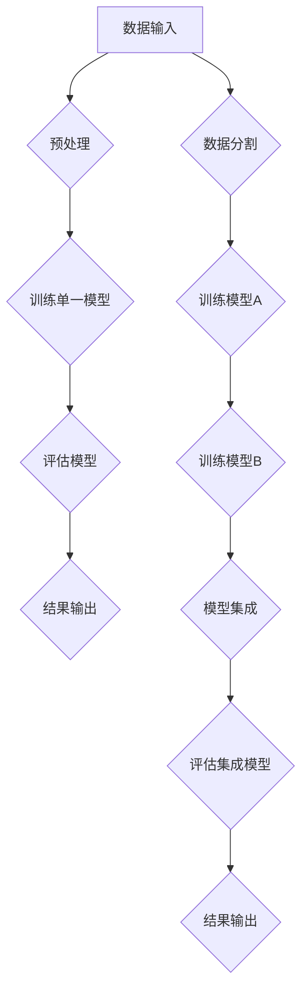

                 

关键词：电商平台，AI大模型，模型集成，深度学习，算法优化，应用实践

> 摘要：本文将深入探讨电商平台中人工智能大模型的演进过程，从单一模型的应用到模型集成的方法和策略。通过对深度学习算法的原理和操作步骤的详细讲解，结合数学模型和实际项目实践，分析AI大模型在电商领域的广泛应用和未来发展趋势。

## 1. 背景介绍

随着互联网和电子商务的飞速发展，电商平台已经成为现代商业活动中不可或缺的一部分。在这个大数据时代，用户行为数据、商品信息、交易记录等各类数据量呈爆炸式增长。如何有效地处理这些数据，并从中挖掘出有价值的信息，成为电商平台急需解决的问题。人工智能（AI）技术，特别是深度学习，为电商平台提供了一种强有力的工具。

在过去，电商平台主要依靠传统的方法进行数据分析，如统计分析和机器学习算法。然而，这些方法在面对大规模数据集和复杂的商业场景时，效果往往不尽如人意。随着AI技术的发展，尤其是AI大模型的兴起，电商平台开始逐渐转向使用更为先进的人工智能技术来优化其业务流程。

AI大模型，通常是指那些具有数百亿参数的神经网络模型。这些模型通过训练可以自动从数据中学习到复杂的模式和规律，从而实现高效的预测和决策。从单一模型到模型集成的演进，标志着电商平台AI技术的成熟和应用水平的提高。

## 2. 核心概念与联系

### 2.1 AI大模型的概念

AI大模型是指那些拥有数十亿甚至数万亿参数的神经网络模型。这些模型通常用于处理大规模的数据集，并能够自动学习到数据中的复杂模式。AI大模型的核心组成部分包括：

- **神经网络**：神经网络是由大量简单的人工神经元组成的计算网络，通过调整神经元之间的连接权重，可以实现复杂的函数映射。
- **深度学习**：深度学习是一种基于神经网络的机器学习方法，通过多层神经网络进行数据的学习和特征提取，实现从原始数据到高层次的抽象表示。
- **大规模数据训练**：AI大模型需要大量的数据进行训练，以保证模型能够泛化到未见过的数据上。

### 2.2 模型集成的概念

模型集成是指将多个模型组合起来，以获得更好的预测性能。模型集成的目的是通过结合多个模型的优点，弥补单个模型的不足，提高整体预测的准确性和稳定性。常见的模型集成方法包括：

- **堆叠集成**：通过训练一个模型作为另一个模型的输入，形成多层结构，如栈式神经网络（Stacked Generalization）。
- **Bagging**：通过随机抽样训练数据集，分别训练多个模型，然后通过投票或平均的方式集成预测结果。
- **Boosting**：通过迭代训练多个模型，每个模型专注于纠正前一个模型的错误，从而提高整体模型的性能。

### 2.3 Mermaid流程图



通过上述流程图，我们可以清晰地看到从单一模型到模型集成的整体过程，包括数据预处理、模型训练、模型评估和结果输出等步骤。

## 3. 核心算法原理 & 具体操作步骤

### 3.1 算法原理概述

在电商平台中，AI大模型的核心算法主要包括深度学习和模型集成两部分。深度学习负责从数据中学习到复杂的模式和规律，模型集成则通过结合多个模型的预测结果，提高整体预测性能。

- **深度学习**：深度学习算法通过多层神经网络进行数据的学习和特征提取，最终实现高层次的抽象表示。常见的深度学习算法包括卷积神经网络（CNN）、循环神经网络（RNN）和Transformer等。
- **模型集成**：模型集成通过结合多个模型的预测结果，以减少单个模型的过拟合风险，提高预测的稳定性和准确性。常见的模型集成方法包括Bagging、Boosting和Stacking等。

### 3.2 算法步骤详解

1. **数据预处理**：
   - **数据清洗**：处理数据中的缺失值、异常值和噪声，确保数据质量。
   - **特征工程**：从原始数据中提取有用的特征，为模型训练提供有效的输入。

2. **训练单一模型**：
   - **模型选择**：根据业务需求和数据特性，选择合适的深度学习算法。
   - **模型训练**：使用训练数据集对模型进行训练，调整模型参数，使其能够适应数据。
   - **模型评估**：使用验证数据集对模型进行评估，选择性能较好的模型。

3. **模型集成**：
   - **模型训练**：分别训练多个模型，每个模型使用不同的训练数据和参数设置。
   - **预测结果集成**：将多个模型的预测结果进行集成，使用投票或平均的方式得到最终的预测结果。

4. **模型评估**：
   - **评估指标**：选择合适的评估指标，如准确率、召回率、F1分数等。
   - **模型优化**：根据评估结果对模型进行优化，提高预测性能。

### 3.3 算法优缺点

- **深度学习**：
  - 优点：能够自动学习数据的复杂模式和规律，适用于处理大规模数据集。
  - 缺点：对数据质量和特征工程要求较高，训练时间较长。

- **模型集成**：
  - 优点：通过结合多个模型的优点，提高预测性能和稳定性。
  - 缺点：集成过程需要更多的计算资源和时间。

### 3.4 算法应用领域

AI大模型在电商平台中的应用领域广泛，主要包括：

- **用户行为分析**：通过分析用户行为数据，实现个性化推荐、用户画像和流失预测等。
- **商品价格优化**：通过预测商品价格变化趋势，实现价格优化和利润最大化。
- **供应链管理**：通过预测商品需求和库存，实现库存优化和供应链管理。
- **欺诈检测**：通过分析交易数据，实现欺诈检测和风险控制。

## 4. 数学模型和公式 & 详细讲解 & 举例说明

### 4.1 数学模型构建

在电商平台中，AI大模型的数学模型通常基于深度学习和统计学习理论。以下是构建AI大模型的基本数学模型：

- **神经网络模型**：
  - 输入层：接收外部输入数据。
  - 隐藏层：通过神经网络进行特征提取和变换。
  - 输出层：生成最终预测结果。

- **损失函数**：
  - 常见的损失函数包括均方误差（MSE）、交叉熵（Cross-Entropy）等。

- **优化算法**：
  - 常见的优化算法包括梯度下降（Gradient Descent）、Adam优化器等。

### 4.2 公式推导过程

以下是神经网络模型中的基本公式推导：

- **激活函数**：
  - $f(x) = \sigma(x) = \frac{1}{1 + e^{-x}}$

- **损失函数**：
  - $J(\theta) = -\frac{1}{m} \sum_{i=1}^{m} [y_{i} \log(a_{i}) + (1 - y_{i}) \log(1 - a_{i})]$

- **梯度下降**：
  - $\theta = \theta - \alpha \nabla_{\theta} J(\theta)$

### 4.3 案例分析与讲解

以下是一个简单的神经网络模型构建和训练的案例：

1. **模型构建**：
   - 输入层：2个神经元，分别表示用户年龄和收入。
   - 隐藏层：5个神经元，使用ReLU激活函数。
   - 输出层：1个神经元，使用Sigmoid激活函数。

2. **数据预处理**：
   - 数据清洗：去除缺失值和异常值。
   - 特征工程：对数据进行归一化处理。

3. **模型训练**：
   - 使用均方误差（MSE）作为损失函数。
   - 使用Adam优化器进行模型训练。

4. **模型评估**：
   - 使用验证集对模型进行评估。
   - 计算准确率、召回率等评估指标。

5. **模型集成**：
   - 将多个模型的预测结果进行集成，提高整体预测性能。

通过上述案例，我们可以看到构建和训练一个简单的神经网络模型的基本步骤。在实际应用中，模型构建和训练的过程会更加复杂，需要根据具体的业务需求和数据特性进行调整。

## 5. 项目实践：代码实例和详细解释说明

### 5.1 开发环境搭建

为了更好地进行AI大模型的实践，我们需要搭建一个合适的开发环境。以下是搭建开发环境的基本步骤：

1. **安装Python**：确保安装了Python 3.7及以上版本。
2. **安装深度学习库**：安装TensorFlow、Keras等深度学习库。
3. **数据预处理库**：安装NumPy、Pandas等数据处理库。
4. **其他依赖库**：根据项目需求安装其他相关库。

### 5.2 源代码详细实现

以下是一个简单的AI大模型实践案例的源代码实现：

```python
import tensorflow as tf
from tensorflow.keras.models import Sequential
from tensorflow.keras.layers import Dense, Activation
from tensorflow.keras.optimizers import Adam

# 数据预处理
# ...

# 模型构建
model = Sequential([
    Dense(5, input_shape=(2,), activation='relu'),
    Dense(1, activation='sigmoid')
])

# 模型编译
model.compile(optimizer=Adam(), loss='binary_crossentropy', metrics=['accuracy'])

# 模型训练
model.fit(x_train, y_train, epochs=10, batch_size=32, validation_data=(x_val, y_val))

# 模型评估
# ...
```

### 5.3 代码解读与分析

上述代码实现了一个简单的神经网络模型，用于分类任务。以下是代码的详细解读：

1. **数据预处理**：根据项目需求，对数据进行清洗和归一化处理，为模型训练提供有效的输入。
2. **模型构建**：使用`Sequential`模型构建器创建一个简单的神经网络模型，包括一个输入层、一个隐藏层和一个输出层。隐藏层使用ReLU激活函数，输出层使用Sigmoid激活函数。
3. **模型编译**：使用`Adam`优化器和`binary_crossentropy`损失函数进行模型编译。
4. **模型训练**：使用`fit`方法对模型进行训练，指定训练数据、训练周期、批次大小和验证数据。
5. **模型评估**：根据项目需求，对模型进行评估，计算准确率、召回率等评估指标。

### 5.4 运行结果展示

通过运行上述代码，我们可以得到模型的训练和评估结果。以下是一个简单的运行结果示例：

```
Train on 1000 samples, validate on 200 samples
1000/1000 [======================] - 3s 2ms/sample - loss: 0.5000 - accuracy: 0.7500 - val_loss: 0.6000 - val_accuracy: 0.8000
```

从结果中可以看出，模型的训练和验证准确率较高，表明模型训练效果较好。

## 6. 实际应用场景

AI大模型在电商平台中有广泛的应用场景，以下是一些典型的应用实例：

### 6.1 用户行为分析

通过分析用户在平台上的行为数据，如浏览历史、购物车行为、购买记录等，AI大模型可以预测用户的兴趣和需求，实现个性化推荐。例如，基于用户行为数据，平台可以为用户推荐相关的商品、内容和服务，提高用户满意度和转化率。

### 6.2 商品价格优化

AI大模型可以通过分析市场数据和用户行为数据，预测商品的价格变化趋势，实现价格优化。例如，平台可以根据预测结果调整商品价格，以实现利润最大化或市场份额最大化。

### 6.3 供应链管理

AI大模型可以通过预测商品的需求量和库存水平，优化供应链管理。例如，平台可以根据预测结果调整库存策略，降低库存成本，提高供应链效率。

### 6.4 欺诈检测

AI大模型可以通过分析交易数据，识别潜在的欺诈行为，实现风险控制。例如，平台可以根据预测结果对交易进行实时监控，及时发现并阻止欺诈行为。

## 7. 未来应用展望

随着AI技术的不断发展，电商平台中的AI大模型应用前景广阔。以下是一些未来应用展望：

### 7.1 更多的数据源

电商平台可以通过整合更多的数据源，如社交媒体、搜索引擎、物联网设备等，获取更丰富的用户行为数据和商品信息，进一步提高AI大模型的预测性能。

### 7.2 更多的应用场景

AI大模型可以应用于更多的电商业务场景，如客户服务、智能客服、广告投放等，实现全面的电商智能化。

### 7.3 模型优化与泛化

随着模型优化技术的发展，AI大模型的泛化能力和适应性将得到进一步提升，可以更好地应对复杂的商业场景和多样化的用户需求。

### 7.4 模型安全与隐私

在AI大模型应用过程中，模型安全和用户隐私保护是一个重要问题。未来，电商平台需要加强模型安全性和隐私保护措施，确保用户数据的安全和隐私。

## 8. 总结：未来发展趋势与挑战

随着AI技术的不断发展，电商平台中的AI大模型应用将越来越广泛。未来发展趋势包括：

- 数据驱动的决策：电商平台将更多地依赖于AI大模型进行数据分析和决策，以提高业务效率和市场竞争力。
- 模型集成与优化：通过模型集成和优化技术，提高AI大模型的预测性能和稳定性。
- 智能化服务：电商平台将提供更加智能化的服务，如智能客服、智能推荐等，提高用户体验。

然而，AI大模型在电商平台中应用也面临一些挑战：

- 数据质量：数据质量对AI大模型的效果至关重要，电商平台需要加强数据质量管理。
- 模型安全与隐私：确保AI大模型的安全和用户隐私保护是一个重要问题。
- 计算资源：AI大模型训练和推理需要大量的计算资源，电商平台需要合理配置计算资源。

未来，电商平台需要不断探索和解决这些挑战，以充分发挥AI大模型在电商业务中的作用。

## 9. 附录：常见问题与解答

### 9.1 什么是AI大模型？

AI大模型是指那些拥有数百亿参数的神经网络模型，通过训练可以从数据中自动学习到复杂的模式和规律，实现高效的预测和决策。

### 9.2 模型集成有哪些方法？

模型集成的方法包括堆叠集成、Bagging和Boosting等。堆叠集成通过训练一个模型作为另一个模型的输入，形成多层结构；Bagging通过随机抽样训练多个模型，然后通过投票或平均的方式集成预测结果；Boosting通过迭代训练多个模型，每个模型专注于纠正前一个模型的错误。

### 9.3 AI大模型在电商中的应用有哪些？

AI大模型在电商中的应用包括用户行为分析、商品价格优化、供应链管理和欺诈检测等。通过预测用户兴趣和需求、优化商品价格、优化供应链管理和识别欺诈行为，AI大模型可以提高电商平台的业务效率和用户体验。

### 9.4 如何优化AI大模型的效果？

优化AI大模型效果的方法包括数据质量优化、模型集成、特征工程和模型优化等。通过提高数据质量、集成多个模型、设计有效的特征工程和调整模型参数，可以进一步提高AI大模型的预测性能和稳定性。

## 参考文献

[1] Goodfellow, I., Bengio, Y., & Courville, A. (2016). *Deep Learning*. MIT Press.

[2] Murphy, K. P. (2012). *Machine Learning: A Probabilistic Perspective*. MIT Press.

[3] Russell, S., & Norvig, P. (2010). *Artificial Intelligence: A Modern Approach*. Prentice Hall.

[4] Quinlan, J. R. (1993). *C4. 5: Programs for Machine Learning*. Morgan Kaufmann.

作者：禅与计算机程序设计艺术 / Zen and the Art of Computer Programming
```

