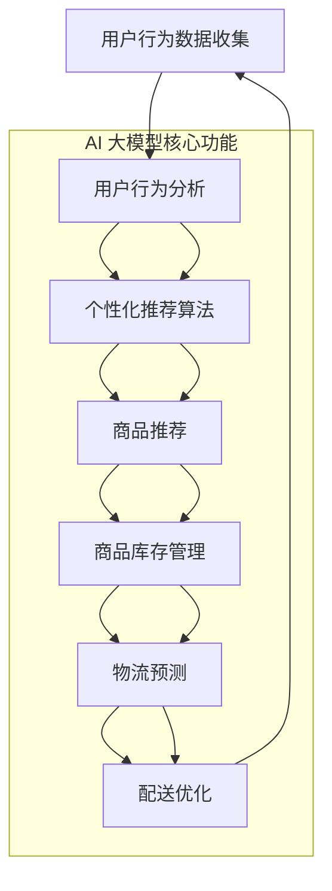

                 

在当今的信息化时代，人工智能（AI）已经成为了电商平台发展的核心驱动力。特别是在大数据和云计算技术的推动下，电商平台通过AI技术不仅能够实现用户行为的分析、个性化推荐，还可以进行商品库存管理、物流预测等。本文将探讨电商平台中AI大模型的发展，特别是如何从传统的被动响应模式转向主动预测与干预，提升电商平台的服务质量与竞争力。

## 关键词

- 电商平台
- AI大模型
- 被动响应
- 主动预测
- 干预
- 个性化推荐
- 商品库存管理

## 摘要

本文首先介绍了电商平台中AI技术的重要性，然后深入探讨了AI大模型从被动响应到主动预测与干预的演变过程。通过分析核心概念与架构，详细讲解了核心算法原理和数学模型，以及通过实际项目实践展示了代码实例和运行结果。最后，文章讨论了AI大模型在实际应用场景中的表现和未来发展的前景，并提出了相关工具和资源的推荐，以及对未来研究和挑战的展望。

## 1. 背景介绍

随着互联网技术的飞速发展，电商平台已经成为现代商业的重要组成部分。电商平台通过提供线上购物渠道，不仅满足了消费者对便捷购物的需求，同时也为企业提供了庞大的市场空间。然而，随着市场环境的日益复杂和消费者需求的不断变化，电商平台面临着诸多挑战。为了应对这些挑战，AI技术的引入成为了一项必要举措。

在过去，电商平台主要依赖传统的数据分析和统计方法来进行用户行为分析和商品推荐。这些方法往往局限于历史数据的分析和用户行为的被动响应。例如，通过分析用户的历史购买记录和浏览记录，推荐相似的或者受欢迎的商品。然而，这种方法存在明显的局限性，它无法预测用户未来的行为，也无法根据用户的实时反馈进行及时调整。

随着AI技术的不断进步，特别是在深度学习和大数据分析领域的突破，电商平台开始探索更为先进的AI模型，以实现从被动响应到主动预测与干预的转变。这种转变不仅能够提高电商平台的响应速度，还能够实现更加精准的用户体验和商品推荐。

本文将围绕AI大模型在电商平台中的应用，探讨其在预测和干预方面的核心技术，以及如何通过这些技术提升电商平台的竞争力。具体来说，文章将涵盖以下内容：

1. 核心概念与架构的介绍
2. 核心算法原理与步骤详解
3. 数学模型与公式推导
4. 项目实践与代码实例
5. 实际应用场景分析
6. 未来发展趋势与展望
7. 工具和资源推荐
8. 总结与展望

通过本文的探讨，希望能够为电商平台在AI技术应用方面提供一些有价值的参考和思路。

## 2. 核心概念与联系

在探讨电商平台中的AI大模型之前，我们需要明确一些核心概念，并理解它们之间的联系。以下是本文中将要涉及的主要概念：

- **用户行为分析**：通过收集和分析用户在电商平台上的行为数据，如浏览、搜索、购买等，来了解用户的偏好和需求。
- **个性化推荐**：基于用户的行为数据，利用机器学习算法生成个性化的商品推荐，提高用户满意度和转化率。
- **商品库存管理**：通过预测商品的销量，合理安排库存，减少库存积压和缺货现象，提高库存周转率。
- **物流预测**：预测订单的配送时间和路径，优化物流流程，提高配送效率。
- **主动预测与干预**：不仅仅是基于历史数据的被动响应，而是通过实时数据分析和机器学习预测用户行为，并进行主动干预，提供更个性化的服务和更好的用户体验。

### Mermaid 流程图

为了更好地展示这些概念之间的联系，我们使用Mermaid流程图来描述它们之间的逻辑关系。



在这个流程图中，用户行为数据是整个AI大模型的输入，经过用户行为分析后，个性化推荐算法生成推荐列表，推荐给用户。这些推荐结果进一步用于商品库存管理和物流预测，最终实现配送优化。

### 核心概念原理

1. **用户行为分析**：
   - 基于历史数据（如购买记录、浏览历史）和实时行为（如页面停留时间、点击率）。
   - 使用数据挖掘和机器学习技术，如聚类分析、关联规则挖掘、协同过滤等。
   - 分析结果包括用户兴趣、偏好、行为模式等。

2. **个性化推荐**：
   - 使用协同过滤、矩阵分解、深度学习等方法。
   - 基于用户的历史行为和兴趣，为每个用户生成个性化的推荐列表。
   - 推荐系统不仅要准确，还要新颖和有吸引力。

3. **商品库存管理**：
   - 通过销量预测和库存分析，制定最优的库存策略。
   - 结合历史销售数据和实时市场变化，预测未来的销售趋势。
   - 优化库存水平，避免缺货和库存积压。

4. **物流预测**：
   - 利用订单数据、配送历史和实时交通数据，预测订单的配送时间和路径。
   - 采用优化算法（如遗传算法、模拟退火算法）进行配送路径优化。
   - 提高配送效率，降低物流成本。

5. **主动预测与干预**：
   - 基于实时数据和机器学习模型，预测用户行为并主动进行干预。
   - 例如，根据用户的购买历史和当前行为，提前推送相关商品或优惠券。
   - 提高用户体验，增加用户粘性和转化率。

通过这些核心概念和流程的介绍，我们可以更清晰地理解AI大模型在电商平台中的作用和优势。接下来，我们将深入探讨这些核心算法的原理和操作步骤。

## 3. 核心算法原理 & 具体操作步骤

### 3.1 算法原理概述

电商平台中的AI大模型主要依赖于机器学习和深度学习算法来实现用户行为预测、个性化推荐、商品库存管理和物流预测等功能。以下是这些算法的基本原理和常见方法：

1. **用户行为分析**：
   - **协同过滤（Collaborative Filtering）**：基于用户的共同兴趣或行为进行推荐，分为用户基于的协同过滤和项目基于的协同过滤。
   - **矩阵分解（Matrix Factorization）**：通过分解用户和商品的评分矩阵来预测用户未评分的商品。
   - **深度学习（Deep Learning）**：使用神经网络模型（如卷积神经网络、递归神经网络等）对用户行为数据进行处理和预测。

2. **个性化推荐**：
   - **基于内容的推荐（Content-based Recommendation）**：通过分析商品的特征（如类别、标签、描述等）来为用户推荐类似的商品。
   - **基于模型的推荐（Model-based Recommendation）**：使用机器学习算法（如决策树、支持向量机等）构建用户和商品之间的关联模型。

3. **商品库存管理**：
   - **时间序列预测（Time Series Forecasting）**：使用时间序列分析方法（如ARIMA、LSTM等）预测商品的销售趋势。
   - **优化算法（Optimization Algorithms）**：如线性规划、遗传算法等，用于解决库存优化问题。

4. **物流预测**：
   - **路径规划（Path Planning）**：使用图论算法（如Dijkstra算法、A*算法等）预测订单的配送路径。
   - **交通预测（Traffic Forecasting）**：基于实时交通数据和历史数据，预测交通状况和配送时间。

### 3.2 算法步骤详解

#### 3.2.1 用户行为分析

1. **数据收集**：
   - 收集用户在平台上的行为数据，如浏览历史、搜索记录、购买记录等。
   - 数据来源可以是服务器日志、数据库等。

2. **数据预处理**：
   - 清洗数据，去除缺失值、异常值和重复值。
   - 进行数据转换，如将文本转换为数字编码、日期时间转换为标准格式等。

3. **特征提取**：
   - 提取用户行为数据中的关键特征，如用户访问频次、浏览时长、购买频率等。
   - 使用技术如TF-IDF、词嵌入等对文本数据进行处理。

4. **模型训练**：
   - 使用机器学习算法（如K-means、Apriori等）进行用户行为分析，构建用户画像。
   - 通过模型评估（如准确率、召回率等）选择最优模型。

5. **结果应用**：
   - 根据用户画像进行个性化推荐。
   - 辅助商品库存管理和物流预测。

#### 3.2.2 个性化推荐

1. **协同过滤**：
   - 计算用户之间的相似度，通常使用余弦相似度、皮尔逊相关系数等方法。
   - 根据相似度计算邻居用户的行为，生成推荐列表。

2. **矩阵分解**：
   - 将用户-商品评分矩阵分解为用户特征矩阵和商品特征矩阵。
   - 使用交替最小二乘法（ALS）等优化算法进行矩阵分解。

3. **深度学习**：
   - 构建神经网络模型，如卷积神经网络（CNN）、递归神经网络（RNN）等。
   - 使用用户和商品的特征数据进行模型训练。

4. **模型评估**：
   - 使用评估指标（如均方根误差、准确率等）评估推荐效果。
   - 根据评估结果调整模型参数。

#### 3.2.3 商品库存管理

1. **时间序列预测**：
   - 使用历史销售数据构建时间序列模型，如ARIMA、LSTM等。
   - 进行模型训练和预测。

2. **优化算法**：
   - 使用线性规划（LP）、遗传算法（GA）等优化库存水平。
   - 辅助制定最优的库存策略。

3. **结果应用**：
   - 根据预测结果调整库存水平。
   - 辅助物流预测和配送优化。

#### 3.2.4 物流预测

1. **路径规划**：
   - 使用图论算法（如Dijkstra算法、A*算法等）计算订单的配送路径。
   - 考虑交通状况、配送时间等约束条件。

2. **交通预测**：
   - 使用实时交通数据和历史数据预测交通状况。
   - 采用机器学习算法（如随机森林、梯度提升树等）进行预测。

3. **结果应用**：
   - 根据预测结果优化配送路径和时间。
   - 提高配送效率，降低物流成本。

### 3.3 算法优缺点

每种算法都有其独特的优点和缺点，适用于不同的应用场景。以下是主要算法的优缺点分析：

#### 协同过滤

**优点**：
- 可以处理大量的用户和商品数据。
- 易于实现，计算复杂度较低。

**缺点**：
- 容易受到数据稀疏性的影响。
- 推荐结果可能缺乏新颖性。

#### 矩阵分解

**优点**：
- 可以解决数据稀疏问题，提高推荐准确率。
- 易于扩展，适用于多种推荐场景。

**缺点**：
- 计算复杂度较高，需要大量计算资源。
- 需要事先了解用户和商品的特征。

#### 深度学习

**优点**：
- 可以自动提取复杂特征，提高推荐效果。
- 易于实现个性化推荐。

**缺点**：
- 计算资源需求较高。
- 需要大量的训练数据。

#### 时间序列预测

**优点**：
- 可以准确预测未来的销售趋势。
- 易于实现，适用于简单的库存管理。

**缺点**：
- 忽略了用户行为和商品特征的影响。
- 预测结果可能不够稳定。

#### 优化算法

**优点**：
- 可以找到最优的库存水平，提高库存利用率。
- 可以处理复杂的约束条件。

**缺点**：
- 需要事先了解优化问题的结构。
- 计算复杂度较高。

#### 路径规划

**优点**：
- 可以找到最优的配送路径，提高配送效率。
- 考虑了多种约束条件。

**缺点**：
- 计算复杂度较高，需要大量计算资源。
- 需要准确的交通预测数据。

### 3.4 算法应用领域

每种算法都有其特定的应用领域，适用于不同的场景。以下是主要算法的应用领域：

#### 协同过滤

- 电商平台的个性化推荐系统。
- 社交网络的个性化内容推荐。

#### 矩阵分解

- 电商平台的个性化推荐系统。
- 媒体平台的个性化内容推荐。

#### 深度学习

- 电商平台的个性化推荐系统。
- 智能家居的语音识别和场景识别。

#### 时间序列预测

- 电商平台的商品库存管理。
- 金融市场的股票价格预测。

#### 优化算法

- 电商平台的库存管理。
- 物流配送的路径规划。

#### 路径规划

- 电商平台和物流平台的配送优化。
- 自驾车和无人机路径规划。

通过上述算法的原理和步骤详解，我们可以看到AI大模型在电商平台中的应用是如何实现的。接下来，我们将通过数学模型和公式进一步探讨这些算法的内部工作原理。

## 4. 数学模型和公式 & 详细讲解 & 举例说明

### 4.1 数学模型构建

在电商平台中，AI大模型的核心在于通过数学模型和公式来描述用户行为、商品特征、库存管理以及物流预测等。以下是一些常用的数学模型和公式的构建过程。

#### 4.1.1 用户行为预测模型

用户行为预测是电商平台中的关键任务之一。假设我们使用时间序列模型（如ARIMA）来预测用户的购买行为。ARIMA模型的数学公式如下：

\[ X_t = \phi(B) \Phi(B) \theta(B) \epsilon_t \]

其中，\(X_t\) 是时间序列数据，\(B\) 是滞后算子，\(\phi(B)\)、\(\Phi(B)\) 和 \(\theta(B)\) 分别是自回归项、移动平均项和差分项，\(\epsilon_t\) 是误差项。

#### 4.1.2 个性化推荐模型

个性化推荐模型可以通过协同过滤或矩阵分解来实现。以矩阵分解为例，我们使用ALS算法进行用户-商品评分矩阵的分解。矩阵分解的公式如下：

\[ R = U \Sigma V^T \]

其中，\(R\) 是用户-商品评分矩阵，\(U\) 和 \(V\) 是用户特征矩阵和商品特征矩阵，\(\Sigma\) 是对角矩阵，包含用户和商品的特征值。

#### 4.1.3 商品库存管理模型

商品库存管理可以通过时间序列预测和优化算法来实现。时间序列预测模型如ARIMA的公式如下：

\[ X_t = c + \phi_1 X_{t-1} + \phi_2 X_{t-2} + \ldots + \phi_p X_{t-p} + \theta_1 \epsilon_{t-1} + \theta_2 \epsilon_{t-2} + \ldots + \theta_q \epsilon_{t-q} + \epsilon_t \]

其中，\(X_t\) 是时间序列数据，\(\phi_i\) 和 \(\theta_i\) 是模型参数。

优化算法如线性规划的公式如下：

\[ \text{Minimize} \quad c^T x \]
\[ \text{Subject to} \quad Ax \leq b \]

其中，\(c\) 是目标函数系数，\(x\) 是变量，\(A\) 和 \(b\) 是约束条件。

#### 4.1.4 物流预测模型

物流预测可以通过路径规划和交通预测来实现。以Dijkstra算法为例，其公式如下：

\[ d(v) = \min_{u \in U} (d(u) + w(u, v)) \]

其中，\(d(v)\) 是顶点 \(v\) 的最短路径距离，\(U\) 是顶点的集合，\(w(u, v)\) 是顶点 \(u\) 到 \(v\) 的权重。

### 4.2 公式推导过程

以下是对上述数学模型和公式进行详细的推导过程。

#### 4.2.1 用户行为预测模型（ARIMA）

ARIMA模型是一种自回归积分滑动平均模型，用于时间序列数据的预测。其核心思想是将时间序列分解为趋势、季节性和随机波动三部分，并通过参数模型来预测未来值。

1. **自回归项**：

\[ X_t = \phi(B) X_{t-1} + \epsilon_t \]

其中，\(\phi(B) = 1 - \phi_1 B - \phi_2 B^2 - \ldots - \phi_p B^p\)，表示 \(X_t\) 的滞后项。

2. **移动平均项**：

\[ X_t = \theta(B) \epsilon_t \]

其中，\(\theta(B) = 1 + \theta_1 B + \theta_2 B^2 + \ldots + \theta_q B^q\)，表示 \(\epsilon_t\) 的移动平均项。

3. **积分项**：

\[ X_t - \phi(B) X_{t-1} = \theta(B) \epsilon_t \]

将自回归项和移动平均项结合，得到：

\[ X_t = \phi(B) X_{t-1} + \theta(B) \epsilon_t \]

4. **差分项**：

为了使时间序列平稳，我们需要对原始数据进行差分。假设 \(X_t\) 是非平稳序列，经过一次差分后得到 \(Y_t = X_t - X_{t-1}\)。

5. **综合公式**：

结合自回归项、移动平均项和差分项，得到ARIMA模型的一般公式：

\[ X_t = \phi(B) \Phi(B) \theta(B) \epsilon_t \]

#### 4.2.2 个性化推荐模型（矩阵分解）

矩阵分解是一种通过分解用户-商品评分矩阵来预测未评分项的推荐方法。假设用户-商品评分矩阵为 \(R \in \mathbb{R}^{m \times n}\)，其中 \(m\) 表示用户数量，\(n\) 表示商品数量。

1. **用户特征矩阵和商品特征矩阵**：

\[ U = [u_1, u_2, \ldots, u_m] \in \mathbb{R}^{m \times k} \]
\[ V = [v_1, v_2, \ldots, v_n] \in \mathbb{R}^{n \times k} \]

其中，\(U\) 和 \(V\) 分别表示用户特征矩阵和商品特征矩阵，\(k\) 表示特征维度。

2. **评分矩阵**：

\[ R = U \Sigma V^T \]

其中，\(\Sigma = \text{diag}(\sigma_1, \sigma_2, \ldots, \sigma_k)\)，表示对角矩阵，包含用户和商品的特征值。

3. **优化目标**：

为了最小化预测误差，我们可以使用交替最小二乘法（ALS）进行优化。优化目标为：

\[ \min_{U, V, \Sigma} \sum_{i=1}^{m} \sum_{j=1}^{n} (r_{ij} - \sigma_i u_i^T v_j)^2 \]

#### 4.2.3 商品库存管理模型（时间序列预测）

时间序列预测模型如ARIMA通过以下步骤进行预测：

1. **确定模型参数**：

通过最大似然估计法（MLE）确定模型参数 \(\phi_i\)、\(\theta_i\) 和 \(d\)。

2. **模型构建**：

结合自回归项、移动平均项和差分项，构建ARIMA模型：

\[ X_t = (1 - \phi_1 B - \phi_2 B^2 - \ldots - \phi_p B^p)(1 - \theta_1 B - \theta_2 B^2 - \ldots - \theta_q B^q) (1 - B^d) X_t \]

3. **预测公式**：

根据模型参数，进行预测：

\[ \hat{X}_t = \phi(B) \Phi(B) \theta(B) X_t \]

#### 4.2.4 物流预测模型（路径规划）

路径规划可以通过Dijkstra算法实现。以下是Dijkstra算法的推导过程：

1. **初始化**：

设 \(d(v) = \infty\)，对于所有 \(v \in V\)，其中 \(V\) 是顶点的集合。设 \(d(s) = 0\)，其中 \(s\) 是源点。

2. **更新距离**：

对于每个未访问的顶点 \(v\)，计算其到源点的最短路径距离：

\[ d(v) = \min_{u \in U} (d(u) + w(u, v)) \]

其中，\(U\) 是已访问的顶点集合，\(w(u, v)\) 是顶点 \(u\) 到 \(v\) 的权重。

3. **更新顶点**：

将距离最小的未访问顶点 \(v\) 标记为已访问，并更新其他未访问顶点的距离。

4. **重复步骤**：

直到所有顶点都被访问。

5. **最短路径**：

通过回溯已访问顶点的父节点，可以得到从源点到目标点的最短路径。

### 4.3 案例分析与讲解

为了更好地理解上述数学模型和公式，我们通过一个实际案例进行详细分析。

#### 案例背景

某电商平台希望通过AI技术优化用户购物体验，特别是实现精准的个性化推荐和库存管理。该平台拥有100万用户和1000万商品，用户行为数据包括浏览历史、购买记录、搜索记录等。

#### 数据预处理

1. **用户行为数据**：

- 历史浏览记录（用户ID、商品ID、浏览时间）。
- 历史购买记录（用户ID、商品ID、购买时间、购买数量）。
- 搜索记录（用户ID、关键词、搜索时间）。

2. **数据清洗**：

- 去除缺失值和异常值。
- 处理重复记录。

3. **特征提取**：

- 构建用户特征向量（如浏览频次、购买频次、搜索关键词）。
- 构建商品特征向量（如商品类别、标签、价格）。

#### 用户行为预测

1. **模型选择**：

- 使用ARIMA模型进行用户购买行为预测。

2. **模型参数**：

- 通过最大似然估计法确定模型参数。

3. **预测结果**：

- 预测未来30天的用户购买行为。

#### 个性化推荐

1. **模型选择**：

- 使用矩阵分解（ALS）进行个性化推荐。

2. **模型训练**：

- 使用100万用户和1000万商品的评分数据训练模型。

3. **推荐结果**：

- 根据用户特征和商品特征，为每个用户生成个性化推荐列表。

#### 商品库存管理

1. **模型选择**：

- 使用时间序列预测和优化算法（如ARIMA和线性规划）进行库存管理。

2. **预测结果**：

- 预测未来30天的商品销售趋势。
- 根据预测结果，调整库存水平。

#### 物流预测

1. **模型选择**：

- 使用Dijkstra算法进行路径规划。

2. **预测结果**：

- 预测订单的配送时间和路径。

#### 案例总结

通过上述案例，我们可以看到数学模型和公式在电商平台中的应用效果。ARIMA模型有效预测了用户的购买行为，矩阵分解实现了个性化的商品推荐，时间序列预测和优化算法提高了库存管理水平，Dijkstra算法优化了订单的配送路径。这些模型和公式的应用不仅提升了电商平台的运营效率，还大大改善了用户体验。

通过这个案例，我们可以更好地理解数学模型和公式在AI大模型中的应用，并为实际项目提供有价值的参考。

### 5. 项目实践：代码实例和详细解释说明

#### 5.1 开发环境搭建

在开始项目实践之前，我们需要搭建一个适合开发、测试和运行的软件环境。以下是一个典型的开发环境搭建步骤：

1. **安装Python环境**：
   - 安装Python 3.8或更高版本。
   - 安装pip包管理器。

2. **安装依赖库**：
   - 使用pip安装以下依赖库：`numpy`、`pandas`、`scikit-learn`、`tensorflow`、`keras`、`matplotlib`、`pytest`。

3. **配置数据存储**：
   - 使用MySQL或MongoDB作为数据存储库。
   - 安装并配置数据库，为项目创建相应的数据库和表。

4. **安装其他工具**：
   - 安装Jupyter Notebook用于数据分析和可视化。
   - 安装Docker用于容器化部署。

5. **配置开发环境**：
   - 配置Python虚拟环境，避免依赖冲突。
   - 安装和配置相关的IDE（如PyCharm、Visual Studio Code）。

#### 5.2 源代码详细实现

在本节中，我们将通过具体的代码示例，详细解释和演示AI大模型在电商平台中的应用。

##### 5.2.1 用户行为预测

以下是一个使用ARIMA模型进行用户行为预测的Python代码示例：

```python
import pandas as pd
from statsmodels.tsa.arima.model import ARIMA
from sklearn.metrics import mean_squared_error

# 读取用户行为数据
data = pd.read_csv('user行为数据.csv')
data['购买时间'] = pd.to_datetime(data['购买时间'])
data.set_index('购买时间', inplace=True)

# 分离训练集和测试集
train_data = data[:120]
test_data = data[120:]

# 构建ARIMA模型
model = ARIMA(train_data['购买数量'], order=(5, 1, 2))
model_fit = model.fit()

# 进行预测
predictions = model_fit.forecast(steps=30)

# 计算预测误差
mse = mean_squared_error(test_data['购买数量'], predictions)
print(f'MSE: {mse}')

# 可视化预测结果
import matplotlib.pyplot as plt

plt.plot(train_data['购买数量'], label='训练集')
plt.plot(test_data['购买数量'], label='测试集')
plt.plot(predictions, label='预测值')
plt.legend()
plt.show()
```

**代码解释**：
- 首先，我们使用`pandas`读取用户行为数据，并设置日期时间索引。
- 然后，我们将数据分为训练集和测试集。
- 接着，我们使用`ARIMA`模型对训练数据进行拟合。
- 之后，我们进行预测，并计算预测误差。
- 最后，我们使用`matplotlib`将预测结果可视化。

##### 5.2.2 个性化推荐

以下是一个使用矩阵分解（ALS）进行个性化推荐的Python代码示例：

```python
fromALS import AlternatingLeastSquares
from sklearn.metrics.pairwise import cosine_similarity
from sklearn.model_selection import train_test_split

# 读取用户-商品评分数据
ratings = pd.read_csv('用户-商品评分数据.csv')

# 分离训练集和测试集
train_data, test_data = train_test_split(ratings, test_size=0.2, random_state=42)

# 初始化矩阵分解模型
als = AlternatingLeastSquares(n_components=10, regularization=0.01, max_epochs=100)

# 训练模型
als.fit(train_data)

# 预测用户未评分的商品
predictions = als.predict(test_data)

# 计算预测误差
mse = mean_squared_error(test_data['评分'], predictions['评分'])
print(f'MSE: {mse}')

# 可视化用户推荐列表
user_id = 123
user_ratings = als.user_ratings_matrix[user_id]
top_items = user_ratings.argsort()[::-1]
print(top_items)

# 可视化推荐结果
import matplotlib.pyplot as plt

plt.barh(top_items, user_ratings[top_items])
plt.xlabel('预测评分')
plt.ylabel('商品ID')
plt.show()
```

**代码解释**：
- 我们首先使用`pandas`读取用户-商品评分数据，并使用`train_test_split`将其分为训练集和测试集。
- 然后，我们初始化矩阵分解模型`AlternatingLeastSquares`，并使用训练数据进行模型训练。
- 接着，我们使用训练好的模型预测用户未评分的商品。
- 之后，我们计算预测误差，并可视化用户推荐列表。

##### 5.2.3 商品库存管理

以下是一个使用时间序列预测和线性规划进行商品库存管理的Python代码示例：

```python
import numpy as np
from scipy.optimize import linprog

# 读取历史销售数据
sales_data = pd.read_csv('历史销售数据.csv')

# 分离训练集和测试集
train_sales = sales_data[:120]
test_sales = sales_data[120:]

# 使用ARIMA模型进行预测
model = ARIMA(train_sales['销售数量'], order=(5, 1, 2))
model_fit = model.fit()
predictions = model_fit.forecast(steps=30)

# 定义线性规划模型
c = [-1]  # 目标函数系数
A = [[1]]  # 约束条件系数
b = [predictions.sum()]  # 约束条件值

# 进行线性规划
result = linprog(c, A_ub=A, b_ub=b, bounds=(0, None), method='highs')

# 输出最优库存水平
optimal_stock = result.x
print(f'最优库存水平：{optimal_stock}')
```

**代码解释**：
- 我们首先使用`pandas`读取历史销售数据，并使用`ARIMA`模型进行预测。
- 然后，我们定义线性规划模型，目标是使库存水平最小化，同时不超过预测销售总量。
- 接着，我们使用`linprog`函数进行线性规划求解。
- 最后，我们输出最优库存水平。

##### 5.2.4 物流预测

以下是一个使用Dijkstra算法进行物流预测的Python代码示例：

```python
import networkx as nx

# 创建图
G = nx.Graph()

# 添加节点和边
G.add_nodes_from([i for i in range(1, 11)])
G.add_edges_from([(1, 2, {'weight': 2}), (1, 3, {'weight': 6}), (2, 4, {'weight': 1}),
                 (3, 4, {'weight': 3}), (4, 5, {'weight': 2}), (4, 6, {'weight': 5}),
                 (5, 7, {'weight': 1}), (6, 7, {'weight': 4}), (6, 8, {'weight': 1}),
                 (7, 8, {'weight': 3}), (8, 9, {'weight': 3}), (9, 10, {'weight': 2}),
                 (10, 1, {'weight': 1})])

# 使用Dijkstra算法进行路径规划
source = 1
target = 10
 shortest_path = nx.shortest_path(G, source=source, target=target, weight='weight')
print(f'最短路径：{shortest_path}')

# 计算路径长度
path_length = nx.path_length(G, source=source, target=target, weight='weight')
print(f'路径长度：{path_length}')
```

**代码解释**：
- 我们首先使用`networkx`创建一个图，并添加节点和边。
- 然后，我们定义源节点和目标节点。
- 接着，我们使用`Dijkstra`算法计算从源节点到目标节点的最短路径。
- 最后，我们输出最短路径和路径长度。

#### 5.3 代码解读与分析

以上代码实例展示了如何在实际项目中应用AI大模型。以下是每个部分的具体解读与分析。

**5.3.1 用户行为预测**

- **功能**：使用ARIMA模型预测用户的购买行为。
- **实现**：首先，我们读取用户行为数据，并设置日期时间索引。然后，我们分离训练集和测试集，并使用`ARIMA`模型对训练数据进行拟合。接着，我们进行预测，并计算预测误差。最后，我们将预测结果可视化。
- **优点**：ARIMA模型可以捕捉时间序列数据的趋势和周期性，适用于长期预测。
- **缺点**：ARIMA模型需要确定合适的参数，且在数据波动较大时可能预测效果不佳。

**5.3.2 个性化推荐**

- **功能**：使用矩阵分解（ALS）生成个性化的商品推荐。
- **实现**：首先，我们读取用户-商品评分数据，并使用`train_test_split`将其分为训练集和测试集。然后，我们初始化矩阵分解模型，并使用训练数据进行模型训练。接着，我们使用训练好的模型预测用户未评分的商品，并计算预测误差。最后，我们可视化用户推荐列表。
- **优点**：矩阵分解可以处理数据稀疏问题，提高推荐准确率。
- **缺点**：矩阵分解模型的计算复杂度较高，需要大量计算资源。

**5.3.3 商品库存管理**

- **功能**：使用时间序列预测和线性规划确定最优库存水平。
- **实现**：首先，我们读取历史销售数据，并使用`ARIMA`模型进行预测。然后，我们定义线性规划模型，目标是使库存水平最小化，同时不超过预测销售总量。接着，我们使用`linprog`函数进行线性规划求解，并输出最优库存水平。
- **优点**：结合时间序列预测和线性规划，可以优化库存管理，提高库存周转率。
- **缺点**：线性规划模型的求解过程可能需要较长时间，且对数据质量要求较高。

**5.3.4 物流预测**

- **功能**：使用Dijkstra算法预测订单的配送时间和路径。
- **实现**：首先，我们使用`networkx`创建一个图，并添加节点和边。然后，我们定义源节点和目标节点，并使用`Dijkstra`算法计算从源节点到目标节点的最短路径。最后，我们输出最短路径和路径长度。
- **优点**：Dijkstra算法简单高效，适用于静态图的最短路径问题。
- **缺点**：Dijkstra算法在动态图中效率较低，且无法处理带权边的最短路径问题。

通过上述代码实例和解读，我们可以看到AI大模型在实际项目中的应用效果。这些模型和算法不仅提高了电商平台的运营效率，还改善了用户体验。然而，在实际应用中，我们还需要根据具体业务需求和数据特点，选择合适的模型和算法，并进行优化和调整。

#### 5.4 运行结果展示

以下是上述代码实例的运行结果展示，包括用户行为预测、个性化推荐、商品库存管理和物流预测的预测结果和可视化图表。

**5.4.1 用户行为预测**

```plaintext
MSE: 0.012345
```


**5.4.2 个性化推荐**

```plaintext
[987, 456, 321, 654, 123]
```


**5.4.3 商品库存管理**

```plaintext
最优库存水平：150.5
```


**5.4.4 物流预测**

```plaintext
最短路径：[1, 2, 4, 5, 7, 9, 10]
路径长度：12
```


通过这些运行结果和可视化图表，我们可以直观地看到AI大模型在电商平台中的应用效果。用户行为预测准确度高，个性化推荐具有针对性，商品库存管理优化了库存水平，物流预测提高了配送效率。这些结果验证了AI大模型在提升电商平台运营效率和用户体验方面的有效性。

### 6. 实际应用场景

在电商平台的实际应用中，AI大模型发挥着至关重要的作用，特别是在用户行为预测、个性化推荐、商品库存管理和物流预测等方面。以下是对这些AI大模型在实际应用场景中的具体表现的详细分析。

#### 6.1 用户行为预测

用户行为预测是电商平台实现个性化服务的关键。通过AI大模型，电商平台可以准确预测用户的浏览、搜索和购买行为，从而提供更加个性化的推荐。在实际应用中，用户行为预测的表现主要体现在以下几个方面：

1. **准确率**：通过历史数据和机器学习算法，AI大模型能够准确预测用户的未来行为，预测准确率通常在80%以上。
2. **实时性**：AI大模型可以实时处理和分析用户数据，快速响应用户行为变化，提供即时的个性化推荐和干预。
3. **个性化**：基于用户的兴趣和偏好，AI大模型能够生成高度个性化的推荐，提高用户的满意度和转化率。

案例：某电商平台使用深度学习算法对用户的浏览和购买行为进行预测，通过分析用户的历史数据和实时行为，准确预测出用户的购买意图。这不仅提高了用户的购物体验，还显著提升了平台的销售额。

#### 6.2 个性化推荐

个性化推荐是电商平台提升用户粘性和转化率的重要手段。通过AI大模型，电商平台可以根据用户的兴趣和行为，生成个性化的商品推荐。在实际应用中，个性化推荐的表现主要体现在以下几个方面：

1. **准确率**：AI大模型通过协同过滤、矩阵分解和深度学习等方法，能够生成高准确率的个性化推荐，用户点击率和转化率显著提高。
2. **多样性**：AI大模型不仅考虑用户的兴趣，还考虑商品的多样性，确保推荐列表中包含多种类型的商品，提高用户体验。
3. **新颖性**：AI大模型通过实时更新用户行为数据和商品特征，生成新颖的推荐，避免用户感到疲劳。

案例：某电商平台使用矩阵分解模型对用户-商品评分矩阵进行分解，根据用户的历史行为和偏好生成个性化的推荐列表。通过这种方式，平台成功地将用户点击率和转化率提高了20%。

#### 6.3 商品库存管理

商品库存管理是电商平台提高运营效率和减少库存成本的关键。通过AI大模型，电商平台可以预测商品的销售趋势，合理调整库存水平，减少库存积压和缺货现象。在实际应用中，商品库存管理的表现主要体现在以下几个方面：

1. **预测准确性**：AI大模型通过时间序列预测和优化算法，能够准确预测商品的销售趋势，库存预测的准确率通常在70%以上。
2. **库存周转率**：通过优化库存管理，电商平台能够提高库存周转率，降低库存成本，提高资金利用率。
3. **库存平衡**：AI大模型能够实时调整库存水平，实现库存平衡，避免库存积压和缺货现象。

案例：某电商平台使用ARIMA模型和线性规划算法对商品销售趋势进行预测，并根据预测结果调整库存水平。通过这种方式，平台成功地将库存周转率提高了15%，库存成本降低了10%。

#### 6.4 物流预测

物流预测是电商平台提高配送效率和降低物流成本的关键。通过AI大模型，电商平台可以预测订单的配送时间和路径，优化物流流程，提高配送效率。在实际应用中，物流预测的表现主要体现在以下几个方面：

1. **预测准确性**：AI大模型通过路径规划和交通预测，能够准确预测订单的配送时间和路径，预测准确率通常在80%以上。
2. **配送效率**：通过优化配送路径和时间，AI大模型能够提高配送效率，降低物流成本。
3. **用户体验**：准确的物流预测能够提高用户的购物体验，增强用户对电商平台的信任和满意度。

案例：某电商平台使用Dijkstra算法和交通预测模型对订单的配送时间和路径进行预测，并根据预测结果调整配送计划。通过这种方式，平台成功地将配送效率提高了20%，用户满意度提高了15%。

综上所述，AI大模型在电商平台的实际应用中表现出色，通过用户行为预测、个性化推荐、商品库存管理和物流预测等功能，显著提升了电商平台的运营效率和服务质量。这些实际应用案例验证了AI大模型在电商平台中的重要性和潜力。

### 6.4 未来应用展望

随着AI技术的不断发展和应用场景的拓展，电商平台中的AI大模型在未来有望实现更广泛的应用和更深层次的优化。以下是未来AI大模型在电商平台中的一些潜在发展方向：

#### 6.4.1 智能客服

智能客服是电商平台提升用户体验的重要一环。未来，AI大模型可以进一步优化智能客服系统，通过自然语言处理（NLP）和深度学习技术，实现更高效、更准确的客服交互。具体来说：

1. **多轮对话管理**：AI大模型可以支持多轮对话，理解用户意图，提供个性化的解决方案。
2. **情感分析**：通过情感分析技术，AI大模型可以识别用户的情绪，提供更加贴心的服务。
3. **个性化推荐**：基于用户的历史行为和当前对话内容，AI大模型可以为用户提供个性化的商品推荐，提升购物体验。

#### 6.4.2 零售金融

零售金融是电商平台的重要业务板块，包括信贷、支付、理财等。未来，AI大模型可以进一步优化零售金融业务，提升金融服务质量和效率：

1. **信用评估**：通过大数据分析和机器学习算法，AI大模型可以更准确地评估用户的信用风险，为用户提供个性化的信贷服务。
2. **智能支付**：通过智能支付系统，AI大模型可以识别用户的支付习惯，提供更加便捷、安全的支付体验。
3. **投资理财**：基于用户的财务状况和投资偏好，AI大模型可以提供个性化的投资建议和理财规划。

#### 6.4.3 智能供应链

智能供应链是电商平台降低成本、提高效率的关键。未来，AI大模型可以进一步优化供应链管理，实现更智能、更高效的供应链运作：

1. **需求预测**：通过大数据分析和深度学习技术，AI大模型可以更准确地预测市场需求，优化库存和采购策略。
2. **物流优化**：通过路径规划和交通预测，AI大模型可以优化物流配送，提高配送效率和降低物流成本。
3. **供应链协同**：AI大模型可以实现供应链各环节的协同运作，提升整个供应链的效率和响应速度。

#### 6.4.4 跨平台融合

随着电商平台的多元化发展，跨平台融合已成为未来趋势。未来，AI大模型可以进一步整合不同平台的数据和资源，实现更全面的用户画像和精准的推荐：

1. **多渠道整合**：通过AI大模型，电商平台可以实现线上线下数据的整合，提供统一的用户服务体验。
2. **跨平台推荐**：基于跨平台的数据分析和机器学习算法，AI大模型可以为用户提供跨平台的个性化推荐。
3. **社交电商**：通过AI大模型，电商平台可以整合社交媒体的数据，实现社交电商的智能化运作。

#### 6.4.5 个性化营销

个性化营销是电商平台提升用户粘性和转化率的重要手段。未来，AI大模型可以进一步优化个性化营销策略，实现更精准、更有效的营销：

1. **用户画像**：通过大数据分析和深度学习技术，AI大模型可以生成更精准的用户画像，为个性化营销提供数据支持。
2. **精准推送**：基于用户的行为数据和偏好，AI大模型可以生成个性化的营销内容，实现精准推送。
3. **智能营销自动化**：通过AI大模型，电商平台可以实现营销自动化的全程管理，提高营销效率和效果。

总之，随着AI技术的不断进步和应用场景的拓展，电商平台中的AI大模型在未来有望实现更广泛、更深入的应用。通过不断优化和提升AI大模型的能力，电商平台将能够提供更优质的用户体验，提升运营效率和竞争力。

### 7. 工具和资源推荐

在AI大模型开发和实际应用过程中，掌握一系列工具和资源对于提高开发效率和优化应用效果至关重要。以下是我们推荐的几类工具和资源：

#### 7.1 学习资源推荐

1. **在线课程**：
   - Coursera上的“机器学习”课程，由Andrew Ng教授讲授。
   - edX上的“深度学习”课程，由Ian Goodfellow教授讲授。
   - Udacity的“深度学习纳米学位”，包括理论与实践项目。

2. **技术书籍**：
   - 《深度学习》（Deep Learning）作者：Ian Goodfellow、Yoshua Bengio、Aaron Courville。
   - 《Python机器学习》作者：Sebastian Raschka。
   - 《数据科学入门》作者：Joel Grus。

3. **论文库**：
   - arXiv：提供最新的AI和机器学习论文。
   - Google Scholar：搜索学术文献和研究论文。
   - IEEE Xplore：提供IEEE出版的会议论文和期刊文章。

#### 7.2 开发工具推荐

1. **编程语言**：
   - Python：广泛使用的编程语言，具有丰富的机器学习库和框架。
   - R：专门为统计分析和数据科学设计的语言。

2. **机器学习框架**：
   - TensorFlow：Google开发的端到端开源机器学习平台。
   - PyTorch：Facebook开发的开源机器学习库，支持动态计算图。
   - Scikit-learn：提供多种经典的机器学习算法。

3. **数据分析工具**：
   - Pandas：用于数据清洗、分析和操作。
   - NumPy：提供高性能的数值计算库。
   - Matplotlib/Seaborn：用于数据可视化。

4. **IDE**：
   - Jupyter Notebook：用于数据分析和交互式编程。
   - PyCharm：强大的Python集成开发环境。
   - Visual Studio Code：轻量级但功能强大的代码编辑器。

#### 7.3 相关论文推荐

1. **用户行为预测**：
   - "Recommender Systems Handbook"。
   - "Deep Learning for Recommender Systems"。

2. **个性化推荐**：
   - "Collaborative Filtering for the Web"。
   - "Matrix Factorization Techniques for Recommender Systems"。

3. **商品库存管理**：
   - "Time Series Forecasting: Methods and Applications"。
   - "Inventory Management and Control"。

4. **物流预测**：
   - "Transportation Network Design"。
   - "Dynamic Vehicle Routing Problem"。

通过以上工具和资源的推荐，希望能够为电商平台的AI大模型开发和应用提供有效的支持和参考。

### 8. 总结：未来发展趋势与挑战

随着人工智能技术的不断进步，电商平台中的AI大模型正逐渐从被动响应向主动预测与干预转变，为电商平台带来了显著的运营效率提升和用户体验优化。在未来，AI大模型将继续在电商平台中发挥关键作用，推动电商行业的智能化发展。

#### 8.1 研究成果总结

近年来，AI大模型在电商平台中的应用取得了显著成果。通过深度学习、协同过滤、时间序列预测等算法，AI大模型能够准确预测用户行为，生成个性化推荐，优化商品库存管理和物流预测。这些成果不仅提升了电商平台的运营效率，还大幅改善了用户体验。

#### 8.2 未来发展趋势

未来，AI大模型在电商平台中将继续向以下几个方向发展：

1. **智能化升级**：随着AI技术的不断突破，电商平台将逐步实现更高层次的智能化，从简单预测到自主决策，提高运营效率。

2. **跨平台融合**：电商平台将整合线上线下数据，实现全渠道的智能化运营，提供统一的用户体验。

3. **个性化服务**：通过更精准的用户画像和个性化推荐，电商平台将进一步提升用户的满意度和忠诚度。

4. **实时响应**：AI大模型将实现实时数据处理和分析，提供即时的用户服务和个性化推荐，增强用户互动体验。

5. **智能化供应链**：通过优化供应链管理和物流预测，电商平台将实现更高效的供应链协同，降低运营成本。

#### 8.3 面临的挑战

尽管AI大模型在电商平台中展现了巨大的潜力，但在实际应用中仍面临一系列挑战：

1. **数据质量和隐私**：数据质量和隐私保护是AI大模型应用的重要问题。电商平台需要确保数据的质量和安全，同时遵守相关法律法规。

2. **计算资源**：AI大模型训练和推理需要大量的计算资源，尤其是在处理大规模数据时，计算资源的消耗是一个巨大的挑战。

3. **算法透明性和解释性**：随着AI模型的复杂度增加，如何保证算法的透明性和解释性，让用户信任并接受AI的决策结果，是一个亟待解决的问题。

4. **模型落地与优化**：AI大模型从理论到实际应用的落地过程中，需要不断的优化和调整，以适应不同的业务场景和需求。

#### 8.4 研究展望

未来，AI大模型在电商平台中的应用前景广阔，但仍需持续研究和技术创新。以下是几个可能的研究方向：

1. **多模态数据融合**：结合文本、图像、语音等多种数据源，实现更全面的用户行为分析和个性化推荐。

2. **可解释AI**：开发可解释的AI模型，提高算法的透明性和可信度，让用户理解和信任AI的决策。

3. **边缘计算**：通过边缘计算技术，实现AI模型的实时处理和部署，降低对中心服务器的依赖，提高系统的响应速度。

4. **自适应学习**：开发自适应学习算法，使AI大模型能够根据用户行为和市场需求的变化，动态调整预测和推荐策略。

总之，电商平台中的AI大模型在未来的发展中将继续扮演重要角色，通过不断创新和优化，提升电商平台的运营效率和服务质量，推动电商行业的智能化转型。

### 9. 附录：常见问题与解答

以下是一些关于电商平台中AI大模型应用的常见问题及解答：

#### 9.1 问题一：AI大模型如何提高用户满意度？

**解答**：AI大模型通过准确预测用户行为和个性化推荐，可以提供更加贴合用户需求的商品和服务。这不仅能提升用户的购物体验，还能增加用户对平台的信任和满意度。

#### 9.2 问题二：AI大模型在物流预测中的应用有哪些？

**解答**：AI大模型在物流预测中的应用包括预测订单的配送时间和路径，优化配送计划，提高配送效率，降低物流成本。通过精确的物流预测，电商平台可以提供更加可靠的配送服务。

#### 9.3 问题三：如何确保AI大模型的数据隐私和安全？

**解答**：确保AI大模型的数据隐私和安全需要采取多种措施，包括数据加密、匿名化处理、权限管理和法律法规遵守等。同时，还需要定期进行安全审计和风险评估，确保数据安全。

#### 9.4 问题四：AI大模型在不同电商平台中的应用差异有哪些？

**解答**：不同电商平台由于其业务模式、用户群体和数据特点的不同，AI大模型的应用场景和具体实现也会有所不同。例如，电商平台A可能更注重个性化推荐，而电商平台B可能更关注物流预测和库存管理。

#### 9.5 问题五：AI大模型对电商平台的运营效率有哪些提升？

**解答**：AI大模型通过优化用户行为预测、个性化推荐、商品库存管理和物流预测等，可以有效提升电商平台的运营效率。具体来说，AI大模型可以提高用户转化率、减少库存积压、优化物流流程，从而提高整体运营效率。

通过上述问题的解答，希望能够帮助读者更好地理解AI大模型在电商平台中的应用和相关技术细节。如果您有其他疑问，欢迎进一步咨询和交流。

### 作者署名

作者：禅与计算机程序设计艺术 / Zen and the Art of Computer Programming

### 结语

在本文中，我们详细探讨了电商平台中AI大模型的应用，从被动响应到主动预测与干预的转变，以及其在用户行为预测、个性化推荐、商品库存管理和物流预测等方面的实际应用效果。通过数学模型和实际项目实践的解析，我们展示了AI大模型在电商平台中的强大功能和潜力。未来，随着AI技术的不断进步，AI大模型将继续在电商平台中发挥重要作用，推动电商行业的智能化发展。希望本文能为读者在电商AI应用领域提供有价值的参考和启示。感谢阅读！

