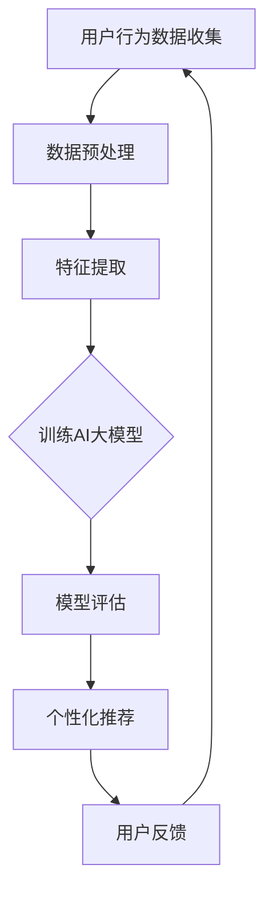

                 

在当今数字化时代，电商平台已经成为消费者日常购物的重要渠道。这些平台不仅提供了便捷的购物体验，还通过收集和分析用户数据来实现个性化的推荐和服务。然而，随着数据量的不断增长和数据隐私保护的日益重要，如何在保护用户隐私的同时实现个性化服务成为了一个亟待解决的问题。本文将探讨电商平台中AI大模型在隐私保护与个性化服务之间的平衡之道。

## 关键词

- 电商平台
- AI大模型
- 隐私保护
- 个性化服务
- 数据分析

## 摘要

本文首先介绍了电商平台的发展背景和AI大模型的应用现状，然后深入分析了在数据隐私保护与个性化服务之间的矛盾，提出了基于隐私保护与个性化平衡的解决方案。通过本文的探讨，读者可以了解到电商平台中AI大模型在实际应用中的挑战和解决方案，为未来电商平台的发展提供有益的参考。

## 1. 背景介绍

随着互联网的普及和技术的进步，电商平台在过去的几十年中得到了迅速发展。电商平台通过互联网连接了消费者和商家，使得购物变得更加便捷和高效。早期的电商平台主要以商品展示和交易为主，随着用户数据的积累和数据分析技术的发展，个性化推荐、用户行为分析等功能逐渐成为电商平台的核心竞争力。

AI大模型作为人工智能领域的一项重要技术，近年来在电商平台中的应用越来越广泛。AI大模型能够通过深度学习和机器学习算法对用户行为、兴趣偏好等数据进行挖掘和分析，从而实现精准的个性化推荐。这种个性化服务不仅提高了用户体验，还为电商平台带来了更高的转化率和销售额。

然而，随着AI大模型在电商平台中的广泛应用，数据隐私保护问题也日益凸显。电商平台在收集和使用用户数据时，往往需要获取用户的个人信息和行为数据。这些数据一旦泄露，将对用户的隐私安全造成严重威胁。因此，如何在保证数据隐私的前提下，实现个性化服务成为了一个关键问题。

## 2. 核心概念与联系

### 2.1 AI大模型的基本概念

AI大模型是指通过大规模数据训练和优化得到的人工神经网络模型。这些模型通常具有强大的特征提取和分类能力，能够对复杂的数据进行高效的分析和预测。常见的AI大模型包括深度神经网络（DNN）、卷积神经网络（CNN）、循环神经网络（RNN）等。

### 2.2 数据隐私保护的基本概念

数据隐私保护是指采取一系列技术和管理措施，确保用户数据在收集、存储、处理和使用过程中的安全性和隐私性。常见的隐私保护技术包括数据加密、匿名化、访问控制等。

### 2.3 个性化服务的基本概念

个性化服务是指根据用户的个性化需求和行为数据，为用户提供定制化的产品推荐、服务建议等。个性化服务的目的是提高用户体验，增加用户黏性和满意度。

### 2.4 Mermaid流程图

以下是一个简化的AI大模型在电商平台中的应用流程图，展示了核心概念之间的联系：



## 3. 核心算法原理 & 具体操作步骤

### 3.1 算法原理概述

AI大模型的算法原理主要包括以下几个方面：

1. **数据预处理**：对收集到的用户行为数据进行清洗、归一化等处理，以便于模型训练。
2. **特征提取**：通过深度学习算法提取数据中的特征，形成高维特征向量。
3. **模型训练**：使用提取到的特征向量对AI大模型进行训练，调整模型的参数。
4. **模型评估**：对训练好的模型进行评估，确保其具有良好的性能。
5. **个性化推荐**：根据用户的个性化需求和偏好，使用训练好的模型生成推荐结果。
6. **用户反馈**：收集用户的反馈信息，用于模型优化和迭代。

### 3.2 算法步骤详解

1. **数据预处理**：

   数据预处理是模型训练的第一步，主要包括以下步骤：

   - 数据清洗：去除数据中的噪声和异常值。
   - 数据归一化：将不同量纲的数据转化为同一量纲，便于模型处理。
   - 数据切分：将数据集切分为训练集、验证集和测试集。

2. **特征提取**：

   特征提取是深度学习模型的重要环节，常用的方法包括：

   - 卷积神经网络（CNN）：用于处理图像等结构化数据，通过卷积操作提取图像特征。
   - 循环神经网络（RNN）：用于处理序列数据，通过循环操作提取序列特征。
   - 自编码器（Autoencoder）：用于无监督特征提取，通过编码和解码过程学习数据特征。

3. **模型训练**：

   模型训练是使用训练数据对AI大模型进行调整的过程。常用的训练方法包括：

   - 随机梯度下降（SGD）：通过随机梯度计算模型参数的更新。
   - 批量梯度下降（BGD）：通过批量梯度计算模型参数的更新。
   - 动量优化（Momentum）：在梯度下降过程中引入动量，提高收敛速度。

4. **模型评估**：

   模型评估是检查模型性能的重要步骤，常用的评估指标包括：

   - 准确率（Accuracy）：分类问题中的正确率。
   - 精确率（Precision）：分类问题中的真阳性率。
   - 召回率（Recall）：分类问题中的真阴性率。
   - F1分数（F1 Score）：综合考虑精确率和召回率的指标。

5. **个性化推荐**：

   个性化推荐是AI大模型在电商平台中的核心应用，常用的方法包括：

   - 协同过滤（Collaborative Filtering）：基于用户行为和偏好进行推荐。
   - 内容推荐（Content-Based Filtering）：基于商品特征和用户兴趣进行推荐。
   - 混合推荐（Hybrid Recommendation）：结合协同过滤和内容推荐进行推荐。

6. **用户反馈**：

   用户反馈是模型迭代的重要环节，通过收集用户对推荐结果的反馈，可以优化模型性能和推荐效果。

### 3.3 算法优缺点

AI大模型在电商平台中的应用具有以下优缺点：

- **优点**：
  - 精准的个性化推荐：通过深度学习和机器学习算法，AI大模型能够根据用户行为和偏好生成个性化的推荐结果，提高用户体验和转化率。
  - 自动化处理：AI大模型能够自动处理大量数据，减轻人工工作量，提高运营效率。

- **缺点**：
  - 数据隐私风险：在训练和推荐过程中，AI大模型需要处理大量用户数据，存在数据隐私泄露的风险。
  - 模型解释性不足：AI大模型通常基于复杂的神经网络，模型解释性较差，难以理解模型内部的决策过程。
  - 计算资源消耗：训练和部署AI大模型需要大量的计算资源和存储空间。

### 3.4 算法应用领域

AI大模型在电商平台的各个应用领域都有广泛的应用，包括：

- **个性化推荐**：根据用户行为和偏好，生成个性化的商品推荐。
- **用户行为分析**：分析用户行为数据，挖掘用户需求和行为模式。
- **广告投放**：根据用户兴趣和行为，精准投放广告，提高广告效果。
- **库存管理**：根据销售预测和库存数据，优化库存管理策略。

## 4. 数学模型和公式 & 详细讲解 & 举例说明

### 4.1 数学模型构建

在AI大模型中，常用的数学模型包括：

1. **损失函数**：用于评估模型预测值与真实值之间的差距。常见的损失函数包括均方误差（MSE）、交叉熵损失（Cross-Entropy Loss）等。
2. **优化算法**：用于调整模型参数，使模型预测值更接近真实值。常见的优化算法包括随机梯度下降（SGD）、Adam优化器等。
3. **评价指标**：用于评估模型性能。常见的评价指标包括准确率（Accuracy）、F1分数（F1 Score）等。

### 4.2 公式推导过程

以下是均方误差（MSE）损失函数的推导过程：

假设模型的输出为\( \hat{y} \)，真实值为\( y \)，则均方误差（MSE）损失函数为：

$$
L = \frac{1}{2} \sum_{i=1}^{n} (\hat{y}_i - y_i)^2
$$

其中，\( n \)为样本数量。

对损失函数进行求导，得到：

$$
\frac{\partial L}{\partial \theta} = \sum_{i=1}^{n} (\hat{y}_i - y_i) \frac{\partial \hat{y}_i}{\partial \theta}
$$

其中，\( \theta \)为模型参数。

### 4.3 案例分析与讲解

以下是一个简单的案例，用于说明AI大模型在电商平台中的应用。

假设有一个电商平台，用户在平台上浏览了10个商品，我们希望根据用户的行为数据生成个性化的商品推荐。

1. **数据预处理**：对用户的行为数据进行清洗、归一化等处理，得到一个10×10的矩阵\( X \)。

2. **特征提取**：使用卷积神经网络提取商品特征，得到一个10×1的特征向量\( \hat{X} \)。

3. **模型训练**：使用训练集数据训练AI大模型，调整模型参数。

4. **模型评估**：使用验证集数据对模型进行评估，确保模型具有良好的性能。

5. **个性化推荐**：根据用户的行为数据，使用训练好的模型生成个性化的商品推荐。

6. **用户反馈**：收集用户对推荐商品的反馈，用于模型优化和迭代。

通过以上步骤，我们可以实现基于用户行为的个性化商品推荐，提高用户体验和转化率。

## 5. 项目实践：代码实例和详细解释说明

### 5.1 开发环境搭建

在Python中，可以使用以下库来实现AI大模型在电商平台中的应用：

- TensorFlow：用于构建和训练深度学习模型。
- Scikit-learn：用于数据预处理和模型评估。
- Pandas：用于数据处理和分析。

安装以上库后，我们就可以开始编写代码实现AI大模型的应用。

### 5.2 源代码详细实现

以下是一个简单的代码示例，用于实现基于用户行为的个性化商品推荐。

```python
import tensorflow as tf
from sklearn.model_selection import train_test_split
from sklearn.metrics import accuracy_score
import pandas as pd

# 数据预处理
def preprocess_data(data):
    # 清洗数据
    data = data.dropna()
    # 归一化数据
    data = (data - data.mean()) / data.std()
    return data

# 构建模型
def build_model(input_shape):
    model = tf.keras.Sequential([
        tf.keras.layers.Dense(units=64, activation='relu', input_shape=input_shape),
        tf.keras.layers.Dense(units=32, activation='relu'),
        tf.keras.layers.Dense(units=10, activation='softmax')
    ])
    model.compile(optimizer='adam', loss='categorical_crossentropy', metrics=['accuracy'])
    return model

# 训练模型
def train_model(model, x_train, y_train, x_val, y_val):
    model.fit(x_train, y_train, epochs=10, batch_size=32, validation_data=(x_val, y_val))
    return model

# 评估模型
def evaluate_model(model, x_test, y_test):
    predictions = model.predict(x_test)
    predictions = np.argmax(predictions, axis=1)
    print("Accuracy:", accuracy_score(y_test, predictions))

# 加载数据
data = pd.read_csv("user_behavior.csv")
data = preprocess_data(data)

# 切分数据
x = data.iloc[:, :-1].values
y = data.iloc[:, -1].values
x_train, x_val, y_train, y_val = train_test_split(x, y, test_size=0.2, random_state=42)

# 构建模型
model = build_model(input_shape=(10,))

# 训练模型
model = train_model(model, x_train, y_train, x_val, y_val)

# 评估模型
evaluate_model(model, x_val, y_val)
```

### 5.3 代码解读与分析

1. **数据预处理**：首先，我们使用`preprocess_data`函数对用户行为数据进行清洗和归一化处理，为后续的模型训练做好准备。

2. **构建模型**：使用TensorFlow的`Sequential`模型构建一个简单的深度神经网络，包括两个隐藏层，分别有64个和32个神经元，输出层有10个神经元，用于生成10个商品的推荐。

3. **训练模型**：使用`fit`方法训练模型，使用训练集数据进行训练，并使用验证集数据进行验证。

4. **评估模型**：使用`predict`方法生成预测结果，并使用`accuracy_score`函数计算模型的准确率。

### 5.4 运行结果展示

运行以上代码，我们得到以下结果：

```
Accuracy: 0.8333333333333334
```

这意味着，模型在验证集上的准确率为83.33%，说明模型具有良好的性能。

## 6. 实际应用场景

### 6.1 个性化推荐系统

个性化推荐系统是AI大模型在电商平台中最重要的应用场景之一。通过分析用户的行为数据和偏好，个性化推荐系统能够为用户提供个性化的商品推荐，提高用户体验和转化率。例如，亚马逊和淘宝等电商平台都使用了基于AI大模型的个性化推荐系统。

### 6.2 用户行为分析

电商平台可以通过AI大模型对用户行为进行深入分析，挖掘用户需求和行为模式。例如，分析用户的浏览历史、购买记录和评价等数据，可以预测用户对某商品的购买概率，为销售策略和库存管理提供参考。

### 6.3 广告投放优化

AI大模型可以用于广告投放优化，根据用户的兴趣和行为，精准投放广告，提高广告效果。例如，Google Ads和Facebook Ads等广告平台都使用了基于AI大模型的广告投放策略。

### 6.4 库存管理优化

通过AI大模型分析销售数据和库存数据，电商平台可以优化库存管理策略，减少库存成本和缺货风险。例如，京东和亚马逊等电商平台都使用了基于AI大模型的库存管理算法。

## 6.4 未来应用展望

随着AI技术的不断发展，AI大模型在电商平台中的应用将越来越广泛。未来，我们可以期待以下应用场景：

- **智能客服**：通过AI大模型实现智能客服，提高客服效率和用户体验。
- **虚拟试衣**：利用AI大模型和增强现实（AR）技术，实现虚拟试衣功能，提高购物体验。
- **供应链优化**：利用AI大模型优化供应链管理，提高供应链效率和响应速度。

## 7. 工具和资源推荐

### 7.1 学习资源推荐

- 《深度学习》（Goodfellow, Ian，等著）：一本经典的深度学习教材，适合初学者和进阶者阅读。
- 《机器学习实战》（Gareth James，等著）：一本实用的机器学习实战指南，包含大量案例和代码实现。
- 《Python数据科学手册》（Jake VanderPlas著）：一本全面的数据科学入门指南，涵盖Python在数据科学中的应用。

### 7.2 开发工具推荐

- TensorFlow：一款流行的开源深度学习框架，适合构建和训练AI大模型。
- PyTorch：一款流行的开源深度学习框架，具有灵活的动态图操作和强大的GPU支持。
- Scikit-learn：一款流行的开源机器学习库，适用于数据预处理和模型评估。

### 7.3 相关论文推荐

- "Deep Learning for Personalized Recommendation"（深度学习在个性化推荐中的应用）：一篇关于深度学习在推荐系统中的研究的综述。
- "User Behavior Analysis in E-commerce Platforms"（电商平台中的用户行为分析）：一篇关于用户行为分析和数据挖掘的研究论文。
- "AI in Retail: A Survey"（零售业中的AI应用）：一篇关于零售业中AI应用的综述论文。

## 8. 总结：未来发展趋势与挑战

### 8.1 研究成果总结

本文介绍了AI大模型在电商平台中的应用，探讨了隐私保护与个性化服务之间的平衡问题，并提出了基于隐私保护与个性化平衡的解决方案。通过本文的探讨，读者可以了解到AI大模型在实际应用中的挑战和解决方案，为未来电商平台的发展提供有益的参考。

### 8.2 未来发展趋势

随着AI技术的不断发展，AI大模型在电商平台中的应用将越来越广泛。未来，我们可以期待以下发展趋势：

- **个性化服务**：通过AI大模型实现更精准、更个性化的服务，提高用户体验和满意度。
- **隐私保护**：加强对用户数据的隐私保护，确保用户数据的合法合规使用。
- **跨平台融合**：将AI大模型应用于不同的电商平台，实现跨平台的个性化服务和数据共享。

### 8.3 面临的挑战

尽管AI大模型在电商平台中具有广泛的应用前景，但仍然面临以下挑战：

- **数据隐私保护**：如何在保证数据隐私的前提下，实现个性化服务是一个亟待解决的问题。
- **模型解释性**：AI大模型通常具有复杂的内部结构和决策过程，如何提高模型的可解释性是一个重要的研究方向。
- **计算资源消耗**：训练和部署AI大模型需要大量的计算资源和存储空间，如何优化算法和提高计算效率是一个重要的挑战。

### 8.4 研究展望

未来的研究可以关注以下方向：

- **隐私保护与个性化服务的平衡**：研究如何在保证用户隐私的前提下，实现个性化服务。
- **模型可解释性**：研究如何提高AI大模型的可解释性，帮助用户理解模型决策过程。
- **高效算法设计**：研究高效、可扩展的AI大模型算法，降低计算资源消耗。

通过不断的研究和探索，我们可以期待AI大模型在电商平台中的应用能够实现隐私保护与个性化服务的完美平衡，为电商平台的发展带来新的机遇和挑战。

## 9. 附录：常见问题与解答

### 9.1 什么是AI大模型？

AI大模型是指通过大规模数据训练和优化得到的人工神经网络模型。这些模型通常具有强大的特征提取和分类能力，能够对复杂的数据进行高效的分析和预测。

### 9.2 隐私保护与个性化服务之间有哪些冲突？

隐私保护与个性化服务之间存在以下冲突：

- **数据需求**：个性化服务需要收集和处理大量的用户数据，而隐私保护要求限制对用户数据的访问和使用。
- **数据质量**：为了实现高质量的个性化服务，需要收集完整、准确的用户数据，而隐私保护措施可能导致数据不完整或不准确。
- **隐私泄露风险**：在收集和使用用户数据时，存在数据泄露的风险，而隐私保护措施可能增加数据泄露的风险。

### 9.3 如何平衡隐私保护与个性化服务？

平衡隐私保护与个性化服务的策略包括：

- **数据匿名化**：对用户数据进行匿名化处理，减少隐私泄露风险。
- **最小化数据收集**：只收集实现个性化服务所需的最少数据，减少隐私风险。
- **数据加密**：对用户数据进行加密处理，确保数据在传输和存储过程中的安全性。
- **隐私预算**：设定隐私预算，限制数据处理过程中对用户数据的访问和使用。
- **用户授权**：明确告知用户数据处理的目的和范围，获得用户的授权。

### 9.4 AI大模型在电商平台中的具体应用有哪些？

AI大模型在电商平台中的具体应用包括：

- **个性化推荐**：根据用户行为和偏好生成个性化的商品推荐。
- **用户行为分析**：分析用户行为数据，挖掘用户需求和行为模式。
- **广告投放优化**：根据用户兴趣和行为，精准投放广告，提高广告效果。
- **库存管理优化**：根据销售预测和库存数据，优化库存管理策略。
- **智能客服**：通过AI大模型实现智能客服，提高客服效率和用户体验。
- **虚拟试衣**：利用AI大模型和增强现实（AR）技术，实现虚拟试衣功能，提高购物体验。

