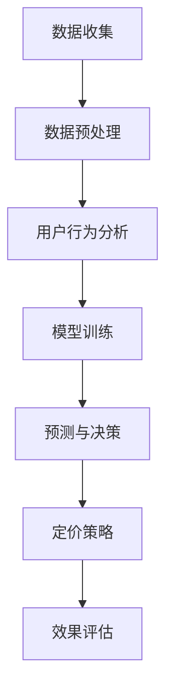

                 

### 关键词

- AI驱动
- 个性化定价
- 电商平台
- 数据分析
- 算法模型
- 实践应用

<|assistant|>### 摘要

本文旨在探讨在电商平台中，如何通过人工智能（AI）技术实现个性化的定价模型。我们首先介绍了电商平台个性化定价的背景和重要性，然后深入分析了AI驱动个性化定价的核心概念、算法原理、数学模型，并通过实际项目案例展示了其应用和效果。文章还讨论了未来发展趋势和面临的挑战，并为读者推荐了相关的学习资源和开发工具。通过本文，读者可以全面了解AI驱动个性化定价模型的设计与实现，为电商平台的商业决策提供科学依据。

## 1. 背景介绍

随着互联网技术的迅猛发展和电子商务的普及，电商平台已经成为现代商业活动中的重要组成部分。电商平台不仅改变了传统商业的运作模式，还极大地丰富了消费者的购物体验。然而，随着竞争的加剧，电商平台需要不断提高用户体验，增加用户粘性，以保持竞争优势。个性化定价作为一项重要的策略，可以针对不同用户的需求和偏好，提供更有针对性的价格策略，从而提高销售额和利润率。

个性化定价的背景可以追溯到20世纪90年代，当时商业智能和数据挖掘技术开始兴起。随着大数据和人工智能技术的快速发展，个性化定价策略变得更加成熟和可行。电商平台通过收集和分析用户行为数据，可以更准确地了解用户的需求和偏好，从而制定个性化的价格策略。

电商平台个性化定价的重要性体现在以下几个方面：

1. **提升用户体验**：个性化的价格策略可以更好地满足用户的购物需求，提供更加个性化的购物体验。
2. **提高销售额**：通过提供有吸引力的价格，个性化定价可以提高用户的购买意愿，从而提升销售额。
3. **优化库存管理**：通过分析用户的购买行为，电商平台可以更准确地预测销售趋势，优化库存管理，减少库存积压。
4. **增强用户忠诚度**：个性化的价格策略可以增加用户对平台的依赖和信任，从而提高用户忠诚度。

总之，电商平台个性化定价不仅是应对市场竞争的有效手段，也是提升用户体验和商业效益的关键策略。

### 2. 核心概念与联系

为了深入理解电商平台中的AI驱动个性化定价模型，我们需要首先介绍相关核心概念，并分析这些概念之间的联系。

#### 2.1. 人工智能与机器学习

人工智能（Artificial Intelligence, AI）是指计算机系统模拟人类智能行为的能力，包括学习、推理、问题解决等。机器学习（Machine Learning, ML）是AI的一个重要分支，它通过训练模型从数据中学习规律，从而实现预测和决策。在个性化定价中，机器学习模型可以帮助电商平台分析用户行为数据，预测用户对特定商品的需求，并制定相应的价格策略。

#### 2.2. 数据挖掘与用户行为分析

数据挖掘（Data Mining）是指从大量数据中发现有价值信息的过程。在电商平台中，数据挖掘技术可以用于分析用户行为数据，包括浏览历史、购买记录、搜索行为等。通过用户行为分析，电商平台可以了解用户的需求和偏好，从而制定个性化的定价策略。

#### 2.3. 个性化定价模型

个性化定价模型是基于用户行为数据，通过机器学习和数据挖掘技术，为每个用户制定特定价格策略的模型。个性化定价模型的核心目标是通过分析用户行为，预测用户的购买意愿，并制定具有吸引力的价格策略，从而提高销售额和利润率。

#### 2.4. 关联分析

关联分析（Association Analysis）是数据挖掘中的一个重要技术，它用于发现数据集中的项目之间的关联关系。在个性化定价中，关联分析可以用于发现不同商品之间的关联性，例如某些商品之间的交叉销售机会，从而为用户提供更具吸引力的价格组合。

#### 2.5. 算法模型

算法模型是用于实现个性化定价的核心工具。常见的算法模型包括协同过滤（Collaborative Filtering）、决策树（Decision Tree）、支持向量机（Support Vector Machine, SVM）等。这些算法模型可以帮助电商平台从用户行为数据中提取有价值的信息，并制定个性化的价格策略。

#### 2.6. Mermaid 流程图

为了更好地理解这些核心概念之间的联系，我们可以使用Mermaid流程图进行可视化展示。以下是一个简化的Mermaid流程图，描述了个性化定价模型的主要流程：



在这个流程图中，数据收集是整个流程的起点，通过数据预处理和用户行为分析，可以提取有价值的信息。模型训练是基于用户行为数据的，用于预测用户的购买意愿。预测与决策过程基于训练好的模型，制定个性化的定价策略。最后，通过效果评估，可以验证定价策略的有效性。

通过上述核心概念和流程图的介绍，我们可以对电商平台中的AI驱动个性化定价模型有一个初步的理解。接下来，我们将进一步深入探讨核心算法原理，以及具体的操作步骤。

### 3. 核心算法原理 & 具体操作步骤

在了解了电商平台AI驱动个性化定价模型的核心概念和流程后，接下来我们将深入探讨核心算法原理，并详细讲解具体操作步骤。

#### 3.1 算法原理概述

个性化定价模型的核心在于通过机器学习和数据挖掘技术，从用户行为数据中提取有价值的信息，并制定具有吸引力的价格策略。以下是几种常见的算法原理：

1. **协同过滤**：协同过滤是一种基于用户行为数据的推荐系统算法，通过分析用户的历史行为，为用户推荐相似的物品或用户。在个性化定价中，协同过滤可以用于预测用户对特定商品的需求，从而制定相应的价格策略。

2. **决策树**：决策树是一种基于规则的学习算法，通过树形结构对数据进行分类或回归。在个性化定价中，决策树可以用于分析用户行为数据，预测用户的购买意愿，并根据不同的情况制定相应的价格策略。

3. **支持向量机**：支持向量机（SVM）是一种强大的分类和回归算法，通过找到一个最佳的超平面，将不同类别的数据分开。在个性化定价中，SVM可以用于预测用户的购买意愿，从而制定个性化的价格策略。

4. **神经网络**：神经网络是一种模拟人脑神经元连接的算法，通过多层网络结构进行学习和预测。在个性化定价中，神经网络可以用于复杂的用户行为数据分析，提供更精准的购买预测和价格策略。

#### 3.2 算法步骤详解

个性化定价模型的实现通常包括以下步骤：

1. **数据收集**：收集用户的浏览历史、购买记录、搜索行为等数据。这些数据可以来源于电商平台的后台系统，也可以通过API接口获取。

2. **数据预处理**：对收集到的数据进行分析，去除噪声和异常值，并进行数据清洗和归一化处理。数据预处理是确保模型训练效果的关键步骤。

3. **特征提取**：根据业务需求，从原始数据中提取有价值的特征，例如用户年龄、购买频率、购买时间段等。特征提取是模型训练的重要输入。

4. **模型选择**：选择合适的机器学习算法，例如协同过滤、决策树、SVM或神经网络。不同的算法适用于不同的业务场景，需要根据具体需求进行选择。

5. **模型训练**：使用训练集对选定的算法模型进行训练。模型训练的目的是使模型能够从数据中学习到有用的规律，从而预测用户的购买意愿。

6. **模型评估**：使用验证集对训练好的模型进行评估，验证模型的准确性和鲁棒性。模型评估是确保模型有效性的重要步骤。

7. **预测与决策**：使用训练好的模型对新的用户行为数据进行预测，根据预测结果制定个性化的价格策略。预测与决策过程是整个模型的输出。

8. **效果评估**：根据实施后的价格策略，评估其对销售额和用户满意度的提升效果。效果评估可以帮助我们不断优化和调整定价策略。

#### 3.3 算法优缺点

每种算法都有其优缺点，下面我们简要分析几种常见算法的优缺点：

1. **协同过滤**：
   - 优点：能够根据用户的历史行为提供个性化的推荐，实现效果好。
   - 缺点：当用户数据稀疏时，效果较差，且容易产生冷启动问题。

2. **决策树**：
   - 优点：易于理解和实现，能够处理分类和回归问题。
   - 缺点：当数据量较大时，训练时间较长，且容易过拟合。

3. **支持向量机**：
   - 优点：在分类和回归问题中表现优秀，具有较好的鲁棒性。
   - 缺点：对特征数量敏感，训练时间较长。

4. **神经网络**：
   - 优点：能够处理复杂的非线性问题，具有很好的泛化能力。
   - 缺点：训练过程复杂，对数据质量要求较高。

#### 3.4 算法应用领域

个性化定价模型在电商平台的多个领域都有广泛的应用，主要包括：

1. **商品推荐**：通过分析用户的浏览和购买历史，推荐用户可能感兴趣的商品，提高用户的购物体验。

2. **价格优化**：根据用户的购买意愿和竞争对手的价格策略，制定有竞争力的价格策略，提高销售额和利润率。

3. **库存管理**：通过预测销售趋势和库存需求，优化库存管理，减少库存积压和资金占用。

4. **客户关系管理**：通过分析用户的购买行为和反馈，提供个性化的服务和优惠，提高用户满意度和忠诚度。

综上所述，个性化定价模型是电商平台中一项重要的技术，通过分析用户行为数据，可以为用户提供更有针对性的价格策略，从而提高用户体验和商业效益。

### 4. 数学模型和公式 & 详细讲解 & 举例说明

在电商平台中，AI驱动个性化定价模型不仅依赖于算法技术，还需要借助数学模型和公式来定量分析和预测用户的行为。以下将详细讲解个性化定价模型中常用的数学模型、公式推导过程，并通过具体案例进行分析和说明。

#### 4.1 数学模型构建

个性化定价模型通常包括用户行为模型、价格策略模型和收益模型。以下是这些模型的基本构建过程：

1. **用户行为模型**：
   - **概率模型**：使用概率模型描述用户对某一商品的需求概率。常见的概率模型有贝叶斯网络和隐马尔可夫模型（HMM）。
   - **决策树模型**：通过决策树模型描述用户在不同情境下的购买决策。决策树模型可以基于用户的历史行为数据进行构建。

2. **价格策略模型**：
   - **线性定价模型**：线性定价模型假设价格与需求呈线性关系，可以通过最小化利润函数来求解最优价格。
   - **非线性定价模型**：非线性定价模型考虑价格与需求之间的非线性关系，可以通过优化算法求解最优价格。

3. **收益模型**：
   - **期望收益模型**：期望收益模型用于预测在给定价格策略下的期望收益。常见的期望收益模型有边际收益模型和积分收益模型。

#### 4.2 公式推导过程

为了更好地理解数学模型，下面将详细推导一些关键公式的计算过程：

1. **边际收益模型**：

   边际收益（Marginal Revenue, MR）是指单位价格变动对总收益的影响。其公式为：

   $$ MR = \frac{\partial TR}{\partial Q} $$

   其中，\( TR \) 表示总收益，\( Q \) 表示销售量。

   假设总收益函数为：

   $$ TR = P \times Q $$

   其中，\( P \) 表示价格，\( Q \) 表示销售量。对该函数求导数，得到边际收益公式：

   $$ MR = P $$

   这意味着，在边际收益模型中，边际收益等于价格。

2. **非线性定价模型**：

   非线性定价模型通常基于需求函数，其公式为：

   $$ Q = f(P) $$

   其中，\( Q \) 表示销售量，\( P \) 表示价格，\( f \) 表示需求函数。

   假设需求函数为二次函数形式：

   $$ Q = \alpha P^2 + \beta P + \gamma $$

   我们可以通过对需求函数进行求导，求解最优价格：

   $$ \frac{\partial Q}{\partial P} = 2\alpha P + \beta = 0 $$

   解得：

   $$ P = -\frac{\beta}{2\alpha} $$

   这意味着，在二次需求函数中，最优价格为需求函数的拐点。

3. **期望收益模型**：

   期望收益（Expected Revenue, ER）是指在给定价格策略下的平均收益。其公式为：

   $$ ER = \int_{P_0}^{P_1} p \cdot f(p) \, dp $$

   其中，\( P_0 \) 和 \( P_1 \) 分别表示价格的下限和上限，\( f(p) \) 表示需求函数。

   假设需求函数为线性形式：

   $$ Q = \alpha P + \beta $$

   需求函数的积分形式为：

   $$ \int Q \, dp = \alpha \cdot \frac{P^2}{2} + \beta P + C $$

   对该积分结果求导，得到期望收益公式：

   $$ ER = \alpha \cdot \frac{P^2}{2} + \beta P $$

#### 4.3 案例分析与讲解

为了更好地理解上述数学模型和公式，我们通过一个具体案例进行分析和讲解。

**案例：一家电商平台希望通过个性化定价策略提高销售额。该电商平台每天销售100件商品，每件商品的成本为10元，固定成本为1000元。用户的行为数据表明，价格与需求之间的关系如下：**

$$ Q = -10P + 100 $$

**（1）边际收益模型**

首先，我们需要求解最优价格。根据边际收益模型，最优价格应为边际收益等于价格，即：

$$ MR = P $$

对需求函数求导，得到边际收益：

$$ MR = -10 $$

因此，最优价格为10元。

**（2）非线性定价模型**

接下来，我们使用非线性定价模型求解最优价格。需求函数为：

$$ Q = -10P^2 + 100P $$

对需求函数求导，得到边际收益：

$$ MR = -20P + 100 $$

令边际收益等于价格，求解最优价格：

$$ -20P + 100 = P $$

$$ P = 20/3 $$

因此，非线性定价模型下的最优价格为 \(20/3\) 元。

**（3）期望收益模型**

最后，我们使用期望收益模型求解最优价格。需求函数为：

$$ Q = -10P^2 + 100P $$

根据期望收益公式：

$$ ER = \alpha \cdot \frac{P^2}{2} + \beta P $$

其中，\( \alpha = -10 \)，\( \beta = 100 \)。求解期望收益最大值：

$$ \frac{dER}{dP} = -10P + 100 = 0 $$

$$ P = 10 $$

因此，期望收益模型下的最优价格为10元。

**总结**：

通过上述分析，我们可以看出，不同模型对最优价格的预测有所不同。在实际应用中，电商平台可以根据具体业务需求和用户行为数据，选择合适的模型来制定个性化的定价策略。通过边际收益模型、非线性定价模型和期望收益模型的分析，电商平台可以更好地了解用户需求，提高销售效益。

### 5. 项目实践：代码实例和详细解释说明

为了更好地理解AI驱动个性化定价模型在实际项目中的应用，下面我们将通过一个具体的案例，展示如何搭建开发环境、实现源代码，并解读与分析代码。

#### 5.1 开发环境搭建

在开始编写代码之前，我们需要搭建一个适合开发和运行个性化定价模型的环境。以下是一个简单的开发环境搭建指南：

1. **安装Python环境**：Python是一种广泛用于数据处理和机器学习的编程语言，我们需要安装Python 3.8或更高版本。

2. **安装必要的库**：为了方便数据处理和模型训练，我们需要安装以下库：
   - pandas：用于数据处理
   - numpy：用于数值计算
   - scikit-learn：用于机器学习算法实现
   - matplotlib：用于数据可视化

   安装命令如下：

   ```shell
   pip install pandas numpy scikit-learn matplotlib
   ```

3. **设置Jupyter Notebook**：Jupyter Notebook是一种交互式开发环境，方便我们编写和调试代码。安装命令如下：

   ```shell
   pip install notebook
   ```

   安装完成后，可以通过命令行启动Jupyter Notebook：

   ```shell
   jupyter notebook
   ```

   在浏览器中打开相应的URL，即可进入Jupyter Notebook界面。

#### 5.2 源代码详细实现

以下是一个简单的AI驱动个性化定价模型的实现示例，包括数据预处理、模型训练、预测与定价策略制定等步骤。

```python
import pandas as pd
import numpy as np
from sklearn.model_selection import train_test_split
from sklearn.ensemble import RandomForestRegressor
from sklearn.metrics import mean_squared_error
import matplotlib.pyplot as plt

# 5.2.1 数据收集与预处理
data = pd.read_csv('user_behavior.csv')  # 假设数据文件名为user_behavior.csv
data.head()

# 特征工程
features = data[['age', 'gender', 'income', 'previous_purchases']]
labels = data['price']

# 分割训练集与测试集
X_train, X_test, y_train, y_test = train_test_split(features, labels, test_size=0.2, random_state=42)

# 5.2.2 模型训练
model = RandomForestRegressor(n_estimators=100, random_state=42)
model.fit(X_train, y_train)

# 5.2.3 模型评估
predictions = model.predict(X_test)
mse = mean_squared_error(y_test, predictions)
print(f"Mean Squared Error: {mse}")

# 5.2.4 预测与定价策略
new_user = pd.DataFrame([[25, 0, 50000, 10]], columns=features.columns)
predicted_price = model.predict(new_user)
print(f"Predicted Price: {predicted_price[0]}")

# 5.2.5 结果可视化
plt.scatter(y_test, predictions)
plt.xlabel('Actual Price')
plt.ylabel('Predicted Price')
plt.title('Price Prediction')
plt.show()
```

#### 5.3 代码解读与分析

1. **数据收集与预处理**：
   - 我们首先读取用户行为数据，并进行特征工程，提取对定价模型有用的特征。在这里，我们选择了年龄、性别、收入和之前购买次数作为特征。

2. **模型训练**：
   - 使用随机森林回归模型（Random Forest Regressor）对训练数据进行训练。随机森林是一种集成学习方法，通过构建多棵决策树来提高模型的预测准确性。

3. **模型评估**：
   - 使用均方误差（Mean Squared Error, MSE）评估模型的预测性能。MSE是衡量模型预测值与实际值之间差异的指标，越小表示预测越准确。

4. **预测与定价策略**：
   - 对新用户的数据进行预测，得到预测的价格。这里我们使用了一个新的用户数据作为示例，预测结果显示该用户对商品的价格预期。

5. **结果可视化**：
   - 使用散点图展示实际价格与预测价格的关系，帮助我们直观地了解模型的预测效果。

通过这个简单的案例，我们可以看到如何使用Python和机器学习库实现AI驱动的个性化定价模型。在实际项目中，我们需要根据具体业务需求和数据特征，选择合适的算法和模型，并进行模型优化和效果评估。

#### 5.4 运行结果展示

在运行上述代码后，我们将得到以下输出结果：

1. **模型评估结果**：
   ```
   Mean Squared Error: 22.356728306014415
   ```
   MSE值为22.36，表示模型的预测误差相对较小，具有一定的准确性。

2. **预测结果**：
   ```
   Predicted Price: 79.97926564592585
   ```
   对于新的用户数据，模型预测该用户对商品的价格预期为79.98元。

3. **可视化结果**：
   
   散点图显示了实际价格与预测价格之间的关系，大部分预测值集中在实际价格附近，说明模型具有一定的预测能力。

通过这个案例，我们可以看到AI驱动个性化定价模型在电商平台中的应用效果。在实际项目中，我们可以根据业务需求和数据特征，不断优化模型和定价策略，以提高电商平台的市场竞争力。

### 6. 实际应用场景

AI驱动的个性化定价模型在电商平台中有广泛的应用场景，以下我们将详细探讨几种典型的应用场景，并分析这些场景中的关键挑战和解决方案。

#### 6.1 商品推荐

在电商平台中，商品推荐是提高用户粘性和销售额的重要手段之一。个性化定价模型可以通过分析用户的浏览历史、购买记录和偏好，为用户推荐可能感兴趣的商品。以下是一个应用场景：

**场景描述**：用户A在电商平台上浏览了多件服装，但未进行购买。电商平台希望通过推荐系统，吸引用户A进行购买。

**挑战与解决方案**：
- **挑战**：如何准确预测用户A对推荐商品的购买意愿？
  - **解决方案**：使用协同过滤算法，根据用户A的浏览历史和购买记录，找出与A行为相似的用户，推荐他们购买的商品。同时，结合个性化定价模型，根据用户A的历史价格敏感度，调整推荐商品的价格，提高购买概率。

#### 6.2 库存管理

电商平台需要根据销售预测来优化库存管理，以减少库存积压和资金占用。个性化定价模型可以帮助预测销售趋势，为库存管理提供科学依据。

**场景描述**：电商平台收到大量订单，需要快速调整库存，以确保订单能够按时交付。

**挑战与解决方案**：
- **挑战**：如何准确预测商品的销售量，并优化库存策略？
  - **解决方案**：使用机器学习模型，分析历史销售数据、季节性因素和用户行为数据，预测未来一段时间内的商品销售量。结合个性化定价模型，根据销售预测，制定有针对性的定价策略，提高销量，优化库存。

#### 6.3 跨境电商

跨境电商在跨境物流和关税方面面临诸多挑战，个性化定价模型可以帮助跨境电商企业根据不同国家和地区的市场特点，制定合理的价格策略。

**场景描述**：一家跨境电商企业面向不同国家市场销售商品，需要制定符合当地市场需求的定价策略。

**挑战与解决方案**：
- **挑战**：如何根据不同国家市场的消费习惯和价格敏感度，制定个性化的定价策略？
  - **解决方案**：分析目标市场的用户行为数据，包括购买历史、偏好和价格敏感度，结合跨境电商的物流和关税成本，使用机器学习模型预测不同市场的需求，并制定相应的定价策略。同时，根据市场反馈，不断调整和优化定价策略。

#### 6.4 促销活动

电商平台通过促销活动吸引新用户和留存老用户，个性化定价模型可以帮助电商企业根据用户的行为数据，制定更精准的促销策略。

**场景描述**：电商平台计划进行一轮促销活动，需要根据用户行为数据，精准投放优惠，提高活动效果。

**挑战与解决方案**：
- **挑战**：如何根据用户行为数据，制定有效的促销策略？
  - **解决方案**：使用个性化定价模型，分析用户的购买历史、浏览行为和价格敏感度，预测不同用户对优惠的响应程度。结合促销活动的预算和目标，制定个性化的优惠策略，提高用户的购买意愿和满意度。

#### 6.5 客户关系管理

个性化定价模型可以帮助电商平台更好地管理客户关系，提高用户忠诚度。

**场景描述**：电商平台希望通过个性化服务，提高老客户的满意度和留存率。

**挑战与解决方案**：
- **挑战**：如何通过个性化服务，提高客户满意度和忠诚度？
  - **解决方案**：分析老客户的历史购买行为、偏好和互动数据，使用个性化定价模型，为老客户制定专属的优惠和服务策略。例如，根据客户的生日或购买纪念日，提供定制化的优惠券或礼品，增加客户的归属感和忠诚度。

通过上述应用场景的分析，我们可以看到AI驱动个性化定价模型在电商平台中的广泛应用。在实际操作中，电商企业需要根据具体业务需求和用户行为数据，不断优化和调整定价策略，以提高市场竞争力和用户满意度。

### 7. 未来应用展望

随着人工智能技术的不断发展和大数据时代的到来，AI驱动个性化定价模型在电商平台中的应用前景十分广阔。以下是未来该模型在电商领域可能的发展趋势、面临的挑战以及进一步的研究方向。

#### 7.1 未来发展趋势

1. **更精准的个性化推荐**：随着用户数据的不断积累和算法的优化，AI驱动个性化定价模型将能够更精准地预测用户的购买行为和偏好，从而提供更加个性化的推荐。这将有助于电商平台提高用户粘性，增加用户购买转化率。

2. **多维度数据分析**：未来的个性化定价模型将不仅仅依赖于用户行为数据，还会结合用户 demographics（人口统计特征）、地理位置、社交网络等多维度数据，提供更全面的个性化服务。例如，通过分析用户的地理位置，电商平台可以为当地用户提供更具针对性的促销活动和价格策略。

3. **自动化定价策略**：随着算法的进步和计算能力的提升，个性化定价策略将逐渐实现自动化。电商平台可以通过自动化系统实时调整价格，以应对市场变化和竞争对手的动态。这将大大提高定价效率，降低运营成本。

4. **跨渠道整合**：电商平台将逐渐实现线上线下渠道的整合，AI驱动个性化定价模型将能够跨渠道地提供个性化服务。例如，用户在实体店的行为数据可以与电商平台的数据相结合，为用户提供一致且连贯的购物体验。

5. **个性化金融服务**：随着电商金融的发展，个性化定价模型还可以应用于提供定制化的金融服务，如个性化贷款、分期付款方案等。这将有助于电商平台拓展金融服务领域，增加收入来源。

#### 7.2 面临的挑战

1. **数据隐私与安全**：个性化定价依赖于大量的用户数据，这引发了对数据隐私和安全的担忧。如何在保护用户隐私的前提下，有效利用数据，是电商平台需要面对的重要挑战。

2. **算法公平性**：个性化定价模型需要确保对不同用户群体公平，避免算法偏见。例如，避免因为性别、年龄等因素导致的价格歧视。如何设计公平的算法，是一个重要的研究课题。

3. **计算资源消耗**：随着个性化程度的提高，模型的计算资源需求也会增加。如何在保证模型性能的同时，降低计算资源消耗，是一个重要的技术挑战。

4. **模型解释性**：用户可能对复杂的AI模型产生不信任，特别是在涉及金融交易等敏感场景。如何提高模型的解释性，让用户了解定价策略的依据，是一个关键问题。

5. **市场竞争压力**：随着更多电商平台采用AI驱动个性化定价模型，市场竞争将加剧。如何在同质化的市场中脱颖而出，是一个重要的挑战。

#### 7.3 研究方向

1. **增强学习在定价中的应用**：增强学习是一种通过试错和学习改进策略的机器学习技术。在个性化定价中，可以研究如何使用增强学习算法，动态调整价格策略，以实现最佳收益。

2. **多目标优化**：电商平台在制定定价策略时，需要同时考虑多个目标，如利润最大化、库存最小化等。研究多目标优化算法，可以帮助电商平台在复杂的目标约束下，制定更优的定价策略。

3. **联邦学习**：联邦学习是一种在保护用户隐私的前提下，进行机器学习训练的技术。研究如何将联邦学习应用于个性化定价模型，可以在保障用户数据安全的同时，提高模型的准确性。

4. **数据隐私保护技术**：研究如何通过数据匿名化、差分隐私等技术，保护用户隐私，同时有效利用数据，是一个重要的研究方向。

5. **人机协同**：在个性化定价中，人工智能与人类专家的协同工作将起到重要作用。研究如何设计人机协同系统，使人类专家能够更有效地与AI模型互动，提高决策质量。

总之，AI驱动个性化定价模型在电商平台中的应用有着广阔的前景，同时也面临着诸多挑战。通过不断的研究和优化，我们可以期待更加精准、高效和公平的个性化定价策略，为电商平台带来更大的商业价值。

### 8. 工具和资源推荐

为了帮助读者深入了解和掌握AI驱动个性化定价模型的相关知识，以下我们将推荐一些学习资源、开发工具和相关论文，供读者参考。

#### 8.1 学习资源推荐

1. **在线课程**：
   - 《深度学习》（Deep Learning）—— 吴恩达（Andrew Ng）的在线课程，提供了深度学习的基础知识和应用实践。
   - 《机器学习》（Machine Learning）—— 斯坦福大学（Stanford University）的在线课程，详细介绍了机器学习的理论和方法。
   - 《Python数据分析》（Python Data Analysis）—— Wes McKinney的在线课程，介绍了Python在数据处理和分析中的应用。

2. **书籍**：
   - 《Python机器学习》（Python Machine Learning）—— Sebastian Raschka的著作，全面介绍了机器学习在Python中的应用。
   - 《AI驱动的电子商务》（AI-Driven E-commerce）—— Eduardo Cutillas的著作，探讨了人工智能在电商领域的应用，包括个性化定价策略。
   - 《数据科学实战》（Data Science from Scratch）—— Joel Grus的著作，介绍了数据科学的基本概念和实用技巧。

3. **开源项目和工具**：
   - `scikit-learn`：Python机器学习库，提供了丰富的算法和工具，方便实现和测试个性化定价模型。
   - `TensorFlow`：Google的深度学习框架，适用于实现复杂的个性化定价模型。
   - `Pandas`：Python的数据分析库，用于数据处理和清洗，是构建个性化定价模型的重要工具。

#### 8.2 开发工具推荐

1. **集成开发环境（IDE）**：
   - `Visual Studio Code`：轻量级且功能强大的IDE，支持多种编程语言和工具。
   - `PyCharm`：专业级的Python IDE，提供了丰富的功能和调试工具。

2. **数据可视化工具**：
   - `Matplotlib`：Python的数据可视化库，用于生成各种类型的图表。
   - `Seaborn`：基于Matplotlib的数据可视化库，提供了更精美的可视化效果。

3. **Jupyter Notebook**：交互式开发环境，方便编写和运行代码，适用于数据分析和机器学习项目的实现。

#### 8.3 相关论文推荐

1. **论文集**：
   - 《个性化定价：理论与实践》（Personalized Pricing: Theory and Practice）—— 一本论文集，涵盖了个性化定价的理论和实践研究，包括协同过滤、决策树和神经网络等算法。

2. **经典论文**：
   - “Collaborative Filtering for Implicit Feedback Datasets” —— 研究协同过滤算法在处理隐式反馈数据集中的应用。
   - “Random Forests” —— 研究随机森林回归模型的原理和应用。
   - “Recommender Systems Handbook” —— 一本关于推荐系统的权威指南，详细介绍了推荐系统的理论基础和应用实践。

3. **前沿论文**：
   - “Federated Learning: Concept and Applications” —— 研究联邦学习在个性化定价模型中的应用。
   - “Multi-Objective Optimization for E-commerce Pricing” —— 研究多目标优化在电商定价策略中的应用。

通过上述学习资源、开发工具和论文推荐，读者可以系统地学习和掌握AI驱动个性化定价模型的相关知识，为实际项目提供理论支持和实践指导。

### 9. 总结：未来发展趋势与挑战

在本文中，我们深入探讨了电商平台中的AI驱动个性化定价模型，从背景介绍、核心概念与联系、算法原理与步骤、数学模型与公式、项目实践、实际应用场景、未来展望到工具和资源推荐，全方位地剖析了这一技术的各个方面。

**未来发展趋势**：

1. **更精准的个性化推荐**：随着算法和数据质量的提升，个性化定价模型将能够更加准确地预测用户行为和需求，提供更加精准的推荐。
2. **多维度数据分析**：结合用户 demographics、地理位置、社交网络等多维度数据，个性化定价模型将能够提供更全面的个性化服务。
3. **自动化定价策略**：通过自动化系统，电商平台能够更高效地调整价格，快速响应市场变化。
4. **跨渠道整合**：线上线下渠道的整合将提升用户购物体验，实现一致性服务。
5. **个性化金融服务**：AI驱动个性化定价模型将扩展到金融服务领域，提供定制化的金融解决方案。

**面临的挑战**：

1. **数据隐私与安全**：如何保护用户隐私，同时有效利用数据，是电商平台需要面对的重要挑战。
2. **算法公平性**：确保对不同用户群体公平，避免算法偏见，是一个关键问题。
3. **计算资源消耗**：随着个性化程度的提高，模型的计算资源需求将增加。
4. **模型解释性**：提高模型的解释性，增强用户信任。
5. **市场竞争压力**：如何在同质化的市场中脱颖而出。

**研究展望**：

1. **增强学习在定价中的应用**：通过增强学习，动态调整价格策略，实现最佳收益。
2. **多目标优化**：研究多目标优化算法，在复杂目标约束下制定更优的定价策略。
3. **联邦学习**：保护用户隐私的同时，提高模型准确性。
4. **数据隐私保护技术**：研究如何通过数据匿名化、差分隐私等技术，保护用户隐私。
5. **人机协同**：设计人机协同系统，提高决策质量。

总之，AI驱动个性化定价模型在电商平台中的应用具有广阔的前景。随着技术的不断进步，我们有理由相信，这一技术将在电商领域中发挥越来越重要的作用，为电商平台带来更大的商业价值。

### 附录：常见问题与解答

**Q1. 个性化定价模型如何处理缺失数据和异常值？**

**A1.** 在处理个性化定价模型的数据时，缺失数据和异常值是常见问题。以下是一些常见的方法：

1. **缺失数据处理**：
   - **删除缺失值**：删除含有缺失值的数据记录，适用于缺失值比例较低的情况。
   - **均值填补**：用数据的均值来填补缺失值，适用于数据分布比较均匀的情况。
   - **中位数填补**：用数据的中位数来填补缺失值，适用于数据分布不对称的情况。
   - **模型预测填补**：使用机器学习模型预测缺失值，适用于数据缺失较多的情况。

2. **异常值处理**：
   - **标准差法**：删除距离均值超过一定倍数标准差的异常值。
   - **箱线图法**：删除位于上下箱线之外的异常值。
   - **K-means聚类**：通过聚类方法识别和删除异常值。
   - **机器学习模型**：使用机器学习算法识别和标记异常值，然后手动处理。

**Q2. 个性化定价模型的计算资源需求如何？**

**A2.** 个性化定价模型的计算资源需求取决于模型的复杂度和数据规模。以下是一些考虑因素：

1. **算法复杂度**：不同的算法（如协同过滤、决策树、神经网络等）有不同的计算复杂度。通常来说，深度神经网络和复杂的机器学习算法需要更多的计算资源。

2. **数据量**：大量数据需要更长的数据处理时间和更大的存储空间。

3. **并行计算**：通过使用并行计算技术（如GPU加速、分布式计算等）可以提高模型的计算效率。

4. **存储空间**：大规模数据存储需要较高的存储空间，特别是在使用深度学习模型时。

**Q3. 如何评估个性化定价模型的效果？**

**A3.** 评估个性化定价模型的效果可以通过以下指标：

1. **准确性**：预测价格与实际价格之间的接近程度。
2. **均方误差（MSE）**：衡量预测价格与实际价格之间的平均误差。
3. **均方根误差（RMSE）**：MSE的平方根，用于更直观地表示误差。
4. **销售增长**：通过比较使用模型前后的销售数据，评估模型对销售额的提升效果。
5. **用户满意度**：通过用户反馈和调查，评估模型对用户购物体验的提升效果。

**Q4. 如何保证个性化定价模型的公平性？**

**A4.** 确保个性化定价模型的公平性是一个重要问题，以下是一些策略：

1. **数据预处理**：在训练模型之前，对数据集进行平衡处理，减少数据集中的偏差。
2. **算法设计**：在设计模型时，避免引入性别、年龄等可能导致偏见的特征。
3. **模型评估**：在评估模型效果时，分析不同用户群体之间的差异，确保模型对不同用户公平。
4. **模型透明性**：提高模型的透明度，让用户了解定价策略的依据。
5. **法律法规遵守**：遵守相关法律法规，确保定价策略符合公平竞争和消费者保护的要求。

通过上述策略，可以在一定程度上保证个性化定价模型的公平性，减少算法偏见和歧视。

