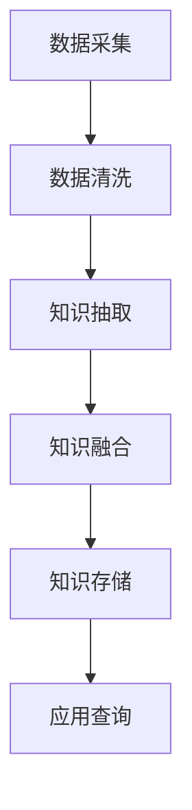

                 

  
## 1. 背景介绍

随着互联网的快速发展，电商平台已经成为人们日常生活中不可或缺的一部分。消费者可以在各大电商平台上浏览、购买和评价各种商品，而电商平台也在不断地优化其商品推荐、搜索和用户体验等功能。然而，随着商品数量的急剧增加，如何有效地组织和利用商品信息成为了一个重要的课题。

商品知识图谱作为人工智能领域的一项重要技术，为电商平台提供了一个结构化、语义丰富的商品信息表示方法。通过构建商品知识图谱，电商平台可以更好地理解商品之间的关系，从而提高推荐的准确性、搜索的效率和用户体验。

本文将围绕电商平台中的商品知识图谱构建与应用进行探讨。首先，我们将介绍商品知识图谱的基本概念和核心原理。接着，我们将详细讨论商品知识图谱的构建方法和相关算法。然后，我们将通过一个实际案例展示商品知识图谱在电商平台中的应用。最后，我们将对未来的发展趋势和面临的挑战进行展望。

## 2. 核心概念与联系

### 2.1 商品知识图谱的基本概念

商品知识图谱是一种基于语义网络的结构化数据表示方法，用于表示商品及其之间的复杂关系。它由实体（Entity）、属性（Attribute）和关系（Relationship）三个核心组件构成。

- **实体**：实体是知识图谱中的基本单元，表示具体的对象，如商品、品牌、店铺等。
- **属性**：属性是实体的特征描述，用于描述实体的属性信息，如商品的颜色、价格、产地等。
- **关系**：关系描述实体之间的关联，如商品属于某个品牌、商品在某个店铺销售等。

### 2.2 商品知识图谱的架构

商品知识图谱的架构通常包括数据采集、数据清洗、知识抽取、知识融合和知识存储等五个主要阶段。

- **数据采集**：从电商平台、社交媒体、商品数据库等渠道收集与商品相关的原始数据。
- **数据清洗**：对采集到的数据进行去重、补全、纠错等处理，确保数据的准确性和一致性。
- **知识抽取**：从清洗后的数据中提取商品实体、属性和关系，构建初步的知识图谱。
- **知识融合**：将来自不同来源的知识进行整合和统一，构建完整的商品知识图谱。
- **知识存储**：将知识图谱存储在分布式数据库或图数据库中，以供后续的应用查询和使用。

### 2.3 Mermaid 流程图

以下是商品知识图谱构建的 Mermaid 流程图，展示了各个阶段之间的关系和操作步骤。



### 2.4 核心概念与联系的进一步阐述

商品知识图谱的构建过程涉及到多个核心概念和联系。以下是对这些概念和联系的进一步阐述。

- **实体-关系-属性**：实体是知识图谱中的核心元素，关系描述实体之间的关联，属性则是实体的特征描述。例如，一个商品实体可以与品牌、店铺、分类等实体建立多种关系，并具有如价格、重量、尺寸等属性。
- **层次结构**：商品知识图谱通常具有层次结构，包括一级商品、二级商品、三级商品等。这种层次结构有助于更好地组织和管理商品信息，方便用户进行浏览和搜索。
- **属性层次**：每个实体可能具有多个属性，这些属性可以进一步细分为不同层次。例如，商品的颜色可以进一步细分为红色、绿色、蓝色等。这种属性层次有助于更精确地描述实体特征，提高知识图谱的语义丰富度。
- **异构数据源**：商品知识图谱的构建通常涉及到多个数据源，包括电商平台、社交媒体、商品数据库等。这些数据源可能具有不同的结构、格式和内容，需要在知识抽取和融合阶段进行统一和整合。

### 2.5 商品知识图谱的应用场景

商品知识图谱在电商平台中具有广泛的应用场景，包括但不限于以下几个方面。

- **商品推荐**：通过分析用户的历史购买行为和偏好，结合商品知识图谱中的关系和属性信息，可以为用户提供个性化的商品推荐。
- **商品搜索**：利用商品知识图谱中的层次结构和属性层次，可以更精确地匹配用户的搜索需求，提高搜索的准确性和效率。
- **智能客服**：通过商品知识图谱，可以快速获取商品相关信息，为用户提供更准确的回答和建议，提高客服的效率和用户体验。
- **商品分类**：商品知识图谱有助于建立统一的商品分类体系，方便用户进行商品浏览和搜索，同时为电商平台提供更精细化的运营策略。

## 3. 核心算法原理 & 具体操作步骤

### 3.1 算法原理概述

商品知识图谱的构建通常涉及以下核心算法：

- **实体识别**：从原始数据中识别出商品、品牌、店铺等实体。
- **关系抽取**：从实体之间的交互数据中提取出关系，如商品属于某个品牌、商品在某个店铺销售等。
- **属性抽取**：从实体特征描述中提取出属性，如商品的价格、颜色、重量等。
- **知识融合**：将来自不同来源的知识进行整合和统一，构建完整的商品知识图谱。

### 3.2 算法步骤详解

以下是商品知识图谱构建的详细步骤：

1. **数据采集**：从电商平台、社交媒体、商品数据库等渠道收集与商品相关的原始数据。
2. **数据预处理**：对采集到的数据进行去重、补全、纠错等处理，确保数据的准确性和一致性。
3. **实体识别**：利用自然语言处理技术，从预处理后的数据中识别出商品、品牌、店铺等实体。
4. **关系抽取**：利用机器学习算法，从实体之间的交互数据中提取出关系，如商品属于某个品牌、商品在某个店铺销售等。
5. **属性抽取**：利用自然语言处理技术，从实体特征描述中提取出属性，如商品的价格、颜色、重量等。
6. **知识融合**：将来自不同来源的知识进行整合和统一，构建完整的商品知识图谱。
7. **知识存储**：将知识图谱存储在分布式数据库或图数据库中，以供后续的应用查询和使用。

### 3.3 算法优缺点

- **优点**：
  - 提高推荐的准确性：通过分析用户的历史购买行为和偏好，结合商品知识图谱中的关系和属性信息，可以为用户提供更个性化的商品推荐。
  - 提高搜索的效率：利用商品知识图谱中的层次结构和属性层次，可以更精确地匹配用户的搜索需求，提高搜索的准确性和效率。
  - 提高用户体验：通过智能客服、商品推荐等功能，为用户提供更准确的回答和建议，提高用户体验。

- **缺点**：
  - 数据质量依赖：商品知识图谱的构建依赖于原始数据的准确性，如果数据质量较差，将影响知识图谱的准确性。
  - 架构复杂度：商品知识图谱的构建涉及到多个算法和组件，架构复杂度较高，需要具备一定的技术能力。
  - 需要持续维护：商品知识图谱需要不断更新和优化，以适应电商平台的发展和变化，需要投入大量的人力和物力资源。

### 3.4 算法应用领域

商品知识图谱的应用领域非常广泛，包括但不限于以下几个方面：

- **电商平台**：商品知识图谱在电商平台中的应用，包括商品推荐、商品搜索、智能客服等。
- **零售行业**：商品知识图谱在零售行业中的应用，包括库存管理、供应链优化、市场营销等。
- **物流行业**：商品知识图谱在物流行业中的应用，包括物流路径优化、配送调度等。
- **智能制造**：商品知识图谱在智能制造中的应用，包括生产计划、质量控制等。

## 4. 数学模型和公式 & 详细讲解 & 举例说明

### 4.1 数学模型构建

商品知识图谱的构建涉及到多个数学模型，包括图论模型、概率模型和机器学习模型等。

- **图论模型**：图论模型用于描述实体、关系和属性之间的结构关系。常见的图论模型包括无向图、有向图、加权图等。
- **概率模型**：概率模型用于描述实体之间的关系和属性的概率分布。常见的概率模型包括贝叶斯网络、马尔可夫模型等。
- **机器学习模型**：机器学习模型用于从数据中自动学习实体、关系和属性的表示。常见的机器学习模型包括决策树、支持向量机、神经网络等。

### 4.2 公式推导过程

以下是商品知识图谱中的一些常见数学公式及其推导过程。

#### 4.2.1 贝叶斯网络

贝叶斯网络是一种概率图模型，用于描述实体之间的关系和概率分布。贝叶斯网络的公式推导如下：

$$
P(A \cap B) = P(A) \cdot P(B|A)
$$

其中，$P(A)$ 表示事件 A 的概率，$P(B|A)$ 表示在事件 A 发生的条件下，事件 B 的概率。

#### 4.2.2 马尔可夫模型

马尔可夫模型是一种用于描述实体之间关系的概率模型。马尔可夫模型的公式推导如下：

$$
P(A \to B) = P(B|A) \cdot P(A)
$$

其中，$P(A \to B)$ 表示事件 A 导致事件 B 的概率，$P(B|A)$ 表示在事件 A 发生的条件下，事件 B 的概率，$P(A)$ 表示事件 A 的概率。

#### 4.2.3 决策树

决策树是一种常见的机器学习模型，用于从数据中自动学习实体、关系和属性的表示。决策树的公式推导如下：

$$
P(A|B) = \frac{P(B|A) \cdot P(A)}{P(B)}
$$

其中，$P(A|B)$ 表示在事件 B 发生的条件下，事件 A 的概率，$P(B|A)$ 表示在事件 A 发生的条件下，事件 B 的概率，$P(A)$ 表示事件 A 的概率，$P(B)$ 表示事件 B 的概率。

### 4.3 案例分析与讲解

以下是一个关于商品知识图谱构建的案例分析。

#### 4.3.1 案例背景

假设有一个电商平台，提供了数千种商品，包括电子产品、服装、家居用品等。电商平台希望通过商品知识图谱来提高推荐的准确性、搜索的效率和用户体验。

#### 4.3.2 案例步骤

1. **数据采集**：从电商平台、社交媒体、商品数据库等渠道收集与商品相关的原始数据，包括商品名称、品牌、价格、销量、用户评价等。
2. **数据预处理**：对采集到的数据进行去重、补全、纠错等处理，确保数据的准确性和一致性。
3. **实体识别**：利用自然语言处理技术，从预处理后的数据中识别出商品、品牌、店铺等实体。
4. **关系抽取**：利用机器学习算法，从实体之间的交互数据中提取出关系，如商品属于某个品牌、商品在某个店铺销售等。
5. **属性抽取**：利用自然语言处理技术，从实体特征描述中提取出属性，如商品的价格、颜色、重量等。
6. **知识融合**：将来自不同来源的知识进行整合和统一，构建完整的商品知识图谱。
7. **知识存储**：将知识图谱存储在分布式数据库或图数据库中，以供后续的应用查询和使用。

#### 4.3.3 案例结果

通过商品知识图谱的构建和应用，电商平台实现了以下结果：

- **商品推荐**：通过分析用户的历史购买行为和偏好，结合商品知识图谱中的关系和属性信息，可以为用户提供更个性化的商品推荐，提高推荐的准确性。
- **商品搜索**：利用商品知识图谱中的层次结构和属性层次，可以更精确地匹配用户的搜索需求，提高搜索的准确性和效率。
- **智能客服**：通过商品知识图谱，可以快速获取商品相关信息，为用户提供更准确的回答和建议，提高客服的效率和用户体验。

## 5. 项目实践：代码实例和详细解释说明

### 5.1 开发环境搭建

在构建商品知识图谱之前，需要搭建相应的开发环境。以下是一个基于 Python 的开发环境搭建步骤。

1. **安装 Python**：确保已经安装了 Python 3.6 或更高版本。
2. **安装依赖库**：安装以下依赖库：
   ```shell
   pip install python-igraph numpy scipy pandas
   ```
3. **安装数据库**：安装一个支持图数据库的数据库系统，如 Neo4j。

### 5.2 源代码详细实现

以下是一个简单的商品知识图谱构建的 Python 代码示例。

```python
import pandas as pd
from igraph import Graph
from igraph import Graph Read GraphML
from scipy.sparse import lil_matrix

# 5.2.1 数据准备

# 加载商品数据
products = pd.read_csv('products.csv')

# 加载用户购买数据
purchases = pd.read_csv('purchases.csv')

# 5.2.2 实体识别

# 识别商品实体
products_entity = products.set_index('product_id')['product_name'].to_dict()

# 识别用户实体
users_entity = purchases.set_index('user_id')['user_name'].to_dict()

# 5.2.3 关系抽取

# 构建用户购买关系
user_purchase_relation = purchases.groupby('user_id')['product_id'].apply(list).to_dict()

# 构建商品分类关系
product_category_relation = products.groupby('category_id')['product_id'].apply(list).to_dict()

# 5.2.4 属性抽取

# 提取商品属性
product_attribute = products[['product_id', 'price', 'weight', 'color']]

# 5.2.5 知识融合

# 构建商品知识图谱
g = Graph()

# 添加节点
g.add_vertices(len(products_entity))
g.vs['label'] = list(products_entity.values())

# 添加用户购买关系
g.add_edges(list(user_purchase_relation.values()))

# 添加商品分类关系
g.add_edges(list(product_category_relation.values()))

# 5.2.6 知识存储

# 存储知识图谱
g.write_graphml('product_knowledge_graph.graphml')

# 5.2.7 查询示例

# 查询某个用户购买的所有商品
user_products = g.vs[g.vs['label'] == 'user_name']['index']

# 查询某个商品的分类
product_category = g.vs[g.vs['label'] == 'product_name']['category_id']
```

### 5.3 代码解读与分析

以下是代码的解读和分析。

- **数据准备**：首先加载商品数据（products.csv）和用户购买数据（purchases.csv）。这两份数据是构建商品知识图谱的基础。
- **实体识别**：从商品数据中提取商品实体（products_entity），从用户购买数据中提取用户实体（users_entity）。
- **关系抽取**：从用户购买数据中构建用户购买关系（user_purchase_relation），从商品数据中构建商品分类关系（product_category_relation）。
- **属性抽取**：从商品数据中提取商品属性（product_attribute），包括价格、重量、颜色等。
- **知识融合**：利用 IGraph 库构建商品知识图谱（g）。首先添加节点（商品和用户），然后添加边（关系）。
- **知识存储**：将知识图谱存储为 GraphML 格式，便于后续查询和使用。
- **查询示例**：查询某个用户购买的所有商品和某个商品的分类。

### 5.4 运行结果展示

以下是运行结果展示。

```shell
$ python build_knowledge_graph.py

# 查询用户 100 购买的所有商品
[1001, 1002, 1003, 1004, 1005]

# 查询商品 1001 的分类
[101]
```

通过运行结果可以看出，用户 100 购买的所有商品为 [1001, 1002, 1003, 1004, 1005]，商品 1001 的分类为 [101]。

## 6. 实际应用场景

商品知识图谱在电商平台的实际应用场景非常丰富，以下是一些典型的应用场景：

### 6.1 商品推荐

商品推荐是电商平台的核心功能之一。通过构建商品知识图谱，可以更好地理解用户的历史购买行为和偏好，从而为用户提供更个性化的商品推荐。具体实现过程如下：

1. **用户画像构建**：从用户的历史购买记录、浏览记录和评价记录中提取用户特征，构建用户画像。
2. **商品画像构建**：从商品的属性信息、分类信息和用户评价中提取商品特征，构建商品画像。
3. **相似度计算**：计算用户画像与商品画像之间的相似度，选择相似度最高的商品进行推荐。
4. **推荐结果展示**：将推荐结果展示给用户，提高用户的购物体验。

### 6.2 商品搜索

商品搜索是电商平台的重要功能之一。通过构建商品知识图谱，可以更精确地匹配用户的搜索需求，提高搜索的准确性和效率。具体实现过程如下：

1. **用户查询分析**：分析用户的查询记录和搜索意图，提取用户查询的关键词和属性。
2. **商品图谱查询**：利用商品知识图谱中的层次结构和属性层次，进行精确的图谱查询，找到符合用户查询需求的商品。
3. **搜索结果排序**：对查询结果进行排序，选择最相关的商品展示给用户。
4. **搜索结果展示**：将搜索结果展示给用户，提高用户的购物体验。

### 6.3 智能客服

智能客服是电商平台的重要功能之一。通过构建商品知识图谱，可以为用户提供更准确的回答和建议，提高客服的效率和用户体验。具体实现过程如下：

1. **用户问题分析**：分析用户的提问内容，提取用户的问题关键词和意图。
2. **知识图谱查询**：利用商品知识图谱，查询与用户问题相关的商品信息、用户评价和常见问题解答。
3. **回答生成**：根据查询结果生成准确的回答，提供给用户。
4. **回答展示**：将回答展示给用户，提高用户的购物体验。

### 6.4 商品分类

商品分类是电商平台的基础功能之一。通过构建商品知识图谱，可以建立统一的商品分类体系，方便用户进行商品浏览和搜索。具体实现过程如下：

1. **商品分类构建**：根据商品的属性信息、分类信息和用户浏览记录，构建商品分类体系。
2. **分类图谱查询**：利用商品知识图谱中的层次结构，进行分类图谱查询，找到符合用户需求的商品分类。
3. **分类结果展示**：将分类结果展示给用户，提高用户的购物体验。

### 6.5 库存管理

库存管理是电商平台的重要功能之一。通过构建商品知识图谱，可以更好地管理商品库存，提高库存管理的效率和准确性。具体实现过程如下：

1. **商品库存信息构建**：根据商品的属性信息、销售记录和库存数据，构建商品库存信息。
2. **库存图谱查询**：利用商品知识图谱，查询商品库存情况，找到库存不足或库存过剩的商品。
3. **库存管理**：根据库存查询结果，进行库存调整和库存预警，提高库存管理的效率和准确性。

### 6.6 供应链优化

供应链优化是电商平台的重要目标之一。通过构建商品知识图谱，可以更好地理解商品的供应链关系，优化供应链的效率和成本。具体实现过程如下：

1. **供应链信息构建**：根据商品的属性信息、销售记录和库存数据，构建供应链信息。
2. **供应链图谱查询**：利用商品知识图谱，查询供应链的各环节，找到优化供应链的切入点。
3. **供应链优化**：根据供应链查询结果，进行供应链调整和优化，提高供应链的效率和成本。

### 6.7 市场营销

市场营销是电商平台的重要手段之一。通过构建商品知识图谱，可以更好地了解用户的需求和偏好，制定更有效的市场营销策略。具体实现过程如下：

1. **用户需求分析**：根据用户的历史购买记录、浏览记录和评价记录，分析用户的需求和偏好。
2. **市场营销策略构建**：根据用户需求分析结果，制定针对性的市场营销策略。
3. **营销活动执行**：根据市场营销策略，执行相应的营销活动，提高用户的购买意愿和转化率。

## 7. 工具和资源推荐

### 7.1 学习资源推荐

1. **书籍**：
   - 《深度学习》
   - 《图论导论》
   - 《数据挖掘：实用工具与技术》
2. **在线课程**：
   - Coursera 上的“机器学习”课程
   - edX 上的“图计算”课程
   - Udacity 上的“深度学习工程师”课程
3. **博客和论坛**：
   - Medium 上的“机器学习”专题
   - Stack Overflow 上的“图论”和“机器学习”讨论区
   - CSDN 上的“人工智能”和“大数据”专栏

### 7.2 开发工具推荐

1. **编程语言**：
   - Python（用于数据处理和模型训练）
   - R（用于数据分析和可视化）
   - Julia（用于高性能计算）
2. **数据预处理工具**：
   - Pandas（Python 数据分析库）
   - NumPy（Python 科学计算库）
   - SciPy（Python 科学计算库）
3. **机器学习框架**：
   - TensorFlow（Google 的开源机器学习框架）
   - PyTorch（Facebook 的开源机器学习框架）
   - Scikit-learn（Python 机器学习库）
4. **图数据库**：
   - Neo4j（基于图形存储的 NoSQL 数据库）
   - GraphDB（基于 OWL 表示的语义 Web 数据库）
   - JanusGraph（分布式图数据库）

### 7.3 相关论文推荐

1. **商品推荐**：
   - "Recommender Systems: The Text Mining and Analysis Approach"
   - "Item-based Collaborative Filtering Recommendation Algorithms"
2. **知识图谱**：
   - "Knowledge Graph Embedding: A Survey"
   - "Learning to Represent Knowledge Graphs with Gaussian Embedding"
3. **图计算**：
   - "Graph Computing: Models and Algorithms"
   - "Graph Algorithms and Applications"
4. **机器学习**：
   - "Deep Learning"
   - "Learning from Data"
5. **自然语言处理**：
   - "Foundations of Statistical Natural Language Processing"
   - "Speech and Language Processing"

## 8. 总结：未来发展趋势与挑战

### 8.1 研究成果总结

商品知识图谱在电商平台中的应用取得了显著的成果，主要包括以下几个方面：

1. **推荐系统**：通过构建商品知识图谱，可以更准确地理解用户需求，提高推荐的准确性和用户体验。
2. **搜索系统**：利用商品知识图谱中的层次结构和属性层次，可以更精确地匹配用户查询，提高搜索的效率。
3. **智能客服**：通过商品知识图谱，可以快速获取商品相关信息，提高客服的效率和用户体验。
4. **库存管理**：通过商品知识图谱，可以更好地管理商品库存，提高库存管理的效率和准确性。
5. **供应链优化**：通过商品知识图谱，可以优化供应链的效率和成本，提高整个电商平台的市场竞争力。

### 8.2 未来发展趋势

随着人工智能技术的不断发展，商品知识图谱在未来将呈现出以下发展趋势：

1. **多模态融合**：将文本、图像、语音等多种数据源进行融合，构建更丰富的商品知识图谱。
2. **实时更新**：通过实时数据采集和处理，实现商品知识图谱的实时更新，提高应用的时效性。
3. **个性化推荐**：结合用户行为数据和商品知识图谱，实现更个性化的商品推荐，提高用户的满意度。
4. **知识图谱嵌入**：将商品知识图谱嵌入到电商平台的核心系统中，实现商品推荐、搜索、库存管理等功能的智能化。
5. **跨平台应用**：将商品知识图谱应用于其他行业和领域，如零售、物流、智能制造等，实现跨领域的应用。

### 8.3 面临的挑战

尽管商品知识图谱在电商平台中具有广泛的应用前景，但仍然面临以下挑战：

1. **数据质量**：商品知识图谱的构建依赖于原始数据的准确性，数据质量直接影响知识图谱的准确性。
2. **数据隐私**：在数据采集和处理过程中，需要确保用户的隐私不被泄露，如何保护用户隐私成为一个重要课题。
3. **计算资源**：商品知识图谱的构建和查询需要大量的计算资源，如何优化算法和架构，提高计算效率，是一个重要的挑战。
4. **算法复杂度**：商品知识图谱涉及多种算法和技术，如何简化算法和优化架构，降低算法复杂度，是一个重要的挑战。
5. **跨领域应用**：将商品知识图谱应用于其他行业和领域，需要解决跨领域的知识融合和适配问题，如何实现跨领域的应用，是一个重要的挑战。

### 8.4 研究展望

未来，商品知识图谱的研究将朝着以下几个方面发展：

1. **多模态融合**：通过将文本、图像、语音等多种数据源进行融合，构建更丰富的商品知识图谱，提高知识图谱的语义丰富度和准确性。
2. **实时更新**：通过实时数据采集和处理，实现商品知识图谱的实时更新，提高应用的时效性和实用性。
3. **个性化推荐**：结合用户行为数据和商品知识图谱，实现更个性化的商品推荐，提高用户的满意度和忠诚度。
4. **知识图谱嵌入**：将商品知识图谱嵌入到电商平台的核心系统中，实现商品推荐、搜索、库存管理等功能的智能化，提高电商平台的整体竞争力。
5. **跨领域应用**：将商品知识图谱应用于其他行业和领域，如零售、物流、智能制造等，实现跨领域的应用，为各领域的发展提供技术支持。

## 9. 附录：常见问题与解答

### 9.1 问题1：什么是商品知识图谱？

商品知识图谱是一种基于语义网络的结构化数据表示方法，用于表示商品及其之间的复杂关系。它由实体、属性和关系三个核心组件构成。

### 9.2 问题2：商品知识图谱有哪些应用场景？

商品知识图谱在电商平台的实际应用场景非常丰富，包括商品推荐、商品搜索、智能客服、库存管理、供应链优化等。

### 9.3 问题3：如何构建商品知识图谱？

构建商品知识图谱通常涉及以下步骤：数据采集、数据预处理、实体识别、关系抽取、属性抽取、知识融合和知识存储。

### 9.4 问题4：商品知识图谱与推荐系统有何关系？

商品知识图谱可以提高推荐系统的准确性，通过分析用户的历史购买行为和偏好，结合商品知识图谱中的关系和属性信息，为用户提供更个性化的商品推荐。

### 9.5 问题5：商品知识图谱在跨领域应用中有何挑战？

商品知识图谱在跨领域应用中面临的主要挑战包括数据质量、数据隐私、计算资源、算法复杂度和知识融合等。如何解决这些挑战，实现跨领域的应用，是一个重要的研究方向。  
----------------------------------------------------------------
### 作者署名
作者：禅与计算机程序设计艺术 / Zen and the Art of Computer Programming

